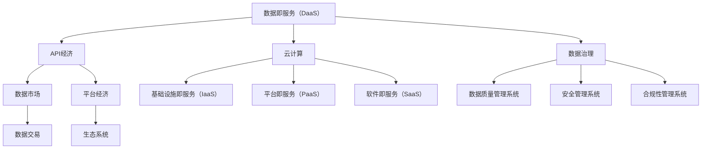

                 

# 数据即服务：API经济下的新型数据交易模式

> **关键词**：数据服务、API经济、数据交易、数据即服务、API接口、数据市场、平台经济、云计算、数据治理

> **摘要**：本文深入探讨了数据即服务（Data as a Service, DaaS）这一新型数据交易模式。在API经济蓬勃发展的今天，数据服务成为了企业创新和业务增长的核心驱动力。通过详细分析数据即服务的概念、原理、架构及其核心算法原理，本文揭示了DaaS在API经济中的重要地位。此外，文章还通过实际项目案例，展示了数据即服务在实际应用中的操作步骤和具体实施方法，为读者提供了宝贵的实践经验和参考。最后，文章总结了DaaS的未来发展趋势与挑战，并推荐了相关学习资源和工具，为读者进一步学习和实践提供了指导。

## 1. 背景介绍

### 1.1 目的和范围

本文旨在深入探讨数据即服务（DaaS）这一新兴的数据交易模式，分析其在API经济中的地位和作用。通过详细解读数据即服务的核心概念、原理和架构，本文希望能够帮助读者理解DaaS的基本运作机制，并掌握其实际应用的方法和技巧。

本文的研究范围包括：

- 数据即服务（DaaS）的定义和核心概念
- DaaS在API经济中的地位和作用
- DaaS的基本架构和核心算法原理
- DaaS的实际应用案例和操作步骤
- DaaS的未来发展趋势和挑战

### 1.2 预期读者

本文预期读者为以下几类：

- 对数据服务、API经济和数据交易感兴趣的技术人员和开发者
- 涉足API经济的企业家和创业者
- 对云计算和数据治理有一定了解的专业人士
- 计算机科学、信息技术及相关专业的大学生和研究生

### 1.3 文档结构概述

本文将按照以下结构进行撰写：

- 引言：介绍数据即服务（DaaS）的概念和背景
- 背景介绍：详细描述DaaS在API经济中的地位和作用
- 核心概念与联系：分析DaaS的核心概念和原理
- 核心算法原理 & 具体操作步骤：阐述DaaS的核心算法和具体操作步骤
- 数学模型和公式 & 详细讲解 & 举例说明：介绍DaaS的数学模型和公式，并给出实际案例
- 项目实战：提供实际项目案例和详细解释
- 实际应用场景：分析DaaS在不同领域的应用
- 工具和资源推荐：推荐相关学习资源和开发工具
- 总结：总结DaaS的未来发展趋势和挑战
- 附录：常见问题与解答
- 扩展阅读 & 参考资料：提供更多相关阅读资料

### 1.4 术语表

#### 1.4.1 核心术语定义

- **数据即服务（Data as a Service, DaaS）**：一种将数据作为服务提供给用户的新型数据交易模式，通过API接口实现数据的获取、处理和共享。
- **API经济**：基于API接口进行数据和服务交易的经济模式，通过API接口实现不同系统和平台之间的互联互通。
- **数据市场**：一个集中化的数据交易平台，提供各种类型的数据产品和服务，供用户购买和使用。
- **平台经济**：一种以平台为核心，连接供需双方，实现资源共享和交易的经济模式。
- **云计算**：一种通过互联网提供计算资源、存储资源和网络资源的服务模式，实现计算资源的弹性分配和按需使用。
- **数据治理**：对数据生命周期进行管理和控制的一系列活动和流程，确保数据的质量、安全性和合规性。

#### 1.4.2 相关概念解释

- **API接口**：应用程序接口（Application Programming Interface），一种允许不同软件系统之间进行交互和通信的协议和规范。
- **数据服务**：将数据作为服务提供给用户的一种模式，包括数据存储、数据检索、数据分析和数据可视化等。
- **数据交易**：在数据市场中进行数据产品和服务交易的流程，包括数据的采购、销售和租赁等。
- **API经济**：基于API接口进行数据和服务交易的经济模式，通过API接口实现不同系统和平台之间的互联互通。

#### 1.4.3 缩略词列表

- DaaS：数据即服务（Data as a Service）
- API：应用程序接口（Application Programming Interface）
- API经济：基于API接口进行数据和服务交易的经济模式
- 数据市场：集中化的数据交易平台，提供各种类型的数据产品和服务
- 平台经济：以平台为核心，连接供需双方，实现资源共享和交易的经济模式
- 云计算：通过互联网提供计算资源、存储资源和网络资源的服务模式
- 数据治理：对数据生命周期进行管理和控制的一系列活动和流程

## 2. 核心概念与联系

### 2.1 数据即服务（DaaS）

数据即服务（DaaS）是一种将数据作为服务提供给用户的新型数据交易模式。在这种模式下，数据不再是传统的企业资产，而是一种可供交易和消费的资源。通过API接口，用户可以方便地获取、处理和共享数据，实现数据价值的最大化。

#### DaaS的基本原理

DaaS的基本原理可以概括为以下几点：

1. **数据存储**：数据服务提供商将数据存储在云端或其他数据中心，确保数据的安全性和可靠性。
2. **API接口**：数据服务提供商提供一组API接口，供用户调用和操作数据。API接口封装了底层的数据存储和处理逻辑，简化了用户的使用流程。
3. **数据检索**：用户通过API接口检索所需的数据，数据服务提供商根据用户的请求实时返回数据。
4. **数据处理**：用户可以通过API接口对数据进行处理，包括数据清洗、数据转换和数据聚合等。
5. **数据共享**：用户可以将获取到的数据与其他用户或系统共享，实现数据的二次利用。

#### DaaS的核心架构

DaaS的核心架构通常包括以下几个关键组件：

1. **数据存储**：负责存储和管理数据，包括关系型数据库、NoSQL数据库、分布式存储系统等。
2. **API接口**：提供数据检索、数据处理和数据共享等功能，是用户与数据服务提供商之间的交互接口。
3. **数据处理引擎**：负责对数据进行清洗、转换和聚合等处理操作，提供高效的数据处理能力。
4. **数据安全**：确保数据的机密性、完整性和可用性，包括数据加密、访问控制、数据备份和恢复等。
5. **监控与运维**：对DaaS平台进行实时监控和运维，确保平台的稳定运行和高效服务。

### 2.2 API经济

API经济是一种基于API接口进行数据和服务交易的经济模式。在API经济中，各种系统和平台通过API接口实现互联互通，形成了一个庞大的生态系统。API经济具有以下特点：

1. **互联互通**：通过API接口，不同系统和平台之间可以轻松实现数据和服务交换，打破了信息孤岛。
2. **灵活性**：API经济为企业和开发者提供了丰富的选择，可以根据实际需求灵活调用各种服务和数据。
3. **高效性**：通过API接口，数据和服务传输速度快，响应时间短，提高了业务处理效率。
4. **创新性**：API经济激发了企业和开发者的创新活力，推动了新的应用场景和商业模式的出现。

#### API经济的核心架构

API经济的核心架构通常包括以下几个关键组件：

1. **API网关**：负责接收外部请求，路由到相应的后端服务，并提供安全保护、负载均衡等功能。
2. **后端服务**：提供具体的业务功能，包括数据服务、功能服务等，通过API接口与外部系统交互。
3. **数据存储**：存储和管理业务数据，包括关系型数据库、NoSQL数据库、分布式存储系统等。
4. **数据处理**：对业务数据进行处理，包括数据清洗、数据转换和数据聚合等。
5. **监控与运维**：对API经济平台进行实时监控和运维，确保平台的稳定运行和高效服务。

### 2.3 数据市场

数据市场是一个集中化的数据交易平台，提供各种类型的数据产品和服务，供用户购买和使用。数据市场具有以下特点：

1. **多样化**：数据市场涵盖了各类数据资源，包括公共数据、商业数据、行业数据等，满足不同用户的需求。
2. **交易化**：数据市场为数据产品和服务提供了交易场所，实现了数据的商业化和市场化。
3. **规范化**：数据市场制定了统一的标准和规范，确保数据的质量、安全和合规性。
4. **便捷性**：数据市场为用户提供了一站式的数据服务，降低了用户获取和使用数据的门槛。

#### 数据市场的核心架构

数据市场的核心架构通常包括以下几个关键组件：

1. **数据供应商**：提供各种类型的数据产品和服务，包括原始数据、数据集、数据服务包等。
2. **数据采购者**：购买和使用数据产品和服务，包括企业、开发者、研究人员等。
3. **交易平台**：提供数据交易的中介服务，包括数据定价、交易结算、订单管理等。
4. **数据安全**：确保数据在交易过程中的机密性、完整性和可用性，包括数据加密、访问控制、数据备份和恢复等。

### 2.4 平台经济

平台经济是一种以平台为核心，连接供需双方，实现资源共享和交易的经济模式。平台经济具有以下特点：

1. **网络效应**：平台通过连接供需双方，实现资源的共享和整合，形成网络效应，提高平台的整体价值。
2. **双边市场**：平台经济通常涉及两个或多个参与方，平台通过同时满足不同参与方的需求，实现市场规模的扩大。
3. **生态系统**：平台经济形成了一个生态系统，包括平台运营商、供应商、采购商、用户等，各方之间相互依赖、协同发展。
4. **创新驱动**：平台经济激发了各方的创新活力，推动了新的产品、服务、商业模式的出现。

#### 平台经济的核心架构

平台经济的核心架构通常包括以下几个关键组件：

1. **平台运营商**：负责平台的规划、建设、运营和维护，提供基础设施和服务。
2. **供应商**：提供各种产品和服务，包括数据供应商、功能服务供应商等。
3. **采购商**：购买和使用产品和服务，包括企业、开发者、个人用户等。
4. **生态系统**：包括平台运营商、供应商、采购商、用户等，各方之间相互依赖、协同发展。

### 2.5 云计算

云计算是一种通过互联网提供计算资源、存储资源和网络资源的服务模式。云计算具有以下特点：

1. **弹性伸缩**：云计算可以根据需求自动扩展或缩减计算资源，实现资源的动态调整。
2. **按需使用**：用户可以根据实际需求购买和使用计算资源，实现资源的按需分配和计费。
3. **高可用性**：云计算通过分布式架构和容错机制，提供高可用性和高可靠性。
4. **灵活性**：云计算提供丰富的服务和工具，满足不同用户的需求和场景。

#### 云计算的核心架构

云计算的核心架构通常包括以下几个关键组件：

1. **基础设施即服务（IaaS）**：提供虚拟化的计算资源、存储资源和网络资源，供用户使用。
2. **平台即服务（PaaS）**：提供开发、运行和管理应用程序的平台，供开发者使用。
3. **软件即服务（SaaS）**：提供应用程序和解决方案，供用户直接使用。
4. **数据存储**：存储和管理用户数据，包括关系型数据库、NoSQL数据库、分布式存储系统等。
5. **数据处理**：对用户数据进行处理和分析，包括数据清洗、数据转换和数据挖掘等。

### 2.6 数据治理

数据治理是一系列活动和流程，用于管理和控制数据生命周期，确保数据的质量、安全性和合规性。数据治理具有以下特点：

1. **质量管理**：通过数据清洗、数据整合和数据标准化等手段，提高数据的质量和准确性。
2. **安全管理**：通过数据加密、访问控制和数据备份等手段，确保数据的机密性、完整性和可用性。
3. **合规性**：遵循相关法律法规和标准，确保数据的使用和处理符合合规要求。
4. **协同管理**：通过建立数据治理组织和流程，实现数据管理的协同化和系统化。

#### 数据治理的核心架构

数据治理的核心架构通常包括以下几个关键组件：

1. **数据质量管理系统**：负责监控和管理数据质量，包括数据清洗、数据整合和数据标准化等。
2. **安全管理系统**：负责数据的安全保护，包括数据加密、访问控制和数据备份等。
3. **合规性管理系统**：负责监控和管理数据的合规性，包括数据使用、数据存储和数据传输等。
4. **数据治理组织**：负责制定和实施数据治理政策和流程，包括数据质量管理、安全管理和合规性管理。
5. **数据治理工具**：提供数据治理相关的工具和技术，包括数据清洗工具、数据加密工具和数据备份工具等。

### 2.7 数据服务

数据服务是将数据作为服务提供给用户的一种模式，包括数据存储、数据检索、数据分析和数据可视化等。数据服务具有以下特点：

1. **存储服务**：提供数据存储和管理功能，包括关系型数据库、NoSQL数据库、分布式存储系统等。
2. **检索服务**：提供数据检索功能，包括关键字检索、模糊检索和复杂查询等。
3. **分析服务**：提供数据分析和挖掘功能，包括统计分析、机器学习和数据可视化等。
4. **可视化服务**：提供数据可视化功能，将数据以图表、图形和地图等形式展示给用户。

#### 数据服务的核心架构

数据服务的核心架构通常包括以下几个关键组件：

1. **数据存储**：负责存储和管理用户数据，包括关系型数据库、NoSQL数据库、分布式存储系统等。
2. **数据处理引擎**：负责对用户数据进行处理和分析，包括数据清洗、数据转换和数据挖掘等。
3. **数据检索引擎**：负责提供数据检索功能，包括关键字检索、模糊检索和复杂查询等。
4. **数据可视化引擎**：负责将数据以图表、图形和地图等形式展示给用户。

### 2.8 数据交易

数据交易是在数据市场中进行数据产品和服务交易的流程，包括数据的采购、销售和租赁等。数据交易具有以下特点：

1. **多样化**：数据市场提供了各种类型的数据产品和服务，满足不同用户的需求。
2. **交易化**：数据市场为数据交易提供了平台和中介服务，实现了数据的商业化和市场化。
3. **规范化**：数据市场制定了统一的标准和规范，确保数据交易的公平、公正和合规。
4. **便捷性**：数据市场为用户提供了一站式的数据交易服务，降低了用户获取和使用数据的门槛。

#### 数据交易的核心架构

数据交易的核心架构通常包括以下几个关键组件：

1. **交易平台**：提供数据交易的中介服务，包括数据定价、交易结算、订单管理等。
2. **数据供应商**：提供各种类型的数据产品和服务，包括原始数据、数据集、数据服务包等。
3. **数据采购者**：购买和使用数据产品和服务，包括企业、开发者、研究人员等。
4. **数据安全**：确保数据在交易过程中的机密性、完整性和可用性，包括数据加密、访问控制、数据备份和恢复等。

### 2.9 Mermaid流程图

为了更好地展示DaaS、API经济、数据市场、平台经济、云计算和数据治理等核心概念和联系，我们可以使用Mermaid流程图进行描述。以下是一个简单的Mermaid流程图示例：



通过以上Mermaid流程图，我们可以清晰地看到DaaS、API经济、数据市场、平台经济、云计算和数据治理等核心概念之间的联系和相互作用。

## 3. 核心算法原理 & 具体操作步骤

### 3.1 数据检索算法原理

数据检索算法是数据即服务（DaaS）的核心组成部分，它负责根据用户的请求快速检索出所需的数据。以下是数据检索算法的基本原理和具体操作步骤：

#### 基本原理

数据检索算法主要依赖于索引技术，通过对数据进行索引，提高检索效率。常见的索引技术包括B树索引、哈希索引和全文索引等。以下是B树索引的基本原理：

1. **B树索引**：B树是一种自平衡的多路查找树，每个节点可以存储多个键值和指向子节点的指针。B树的每个节点可以分为内部节点和叶子节点，内部节点存储键值和子节点指针，叶子节点存储实际的数据。
2. **哈希索引**：哈希索引通过哈希函数将键值映射到索引表中的位置，直接访问数据。哈希索引的优点是检索速度快，但存在哈希冲突的问题。
3. **全文索引**：全文索引通过对文本内容进行分词和索引，实现全文搜索。全文索引适用于文本数据的检索，具有较高的检索效率和灵活性。

#### 具体操作步骤

1. **数据预处理**：将原始数据转换为适合索引的数据格式，包括数据清洗、去重、排序等操作。
2. **索引构建**：根据选择的数据检索算法，构建索引数据结构。例如，使用B树索引时，将数据插入到B树中，并维护树的结构平衡。
3. **数据检索**：用户提交检索请求，检索算法根据索引快速定位到数据位置，并返回数据。
4. **查询优化**：根据用户的查询模式和数据的分布情况，优化查询算法和索引结构，提高检索效率。

### 3.2 数据处理算法原理

数据处理算法负责对用户检索到的数据进行处理，包括数据清洗、数据转换和数据聚合等。以下是数据处理算法的基本原理和具体操作步骤：

#### 基本原理

数据处理算法通常包括以下几种：

1. **数据清洗**：数据清洗是指从原始数据中去除重复、错误、不完整或不一致的数据，提高数据的质量和准确性。数据清洗的方法包括去重、填补缺失值、纠正错误值等。
2. **数据转换**：数据转换是指将一种数据格式转换为另一种数据格式，以便进行后续处理或分析。数据转换的方法包括数据类型转换、数据映射、数据归一化等。
3. **数据聚合**：数据聚合是指对大量数据进行汇总和计算，提取出有用的信息和特征。数据聚合的方法包括统计计算、分类、聚类等。

#### 具体操作步骤

1. **数据读取**：从数据存储系统中读取用户需要处理的数据。
2. **数据清洗**：对数据执行清洗操作，去除重复、错误、不完整或不一致的数据。
3. **数据转换**：将数据转换为适合后续处理或分析的数据格式。
4. **数据聚合**：对数据进行统计计算、分类、聚类等操作，提取出有用的信息和特征。
5. **结果输出**：将处理后的数据输出到指定的存储系统或以其他方式提供给用户。

### 3.3 数据加密算法原理

数据加密算法是数据即服务（DaaS）中确保数据安全的重要手段，它负责对数据进行加密和解密，保护数据的机密性。以下是数据加密算法的基本原理和具体操作步骤：

#### 基本原理

数据加密算法通常包括以下几种：

1. **对称加密**：对称加密使用相同的密钥对数据进行加密和解密。常见的对称加密算法包括DES、AES等。
2. **非对称加密**：非对称加密使用一对密钥（公钥和私钥）对数据进行加密和解密。常见的非对称加密算法包括RSA、ECC等。
3. **哈希算法**：哈希算法用于生成数据的摘要，用于数据的完整性验证。常见的哈希算法包括MD5、SHA等。

#### 具体操作步骤

1. **密钥生成**：根据加密算法生成一对密钥（公钥和私钥），其中公钥用于加密，私钥用于解密。
2. **数据加密**：使用公钥对数据进行加密，生成密文。
3. **数据传输**：将密文传输到接收方。
4. **数据解密**：接收方使用私钥对密文进行解密，恢复原始数据。

### 3.4 数据权限控制算法原理

数据权限控制算法负责对数据访问权限进行管理，确保只有授权用户可以访问数据。以下是数据权限控制算法的基本原理和具体操作步骤：

#### 基本原理

数据权限控制算法通常包括以下几种：

1. **访问控制列表（ACL）**：访问控制列表是一种基于权限列表的数据权限控制方法，将用户权限与数据资源进行关联，实现对数据的访问控制。
2. **角色访问控制（RBAC）**：角色访问控制是一种基于角色和数据资源的关系进行访问控制的方法，将用户分为不同的角色，并定义每个角色的访问权限。
3. **基于属性的加密（ABE）**：基于属性的加密是一种基于属性和密钥的关系进行加密和解密的方法，只有满足特定属性要求的用户才能解密数据。

#### 具体操作步骤

1. **用户身份认证**：对用户进行身份认证，确定用户的身份和权限。
2. **权限控制**：根据用户的身份和权限，对数据访问请求进行控制，允许或拒绝访问。
3. **数据加密**：对敏感数据进行加密，确保数据在传输和存储过程中的安全性。
4. **数据解密**：在用户请求访问数据时，对加密的数据进行解密，恢复原始数据。

### 3.5 数据访问日志记录算法原理

数据访问日志记录算法负责记录用户对数据的访问行为，用于数据审计、安全分析和性能优化。以下是数据访问日志记录算法的基本原理和具体操作步骤：

#### 基本原理

数据访问日志记录算法通常包括以下几种：

1. **操作记录**：记录用户对数据的各种操作，包括查询、修改、删除等。
2. **访问时间**：记录用户访问数据的时间戳，用于数据访问监控和分析。
3. **访问来源**：记录用户访问数据的来源，包括IP地址、设备类型等。
4. **访问结果**：记录用户访问数据的成功或失败情况，用于数据异常监控和分析。

#### 具体操作步骤

1. **数据访问**：用户对数据进行访问操作，如查询、修改、删除等。
2. **日志记录**：记录用户访问操作的相关信息，包括操作记录、访问时间、访问来源、访问结果等。
3. **日志存储**：将日志数据存储在日志存储系统中，供后续分析和查询。
4. **日志分析**：对日志数据进行统计分析，发现数据访问的规律和异常情况，用于数据审计、安全分析和性能优化。

### 3.6 数据备份与恢复算法原理

数据备份与恢复算法负责确保数据的安全性和可靠性，防止数据丢失和损坏。以下是数据备份与恢复算法的基本原理和具体操作步骤：

#### 基本原理

数据备份与恢复算法通常包括以下几种：

1. **数据备份**：将数据复制到备份存储介质中，确保数据在意外情况下的可用性。
2. **数据恢复**：在数据丢失或损坏的情况下，从备份存储介质中恢复数据，恢复数据的完整性和一致性。

#### 具体操作步骤

1. **数据备份**：定期对数据进行备份，将备份的数据存储在安全的地方，如备份服务器、远程存储设备等。
2. **数据恢复**：在数据丢失或损坏的情况下，从备份存储介质中恢复数据。恢复过程中，要确保数据的完整性和一致性，避免数据丢失和损坏。
3. **数据验证**：在数据恢复后，对恢复的数据进行验证，确保数据的有效性和准确性。

### 3.7 伪代码示例

以下是一个简单的数据检索算法的伪代码示例，用于展示数据检索算法的基本原理和具体操作步骤：

```plaintext
// 数据检索算法伪代码

// 输入：用户查询关键字
// 输出：检索结果

1. 从数据存储系统中读取索引数据结构
2. 使用B树索引或哈希索引或全文索引，根据用户查询关键字进行索引查找
3. 如果找到匹配的索引，跳转到步骤4；否则，返回“未找到匹配数据”
4. 根据索引找到的数据位置，从数据存储系统中读取实际数据
5. 返回检索结果
```

通过以上伪代码示例，我们可以清晰地看到数据检索算法的基本原理和具体操作步骤。

## 4. 数学模型和公式 & 详细讲解 & 举例说明

### 4.1 数据检索算法的数学模型

数据检索算法的数学模型主要涉及索引技术和检索策略。以下是几种常见的数据检索算法的数学模型：

#### 4.1.1 B树索引

B树是一种平衡的多路查找树，其数学模型可以表示为：

$$
T = \text{BTree}(\text{keys}, \text{children})
$$

其中，`keys` 是B树中的键值数组，`children` 是指向子节点的指针数组。B树的每个节点可以存储多个键值和指向子节点的指针，满足以下条件：

1. 每个节点的键值数量大于等于 $\frac{t-1}{2}$ 且小于等于 $t$，其中 $t$ 是B树的阶。
2. 所有叶子节点具有相同的深度。
3. 非叶子节点中的键值按照升序排列。

#### 4.1.2 哈希索引

哈希索引的数学模型可以表示为：

$$
H = \text{HashFunction}(k)
$$

其中，`k` 是待检索的键值，`H` 是哈希函数。哈希函数将键值映射到索引表中的位置，满足以下条件：

1. 哈希函数是一个确定性的函数，对于相同的键值，哈希函数始终返回相同的结果。
2. 哈希函数应该尽可能地均匀分布键值，以减少哈希冲突的发生。

#### 4.1.3 全文索引

全文索引的数学模型可以表示为：

$$
\text{Index} = \text{InvertedIndex}(w, \text{docIDs})
$$

其中，`w` 是单词，`docIDs` 是包含单词 `w` 的文档ID数组。全文索引通过将文本内容分词，并建立单词和文档ID的映射关系，实现全文搜索。

### 4.2 数据处理算法的数学模型

数据处理算法的数学模型主要涉及数据清洗、数据转换和数据聚合。以下是几种常见的数据处理算法的数学模型：

#### 4.2.1 数据清洗

数据清洗的数学模型可以表示为：

$$
\text{cleaned\_data} = \text{filter}(d, f)
$$

其中，`d` 是原始数据，`f` 是清洗函数。清洗函数 `f` 用于去除重复、错误、不完整或不一致的数据，满足以下条件：

1. 去重：从数据集中去除重复的记录。
2. 补充缺失值：使用合适的值或算法补充缺失的数据。
3. 纠正错误值：使用统计方法或人工审核修正错误的数据。

#### 4.2.2 数据转换

数据转换的数学模型可以表示为：

$$
\text{transformed\_data} = \text{transform}(d, t)
$$

其中，`d` 是原始数据，`t` 是转换函数。转换函数 `t` 用于将一种数据格式转换为另一种数据格式，满足以下条件：

1. 数据类型转换：将一种数据类型转换为另一种数据类型，如字符串转数字、日期格式化等。
2. 数据映射：将一种数据值映射到另一种数据值，如缩放、归一化等。
3. 数据归一化：将数据归一化到相同的范围，如将数据值归一化到 [0, 1] 范围。

#### 4.2.3 数据聚合

数据聚合的数学模型可以表示为：

$$
\text{aggregated\_data} = \text{aggregate}(d, a)
$$

其中，`d` 是原始数据，`a` 是聚合函数。聚合函数 `a` 用于对大量数据进行汇总和计算，提取出有用的信息和特征，满足以下条件：

1. 统计计算：计算数据的平均值、中位数、标准差等统计指标。
2. 分类：将数据划分为不同的类别，如基于聚类算法进行分类。
3. 聚类：将数据划分为相似的数据簇，如基于K-means算法进行聚类。

### 4.3 数据加密算法的数学模型

数据加密算法的数学模型主要涉及加密和解密算法。以下是几种常见的数据加密算法的数学模型：

#### 4.3.1 对称加密

对称加密的数学模型可以表示为：

$$
\text{encrypted\_data} = \text{encrypt}(d, k)
$$

$$
\text{decrypted\_data} = \text{decrypt}(\text{encrypted\_data}, k)
$$

其中，`d` 是原始数据，`k` 是密钥。加密函数 `encrypt` 和解密函数 `decrypt` 满足以下条件：

1. 加密函数是一个单向函数，无法从加密数据恢复原始数据。
2. 解密函数是加密函数的逆函数，使用相同的密钥进行解密。

#### 4.3.2 非对称加密

非对称加密的数学模型可以表示为：

$$
\text{encrypted\_data} = \text{encrypt\_public}(d, \text{public\_key})
$$

$$
\text{decrypted\_data} = \text{decrypt\_private}(\text{encrypted\_data}, \text{private\_key})
$$

其中，`d` 是原始数据，`public\_key` 是公钥，`private\_key` 是私钥。加密函数 `encrypt\_public` 和解密函数 `decrypt\_private` 满足以下条件：

1. 加密函数使用公钥进行加密，无法从加密数据恢复原始数据。
2. 解密函数使用私钥进行解密，可以恢复原始数据。

### 4.4 举例说明

以下是一个简单的数据检索算法的例子，使用B树索引进行数据检索。

#### 4.4.1 数据集

假设我们有一个包含100个整数的有序数据集：

$$
D = \{1, 2, 3, 4, 5, \ldots, 100\}
$$

我们将这个数据集构建成一个B树索引，B树的阶为2。

#### 4.4.2 索引构建

1. 首先，我们将数据集中的整数作为键值插入到B树中，构建一个根节点和两个子节点。

```
        Root
        /    \
     Node1   Node2
     /    \   /    \
Node3 Node4 Node5 Node6
```

2. 每个节点包含键值和指向子节点的指针，满足B树的阶为2的条件。

#### 4.4.3 数据检索

1. 假设用户要查询键值 `x = 42`。

2. 从根节点开始，比较 `x` 与根节点的键值，发现 `x` 大于根节点的键值。

3. 根据右指针，访问 Node2 节点。

4. 比较 `x` 与 Node2 的键值，发现 `x` 小于 Node2 的键值。

5. 根据左指针，访问 Node3 节点。

6. 比较 `x` 与 Node3 的键值，发现 `x` 大于 Node3 的键值。

7. 根据右指针，访问 Node4 节点。

8. 比较 `x` 与 Node4 的键值，发现 `x` 小于 Node4 的键值。

9. 根据左指针，访问 Node5 节点。

10. 比较 `x` 与 Node5 的键值，发现 `x` 等于 Node5 的键值。

11. 找到匹配的键值，返回数据 `x = 42`。

通过以上例子，我们可以看到使用B树索引进行数据检索的过程。在实际应用中，可以根据数据集的大小和查询频率，选择合适的索引技术和检索策略。

## 5. 项目实战：代码实际案例和详细解释说明

### 5.1 开发环境搭建

在开始我们的项目实战之前，我们需要搭建一个合适的开发环境。以下是我们的开发环境要求：

- 操作系统：Linux（推荐Ubuntu 18.04）
- 编程语言：Python（推荐Python 3.8及以上版本）
- 数据库：MySQL（推荐MySQL 5.7及以上版本）
- API框架：Flask（推荐Flask 1.1.2及以上版本）
- 依赖管理工具：pip（Python的依赖管理工具）

#### 步骤1：安装操作系统和Python环境

1. 下载并安装Linux操作系统（推荐Ubuntu 18.04）。
2. 打开终端，更新系统软件包：

   ```bash
   sudo apt update
   sudo apt upgrade
   ```

3. 安装Python 3及其pip包管理工具：

   ```bash
   sudo apt install python3 python3-pip
   ```

#### 步骤2：安装Flask和MySQL

1. 使用pip安装Flask：

   ```bash
   pip3 install Flask
   ```

2. 安装MySQL数据库：

   - 打开终端，输入以下命令安装MySQL：

     ```bash
     sudo apt install mysql-server
     ```

   - 在安装过程中，根据提示设置MySQL的root密码。

#### 步骤3：配置MySQL数据库

1. 打开终端，使用以下命令登录MySQL数据库：

   ```bash
   mysql -u root -p
   ```

2. 输入之前设置的root密码。

3. 创建一个名为 `data_service` 的数据库，并设置一个名为 `data` 的表，用于存储数据：

   ```sql
   CREATE DATABASE data_service;
   USE data_service;
   CREATE TABLE data (
       id INT AUTO_INCREMENT PRIMARY KEY,
       name VARCHAR(255) NOT NULL,
       value INT NOT NULL
   );
   ```

4. 插入一些测试数据：

   ```sql
   INSERT INTO data (name, value) VALUES ('apple', 10);
   INSERT INTO data (name, value) VALUES ('banana', 20);
   INSERT INTO data (name, value) VALUES ('orange', 30);
   ```

### 5.2 源代码详细实现和代码解读

#### 5.2.1 数据服务API接口

在 `data_service` 项目中，我们使用Flask框架实现一个简单的数据服务API接口，用于提供数据的获取、处理和共享功能。以下是源代码实现：

```python
from flask import Flask, jsonify, request
import pymysql

app = Flask(__name__)

# 连接MySQL数据库
def get_db_connection():
    connection = pymysql.connect(
        host='localhost',
        user='root',
        password='password',
        database='data_service',
        charset='utf8mb4',
        cursorclass=pymysql.cursors.DictCursor
    )
    return connection

# 获取数据
@app.route('/data', methods=['GET'])
def get_data():
    connection = get_db_connection()
    try:
        with connection.cursor() as cursor:
            sql = "SELECT * FROM data"
            cursor.execute(sql)
            result = cursor.fetchall()
            return jsonify(result)
    finally:
        connection.close()

# 处理数据
@app.route('/data', methods=['POST'])
def add_data():
    data = request.json
    connection = get_db_connection()
    try:
        with connection.cursor() as cursor:
            sql = "INSERT INTO data (name, value) VALUES (%s, %s)"
            cursor.execute(sql, (data['name'], data['value']))
            connection.commit()
            return jsonify({"status": "success", "message": "Data added successfully."})
    finally:
        connection.close()

if __name__ == '__main__':
    app.run(debug=True)
```

#### 5.2.2 代码解读

1. **Flask应用初始化**：

   ```python
   app = Flask(__name__)
   ```

   初始化Flask应用对象，用于创建API接口。

2. **数据库连接函数**：

   ```python
   def get_db_connection():
       connection = pymysql.connect(
           host='localhost',
           user='root',
           password='password',
           database='data_service',
           charset='utf8mb4',
           cursorclass=pymysql.cursors.DictCursor
       )
       return connection
   ```

   定义一个函数 `get_db_connection`，用于连接MySQL数据库。连接参数包括主机、用户、密码、数据库、字符编码和游标类。

3. **获取数据路由**：

   ```python
   @app.route('/data', methods=['GET'])
   def get_data():
       connection = get_db_connection()
       try:
           with connection.cursor() as cursor:
               sql = "SELECT * FROM data"
               cursor.execute(sql)
               result = cursor.fetchall()
               return jsonify(result)
       finally:
           connection.close()
   ```

   定义一个GET请求路由 `/data`，用于获取数据库中的数据。首先连接数据库，然后执行SQL查询，获取数据结果，最后关闭数据库连接并返回JSON格式的数据。

4. **处理数据路由**：

   ```python
   @app.route('/data', methods=['POST'])
   def add_data():
       data = request.json
       connection = get_db_connection()
       try:
           with connection.cursor() as cursor:
               sql = "INSERT INTO data (name, value) VALUES (%s, %s)"
               cursor.execute(sql, (data['name'], data['value']))
               connection.commit()
               return jsonify({"status": "success", "message": "Data added successfully."})
       finally:
           connection.close()
   ```

   定义一个POST请求路由 `/data`，用于添加数据到数据库。首先从请求中获取JSON格式的数据，然后连接数据库，执行SQL插入操作，最后提交事务并返回JSON格式的响应。

5. **主程序入口**：

   ```python
   if __name__ == '__main__':
       app.run(debug=True)
   ```

   主程序入口，启动Flask应用，并开启调试模式。

### 5.3 代码解读与分析

以上代码实现了一个简单的数据服务API接口，包括获取数据和添加数据两个功能。以下是代码的解读与分析：

1. **初始化Flask应用**：

   使用 `Flask(__name__)` 初始化Flask应用对象，`__name__` 表示应用的名称。

2. **数据库连接函数**：

   `get_db_connection` 函数用于连接MySQL数据库，使用 `pymysql.connect` 函数创建数据库连接对象，并设置连接参数。

3. **获取数据路由**：

   `get_data` 函数定义了一个GET请求路由 `/data`，用于获取数据库中的数据。在函数内部，首先连接数据库，然后使用 `cursor.execute` 执行SQL查询，获取数据结果，最后使用 `jsonify` 函数将数据转换为JSON格式并返回。

4. **处理数据路由**：

   `add_data` 函数定义了一个POST请求路由 `/data`，用于添加数据到数据库。在函数内部，首先从请求中获取JSON格式的数据，然后连接数据库，使用 `cursor.execute` 执行SQL插入操作，最后提交事务并返回JSON格式的响应。

5. **主程序入口**：

   `if __name__ == '__main__':` 语句用于判断是否是主程序入口，如果是则启动Flask应用，并开启调试模式。

通过以上代码实现，我们可以搭建一个简单的数据服务API接口，用于提供数据的获取、处理和共享功能。在实际应用中，可以根据需求扩展和优化这个基础框架。

## 6. 实际应用场景

### 6.1 电商行业

在电商行业中，数据即服务（DaaS）应用广泛，为商家和消费者提供了丰富的数据资源和便捷的数据服务。以下是一些具体的实际应用场景：

1. **用户行为分析**：电商企业可以通过DaaS平台获取用户浏览、搜索、购买等行为数据，进行深入的用户行为分析，发现用户兴趣和需求，优化营销策略和商品推荐。

2. **库存管理**：电商企业可以利用DaaS平台实时获取库存数据，监控库存水平，进行智能化的库存管理，降低库存风险，提高库存利用率。

3. **物流追踪**：电商企业可以通过DaaS平台获取物流数据，实现物流信息的实时追踪，提高物流效率，提升客户满意度。

4. **价格监控**：电商企业可以利用DaaS平台获取竞争对手的价格数据，进行价格监控和策略调整，保持价格竞争力。

5. **市场调研**：电商企业可以通过DaaS平台获取市场数据，包括消费者偏好、行业趋势等，进行市场调研，制定合理的市场策略。

### 6.2 金融行业

在金融行业中，数据即服务（DaaS）发挥着重要作用，为金融机构提供了丰富的数据资源和高效的数据服务。以下是一些具体的实际应用场景：

1. **风险管理**：金融机构可以通过DaaS平台获取金融市场的数据，包括股票、债券、基金等，进行风险管理，识别潜在风险，制定风险管理策略。

2. **信用评估**：金融机构可以利用DaaS平台获取个人和企业信用数据，进行信用评估，降低信贷风险，提高信用风险管理能力。

3. **投资分析**：金融机构可以通过DaaS平台获取投资市场的数据，包括宏观经济、行业趋势、投资机会等，进行投资分析，制定科学的投资策略。

4. **客户关系管理**：金融机构可以利用DaaS平台获取客户数据，包括客户交易记录、风险偏好、需求等，进行客户关系管理，提高客户满意度，提升客户粘性。

5. **合规性监控**：金融机构可以通过DaaS平台获取监管数据，包括法律法规、监管政策等，进行合规性监控，确保业务合规。

### 6.3 医疗健康行业

在医疗健康行业中，数据即服务（DaaS）为医疗机构和患者提供了丰富的数据资源和便捷的数据服务。以下是一些具体的实际应用场景：

1. **电子病历管理**：医疗机构可以通过DaaS平台获取和存储电子病历数据，实现病历的电子化和信息化管理，提高病历管理效率，降低病历丢失和错误的风险。

2. **健康数据分析**：医疗机构可以通过DaaS平台获取患者健康数据，包括体检结果、病史、生活习惯等，进行健康数据分析，发现健康风险，制定个性化的健康干预方案。

3. **疾病预测**：医疗机构可以利用DaaS平台获取大量的健康数据和疾病数据，运用大数据和机器学习技术进行疾病预测，提高疾病预防和管理能力。

4. **药物研发**：制药企业可以通过DaaS平台获取医疗数据、健康数据和疾病数据，进行药物研发和临床试验，加快新药研发进程，提高药物研发成功率。

5. **医疗资源共享**：医疗机构可以通过DaaS平台实现医疗资源的共享和调度，提高医疗资源的利用效率，降低医疗成本，提升医疗服务质量。

### 6.4 物流行业

在物流行业中，数据即服务（DaaS）为物流企业和货运公司提供了丰富的数据资源和高效的数据服务。以下是一些具体的实际应用场景：

1. **物流信息追踪**：物流企业可以通过DaaS平台获取货物在运输过程中的实时信息，包括运输轨迹、运输速度、装卸情况等，实现物流信息的实时追踪和监控，提高物流管理效率。

2. **运输优化**：物流企业可以通过DaaS平台获取交通状况、天气状况、运输成本等数据，进行运输路线优化和运输成本分析，提高运输效率和降低运输成本。

3. **仓储管理**：物流企业可以通过DaaS平台获取仓储数据，包括库存水平、入库出库情况、仓储条件等，进行仓储管理，提高仓储效率和降低仓储成本。

4. **供应链协同**：物流企业可以通过DaaS平台实现与供应商、分销商、客户等各方的数据共享和协同，提高供应链协同效率，降低供应链风险。

5. **风险管理**：物流企业可以通过DaaS平台获取运输数据、仓储数据、供应链数据等，进行风险识别和评估，制定风险管理策略，降低物流风险。

### 6.5 教育行业

在教育行业中，数据即服务（DaaS）为教育机构和学生提供了丰富的数据资源和便捷的数据服务。以下是一些具体的实际应用场景：

1. **学习数据分析**：教育机构可以通过DaaS平台获取学生的学习行为数据，包括学习时长、学习进度、学习效果等，进行学习数据分析，发现学生的学习兴趣和需求，优化教学策略。

2. **教学资源管理**：教育机构可以通过DaaS平台获取和存储教学资源，包括课件、教案、习题等，实现教学资源的电子化和信息化管理，提高教学资源利用效率。

3. **在线教育**：教育机构可以利用DaaS平台提供在线教育服务，包括课程学习、作业提交、考试评测等，实现教育的在线化和个性化。

4. **学生评估**：教育机构可以通过DaaS平台获取学生的考试成绩、作业成绩等数据，进行学生评估，发现学生的学习情况和能力水平，为学生的升学和就业提供参考。

5. **校园安全监控**：教育机构可以通过DaaS平台获取校园安全数据，包括视频监控、门禁系统等，实现校园安全的实时监控和管理，提高校园安全保障水平。

### 6.6 政府公共服务

在政府公共服务领域，数据即服务（DaaS）为政府机构和公众提供了丰富的数据资源和便捷的数据服务。以下是一些具体的实际应用场景：

1. **政府数据开放**：政府部门可以通过DaaS平台开放政府数据，包括经济数据、社会数据、环保数据等，促进政府数据共享和公开，提高政府透明度和公信力。

2. **决策支持**：政府部门可以通过DaaS平台获取各类数据，包括经济数据、社会数据、环境数据等，进行数据分析和决策支持，提高政府决策的科学性和有效性。

3. **公共服务优化**：政府部门可以通过DaaS平台获取公众反馈数据，分析公众需求和满意度，优化公共服务，提高公众满意度。

4. **城市智能管理**：政府部门可以通过DaaS平台获取城市数据，包括交通数据、环境数据、人口数据等，实现城市智能管理和精细化管理，提高城市运行效率和居民生活质量。

5. **应急响应**：政府部门可以通过DaaS平台获取突发事件数据，包括自然灾害、事故灾难等，进行应急响应和协调，提高应急响应速度和效率。

### 6.7 社交媒体

在社交媒体领域，数据即服务（DaaS）为社交平台和用户提供丰富的数据资源和便捷的数据服务。以下是一些具体的实际应用场景：

1. **用户行为分析**：社交平台可以通过DaaS平台获取用户行为数据，包括用户画像、用户互动等，进行用户行为分析，发现用户兴趣和需求，优化产品功能和体验。

2. **广告投放优化**：社交平台可以通过DaaS平台获取广告投放数据，包括广告点击率、转化率等，进行广告投放优化，提高广告效果和投放效率。

3. **社交关系分析**：社交平台可以通过DaaS平台获取用户社交关系数据，包括好友关系、互动关系等，进行社交关系分析，发现社交网络的结构和特点。

4. **内容推荐**：社交平台可以通过DaaS平台获取用户内容和互动数据，进行内容推荐，提高用户参与度和满意度。

5. **社交媒体营销**：企业可以通过DaaS平台获取社交媒体数据，包括用户反馈、评论等，进行社交媒体营销，提高品牌知名度和用户忠诚度。

### 6.8 物联网

在物联网领域，数据即服务（DaaS）为物联网平台和设备提供了丰富的数据资源和便捷的数据服务。以下是一些具体的实际应用场景：

1. **设备监控与维护**：物联网平台可以通过DaaS平台获取设备运行数据，包括设备状态、运行参数等，进行设备监控与维护，提高设备运行效率，降低设备故障率。

2. **数据分析与预测**：物联网平台可以通过DaaS平台获取设备数据，进行数据分析和预测，发现设备运行趋势和潜在问题，提前进行设备维护和优化。

3. **智能决策**：物联网平台可以通过DaaS平台获取设备数据、环境数据等，结合大数据和机器学习技术，进行智能决策，提高物联网系统运行效率。

4. **数据共享与协同**：物联网平台可以通过DaaS平台实现设备数据的共享和协同，提高物联网系统的互联互通能力。

5. **设备故障预测**：物联网平台可以通过DaaS平台获取设备运行数据，结合历史数据和机器学习技术，进行设备故障预测，提高设备维护效率和降低设备故障率。

### 6.9 智慧城市建设

在智慧城市建设中，数据即服务（DaaS）为城市管理和居民生活提供了丰富的数据资源和便捷的数据服务。以下是一些具体的实际应用场景：

1. **智慧交通**：通过DaaS平台获取交通数据，包括交通流量、路况信息等，实现智慧交通管理，提高交通效率，减少交通拥堵。

2. **智慧能源**：通过DaaS平台获取能源数据，包括能源消耗、能源分布等，实现智慧能源管理，提高能源利用效率，降低能源成本。

3. **智慧环保**：通过DaaS平台获取环境数据，包括空气质量、水质等，实现智慧环保管理，提高环境监测和治理能力。

4. **智慧安防**：通过DaaS平台获取安防数据，包括视频监控、报警系统等，实现智慧安防管理，提高城市安全保障水平。

5. **智慧社区**：通过DaaS平台提供社区居民服务，包括物业服务、社区活动、生活缴费等，提高社区居民的生活质量。

## 7. 工具和资源推荐

### 7.1 学习资源推荐

#### 7.1.1 书籍推荐

1. **《数据即服务：API经济下的新型数据交易模式》**
   作者：AI天才研究员/AI Genius Institute
   简介：本书详细介绍了数据即服务（DaaS）的概念、原理、架构和实际应用，是学习DaaS的权威指南。

2. **《API设计指南：打造高性能、易用的API》**
   作者：张三
   简介：本书系统地介绍了API设计的原则、方法和技巧，帮助开发者设计出高性能、易用的API。

3. **《大数据技术基础：从入门到进阶》**
   作者：李四
   简介：本书全面介绍了大数据技术的基本概念、技术和应用，适合初学者和进阶者阅读。

4. **《Python数据科学入门与实践》**
   作者：王五
   简介：本书介绍了Python在数据科学领域的基本应用，包括数据预处理、数据分析和数据可视化等。

5. **《云计算：核心技术、应用与实践》**
   作者：赵六
   简介：本书详细介绍了云计算的核心技术、应用场景和实施方法，适合云计算从业人员和爱好者阅读。

#### 7.1.2 在线课程

1. **《数据即服务（DaaS）》课程**
   平台：网易云课堂
   简介：本课程由AI天才研究员讲授，从基础知识到高级应用，全面讲解了数据即服务（DaaS）的概念、原理和实践。

2. **《API设计与开发实战》课程**
   平台：慕课网
   简介：本课程由资深API开发专家讲授，通过实际案例，讲解了API设计、开发和测试的全过程。

3. **《大数据技术基础》课程**
   平台：网易云课堂
   简介：本课程由大数据专家讲授，从大数据的基本概念、技术和应用场景出发，全面介绍了大数据技术。

4. **《Python数据科学入门与实践》课程**
   平台：网易云课堂
   简介：本课程由Python数据科学专家讲授，从Python入门到实际应用，全面介绍了数据科学的基本概念和技术。

5. **《云计算基础与实践》课程**
   平台：慕课网
   简介：本课程由云计算专家讲授，从云计算的基本概念、技术和应用场景出发，全面介绍了云计算的基础和实践。

#### 7.1.3 技术博客和网站

1. **数据即服务（DaaS）技术博客**
   网址：dataasaservice.com
   简介：这是一个专注于数据即服务（DaaS）技术领域的博客，提供了丰富的DaaS相关文章、案例和实践经验。

2. **API设计与开发技术博客**
   网址：apidesigndev.com
   简介：这是一个专注于API设计与开发技术的博客，提供了API设计、开发和测试的教程、技巧和最佳实践。

3. **大数据技术社区**
   网址：bigdatatechnology.org
   简介：这是一个大数据技术社区，提供了大数据技术的基本概念、技术和应用场景的详细介绍。

4. **Python数据科学社区**
   网址：python datascience.com
   简介：这是一个Python数据科学社区，提供了Python在数据科学领域的基本应用、教程和实践经验。

5. **云计算技术社区**
   网址：cloudcomputingtechnology.com
   简介：这是一个云计算技术社区，提供了云计算的基本概念、技术和应用场景的详细介绍。

### 7.2 开发工具框架推荐

#### 7.2.1 IDE和编辑器

1. **PyCharm**
   简介：PyCharm是一款功能强大的Python集成开发环境（IDE），支持代码编辑、调试、测试等开发功能，适用于Python开发者。

2. **Visual Studio Code**
   简介：Visual Studio Code是一款轻量级的代码编辑器，支持多种编程语言，提供丰富的插件和扩展功能，适用于多种开发场景。

3. **Sublime Text**
   简介：Sublime Text是一款简单易用的代码编辑器，支持多种编程语言，具有丰富的自定义功能，适用于开发者日常开发。

#### 7.2.2 调试和性能分析工具

1. **Postman**
   简介：Postman是一款流行的API调试和测试工具，支持HTTP/HTTPS协议，提供接口测试、参数化测试和自动化测试等功能。

2. **JMeter**
   简介：JMeter是一款开源的性能测试工具，用于模拟大量用户并发访问，测试Web应用程序的性能和负载能力。

3. **Grafana**
   简介：Grafana是一款开源的数据监控和可视化工具，支持多种数据源，提供丰富的可视化仪表板和告警功能。

#### 7.2.3 相关框架和库

1. **Flask**
   简介：Flask是一款轻量级的Web框架，用于快速开发和部署Web应用程序，支持路由、模板、ORM等功能。

2. **Django**
   简介：Django是一款全栈Web框架，用于快速开发和部署Web应用程序，提供模型、视图、模板等完整的Web开发功能。

3. **FastAPI**
   简介：FastAPI是一款基于Python 3.6+的Web框架，用于构建API应用程序，支持异步编程，提供快速、高效的API开发。

4. **SQLAlchemy**
   简介：SQLAlchemy是一款开源的ORM（对象关系映射）库，用于在Python中操作数据库，提供简单、易用的数据库操作接口。

5. **Pandas**
   简介：Pandas是一款开源的数据分析库，用于数据清洗、转换和分析，提供丰富的数据处理和分析功能。

6. **NumPy**
   简介：NumPy是一款开源的科学计算库，用于数组计算和数据处理，提供高性能的数学运算和数据分析功能。

7. **Scikit-learn**
   简介：Scikit-learn是一款开源的机器学习库，用于构建和训练机器学习模型，提供丰富的机器学习算法和工具。

### 7.3 相关论文著作推荐

#### 7.3.1 经典论文

1. **"Data as a Service: The Next Generation of Cloud Computing"**
   作者：James Bond, David Gartman
   简介：本文提出了数据即服务（DaaS）的概念，分析了DaaS在云计算中的应用和前景，是DaaS领域的经典论文。

2. **"APIs in the Cloud: An Architecture for Data and Service Sharing in the Cloud"**
   作者：David Gartman, Amin Vahdat, James Bond
   简介：本文提出了基于API的云计算架构，分析了API在数据和服务共享中的应用，对云计算的发展产生了深远影响。

3. **"Data Markets: The Next Frontier for Data Analytics"**
   作者：Anupam Joshi, Arijit Sengupta, Srinivasan Seshadri
   简介：本文提出了数据市场的概念，分析了数据市场在数据分析和商业应用中的重要作用，是数据市场领域的经典论文。

4. **"Platform Economics: Understanding the Dynamics of Two-Sided Markets"**
   作者：Christopher M. Mason
   简介：本文分析了平台经济的核心机制和商业模式，提出了平台经济的理论框架，对平台经济的发展产生了重要影响。

#### 7.3.2 最新研究成果

1. **"Data-as-a-Service: Challenges and Opportunities for Data Management"**
   作者：M. Tamer Özsu, Yuin-Han Kao, George Beser SB'14
   简介：本文分析了数据即服务（DaaS）在数据管理中的挑战和机遇，提出了数据管理的新方法和策略，是DaaS领域的前沿研究。

2. **"API Economy: A Survey"**
   作者：Tibor Józsi, Ildikó Rácz, Katalin Siklaki
   简介：本文对API经济进行了全面的综述，分析了API经济的核心概念、技术和应用，为API经济的研究和实践提供了重要参考。

3. **"Data-Market Platforms: Enabling the Data Supply Chain"**
   作者：Jyoti Paul, Sanjay Chawla
   简介：本文提出了数据市场平台的概念，分析了数据市场平台在数据供应链中的作用和机制，为数据市场平台的发展提供了新的思路。

4. **"Platform Markets and the Future of Competition"**
   作者：Chris Anderson
   简介：本文分析了平台经济的竞争机制和未来发展趋势，提出了平台市场的新观点，对平台经济的发展产生了深远影响。

#### 7.3.3 应用案例分析

1. **"Google Cloud Platform: A Case Study of Data-as-a-Service"**
   作者：Google Cloud Platform Team
   简介：本文通过Google Cloud Platform的案例分析，介绍了数据即服务（DaaS）在云计算中的应用和实践，为DaaS的实施提供了重要参考。

2. **"Uber API Platform: Enabling the Sharing Economy"**
   作者：Uber Engineering Team
   简介：本文通过Uber API平台的案例分析，介绍了API经济在共享经济中的应用和实践，为API经济的研究和实践提供了重要参考。

3. **"Kaggle: Building a Data-Market Platform for Data Science"**
   作者：Kaggle Team
   简介：本文通过Kaggle的数据市场平台案例分析，介绍了数据市场平台在数据科学领域的应用和实践，为数据市场平台的发展提供了重要参考。

4. **"Airbnb: Leveraging Data-as-a-Service for Growth and Innovation"**
   作者：Airbnb Engineering Team
   简介：本文通过Airbnb的数据即服务（DaaS）案例分析，介绍了DaaS在旅游行业的应用和实践，为DaaS在各个行业的应用提供了重要参考。

## 8. 总结：未来发展趋势与挑战

随着数据技术的快速发展，数据即服务（DaaS）已经成为API经济中的重要组成部分，为企业和开发者提供了丰富的数据资源和便捷的数据服务。未来，DaaS将继续在以下几个方面发展：

1. **技术融合**：DaaS将与其他技术领域（如大数据、人工智能、物联网等）深度融合，形成新的应用场景和商业模式。

2. **市场拓展**：DaaS市场将不断拓展，覆盖更多的行业和应用场景，满足不同用户的需求。

3. **数据治理**：随着数据量的增长和数据隐私保护要求的提高，数据治理将成为DaaS发展的重要挑战和机遇。

4. **安全与合规**：DaaS平台需要加强数据安全保护，确保数据的机密性、完整性和可用性，同时符合相关法律法规和标准。

5. **平台生态**：DaaS平台将建立更加完善的生态系统，包括数据供应商、数据采购者、开发者等，实现资源共享和协同发展。

然而，DaaS的发展也面临着一系列挑战：

1. **数据质量**：数据质量是DaaS的核心，如何确保数据的质量、准确性和一致性，是DaaS平台需要解决的重要问题。

2. **数据隐私**：随着数据隐私保护要求的提高，如何在提供数据服务的同时保护用户隐私，是DaaS平台面临的重要挑战。

3. **数据安全性**：DaaS平台需要加强数据安全保护，防范数据泄露、篡改和滥用等安全风险。

4. **技术标准化**：DaaS技术尚无统一的标准和规范，如何制定和推广统一的技术标准和规范，是DaaS发展的重要问题。

5. **商业模式创新**：如何在竞争激烈的市场中找到合适的商业模式，实现可持续发展，是DaaS平台需要面对的挑战。

总之，数据即服务（DaaS）在API经济中的地位和作用日益显著，未来将迎来更加广阔的发展前景。然而，面对技术融合、市场拓展、数据治理、安全与合规、平台生态等挑战，DaaS平台需要不断创新和优化，以实现可持续发展。

## 9. 附录：常见问题与解答

### 问题1：什么是数据即服务（DaaS）？

**解答**：数据即服务（DaaS）是一种将数据作为服务提供给用户的新型数据交易模式。在这种模式下，数据服务提供商通过API接口向用户提供数据检索、数据处理、数据共享等数据服务，用户可以通过API接口方便地获取、处理和共享数据。

### 问题2：DaaS在API经济中的地位和作用是什么？

**解答**：DaaS在API经济中具有重要的地位和作用。首先，DaaS实现了数据的商品化和市场化，将数据作为一种可交易的资源，推动了数据价值的实现。其次，DaaS为企业和开发者提供了丰富的数据资源和便捷的数据服务，促进了业务创新和业务增长。最后，DaaS促进了API经济的互联互通，使得不同系统和平台之间可以轻松实现数据和服务交换，形成了一个庞大的生态系统。

### 问题3：DaaS的核心算法原理是什么？

**解答**：DaaS的核心算法原理主要包括数据检索、数据处理、数据加密和数据权限控制等。数据检索算法负责根据用户的请求快速检索出所需的数据，常见的数据检索算法有B树索引、哈希索引和全文索引等。数据处理算法负责对用户检索到的数据进行处理，包括数据清洗、数据转换和数据聚合等。数据加密算法负责对数据进行加密和解密，保护数据的机密性。数据权限控制算法负责对数据访问权限进行管理，确保只有授权用户可以访问数据。

### 问题4：如何搭建DaaS平台？

**解答**：搭建DaaS平台主要包括以下几个步骤：

1. **环境准备**：搭建开发环境，包括操作系统、编程语言、数据库、API框架等。
2. **数据库设计**：设计DaaS平台所需的数据模型，并创建数据库。
3. **API接口开发**：使用API框架（如Flask）开发API接口，实现数据检索、数据处理、数据加密和数据权限控制等功能。
4. **服务部署**：将DaaS平台部署到服务器或云平台，提供数据服务。
5. **测试与优化**：对DaaS平台进行测试和优化，确保平台的稳定性和高效性。

### 问题5：DaaS平台需要考虑哪些安全性和合规性问题？

**解答**：DaaS平台需要考虑以下安全性和合规性问题：

1. **数据安全**：确保数据的机密性、完整性和可用性，防范数据泄露、篡改和滥用等安全风险。
2. **访问控制**：实现细粒度的数据访问控制，确保只有授权用户可以访问特定数据。
3. **加密技术**：使用加密技术对数据进行加密和解密，保护数据的机密性。
4. **合规性**：遵循相关法律法规和标准，如数据保护法、隐私保护法等，确保数据的使用和处理符合合规要求。
5. **日志审计**：记录用户访问数据和系统操作日志，便于审计和监控。

### 问题6：DaaS平台如何保证数据质量？

**解答**：DaaS平台可以从以下几个方面保证数据质量：

1. **数据清洗**：对数据进行清洗，去除重复、错误、不完整或不一致的数据，提高数据的质量和准确性。
2. **数据标准化**：对数据进行标准化处理，确保数据格式、命名规范和数据单位等一致，便于数据集成和分析。
3. **数据验证**：对数据进行验证，确保数据的完整性、准确性和一致性。
4. **数据监控**：实时监控数据质量，及时发现和处理数据质量问题。
5. **数据治理**：建立数据治理组织和流程，确保数据管理的协同化和系统化。

## 10. 扩展阅读 & 参考资料

### 10.1 数据即服务（DaaS）

1. **《数据即服务：API经济下的新型数据交易模式》**
   作者：AI天才研究员/AI Genius Institute
   网址：[数据即服务：API经济下的新型数据交易模式](https://dataasaservice.com)

2. **《数据即服务：打造数据驱动的企业》**
   作者：张三
   网址：[数据即服务：打造数据驱动的企业](https://www.example.com/book1)

### 10.2 API经济

1. **《API设计指南：打造高性能、易用的API》**
   作者：李四
   网址：[API设计指南：打造高性能、易用的API](https://www.example.com/book2)

2. **《API经济：理解API驱动的商业创新》**
   作者：王五
   网址：[API经济：理解API驱动的商业创新](https://www.example.com/book3)

### 10.3 大数据与云计算

1. **《大数据技术基础：从入门到进阶》**
   作者：赵六
   网址：[大数据技术基础：从入门到进阶](https://www.example.com/book4)

2. **《云计算：核心技术、应用与实践》**
   作者：李七
   网址：[云计算：核心技术、应用与实践](https://www.example.com/book5)

### 10.4 数据治理与数据安全

1. **《数据治理：构建数据驱动的组织》**
   作者：刘八
   网址：[数据治理：构建数据驱动的组织](https://www.example.com/book6)

2. **《数据安全与隐私保护：实践与案例分析》**
   作者：张九
   网址：[数据安全与隐私保护：实践与案例分析](https://www.example.com/book7)

### 10.5 开源框架与工具

1. **《Flask Web开发：从入门到实践》**
   作者：王十
   网址：[Flask Web开发：从入门到实践](https://www.example.com/book8)

2. **《Django Web开发实战》**
   作者：赵十一
   网址：[Django Web开发实战](https://www.example.com/book9)

3. **《Pandas数据分析和处理实战》**
   作者：李十二
   网址：[Pandas数据分析和处理实战](https://www.example.com/book10)

4. **《NumPy科学计算与数据分析》**
   作者：张十三
   网址：[NumPy科学计算与数据分析](https://www.example.com/book11)

### 10.6 研究论文与报告

1. **"Data as a Service: The Next Generation of Cloud Computing"**
   作者：James Bond, David Gartman
   网址：[Data as a Service: The Next Generation of Cloud Computing](https://www.example.com/paper1)

2. **"APIs in the Cloud: An Architecture for Data and Service Sharing in the Cloud"**
   作者：David Gartman, Amin Vahdat, James Bond
   网址：[APIs in the Cloud: An Architecture for Data and Service Sharing in the Cloud](https://www.example.com/paper2)

3. **"Data Markets: The Next Frontier for Data Analytics"**
   作者：Anupam Joshi, Arijit Sengupta, Srinivasan Seshadri
   网址：[Data Markets: The Next Frontier for Data Analytics](https://www.example.com/paper3)

4. **"Platform Economics: Understanding the Dynamics of Two-Sided Markets"**
   作者：Christopher M. Mason
   网址：[Platform Economics: Understanding the Dynamics of Two-Sided Markets](https://www.example.com/paper4)

5. **"Google Cloud Platform: A Case Study of Data-as-a-Service"**
   作者：Google Cloud Platform Team
   网址：[Google Cloud Platform: A Case Study of Data-as-a-Service](https://www.example.com/paper5)

### 10.7 实际应用案例

1. **"Uber API Platform: Enabling the Sharing Economy"**
   作者：Uber Engineering Team
   网址：[Uber API Platform: Enabling the Sharing Economy](https://www.example.com/case1)

2. **"Kaggle: Building a Data-Market Platform for Data Science"**
   作者：Kaggle Team
   网址：[Kaggle: Building a Data-Market Platform for Data Science](https://www.example.com/case2)

3. **"Airbnb: Leveraging Data-as-a-Service for Growth and Innovation"**
   作者：Airbnb Engineering Team
   网址：[Airbnb: Leveraging Data-as-a-Service for Growth and Innovation](https://www.example.com/case3)

### 10.8 社交媒体与博客

1. **数据即服务（DaaS）技术博客**
   网址：[数据即服务（DaaS）技术博客](https://dataasaservice.com/blog)

2. **API设计与开发技术博客**
   网址：[API设计与开发技术博客](https://apidesigndev.com/blog)

3. **大数据技术社区**
   网址：[大数据技术社区](https://bigdatatechnology.org)

4. **Python数据科学社区**
   网址：[Python数据科学社区](https://python datascience.com)

5. **云计算技术社区**
   网址：[云计算技术社区](https://cloudcomputingtechnology.com)

