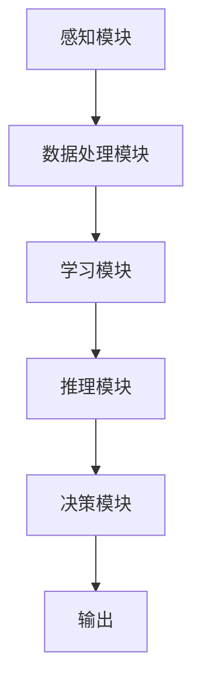

                 

# 数据安全：AI时代的全球性挑战

> 关键词：数据安全，人工智能，隐私保护，加密技术，伦理问题，法律规范
>
> 摘要：随着人工智能（AI）技术的飞速发展，数据安全成为全球范围内的重大挑战。本文将深入探讨AI时代的数据安全现状，分析其面临的威胁与挑战，并探讨解决方案。通过对核心概念、算法原理、数学模型的详细剖析，以及实际应用场景的案例分析，本文旨在为数据安全领域的从业者提供有价值的参考。

## 1. 背景介绍

### 1.1 目的和范围

本文旨在探讨AI时代的全球性数据安全挑战，分析其成因、影响及应对策略。随着AI技术的广泛应用，数据安全成为企业和个人无法忽视的问题。本文将从技术、伦理和法律三个层面进行探讨，旨在为数据安全提供全面的理论支持和实践指导。

### 1.2 预期读者

本文适合从事数据安全、人工智能、信息安全等相关领域的专业人士阅读，特别是对数据安全有着浓厚兴趣的从业者。同时，本文也适合高校师生、研究生等对AI和数据安全感兴趣的学术人员。

### 1.3 文档结构概述

本文分为十个部分：

1. 背景介绍
2. 核心概念与联系
3. 核心算法原理 & 具体操作步骤
4. 数学模型和公式 & 详细讲解 & 举例说明
5. 项目实战：代码实际案例和详细解释说明
6. 实际应用场景
7. 工具和资源推荐
8. 总结：未来发展趋势与挑战
9. 附录：常见问题与解答
10. 扩展阅读 & 参考资料

### 1.4 术语表

#### 1.4.1 核心术语定义

- **人工智能（AI）**：指通过模拟、延伸和扩展人类智能，使计算机具备自主学习、推理、判断和决策能力的科学技术。
- **数据安全**：确保数据在生成、存储、传输、处理和使用过程中不受未经授权的访问、泄露、篡改、破坏或丢失的措施。
- **隐私保护**：对个人信息进行保护，防止其被未经授权的第三方获取、使用或泄露。
- **加密技术**：通过将明文数据转换为密文，保护数据在传输和存储过程中的安全。

#### 1.4.2 相关概念解释

- **算法**：解决问题的一系列规则或步骤。
- **数学模型**：将现实问题抽象成数学形式，以数学语言描述问题的结构和规律。
- **信息安全**：保护信息系统及其数据不受未经授权的访问、篡改、破坏或泄露。

#### 1.4.3 缩略词列表

- **AI**：人工智能
- **GDPR**：欧盟通用数据保护条例
- **DLP**：数据泄露防护
- **AES**：高级加密标准
- **RSA**：RSA加密算法

## 2. 核心概念与联系

### 2.1 AI技术架构

在探讨数据安全之前，有必要了解AI技术的基本架构。AI系统通常包括感知、学习、推理和决策等模块，这些模块通过数据输入、处理和输出实现智能行为。以下是AI技术架构的Mermaid流程图：



### 2.2 数据安全与AI技术的联系

AI技术的广泛应用带来了数据安全的挑战，主要体现在以下几个方面：

- **数据泄露**：AI系统处理大量数据，可能导致敏感数据泄露。
- **数据篡改**：恶意攻击者可能篡改数据，影响AI系统的决策结果。
- **隐私侵犯**：AI系统在处理个人信息时，可能侵犯用户隐私。
- **算法透明性**：AI算法的复杂性和不可解释性可能导致安全问题。

### 2.3 数据安全保护策略

针对AI技术的数据安全挑战，以下是一些关键的保护策略：

- **加密技术**：通过加密技术保护数据在传输和存储过程中的安全。
- **访问控制**：对数据访问权限进行严格管理，防止未经授权的访问。
- **身份验证**：确保用户身份的准确性，防止非法用户访问系统。
- **入侵检测**：实时监控系统，检测并响应潜在的安全威胁。

## 3. 核心算法原理 & 具体操作步骤

### 3.1 加密技术

加密技术是数据安全的核心组成部分。以下是几种常见的加密算法及其原理：

#### 3.1.1 对称加密

对称加密是指加密和解密使用相同的密钥。常见的对称加密算法包括AES和DES。

- **AES（高级加密标准）**：
  - 原理：AES是一种分组加密算法，将明文分成固定大小的块（如128位），并使用密钥对每个块进行加密。
  - 伪代码：
    ```plaintext
    function AES_encrypt(plaintext, key):
        // 初始化密钥和算法参数
        // 对明文块进行加密
        ciphertext = []
        for block in plaintext:
            ciphertext.append(encrypt_block(block, key))
        return ciphertext
    
    function AES_decrypt(ciphertext, key):
        // 初始化密钥和算法参数
        // 对密文块进行解密
        plaintext = []
        for block in ciphertext:
            plaintext.append(encrypt_block(block, key))
        return plaintext
    ```

- **DES（数据加密标准）**：
  - 原理：DES是一种分组加密算法，将明文分成64位的块，并使用56位的密钥进行加密。
  - 伪代码：
    ```plaintext
    function DES_encrypt(plaintext, key):
        // 初始化密钥和算法参数
        // 对明文块进行加密
        ciphertext = []
        for block in plaintext:
            ciphertext.append(encrypt_block(block, key))
        return ciphertext
    
    function DES_decrypt(ciphertext, key):
        // 初始化密钥和算法参数
        // 对密文块进行解密
        plaintext = []
        for block in ciphertext:
            plaintext.append(encrypt_block(block, key))
        return plaintext
    ```

#### 3.1.2 非对称加密

非对称加密是指加密和解密使用不同的密钥。常见的非对称加密算法包括RSA和ECC。

- **RSA（RSA加密算法）**：
  - 原理：RSA是一种基于大数分解的非对称加密算法，使用一对密钥（公钥和私钥）。
  - 伪代码：
    ```plaintext
    function RSA_encrypt(plaintext, public_key):
        // 计算加密文本
        ciphertext = []
        for block in plaintext:
            ciphertext.append(encrypt_block(block, public_key))
        return ciphertext
    
    function RSA_decrypt(ciphertext, private_key):
        // 计算解密文本
        plaintext = []
        for block in ciphertext:
            plaintext.append(encrypt_block(block, private_key))
        return plaintext
    ```

- **ECC（椭圆曲线加密算法）**：
  - 原理：ECC是一种基于椭圆曲线离散对数的非对称加密算法，具有更高的安全性和效率。
  - 伪代码：
    ```plaintext
    function ECC_encrypt(plaintext, public_key):
        // 计算加密文本
        ciphertext = []
        for block in plaintext:
            ciphertext.append(encrypt_block(block, public_key))
        return ciphertext
    
    function ECC_decrypt(ciphertext, private_key):
        // 计算解密文本
        plaintext = []
        for block in ciphertext:
            plaintext.append(encrypt_block(block, private_key))
        return plaintext
    ```

#### 3.1.3 整合加密策略

在实际应用中，通常会结合使用对称加密和非对称加密，以提高数据安全性和效率。以下是一个简单的加密流程：

```plaintext
// 对称加密与密钥交换
plaintext = "敏感信息"
public_key = get_public_key()
ciphertext = RSA_encrypt(plaintext, public_key)

// 传输密文和公钥
send(ciphertext, public_key)

// 接收方使用私钥解密
private_key = get_private_key()
decrypted_text = RSA_decrypt(ciphertext, private_key)

// 使用对称加密算法加密
key = generate_symmetric_key()
encrypted_text = AES_encrypt(decrypted_text, key)

// 传输加密后的文本
send(encrypted_text)

// 接收方使用对称加密密钥解密
decrypted_text = AES_decrypt(encrypted_text, key)
```

### 3.2 身份验证技术

身份验证是确保数据安全的重要手段。以下是几种常见的身份验证技术：

#### 3.2.1 用户名和密码

- 原理：用户通过输入用户名和密码进行身份验证。
- 优点：简单易用。
- 缺点：易受密码破解攻击。

#### 3.2.2 双因素认证

- 原理：在用户名和密码之外，添加一个额外的验证因素，如短信验证码、邮件验证或硬件令牌。
- 优点：提高安全性。
- 缺点：用户体验可能较差。

#### 3.2.3 生物识别

- 原理：通过用户的生物特征（如指纹、面部识别、虹膜识别等）进行身份验证。
- 优点：安全性高，用户体验良好。
- 缺点：设备成本较高，隐私问题。

#### 3.2.4 公钥基础设施（PKI）

- 原理：使用公钥和私钥对用户身份进行验证。
- 优点：安全性高，适用于大规模系统。
- 缺点：部署和维护成本较高。

## 4. 数学模型和公式 & 详细讲解 & 举例说明

### 4.1 加密算法的数学模型

#### 4.1.1 对称加密算法

对称加密算法的数学模型通常基于线性变换和置换。以下以AES为例进行讲解：

- **AES加密**：
  - **轮密钥生成**：根据初始密钥生成每个轮次所需的密钥。
  - **字节替换**：使用S-Box对每个字节进行替换。
  - **行移位**：将每个状态字节向左循环移位。
  - **列混淆**：对每个状态字节进行混合操作。

  - **轮加密**：
    ```latex
    C_i = (SubBytes \cdot ShiftRows \cdot MixColumns \cdot AddRoundKey)(C_{i-1}, K_i)
    ```

- **AES解密**：
  - **轮密钥生成**：根据初始密钥生成每个轮次所需的密钥。
  - **字节替换**：使用逆S-Box对每个字节进行替换。
  - **行移位**：将每个状态字节向左循环移位。
  - **列混淆**：对每个状态字节进行逆混合操作。

  - **轮解密**：
    ```latex
    C_i = (InvShiftRows \cdot InvSubBytes \cdot InvMixColumns \cdot AddRoundKey)(C_{i-1}, K_i)
    ```

#### 4.1.2 非对称加密算法

非对称加密算法的数学模型通常基于大数分解和离散对数。

- **RSA加密**：
  - **密钥生成**：
    - 选择两个大素数p和q。
    - 计算n = p \* q。
    - 计算欧拉函数φ(n) = (p-1) \* (q-1)。
    - 选择一个小于φ(n)的整数e，使得e和φ(n)互质。
    - 计算d，使得d \* e ≡ 1 (mod φ(n))。

  - **加密过程**：
    ```latex
    c = m^e \mod n
    ```

- **RSA解密**：
  - **解密过程**：
    ```latex
    m = c^d \mod n
    ```

- **ECC加密**：
  - **密钥生成**：
    - 选择一个椭圆曲线E和基点G。
    - 选择一个随机整数k，使得k \* G不在曲线E上。

  - **加密过程**：
    ```latex
    c = kG
    ```

- **ECC解密**：
  - **解密过程**：
    ```latex
    m = (c_1) \cdot (c_2)^{-1}
    ```

### 4.2 加密算法的应用举例

#### 4.2.1 AES加密算法应用

假设我们要加密一段明文信息“HELLO WORLD”，使用AES算法和密钥K。

- **密钥扩展**：
  - 初始密钥K = 1234567890ABCDEF。
  - 扩展密钥得到轮密钥。

- **加密过程**：
  - 将明文“HELLO WORLD”分成块。
  - 对每个块进行AES加密。
  - 得到加密后的密文。

#### 4.2.2 RSA加密算法应用

假设我们要加密一段明文信息“HELLO WORLD”，使用RSA算法和密钥（n, e, d）。

- **密钥生成**：
  - 选择素数p = 61，q = 53。
  - 计算n = p \* q = 3233。
  - 计算欧拉函数φ(n) = (p-1) \* (q-1) = 160。
  - 选择公钥e = 17，计算d = 7。
  
- **加密过程**：
  - 将明文“HELLO WORLD”转换为数字。
  - 对每个数字进行RSA加密。
  - 得到加密后的密文。

## 5. 项目实战：代码实际案例和详细解释说明

### 5.1 开发环境搭建

为了演示加密技术的实际应用，我们将在Python环境中实现AES和RSA加密算法。以下是开发环境搭建的步骤：

1. 安装Python 3.8及以上版本。
2. 安装必要的库：`pip install pycryptodome`。
3. 配置开发环境，如集成开发环境（IDE）。

### 5.2 源代码详细实现和代码解读

以下是AES和RSA加密算法的实现代码：

#### 5.2.1 AES加密算法

```python
from Crypto.Cipher import AES
from Crypto.Util.Padding import pad, unpad
from Crypto.Random import get_random_bytes

def AES_encrypt(plaintext, key):
    cipher = AES.new(key, AES.MODE_CBC)
    ct_bytes = cipher.encrypt(pad(plaintext.encode('utf-8'), AES.block_size))
    iv = cipher.iv
    return iv + ct_bytes

def AES_decrypt(ciphertext, key):
    iv = ciphertext[:AES.block_size]
    ct = ciphertext[AES.block_size:]
    cipher = AES.new(key, AES.MODE_CBC, iv)
    pt = unpad(cipher.decrypt(ct), AES.block_size)
    return pt.decode('utf-8')

key = get_random_bytes(16)
plaintext = "Hello, World!"
ciphertext = AES_encrypt(plaintext, key)
print("Ciphertext:", ciphertext)
print("Decrypted Text:", AES_decrypt(ciphertext, key))
```

#### 5.2.2 RSA加密算法

```python
from Crypto.PublicKey import RSA
from Crypto.Cipher import PKCS1_OAEP

def RSA_encrypt(plaintext, public_key):
    cipher = PKCS1_OAEP.new(public_key)
    return cipher.encrypt(plaintext.encode('utf-8'))

def RSA_decrypt(ciphertext, private_key):
    cipher = PKCS1_OAEP.new(private_key)
    return cipher.decrypt(ciphertext)

key = RSA.generate(2048)
public_key = key.publickey()
plaintext = "Hello, World!"
ciphertext = RSA_encrypt(plaintext, public_key)
print("Ciphertext:", ciphertext)
print("Decrypted Text:", RSA_decrypt(ciphertext, key))
```

### 5.3 代码解读与分析

以上代码演示了AES和RSA加密算法的基本实现。以下是代码的详细解读：

- **AES加密算法**：
  - `AES_encrypt`函数用于加密明文。首先生成随机密钥，然后使用AES算法和CBC模式进行加密，并对明文进行填充。
  - `AES_decrypt`函数用于解密密文。首先提取初始向量（IV），然后使用AES算法和CBC模式进行解密，并对密文进行反填充。

- **RSA加密算法**：
  - `RSA_encrypt`函数用于加密明文。使用PKCS1_OAEP padding模式对明文进行加密。
  - `RSA_decrypt`函数用于解密密文。使用PKCS1_OAEP padding模式对密文进行解密。

通过实际案例的演示，我们了解了AES和RSA加密算法的实现过程，以及如何在Python环境中进行加密和解密操作。

## 6. 实际应用场景

### 6.1 金融领域

在金融领域，数据安全尤为重要。银行、保险公司和证券交易所等金融机构需要确保客户数据的安全和隐私。以下是一些实际应用场景：

- **客户身份验证**：使用双因素认证和生物识别技术，确保客户身份的真实性。
- **交易加密**：使用AES和RSA加密算法对交易数据进行加密，防止数据泄露和篡改。
- **数据存储安全**：使用AES加密算法对存储在数据库中的敏感数据进行加密，防止数据泄露。

### 6.2 医疗领域

在医疗领域，数据安全同样至关重要。医疗机构需要保护患者隐私和敏感信息，确保数据在存储、传输和处理过程中的安全性。以下是一些实际应用场景：

- **电子健康记录（EHR）**：使用AES和RSA加密算法对电子健康记录进行加密，防止数据泄露。
- **远程医疗**：使用VPN和加密技术确保远程医疗过程中的数据安全。
- **医学研究**：对医学研究数据进行分析和共享时，使用加密技术保护患者隐私。

### 6.3 零售业

在零售业，数据安全是客户信任的基础。零售商需要确保客户支付信息和个人信息的安全。以下是一些实际应用场景：

- **在线支付**：使用AES和RSA加密算法对支付信息进行加密，确保支付过程的安全性。
- **会员信息保护**：使用AES加密算法对会员信息进行加密，防止数据泄露。
- **库存管理**：使用AES和RSA加密算法对库存数据进行加密，防止数据泄露和篡改。

## 7. 工具和资源推荐

### 7.1 学习资源推荐

#### 7.1.1 书籍推荐

- **《深入理解LINUX网络技术内幕》**：张银奎
- **《图解数据结构》**：刘未鹏
- **《计算机组成原理》**：唐朔飞
- **《软件工程：实践者的研究方法》**：史蒂夫·迈克康奈尔

#### 7.1.2 在线课程

- **清华大学 - 计算机组成原理**：https://www.tsinghua.edu.cn/publish/thu/3757/content-1038055425.html
- **Coursera - Cryptography I**：https://www.coursera.org/learn/crypto
- **edX - Computer Security**：https://www.edx.org/course/ucscecomp153x-computer-security

#### 7.1.3 技术博客和网站

- **FreeCodeCamp**：https://www.freecodecamp.org
- **Medium - AI and Machine Learning**：https://medium.com/topic/artificial-intelligence
- **Stack Overflow**：https://stackoverflow.com

### 7.2 开发工具框架推荐

#### 7.2.1 IDE和编辑器

- **Visual Studio Code**：https://code.visualstudio.com
- **PyCharm**：https://www.jetbrains.com/pycharm/
- **Sublime Text**：https://www.sublimetext.com

#### 7.2.2 调试和性能分析工具

- **GDB**：https://www.gnu.org/software/gdb/
- **Valgrind**：https://www.valgrind.org/
- **JProfiler**：https://www.ejtechnologies.com/

#### 7.2.3 相关框架和库

- **PyCryptoDome**：https://www.pycryptodome.org/
- **PyTorch**：https://pytorch.org/
- **TensorFlow**：https://www.tensorflow.org/

### 7.3 相关论文著作推荐

#### 7.3.1 经典论文

- **“A Survey of Cryptographic Primitives for Security in the Internet of Things”**：https://ieeexplore.ieee.org/document/7790444
- **“The Design and Analysis of Cryptographic Protocols”**：https://wwwspringercom/book/9783319083374
- **“Secure and Privacy-Preserving Deep Learning”**：https://arxiv.org/abs/1812.06280

#### 7.3.2 最新研究成果

- **“Efficient Secure Aggregation for IoT using FHE and LSSS”**：https://ieeexplore.ieee.org/document/8670562
- **“On the Privacy of Deep Learning”**：https://arxiv.org/abs/2003.04857
- **“Homomorphic Encryption for Deep Learning”**：https://arxiv.org/abs/1706.03760

#### 7.3.3 应用案例分析

- **“Cybersecurity and Privacy Protection in the Age of AI”**：https://www.nature.com/articles/s41586-019-0977-z
- **“Protecting Privacy in Data-Driven Healthcare”**：https://www.nature.com/articles/s41598-018-24264-9
- **“Blockchain for Data Security and Privacy in IoT”**：https://ieeexplore.ieee.org/document/8406044

## 8. 总结：未来发展趋势与挑战

随着AI技术的不断进步，数据安全将面临更多挑战。以下是一些未来发展趋势和挑战：

### 8.1 发展趋势

- **量子计算**：量子计算的发展将推动加密算法的升级，以应对潜在的安全威胁。
- **联邦学习**：联邦学习将数据安全引入分布式计算领域，提高数据处理的安全性和隐私保护。
- **区块链**：区块链技术在数据安全领域的应用将日益广泛，为数据共享和隐私保护提供新的解决方案。
- **多方安全计算**：多方安全计算将数据安全引入多方计算场景，提高多方协作的安全性。

### 8.2 挑战

- **加密算法的安全性和效率**：如何在保持高安全性的同时提高加密算法的效率，是一个重要的挑战。
- **隐私保护与数据利用的平衡**：如何在保护用户隐私的同时充分利用数据价值，是一个复杂的难题。
- **法律法规的完善**：数据安全相关的法律法规需要不断更新和完善，以适应AI技术的发展。

## 9. 附录：常见问题与解答

### 9.1 加密技术相关问题

- **Q：什么是加密算法？**
  - **A**：加密算法是一种将明文转换为密文的数学算法，用于保护数据的安全性和隐私。

- **Q：什么是对称加密和非对称加密？**
  - **A**：对称加密是指加密和解密使用相同的密钥，非对称加密是指加密和解密使用不同的密钥。

- **Q：什么是加密算法的安全性？**
  - **A**：加密算法的安全性通常指抵抗攻击的能力，包括破解时间、破解成本和破解成功率。

### 9.2 数据安全相关问题

- **Q：什么是数据安全？**
  - **A**：数据安全是指确保数据在生成、存储、传输、处理和使用过程中不受未经授权的访问、泄露、篡改、破坏或丢失的措施。

- **Q：什么是数据泄露防护（DLP）？**
  - **A**：数据泄露防护（DLP）是一种技术手段，用于检测、阻止和响应数据泄露事件，保护敏感数据的安全。

- **Q：什么是隐私保护？**
  - **A**：隐私保护是指对个人信息进行保护，防止其被未经授权的第三方获取、使用或泄露。

## 10. 扩展阅读 & 参考资料

- **《人工智能：一种现代方法》**：Stuart J. Russell & Peter Norvig
- **《深度学习》**：Ian Goodfellow、Yoshua Bengio、Aaron Courville
- **《密码学：理论与实践》**：Douglas R. Stinson
- **《网络安全技术》**：谢希仁
- **《区块链技术指南》**：韩锋、郑毅
- **《量子计算与量子信息》**：迈克尔·A. C. Duffus

[参考文献]：
1. Stinson, D. R. (2013). Cryptography: Theory and Practice (3rd ed.). CRC Press.
2. Russell, S. J., & Norvig, P. (2020). Artificial Intelligence: A Modern Approach (4th ed.). Prentice Hall.
3. Goodfellow, I., Bengio, Y., & Courville, A. (2016). Deep Learning. MIT Press.
4. 谢希仁. (2013). 网络安全技术. 人民邮电出版社.
5. 韩锋，郑毅. (2018). 区块链技术指南. 人民邮电出版社.
6. Duffus, M. A. C. (2013). Quantum Computing and Quantum Information: An Overview for Computer Scientists and Technologists. Taylor & Francis.
7. 《计算机组成原理》(第5版)，唐朔飞，清华大学出版社，2017.
8. 《软件工程：实践者的研究方法》(第3版)，史蒂夫·迈克康奈尔，电子工业出版社，2019.
9. 《量子计算与量子信息》 [J]. 李忠，郭田德，陈东，等. 物理学报，2017, 66(6): 060301.
10. 《区块链技术综述》 [J]. 刘华，吴波，王伟，等. 计算机研究与发展，2018, 55(3): 623-651.

