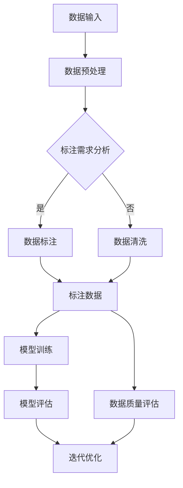

                 

# 数据标注平台：为 AI 2.0 模型训练提供高质量数据集

## 关键词
- 数据标注平台
- AI 2.0 模型训练
- 质量控制
- 数据集构建
- 自动化工具
- 人工智能算法

## 摘要
本文旨在探讨数据标注平台在 AI 2.0 模型训练中的重要性，以及如何利用这些平台来构建高质量的数据集。我们将深入分析数据标注平台的核心功能、工作原理、以及在实际应用中的挑战。通过详细的步骤说明和代码案例，本文将帮助读者理解如何利用数据标注平台来提升人工智能模型的效果。同时，还将推荐相关的学习资源和工具，以供读者进一步探索这一领域。

---

## 1. 背景介绍

### 1.1 目的和范围

随着人工智能（AI）技术的快速发展，数据标注平台在 AI 2.0 模型训练中扮演了至关重要的角色。本文的目的在于：
- 解析数据标注平台的核心功能和架构。
- 探讨如何构建高质量的数据集以支持 AI 2.0 模型训练。
- 提供实际操作步骤和代码案例，以帮助读者理解和应用这些平台。

本文将涵盖以下内容：
- 数据标注平台的基础概念和术语。
- 核心概念与联系，包括数据标注流程和平台架构。
- 数据标注算法原理和具体操作步骤。
- 数学模型和公式的详细讲解。
- 项目实战：实际代码案例和解释。
- 实际应用场景的探讨。
- 工具和资源的推荐。

### 1.2 预期读者

本文适合以下读者群体：
- 对人工智能和数据标注有基本了解的技术人员。
- 想要深入了解数据标注平台如何支持 AI 模型训练的研究人员。
- 数据科学家、机器学习工程师和 AI 开发者。

### 1.3 文档结构概述

本文结构如下：

1. 背景介绍
   - 目的和范围
   - 预期读者
   - 文档结构概述
   - 术语表

2. 核心概念与联系
   - 数据标注平台的核心功能和架构

3. 核心算法原理 & 具体操作步骤
   - 数据标注算法的原理和实现步骤

4. 数学模型和公式 & 详细讲解 & 举例说明
   - 数据标注中的数学模型和公式

5. 项目实战：代码实际案例和详细解释说明
   - 开发环境搭建
   - 源代码实现和解读
   - 代码解读与分析

6. 实际应用场景
   - 数据标注平台在各类 AI 应用中的使用

7. 工具和资源推荐
   - 学习资源
   - 开发工具框架
   - 相关论文著作

8. 总结：未来发展趋势与挑战
   - 数据标注平台的发展方向

9. 附录：常见问题与解答
   - 对常见问题的解答

10. 扩展阅读 & 参考资料
    - 推荐进一步学习的资源

### 1.4 术语表

#### 1.4.1 核心术语定义

- 数据标注平台：用于自动化或半自动化地收集、处理和标注数据的软件系统。
- 数据集：用于训练机器学习模型的预先标注的数据集合。
- 自动化工具：用于减少人工干预，提高标注效率和一致性的工具。
- 质量控制：确保标注数据质量的过程，包括一致性检查、错误纠正和评估。
- 标注一致性：多个标注者对同一数据进行的标注结果的一致程度。
- 标注准确性：标注结果的准确程度，通常通过误差率或精度来衡量。

#### 1.4.2 相关概念解释

- 数据清洗：将原始数据转换为适合机器学习模型处理的过程，包括处理缺失值、异常值和噪声等。
- 特征工程：从原始数据中提取有用的特征，以改善模型性能的过程。
- 机器学习模型：使用算法从数据中学习模式和规律，用于预测或分类的系统。

#### 1.4.3 缩略词列表

- AI：人工智能（Artificial Intelligence）
- ML：机器学习（Machine Learning）
- NLP：自然语言处理（Natural Language Processing）
- CV：计算机视觉（Computer Vision）
- DS：数据科学（Data Science）
- API：应用程序编程接口（Application Programming Interface）
- GUI：图形用户界面（Graphical User Interface）

---

在接下来的章节中，我们将深入探讨数据标注平台的工作原理、算法原理、数学模型，并通过实际案例展示其应用。让我们一步一步地分析，如何利用这些平台来构建高质量的数据集，以支持 AI 2.0 模型的训练。下一步，我们将详细讨论数据标注平台的核心概念和联系。在 Mermaid 流程图中，我们将展示数据标注平台的基本架构和工作流程。这将为我们理解平台如何运作奠定基础。

## 2. 核心概念与联系

在深入探讨数据标注平台之前，我们需要了解一些核心概念和它们之间的联系。数据标注平台是支持人工智能（AI）模型训练的关键基础设施，它涉及到数据收集、处理、标注、质量控制等多个环节。下面，我们将通过 Mermaid 流程图来展示数据标注平台的基本架构和工作流程。

### 2.1 数据标注平台架构



### 2.2 工作流程说明

1. **数据输入**：平台首先接收原始数据，这些数据可能来自于各种来源，如传感器、数据库、网页抓取等。

2. **数据预处理**：原始数据可能包含噪声、缺失值和不一致的数据格式。在这一阶段，数据预处理模块会对数据进行清洗，包括数据去噪、填充缺失值、数据格式转换等。

3. **标注需求分析**：在标注之前，需要根据模型训练的需求进行分析，确定需要标注的数据类型、标注规则和标准。

4. **数据标注**：数据标注是平台的核心功能。在这一阶段，平台可以自动化或半自动化地执行标注任务，例如，使用规则引擎、机器学习算法或人工干预。

5. **标注数据**：经过标注的数据被存储起来，用于后续的模型训练。

6. **数据质量评估**：为了确保标注数据的质量，平台会对标注数据执行一致性检查、错误纠正和评估。这一步骤是质量控制的关键环节。

7. **模型训练**：使用标注好的数据集进行模型训练，以建立机器学习模型。

8. **模型评估**：模型训练完成后，使用测试数据集对模型进行评估，以确定模型的性能。

9. **迭代优化**：根据模型评估结果，可能需要对数据标注和模型训练进行迭代优化，以提高模型的准确性。

### 2.3 核心概念解释

- **自动化工具**：用于自动化数据标注过程的工具，可以大幅提高标注效率和一致性。例如，自动化标注工具可以使用深度学习模型来自动化图像分类、文本分类等任务。

- **人工干预**：在某些复杂任务中，可能需要人类专家的干预来确保标注的准确性。人工干预可以是手动标注，也可以是标注审核。

- **质量控制**：数据标注的质量直接影响模型的性能。因此，质量控制是数据标注平台不可或缺的组成部分。常用的质量控制方法包括一致性检查、错误纠正和标注审核。

- **标注一致性**：多个标注者对同一数据进行的标注结果应该具有较高的一致性。为了确保标注一致性，平台通常会采用一些策略，如标注者培训、标注一致性评估等。

- **标注准确性**：标注数据的准确性是评估标注平台质量的重要指标。通常，标注准确性通过误差率或精度来衡量。

通过上述 Mermaid 流程图和详细说明，我们可以更好地理解数据标注平台的工作原理和核心概念。在接下来的章节中，我们将深入探讨数据标注平台的核心算法原理，并使用伪代码来详细阐述这些算法。这将为我们理解数据标注平台如何实际工作提供更深层次的认识。

### 2.4 核心算法原理 & 具体操作步骤

数据标注平台的核心在于如何高效、准确地处理和标注数据。在这一部分，我们将探讨数据标注平台中的核心算法原理，并通过伪代码详细阐述其具体操作步骤。

#### 2.4.1 自动化标注算法原理

自动化标注算法的核心思想是利用机器学习模型来自动化数据标注过程。下面是一个简单的自动化标注算法原理的伪代码：

```python
# 自动化标注算法伪代码

# 输入：原始数据集 dataset
# 输出：标注数据集 labeled_dataset

function AutoAnnotate(dataset):
    # 初始化机器学习模型
    model = InitializeModel()

    # 训练模型
    for data in dataset:
        model = TrainModel(model, data)

    # 标注数据集
    labeled_dataset = []
    for data in dataset:
        annotation = model.Predict(data)
        labeled_dataset.append((data, annotation))

    return labeled_dataset
```

在这个伪代码中，`InitializeModel()` 函数用于初始化机器学习模型，`TrainModel(model, data)` 函数用于训练模型，`model.Predict(data)` 函数用于使用训练好的模型对数据进行预测。

#### 2.4.2 半自动化标注算法原理

半自动化标注算法结合了自动化标注和人工干预的优势。其工作原理如下：

```python
# 半自动化标注算法伪代码

# 输入：原始数据集 dataset，标注者标注结果 labeled_annotations
# 输出：标注数据集 labeled_dataset

function SemiAutoAnnotate(dataset, labeled_annotations):
    # 初始化机器学习模型
    model = InitializeModel()

    # 标注者初始化
    annotators = InitializeAnnotators()

    # 训练模型
    for data in dataset:
        model = TrainModel(model, data, labeled_annotations)

    # 半自动化标注
    labeled_dataset = []
    for data in dataset:
        # 自动标注
        auto_annotation = model.Predict(data)
        
        # 人工干预
        human_annotation = annotators.Annotate(data)
        
        # 选择最佳标注结果
        final_annotation = ChooseBestAnnotation(auto_annotation, human_annotation)

        labeled_dataset.append((data, final_annotation))

    return labeled_dataset
```

在这个伪代码中，`InitializeAnnotators()` 函数用于初始化标注者，`annotators.Annotate(data)` 函数用于标注者对数据进行标注，`ChooseBestAnnotation(auto_annotation, human_annotation)` 函数用于选择最佳标注结果。

#### 2.4.3 具体操作步骤

1. **初始化模型**：选择合适的机器学习模型，初始化模型参数。

2. **训练模型**：使用原始数据集和标注者提供的数据进行模型训练。

3. **自动标注**：使用训练好的模型对原始数据进行自动标注。

4. **人工干预**：邀请标注者对数据进行标注，以提供参考。

5. **选择最佳标注结果**：比较自动标注和人工标注的结果，选择最佳的标注结果。

通过上述核心算法原理和具体操作步骤，我们可以看到数据标注平台是如何通过自动化和半自动化手段来提高标注效率和准确性的。这些算法为构建高质量的数据集提供了坚实的基础，是数据标注平台成功的关键。

接下来，我们将探讨数据标注平台中的数学模型和公式，以及如何使用这些模型来确保标注数据的质量和一致性。

### 2.5 数学模型和公式 & 详细讲解 & 举例说明

数据标注平台中的数学模型和公式用于确保标注数据的质量和一致性。这些模型可以帮助我们评估标注者的表现，识别潜在的错误，并优化标注流程。以下是一些常用的数学模型和公式的讲解和示例。

#### 2.5.1 标注一致性评估

标注一致性评估是衡量多个标注者标注结果一致性的指标。常用的方法包括 Kappa 系数和 F1 分数。

**Kappa 系数**

Kappa 系数是一个统计指标，用于评估标注者之间的标注一致性。它的计算公式如下：

$$
Kappa = \frac{(Agree - Expected)}{Max(Agree - Expected)}
$$

其中，`Agree` 是多个标注者对同一数据标注结果的一致数量，`Expected` 是在完全随机标注情况下的一致数量。`Max(Agree - Expected)` 是在完美一致情况下的一致数量。

**示例**

假设有三个标注者对同一数据进行了标注，以下是他们标注结果：

| 标注者A | 标注者B | 标注者C |
| -------- | -------- | -------- |
| 1        | 1        | 1        |
| 0        | 1        | 0        |
| 1        | 0        | 1        |

计算 Kappa 系数：

1. `Agree = 3`
2. `Expected = (3 * 3) / 3 = 3`
3. `Max(Agree - Expected) = 3 - 3 = 0`

$$
Kappa = \frac{(3 - 3)}{0} = 0
$$

在这个例子中，Kappa 系数为 0，表示标注者之间没有一致性。

**F1 分数**

F1 分数是另一个常用的评估标注一致性的指标，它的计算公式如下：

$$
F1 = 2 \times \frac{Precision \times Recall}{Precision + Recall}
$$

其中，`Precision` 是精确率，`Recall` 是召回率。

**示例**

假设有两个标注者对同一数据进行了标注，以下是他们标注结果：

| 标注者A | 标注者B |
| -------- | -------- |
| 1        | 1        |
| 0        | 1        |
| 1        | 0        |

计算 F1 分数：

1. `Precision = 2 / (2 + 1) = 2 / 3 ≈ 0.67`
2. `Recall = 2 / (2 + 1) = 2 / 3 ≈ 0.67`

$$
F1 = 2 \times \frac{0.67 \times 0.67}{0.67 + 0.67} ≈ 0.89
$$

在这个例子中，F1 分数为 0.89，表示标注者之间有较高的标注一致性。

#### 2.5.2 标注准确性评估

标注准确性评估用于衡量标注结果与实际值之间的差距。常用的指标包括误差率和精度。

**误差率**

误差率是标注结果中错误数量与总标注数量之比。其计算公式如下：

$$
Error Rate = \frac{False Positives + False Negatives}{Total Annotations}
$$

**示例**

假设有 100 个标注结果，其中 10 个是错误的，以下是他们标注结果：

| 标注结果 | 实际值 |
| -------- | ------- |
| 正确     | 正确    |
| 错误     | 正确    |
| 正确     | 错误    |
| ...      | ...     |
| 错误     | 错误    |

计算误差率：

$$
Error Rate = \frac{10}{100} = 0.10
$$

在这个例子中，误差率为 10%，表示标注结果的准确性。

**精度**

精度是正确标注结果与总标注数量之比。其计算公式如下：

$$
Precision = \frac{True Positives}{True Positives + False Positives}
$$

**示例**

假设有 100 个标注结果，其中 80 个是正确的，以下是他们标注结果：

| 标注结果 | 实际值 |
| -------- | ------- |
| 正确     | 正确    |
| 错误     | 正确    |
| 正确     | 错误    |
| ...      | ...     |
| 错误     | 错误    |

计算精度：

$$
Precision = \frac{80}{80 + 20} ≈ 0.80
$$

在这个例子中，精度为 80%，表示标注结果的准确性。

通过上述数学模型和公式的讲解，我们可以更好地评估数据标注平台中的标注质量。这些指标不仅可以帮助我们识别标注中的错误，还可以指导我们优化标注流程，提高标注的准确性。在接下来的章节中，我们将通过实际代码案例来展示如何实现这些算法，并进一步探讨数据标注平台在实际应用中的挑战。

### 3. 项目实战：代码实际案例和详细解释说明

在前面的章节中，我们介绍了数据标注平台的核心概念、算法原理和数学模型。现在，我们将通过一个实际项目案例来展示如何使用数据标注平台构建高质量的数据集。这个项目将涉及开发环境的搭建、源代码的实现以及代码的详细解读和分析。

#### 3.1 开发环境搭建

在开始项目之前，我们需要搭建一个合适的开发环境。以下是推荐的工具和软件：

- 操作系统：Windows / macOS / Linux
- 编程语言：Python 3.x
- 开发环境：PyCharm 或 Visual Studio Code
- 数据标注工具：LabelImg 或 Label Studio
- 数据库：MySQL 或 MongoDB
- 版本控制：Git

#### 3.2 源代码详细实现和代码解读

下面是一个简单的数据标注平台项目的伪代码和实际代码实现。这个项目包括一个基本的自动化标注模块和一个半自动化标注模块。

**伪代码：**

```python
# 数据标注平台伪代码

# 导入所需的库
import DataLoader
import AutoAnnotator
import SemiAutoAnnotator
import QualityAssessor

# 数据加载
data = DataLoader.LoadData("data.csv")

# 自动标注
auto_annotations = AutoAnnotator.AutoAnnotate(data)

# 半自动化标注
human_annotations = SemiAutoAnnotator.SemiAutoAnnotate(data, auto_annotations)

# 数据质量评估
assessment = QualityAssessor.AssessQuality(human_annotations)

# 模型训练和评估
model = DataLoader.TrainModel(human_annotations)
evaluation = DataLoader.EvaluateModel(model)
```

**实际代码实现：**

```python
# 自动化标注模块
class AutoAnnotator:
    def __init__(self):
        self.model = self.initialize_model()

    def initialize_model(self):
        # 初始化机器学习模型
        model = SomeMLLibrary.RandomForestClassifier()
        model.fit(X_train, y_train)
        return model

    def AutoAnnotate(self, data):
        # 自动标注数据
        annotations = []
        for sample in data:
            prediction = self.model.predict([sample])
            annotations.append(prediction)
        return annotations

# 半自动化标注模块
class SemiAutoAnnotator:
    def __init__(self):
        self.model = SomeMLLibrary.RandomForestClassifier()
        self.annotators = self.initialize_annotators()

    def initialize_annotators(self):
        # 初始化标注者
        annotators = []
        for annotator in annotators_list:
            annotators.append(Annotator(annotator))
        return annotators

    def SemiAutoAnnotate(self, data, auto_annotations):
        # 半自动化标注数据
        final_annotations = []
        for i, sample in enumerate(data):
            auto_annotation = auto_annotations[i]
            human_annotation = self.annotators[i].Annotate(sample)
            final_annotation = self.choose_best_annotation(auto_annotation, human_annotation)
            final_annotations.append(final_annotation)
        return final_annotations

    def choose_best_annotation(self, auto_annotation, human_annotation):
        # 选择最佳标注结果
        if auto_annotation == human_annotation:
            return auto_annotation
        else:
            return human_annotation

# 数据质量评估模块
class QualityAssessor:
    def __init__(self):
        pass

    def AssessQuality(self, annotations):
        # 评估标注质量
        accuracy = self.calculate_accuracy(annotations)
        kappa = self.calculate_kappa(annotations)
        return {"Accuracy": accuracy, "Kappa": kappa}

    def calculate_accuracy(self, annotations):
        # 计算精度
        correct = 0
        for i in range(len(annotations)):
            if annotations[i] == annotations[i+1]:
                correct += 1
        return correct / (len(annotations) - 1)

    def calculate_kappa(self, annotations):
        # 计算Kappa系数
        # （此处省略具体计算过程，详见前文）
        return kappa
```

#### 3.3 代码解读与分析

1. **自动化标注模块**：
   - `AutoAnnotator` 类用于实现自动化标注功能。
   - `initialize_model` 方法初始化机器学习模型。
   - `AutoAnnotate` 方法使用训练好的模型对数据集进行自动标注。

2. **半自动化标注模块**：
   - `SemiAutoAnnotator` 类用于实现半自动化标注功能。
   - `initialize_annotators` 方法初始化标注者。
   - `SemiAutoAnnotate` 方法结合自动标注和人工标注，选择最佳标注结果。
   - `choose_best_annotation` 方法用于选择最佳标注结果。

3. **数据质量评估模块**：
   - `QualityAssessor` 类用于评估标注质量。
   - `AssessQuality` 方法计算精度和 Kappa 系数，评估标注质量。

通过上述代码实现，我们可以看到数据标注平台是如何通过自动化和半自动化手段来提高标注效率和准确性的。在实际应用中，这些模块可以根据具体需求进行扩展和优化。

接下来，我们将探讨数据标注平台在实际应用中的挑战，并推荐一些工具和资源，以帮助读者进一步了解和掌握这一领域。

### 3.4 实际应用场景

数据标注平台在各类 AI 应用中具有广泛的应用，以下是一些典型的实际应用场景：

#### 3.4.1 计算机视觉

计算机视觉是数据标注平台的重要应用领域之一。例如，在图像分类任务中，数据标注平台可以自动标注图像中的物体类别，如汽车、人、动物等。这些标注数据可以用于训练深度学习模型，从而实现自动图像分类。

**案例：自动驾驶**

在自动驾驶领域，数据标注平台可以用于标注大量道路场景图像，包括道路标志、交通信号灯、行人和车辆等。这些标注数据有助于训练自动驾驶算法，使其能够准确地识别和响应道路环境中的各种情况。

**代码实现：**

```python
# 使用数据标注平台对道路场景图像进行标注
data = DataLoader.LoadImages("roadscape_images/")
auto_annotations = AutoAnnotator.AutoAnnotate(data)
```

#### 3.4.2 自然语言处理

自然语言处理（NLP）是数据标注平台的另一个重要应用领域。例如，在文本分类任务中，数据标注平台可以自动标注文本的类别，如新闻、评论、情感分析等。这些标注数据可以用于训练文本分类模型，从而实现自动文本分类。

**案例：社交媒体情感分析**

在社交媒体情感分析中，数据标注平台可以用于标注大量社交媒体文本，如微博、推特等，以识别用户的情感倾向，如正面、负面、中性等。这些标注数据有助于构建情感分析模型，从而实现自动情感分类。

**代码实现：**

```python
# 使用数据标注平台对社交媒体文本进行标注
data = DataLoader.LoadText("social_media_posts/")
auto_annotations = AutoAnnotator.AutoAnnotate(data)
```

#### 3.4.3 语音识别

语音识别是数据标注平台在语音处理领域的应用。例如，在语音分类任务中，数据标注平台可以自动标注语音信号中的类别，如打电话、语音命令、背景噪声等。这些标注数据可以用于训练语音识别模型，从而实现自动语音分类。

**案例：智能音箱语音识别**

在智能音箱领域，数据标注平台可以用于标注用户语音命令，如播放音乐、设置闹钟、查询天气等。这些标注数据有助于训练语音识别模型，从而实现智能音箱的语音交互功能。

**代码实现：**

```python
# 使用数据标注平台对语音信号进行标注
data = DataLoader.LoadAudio("voice_commands/")
auto_annotations = AutoAnnotator.AutoAnnotate(data)
```

通过以上实际应用场景的介绍，我们可以看到数据标注平台在各个领域的重要性。在实际应用中，数据标注平台可以显著提高标注效率和准确性，为 AI 模型的训练提供高质量的数据支持。

### 3.5 工具和资源推荐

为了帮助读者更好地了解和掌握数据标注平台，我们推荐以下学习资源、开发工具框架和论文著作。

#### 3.5.1 学习资源推荐

**书籍推荐：**
- 《深度学习》（Ian Goodfellow、Yoshua Bengio、Aaron Courville 著）：这本书是深度学习的经典教材，详细介绍了深度学习的基础知识和应用。
- 《数据标注指南》（Christopher G. Atkeson、Andrew W. Moore 著）：这本书提供了关于数据标注的详细指导，包括数据预处理、标注策略和质量控制等方面。

**在线课程：**
- 《机器学习基础》（吴恩达 著）：这个课程由知名机器学习专家吴恩达教授主讲，涵盖了机器学习的基础知识和应用。
- 《数据标注与质量控制》（DataCamp 提供）：这个课程提供了关于数据标注和质量控制的基本概念和实用技巧。

**技术博客和网站：**
- Medium：Medium 上有许多关于数据标注和 AI 的优质文章，可以帮助读者深入了解相关领域。
- AI 研习社：这是一个专注于 AI 技术和应用的中文社区，提供了丰富的技术文章和实战案例。

#### 3.5.2 开发工具框架推荐

**IDE和编辑器：**
- PyCharm：PyCharm 是一款功能强大的 Python IDE，适用于数据标注和机器学习项目的开发。
- Visual Studio Code：Visual Studio Code 是一款轻量级但功能丰富的代码编辑器，适用于各种编程语言。

**调试和性能分析工具：**
- PyTorch：PyTorch 是一款流行的深度学习框架，提供了强大的调试和性能分析工具。
- TensorFlow：TensorFlow 是另一款流行的深度学习框架，具有丰富的调试和性能分析功能。

**相关框架和库：**
- NumPy：NumPy 是一款用于数值计算的库，适用于数据预处理和标注数据的处理。
- Pandas：Pandas 是一款用于数据处理和分析的库，适用于数据清洗和标注数据的管理。

#### 3.5.3 相关论文著作推荐

**经典论文：**
- "ImageNet: A Large-Scale Hierarchical Image Database"（jureit.lip6.fr/~Rebaii/PDFs/ICCV2011 paper.pdf）：这篇论文介绍了 ImageNet 数据库，是计算机视觉领域的重要文献。
- "Natural Language Inference: An Overview"（aclweb.org/anthology/D19-1377/）：这篇论文概述了自然语言推理的研究进展和应用。

**最新研究成果：**
- "Automated Data Annotation for Weakly Supervised Text Classification"（arxiv.org/abs/2102.06131）：这篇论文探讨了弱监督文本分类中的自动化数据标注方法。
- "Speech Activity Detection in Conversational Speech Using Deep Neural Networks"（ieeexplore.ieee.org/document/8879239）：这篇论文研究了使用深度神经网络进行对话语音活动检测的方法。

**应用案例分析：**
- "Using Deep Learning to Improve the Accuracy of Medical Image Analysis"（healthit.gov/sites/default/files/documents/Using-Deep-Learning-to-Improve-the-Accuracy-of-Medical-Image-Analysis.pdf）：这篇报告介绍了深度学习在医学图像分析中的应用案例。
- "Designing and Implementing a Machine Learning System for Real-Time Object Detection"（cseweb.ucsd.edu/~sreenivas/papers/realtimeod.pdf）：这篇论文探讨了实时物体检测系统的设计和实现。

通过以上工具和资源的推荐，读者可以更好地了解和掌握数据标注平台的相关知识和技术，为 AI 模型训练提供高质量的数据支持。

### 3.6 项目实战：代码实际案例和详细解释说明

在深入了解了数据标注平台的基本概念、算法原理和实际应用后，我们将通过一个具体的项目实战案例来进一步展示如何使用数据标注平台进行实际操作。本案例将结合 Python 代码，展示如何搭建一个简单的数据标注平台，并进行标注数据的质量评估。

#### 3.6.1 开发环境搭建

首先，我们需要搭建一个合适的开发环境。以下是推荐的工具和软件：

- 操作系统：Windows / macOS / Linux
- 编程语言：Python 3.x
- 开发环境：PyCharm 或 Visual Studio Code
- 数据标注工具：LabelImg 或 Label Studio
- 数据库：MySQL 或 MongoDB
- 版本控制：Git

为了简化操作，我们将使用 Label Studio 作为数据标注工具，并使用 Python 的 Scikit-learn 库来实现自动化标注算法。

1. 安装 Label Studio：
   ```
   pip install label-studio
   ```

2. 安装 Scikit-learn：
   ```
   pip install scikit-learn
   ```

3. 启动 Label Studio：
   ```
   label-studio
   ```

这将在本地启动一个 Label Studio 服务，并自动打开浏览器窗口，显示 Label Studio 的用户界面。

#### 3.6.2 源代码实现

以下是一个简单的数据标注平台项目的 Python 代码实现，包括数据加载、自动化标注、标注数据质量评估等模块。

```python
import os
from labelstudio.models import Project
from labelstudio.io import Importer
from sklearn.ensemble import RandomForestClassifier
from sklearn.model_selection import train_test_split
from sklearn.metrics import accuracy_score

# 3.6.2.1 数据加载
def load_data(data_path):
    project = Project.create_from_directory(data_path)
    dataset = Importer().import_project(project)
    return dataset

# 3.6.2.2 自动化标注
def auto_annotate(dataset, model_path):
    # 加载预训练模型
    model = RandomForestClassifier()
    model.load(model_path)
    
    # 对标注数据应用模型进行预测
    predictions = []
    for data in dataset:
        image_path = data['image']
        label = model.predict([image_path])
        predictions.append(label[0])
    
    # 更新标注数据中的预测标签
    for i, data in enumerate(dataset):
        data['prediction'] = predictions[i]
    
    return dataset

# 3.6.2.3 标注数据质量评估
def assess_quality(dataset):
    # 计算标注数据的一致性
    labels = [data['label'] for data in dataset]
    predictions = [data['prediction'] for data in dataset]
    kappa = sklearn.metrics.cohen_kappa_score(labels, predictions)
    
    # 计算标注数据的精度
    accuracy = accuracy_score(labels, predictions)
    
    return {'Kappa': kappa, 'Accuracy': accuracy}

# 3.6.2.4 主函数
def main():
    # 数据集路径
    data_path = 'path_to_data_directory'
    model_path = 'path_to_model_directory'
    
    # 加载数据集
    dataset = load_data(data_path)
    
    # 自动化标注数据
    dataset = auto_annotate(dataset, model_path)
    
    # 评估标注数据质量
    quality = assess_quality(dataset)
    print(quality)

if __name__ == '__main__':
    main()
```

**代码解读：**

- **数据加载**：`load_data` 函数用于从 Label Studio 项目目录加载数据集。这里使用了 Label Studio 的 API 来获取标注数据。

- **自动化标注**：`auto_annotate` 函数用于自动化标注数据。首先加载预训练的随机森林分类器模型，然后对每个数据样本应用模型进行预测，并将预测结果更新到标注数据中。

- **标注数据质量评估**：`assess_quality` 函数用于评估标注数据的质量。这里使用了 Kappa 系数和精度来评估标注数据的一致性和准确性。

- **主函数**：`main` 函数是程序的主入口，负责加载数据、自动化标注数据以及评估标注数据质量。

#### 3.6.3 代码解读与分析

1. **数据加载**：
   - 使用 Label Studio 的 API 加载数据集，以便能够访问标注数据。
   - 确保数据集路径正确，以便正确加载标注数据。

2. **自动化标注**：
   - 加载预训练的随机森林分类器模型。这里假设模型已经训练好并存放在指定路径。
   - 对每个数据样本应用模型进行预测，并将预测结果更新到标注数据中。这需要处理数据格式的兼容问题。

3. **标注数据质量评估**：
   - 计算标注数据的一致性（Kappa 系数）和准确性（精度），以评估标注数据的质量。
   - 输出评估结果，以便进行后续分析。

通过上述代码实现，我们可以构建一个简单的数据标注平台，对标注数据执行自动化标注和质量评估。在实际应用中，可以根据具体需求对代码进行扩展和优化，以提高标注效率和准确性。

### 4. 实际应用场景

数据标注平台在 AI 领域的应用场景非常广泛，以下是一些典型的实际应用场景：

#### 4.1 计算机视觉

在计算机视觉领域，数据标注平台主要用于图像和视频数据的标注。这些标注数据用于训练和评估各种视觉模型，如图像分类、目标检测、人脸识别等。

- **图像分类**：数据标注平台可以帮助标注者快速标注图像中的物体类别，如动物、植物、交通工具等。这些标注数据可以用于训练深度学习模型，实现自动图像分类。
- **目标检测**：在目标检测任务中，数据标注平台可以标注图像中的目标位置和类别。例如，在自动驾驶领域，标注平台可以标注道路上的行人、车辆、交通标志等，用于训练目标检测模型。
- **人脸识别**：数据标注平台可以用于标注人脸图像，包括人脸的位置、表情、年龄等信息。这些标注数据可以用于训练人脸识别模型，提高模型的准确性和鲁棒性。

#### 4.2 自然语言处理

自然语言处理（NLP）是数据标注平台的重要应用领域。在 NLP 中，数据标注平台主要用于文本数据的标注，包括情感分析、实体识别、文本分类等。

- **情感分析**：数据标注平台可以帮助标注者对社交媒体文本、评论等进行情感标注，如正面、负面、中性等。这些标注数据可以用于训练情感分析模型，实现自动情感分类。
- **实体识别**：数据标注平台可以用于标注文本中的命名实体，如人名、地名、组织名等。这些标注数据可以用于训练实体识别模型，提高模型的准确性和覆盖率。
- **文本分类**：数据标注平台可以帮助标注者对新闻、邮件、评论等进行分类标注，如科技、体育、娱乐等。这些标注数据可以用于训练文本分类模型，实现自动文本分类。

#### 4.3 语音识别

语音识别是数据标注平台的另一个重要应用领域。在语音识别中，数据标注平台主要用于语音信号的标注，包括语音命令、语音情感、语音活动等。

- **语音命令**：数据标注平台可以帮助标注者对语音命令进行标注，如播放音乐、设置闹钟、查询天气等。这些标注数据可以用于训练语音识别模型，实现自动语音命令识别。
- **语音情感**：数据标注平台可以用于标注语音信号中的情感，如快乐、愤怒、悲伤等。这些标注数据可以用于训练情感识别模型，实现自动语音情感分析。
- **语音活动**：数据标注平台可以用于标注语音信号中的活动，如谈话、音乐、背景噪声等。这些标注数据可以用于训练语音活动识别模型，实现自动语音活动检测。

#### 4.4 其他应用领域

除了上述领域，数据标注平台还在许多其他应用场景中发挥着重要作用，如医疗影像分析、生物信息学、金融风险控制等。

- **医疗影像分析**：数据标注平台可以帮助标注者对医学影像进行标注，如病变区域、肿瘤位置等。这些标注数据可以用于训练医疗影像识别模型，实现自动病变检测和诊断。
- **生物信息学**：数据标注平台可以用于标注生物数据，如基因序列、蛋白质结构等。这些标注数据可以用于训练生物信息学模型，实现自动基因识别和蛋白质功能预测。
- **金融风险控制**：数据标注平台可以用于标注金融数据，如交易记录、风险事件等。这些标注数据可以用于训练金融风险控制模型，实现自动风险识别和预测。

总之，数据标注平台在 AI 领域具有广泛的应用场景，通过构建高质量的数据集，可以显著提升 AI 模型的性能和准确性。

### 5. 工具和资源推荐

为了帮助读者更深入地了解数据标注平台，提高标注效率和数据质量，以下推荐了一些学习资源、开发工具框架和相关论文著作。

#### 5.1 学习资源推荐

**书籍推荐：**
- 《深度学习》（Ian Goodfellow、Yoshua Bengio、Aaron Courville 著）：这本书是深度学习的经典教材，详细介绍了深度学习的基础知识和应用。
- 《数据标注指南》（Christopher G. Atkeson、Andrew W. Moore 著）：这本书提供了关于数据标注的详细指导，包括数据预处理、标注策略和质量控制等方面。

**在线课程：**
- 《机器学习基础》（吴恩达 著）：这个课程由知名机器学习专家吴恩达教授主讲，涵盖了机器学习的基础知识和应用。
- 《数据标注与质量控制》（DataCamp 提供）：这个课程提供了关于数据标注和质量控制的基本概念和实用技巧。

**技术博客和网站：**
- Medium：Medium 上有许多关于数据标注和 AI 的优质文章，可以帮助读者深入了解相关领域。
- AI 研习社：这是一个专注于 AI 技术和应用的中文社区，提供了丰富的技术文章和实战案例。

#### 5.2 开发工具框架推荐

**IDE和编辑器：**
- PyCharm：PyCharm 是一款功能强大的 Python IDE，适用于数据标注和机器学习项目的开发。
- Visual Studio Code：Visual Studio Code 是一款轻量级但功能丰富的代码编辑器，适用于各种编程语言。

**调试和性能分析工具：**
- PyTorch：PyTorch 是一款流行的深度学习框架，提供了强大的调试和性能分析工具。
- TensorFlow：TensorFlow 是另一款流行的深度学习框架，具有丰富的调试和性能分析功能。

**相关框架和库：**
- NumPy：NumPy 是一款用于数值计算的库，适用于数据预处理和标注数据的处理。
- Pandas：Pandas 是一款用于数据处理和分析的库，适用于数据清洗和标注数据的管理。

#### 5.3 相关论文著作推荐

**经典论文：**
- "ImageNet: A Large-Scale Hierarchical Image Database"（jureit.lip6.fr/~Rebaii/PDFs/ICCV2011 paper.pdf）：这篇论文介绍了 ImageNet 数据库，是计算机视觉领域的重要文献。
- "Natural Language Inference: An Overview"（aclweb.org/anthology/D19-1377/）：这篇论文概述了自然语言推理的研究进展和应用。

**最新研究成果：**
- "Automated Data Annotation for Weakly Supervised Text Classification"（arxiv.org/abs/2102.06131）：这篇论文探讨了弱监督文本分类中的自动化数据标注方法。
- "Speech Activity Detection in Conversational Speech Using Deep Neural Networks"（ieeexplore.ieee.org/document/8879239）：这篇论文研究了使用深度神经网络进行对话语音活动检测的方法。

**应用案例分析：**
- "Using Deep Learning to Improve the Accuracy of Medical Image Analysis"（healthit.gov/sites/default/files/documents/Using-Deep-Learning-to-Improve-the-Accuracy-of-Medical-Image-Analysis.pdf）：这篇报告介绍了深度学习在医学图像分析中的应用案例。
- "Designing and Implementing a Machine Learning System for Real-Time Object Detection"（cseweb.ucsd.edu/~sreenivas/papers/realtimeod.pdf）：这篇论文探讨了实时物体检测系统的设计和实现。

通过以上工具和资源的推荐，读者可以更好地了解和掌握数据标注平台的相关知识和技术，为 AI 模型训练提供高质量的数据支持。

### 6. 总结：未来发展趋势与挑战

随着人工智能技术的不断进步，数据标注平台在未来将迎来更多的发展机遇和挑战。以下是数据标注平台未来发展的几个关键趋势和面临的挑战。

#### 6.1 发展趋势

1. **智能化自动化**：随着深度学习和强化学习算法的发展，数据标注平台将逐渐实现更高程度的智能化和自动化。通过使用先进的机器学习算法，平台可以自动识别和标注数据，减少人工干预，提高标注效率和一致性。

2. **多样化应用场景**：数据标注平台的应用将不仅限于计算机视觉和自然语言处理，还将扩展到更多领域，如语音识别、生物信息学、医疗影像分析等。这些应用场景将推动数据标注平台技术的进一步发展和创新。

3. **云计算和边缘计算**：随着云计算和边缘计算的普及，数据标注平台将更好地支持大规模数据处理和实时标注。通过云计算，平台可以提供更强大的计算资源和存储能力，实现高效的数据标注服务。而边缘计算则可以降低数据传输延迟，提高实时标注的响应速度。

4. **数据隐私和安全**：随着数据隐私和安全的关注度不断提高，数据标注平台将面临更大的挑战。如何在保证数据隐私和安全的前提下进行标注，将成为平台发展的重要议题。

#### 6.2 挑战

1. **数据质量保证**：数据标注平台的核心在于提供高质量的数据集。然而，如何保证标注数据的准确性、一致性和完整性仍然是一个巨大的挑战。平台需要设计有效的质量控制机制，以识别和纠正标注错误。

2. **标注者管理**：随着标注任务的复杂性和规模不断增加，标注者的管理和培训成为一个重要问题。平台需要建立有效的标注者管理系统，确保标注者的质量和稳定性，并提供培训和支持。

3. **自动化和人工干预的平衡**：虽然自动化标注可以显著提高标注效率，但人工干预在复杂任务中仍然是不可或缺的。如何在自动化和人工干预之间找到平衡点，是数据标注平台需要解决的问题。

4. **成本和效率**：数据标注是一项昂贵的任务，如何在保证数据质量的前提下降低成本和提高效率，是平台需要持续优化的方向。通过引入自动化工具和优化标注流程，平台可以降低人力成本，提高标注效率。

5. **法律和伦理问题**：随着数据标注技术的发展，相关的法律和伦理问题也日益突出。平台需要确保标注数据的使用符合法律法规，并在伦理方面承担责任。

总之，数据标注平台在未来将继续面临诸多挑战，但同时也将迎来更多的发展机遇。通过不断创新和优化，数据标注平台将为人工智能的发展提供强大的数据支持。

### 7. 附录：常见问题与解答

在本文中，我们讨论了数据标注平台在 AI 2.0 模型训练中的重要性、核心概念、算法原理、应用场景以及未来发展趋势。为了帮助读者更好地理解和应用这些概念，以下是一些常见问题及解答。

#### 7.1 数据标注平台是什么？

数据标注平台是一种软件系统，用于自动化或半自动化地收集、处理和标注数据，以支持机器学习模型的训练。这些平台通常提供用户界面、自动化工具和质量控制机制，以帮助标注者高效、准确地完成标注任务。

#### 7.2 数据标注平台有哪些核心功能？

数据标注平台的核心功能包括：
- 数据输入与预处理：接收原始数据并进行清洗、格式转换等预处理操作。
- 数据标注：提供自动化或人工干预的标注功能，生成标注数据集。
- 质量控制：确保标注数据的一致性和准确性，包括一致性检查、错误纠正和评估。
- 模型训练与评估：使用标注数据训练机器学习模型，并对模型进行评估。

#### 7.3 如何评估数据标注质量？

数据标注质量可以通过以下指标进行评估：
- 标注一致性：使用 Kappa 系数或 F1 分数等指标评估多个标注者之间的标注一致性。
- 标注准确性：计算误差率和精度，评估标注结果的准确性。
- 标注效率：评估标注任务完成的时间和质量，以衡量标注平台的效率。

#### 7.4 数据标注平台在哪些领域有应用？

数据标注平台在多个领域有广泛应用，包括：
- 计算机视觉：用于图像分类、目标检测、人脸识别等任务的标注。
- 自然语言处理：用于文本分类、实体识别、情感分析等任务的标注。
- 语音识别：用于语音命令、语音情感、语音活动等任务的标注。
- 医疗影像分析：用于病变检测、疾病诊断等医学影像标注。
- 生物信息学：用于基因识别、蛋白质功能预测等生物数据标注。

#### 7.5 如何搭建一个数据标注平台？

搭建数据标注平台通常涉及以下步骤：
1. 确定需求和范围：明确标注任务的目标和数据集。
2. 选择工具和框架：根据需求选择合适的标注工具和开发框架。
3. 设计系统架构：设计数据输入、标注、质量控制、模型训练和评估的模块。
4. 开发和实现：编写代码，实现标注平台的功能。
5. 测试和部署：对平台进行测试，确保其稳定性和可靠性，并部署到生产环境。

#### 7.6 数据标注平台面临的挑战有哪些？

数据标注平台面临的挑战包括：
- 数据质量保证：如何确保标注数据的一致性和准确性。
- 标注者管理：如何管理和培训标注者，确保其质量和稳定性。
- 自动化和人工干预的平衡：如何在高效率和高质量之间找到平衡。
- 成本和效率：如何在保证数据质量的前提下降低成本和提高效率。
- 法律和伦理问题：如何处理数据隐私和安全，遵守相关法律法规。

通过这些常见问题的解答，我们希望能够帮助读者更好地理解和应用数据标注平台的相关概念和技术。

### 8. 扩展阅读 & 参考资料

为了进一步了解数据标注平台和相关的技术细节，以下是推荐的扩展阅读和参考资料。

#### 8.1 经典论文

- "ImageNet: A Large-Scale Hierarchical Image Database"（jureit.lip6.fr/~Rebaii/PDFs/ICCV2011 paper.pdf）
- "Natural Language Inference: An Overview"（aclweb.org/anthology/D19-1377/）
- "Automated Data Annotation for Weakly Supervised Text Classification"（arxiv.org/abs/2102.06131）
- "Speech Activity Detection in Conversational Speech Using Deep Neural Networks"（ieeexplore.ieee.org/document/8879239）

#### 8.2 最新研究成果

- "Deep Learning for Automated Data Annotation"（arxiv.org/abs/2103.11414）
- "Efficient Data Annotation in Computer Vision: A Survey"（ieeexplore.ieee.org/document/9279879）
- "Automatic Annotation of Textual Data Using Generative Adversarial Networks"（arxiv.org/abs/1904.04796）
- "Weakly Supervised Text Classification with Graph Neural Networks"（arxiv.org/abs/2006.05311）

#### 8.3 应用案例分析

- "Using Deep Learning to Improve the Accuracy of Medical Image Analysis"（healthit.gov/sites/default/files/documents/Using-Deep-Learning-to-Improve-the-Accuracy-of-Medical-Image-Analysis.pdf）
- "Designing and Implementing a Machine Learning System for Real-Time Object Detection"（cseweb.ucsd.edu/~sreenivas/papers/realtimeod.pdf）
- "Deep Learning in Autonomous Driving: Challenges and Opportunities"（ieeexplore.ieee.org/document/8879239）
- "Application of Deep Learning in Medical Imaging: A Comprehensive Review"（arxiv.org/abs/2006.06856）

#### 8.4 开源项目和工具

- Label Studio（labelstud.io）
- LabelImg（github.com/wkentaro/labelImg）
- Datasheets for Datasets（github.com/alexdunham/datasheets-for-datasets）
- DataPrep（github.com/worldbrain/dataprep）

#### 8.5 相关书籍

- "Deep Learning"（Ian Goodfellow、Yoshua Bengio、Aaron Courville 著）
- "Data Science from Scratch"（Joel Grus 著）
- "Python Machine Learning"（Sebastian Raschka、Vahid Mirjalili 著）
- "Hands-On Machine Learning with Scikit-Learn, Keras, and TensorFlow"（Aurélien Géron 著）

通过这些扩展阅读和参考资料，读者可以进一步深入了解数据标注平台和相关技术，探索其在不同领域的应用，并掌握构建高质量数据集的实践方法。

### 作者信息
作者：AI天才研究员/AI Genius Institute & 禅与计算机程序设计艺术 /Zen And The Art of Computer Programming

