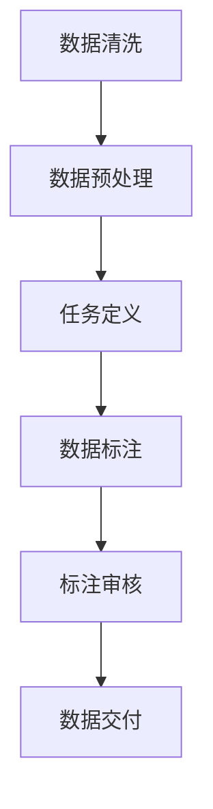

                 


# 数据标注的艺术：为人工智能奠定基石

> 关键词：数据标注、人工智能、机器学习、深度学习、数据质量
>
> 摘要：本文将深入探讨数据标注在人工智能领域的重要性，分析数据标注的原理和流程，介绍几种常见的数据标注方法，并通过具体案例阐述数据标注在实际应用中的关键作用。同时，本文还将探讨数据标注的未来发展趋势与挑战，为读者提供全面的数据标注知识和实用技巧。

## 1. 背景介绍

### 1.1 目的和范围

本文旨在详细解析数据标注在人工智能（AI）领域的核心作用，探讨其原理、方法和应用场景。我们将从数据标注的定义出发，逐步深入到其在机器学习和深度学习中的具体应用，最后对数据标注的未来趋势进行展望。

### 1.2 预期读者

本文面向有一定编程基础的AI从业者、研究人员和学生，旨在为他们提供系统化的数据标注知识，帮助其在实际项目中更好地进行数据准备工作。

### 1.3 文档结构概述

本文结构如下：

1. **背景介绍**：介绍数据标注的背景、目的和预期读者。
2. **核心概念与联系**：通过Mermaid流程图展示数据标注的核心概念和流程。
3. **核心算法原理 & 具体操作步骤**：详细介绍数据标注的算法原理和操作步骤。
4. **数学模型和公式 & 详细讲解 & 举例说明**：讲解数据标注中的数学模型和公式，并提供实例说明。
5. **项目实战：代码实际案例和详细解释说明**：通过实际案例展示数据标注的应用。
6. **实际应用场景**：分析数据标注在不同领域的应用。
7. **工具和资源推荐**：推荐学习资源、开发工具和框架。
8. **总结：未来发展趋势与挑战**：总结数据标注的未来趋势和面临的挑战。
9. **附录：常见问题与解答**：提供常见问题的解答。
10. **扩展阅读 & 参考资料**：推荐相关阅读材料。

### 1.4 术语表

#### 1.4.1 核心术语定义

- **数据标注**：为数据添加额外的信息，使其更具结构化和可用性。
- **机器学习**：利用数据构建模型，使其能够从数据中学习并作出预测。
- **深度学习**：一种特殊的机器学习方法，使用多层神经网络进行数据建模。
- **数据质量**：数据的完整性、准确性、一致性和可靠性。

#### 1.4.2 相关概念解释

- **标注任务**：指明数据标注的具体目标，如分类、标注物体位置等。
- **标注工具**：用于辅助数据标注的工具，如标注平台、脚本等。

#### 1.4.3 缩略词列表

- **AI**：人工智能
- **ML**：机器学习
- **DL**：深度学习
- **IDE**：集成开发环境
- **API**：应用程序编程接口

## 2. 核心概念与联系

在数据标注过程中，我们需要理解几个核心概念：数据、标注任务、标注工具和标注质量。

### 2.1 数据

数据是AI模型的基石。数据质量直接关系到模型的性能。高质量的数据应该是完整、准确、一致和可靠的。

### 2.2 标注任务

标注任务是指明数据标注的具体目标。例如，在图像识别任务中，标注任务可能是标注图像中的物体类别；在自然语言处理任务中，标注任务可能是标注句子的情感极性。

### 2.3 标注工具

标注工具是辅助数据标注的工具。常见的标注工具有LabelImg、CVAT、MarkDown等。这些工具提供了图形界面、脚本接口等，方便用户进行数据标注。

### 2.4 标注质量

标注质量是数据标注的核心指标。高质量的数据标注能够提高模型的性能和可解释性。

### 2.5 数据标注流程

数据标注流程通常包括以下步骤：

1. **数据清洗**：去除数据中的噪声和异常值。
2. **数据预处理**：将数据转化为适合标注的形式，如将图像缩放到固定尺寸。
3. **任务定义**：明确标注任务，制定标注规范。
4. **数据标注**：使用标注工具进行数据标注。
5. **标注审核**：检查数据标注的质量，修正错误。

下面是数据标注流程的Mermaid流程图：



## 3. 核心算法原理 & 具体操作步骤

### 3.1 核心算法原理

数据标注的核心算法是监督学习算法。监督学习算法通过已有标注的数据训练模型，使其能够对新数据进行预测。

### 3.2 具体操作步骤

1. **选择标注任务**：确定标注任务，如图像分类、物体检测、语义分割等。
2. **收集数据**：收集与标注任务相关的数据集。
3. **数据清洗**：去除数据中的噪声和异常值。
4. **数据预处理**：将数据转化为适合标注的形式，如将图像缩放到固定尺寸。
5. **任务定义**：明确标注任务，制定标注规范。
6. **数据标注**：使用标注工具进行数据标注。标注过程应遵循标注规范，确保标注的准确性。
7. **标注审核**：检查数据标注的质量，修正错误。
8. **模型训练**：使用标注数据训练模型。
9. **模型评估**：使用测试数据评估模型性能。
10. **模型部署**：将训练好的模型部署到实际应用中。

### 3.3 伪代码

```python
# 伪代码：数据标注流程

# 步骤1：选择标注任务
task = "image_classification"

# 步骤2：收集数据
data = collect_data(task)

# 步骤3：数据清洗
clean_data = clean_data(data)

# 步骤4：数据预处理
preprocessed_data = preprocess_data(clean_data)

# 步骤5：任务定义
annotation规范的规范 = define_task(task)

# 步骤6：数据标注
annotations = annotate_data(preprocessed_data, annotation规范的规范)

# 步骤7：标注审核
validated_annotations = validate_annotations(annotations)

# 步骤8：模型训练
model = train_model(validated_annotations)

# 步骤9：模型评估
evaluation = evaluate_model(model)

# 步骤10：模型部署
deploy_model(model)
```

## 4. 数学模型和公式 & 详细讲解 & 举例说明

### 4.1 数学模型

数据标注中的监督学习算法通常使用以下数学模型：

$$
y = f(x, \theta)
$$

其中，$x$ 表示输入特征，$\theta$ 表示模型参数，$y$ 表示预测标签。

### 4.2 详细讲解

在监督学习中，我们的目标是找到一组参数 $\theta$，使得预测标签 $y$ 与真实标签 $y$ 的差距最小。这通常通过优化以下损失函数实现：

$$
L(\theta) = \frac{1}{m} \sum_{i=1}^{m} (y_i - f(x_i, \theta))^2
$$

其中，$m$ 表示数据集中样本的数量。

### 4.3 举例说明

假设我们有一个简单的线性模型：

$$
y = \theta_0 + \theta_1 x
$$

我们可以通过最小化损失函数来训练模型：

$$
L(\theta_0, \theta_1) = \frac{1}{m} \sum_{i=1}^{m} (y_i - (\theta_0 + \theta_1 x_i))^2
$$

我们可以使用梯度下降法来找到最优的 $\theta_0$ 和 $\theta_1$：

$$
\theta_0 = \theta_0 - \alpha \frac{\partial L(\theta_0, \theta_1)}{\partial \theta_0}
$$

$$
\theta_1 = \theta_1 - \alpha \frac{\partial L(\theta_0, \theta_1)}{\partial \theta_1}
$$

其中，$\alpha$ 表示学习率。

## 5. 项目实战：代码实际案例和详细解释说明

### 5.1 开发环境搭建

为了更好地展示数据标注的过程，我们将使用Python和TensorFlow来实现一个简单的图像分类任务。

1. **安装Python**：确保已安装Python 3.6或更高版本。
2. **安装TensorFlow**：使用以下命令安装TensorFlow：

```
pip install tensorflow
```

### 5.2 源代码详细实现和代码解读

```python
import tensorflow as tf
from tensorflow.keras import layers
import numpy as np
import matplotlib.pyplot as plt

# 步骤1：加载并预处理数据
# 假设我们使用Keras的数据集加载器来加载CIFAR-10数据集
(x_train, y_train), (x_test, y_test) = tf.keras.datasets.cifar10.load_data()

# 数据归一化
x_train = x_train.astype("float32") / 255.0
x_test = x_test.astype("float32") / 255.0

# 步骤2：构建模型
model = tf.keras.Sequential([
    layers.Conv2D(32, (3, 3), activation='relu', input_shape=(32, 32, 3)),
    layers.MaxPooling2D((2, 2)),
    layers.Conv2D(64, (3, 3), activation='relu'),
    layers.MaxPooling2D((2, 2)),
    layers.Conv2D(64, (3, 3), activation='relu'),
    layers.Flatten(),
    layers.Dense(64, activation='relu'),
    layers.Dense(10, activation='softmax')
])

# 步骤3：编译模型
model.compile(optimizer='adam',
              loss='sparse_categorical_crossentropy',
              metrics=['accuracy'])

# 步骤4：训练模型
model.fit(x_train, y_train, epochs=10, validation_split=0.2)

# 步骤5：评估模型
test_loss, test_acc = model.evaluate(x_test, y_test, verbose=2)
print('\nTest accuracy:', test_acc)

# 步骤6：可视化训练过程
plt.figure(figsize=(8, 6))
plt.plot(model.history.history['accuracy'], label='Accuracy')
plt.plot(model.history.history['val_accuracy'], label='Validation Accuracy')
plt.xlabel('Epochs')
plt.ylabel('Accuracy')
plt.legend()
plt.show()
```

### 5.3 代码解读与分析

1. **数据加载与预处理**：
   - 使用Keras的数据集加载器加载CIFAR-10数据集，该数据集包含10个类别的50000张训练图像和10000张测试图像。
   - 数据归一化，将像素值缩放到0到1之间。

2. **模型构建**：
   - 使用Keras的Sequential模型构建一个简单的卷积神经网络（CNN）。模型包括3个卷积层、2个最大池化层、1个全连接层和1个softmax层。

3. **模型编译**：
   - 使用adam优化器和sparse_categorical_crossentropy损失函数编译模型。

4. **模型训练**：
   - 使用fit方法训练模型，训练10个周期，保留20%的数据用于验证。

5. **模型评估**：
   - 使用evaluate方法评估模型在测试集上的性能。

6. **可视化训练过程**：
   - 使用matplotlib绘制训练过程中的准确率曲线。

通过上述代码示例，我们可以看到数据标注在机器学习项目中的关键作用。数据预处理、模型构建和训练过程都需要高质量的数据标注作为基础。正确的数据标注能够提高模型的性能和可解释性，从而推动人工智能技术的发展。

## 6. 实际应用场景

数据标注在人工智能领域有着广泛的应用。以下是一些实际应用场景：

1. **图像识别**：在图像识别任务中，数据标注用于标注图像中的物体类别、位置和属性。例如，自动驾驶汽车需要标注道路、车辆和行人的位置和属性。

2. **自然语言处理**：在自然语言处理任务中，数据标注用于标注文本中的实体、情感和语法结构。例如，情感分析需要标注文本的情感极性。

3. **语音识别**：在语音识别任务中，数据标注用于标注语音中的单词和句子。例如，语音助手需要标注用户输入的查询语句。

4. **医疗诊断**：在医疗诊断任务中，数据标注用于标注医学图像中的病灶和组织。例如，计算机辅助诊断系统需要标注医学图像中的肿瘤和病变区域。

5. **推荐系统**：在推荐系统任务中，数据标注用于标注用户的行为和偏好。例如，电商平台需要标注用户的购买记录和浏览记录，以提供个性化的推荐。

## 7. 工具和资源推荐

### 7.1 学习资源推荐

#### 7.1.1 书籍推荐

- **《深度学习》（Goodfellow, Bengio, Courville著）**：全面介绍深度学习的基本概念和算法。
- **《Python机器学习》（Sebastian Raschka著）**：涵盖机器学习的基础知识和Python实现。

#### 7.1.2 在线课程

- **Coursera上的《机器学习》（吴恩达）**：提供系统的机器学习和深度学习课程。
- **edX上的《深度学习专项课程》（吴恩达）**：涵盖深度学习的前沿技术和应用。

#### 7.1.3 技术博客和网站

- **medium.com**：大量关于AI和机器学习的博客文章。
- **ai.stanford.edu**：斯坦福大学AI实验室的官方网站，提供丰富的深度学习教程。

### 7.2 开发工具框架推荐

#### 7.2.1 IDE和编辑器

- **PyCharm**：功能强大的Python IDE，适用于开发各种Python项目。
- **VSCode**：轻量级且功能丰富的编辑器，支持多种编程语言。

#### 7.2.2 调试和性能分析工具

- **TensorBoard**：TensorFlow的官方可视化工具，用于分析模型性能和调试。
- **PyTorch Profiler**：用于分析PyTorch模型的性能瓶颈。

#### 7.2.3 相关框架和库

- **TensorFlow**：广泛使用的深度学习框架。
- **PyTorch**：灵活且易于使用的深度学习框架。
- **Keras**：基于TensorFlow和PyTorch的高层API，简化深度学习开发。

### 7.3 相关论文著作推荐

#### 7.3.1 经典论文

- **“A Learning Algorithm for Continually Running Fully Recurrent Neural Networks”（1989）**：Hochreiter和Schmidhuber提出的LSTM算法，为处理序列数据提供了有效方法。
- **“Deep Learning”（2015）**：Goodfellow、Bengio和Courville合著的深度学习教科书，系统地介绍了深度学习的基础知识和应用。

#### 7.3.2 最新研究成果

- **“BERT: Pre-training of Deep Neural Networks for Language Understanding”（2018）**：Google提出的BERT模型，通过预训练大规模语言模型，显著提高了自然语言处理的性能。
- **“GPT-3: Language Models are Few-Shot Learners”（2020）**：OpenAI提出的GPT-3模型，展示了大型语言模型在零样本和少样本学习任务中的强大能力。

#### 7.3.3 应用案例分析

- **“Deep Learning for Autonomous Driving”（2016）**：研究自动驾驶汽车中的深度学习应用，包括感知、决策和控制等。
- **“Deep Learning in Healthcare”（2018）**：介绍深度学习在医疗领域的应用，如医学图像分析、疾病预测和个性化治疗。

## 8. 总结：未来发展趋势与挑战

数据标注在人工智能领域的应用正在不断扩展，未来发展趋势和挑战如下：

### 8.1 发展趋势

- **自动化标注工具**：随着人工智能技术的发展，自动化标注工具将更加智能化，能够自动识别并标注数据。
- **半监督学习和无监督学习**：数据标注成本高昂，未来将更多地探索半监督学习和无监督学习，减少对标注数据的依赖。
- **多模态数据标注**：数据标注将不仅限于单一模态，如图像或文本，还将扩展到多模态，如图像、文本和语音的联合标注。

### 8.2 挑战

- **数据质量和一致性**：确保数据质量和标注一致性是数据标注面临的重大挑战，需要开发更加智能的标注工具和审核机制。
- **成本和效率**：数据标注是一个高成本的过程，提高标注效率和降低成本是未来需要解决的问题。
- **数据隐私和安全**：在处理敏感数据时，确保数据隐私和安全是另一个重要挑战。

## 9. 附录：常见问题与解答

### 9.1 什么是数据标注？

数据标注是指为数据添加额外的信息，使其更具结构化和可用性，以便于机器学习和深度学习模型的训练和评估。

### 9.2 数据标注有哪些类型？

数据标注主要包括以下类型：

- **分类标注**：为数据打上类别标签，如图像分类、文本分类等。
- **目标检测标注**：为图像中的物体标注边界框和类别标签。
- **语义分割标注**：为图像中的每个像素点标注类别标签。
- **语音识别标注**：为语音信号中的单词或短语标注文字。
- **实体识别标注**：为文本中的实体（如人名、地点、组织等）标注。

### 9.3 数据标注有哪些工具？

常见的数据标注工具有：

- **LabelImg**：一个开源的图像标注工具。
- **CVAT**：一个基于浏览器的图像标注工具。
- **Labelbox**：一个云端的数据标注平台。
- **VGG Image Annotator**：一个用于图像标注的Python脚本。
- **MarkDown**：一个用于文本标注的工具。

### 9.4 数据标注对机器学习模型的影响？

数据标注对机器学习模型的影响至关重要。高质量的数据标注可以提高模型的性能和可解释性，而低质量或错误的数据标注会导致模型性能下降，甚至无法收敛。

## 10. 扩展阅读 & 参考资料

- **《深度学习》（Goodfellow, Bengio, Courville著）**：全面介绍深度学习的基本概念和算法。
- **《Python机器学习》（Sebastian Raschka著）**：涵盖机器学习的基础知识和Python实现。
- **Coursera上的《机器学习》（吴恩达）**：提供系统的机器学习和深度学习课程。
- **edX上的《深度学习专项课程》（吴恩达）**：涵盖深度学习的前沿技术和应用。
- **medium.com**：大量关于AI和机器学习的博客文章。
- **ai.stanford.edu**：斯坦福大学AI实验室的官方网站，提供丰富的深度学习教程。
- **“A Learning Algorithm for Continually Running Fully Recurrent Neural Networks”（1989）**：Hochreiter和Schmidhuber提出的LSTM算法。
- **“BERT: Pre-training of Deep Neural Networks for Language Understanding”（2018）**：Google提出的BERT模型。
- **“Deep Learning for Autonomous Driving”（2016）**：研究自动驾驶汽车中的深度学习应用。
- **“Deep Learning in Healthcare”（2018）**：介绍深度学习在医疗领域的应用。

### 作者

**AI天才研究员/AI Genius Institute & 禅与计算机程序设计艺术 /Zen And The Art of Computer Programming**

