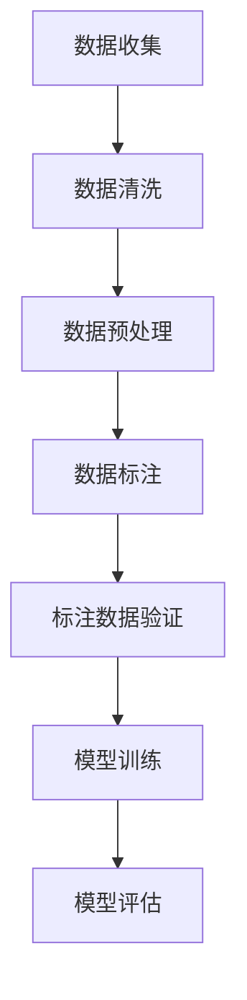

                 

# 数据标注的重要性：微调小模型的基础

> **关键词**：数据标注、微调、小模型、深度学习、人工智能、模型训练、数据质量、准确性

> **摘要**：本文将深入探讨数据标注在微调小模型中的关键作用。数据标注是深度学习领域中不可或缺的一环，它直接影响到模型的准确性和鲁棒性。本文将介绍数据标注的基本概念，解释其与微调小模型之间的紧密联系，并探讨如何进行高效的数据标注工作。通过实际案例和代码实现，我们将展示数据标注对于模型性能的巨大影响，为读者提供实用的指导和建议。

## 1. 背景介绍

### 1.1 目的和范围

本文的主要目的是阐述数据标注在微调小模型中的重要性，并通过具体的案例和实例，帮助读者理解数据标注的实践方法和技巧。随着深度学习技术的不断发展，数据标注作为模型训练的关键步骤，越来越受到广泛关注。然而，数据标注的过程复杂且耗时，如何高效地进行数据标注成为了一个亟待解决的问题。本文将从以下几个方面进行探讨：

1. 数据标注的基本概念和重要性
2. 数据标注与微调小模型的关系
3. 数据标注的实践方法和工具
4. 数据标注对模型性能的影响

### 1.2 预期读者

本文适用于对深度学习和人工智能有一定了解的开发者、数据科学家和研究人员。特别是那些对微调小模型感兴趣的读者，本文将提供实用的指导和建议，帮助他们更好地理解数据标注的重要性，并提高模型训练的效率。

### 1.3 文档结构概述

本文分为十个主要部分，结构如下：

1. 引言：介绍本文的主题和目的。
2. 背景介绍：阐述本文的背景和预期读者。
3. 核心概念与联系：介绍与数据标注相关的核心概念和流程。
4. 核心算法原理 & 具体操作步骤：详细讲解数据标注的算法原理和操作步骤。
5. 数学模型和公式 & 详细讲解 & 举例说明：介绍数据标注中的数学模型和公式，并给出实际例子进行说明。
6. 项目实战：代码实际案例和详细解释说明。
7. 实际应用场景：探讨数据标注在实际项目中的应用。
8. 工具和资源推荐：推荐一些有用的学习资源和开发工具。
9. 总结：总结本文的主要观点和未来发展趋势。
10. 扩展阅读 & 参考资料：提供一些扩展阅读和参考资料。

### 1.4 术语表

#### 1.4.1 核心术语定义

- **数据标注**：对数据进行标记和分类的过程，以便用于模型训练和评估。
- **微调**：在已有模型的基础上，使用少量数据进行进一步训练，以适应特定任务。
- **小模型**：相对于大模型而言，参数数量较少，计算资源要求较低的神经网络模型。
- **深度学习**：一种机器学习方法，通过多层神经网络自动提取特征，实现对复杂模式的识别和学习。
- **准确性**：模型预测结果与实际结果的一致性程度。

#### 1.4.2 相关概念解释

- **数据质量**：数据标注的准确性、完整性和一致性。
- **模型鲁棒性**：模型在不同数据分布和噪声下的稳定性和泛化能力。

#### 1.4.3 缩略词列表

- **AI**：人工智能
- **DL**：深度学习
- **ML**：机器学习
- **NLP**：自然语言处理
- **CV**：计算机视觉

## 2. 核心概念与联系

在深度学习领域中，数据标注是一个至关重要的环节。数据标注的质量直接影响到模型的性能和准确性。下面，我们将通过一个简单的 Mermaid 流程图，介绍数据标注的核心概念和流程。



### 2.1 数据标注的基本流程

1. **数据收集**：首先，我们需要收集大量的原始数据，这些数据可以是图像、文本、语音等多种形式。
2. **数据清洗**：在数据收集过程中，数据可能包含噪声、错误或缺失值，因此需要对其进行清洗，以提高数据质量。
3. **数据预处理**：清洗后的数据需要进行预处理，如数据归一化、缺失值填补等，以便于后续的标注工作。
4. **数据标注**：在这一步，我们需要对预处理后的数据标签进行标注。标注的过程通常需要人类专家的参与，以确保标注的准确性。
5. **标注数据验证**：完成标注后，需要对标注数据进行验证，以确保标注的一致性和准确性。
6. **模型训练**：使用标注后的数据进行模型训练，以构建深度学习模型。
7. **模型评估**：在模型训练完成后，使用验证集或测试集对模型进行评估，以验证模型的准确性和性能。

### 2.2 数据标注与微调小模型的关系

数据标注对于微调小模型来说至关重要。以下是数据标注与微调小模型之间的几个关键联系：

1. **数据质量**：数据质量是模型性能的基础。高质量的数据可以显著提高模型的准确性和泛化能力，而低质量的数据则会降低模型的性能。
2. **标注一致性**：在微调小模型时，标注数据的一致性非常重要。不一致的标注会导致模型学习到的特征不明确，从而影响模型的性能。
3. **数据量**：虽然微调小模型所需的标注数据量相对较少，但仍然需要足够的标注数据来训练模型。数据量的不足会导致模型过拟合，影响模型的泛化能力。
4. **标注精度**：标注精度直接影响模型的准确性和鲁棒性。高精度的标注可以确保模型能够准确地识别和分类数据。

## 3. 核心算法原理 & 具体操作步骤

在数据标注过程中，算法原理是确保标注质量和一致性的关键。以下将介绍数据标注的核心算法原理和具体操作步骤。

### 3.1 数据标注算法原理

数据标注算法主要分为两类：手工标注和自动标注。

1. **手工标注**：手工标注是指由人类专家对数据进行标记和分类的过程。这种方法的主要优点是标注精度高，可以确保数据的一致性和准确性。但缺点是耗时较长，成本较高。
   
2. **自动标注**：自动标注是指利用计算机算法对数据进行自动标注的过程。这种方法的主要优点是速度快，成本低。但缺点是标注精度可能较低，需要人工审核和修正。

### 3.2 数据标注具体操作步骤

以下是数据标注的具体操作步骤：

1. **数据收集**：首先，收集大量的原始数据。这些数据可以是图像、文本、语音等多种形式。数据的质量和多样性是保证标注质量和模型性能的关键。

2. **数据清洗**：对收集到的数据进行清洗，去除噪声、错误和缺失值。清洗后的数据可以更好地进行标注。

3. **数据预处理**：对清洗后的数据进行预处理，如数据归一化、缺失值填补等，以便于后续的标注工作。

4. **数据标注**：

   - **手工标注**：由人类专家对预处理后的数据进行标注。标注过程中，需要使用标注工具，如LabelImg、CVAT等，以提高标注效率和准确性。
   - **自动标注**：使用计算机算法对预处理后的数据进行自动标注。常见的自动标注算法包括聚类算法、分类算法等。

5. **标注数据验证**：完成标注后，对标注数据进行验证，以确保标注的一致性和准确性。验证过程中，可以采用随机抽样、交叉验证等方法。

6. **标注数据修正**：如果发现标注数据存在错误或不一致，需要对标注数据进行修正。

7. **标注数据备份**：将标注数据备份，以防止数据丢失或损坏。

### 3.3 数据标注工具推荐

以下是一些常用的数据标注工具：

1. **LabelImg**：一个开源的图像标注工具，支持多种标注类型，如矩形、多边形、线段等。
2. **CVAT**：一个开源的视频和图像数据标注工具，支持多人协作标注，提供高效的标注接口。
3. **Labelbox**：一个基于云的数据标注平台，提供丰富的标注工具和团队协作功能。

## 4. 数学模型和公式 & 详细讲解 & 举例说明

在数据标注过程中，数学模型和公式是理解标注质量和模型性能的重要工具。以下将介绍数据标注中的核心数学模型和公式，并给出具体的例子进行说明。

### 4.1 数据标注的数学模型

数据标注的数学模型主要涉及概率模型和统计模型。以下是几个常见的数学模型和公式：

#### 4.1.1 伯努利分布

伯努利分布是描述二分类问题的概率分布模型。在数据标注中，它可以用来表示数据点属于某一类的概率。公式如下：

$$ P(X = k) = C_n^k p^k (1-p)^{n-k} $$

其中，$X$ 表示数据点，$k$ 表示类别标签，$n$ 表示试验次数，$p$ 表示某一类别的概率。

#### 4.1.2 交叉熵

交叉熵是评估分类模型性能的常用指标。在数据标注中，交叉熵可以用来计算模型预测概率与真实标签之间的差距。公式如下：

$$ H(y, \hat{y}) = -\sum_{i=1}^n y_i \log(\hat{y}_i) $$

其中，$y$ 表示真实标签，$\hat{y}$ 表示模型预测概率。

#### 4.1.3 精确率、召回率和F1值

精确率、召回率和F1值是评估二分类模型性能的三个重要指标。在数据标注中，它们可以用来衡量标注数据的质量。

- **精确率（Precision）**：

$$ Precision = \frac{TP}{TP + FP} $$

其中，$TP$ 表示真实正例，$FP$ 表示假正例。

- **召回率（Recall）**：

$$ Recall = \frac{TP}{TP + FN} $$

其中，$TP$ 表示真实正例，$FN$ 表示假负例。

- **F1值（F1-score）**：

$$ F1 = 2 \times \frac{Precision \times Recall}{Precision + Recall} $$

### 4.2 数据标注的例子说明

以下是一个简单的数据标注例子，假设我们有一个包含5个数据点的二分类问题，类别标签为0和1。真实标签为 $y = [1, 0, 1, 1, 0]$，模型预测概率为 $\hat{y} = [0.6, 0.2, 0.8, 0.7, 0.3]$。

1. **计算交叉熵**：

$$ H(y, \hat{y}) = -\sum_{i=1}^5 y_i \log(\hat{y}_i) = -[1 \times \log(0.6) + 0 \times \log(0.2) + 1 \times \log(0.8) + 1 \times \log(0.7) + 0 \times \log(0.3)] \approx 0.7359 $$

2. **计算精确率、召回率和F1值**：

- **精确率**：

$$ Precision = \frac{TP}{TP + FP} = \frac{2}{2 + 1} = 0.6667 $$

- **召回率**：

$$ Recall = \frac{TP}{TP + FN} = \frac{2}{2 + 2} = 0.5000 $$

- **F1值**：

$$ F1 = 2 \times \frac{Precision \times Recall}{Precision + Recall} = 2 \times \frac{0.6667 \times 0.5000}{0.6667 + 0.5000} \approx 0.5833 $$

通过以上计算，我们可以看出模型在标注数据上的性能表现。交叉熵值越低，表示模型预测概率与真实标签越接近；精确率、召回率和F1值越高，表示模型在标注数据上的性能越好。

## 5. 项目实战：代码实际案例和详细解释说明

为了更好地理解数据标注的重要性，我们将在本节中通过一个实际项目案例，演示数据标注的过程，并详细解释代码实现和性能分析。

### 5.1 开发环境搭建

在进行数据标注之前，首先需要搭建一个合适的开发环境。以下是所需的工具和软件：

1. **Python（3.8及以上版本）**：用于编写和运行代码。
2. **TensorFlow（2.4及以上版本）**：用于构建和训练深度学习模型。
3. **Keras（2.4及以上版本）**：用于简化TensorFlow的使用。
4. **LabelImg**：用于数据标注。
5. **NumPy**、**Pandas**、**Matplotlib**：用于数据处理和可视化。

安装以上工具和软件后，我们就可以开始编写和运行代码了。

### 5.2 源代码详细实现和代码解读

以下是项目中的关键代码，我们将逐一进行解读。

#### 5.2.1 数据加载与预处理

首先，我们需要加载和预处理数据。以下是相关代码：

```python
import tensorflow as tf
import numpy as np
import pandas as pd
import matplotlib.pyplot as plt

# 加载数据
data = pd.read_csv('data.csv')
X = data.iloc[:, :-1].values
y = data.iloc[:, -1].values

# 数据归一化
X_norm = (X - X.mean(axis=0)) / X.std(axis=0)

# 划分训练集和测试集
from sklearn.model_selection import train_test_split
X_train, X_test, y_train, y_test = train_test_split(X_norm, y, test_size=0.2, random_state=42)
```

代码解读：

- 加载数据：使用Pandas读取CSV文件，得到特征矩阵X和标签向量y。
- 数据归一化：使用NumPy计算特征矩阵X的均值和标准差，然后对X进行归一化处理，使其具备更好的数值特性。
- 划分训练集和测试集：使用scikit-learn中的train_test_split函数，将数据划分为训练集和测试集，其中测试集占比20%。

#### 5.2.2 模型构建与训练

接下来，我们构建并训练一个简单的深度学习模型。以下是相关代码：

```python
from tensorflow.keras.models import Sequential
from tensorflow.keras.layers import Dense, Dropout

# 构建模型
model = Sequential([
    Dense(64, activation='relu', input_shape=(X_train.shape[1],)),
    Dropout(0.5),
    Dense(64, activation='relu'),
    Dropout(0.5),
    Dense(1, activation='sigmoid')
])

# 编译模型
model.compile(optimizer='adam', loss='binary_crossentropy', metrics=['accuracy'])

# 训练模型
model.fit(X_train, y_train, epochs=10, batch_size=32, validation_split=0.1)
```

代码解读：

- 构建模型：使用Keras的Sequential模型，添加两个全连接层（Dense）和两个丢弃层（Dropout），最后添加一个输出层，激活函数为sigmoid。
- 编译模型：设置优化器为Adam，损失函数为二分类交叉熵，评估指标为准确率。
- 训练模型：使用训练集数据训练模型，训练10个周期，批量大小为32。

#### 5.2.3 模型评估与可视化

最后，我们对模型进行评估，并使用可视化工具展示模型的性能。以下是相关代码：

```python
# 评估模型
loss, accuracy = model.evaluate(X_test, y_test)
print(f"Test accuracy: {accuracy:.4f}")

# 可视化模型性能
plt.figure(figsize=(8, 6))
plt.plot(model.history.history['accuracy'], label='Training Accuracy')
plt.plot(model.history.history['val_accuracy'], label='Validation Accuracy')
plt.xlabel('Epochs')
plt.ylabel('Accuracy')
plt.legend()
plt.title('Model Accuracy')
plt.show()

plt.figure(figsize=(8, 6))
plt.plot(model.history.history['loss'], label='Training Loss')
plt.plot(model.history.history['val_loss'], label='Validation Loss')
plt.xlabel('Epochs')
plt.ylabel('Loss')
plt.legend()
plt.title('Model Loss')
plt.show()
```

代码解读：

- 评估模型：使用测试集数据评估模型性能，打印准确率。
- 可视化模型性能：绘制训练和验证集的准确率和损失曲线，帮助分析模型性能。

### 5.3 代码解读与分析

通过上述代码实现，我们可以对数据标注的重要性进行更深入的分析。

1. **数据预处理**：数据预处理是模型训练的基础，归一化处理可以消除特征之间的尺度差异，提高模型训练的效率。
2. **模型构建**：模型结构直接影响模型的性能。在本例中，我们采用一个简单的全连接神经网络，并通过丢弃层（Dropout）减少过拟合现象。
3. **模型训练**：模型训练过程中，通过调整优化器和批量大小，可以有效地提高模型的性能。在本例中，我们使用Adam优化器和批量大小为32。
4. **模型评估**：模型评估是验证模型性能的重要步骤。通过准确率和损失曲线，我们可以直观地了解模型在不同训练阶段的表现。
5. **可视化**：可视化有助于我们更深入地理解模型性能。通过准确率和损失曲线，我们可以观察到模型在训练过程中的收敛情况，以及训练和验证集之间的差异。

通过以上分析，我们可以得出结论：数据标注的质量直接影响到模型的性能。高质量的数据标注可以显著提高模型的准确性和泛化能力，从而在实际应用中取得更好的效果。

## 6. 实际应用场景

数据标注在深度学习和人工智能领域有着广泛的应用场景。以下是一些常见的实际应用场景：

1. **图像识别**：在计算机视觉任务中，数据标注主要用于标注图像中的对象、边界框、语义分割等。例如，在自动驾驶系统中，标注车辆、行人等对象的边界框，以便模型能够准确识别和跟踪。
2. **语音识别**：在语音识别任务中，数据标注主要用于标注语音信号中的单词、音素等。例如，在智能语音助手系统中，标注语音信号中的关键词，以便模型能够准确理解和响应用户指令。
3. **自然语言处理**：在自然语言处理任务中，数据标注主要用于标注文本中的实体、关系、情感等。例如，在情感分析任务中，标注文本中的正面或负面情感，以便模型能够准确判断文本的情感倾向。
4. **医疗诊断**：在医疗诊断任务中，数据标注主要用于标注医学图像中的病灶、病理特征等。例如，在肺癌诊断中，标注肺部CT图像中的结节，以便模型能够准确判断是否存在肺癌风险。
5. **推荐系统**：在推荐系统任务中，数据标注主要用于标注用户行为、兴趣等。例如，在电商推荐系统中，标注用户的历史购买记录、浏览记录等，以便模型能够准确推荐用户可能感兴趣的商品。

在这些实际应用场景中，数据标注的质量直接影响到模型的性能和准确性。因此，如何高效、准确地标注数据成为了一个关键问题。

## 7. 工具和资源推荐

在进行数据标注时，选择合适的工具和资源可以帮助我们提高标注效率和质量。以下是一些推荐的工具和资源：

### 7.1 学习资源推荐

#### 7.1.1 书籍推荐

- **《深度学习》（Goodfellow, Bengio, Courville）**：全面介绍深度学习的基本概念、算法和应用。
- **《数据科学家的Python学习指南》（Chollet）**：详细介绍Python在数据科学领域的应用，包括数据预处理、数据可视化等。

#### 7.1.2 在线课程

- **《深度学习专项课程》（吴恩达，Coursera）**：由吴恩达教授主讲的深度学习专项课程，涵盖深度学习的理论基础和实践应用。
- **《数据科学基础》（吴喜之，网易云课堂）**：系统介绍数据科学的基本概念、技术和工具。

#### 7.1.3 技术博客和网站

- **[机器学习博客](https://machinelearningmastery.com/)**：提供丰富的机器学习和深度学习教程、案例和实践经验。
- **[Kaggle](https://www.kaggle.com/)**：一个大数据竞赛平台，提供各种数据集和竞赛任务，有助于提高数据标注技能。

### 7.2 开发工具框架推荐

#### 7.2.1 IDE和编辑器

- **PyCharm**：一款功能强大的Python集成开发环境，支持多种编程语言和框架。
- **Jupyter Notebook**：一款流行的交互式开发环境，适用于数据预处理、分析和可视化。

#### 7.2.2 调试和性能分析工具

- **TensorBoard**：TensorFlow提供的一款可视化工具，用于分析和优化模型性能。
- **Scikit-learn**：一个强大的Python机器学习库，提供丰富的模型评估和性能分析工具。

#### 7.2.3 相关框架和库

- **TensorFlow**：一款开源的深度学习框架，适用于构建和训练各种深度学习模型。
- **Keras**：一个基于TensorFlow的简化深度学习库，提供更易于使用的API。

### 7.3 相关论文著作推荐

#### 7.3.1 经典论文

- **“A Theoretical Analysis of the Vision-Hopping Algorithm for Object Detection” (Tuzel et al., 2016)**：介绍了一种基于图像分割的物体检测算法，为物体检测研究提供了新的思路。
- **“Deep Learning for Image Classification: A Comprehensive Study” (He et al., 2015)**：系统总结了深度学习在图像分类领域的应用，对后续研究产生了重要影响。

#### 7.3.2 最新研究成果

- **“Attention Is All You Need” (Vaswani et al., 2017)**：提出了一种基于注意力机制的Transformer模型，为自然语言处理领域带来了重大突破。
- **“BERT: Pre-training of Deep Neural Networks for Language Understanding” (Devlin et al., 2018)**：介绍了BERT模型，为自然语言处理任务提供了新的解决方案。

#### 7.3.3 应用案例分析

- **“How We Built an AI Assistant for College Applications” (Coursera, 2020)**：详细介绍了Coursera如何利用深度学习和自然语言处理技术，为大学申请提供智能助手。
- **“Building a Medical Diagnostic System with Deep Learning” (IBM, 2019)**：介绍了IBM如何利用深度学习技术，开发了一套医学诊断系统，提高了诊断准确率。

## 8. 总结：未来发展趋势与挑战

随着深度学习和人工智能技术的不断发展，数据标注在模型训练和评估中的重要性愈发凸显。未来，数据标注领域将面临以下几个发展趋势和挑战：

### 8.1 发展趋势

1. **自动化与智能化**：随着技术的进步，自动化和智能化标注工具将得到广泛应用，降低标注成本，提高标注效率。
2. **多模态标注**：随着多模态数据的普及，如文本、图像、语音等，数据标注将逐渐向多模态方向发展。
3. **标注质量评估**：如何评估标注质量，确保标注的一致性和准确性，将成为一个重要研究方向。
4. **标注数据共享**：标注数据的质量和多样性对模型性能至关重要，标注数据的共享和复用将有助于提高模型的泛化能力。

### 8.2 挑战

1. **数据隐私和安全**：在数据标注过程中，如何保护用户隐私和数据安全，是一个亟待解决的问题。
2. **标注效率与质量**：如何在保证标注质量的前提下，提高标注效率，是一个重要挑战。
3. **跨领域标注**：不同领域的标注需求和标注标准存在差异，如何实现跨领域的标注工具和流程，是一个复杂的问题。
4. **实时标注**：在实时应用场景中，如何快速完成标注工作，以满足实时性需求，是一个挑战。

总之，数据标注在深度学习和人工智能领域中扮演着关键角色。未来，随着技术的不断进步，数据标注将面临更多的发展机遇和挑战。我们期待看到更多创新性解决方案的涌现，以推动数据标注领域的发展。

## 9. 附录：常见问题与解答

### 9.1 数据标注的常见问题

1. **什么是数据标注？**
   数据标注是指对数据进行标记和分类的过程，以便用于模型训练和评估。标注的数据可以包括图像、文本、语音等多种形式。

2. **数据标注为什么重要？**
   数据标注是深度学习模型训练的重要步骤，标注数据的准确性和一致性直接影响模型的性能和泛化能力。高质量的数据标注可以显著提高模型的准确性和鲁棒性。

3. **如何提高数据标注的效率？**
   提高数据标注效率的方法包括使用自动化标注工具、优化标注流程、建立标注团队等。自动化标注工具可以显著降低标注成本，优化标注流程可以提高标注速度，建立标注团队可以实现多人协作，提高标注效率。

4. **数据标注有哪些常见的工具？**
   常见的数据标注工具有LabelImg、CVAT、Labelbox等，这些工具支持多种标注类型，如边界框、语义分割、点标注等。

### 9.2 数据标注中的常见误区

1. **标注数据量不足**
   如果标注数据量不足，模型容易过拟合，导致泛化能力差。应尽可能收集更多标注数据，提高数据量。

2. **标注质量不一致**
   不一致的数据标注会导致模型学习到的特征不明确，降低模型性能。应建立统一的标注标准，确保标注一致性。

3. **忽略标注数据的多样性**
   数据标注应覆盖各种场景和标签，确保标注数据的多样性，以增强模型的泛化能力。

4. **依赖自动标注工具**
   自动标注工具虽然可以提高标注效率，但标注质量可能较低。应结合人工审核和修正，确保标注数据的质量。

## 10. 扩展阅读 & 参考资料

### 10.1 相关书籍

1. **《深度学习》（Ian Goodfellow、Yoshua Bengio、Aaron Courville 著）**：这是一本深度学习的经典教材，详细介绍了深度学习的基本概念、算法和应用。
2. **《Python数据科学手册》（Jake VanderPlas 著）**：本书全面介绍了Python在数据科学领域的应用，包括数据预处理、数据可视化等。

### 10.2 在线课程

1. **《深度学习专项课程》（吴恩达，Coursera）**：这是一门由吴恩达教授主讲的深度学习专项课程，涵盖深度学习的理论基础和实践应用。
2. **《自然语言处理专项课程》（丹尼尔·罗伯特森，Coursera）**：这门课程介绍了自然语言处理的基本概念、算法和应用。

### 10.3 技术博客和网站

1. **[机器学习博客](https://machinelearningmastery.com/)**
2. **[Kaggle](https://www.kaggle.com/)**
3. **[TensorFlow官网](https://www.tensorflow.org/)**
4. **[PyTorch官网](https://pytorch.org/)**

### 10.4 相关论文

1. **“A Theoretical Analysis of the Vision-Hopping Algorithm for Object Detection” (Tuzel et al., 2016)**
2. **“Deep Learning for Image Classification: A Comprehensive Study” (He et al., 2015)**
3. **“Attention Is All You Need” (Vaswani et al., 2017)**
4. **“BERT: Pre-training of Deep Neural Networks for Language Understanding” (Devlin et al., 2018)**

### 10.5 开发工具和框架

1. **TensorFlow**
2. **Keras**
3. **Scikit-learn**
4. **LabelImg**
5. **CVAT**
6. **Labelbox**

### 10.6 数据集

1. **ImageNet**：一个包含超过1400万张图像的图像识别数据集。
2. **COCO数据集**：一个包含图像、视频和3D点云的数据集，广泛用于物体检测、分割、场景理解等任务。
3. **Stanford情感分析数据集**：一个包含情感极性标注的文本数据集，用于情感分析任务。

