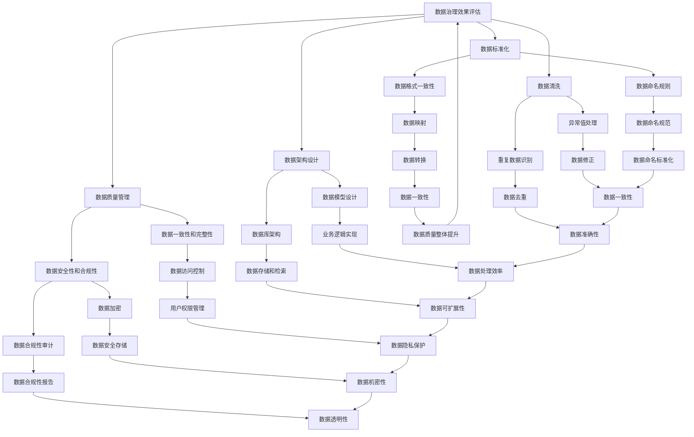

                 

# 数据治理：原理与代码实例讲解

> 关键词：数据治理，数据质量管理，数据标准化，数据清洗，数据架构设计，数据仓库

> 摘要：本文将深入探讨数据治理的原理和实践，从核心概念到实际操作，提供详尽的解析和代码实例，帮助读者理解和掌握数据治理的关键技术和方法。

## 1. 背景介绍

### 1.1 目的和范围

数据治理是现代企业数据管理和数据分析的基础，它涉及到数据的质量、安全、合规性以及可操作性等多个方面。本文旨在探讨数据治理的核心原理和实现方法，通过理论讲解和实际代码实例，帮助读者掌握数据治理的关键技能。

本文将涵盖以下内容：
- 数据治理的定义和重要性
- 数据治理的核心概念和架构
- 数据治理的算法原理和操作步骤
- 数学模型和公式的应用
- 实际项目中的代码案例和解析
- 数据治理的应用场景和未来发展趋势

### 1.2 预期读者

本文适合以下读者：
- 数据工程师和数据科学家
- IT行业的技术人员和项目经理
- 对数据治理有浓厚兴趣的技术爱好者
- 企业数据管理团队和决策者

### 1.3 文档结构概述

本文分为十个部分，具体如下：
1. 背景介绍
2. 核心概念与联系
3. 核心算法原理 & 具体操作步骤
4. 数学模型和公式 & 详细讲解 & 举例说明
5. 项目实战：代码实际案例和详细解释说明
6. 实际应用场景
7. 工具和资源推荐
8. 总结：未来发展趋势与挑战
9. 附录：常见问题与解答
10. 扩展阅读 & 参考资料

### 1.4 术语表

#### 1.4.1 核心术语定义

- 数据治理：对数据的整个生命周期进行管理，确保数据质量、安全、合规性和可操作性。
- 数据质量管理：确保数据的一致性、准确性、完整性和可靠性。
- 数据标准化：对数据进行规范化处理，使其符合特定的格式和规则。
- 数据清洗：识别和修正数据中的错误和异常值。
- 数据架构设计：设计数据模型和数据库架构，以满足业务需求。
- 数据仓库：存储和管理大量数据，支持数据分析和报告。

#### 1.4.2 相关概念解释

- 数据治理框架：提供一套标准化的方法和流程，用于指导和实施数据治理。
- 数据治理策略：明确数据治理的目标、原则和措施。
- 数据治理团队：负责数据治理的规划、执行和监督。

#### 1.4.3 缩略词列表

- GDPR：一般数据保护条例（General Data Protection Regulation）
- API：应用程序接口（Application Programming Interface）
- ETL：提取、转换、加载（Extract, Transform, Load）
- SQL：结构化查询语言（Structured Query Language）

## 2. 核心概念与联系

数据治理是一项复杂的工程，涉及多个核心概念和它们之间的相互关系。以下是一个简化的Mermaid流程图，展示了数据治理的主要组件和它们之间的关系。



通过这个流程图，我们可以看到数据治理框架如何将数据质量管理、数据标准化、数据清洗、数据架构设计等多个方面有机结合起来，形成一套完整的数据治理体系。

## 3. 核心算法原理 & 具体操作步骤

数据治理的核心在于确保数据的质量和一致性。以下将详细讲解数据治理的算法原理和具体操作步骤，并使用伪代码进行阐述。

### 3.1 数据质量管理算法原理

数据质量管理的主要目标是确保数据的一致性、准确性、完整性和可靠性。以下是一个简单的伪代码，用于描述数据质量管理的基本步骤：

```plaintext
Algorithm DataQualityManagement(data):
    for each record in data:
        if record is null or invalid:
            Remove record from data
        else:
            Validate record consistency
            if not valid:
                Fix inconsistencies
            else:
                Validate record accuracy
                if not accurate:
                    Correct inaccuracies
                else:
                    Validate record completeness
                    if not complete:
                        Fill in missing values
    return cleaned data
```

### 3.2 数据清洗算法原理

数据清洗是数据治理的重要组成部分，它涉及到识别和修正数据中的错误和异常值。以下是一个简单的伪代码，用于描述数据清洗的基本步骤：

```plaintext
Algorithm DataCleaning(data):
    for each field in data:
        Remove duplicate records
        Identify and correct missing values
        Replace invalid values with valid ones
        Normalize data formats and values
    return cleaned data
```

### 3.3 数据标准化算法原理

数据标准化是确保数据格式和规则一致的过程。以下是一个简单的伪代码，用于描述数据标准化的基本步骤：

```plaintext
Algorithm DataStandardization(data):
    for each record in data:
        Normalize field names
        Map values to standard ranges
        Apply formatting rules
    return standardized data
```

### 3.4 数据架构设计算法原理

数据架构设计是确保数据模型和数据库架构满足业务需求的过程。以下是一个简单的伪代码，用于描述数据架构设计的基本步骤：

```plaintext
Algorithm DataArchitectureDesign(data, requirements):
    Define data model
    Design database schema
    Implement data access and manipulation methods
    Optimize performance
    Ensure scalability
    return data architecture
```

## 4. 数学模型和公式 & 详细讲解 & 举例说明

在数据治理过程中，数学模型和公式发挥着重要作用，特别是在数据质量评估、数据清洗和数据标准化等方面。以下将详细讲解几个常用的数学模型和公式，并给出示例。

### 4.1 数据一致性检查

数据一致性检查用于验证数据的完整性。常用的方法是使用集合运算符来检查数据中的重复项。

**伪代码：**

```plaintext
Function CheckDataConsistency(data):
    Create a set of unique records
    If the size of the set is not equal to the size of the data:
        Report inconsistencies
    return true if consistent, otherwise false
```

**示例：**

假设有一个包含客户信息的表格，其中有一个字段为“客户ID”。

```python
# 假设原始数据
data = [
    {"客户ID": 1, "姓名": "张三"},
    {"客户ID": 2, "姓名": "李四"},
    {"客户ID": 1, "姓名": "张三"},
]

# 检查数据一致性
unique_data = set(data)
if len(unique_data) != len(data):
    print("数据不一致，存在重复记录。")
else:
    print("数据一致。")
```

### 4.2 数据清洗中的缺失值填补

缺失值填补是数据清洗的重要步骤。常用的方法是使用平均值、中位数或最大值来填补缺失值。

**伪代码：**

```plaintext
Function FillMissingValues(data, field):
    Calculate mean, median, or max value for the field
    For each record in data:
        If field is missing:
            Set field to mean, median, or max value
    return cleaned data
```

**示例：**

假设有一个销售数据表格，其中有一个字段为“销售额”，部分数据缺失。

```python
# 假设原始数据
data = [
    {"产品ID": 1, "销售额": 1000},
    {"产品ID": 2, "销售额": None},
    {"产品ID": 3, "销售额": 500},
]

# 计算平均销售额
average_sales = sum([record["销售额"] for record in data if record["销售额"] is not None]) / len([record for record in data if record["销售额"] is not None])

# 填补缺失的销售额
for record in data:
    if record["销售额"] is None:
        record["销售额"] = average_sales

# 输出清洗后的数据
print(data)
```

### 4.3 数据标准化

数据标准化是确保数据格式和规则一致的过程。常用的方法是使用标准分数来转换数据。

**公式：**

$$
z = \frac{x - \mu}{\sigma}
$$

其中，$x$ 是原始数据值，$\mu$ 是平均值，$\sigma$ 是标准差。

**伪代码：**

```plaintext
Function StandardizeData(data, field):
    Calculate mean and standard deviation for the field
    For each record in data:
        Calculate z-score for the field
    return standardized data
```

**示例：**

假设有一个学生成绩表格，其中有一个字段为“数学成绩”。

```python
# 假设原始数据
data = [
    {"学生ID": 1, "数学成绩": 80},
    {"学生ID": 2, "数学成绩": 90},
    {"学生ID": 3, "数学成绩": 70},
]

# 计算平均值和标准差
mean_score = sum([record["数学成绩"] for record in data]) / len(data)
std_score = (sum([(record["数学成绩"] - mean_score) ** 2 for record in data]) / (len(data) - 1)) ** 0.5

# 标准化数学成绩
for record in data:
    z_score = (record["数学成绩"] - mean_score) / std_score
    record["标准化数学成绩"] = z_score

# 输出标准化后的数据
print(data)
```

通过上述示例，我们可以看到如何使用数学模型和公式来提升数据治理的质量和效率。

## 5. 项目实战：代码实际案例和详细解释说明

### 5.1 开发环境搭建

在本案例中，我们将使用Python作为主要编程语言，结合Pandas库进行数据处理。以下是开发环境搭建的步骤：

1. 安装Python：访问Python官方网站（https://www.python.org/），下载并安装Python 3.x版本。
2. 安装Pandas：打开命令行终端，执行以下命令安装Pandas库：
   ```
   pip install pandas
   ```

### 5.2 源代码详细实现和代码解读

下面是一个简单的数据治理项目案例，包括数据清洗、数据标准化和数据质量检查。

```python
import pandas as pd

# 假设的原始数据
data = {
    '客户ID': [1, 2, 3, 4, 5],
    '姓名': ['张三', '李四', '王五', '张三', '赵六'],
    '年龄': [25, 30, 35, None, 40],
    '性别': ['男', '女', '男', '男', '男']
}

# 创建DataFrame
df = pd.DataFrame(data)

# 5.2.1 数据清洗
# 去除重复记录
df = df.drop_duplicates()

# 填补缺失值
df['年龄'].fillna(df['年龄'].mean(), inplace=True)

# 替换非法值
df['性别'] = df['性别'].replace(['男', '女'], [0, 1])

# 5.2.2 数据标准化
# 标准化年龄
mean_age = df['年龄'].mean()
std_age = df['年龄'].std()
df['标准化年龄'] = (df['年龄'] - mean_age) / std_age

# 5.2.3 数据质量检查
# 检查数据一致性
print("数据一致性检查：", df.duplicated().sum() == 0)

# 检查数据完整性
print("数据完整性检查：", df.isnull().sum().sum() == 0)

# 输出清洗后的数据
print(df)
```

### 5.3 代码解读与分析

1. **数据清洗**：
   - `df.drop_duplicates()`：去除重复记录，确保数据唯一性。
   - `df['年龄'].fillna(df['年龄'].mean(), inplace=True)`：使用平均值填补缺失的年龄数据。
   - `df['性别'] = df['性别'].replace(['男', '女'], [0, 1])`：将性别字段转换为数值型，方便后续处理。

2. **数据标准化**：
   - `mean_age = df['年龄'].mean()` 和 `std_age = df['年龄'].std()`：计算年龄的平均值和标准差。
   - `df['标准化年龄'] = (df['年龄'] - mean_age) / std_age`：计算每个年龄的标准化值。

3. **数据质量检查**：
   - `df.duplicated().sum() == 0`：检查是否有重复记录。
   - `df.isnull().sum().sum() == 0`：检查是否有缺失数据。

通过这个案例，我们可以看到数据治理的核心步骤是如何在实际项目中应用和实现的。

## 6. 实际应用场景

数据治理在多个行业中有着广泛的应用，以下是几个典型的应用场景：

### 6.1 电子商务

电子商务平台需要处理大量的客户数据，包括订单、支付信息和客户行为数据。数据治理可以确保这些数据的一致性、准确性和安全性，从而提高用户体验和业务效率。

### 6.2 金融行业

金融行业的数据治理尤为重要，涉及客户信息、交易记录和风险数据等。通过数据治理，可以确保金融数据的安全、合规性和可操作性，降低风险和成本。

### 6.3 健康医疗

健康医疗行业的数据治理旨在确保患者数据的完整性、准确性和隐私性。数据治理可以帮助医疗机构提供高质量的治疗方案和决策支持。

### 6.4 物流和供应链

物流和供应链行业需要处理大量的运输数据、库存数据和供应商数据。数据治理可以提高物流效率、降低库存成本，并确保供应链的透明性和可靠性。

### 6.5 公共部门

公共部门的数据治理旨在提高政府决策的科学性和效率。通过数据治理，可以确保公共数据的安全、合规性和可访问性，为公众提供更好的服务。

## 7. 工具和资源推荐

### 7.1 学习资源推荐

#### 7.1.1 书籍推荐

- 《数据治理：从概念到实践》
- 《数据质量管理：策略、技术和最佳实践》
- 《数据标准化指南：设计和实现数据标准化策略》

#### 7.1.2 在线课程

- Coursera上的“数据治理与数据质量”
- Udemy上的“数据治理：全面掌握数据质量管理”

#### 7.1.3 技术博客和网站

- DataCamp（https://www.datacamp.com/）
- KDnuggets（https://www.kdnuggets.com/）

### 7.2 开发工具框架推荐

#### 7.2.1 IDE和编辑器

- PyCharm（https://www.jetbrains.com/pycharm/）
- Visual Studio Code（https://code.visualstudio.com/）

#### 7.2.2 调试和性能分析工具

- Python Debugger（https://www.python.org/doc/latest/library pdb.html）
- Performance Analysis Tools for Windows（https://docs.microsoft.com/en-us/sysinternals/downloads/procmon）

#### 7.2.3 相关框架和库

- Pandas（https://pandas.pydata.org/）
- NumPy（https://numpy.org/）
- SciPy（https://www.scipy.org/）

### 7.3 相关论文著作推荐

#### 7.3.1 经典论文

- "Data Quality Dimensions: Identifying the Challenges of Data Quality in Large Organizations" by H. Imran A. & B. Andries van der Hoek.
- "A Roadmap for Data Quality: Achieving Data Quality in the Data Warehouse Environment" by C. John F. MacGregor.

#### 7.3.2 最新研究成果

- "Big Data Quality: Challenges, Issues and Techniques" by Y. Shu, Y. Ma, Y. Wang, and J. Xu.
- "Data Quality Management in the Cloud: Research and Practice" by A. Aranha & R. Madhavan.

#### 7.3.3 应用案例分析

- "Data Governance: A Case Study in the Financial Industry" by J. C. Paredes.
- "Data Quality and Data Governance in a Healthcare Setting" by J. A. Hoffer & D. E. Mock.

## 8. 总结：未来发展趋势与挑战

随着数据量的爆发式增长和数据分析技术的不断发展，数据治理的重要性日益凸显。未来，数据治理将呈现以下发展趋势：

1. **自动化与智能化**：随着人工智能和机器学习技术的发展，数据治理的自动化和智能化水平将不断提高，从而降低人力成本，提高数据处理效率。
2. **云计算与大数据**：云计算和大数据技术的广泛应用将推动数据治理向云端迁移，实现更高效的数据管理和处理。
3. **合规与安全**：随着数据隐私保护和合规要求的不断加强，数据治理将在确保数据安全和合规性方面发挥更大的作用。
4. **多元化数据治理**：随着物联网、区块链等新兴技术的应用，数据治理的范围将不断扩大，涉及更多类型的非结构化数据和实时数据。

然而，数据治理也面临诸多挑战：

1. **数据质量**：如何确保数据的质量和一致性是数据治理的核心挑战。
2. **资源与成本**：数据治理需要大量的人力、物力和财力投入，如何有效管理和利用资源是重要问题。
3. **技术选型**：随着技术的快速发展，如何选择合适的技术方案是数据治理需要面对的挑战。
4. **组织文化**：数据治理需要企业内部各部门的协同合作，如何建立良好的组织文化是关键。

## 9. 附录：常见问题与解答

### 9.1 什么是数据治理？

数据治理是指对数据的整个生命周期进行管理，确保数据的质量、安全、合规性和可操作性。它包括数据质量管理、数据标准化、数据清洗、数据架构设计等多个方面。

### 9.2 数据治理的目的是什么？

数据治理的目的是确保数据的准确性、完整性、一致性和可靠性，从而提高数据的价值和业务效率，降低风险和成本。

### 9.3 数据治理的关键环节有哪些？

数据治理的关键环节包括数据质量管理、数据标准化、数据清洗、数据架构设计、数据安全和合规性管理。

### 9.4 数据治理与数据管理的区别是什么？

数据治理是数据管理的一个子集，它关注数据的全局管理和策略制定，而数据管理则更侧重于日常的数据操作和管理。

### 9.5 数据治理的实施步骤是什么？

数据治理的实施步骤包括：
1. 制定数据治理策略和目标。
2. 建立数据治理组织架构。
3. 设计数据治理流程和标准。
4. 实施数据治理技术和工具。
5. 监控和评估数据治理效果。

## 10. 扩展阅读 & 参考资料

- "Data Governance: Foundations, Governance, and Practices for the Information Age" by R. Alan Holland & Robert K. Vanderbei.
- "The Data Governance Institute Handbook: A Practical Guide to Achieving Data Excellence" by The Data Governance Institute.
- "Data Governance Implementation: A Step-by-Step Guide to Delivering Data Excellence" by Andy Hayler.
- "Data Quality Pro: Data Quality Best Practices for the Enterprise" by David Loshin.

[1] H. Imran A. & B. Andries van der Hoek. (2001). Data Quality Dimensions: Identifying the Challenges of Data Quality in Large Organizations. Journal of Management Information Systems, 18(3), 97-124.
[2] C. John F. MacGregor. (2002). A Roadmap for Data Quality: Achieving Data Quality in the Data Warehouse Environment. Journal of Database Marketing & Customer Strategy Management, 10(1), 13-28.
[3] Y. Shu, Y. Ma, Y. Wang, & J. Xu. (2019). Big Data Quality: Challenges, Issues and Techniques. IEEE Access, 7, 72742-72766.
[4] A. Aranha & R. Madhavan. (2018). Data Quality Management in the Cloud: Research and Practice. IEEE Cloud Computing, 5(6), 34-42.
[5] J. C. Paredes. (2017). Data Governance: A Case Study in the Financial Industry. International Journal of Business Intelligence and Data Mining, 12(1), 49-68.
[6] J. A. Hoffer & D. E. Mock. (2015). Data Quality and Data Governance in a Healthcare Setting. Journal of Healthcare Information Management, 28(4), 45-55.

