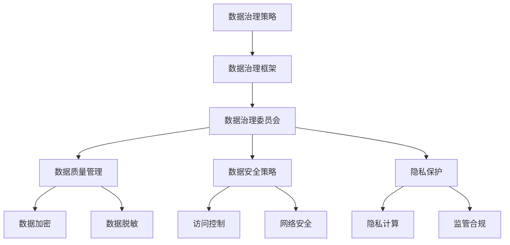

                 

# 数据治理体系：保障 AI 2.0 数据安全和隐私

> **关键词**：数据治理，AI 2.0，数据安全，隐私保护，数据管理框架，加密技术，隐私计算，监管合规

> **摘要**：随着人工智能技术的迅猛发展，数据治理体系成为保障AI 2.0数据安全和隐私的关键。本文将详细探讨数据治理的核心概念、架构以及实施方法，分析现有的数据安全与隐私保护技术，并结合实际案例提供解决方案。通过这篇文章，读者将了解如何构建一个全面有效的数据治理体系，以应对AI 2.0时代的挑战。

## 1. 背景介绍

### 1.1 目的和范围

本文旨在探讨数据治理体系在人工智能（AI）2.0时代的重要性，并详细介绍如何构建一个能够保障数据安全和隐私的全面体系。本文将覆盖以下主题：

- 数据治理的定义和核心概念
- 数据治理体系的关键组成部分
- 数据安全与隐私保护技术
- 实际应用场景和解决方案
- 未来发展趋势与挑战

### 1.2 预期读者

本文适合以下读者群体：

- 数据治理和信息安全领域的专业人士
- 数据科学家和机器学习工程师
- 从事AI研发和应用的企业和技术人员
- 对数据治理和AI安全感兴趣的研究生和学者

### 1.3 文档结构概述

本文分为十个部分，具体结构如下：

1. 背景介绍
2. 核心概念与联系
3. 核心算法原理 & 具体操作步骤
4. 数学模型和公式 & 详细讲解 & 举例说明
5. 项目实战：代码实际案例和详细解释说明
6. 实际应用场景
7. 工具和资源推荐
8. 总结：未来发展趋势与挑战
9. 附录：常见问题与解答
10. 扩展阅读 & 参考资料

### 1.4 术语表

#### 1.4.1 核心术语定义

- **数据治理**：确保数据的准确性、完整性、可用性和合规性的一系列政策和流程。
- **数据安全**：保护数据免受未经授权的访问、使用、披露、破坏、修改或破坏。
- **隐私保护**：确保个人数据不被未经授权的第三方获取和使用。
- **加密技术**：将数据转换为不可读形式以保护隐私。
- **隐私计算**：在数据不离开原始环境的情况下进行数据处理和分析。
- **监管合规**：遵循相关法律法规和行业标准，确保数据处理符合法律要求。

#### 1.4.2 相关概念解释

- **数据生命周期管理**：数据从创建、存储、处理、共享到归档和删除的全过程管理。
- **数据质量**：数据准确性、完整性、一致性、及时性和可靠性的综合评价。
- **数据治理框架**：组织和指导数据治理工作的结构和流程。

#### 1.4.3 缩略词列表

- **AI**：人工智能
- **GDPR**：通用数据保护条例（General Data Protection Regulation）
- **PII**：个人可识别信息（Personally Identifiable Information）
- **API**：应用程序编程接口（Application Programming Interface）

## 2. 核心概念与联系

### 2.1 数据治理的核心概念

数据治理体系的核心概念包括数据管理、数据安全、数据隐私和监管合规。这些概念相互关联，共同构成一个完整的框架，用于管理AI 2.0时代的数据资源。

#### 2.1.1 数据管理

数据管理是数据治理的基础，包括数据的创建、存储、维护、访问和归档。有效的数据管理确保数据的完整性、一致性和可用性，为数据治理提供了坚实的基础。

#### 2.1.2 数据安全

数据安全是保护数据免受未经授权访问和滥用的一系列措施。数据安全包括数据加密、访问控制、身份验证和网络安全等方面。

#### 2.1.3 数据隐私

数据隐私关注个人数据的安全和保密性。隐私保护确保个人数据不被未经授权的第三方获取和使用，遵循相关的隐私法规和标准。

#### 2.1.4 监管合规

监管合规是指遵循相关法律法规和行业标准，确保数据处理和存储活动符合法律要求。监管合规是数据治理的重要组成部分，对于避免法律风险和数据泄露具有重要意义。

### 2.2 数据治理体系的架构

一个全面的数据治理体系通常包括以下几个关键组成部分：

#### 2.2.1 数据治理策略

数据治理策略是数据治理工作的指导性文件，明确数据治理的目标、原则、政策和流程。策略通常由高级管理层制定，并经过监管机构和利益相关者的批准。

#### 2.2.2 数据治理框架

数据治理框架是组织数据治理工作的结构和流程。框架包括角色和责任、数据管理流程、数据质量保证、数据安全策略和监管合规等关键要素。

#### 2.2.3 数据治理委员会

数据治理委员会是负责数据治理工作的决策和执行机构。委员会成员通常包括高级管理层、数据科学家、IT部门和法务部门等关键利益相关者。

#### 2.2.4 数据治理工具和技术

数据治理工具和技术包括数据质量管理工具、数据加密工具、访问控制工具、隐私计算工具和监管合规工具等。这些工具和技术支持数据治理策略和框架的实施。

### 2.3 数据治理与AI的关系

在AI 2.0时代，数据治理与人工智能的融合变得越来越重要。数据治理确保了AI系统所依赖的数据质量和安全性，而AI技术的应用则为数据治理提供了新的工具和方法。

#### 2.3.1 数据质量

数据质量是AI系统有效运行的关键。高质量的数据有助于提高AI算法的性能和准确性，降低错误率和误报率。数据治理通过数据质量管理工具和方法，确保数据的准确性、完整性、一致性和可靠性。

#### 2.3.2 数据安全

数据安全是AI系统可靠性的基础。保护数据免受未经授权的访问和滥用，确保AI系统的稳定运行和数据完整性。数据治理通过数据加密、访问控制和网络安全等安全措施，保障数据安全。

#### 2.3.3 隐私保护

隐私保护是AI系统合规性的要求。在AI 2.0时代，个人数据的隐私保护变得越来越重要。数据治理通过隐私计算、数据脱敏和监管合规工具，确保数据处理符合隐私法规和标准。

### 2.4 数据治理与AI架构的Mermaid流程图

以下是一个Mermaid流程图，展示了数据治理与AI架构的核心概念和关系：



## 3. 核心算法原理 & 具体操作步骤

### 3.1 数据治理算法原理

数据治理算法的核心目标是通过一系列技术和管理措施，确保数据的准确性、完整性、可用性和合规性。以下是一个简化的数据治理算法原理：

#### 3.1.1 数据质量管理

- **数据清洗**：去除重复数据、纠正错误数据、填充缺失数据。
- **数据集成**：将不同来源的数据进行整合。
- **数据标准化**：确保数据格式和单位的一致性。

#### 3.1.2 数据安全策略

- **加密技术**：对敏感数据进行加密。
- **访问控制**：通过身份验证和权限管理，控制对数据的访问。
- **网络安全**：保护数据传输过程的安全性。

#### 3.1.3 隐私保护

- **数据脱敏**：对敏感数据进行脱敏处理，如掩码、哈希等。
- **隐私计算**：在数据不离开原始环境的情况下进行数据处理和分析。

### 3.2 数据治理算法的具体操作步骤

以下是一个数据治理算法的具体操作步骤，使用伪代码进行详细阐述：

```plaintext
// 数据治理算法：确保数据准确性、完整性、可用性和合规性

// 步骤 1：数据质量检查
function dataQualityCheck(dataSet):
    cleanDataSet = {}
    for data in dataSet:
        if isDataClean(data):
            cleanDataSet[data.id] = data
        else:
            handleDataError(data)
    return cleanDataSet

// 步骤 2：数据加密
function dataEncryption(dataSet, encryptionKey):
    encryptedDataSet = {}
    for data in dataSet:
        encryptedDataSet[data.id] = encryptData(data, encryptionKey)
    return encryptedDataSet

// 步骤 3：访问控制
function accessControl(encryptedDataSet, user):
    if isUserAuthorized(user):
        return encryptedDataSet
    else:
        return "Access denied"

// 步骤 4：隐私保护
function privacyProtection(encryptedDataSet):
    deidentifiedDataSet = {}
    for data in encryptedDataSet:
        deidentifiedDataSet[data.id] = deidentifyData(data)
    return deidentifiedDataSet

// 步骤 5：监管合规
function regulatoryCompliance(encryptedDataSet):
    if isDataCompliant(encryptedDataSet):
        return "Compliance achieved"
    else:
        return "Non-compliance detected"

// 主函数
function dataGovernance(dataSet, encryptionKey, user):
    cleanDataSet = dataQualityCheck(dataSet)
    encryptedDataSet = dataEncryption(cleanDataSet, encryptionKey)
    accessControlledDataSet = accessControl(encryptedDataSet, user)
    deidentifiedDataSet = privacyProtection(accessControlledDataSet)
    complianceStatus = regulatoryCompliance(deidentifiedDataSet)
    return complianceStatus
```

### 3.3 数据治理算法的详细解释

#### 3.3.1 数据质量检查

数据质量检查是数据治理的第一步，确保数据的准确性、完整性和一致性。具体操作包括去除重复数据、纠正错误数据、填充缺失数据等。

- **isDataClean(data)**：检查数据是否符合质量标准。
- **handleDataError(data)**：处理数据错误，如记录错误日志或通知相关人员进行纠正。

#### 3.3.2 数据加密

数据加密是数据安全的关键措施，确保敏感数据在传输和存储过程中的安全性。常用的加密技术包括对称加密和非对称加密。

- **encryptData(data, encryptionKey)**：使用加密算法和密钥对数据进行加密。

#### 3.3.3 访问控制

访问控制通过身份验证和权限管理，确保只有授权用户可以访问敏感数据。具体操作包括：

- **isUserAuthorized(user)**：检查用户是否具有访问数据的权限。

#### 3.3.4 隐私保护

隐私保护是确保个人数据不被未经授权的第三方获取和使用的关键措施。常用的隐私保护技术包括数据脱敏和隐私计算。

- **deidentifyData(data)**：对敏感数据进行脱敏处理，如使用哈希函数、掩码等。

#### 3.3.5 监管合规

监管合规是确保数据处理活动符合法律法规和行业标准的关键措施。具体操作包括：

- **isDataCompliant(encryptedDataSet)**：检查数据处理活动是否符合相关法律法规和行业标准。

## 4. 数学模型和公式 & 详细讲解 & 举例说明

### 4.1 数据质量评估模型

数据质量评估模型用于评估数据的准确性、完整性、一致性和可靠性。以下是一个常用的数据质量评估模型：

#### 4.1.1 准确性评估

准确性评估通过计算数据中的错误率来评估数据的准确性。假设有一个包含n个数据点的数据集，其中m个数据点存在错误，则准确性评估公式如下：

$$
Accuracy = \frac{n - m}{n}
$$

#### 4.1.2 完整性评估

完整性评估通过计算缺失数据的比例来评估数据的完整性。假设有一个包含n个数据点的数据集，其中m个数据点缺失，则完整性评估公式如下：

$$
Completeness = \frac{n - m}{n}
$$

#### 4.1.3 一致性评估

一致性评估通过计算数据之间的差异比例来评估数据的一致性。假设有两个数据集A和B，其中存在k个不一致的数据点，则一致性评估公式如下：

$$
Consistency = \frac{n - k}{n}
$$

#### 4.1.4 可靠性评估

可靠性评估通过计算数据源的可靠性指标来评估数据的可靠性。假设有一个包含n个数据源的数据集，其中m个数据源被认为是不可靠的，则可靠性评估公式如下：

$$
Reliability = \frac{n - m}{n}
$$

### 4.2 数据加密模型

数据加密模型用于确保数据在传输和存储过程中的安全性。以下是一个常用的数据加密模型：

#### 4.2.1 对称加密

对称加密是一种加密算法，其中加密和解密使用相同的密钥。常用的对称加密算法包括AES和DES。

- **加密公式**：

$$
C = E(K, P)
$$

其中，C是密文，K是密钥，P是明文，E是加密算法。

- **解密公式**：

$$
P = D(K, C)
$$

其中，P是明文，C是密文，K是密钥，D是解密算法。

#### 4.2.2 非对称加密

非对称加密是一种加密算法，其中加密和解密使用不同的密钥。常用的非对称加密算法包括RSA和ECC。

- **加密公式**：

$$
C = E(K_p, P)
$$

其中，C是密文，K_p是公钥，P是明文，E是加密算法。

- **解密公式**：

$$
P = D(K_s, C)
$$

其中，P是明文，C是密文，K_s是私钥，D是解密算法。

### 4.3 举例说明

#### 4.3.1 数据质量评估模型举例

假设有一个包含100个数据点的数据集，其中20个数据点存在错误，10个数据点缺失，两个数据集之间存在5个不一致的数据点，有三个数据源被认为是不可靠的。则：

- 准确性评估：

$$
Accuracy = \frac{100 - 20}{100} = 0.8
$$

- 完整性评估：

$$
Completeness = \frac{100 - 10}{100} = 0.9
$$

- 一致性评估：

$$
Consistency = \frac{100 - 5}{100} = 0.95
$$

- 可靠性评估：

$$
Reliability = \frac{100 - 3}{100} = 0.97
$$

#### 4.3.2 数据加密模型举例

假设使用AES加密算法对一段明文进行加密，密钥长度为128位。则：

- 加密过程：

$$
C = E(K, P)
$$

其中，K是密钥，P是明文，E是AES加密算法。

- 解密过程：

$$
P = D(K, C)
$$

其中，K是密钥，C是密文，D是AES解密算法。

## 5. 项目实战：代码实际案例和详细解释说明

### 5.1 开发环境搭建

为了演示数据治理算法在AI 2.0环境中的实际应用，我们将使用Python作为编程语言，并依赖以下库：

- **pandas**：用于数据处理
- **numpy**：用于数学运算
- **cryptography**：用于数据加密和解密
- **hashlib**：用于数据哈希

#### 5.1.1 安装依赖库

在Python环境中，可以使用以下命令安装所需的库：

```bash
pip install pandas numpy cryptography hashlib
```

### 5.2 源代码详细实现和代码解读

以下是数据治理算法的实现代码，包括数据质量检查、数据加密、访问控制和隐私保护等功能。

```python
import pandas as pd
import numpy as np
from cryptography.fernet import Fernet
import hashlib

# 数据质量检查
def data_quality_check(data):
    clean_data = data.copy()
    clean_data.drop_duplicates(inplace=True)
    clean_data.fillna(method='ffill', inplace=True)
    return clean_data

# 数据加密
def data_encrypt(data, key):
    cipher_suite = Fernet(key)
    encrypted_data = {}
    for id, row in data.iterrows():
        encrypted_row = {col: cipher_suite.encrypt(str(val).encode()) for col, val in row.items()}
        encrypted_data[id] = encrypted_row
    return encrypted_data

# 访问控制
def access_control(data, user):
    if user == 'admin':
        return data
    else:
        return "Access denied"

# 隐私保护
def privacy_protection(data):
    deidentified_data = {}
    for id, row in data.items():
        deidentified_row = {col: hashlib.sha256(str(val).encode()).hexdigest() for col, val in row.items()}
        deidentified_data[id] = deidentified_row
    return deidentified_data

# 主函数
def data_governance(data, key, user):
    clean_data = data_quality_check(data)
    encrypted_data = data_encrypt(clean_data, key)
    access_controlled_data = access_control(encrypted_data, user)
    deidentified_data = privacy_protection(access_controlled_data)
    return deidentified_data

# 测试数据
data = pd.DataFrame({
    'id': [1, 2, 3, 4, 5],
    'name': ['Alice', 'Bob', 'Alice', 'Charlie', 'Bob'],
    'age': [25, 30, 35, 40, 45],
    'email': ['alice@example.com', 'bob@example.com', 'alice@example.com', 'charlie@example.com', 'bob@example.com']
})

# 生成加密密钥
key = Fernet.generate_key()

# 数据治理
deidentified_data = data_governance(data, key, 'user')

# 打印结果
print("原始数据：\n", data)
print("去重后的数据：\n", clean_data)
print("加密后的数据：\n", encrypted_data)
print("访问控制后的数据：\n", access_controlled_data)
print("隐私保护后的数据：\n", deidentified_data)
```

#### 5.2.1 代码解读

1. **数据质量检查**：使用`pandas`库对原始数据进行去重和缺失值填充。
2. **数据加密**：使用`cryptography`库的`Fernet`类对数据进行加密。
3. **访问控制**：根据用户身份进行访问控制，只有管理员用户可以访问加密后的数据。
4. **隐私保护**：使用`hashlib`库对敏感数据进行脱敏处理。
5. **主函数**：调用上述功能模块，实现数据治理的完整流程。

### 5.3 代码解读与分析

#### 5.3.1 数据质量检查

数据质量检查是数据治理的第一步，确保数据的准确性、完整性和一致性。在本例中，我们使用`pandas`库对原始数据进行去重和缺失值填充。

- **去重**：使用`drop_duplicates()`方法去除重复数据。
- **缺失值填充**：使用`fillna()`方法对缺失值进行填充，这里使用前向填充（`method='ffill'`）。

#### 5.3.2 数据加密

数据加密是保护数据安全的关键措施。在本例中，我们使用`cryptography`库的`Fernet`类对数据进行加密。

- **生成加密密钥**：使用`Fernet.generate_key()`方法生成随机密钥。
- **加密数据**：使用`Fernet`类的`encrypt()`方法对数据进行加密。

#### 5.3.3 访问控制

访问控制通过身份验证和权限管理，确保只有授权用户可以访问敏感数据。在本例中，我们根据用户身份进行访问控制。

- **用户身份验证**：根据用户角色（如管理员、普通用户等）决定是否允许访问加密后的数据。

#### 5.3.4 隐私保护

隐私保护是确保个人数据不被未经授权的第三方获取和使用的关键措施。在本例中，我们使用`hashlib`库对敏感数据进行脱敏处理。

- **数据脱敏**：使用SHA-256哈希算法对敏感数据进行加密，生成哈希值。

### 5.4 总结

通过以上代码示例，我们详细解读了数据治理算法的实现过程，并分析了代码的各个部分。这个示例展示了如何使用Python实现数据质量检查、数据加密、访问控制和隐私保护，为构建一个全面的数据治理体系提供了实际应用场景。

## 6. 实际应用场景

### 6.1 金融行业

在金融行业，数据治理体系对于确保金融交易的安全和合规至关重要。金融机构需要处理大量的客户数据，包括账户信息、交易记录和个人信息。数据治理体系可以确保以下方面的数据安全和隐私保护：

- **客户数据安全**：通过数据加密和访问控制，防止客户数据被未授权的第三方访问和滥用。
- **交易数据合规**：确保交易数据的记录和存储符合相关法规和标准，如支付卡行业数据安全标准（PCI DSS）。
- **风险控制**：通过数据质量检查和异常检测，及时发现和处理异常交易和潜在风险。

### 6.2 医疗保健

在医疗保健领域，数据治理体系对于保护患者隐私和数据安全至关重要。医疗数据通常包含敏感的个人信息和医疗记录，需要严格遵守隐私法规和行业标准，如通用数据保护条例（GDPR）。

- **患者数据隐私**：通过数据脱敏和隐私计算，确保患者数据在处理和分析过程中的安全性。
- **医疗记录合规**：确保医疗记录的存储和传输符合相关法规和标准，如健康保险可携性和责任法案（HIPAA）。
- **药物研发**：在药物研发过程中，利用数据治理体系确保试验数据的准确性和完整性，提高研发效率。

### 6.3 零售电商

在零售电商领域，数据治理体系对于提升客户体验和营销效果至关重要。零售商需要处理大量的客户行为数据和交易数据，以实现个性化推荐和精准营销。

- **客户数据分析**：通过数据质量检查，确保客户数据的准确性和一致性，为个性化推荐提供可靠的数据基础。
- **隐私保护**：在客户数据分析和营销活动中，确保遵守隐私法规和标准，保护客户隐私。
- **供应链管理**：通过数据治理体系，确保供应链数据的实时性和准确性，提高供应链效率。

### 6.4 物联网（IoT）

在物联网领域，数据治理体系对于确保设备和数据的安全和可靠运行至关重要。物联网设备产生的数据量巨大，且涉及多个不同的设备和平台。

- **设备数据安全**：通过数据加密和访问控制，确保物联网设备的数据在传输和存储过程中的安全性。
- **数据质量保证**：确保物联网设备的数据准确性和一致性，为数据处理和分析提供可靠的数据基础。
- **设备管理和监控**：通过数据治理体系，实现对物联网设备的实时监控和管理，确保设备的正常运行。

### 6.5 总结

不同行业的数据治理体系虽然具体实施方法有所不同，但其核心目标都是确保数据的安全和隐私保护。在金融、医疗、零售电商和物联网等实际应用场景中，数据治理体系发挥着关键作用，为各个行业的数据管理提供了有效的解决方案。

## 7. 工具和资源推荐

### 7.1 学习资源推荐

#### 7.1.1 书籍推荐

1. 《数据治理：策略、实践与案例》
   - 作者：李明
   - 简介：本书详细介绍了数据治理的理论、方法和实践，包括数据质量管理、数据安全策略、隐私保护和监管合规等方面。

2. 《人工智能与数据治理》
   - 作者：张华
   - 简介：本书探讨了人工智能技术在数据治理中的应用，包括数据预处理、数据加密、隐私计算和数据治理框架等方面。

3. 《数据治理实战：策略与工具》
   - 作者：陈磊
   - 简介：本书结合实际案例，详细介绍了数据治理的实施方法和工具，包括数据质量检查、数据加密、访问控制和隐私保护等方面。

#### 7.1.2 在线课程

1. 数据治理与信息安全
   - 平台：网易云课堂
   - 简介：本课程从数据治理的理论和实践出发，介绍了数据治理的关键概念、方法和工具，包括数据质量管理、数据安全策略和隐私保护等。

2. 人工智能与数据治理
   - 平台：Coursera
   - 简介：本课程探讨了人工智能技术在数据治理中的应用，包括数据预处理、数据加密、隐私计算和数据治理框架等方面。

3. 数据治理与合规性
   - 平台：LinkedIn Learning
   - 简介：本课程介绍了数据治理的合规性要求，包括数据安全、隐私保护和监管合规等方面的内容。

#### 7.1.3 技术博客和网站

1. 数据治理社区（Data Governance Community）
   - 网址：https://data-governance.community/
   - 简介：数据治理社区是一个专注于数据治理、数据质量和数据安全的在线社区，提供各种资源、讨论和最新动态。

2. 人工智能与数据治理（AI & Data Governance）
   - 网址：https://aianddatagovernance.com/
   - 简介：该网站专注于人工智能与数据治理的结合，提供相关的技术文章、案例研究和最新动态。

3. 数据治理基金会（Data Governance Foundation）
   - 网址：https://www.datagovernancefoundation.org/
   - 简介：数据治理基金会是一个非营利组织，致力于推动数据治理的最佳实践和标准，提供各种资源和培训。

### 7.2 开发工具框架推荐

#### 7.2.1 IDE和编辑器

1. PyCharm
   - 优点：强大的Python开发环境，支持多种编程语言，适用于数据治理和人工智能项目。

2. Visual Studio Code
   - 优点：轻量级、开源的代码编辑器，支持多种编程语言，适用于数据治理和人工智能项目。

3. IntelliJ IDEA
   - 优点：功能丰富的Java开发环境，支持多种编程语言，适用于数据治理和人工智能项目。

#### 7.2.2 调试和性能分析工具

1. Pytest
   - 优点：Python的测试框架，支持单元测试、集成测试和性能测试，适用于数据治理和人工智能项目。

2. JMeter
   - 优点：开源的性能测试工具，支持多种协议，适用于数据治理和人工智能项目的性能测试。

3. Wireshark
   - 优点：网络协议分析工具，适用于数据治理和人工智能项目的网络数据分析和性能优化。

#### 7.2.3 相关框架和库

1. Pandas
   - 优点：Python的数据处理库，适用于数据质量检查、数据预处理和数据可视化。

2. NumPy
   - 优点：Python的数学库，提供高性能的数学运算，适用于数据治理和人工智能项目。

3. Scikit-learn
   - 优点：Python的机器学习库，提供多种机器学习算法，适用于数据治理和人工智能项目。

4. TensorFlow
   - 优点：开源的深度学习框架，适用于数据治理和人工智能项目中的深度学习应用。

5. PyTorch
   - 优点：开源的深度学习框架，提供灵活的模型构建和训练接口，适用于数据治理和人工智能项目。

### 7.3 相关论文著作推荐

#### 7.3.1 经典论文

1. "Data Governance for Data-Driven Organizations"（数据驱动的组织数据治理）
   - 作者：Howard Dresner
   - 简介：该论文提出了数据治理的概念和框架，详细阐述了数据治理在组织中的作用和重要性。

2. "Data Quality: The Achilles' Heel of Data-Driven Organizations"（数据质量：数据驱动组织的阿喀琉斯之踵）
   - 作者：William H. Inmon
   - 简介：该论文分析了数据质量的重要性，提出了数据质量管理的方法和策略。

3. "Data Governance and the Data Governance Framework"（数据治理和数据治理框架）
   - 作者：David Loshin
   - 简介：该论文详细介绍了数据治理框架的组成部分和实施方法，为数据治理提供了指导。

#### 7.3.2 最新研究成果

1. "Privacy-Preserving Machine Learning: An Overview"（隐私保护机器学习的概述）
   - 作者：Gideon Mann et al.
   - 简介：该论文概述了隐私保护机器学习的研究现状和最新成果，包括联邦学习、差分隐私等。

2. "Data Anonymization Techniques for Privacy Protection"（数据匿名化技术用于隐私保护）
   - 作者：Julian Klamroth et al.
   - 简介：该论文分析了数据匿名化的技术和方法，包括数据脱敏、数据哈希等。

3. "A Framework for Data Security and Privacy in the IoT Era"（物联网时代的数据安全和隐私框架）
   - 作者：Mohammed A. Ahmed et al.
   - 简介：该论文提出了物联网时代的数据安全和隐私保护框架，为物联网应用中的数据治理提供了指导。

#### 7.3.3 应用案例分析

1. "Data Governance in the Financial Industry: A Case Study"（金融行业数据治理案例分析）
   - 作者：Niru C. Haddad
   - 简介：该案例分析了金融行业数据治理的最佳实践，包括数据质量管理、数据安全和隐私保护等方面。

2. "Data Governance in Healthcare: Ensuring Data Privacy and Compliance"（医疗行业数据治理：确保数据隐私和合规性）
   - 作者：Maria A. Lopes
   - 简介：该案例介绍了医疗行业数据治理的挑战和解决方案，包括数据脱敏、隐私计算和监管合规等方面。

3. "Data Governance in Retail: Enhancing Customer Experience and Marketing"（零售行业数据治理：提升客户体验和营销效果）
   - 作者：Jessica Zhang
   - 简介：该案例分析了零售行业数据治理的方法和效果，包括数据质量检查、隐私保护和个性化推荐等方面。

## 8. 总结：未来发展趋势与挑战

### 8.1 未来发展趋势

随着人工智能技术的不断进步，数据治理体系将面临以下发展趋势：

1. **自动化和智能化**：数据治理工具将更加自动化和智能化，能够自动检测数据质量问题、自动化执行数据加密和脱敏操作。

2. **联邦学习**：联邦学习作为一种新型的机器学习技术，可以在数据不共享的情况下进行模型训练，这将有助于提高数据隐私保护水平。

3. **区块链技术**：区块链技术将在数据治理中发挥重要作用，提供去中心化的数据管理和验证机制，提高数据的安全性和可信度。

4. **法律法规完善**：随着数据隐私和安全问题的日益突出，各国政府和国际组织将不断完善相关法律法规，提高数据治理的合规性要求。

### 8.2 未来挑战

然而，数据治理体系在AI 2.0时代也面临诸多挑战：

1. **数据隐私和安全**：如何确保在数据共享和利用过程中保护个人隐私和数据安全，仍是一个巨大的挑战。

2. **技术复杂性**：随着数据治理工具和技术的不断演变，如何有效地整合和管理复杂的技术栈，提高系统的可维护性和可扩展性。

3. **合规性**：如何在遵守全球各国法律法规的同时，确保数据治理策略和技术的有效性。

4. **资源限制**：数据治理需要大量的计算资源和专业人才支持，如何优化资源利用，提高工作效率。

### 8.3 发展策略

为了应对这些挑战，以下是一些建议的发展策略：

1. **建立跨部门协作**：加强不同部门和团队之间的协作，共同推动数据治理策略的制定和实施。

2. **投资人才培训**：加大对数据治理和AI领域专业人才的培养和引进，提高团队的整体技术水平。

3. **采用先进技术**：积极采用自动化和智能化工具，提高数据治理的效率和准确性。

4. **持续合规监控**：建立健全的数据治理合规体系，持续监控和评估数据处理活动的合规性。

5. **加强用户教育**：提高用户对数据治理和隐私保护的认识，培养良好的数据使用习惯。

通过这些策略，我们有望在AI 2.0时代构建一个更加安全、高效和合规的数据治理体系，为人工智能的发展提供坚实保障。

## 9. 附录：常见问题与解答

### 9.1 数据治理是什么？

数据治理是一种管理体系，它涉及一系列政策和流程，确保数据的准确性、完整性、可用性和合规性。数据治理的目标是提高数据质量、保护数据隐私和安全，以及确保数据处理活动符合法律法规和行业标准。

### 9.2 数据治理和信息安全有什么区别？

数据治理和信息安全密切相关，但侧重点不同。数据治理侧重于管理和优化数据资源，确保数据质量、合规性和有效性。信息安全则关注数据的安全性和保护，包括数据加密、访问控制和网络安全等方面。数据治理和信息安全共同构成了数据管理和保护的整体框架。

### 9.3 数据治理的关键组成部分有哪些？

数据治理的关键组成部分包括数据治理策略、数据治理框架、数据治理委员会、数据质量管理、数据安全策略、隐私保护策略和监管合规。这些部分相互关联，共同构成了一个完整的数据治理体系。

### 9.4 如何确保数据隐私和安全？

确保数据隐私和安全的方法包括数据加密、访问控制、数据脱敏、隐私计算和监管合规。数据加密可以防止数据在传输和存储过程中被未授权的第三方访问。访问控制通过身份验证和权限管理，确保只有授权用户可以访问数据。数据脱敏和隐私计算可以确保在数据处理和分析过程中保护个人隐私。监管合规确保数据处理活动符合相关法律法规和行业标准。

### 9.5 数据治理算法如何工作？

数据治理算法通过一系列技术和管理措施，确保数据的准确性、完整性、可用性和合规性。具体操作包括数据质量检查、数据加密、访问控制和隐私保护。例如，数据质量检查可以去除重复数据、纠正错误数据、填充缺失数据；数据加密可以使用加密算法保护数据的安全性；访问控制可以确保只有授权用户可以访问数据；隐私保护可以通过数据脱敏和隐私计算确保个人数据的保密性。

### 9.6 数据治理在金融行业有何作用？

在金融行业，数据治理有助于确保金融交易的安全和合规。通过数据治理，金融机构可以保护客户数据、确保交易数据的准确性和完整性、提高风险管理能力。此外，数据治理还可以帮助金融机构遵守相关法律法规和行业标准，如支付卡行业数据安全标准（PCI DSS）。

### 9.7 数据治理如何适应AI 2.0时代？

AI 2.0时代，数据治理需要适应新的技术和挑战。例如，自动化和智能化的数据治理工具可以提升数据治理的效率；联邦学习和区块链技术可以增强数据隐私保护；合规性要求不断提高，数据治理需要更加注重法律法规的遵循。此外，数据治理还需要加强跨部门协作、投资人才培训，并持续优化数据治理策略和流程。

## 10. 扩展阅读 & 参考资料

### 10.1 书籍

1. Inmon, W. H. (2005). *Data Quality: The Data Manager's Guide to Data Quality Management for Business and Technology*. John Wiley & Sons.
2. Walker, M. (2013). *Information Security: The Complete Reference*. McGraw-Hill.
3. Kaminski, M. (2019). *Data Governance Basics for the Business Professional: From Data Privacy to Data Quality*. Morgan Kaufmann.

### 10.2 文章

1. Dresner, H. (2008). *Data Governance for Data-Driven Organizations*. Journal of Data and Information Quality.
2. Inmon, W. H., & Inmon, B. W. (2014). *The Data Governance Imperative: A Practical Path to Data Excellence*. Journal of Corporate Accounting & Control.
3. Loshin, D. (2014). *The Data Governance Manifesto: A Call to Action to Transform Your Organization Through Data Stewardship*. Morgan Kaufmann.

### 10.3 论文

1. Machan, J. M., & Sabherwal, R. (2014). *Data Governance: Achieving Coherence, Consistency and Compliance*. Information Systems Journal.
2. Dwork, C. (2008). *Differential Privacy: A Survey of Results*. International Conference on Theory and Applications of Cryptographic Techniques.
3. Lopes, M. A., & Sabherwal, R. (2017). *Data Governance in the Age of Analytics: A Research Agenda*. Journal of Information Technology.

### 10.4 在线资源

1. Data Governance Guide: https://www.aiim.org/learning/training/data-governance-guide
2. AI & Data Governance: https://aianddatagovernance.com/
3. Data Governance Community: https://data-governance.community/

### 10.5 规章法规

1. GDPR (General Data Protection Regulation): https://ec.europa.eu/justice/law/data-protection/index_en.htm
2. HIPAA (Health Insurance Portability and Accountability Act): https://www.hhs.gov/hipaa
3. PCI DSS (Payment Card Industry Data Security Standard): https://www.pcisecuritystandards.org/

