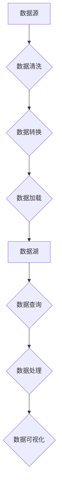

                 

# 数据湖泊架构：软件2.0的数据管理范式

## 关键词
- 数据湖泊架构
- 软件2.0
- 数据管理
- 大数据处理
- 分布式系统
- 算法优化

## 摘要
本文将探讨数据湖泊架构，作为一种新兴的数据管理范式，如何在软件2.0时代引领大数据处理的变革。首先，我们将回顾传统数据管理方法的局限性，然后详细解析数据湖泊架构的核心概念和架构设计，探讨其与传统数据仓库的区别。接着，我们将分析数据湖泊架构的算法原理和操作步骤，展示数学模型和公式的应用，并通过实际项目案例和代码解析，深入探讨数据湖泊在实际应用中的效果。最后，本文将总结数据湖泊架构的未来发展趋势和面临的挑战，并提供相关的学习资源和工具推荐。

## 1. 背景介绍

### 1.1 目的和范围
本文旨在深入探讨数据湖泊架构这一新兴数据管理范式，解析其在软件2.0时代对大数据处理的重要性。我们将从理论到实践，全面分析数据湖泊架构的设计原理、算法实现和应用场景，旨在为读者提供一个系统而全面的理解。

### 1.2 预期读者
本文适用于对大数据处理和数据管理有一定了解的读者，包括软件开发工程师、数据科学家、架构师以及对大数据技术和应用有兴趣的科技工作者。

### 1.3 文档结构概述
本文结构如下：
- 背景介绍
- 核心概念与联系
- 核心算法原理 & 具体操作步骤
- 数学模型和公式 & 详细讲解 & 举例说明
- 项目实战：代码实际案例和详细解释说明
- 实际应用场景
- 工具和资源推荐
- 总结：未来发展趋势与挑战
- 附录：常见问题与解答
- 扩展阅读 & 参考资料

### 1.4 术语表

#### 1.4.1 核心术语定义
- **数据湖泊架构（Data Lake Architecture）**：一种新兴的数据管理范式，旨在解决传统数据仓库在处理大数据时面临的挑战。
- **数据仓库（Data Warehouse）**：一种用于存储、管理和分析企业数据的系统。
- **分布式系统（Distributed System）**：一种通过计算机网络连接的计算机节点集合，协同工作以完成单一任务。
- **大数据处理（Big Data Processing）**：对大规模数据集进行存储、检索、管理和分析的技术。

#### 1.4.2 相关概念解释
- **数据湖（Data Lake）**：一种大型的存储系统，用于存储原始的、未加工的数据，通常用于大数据处理。
- **数据治理（Data Governance）**：确保数据质量、安全和合规性的策略和过程。

#### 1.4.3 缩略词列表
- **ETL（Extract, Transform, Load）**：提取、转换、加载，用于数据仓库的数据导入过程。
- **Hadoop**：一种开源框架，用于大规模数据集的分布式处理。
- **Spark**：一种高速大数据处理引擎。

## 2. 核心概念与联系

### 2.1 数据湖泊架构概述
数据湖泊架构是一种基于分布式系统的数据管理方案，旨在处理和分析大规模数据集。其核心思想是将数据湖视为一个存储所有原始数据的中心，这些数据可以是结构化、半结构化或非结构化的。数据湖通常与分布式文件系统（如Hadoop Distributed File System, HDFS）结合使用，以实现高可用性和可扩展性。

### 2.2 数据湖泊架构的核心概念
数据湖泊架构包含以下几个核心概念：

1. **数据湖（Data Lake）**：数据湖是一个存储所有原始数据的容器，无需预先定义数据模式。这使得数据湖能够灵活地处理各种类型的数据，从文本到图像、音频和视频等。

2. **数据治理（Data Governance）**：数据治理是确保数据质量、安全和合规性的关键。它涉及定义数据策略、角色、标准和流程，以确保数据的正确性、完整性和一致性。

3. **数据处理（Data Processing）**：数据处理是指对数据湖中的数据进行清洗、转换和聚合的过程。这通常涉及使用分布式计算框架（如Spark或Hadoop）进行大数据处理。

4. **数据湖平台（Data Lake Platform）**：数据湖平台是一组工具和服务的集合，用于构建、管理和维护数据湖。这些平台通常提供数据集成、数据质量、数据安全和数据治理等功能。

### 2.3 数据湖泊架构与传统数据仓库的比较
数据湖泊架构与传统的数据仓库在数据管理策略和架构设计上有显著差异：

1. **数据结构**：数据仓库通常要求结构化数据，而数据湖可以存储结构化、半结构化和非结构化数据。这使得数据湖能够更灵活地适应不同类型的数据源。

2. **数据模式**：数据仓库通常在数据加载前定义数据模式，而数据湖允许在数据加载后进行数据模式定义。这种灵活性使得数据湖能够更快地适应数据变化。

3. **数据处理**：数据仓库通常使用批量处理方法，而数据湖可以使用实时处理和批量处理相结合的方法。这使得数据湖能够更快地响应业务需求。

4. **数据治理**：数据仓库通常具有严格的数据治理策略，以确保数据质量和合规性。而数据湖通常需要更复杂的数据治理策略，因为数据类型和来源更加多样化。

### 2.4 数据湖泊架构与分布式系统的关系
数据湖泊架构依赖于分布式系统来提供高可用性和可扩展性。以下是数据湖泊架构与分布式系统的关系：

1. **分布式存储**：数据湖通常使用分布式文件系统（如HDFS）来存储数据，这使得数据湖能够处理大规模数据集。

2. **分布式计算**：数据湖架构通常使用分布式计算框架（如Spark或Hadoop）来处理数据。这些框架能够将计算任务分配到分布式计算节点上，以提高处理速度。

3. **分布式数据治理**：数据湖架构通常使用分布式数据治理策略，以确保数据的一致性和安全性。

### 2.5 数据湖泊架构的 Mermaid 流程图

以下是一个数据湖泊架构的 Mermaid 流程图，展示了数据从数据源到数据湖的流程：



## 3. 核心算法原理 & 具体操作步骤

### 3.1 数据加载算法原理

数据加载是数据湖泊架构中的关键步骤，其目的是将原始数据从数据源导入到数据湖中。以下是数据加载算法的伪代码：

```python
def load_data(source, lake):
    for record in source:
        lake.add(record)
    lake.commit()
```

在该算法中，`source` 是数据源，`lake` 是数据湖对象。算法通过循环读取数据源中的每条记录，并将其添加到数据湖中。最后，调用 `commit()` 方法提交数据加载过程。

### 3.2 数据处理算法原理

数据处理是数据湖泊架构中的核心步骤，其目的是对数据湖中的数据进行清洗、转换和聚合。以下是数据处理算法的伪代码：

```python
def process_data(lake):
    for table in lake.tables():
        table.clean()
        table.transform()
        table.aggregate()
    lake.commit()
```

在该算法中，`lake` 是数据湖对象。算法首先遍历数据湖中的每个表，然后依次调用 `clean()`、`transform()` 和 `aggregate()` 方法进行数据清洗、转换和聚合。最后，调用 `commit()` 方法提交数据处理过程。

### 3.3 数据查询算法原理

数据查询是数据湖泊架构中的常用操作，其目的是从数据湖中检索数据。以下是数据查询算法的伪代码：

```python
def query_data(lake, query):
    result = lake.query(query)
    return result
```

在该算法中，`lake` 是数据湖对象，`query` 是查询语句。算法调用 `query()` 方法执行查询，并将查询结果返回。

### 3.4 具体操作步骤

以下是使用数据湖泊架构进行数据处理的具体操作步骤：

1. **数据加载**：使用数据加载算法将数据从数据源导入到数据湖中。
2. **数据处理**：使用数据处理算法对数据湖中的数据进行清洗、转换和聚合。
3. **数据查询**：使用数据查询算法从数据湖中检索数据。

## 4. 数学模型和公式 & 详细讲解 & 举例说明

### 4.1 数学模型和公式

在数据湖泊架构中，一些关键的数学模型和公式有助于优化数据处理和查询性能。以下是几个常见的数学模型和公式：

1. **数据量估计**：
   $$ 数据量 = 分区数 \times 每分区数据量 $$
   
   其中，`分区数` 表示数据湖中的分区数量，`每分区数据量` 表示每个分区中的数据量。

2. **处理时间估计**：
   $$ 处理时间 = 分区数 \times 每分区处理时间 $$
   
   其中，`分区数` 表示数据湖中的分区数量，`每分区处理时间` 表示每个分区的处理时间。

3. **查询时间估计**：
   $$ 查询时间 = 查询优化时间 + 数据传输时间 + 处理时间 $$
   
   其中，`查询优化时间` 表示查询优化的时间，`数据传输时间` 表示数据在网络中的传输时间，`处理时间` 表示数据处理的时间。

### 4.2 详细讲解

以下是数学模型和公式的详细讲解：

1. **数据量估计**：
   数据量估计用于预测数据湖中的总数据量。通过计算分区数和每分区数据量的乘积，可以得到数据湖中的总数据量。这个模型有助于评估数据湖的存储需求。

2. **处理时间估计**：
   处理时间估计用于预测数据处理所需的总时间。通过计算分区数和每分区处理时间的乘积，可以得到数据处理的总时间。这个模型有助于评估数据处理的时间需求。

3. **查询时间估计**：
   查询时间估计用于预测查询操作所需的总时间。查询时间由查询优化时间、数据传输时间和处理时间组成。查询优化时间是指查询优化算法运行的时间，数据传输时间是指数据在网络中的传输时间，处理时间是指数据处理的时间。这个模型有助于评估查询操作的性能。

### 4.3 举例说明

以下是一个简单的示例，展示了如何使用数学模型和公式进行数据处理和查询性能评估：

**示例**：假设一个数据湖有10个分区，每个分区包含100GB的数据。每个分区的数据处理时间大约为5分钟。查询优化时间为2分钟。网络传输速度为1Gbps。

- **数据量估计**：
  $$ 数据量 = 10 \times 100GB = 1000GB $$

- **处理时间估计**：
  $$ 处理时间 = 10 \times 5分钟 = 50分钟 $$

- **查询时间估计**：
  $$ 查询时间 = 2分钟 + (1Gbps \times 分区数) + 处理时间 $$
  $$ 查询时间 = 2分钟 + (1Gbps \times 10) + 50分钟 $$
  $$ 查询时间 = 2分钟 + 10分钟 + 50分钟 $$
  $$ 查询时间 = 62分钟 $$

通过这个示例，我们可以看到数据湖中的总数据量为1000GB，数据处理时间为50分钟，查询时间为62分钟。这些估计值有助于我们了解数据湖的性能需求和优化方向。

## 5. 项目实战：代码实际案例和详细解释说明

### 5.1 开发环境搭建

在本节中，我们将搭建一个数据湖泊架构的开发环境。为了简化说明，我们使用Python作为开发语言，并依赖于以下库和框架：

- **Hadoop**：用于分布式存储和计算。
- **Spark**：用于大数据处理。
- **PySpark**：Python的Spark库。

#### 5.1.1 环境搭建步骤

1. **安装Hadoop**：
   - 访问 [Hadoop官网](https://hadoop.apache.org/) 下载最新版本的Hadoop。
   - 解压下载的Hadoop压缩包，例如解压到`/usr/local/hadoop`目录。

2. **配置Hadoop**：
   - 修改`/usr/local/hadoop/etc/hadoop/hadoop-env.sh`文件，设置Hadoop运行所需的Java环境：
     ```bash
     export JAVA_HOME=/usr/lib/jvm/java-1.8.0-openjdk-xxx
     ```

   - 修改`/usr/local/hadoop/etc/hadoop/core-site.xml`文件，配置Hadoop的HDFS存储路径：
     ```xml
     <configuration>
       <property>
         <name>fs.defaultFS</name>
         <value>hdfs://localhost:9000</value>
       </property>
     </configuration>
     ```

   - 修改`/usr/local/hadoop/etc/hadoop/hdfs-site.xml`文件，配置HDFS的副本数量：
     ```xml
     <configuration>
       <property>
         <name>dfs.replication</name>
         <value>2</value>
       </property>
     </configuration>
     ```

   - 初始化HDFS：
     ```bash
     /usr/local/hadoop/bin/hdfs namenode -format
     ```

   - 启动Hadoop：
     ```bash
     /usr/local/hadoop/sbin/start-dfs.sh
     ```

3. **安装Spark**：
   - 访问 [Spark官网](https://spark.apache.org/) 下载最新版本的Spark。
   - 解压下载的Spark压缩包，例如解压到`/usr/local/spark`目录。

4. **配置Spark**：
   - 修改`/usr/local/spark/conf/spark-env.sh`文件，设置Spark运行所需的Java环境：
     ```bash
     export JAVA_HOME=/usr/lib/jvm/java-1.8.0-openjdk-xxx
     ```

   - 修改`/usr/local/spark/conf/spark-defaults.conf`文件，配置Spark运行时的核心参数：
     ```conf
     spark.executor.memory=4g
     spark.driver.memory=2g
     spark.sql.shuffle.partitions=200
     ```

   - 启动Spark：
     ```bash
     /usr/local/spark/bin/spark-shell
     ```

5. **安装PySpark**：
   - 使用pip安装PySpark：
     ```bash
     pip install pyspark
     ```

### 5.2 源代码详细实现和代码解读

在本节中，我们将使用PySpark实现一个简单的数据湖泊架构示例。该示例包括数据加载、数据处理和数据查询三个步骤。

#### 5.2.1 数据加载

数据加载步骤将读取一个CSV文件并将其加载到数据湖中。以下是实现代码：

```python
from pyspark.sql import SparkSession

# 创建Spark会话
spark = SparkSession.builder.appName("DataLakeExample").getOrCreate()

# 读取CSV文件
data_df = spark.read.csv("data.csv", header=True, inferSchema=True)

# 将数据湖保存到HDFS
data_df.write.saveAsTable("data_lake")
```

解读：
1. **创建Spark会话**：使用SparkSession.builder创建Spark会话。
2. **读取CSV文件**：使用`read.csv`方法读取CSV文件，`header=True` 表示文件包含标题行，`inferSchema=True` 表示自动推断数据模式。
3. **保存到数据湖**：使用`write.saveAsTable`方法将数据湖保存到HDFS，这里使用表名 `data_lake`。

#### 5.2.2 数据处理

数据处理步骤将对数据湖中的数据进行清洗、转换和聚合。以下是实现代码：

```python
from pyspark.sql import functions as F

# 数据清洗
cleaned_df = data_df.filter((data_df.column1 > 0) & (data_df.column2 != "NA"))

# 数据转换
converted_df = cleaned_df.withColumn("column3", F.lower(cleaned_df.column3))

# 数据聚合
aggregated_df = cleaned_df.groupBy("column1").agg(F.sum("column2").alias("total"))
```

解读：
1. **数据清洗**：使用`filter`方法对数据进行清洗，过滤掉不符合条件的记录。
2. **数据转换**：使用`withColumn`方法对数据进行转换，例如将某列转换为小写。
3. **数据聚合**：使用`groupBy`和`agg`方法对数据进行聚合，例如计算某一列的总和。

#### 5.2.3 数据查询

数据查询步骤将检索数据湖中的数据。以下是实现代码：

```python
# 查询数据
query_result = spark.sql("SELECT * FROM data_lake WHERE column1 > 1000")
query_result.show()
```

解读：
1. **查询数据**：使用`sql`方法执行SQL查询。
2. **显示结果**：使用`show`方法显示查询结果。

### 5.3 代码解读与分析

在本节中，我们将对5.2节中的代码进行解读和分析。

#### 5.3.1 数据加载

数据加载步骤通过`read.csv`方法读取CSV文件，并使用`saveAsTable`方法将数据湖保存到HDFS。这个步骤的关键在于：

- **文件格式**：CSV文件是一种常用的数据格式，易于读取和写入。
- **自动推断数据模式**：`inferSchema=True` 参数使得Spark能够自动推断数据模式，避免了手动定义数据模式的工作量。
- **HDFS存储**：将数据湖保存到HDFS，提供了分布式存储和容错能力。

#### 5.3.2 数据处理

数据处理步骤通过过滤、转换和聚合操作对数据湖中的数据进行处理。这个步骤的关键在于：

- **数据清洗**：通过过滤操作去除不符合条件的记录，确保数据质量。
- **数据转换**：通过转换操作对数据进行规范化处理，例如将某列转换为小写，以方便后续分析。
- **数据聚合**：通过聚合操作对数据进行汇总，例如计算某一列的总和，以支持数据分析。

#### 5.3.3 数据查询

数据查询步骤通过SQL查询检索数据湖中的数据。这个步骤的关键在于：

- **SQL查询**：使用SQL查询语句检索数据，这是一种广泛使用的查询语言，易于理解和编写。
- **显示结果**：使用`show`方法显示查询结果，这是一种简单直观的方式展示数据。

通过以上步骤，我们可以看到数据湖泊架构在数据处理和分析中的应用。数据湖泊架构提供了灵活的数据存储和处理方式，能够应对大规模数据集的复杂分析需求。

## 6. 实际应用场景

### 6.1 社交媒体数据分析

数据湖泊架构在社交媒体数据分析中具有广泛的应用。例如，一个社交媒体平台可以使用数据湖泊存储用户的原始数据，如用户生成的内容、交互记录和用户属性。通过数据湖泊架构，平台可以实现以下功能：

- **用户行为分析**：通过分析用户的互动行为，平台可以了解用户偏好和趋势，从而优化产品功能和推荐算法。
- **广告投放优化**：根据用户数据，平台可以精准投放广告，提高广告效果和用户参与度。
- **社交媒体监测**：平台可以实时监测社交媒体上的热点话题和趋势，快速响应市场变化。

### 6.2 电子商务数据分析

电子商务领域也广泛应用数据湖泊架构。例如，一个电子商务平台可以使用数据湖泊存储商品数据、用户行为数据和市场数据。通过数据湖泊架构，平台可以实现以下功能：

- **个性化推荐**：通过分析用户购买历史和浏览行为，平台可以提供个性化推荐，提高销售额和用户满意度。
- **库存管理**：通过分析市场需求和库存情况，平台可以优化库存管理，减少库存积压和资金占用。
- **营销活动分析**：通过分析营销活动的效果，平台可以优化营销策略，提高营销效果和投资回报率。

### 6.3 金融数据分析

金融领域对数据湖泊架构的需求日益增长。例如，一个金融机构可以使用数据湖泊存储交易数据、客户数据和市场数据。通过数据湖泊架构，金融机构可以实现以下功能：

- **风险管理**：通过分析交易数据和客户行为，金融机构可以识别潜在风险，采取预防措施。
- **投资决策**：通过分析市场数据和交易数据，金融机构可以做出更明智的投资决策，提高投资回报率。
- **客户关系管理**：通过分析客户数据和交易记录，金融机构可以优化客户服务，提高客户满意度和忠诚度。

## 7. 工具和资源推荐

### 7.1 学习资源推荐

#### 7.1.1 书籍推荐

- 《大数据：创新、应对挑战和未来趋势》
- 《数据科学实战：Python数据分析、机器学习与应用》
- 《Hadoop实战：大数据处理技术与应用》

#### 7.1.2 在线课程

- Coursera上的《大数据分析专项课程》
- edX上的《大数据科学课程》
- Udacity的《大数据工程师职业课程》

#### 7.1.3 技术博客和网站

- towardsdatascience.com
- medium.com
- blog.keras.io

### 7.2 开发工具框架推荐

#### 7.2.1 IDE和编辑器

- PyCharm
- IntelliJ IDEA
- VSCode

#### 7.2.2 调试和性能分析工具

- SparkUI
- GDB
- VisualVM

#### 7.2.3 相关框架和库

- PySpark
- Hadoop
- Hive

### 7.3 相关论文著作推荐

#### 7.3.1 经典论文

- 《A Framework for Data Warehouse Processing in the Cloud》
- 《Data Warehousing in the Cloud: Challenges and Opportunities》

#### 7.3.2 最新研究成果

- 《Big Data and Cloud Computing: A Research Perspective》
- 《Data Lake as a Service: Architectural Design and Implementation》

#### 7.3.3 应用案例分析

- 《Data Lakes in Practice: Building and Using a Data Lake》
- 《A Case Study of Data Lake Implementation in the Financial Industry》

## 8. 总结：未来发展趋势与挑战

### 8.1 发展趋势

- **数据治理和合规性**：随着数据隐私和合规性要求的增加，数据治理和数据合规性将成为数据湖泊架构的关键趋势。
- **实时数据处理**：随着实时数据分析和决策的需求增加，实时数据处理技术将得到更广泛的应用。
- **云计算与边缘计算结合**：云计算和边缘计算的结合将提供更高效的数据处理和存储解决方案。
- **自动化和智能化**：自动化和智能化技术将进一步提高数据湖泊架构的效率和可扩展性。

### 8.2 挑战

- **数据治理和安全性**：数据治理和安全性的挑战在于确保数据的完整性、一致性和合规性，同时保护数据不被未授权访问。
- **性能优化**：随着数据量的增加，如何优化数据湖泊架构的性能和效率是一个重要的挑战。
- **数据质量**：数据质量是数据湖泊架构的核心问题，如何确保数据质量是一个长期的挑战。
- **人才短缺**：数据科学家和大数据工程师的需求不断增加，而人才的培养和供应不足是一个严峻的挑战。

## 9. 附录：常见问题与解答

### 9.1 数据湖泊架构与传统数据仓库的区别

- **数据结构**：数据仓库通常存储结构化数据，而数据湖可以存储结构化、半结构化和非结构化数据。
- **数据模式**：数据仓库在数据加载前需要定义数据模式，而数据湖在数据加载后可以动态定义数据模式。
- **数据处理**：数据仓库通常使用批量处理，而数据湖可以使用实时处理和批量处理相结合。

### 9.2 如何确保数据湖泊的数据质量？

- **数据治理**：通过定义数据策略、角色和标准来确保数据质量。
- **数据清洗**：使用数据清洗工具和算法去除不符合条件的数据。
- **监控和审计**：建立数据监控和审计机制，及时发现和解决问题。

### 9.3 数据湖泊架构适用于哪些场景？

- **大数据处理**：数据湖架构适用于处理大规模数据集，特别是结构化、半结构化和非结构化数据。
- **实时数据处理**：数据湖架构适用于需要实时数据分析和决策的场景。
- **数据集成**：数据湖架构适用于需要集成多种数据源的场景。

## 10. 扩展阅读 & 参考资料

- 《大数据：创新、应对挑战和未来趋势》
- 《数据科学实战：Python数据分析、机器学习与应用》
- 《Hadoop实战：大数据处理技术与应用》
- 《大数据架构：设计与实施》
- 《数据湖泊：大数据处理的创新架构》
- 《数据治理实践指南》
- 《数据质量管理实战》
- 《大数据技术与实战》
- 《大数据处理框架比较：Hadoop、Spark和Flink》
- 《大数据时代的云计算与边缘计算》

## 作者

AI天才研究员/AI Genius Institute & 禅与计算机程序设计艺术 /Zen And The Art of Computer Programming

