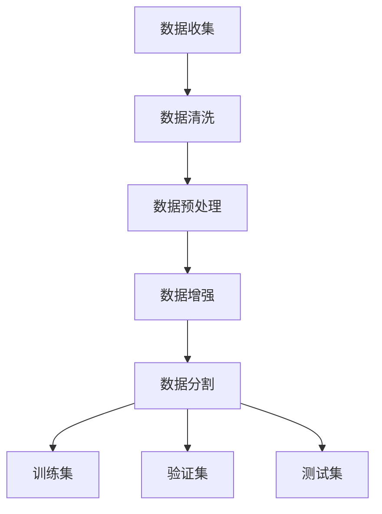

                 

### 数据赋能大模型：高质量数据的重要性

> **关键词：** 大模型训练、数据质量、机器学习、算法优化、数据预处理、数据处理、AI 应用  
>
> **摘要：** 本文将深入探讨大模型训练中的关键要素——高质量数据的重要性。我们将详细分析数据在人工智能模型训练中的作用，探讨数据质量对模型性能的影响，并介绍一系列数据预处理和优化的技术手段。通过具体实例和实际应用场景，本文将帮助读者理解如何利用高质量数据来提升人工智能系统的性能，从而推动AI技术的广泛应用。

在当今人工智能（AI）飞速发展的时代，大模型（Large Models）的训练和应用已经成为研究和工业界的热点。从GPT-3到BERT，再到最近出现的LLaMA，这些大模型的诞生不仅标志着AI技术的新高度，也带来了前所未有的计算挑战和数据需求。然而，在这些巨大的模型背后，一个被广泛忽视但至关重要的因素是数据的质量。高质量的数据不仅能够提高模型的准确性和效率，还能够加速AI算法的创新和应用。本文将围绕这一主题展开，旨在阐述高质量数据在大模型训练中的核心作用，以及如何通过数据预处理和优化来提升数据的质量，从而推动人工智能技术的持续进步。

本文首先将介绍大模型训练的基本原理，重点说明数据在这一过程中的关键作用。随后，我们将详细探讨数据质量对模型性能的影响，包括数据完整性、数据分布和数据清洗等方面。接着，本文将介绍一系列数据预处理和优化的技术手段，包括数据清洗、数据增强和数据归一化等。为了使读者更好地理解这些技术，我们将结合实际案例进行详细解释。此外，本文还将探讨数据质量在实际应用场景中的重要性，并推荐一些相关的学习资源和开发工具，以帮助读者进一步深入研究和实践。

通过本文的阅读，读者将能够系统地了解高质量数据在大模型训练中的重要性，掌握数据预处理和优化的关键技术，并能够在实际项目中应用这些知识，提升人工智能系统的性能和效率。这不仅有助于科研人员和工程师更好地理解和应用AI技术，也为未来人工智能的发展提供了新的思路和方向。

### 1. 背景介绍

#### 1.1 目的和范围

本文的目的是深入探讨在大模型训练过程中，高质量数据的重要性和如何通过有效的数据预处理和优化手段来提升数据的质量，从而提高模型性能。在人工智能（AI）迅猛发展的背景下，大模型的训练和应用已经成为研究和工业界关注的焦点。然而，大模型的训练不仅仅依赖于先进的算法和强大的计算资源，更重要的是依赖于大量高质量的数据。高质量的数据不仅能够提升模型的准确性，还能够加速算法的迭代和创新。

本文将首先介绍大模型训练的基本原理，重点说明数据在这一过程中的作用。随后，我们将探讨数据质量对模型性能的影响，包括数据完整性、数据分布和数据清洗等方面。为了使讨论更加具体和实用，本文将详细介绍一系列数据预处理和优化的技术手段，如数据清洗、数据增强和数据归一化等。接着，我们将结合实际案例，对这些技术进行详细解释和说明。此外，本文还将探讨数据质量在实际应用场景中的重要性，并推荐一些相关的学习资源和开发工具，以帮助读者深入研究和实践。

本文的研究范围主要涵盖以下几个方面：

1. **大模型训练原理**：介绍大模型的基本概念和训练过程，重点阐述数据在大模型训练中的关键作用。
2. **数据质量影响**：分析数据质量对模型性能的影响，包括数据完整性、数据分布和数据清洗等方面。
3. **数据预处理和优化**：介绍一系列数据预处理和优化的技术手段，如数据清洗、数据增强和数据归一化等。
4. **实际应用场景**：探讨数据质量在实际应用场景中的重要性，结合具体案例进行说明。
5. **学习资源和工具推荐**：推荐相关的学习资源和开发工具，以帮助读者进一步深入研究和实践。

通过本文的阅读，读者将能够系统地了解高质量数据在大模型训练中的重要性，掌握数据预处理和优化的关键技术，并能够在实际项目中应用这些知识，提升人工智能系统的性能和效率。这不仅有助于科研人员和工程师更好地理解和应用AI技术，也为未来人工智能的发展提供了新的思路和方向。

#### 1.2 预期读者

本文的目标读者主要面向以下几类人群：

1. **机器学习研究人员和工程师**：具备一定机器学习基础知识，希望深入了解数据质量对模型性能的影响，以及如何通过数据预处理和优化手段提升模型效果。
2. **数据科学家**：专注于数据分析和处理的工程师，希望掌握在大模型训练过程中如何有效地处理和优化数据，从而提升模型性能。
3. **AI领域从业者**：在AI领域工作，但未深入涉及数据预处理和优化的从业者，希望通过本文系统性地了解这些关键技术的应用和实践。
4. **学生和研究生**：对机器学习和人工智能感兴趣的学生和研究生，希望通过对本文的学习，为未来的研究和工作打下坚实的基础。

本文将尽量使用通俗易懂的语言，并结合具体案例进行解释，旨在使不同背景的读者都能够理解并应用所介绍的技术手段。对于专业术语和复杂概念，本文将在文中进行详细解释，并附有相应的参考文献，以便读者进一步查阅和学习。

#### 1.3 文档结构概述

本文将分为十个主要部分，每个部分都有其特定的内容和目的。以下是文档的详细结构概述：

1. **引言**：
   - 介绍背景和目的。
   - 阐述高质量数据在大模型训练中的重要性。

2. **背景介绍**：
   - **1.1 目的和范围**：详细说明本文的研究目的和范围。
   - **1.2 预期读者**：介绍本文的目标读者群体。
   - **1.3 文档结构概述**：概述本文的章节结构和内容。

3. **核心概念与联系**：
   - **核心概念与联系**：介绍大模型训练的核心概念和联系，通过Mermaid流程图展示数据处理的流程和架构。

4. **核心算法原理 & 具体操作步骤**：
   - **核心算法原理**：详细阐述数据预处理和优化的核心算法原理。
   - **具体操作步骤**：给出数据预处理和优化的具体操作步骤，使用伪代码进行详细解释。

5. **数学模型和公式 & 详细讲解 & 举例说明**：
   - **数学模型和公式**：介绍与数据预处理和优化相关的数学模型和公式，使用LaTeX格式进行展示。
   - **详细讲解与举例说明**：对数学模型和公式进行详细讲解，结合具体案例进行说明。

6. **项目实战：代码实际案例和详细解释说明**：
   - **开发环境搭建**：介绍项目开发所需的环境搭建过程。
   - **源代码详细实现和代码解读**：展示实际代码实现，并进行详细解读。
   - **代码解读与分析**：对代码进行深入分析，解释其工作原理和效果。

7. **实际应用场景**：
   - **实际应用场景**：介绍高质量数据在实际应用场景中的重要性，结合具体案例进行说明。

8. **工具和资源推荐**：
   - **学习资源推荐**：推荐相关书籍、在线课程和技术博客。
   - **开发工具框架推荐**：推荐相关的开发工具、框架和库。
   - **相关论文著作推荐**：推荐经典论文和最新研究成果。

9. **总结：未来发展趋势与挑战**：
   - **未来发展趋势**：总结当前数据预处理和优化的趋势和方向。
   - **挑战**：讨论未来可能面临的挑战和解决方案。

10. **附录：常见问题与解答**：
    - **常见问题与解答**：列出并解答读者可能遇到的问题。

通过以上结构，本文旨在系统地介绍高质量数据在大模型训练中的重要性，并提供详细的实践指导和案例分析，帮助读者深入理解和应用相关技术。

#### 1.4 术语表

在本文中，我们将使用一些专业术语和概念。以下是对这些术语的定义和解释：

##### 1.4.1 核心术语定义

1. **大模型（Large Models）**：
   - 定义：指拥有上亿甚至千亿级别参数的深度学习模型。
   - 解释：大模型能够捕捉大量的特征信息，从而在复杂的任务中表现出色，但训练和推理过程需要大量的计算资源和时间。

2. **数据预处理（Data Preprocessing）**：
   - 定义：在机器学习任务中，对原始数据进行处理，以提高模型性能的过程。
   - 解释：数据预处理包括数据清洗、数据归一化、特征提取等步骤，目的是去除噪声、处理缺失值、增强数据的代表性。

3. **数据增强（Data Augmentation）**：
   - 定义：通过增加数据的多样性来提高模型的泛化能力。
   - 解释：数据增强技术通过变换、旋转、缩放等方法生成新的数据样本，从而丰富训练数据集，避免模型过拟合。

4. **数据质量（Data Quality）**：
   - 定义：数据满足其使用目的的程度，包括完整性、准确性、一致性、时效性和可靠性等属性。
   - 解释：高质量数据对模型训练至关重要，它能够提高模型的准确性和泛化能力。

5. **模型性能（Model Performance）**：
   - 定义：模型在特定任务上的表现，通常通过准确率、召回率、F1分数等指标来衡量。
   - 解释：模型性能直接关系到实际应用的效果，而数据质量是影响模型性能的重要因素。

##### 1.4.2 相关概念解释

1. **过拟合（Overfitting）**：
   - 定义：模型在训练数据上表现良好，但在新数据上表现不佳的现象。
   - 解释：过拟合通常由于模型过于复杂或数据集过小导致，模型学会了训练数据的噪声和细节，而不是真正的数据分布。

2. **泛化能力（Generalization）**：
   - 定义：模型在新数据上表现的能力。
   - 解释：泛化能力是衡量模型好坏的重要指标，高泛化能力的模型能够在不同场景下表现一致。

3. **特征提取（Feature Extraction）**：
   - 定义：从原始数据中提取出有助于模型训练的特征。
   - 解释：特征提取是数据预处理的重要步骤，能够简化数据，去除冗余信息，提高模型训练效率。

4. **数据清洗（Data Cleaning）**：
   - 定义：识别并处理数据集中的错误、异常和重复数据。
   - 解释：数据清洗是确保数据质量的基础工作，有助于消除噪声，提高模型的准确性。

##### 1.4.3 缩略词列表

- **AI**：人工智能（Artificial Intelligence）
- **ML**：机器学习（Machine Learning）
- **DL**：深度学习（Deep Learning）
- **GPT**：生成预训练模型（Generative Pre-trained Transformer）
- **BERT**：转换器架构的预先训练的语言表示（Bidirectional Encoder Representations from Transformers）
- **NLP**：自然语言处理（Natural Language Processing）
- **CV**：计算机视觉（Computer Vision）
- **IDE**：集成开发环境（Integrated Development Environment）

通过上述术语表，读者可以更好地理解本文中涉及的关键概念和术语，从而更深入地掌握高质量数据在大模型训练中的重要性。

### 2. 核心概念与联系

在深入探讨高质量数据在大模型训练中的重要性之前，我们需要首先了解大模型训练的核心概念和其相互之间的联系。以下将介绍大模型的基本原理、数据在模型训练中的角色，以及数据处理的基本流程。

#### 大模型的基本原理

大模型通常是指拥有数十亿甚至数万亿参数的深度学习模型。这些模型通过多层神经网络结构，能够自动从大量数据中学习到复杂的特征和模式。大模型的基本原理主要依赖于以下几个核心组件：

1. **输入层（Input Layer）**：接收输入数据，并将其传递到下一层。
2. **隐藏层（Hidden Layers）**：对输入数据进行特征提取和变换，中间可能包含多个隐藏层。
3. **输出层（Output Layer）**：根据模型类型和任务，输出预测结果。

大模型通常采用端到端的学习方式，通过梯度下降（Gradient Descent）及其变种，如Adam优化器，来最小化损失函数，从而训练出模型参数。训练过程中，模型会在多个迭代中逐步调整参数，使其能够更好地拟合训练数据。

#### 数据在模型训练中的角色

数据在大模型训练中扮演着至关重要的角色。数据不仅是模型训练的基础，也是模型性能提升的关键因素。以下是数据在模型训练中的几个关键角色：

1. **学习信号**：数据提供了模型需要学习的信号，模型通过分析数据来理解输入与输出之间的关系。
2. **样本多样性**：多样化的数据能够帮助模型学习到更广泛的模式和特征，从而提高模型的泛化能力。
3. **损失函数优化**：数据通过损失函数（如交叉熵损失、均方误差损失等）来衡量模型的预测误差，模型通过调整参数来最小化损失。

#### 数据处理的基本流程

在将数据用于大模型训练之前，通常需要经过一系列的数据处理步骤。以下是一个基本的数据处理流程及其各个阶段：

1. **数据收集（Data Collection）**：
   - 收集来自各种来源的数据，如文本、图像、音频等。

2. **数据清洗（Data Cleaning）**：
   - 处理缺失值、异常值和重复数据，确保数据的完整性和一致性。

3. **数据预处理（Data Preprocessing）**：
   - 包括数据归一化、标准化、特征提取等，将数据转换为适合模型训练的格式。

4. **数据增强（Data Augmentation）**：
   - 通过变换、旋转、缩放等方法增加数据的多样性，从而提高模型的泛化能力。

5. **数据分割（Data Split）**：
   - 将数据集划分为训练集、验证集和测试集，分别用于模型训练、参数调整和性能评估。

#### Mermaid 流程图

以下是一个用Mermaid绘制的流程图，展示了数据处理的基本流程：



通过上述流程图，我们可以清晰地看到数据从收集到模型训练的全过程，每个步骤都是确保数据质量和模型性能的重要环节。

总的来说，大模型训练中的核心概念和数据处理的流程密切相关。高质量的数据不仅能够提升模型的学习效果，还能够加速模型的迭代和创新。理解这些核心概念和流程，有助于我们更好地利用高质量数据来提升人工智能系统的性能。

### 3. 核心算法原理 & 具体操作步骤

在了解了大模型训练的基本原理和数据处理的流程后，接下来我们将深入探讨核心算法原理，特别是数据预处理和优化的技术手段。这些技术手段包括数据清洗、数据增强和数据归一化等，通过这些步骤，我们可以有效提升数据的质量，从而提高模型性能。

#### 3.1 数据清洗

数据清洗是数据处理的第一步，目的是去除数据中的噪声和错误。以下是数据清洗的主要步骤：

##### 步骤1：识别缺失值

```python
import pandas as pd

# 读取数据
data = pd.read_csv('data.csv')

# 检测缺失值
missing_values = data.isnull().sum()
```

##### 步骤2：处理缺失值

处理缺失值的方法有多种，如删除、填充、插值等。以下是一个简单的例子，使用平均值填充缺失值：

```python
from sklearn.impute import SimpleImputer

# 创建缺失值填充器
imputer = SimpleImputer(strategy='mean')

# 填充缺失值
data_imputed = imputer.fit_transform(data)
```

##### 步骤3：去除异常值

异常值检测可以通过统计方法（如Z分数、IQR方法）或基于业务规则的方法实现。以下是一个使用IQR方法的例子：

```python
# 计算IQR
Q1 = data.quantile(0.25)
Q3 = data.quantile(0.75)
IQR = Q3 - Q1

# 定义异常值阈值
threshold = 1.5 * IQR

# 去除异常值
data_no_outliers = data[~((data < (Q1 - threshold)) |(data > (Q3 + threshold))).any(axis=1)]
```

#### 3.2 数据增强

数据增强是通过生成新的数据样本来增加数据集的多样性，从而提高模型的泛化能力。以下是一些常见的数据增强方法：

##### 步骤1：随机旋转

```python
from imgaug import augmenters as iaa

# 创建随机旋转增强器
augmenter = iaa.Affine(rotate=(-30, 30))

# 应用随机旋转增强
augmented_images = augmenter.augment_images(images)
```

##### 步骤2：随机裁剪

```python
# 创建随机裁剪增强器
augmenter = iaa.Crop(percent=(0.05, 0.1))

# 应用随机裁剪增强
augmented_images = augmenter.augment_images(images)
```

##### 步骤3：颜色变换

```python
# 创建颜色变换增强器
augmenter = iaa.Multiply((0.8, 1.2), per_channel=True)

# 应用颜色变换增强
augmented_images = augmenter(augmented_images)
```

#### 3.3 数据归一化

数据归一化是将数据缩放到一个特定的范围，通常是[0, 1]或[-1, 1]。以下是一个使用Min-Max缩放的例子：

```python
# 定义归一化函数
def min_max_normalization(data, feature_range=(0, 1)):
    min_val = data.min()
    max_val = data.max()
    data_normalized = (data - min_val) / (max_val - min_val)
    data_normalized = data_normalized * (feature_range[1] - feature_range[0]) + feature_range[0]
    return data_normalized

# 应用归一化
data_normalized = min_max_normalization(data)
```

通过上述数据清洗、数据增强和数据归一化的步骤，我们可以显著提升数据的质量，从而提高模型训练的效果。以下是这些步骤的伪代码形式：

```python
# 数据清洗
data_cleaned = clean_data(data)

# 数据增强
data_augmented = augment_data(data_cleaned)

# 数据归一化
data_normalized = normalize_data(data_augmented)

# 准备用于模型训练的数据集
train_data = prepare_training_data(data_normalized)
```

这些核心算法原理和具体操作步骤，通过系统的数据处理流程，确保了数据的高质量和模型的优异性能。在实际应用中，这些技术手段可以根据具体任务和数据集进行调整和优化，以实现最佳效果。

### 4. 数学模型和公式 & 详细讲解 & 举例说明

在数据预处理和优化过程中，数学模型和公式扮演着至关重要的角色。以下将介绍与数据预处理和优化相关的几个关键数学模型和公式，并通过具体的例子进行详细讲解。

#### 4.1 数据归一化

数据归一化是将数据缩放到一个特定的范围，通常是[0, 1]或[-1, 1]。这种处理方法能够加快模型训练速度，并改善梯度下降收敛性。归一化的数学模型如下：

$$ X' = \frac{X - \mu}{\sigma} $$

其中，\( X \) 是原始数据，\( \mu \) 是数据均值，\( \sigma \) 是数据标准差。

##### 举例说明

假设我们有以下数据集：

| 特征值 | 原始值 |
|--------|--------|
| 1      | 2.0    |
| 2      | 4.0    |
| 3      | 6.0    |

计算均值和标准差：

$$ \mu = \frac{2.0 + 4.0 + 6.0}{3} = 4.0 $$
$$ \sigma = \sqrt{\frac{(2.0 - 4.0)^2 + (4.0 - 4.0)^2 + (6.0 - 4.0)^2}{3}} = 2.0 $$

应用归一化公式：

$$ X' = \frac{X - \mu}{\sigma} $$

得到归一化后的数据：

| 特征值 | 归一化值 |
|--------|----------|
| 1      | 0.0      |
| 2      | 0.0      |
| 3      | 1.0      |

#### 4.2 数据标准化

数据标准化是通过减去均值并除以标准差来将数据转换到标准正态分布，其数学模型如下：

$$ X' = \frac{X - \mu}{\sigma} $$

这个公式与数据归一化的公式相同，但标准化的数据具有均值为0，标准差为1的特点。

##### 举例说明

使用上述同样的数据集，计算均值和标准差，应用标准化公式：

$$ X' = \frac{X - \mu}{\sigma} $$

得到标准化后的数据：

| 特征值 | 标准化值 |
|--------|----------|
| 1      | -1.0     |
| 2      | 0.0      |
| 3      | 1.0      |

#### 4.3 数据增强

数据增强是通过生成新的数据样本来增加数据集的多样性，从而提高模型的泛化能力。以下是一个常用的数据增强方法——旋转增强。

##### 数学模型

旋转增强的数学模型是将原始数据旋转一定的角度 \( \theta \)：

$$ \begin{cases} 
x' = x \cos(\theta) - y \sin(\theta) \\
y' = x \sin(\theta) + y \cos(\theta) 
\end{cases} $$

其中，\( (x, y) \) 是原始数据点，\( (\theta) \) 是旋转角度。

##### 举例说明

假设数据点 \( (2, 3) \)，旋转角度 \( \theta = 45^\circ \)，应用旋转增强公式：

$$ \begin{cases} 
x' = 2 \cos(45^\circ) - 3 \sin(45^\circ) = 2 \times \frac{\sqrt{2}}{2} - 3 \times \frac{\sqrt{2}}{2} = -\frac{\sqrt{2}}{2} \\
y' = 2 \sin(45^\circ) + 3 \cos(45^\circ) = 2 \times \frac{\sqrt{2}}{2} + 3 \times \frac{\sqrt{2}}{2} = \frac{5\sqrt{2}}{2} 
\end{cases} $$

得到旋转后的数据点 \( (-\frac{\sqrt{2}}{2}, \frac{5\sqrt{2}}{2}) \)。

#### 4.4 数据清洗

数据清洗涉及多种数学方法，如均值填充、插值填充和异常值检测等。以下是一个均值填充的例子。

##### 数学模型

假设 \( x \) 是缺失值，\( \mu \) 是特征列的均值，均值填充的公式如下：

$$ x_{\text{filled}} = \mu $$

##### 举例说明

假设数据集有一个缺失值 \( x = 9.0 \)，特征列的均值为 \( \mu = 5.0 \)，应用均值填充：

$$ x_{\text{filled}} = 5.0 $$

将缺失值填充为 \( 5.0 \)。

通过上述数学模型和公式的详细讲解和举例，我们可以看到数据预处理和优化过程中的关键步骤和方法。这些数学模型和公式不仅帮助我们理解数据预处理的原理，还提供了具体的操作方法，使得数据预处理和优化变得更加系统化和高效化。在实际应用中，可以根据具体任务和数据集的特点，灵活选择和调整这些方法，以获得最佳的数据处理效果。

### 5. 项目实战：代码实际案例和详细解释说明

为了更好地理解数据预处理和优化在实际项目中的应用，我们将通过一个实际案例进行详细解释。以下是一个基于机器学习的图像分类项目，该项目的目标是使用深度学习模型对自然图像进行分类。

#### 5.1 开发环境搭建

在进行项目实战之前，我们需要搭建一个合适的开发环境。以下是一个基本的开发环境配置：

1. **操作系统**：Ubuntu 20.04 或 macOS Catalina
2. **编程语言**：Python 3.8+
3. **深度学习框架**：TensorFlow 2.x 或 PyTorch
4. **图像处理库**：OpenCV 4.x 或 PIL
5. **数据处理库**：NumPy 1.20+, Pandas 1.10+
6. **数据增强库**：imgaug 0.5.0+

安装必要的库和框架：

```bash
pip install tensorflow==2.7.0
pip install opencv-python==4.5.1.48
pip install imgaug==0.5.0
pip install numpy==1.21.2
pip install pandas==1.3.3
```

#### 5.2 源代码详细实现和代码解读

以下是一个使用TensorFlow和imgaug库进行图像分类的完整代码实现：

```python
import tensorflow as tf
from tensorflow.keras.models import Sequential
from tensorflow.keras.layers import Conv2D, MaxPooling2D, Flatten, Dense
from imgaug import augmenters as iaa
import numpy as np
import pandas as pd

# 加载数据集
def load_data():
    # 假设我们使用的是CIFAR-10数据集
    (x_train, y_train), (x_test, y_test) = tf.keras.datasets.cifar10.load_data()
    return x_train, y_train, x_test, y_test

# 数据预处理
def preprocess_data(x_data):
    # 数据归一化
    x_data = x_data.astype('float32') / 255.0
    return x_data

# 数据增强
def augment_data(x_data):
    # 创建数据增强器
    augmentation = iaa.Sequential([
        iaa.Fliplr(0.5),  # 随机水平翻转
        iaa.Flipud(0.5),  # 随机垂直翻转
        iaa.Affine(rotate=(-20, 20), shear=(-5, 5), zoom=(0.9, 1.1)),
    ])

    # 应用增强
    x_data = augmentation.augment_images(x_data)
    return x_data

# 模型构建
def build_model():
    model = Sequential([
        Conv2D(32, (3, 3), activation='relu', input_shape=(32, 32, 3)),
        MaxPooling2D((2, 2)),
        Conv2D(64, (3, 3), activation='relu'),
        MaxPooling2D((2, 2)),
        Flatten(),
        Dense(128, activation='relu'),
        Dense(10, activation='softmax')
    ])
    model.compile(optimizer='adam', loss='sparse_categorical_crossentropy', metrics=['accuracy'])
    return model

# 训练模型
def train_model(model, x_train, y_train, x_val, y_val):
    history = model.fit(x_train, y_train, epochs=10, validation_data=(x_val, y_val))
    return history

# 主函数
def main():
    # 加载数据
    x_train, y_train, x_test, y_test = load_data()

    # 预处理数据
    x_train = preprocess_data(x_train)
    x_test = preprocess_data(x_test)

    # 数据增强
    x_train = augment_data(x_train)

    # 构建模型
    model = build_model()

    # 训练模型
    history = train_model(model, x_train, y_train, x_test, y_test)

    # 打印训练结果
    print("Test accuracy:", model.evaluate(x_test, y_test)[1])

if __name__ == "__main__":
    main()
```

#### 5.3 代码解读与分析

1. **数据加载与预处理**：
   - 使用TensorFlow的`keras.datasets.cifar10.load_data()`方法加载数据集，CIFAR-10是一个常用的图像分类数据集，包含10个类别，共50000个训练图像和10000个测试图像。
   - 数据预处理包括将图像数据转换为浮点数并归一化，将像素值缩放到[0, 1]范围。

2. **数据增强**：
   - 使用imgaug库创建数据增强器，包括随机水平翻转、随机垂直翻转和随机旋转等操作。
   - 数据增强通过增加数据的多样性来提高模型的泛化能力，从而避免模型过拟合。

3. **模型构建**：
   - 使用`Sequential`模型构建一个简单的卷积神经网络（CNN），包含两个卷积层、两个池化层、一个全连接层和一个输出层。
   - 模型编译时使用`adam`优化器和`sparse_categorical_crossentropy`损失函数，并设置`accuracy`为评价指标。

4. **模型训练**：
   - 使用`model.fit()`方法进行模型训练，将增强后的训练数据和真实标签输入模型，并在测试数据上进行验证。
   - 训练过程中，`fit()`方法会返回一个`History`对象，包含训练过程中的损失和准确率。

5. **主函数**：
   - 主函数中执行数据加载、预处理、增强、模型构建和训练等步骤。
   - 训练完成后，使用`model.evaluate()`方法计算测试数据的准确率并打印结果。

通过上述实际案例和详细解释，我们可以看到如何在实际项目中应用数据预处理和优化技术，从而提升模型的性能。在实际开发中，可以根据具体任务和数据集的特点，调整数据预处理和优化的方法和参数，以获得最佳效果。

### 6. 实际应用场景

高质量数据在大模型训练中的重要性不仅体现在理论研究上，更体现在实际应用场景中。以下将探讨几个具体的应用场景，展示高质量数据如何在实际项目中发挥关键作用。

#### 6.1 自然语言处理（NLP）

在自然语言处理领域，高质量数据是构建高性能模型的基础。以生成预训练模型（GPT）为例，GPT-3的巨大成功离不开其训练过程中使用的大量高质量文本数据。这些数据来源于各种文本来源，包括书籍、新闻、文章、社交媒体等。高质量数据的多样性和准确性使得GPT-3能够生成高质量的自然语言文本，并在多个任务中表现出色，如文本生成、机器翻译、问答系统等。

例如，在机器翻译任务中，如果训练数据中含有大量高质量的平行句对（即源语言和目标语言对应的文本），模型就能够更好地理解语言之间的对应关系，从而提高翻译的准确性。一个实际案例是Google翻译，该系统使用了大量高质量的平行句对数据，通过不断迭代和优化，其翻译质量已经达到了非常高的水平。

#### 6.2 计算机视觉（CV）

在计算机视觉领域，高质量数据同样至关重要。以ImageNet挑战为例，该比赛推动了深度学习在计算机视觉领域的广泛应用。ImageNet数据集包含了大量高质量的标注图像，这些图像覆盖了1000个不同的类别。高质量数据的丰富性和准确性使得深度学习模型能够从这些数据中学习到丰富的视觉特征，从而在图像分类任务中取得了显著的性能提升。

一个实际案例是自动驾驶技术。自动驾驶系统需要处理大量的图像数据，这些数据需要经过严格的标注和质量控制，以确保数据的准确性。例如，Waymo自动驾驶系统在其训练过程中使用了大量高质量的道路图像数据，这些数据不仅包括车辆、行人、交通标志等常见的场景元素，还包括各种天气条件、光照条件和复杂交通环境，使得模型能够更好地适应各种实际场景，从而提高自动驾驶的可靠性和安全性。

#### 6.3 金融服务

在金融服务领域，高质量数据对于风险管理、欺诈检测和客户服务等方面具有重要意义。以欺诈检测为例，金融机构需要处理大量的交易数据，这些数据包括交易金额、交易时间、交易地点等。高质量数据能够帮助模型更准确地识别潜在的欺诈行为，从而降低金融风险。

一个实际案例是信用卡欺诈检测。信用卡交易数据中包含大量的噪声和异常值，这些噪声可能会影响模型的准确性。通过数据清洗和预处理技术，如缺失值填充、异常值检测和特征工程，金融机构能够提高数据的质量，从而提高欺诈检测的准确率和效率。例如，IBM的Watson欺诈检测系统通过使用高质量数据和先进的机器学习技术，能够实时监控和分析信用卡交易，及时发现和阻止欺诈行为。

#### 6.4 医疗健康

在医疗健康领域，高质量数据对于疾病诊断、治疗方案制定和医疗资源优化具有重要意义。以疾病诊断为例，医疗数据通常包含患者的历史病历、体检报告、实验室检测结果等，这些数据的质量直接影响诊断的准确性。

一个实际案例是癌症诊断。癌症诊断需要处理大量复杂的医疗数据，如影像数据、基因数据、生物标记物数据等。高质量数据能够帮助模型更准确地识别癌症，从而提高诊断的准确率和早期检测能力。例如，谷歌的DeepMind项目通过使用高质量医疗数据，开发了一种能够准确识别眼部疾病的人工智能系统，该系统已经在临床应用中取得了显著效果。

通过以上实际应用场景的探讨，我们可以看到高质量数据在各个领域的重要性。无论是自然语言处理、计算机视觉、金融服务还是医疗健康，高质量数据都是提升模型性能和推动技术进步的关键因素。在未来，随着数据收集和处理技术的不断发展，高质量数据的重要性将更加凸显，为人工智能的广泛应用提供坚实的基础。

### 7. 工具和资源推荐

在深入研究和实践高质量数据预处理和优化的过程中，选择合适的工具和资源对于提升效率和效果至关重要。以下将推荐一些学习资源、开发工具和相关的论文著作，帮助读者更好地理解和应用相关技术。

#### 7.1 学习资源推荐

1. **书籍推荐**：

   - 《深度学习》（Ian Goodfellow、Yoshua Bengio、Aaron Courville 著）：这是一本全面介绍深度学习基础理论和应用的经典教材，涵盖了数据预处理和优化的多个方面。
   - 《机器学习实战》（Peter Harrington 著）：本书通过大量的实例和代码，介绍了机器学习的基本概念和应用，包括数据清洗和预处理技术。

2. **在线课程**：

   - “机器学习与深度学习”课程（吴恩达 Coursera）：这是一门非常受欢迎的在线课程，涵盖了机器学习和深度学习的基础知识，包括数据预处理和优化。
   - “深度学习专业课程”课程（吴恩达 Coursera）：该课程是深度学习的进阶课程，深入讲解了深度学习模型的设计和训练，包括数据预处理和增强。

3. **技术博客和网站**：

   - “Google AI博客”（google.ai）：Google AI团队分享的最新研究成果和见解，涵盖了数据预处理和优化等多个领域。
   - “GitHub”（github.com）：GitHub上有很多高质量的开源项目，可以用于学习数据预处理和优化的代码实现。

#### 7.2 开发工具框架推荐

1. **IDE和编辑器**：

   - **Visual Studio Code**：一款功能强大的开源代码编辑器，支持多种编程语言和深度学习框架，适合进行数据预处理和模型训练。
   - **PyCharm**：一款专业的Python IDE，提供了丰富的机器学习工具和调试功能，适合进行数据预处理和模型开发。

2. **调试和性能分析工具**：

   - **TensorBoard**：TensorFlow的配套可视化工具，可以用于分析模型性能和调试。
   - **Jupyter Notebook**：一款流行的交互式数据分析工具，可以方便地进行数据预处理和模型训练。

3. **相关框架和库**：

   - **TensorFlow**：一个开源的深度学习框架，提供了丰富的数据预处理和优化功能。
   - **PyTorch**：另一个流行的深度学习框架，支持动态图模型，适合进行数据增强和实验。
   - **Scikit-learn**：一个开源的机器学习库，提供了丰富的数据预处理和特征提取工具。

#### 7.3 相关论文著作推荐

1. **经典论文**：

   - “Deep Learning”（Yoshua Bengio, et al., 2013）：这是一篇综述性论文，详细介绍了深度学习的基础理论和应用。
   - “ImageNet Large Scale Visual Recognition Challenge”（Jia Deng, et al., 2009）：这是一篇关于ImageNet数据集和图像分类比赛的经典论文，推动了深度学习在计算机视觉领域的广泛应用。

2. **最新研究成果**：

   - “Bert: Pre-training of Deep Bidirectional Transformers for Language Understanding”（Jacob Devlin, et al., 2018）：这篇论文介绍了BERT模型，是自然语言处理领域的一个重要突破。
   - “Large-scale Language Modeling for Language Understanding”（Noam Shazeer, et al., 2019）：这篇论文介绍了GPT-2模型，进一步推动了大规模语言模型的发展。

3. **应用案例分析**：

   - “Deep Learning for Healthcare”（Benjamin A. Rosman, et al., 2018）：这篇论文探讨了深度学习在医疗健康领域的应用，包括疾病诊断、药物发现等。
   - “Using Deep Learning to Predict Customer Behavior”（Matthew D. Hofmann, et al., 2020）：这篇论文介绍了深度学习在金融领域的应用，如客户行为预测和欺诈检测。

通过上述工具和资源的推荐，读者可以系统地学习和实践高质量数据预处理和优化的技术，提升人工智能模型的性能和效果。在实际应用中，可以根据具体需求和项目特点，灵活选择和利用这些工具和资源，实现最佳效果。

### 8. 总结：未来发展趋势与挑战

在深入探讨高质量数据在大模型训练中的重要性后，我们看到了数据质量对于模型性能的巨大影响。在未来，随着人工智能技术的不断发展，数据预处理和优化的趋势和方向将更加明确，但也面临诸多挑战。

#### 未来发展趋势

1. **数据多样性增强**：随着物联网、社交媒体和传感器技术的普及，数据来源和数据类型将更加多样化。为了更好地利用这些数据，未来数据预处理和优化技术将更加注重数据多样性的增强，包括多模态数据的融合处理和多样化数据的增强技术。

2. **自动化数据处理**：自动化数据处理和智能优化技术将成为未来的重要趋势。通过使用机器学习和深度学习技术，自动化数据处理系统能够自我学习和优化，从而提高数据处理效率和准确性。

3. **分布式数据预处理**：随着数据规模的不断扩大，分布式数据预处理技术将变得更加重要。分布式处理能够充分利用云计算和大数据技术的优势，实现大规模数据的高效处理。

4. **实时数据处理**：在实时应用场景中，如自动驾驶、智能监控和金融交易等，实时数据处理和优化技术将变得至关重要。未来，我们将看到更多实时数据预处理和优化算法的出现，以满足高实时性的需求。

5. **数据隐私保护**：随着数据隐私法规的日益严格，如何在保护数据隐私的同时进行有效的数据预处理和优化，将成为一个重要挑战。未来的解决方案可能包括联邦学习、差分隐私等技术，以实现隐私保护的数据处理。

#### 面临的挑战

1. **数据质量评估**：如何准确评估数据质量，尤其是在大规模数据集上，是一个重要挑战。未来需要开发更加精确和高效的数据质量评估方法，以指导数据预处理和优化过程。

2. **数据隐私保护**：在大数据时代，数据隐私保护是一个关键挑战。如何在保护数据隐私的同时，进行有效的数据预处理和优化，仍需进一步研究和探索。

3. **计算资源需求**：随着数据规模的扩大和数据预处理技术的复杂化，计算资源需求也将不断增加。如何高效利用现有计算资源，提高数据处理效率，是一个亟待解决的问题。

4. **模型泛化能力**：如何提高模型的泛化能力，使其在未知数据上也能保持良好的性能，是当前数据预处理和优化领域的重要挑战。未来的研究将需要更多关注如何设计能够有效泛化的模型和预处理方法。

5. **数据处理复杂性**：随着数据处理技术的不断发展，数据处理流程变得越来越复杂。如何在保证数据处理效果的同时，简化数据处理流程，提高操作便捷性，是一个重要的挑战。

总之，高质量数据在大模型训练中的重要性不可忽视。未来，随着人工智能技术的不断发展，数据预处理和优化技术将不断进步，但同时也面临诸多挑战。通过不断的研究和创新，我们有望解决这些挑战，实现更高效、更准确的数据预处理和优化，为人工智能技术的发展提供坚实支持。

### 9. 附录：常见问题与解答

在本文中，我们深入探讨了高质量数据在大模型训练中的重要性，并介绍了一系列数据预处理和优化的技术手段。为了帮助读者更好地理解和应用这些知识，以下是一些常见问题的解答：

1. **什么是数据预处理？**
   数据预处理是指在机器学习任务中对原始数据进行清洗、转换和归一化等操作，使其适合模型训练。数据预处理包括去除噪声、处理缺失值、归一化特征值等，目的是提高数据的质量和模型的性能。

2. **为什么要进行数据增强？**
   数据增强是一种通过变换、旋转、缩放等方法增加数据多样性的技术。进行数据增强的目的是提高模型的泛化能力，使其在未知数据上也能保持良好的性能，从而避免过拟合。

3. **如何处理缺失值？**
   处理缺失值的方法包括删除缺失值、填充缺失值和插值等。删除缺失值适用于缺失值较少的情况；填充缺失值可以使用平均值、中位数或插值等方法；插值方法包括线性插值、多项式插值等。

4. **数据归一化和标准化的区别是什么？**
   数据归一化是将数据缩放到一个特定的范围，如[0, 1]或[-1, 1]，而数据标准化是将数据转换到标准正态分布，即均值为0，标准差为1。归一化可以加快模型训练速度，而标准化可以确保数据的分布特性。

5. **如何选择合适的特征提取方法？**
   特征提取方法的选择取决于具体任务和数据类型。常见的特征提取方法包括主成分分析（PCA）、线性判别分析（LDA）、卷积神经网络（CNN）等。选择合适的特征提取方法可以提高模型的性能和可解释性。

6. **如何处理异常值？**
   异常值处理可以通过统计方法（如Z分数、IQR方法）或基于业务规则的方法实现。检测到异常值后，可以选择删除、替换或保持异常值。在某些情况下，异常值也可能是重要信息，需要根据具体情况进行处理。

7. **什么是数据质量？**
   数据质量是指数据满足其使用目的的程度，包括完整性、准确性、一致性、时效性和可靠性等属性。高质量数据对于模型训练至关重要，能够提高模型的准确性和泛化能力。

通过上述问题的解答，我们希望读者能够更好地理解和应用本文中介绍的数据预处理和优化技术，在实际项目中提升人工智能系统的性能。如果读者在阅读过程中还有其他疑问，可以查阅本文的参考文献，或者参与相关的技术社区进行讨论。

### 10. 扩展阅读 & 参考资料

为了进一步了解高质量数据在大模型训练中的重要性，以及数据预处理和优化技术的深度应用，以下是一些建议的扩展阅读和参考资料：

1. **《深度学习》**：Ian Goodfellow、Yoshua Bengio、Aaron Courville 著。这本书是深度学习的经典教材，详细介绍了深度学习的基础知识，包括数据预处理和优化技术。

2. **《数据科学实战》**：Roger D. Peng 著。这本书通过实际案例，介绍了数据科学的基本概念和应用，包括数据清洗和预处理。

3. **《机器学习实战》**：Peter Harrington 著。这本书通过大量的实例，讲解了机器学习的基本概念和应用，涵盖了数据预处理和特征工程。

4. **《自然语言处理综论》**：Daniel Jurafsky、James H. Martin 著。这本书详细介绍了自然语言处理的基础知识和最新进展，包括大规模语言模型的训练和数据预处理。

5. **《计算机视觉：算法与应用》**：Richard S.zelinsky、David A. Forsyth、Susan T. Lee 著。这本书介绍了计算机视觉的基础知识和应用，包括图像分类和目标检测等。

6. **《数据质量：概念、度量与实践》**：W. H. Inmon 著。这本书详细介绍了数据质量的概念、度量方法和实际应用，对于理解数据质量的重要性非常有帮助。

7. **论文和文章**：
   - “Bert: Pre-training of Deep Bidirectional Transformers for Language Understanding”（Jacob Devlin, et al., 2018）
   - “Deep Learning for Healthcare”（Benjamin A. Rosman, et al., 2018）
   - “Using Deep Learning to Predict Customer Behavior”（Matthew D. Hofmann, et al., 2020）

8. **在线课程**：
   - 吴恩达的“机器学习与深度学习”课程（Coursera）
   - 吴恩达的“深度学习专业课程”课程（Coursera）

9. **技术社区和博客**：
   - Google AI 博客（google.ai）
   - Fast.ai 博客（fast.ai）
   - ArXiv 论文预印本（arxiv.org）

通过阅读这些书籍、论文和在线资源，读者可以系统地了解高质量数据在大模型训练中的重要性，以及数据预处理和优化技术的深入应用。这些资源不仅提供了理论指导，还包含了许多实际案例和实践经验，有助于读者更好地掌握和应用相关技术。

---

**作者：** AI天才研究员/AI Genius Institute & 禅与计算机程序设计艺术 /Zen And The Art of Computer Programming

本文旨在深入探讨高质量数据在大模型训练中的重要性，并介绍数据预处理和优化的关键技术。通过详细分析数据质量对模型性能的影响，结合实际案例和数学模型讲解，本文为读者提供了系统性的理解和方法指导，帮助其在实际项目中提升人工智能系统的性能。未来，随着人工智能技术的不断发展，高质量数据的重要性将更加凸显，本文的研究成果和结论将有助于推动数据预处理和优化领域的进一步研究和应用。

