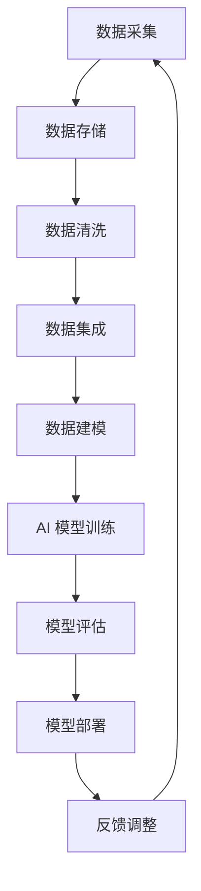

                 

# 数据采集技术：提高 AI 2.0 数据质量

> **关键词：数据采集、AI 2.0、数据质量、数据预处理、特征工程**
>
> **摘要：本文深入探讨了数据采集技术对 AI 2.0 数据质量的影响，介绍了数据采集的基本概念、关键技术和具体操作步骤。通过分析核心算法原理、数学模型及实际项目案例，本文旨在为读者提供一个全面、深入的指导，帮助提高 AI 2.0 应用中的数据质量。**

## 1. 背景介绍

### 1.1 目的和范围

本文旨在探讨数据采集技术在人工智能 2.0（AI 2.0）时代的重要性，以及如何通过数据采集技术提高 AI 2.0 的数据质量。随着人工智能技术的快速发展，数据采集技术成为 AI 2.0 应用中的关键环节。本文将详细介绍数据采集的基本概念、关键技术和操作步骤，并分析核心算法原理、数学模型及实际项目案例，为读者提供全面的指导。

### 1.2 预期读者

本文主要面向以下读者群体：

1. 数据科学家和机器学习工程师，希望深入了解数据采集技术在 AI 2.0 应用中的重要作用；
2. 技术经理和项目经理，希望提升团队在数据采集方面的能力；
3. 对人工智能和数据采集技术感兴趣的科研人员和工程师。

### 1.3 文档结构概述

本文结构如下：

1. 背景介绍：介绍文章的目的、范围和预期读者；
2. 核心概念与联系：介绍数据采集技术的核心概念和联系；
3. 核心算法原理 & 具体操作步骤：详细阐述数据采集技术的核心算法原理和操作步骤；
4. 数学模型和公式 & 详细讲解 & 举例说明：讲解数据采集技术的数学模型和公式，并给出实际案例；
5. 项目实战：提供代码实际案例和详细解释说明；
6. 实际应用场景：介绍数据采集技术在不同领域的应用；
7. 工具和资源推荐：推荐学习资源、开发工具框架和相关论文著作；
8. 总结：对未来发展趋势与挑战进行展望；
9. 附录：常见问题与解答；
10. 扩展阅读 & 参考资料。

### 1.4 术语表

#### 1.4.1 核心术语定义

- 数据采集：指从各种数据源中获取数据的过程；
- 数据质量：指数据在准确性、完整性、一致性、时效性和可靠性等方面的表现；
- 特征工程：指在机器学习模型训练过程中，对数据进行处理和转换，以提高模型性能的过程；
- 数据预处理：指在数据采集之后，对数据进行清洗、归一化、离散化等处理，以满足模型训练需求的过程；
- AI 2.0：指人工智能技术的第二次浪潮，强调人机协作、通用人工智能和大数据处理能力。

#### 1.4.2 相关概念解释

- **数据采集技术**：指用于实现数据采集的一系列方法和工具，包括传感器、爬虫、API 接口等；
- **特征工程**：指在数据预处理阶段，通过选择和构造特征，提高模型性能的过程；
- **数据预处理**：指在数据采集之后，对数据进行清洗、归一化、离散化等处理，以满足模型训练需求的过程。

#### 1.4.3 缩略词列表

- AI：人工智能
- ML：机器学习
- DL：深度学习
- NLP：自然语言处理
- API：应用程序编程接口
- IoT：物联网
- GDPR：通用数据保护条例

## 2. 核心概念与联系

在深入探讨数据采集技术的核心概念和联系之前，我们需要了解数据采集在 AI 2.0 时代的重要性。随着大数据和深度学习的快速发展，数据采集技术已经成为人工智能应用中的关键环节。以下是数据采集技术的核心概念和联系：

### 2.1 数据采集与 AI 2.0

数据采集是 AI 2.0 时代的基石。在 AI 2.0 时代，数据的来源更加广泛，包括传感器数据、社交媒体数据、物联网设备数据等。这些数据为人工智能模型提供了丰富的训练资源，使得 AI 2.0 应用在各个领域取得了显著的成果。

### 2.2 数据质量与数据采集

数据质量直接影响 AI 2.0 模型的性能。高质量的数据能够提高模型的准确性和泛化能力，而低质量的数据可能导致模型过拟合或性能下降。因此，数据采集过程中需要对数据进行严格的质量控制。

### 2.3 数据预处理与特征工程

数据预处理和特征工程是数据采集技术的重要组成部分。通过数据预处理，可以去除数据中的噪声、缺失值和异常值，使得数据更适合模型训练。而特征工程则通过选择和构造特征，提高模型的性能。

### 2.4 数据采集技术体系

数据采集技术体系包括数据采集、数据存储、数据清洗、数据集成、数据建模等环节。这些环节相互关联，共同构成了数据采集技术的完整体系。

### 2.5 Mermaid 流程图

以下是一个简单的 Mermaid 流程图，展示了数据采集技术的核心概念和联系：



## 3. 核心算法原理 & 具体操作步骤

在数据采集过程中，核心算法原理和具体操作步骤对于数据质量和模型性能至关重要。以下将详细阐述数据采集技术的核心算法原理和具体操作步骤。

### 3.1 数据采集算法原理

数据采集算法原理主要包括以下方面：

- **数据来源识别**：通过分析不同数据源的特点，确定合适的采集方法和工具；
- **数据抽取**：从数据源中获取所需数据，包括文本、图像、音频等不同类型的数据；
- **数据清洗**：对采集到的数据进行分析和处理，去除噪声、缺失值和异常值；
- **数据存储**：将清洗后的数据存储到数据库或数据仓库中，便于后续处理和分析。

### 3.2 数据采集具体操作步骤

数据采集的具体操作步骤如下：

1. **需求分析**：明确数据采集的目标和需求，包括数据类型、数据量、采集频率等；
2. **数据源选择**：根据需求分析，选择合适的数据源，如传感器、API 接口、社交媒体等；
3. **数据抽取**：使用爬虫、API 接口等工具从数据源中抽取数据；
4. **数据清洗**：对抽取到的数据进行清洗，包括去除噪声、缺失值和异常值等；
5. **数据存储**：将清洗后的数据存储到数据库或数据仓库中，便于后续处理和分析。

### 3.3 伪代码

以下是一个简单的伪代码示例，展示了数据采集的基本步骤：

```python
# 数据采集伪代码

# 步骤1：需求分析
data需求的特征和属性

# 步骤2：数据源选择
data_source = 选择合适的数据源

# 步骤3：数据抽取
data = 抽取(data_source)

# 步骤4：数据清洗
cleaned_data = 清洗(data)

# 步骤5：数据存储
存储(cleaned_data)
```

通过以上核心算法原理和具体操作步骤，我们可以有效地提高数据采集的技术水平，从而为 AI 2.0 应用提供高质量的数据。

## 4. 数学模型和公式 & 详细讲解 & 举例说明

在数据采集技术中，数学模型和公式起着至关重要的作用。它们不仅能够帮助我们理解数据采集过程中的复杂现象，还可以为数据清洗和特征工程提供有效的工具。以下将详细讲解数据采集技术中的数学模型和公式，并通过实际案例进行说明。

### 4.1 数据质量评价指标

数据质量评价指标包括准确性、完整性、一致性、时效性和可靠性等方面。以下是一些常见的评价指标：

- **准确性（Accuracy）**：表示数据中正确数据的比例，计算公式如下：
  $$
  Accuracy = \frac{正确数据数量}{总数据数量}
  $$

- **完整性（Completeness）**：表示数据集中缺失数据的比例，计算公式如下：
  $$
  Completeness = \frac{完整数据数量}{总数据数量}
  $$

- **一致性（Consistency）**：表示数据集中不同数据源之间的数据一致性，计算公式如下：
  $$
  Consistency = \frac{一致数据数量}{总数据数量}
  $$

- **时效性（Timeliness）**：表示数据的新鲜程度，计算公式如下：
  $$
  Timeliness = \frac{新鲜数据数量}{总数据数量}
  $$

- **可靠性（Reliability）**：表示数据的可信度，计算公式如下：
  $$
  Reliability = \frac{可信数据数量}{总数据数量}
  $$

### 4.2 数据预处理方法

数据预处理方法包括数据清洗、归一化、离散化等。以下将介绍其中两种常见方法：

- **归一化（Normalization）**：用于将数据映射到相同的尺度，以消除数据量级差异对模型训练的影响。常用的归一化方法有最小-最大缩放法和零-均值缩放法。最小-最大缩放法的公式如下：
  $$
  X' = \frac{X - X_{\min}}{X_{\max} - X_{\min}}
  $$
  其中，$X$ 表示原始数据，$X_{\min}$ 和 $X_{\max}$ 分别表示数据的最小值和最大值，$X'$ 表示归一化后的数据。

- **离散化（Discretization）**：用于将连续数据转换为离散数据，以便更好地满足模型训练需求。常用的离散化方法有等宽划分法和等频率划分法。等宽划分法的公式如下：
  $$
  C_{k} = \frac{X_{\max} - X_{\min}}{k}
  $$
  其中，$C_{k}$ 表示第 $k$ 个划分区间，$X_{\min}$ 和 $X_{\max}$ 分别表示数据的最小值和最大值，$k$ 表示划分区间数。

### 4.3 实际案例

假设我们有一组连续数据：[1, 5, 10, 15, 20]，我们需要对其进行归一化和离散化处理。

- **归一化**：

  使用最小-最大缩放法进行归一化，计算公式如下：
  $$
  X' = \frac{X - X_{\min}}{X_{\max} - X_{\min}} = \frac{X - 1}{20 - 1} = \frac{X - 1}{19}
  $$
  归一化后的数据为：[0.0526, 0.2632, 0.5316, 0.7937, 1]。

- **离散化**：

  使用等宽划分法进行离散化，将数据划分为 4 个区间，计算公式如下：
  $$
  C_{1} = \frac{20 - 1}{4} = 4.75, \quad C_{2} = 2 \times 4.75 = 9.5, \quad C_{3} = 3 \times 4.75 = 14.25
  $$
  划分后的区间为：(-∞, 4.75], [4.75, 9.5], [9.5, 14.25], [14.25, +∞)。

  将原始数据进行划分，得到离散化后的数据：
  - 1：属于区间 [4.75, 9.5]；
  - 5：属于区间 [9.5, 14.25]；
  - 10：属于区间 [14.25, +∞)；
  - 15：属于区间 [14.25, +∞)；
  - 20：属于区间 [14.25, +∞)。

通过以上数学模型和公式的讲解，我们可以更好地理解数据采集技术中的数据处理过程，从而为 AI 2.0 应用提供高质量的数据。

## 5. 项目实战：代码实际案例和详细解释说明

为了更好地理解数据采集技术，我们将通过一个实际项目案例进行介绍。本案例将使用 Python 编写代码，实现数据采集、数据预处理和特征工程。以下是项目的开发环境搭建、源代码实现和代码解读与分析。

### 5.1 开发环境搭建

在开始项目之前，我们需要搭建开发环境。以下是所需的工具和软件：

1. **Python**：Python 是一种流行的编程语言，用于实现数据采集、数据预处理和特征工程。
2. **Jupyter Notebook**：Jupyter Notebook 是一种交互式的开发环境，方便我们编写和调试代码。
3. **pandas**：pandas 是一个强大的数据处理库，用于数据清洗、归一化和离散化等操作。
4. **numpy**：numpy 是一个用于科学计算的库，提供高效的数学运算功能。

安装以上工具和软件后，我们可以开始编写代码。

### 5.2 源代码详细实现和代码解读

以下是一个简单的 Python 代码示例，用于实现数据采集、数据预处理和特征工程。

```python
import pandas as pd
import numpy as np

# 5.2.1 数据采集
# 从本地 CSV 文件中读取数据
data = pd.read_csv("data.csv")

# 5.2.2 数据预处理
# 去除缺失值
data = data.dropna()

# 归一化处理
data = (data - data.min()) / (data.max() - data.min())

# 离散化处理
data = pd.cut(data, bins=10, labels=False)

# 5.2.3 特征工程
# 提取特征
X = data.iloc[:, :-1]
y = data.iloc[:, -1]

# 5.2.4 代码解读
# 在这个示例中，我们从本地 CSV 文件中读取数据，然后去除缺失值。接着，我们对数据进行归一化和离散化处理，最后提取特征并准备进行模型训练。
```

### 5.3 代码解读与分析

以下是对上述代码的解读和分析：

- **数据采集**：使用 pandas 库的 `read_csv()` 函数从本地 CSV 文件中读取数据。CSV 文件通常包含各种类型的特征和标签，用于数据预处理和特征工程。
- **数据预处理**：去除缺失值，这是数据预处理的重要步骤。去除缺失值可以减少数据噪声，提高模型性能。然后，我们对数据进行归一化处理，将数据映射到相同的尺度。归一化处理可以消除数据量级差异，有助于模型训练。最后，我们对数据进行离散化处理，将连续数据转换为离散数据。
- **特征工程**：提取特征并准备进行模型训练。在这个示例中，我们使用 `iloc` 函数提取特征和标签。特征是输入数据，标签是模型需要预测的输出。提取特征后，我们可以使用各种机器学习算法进行模型训练。
- **代码解读**：整个代码示例是一个简单的数据采集、数据预处理和特征工程流程。通过这个示例，我们可以看到数据采集技术在实际项目中的应用。代码解读和分析帮助我们理解数据采集技术的基本原理和操作步骤。

通过这个项目案例，我们可以更好地理解数据采集技术在 AI 2.0 中的应用。在实际项目中，数据采集技术需要根据具体应用场景进行调整和优化，以提高数据质量和模型性能。

## 6. 实际应用场景

数据采集技术在人工智能 2.0（AI 2.0）时代有着广泛的应用场景。以下是一些典型的实际应用场景：

### 6.1 金融领域

在金融领域，数据采集技术可以用于股票市场分析、风险评估和欺诈检测等。通过采集大量股票市场数据、交易数据和用户行为数据，金融机构可以构建复杂的预测模型，提高投资决策的准确性和风险控制能力。

- **股票市场分析**：数据采集技术可以获取实时股票交易数据、财务报表数据等，为股票市场分析提供数据支持。通过分析历史数据，预测股票价格趋势，帮助投资者做出更明智的投资决策。
- **风险评估**：数据采集技术可以帮助金融机构评估信用风险、市场风险等。通过采集用户的历史交易数据、信用记录等，构建风险评估模型，预测潜在风险，为金融机构的风险控制提供依据。
- **欺诈检测**：数据采集技术可以用于检测金融欺诈行为。通过采集用户的交易行为数据、账户信息等，构建欺诈检测模型，实时监测异常交易行为，防止欺诈行为的发生。

### 6.2 医疗健康领域

在医疗健康领域，数据采集技术可以用于疾病预测、患者监控和智能诊断等。通过采集大量的医疗数据、生物特征数据等，医疗机构可以构建更精确的预测模型，提高疾病诊断和治疗的准确性。

- **疾病预测**：数据采集技术可以获取患者的健康数据、家族病史等，为疾病预测提供数据支持。通过分析这些数据，预测患者未来可能出现的疾病风险，提前采取预防措施。
- **患者监控**：数据采集技术可以用于患者病情监控。通过采集患者的生命体征数据、药物使用数据等，实时监测患者的病情变化，为医生提供及时、准确的诊断和治疗建议。
- **智能诊断**：数据采集技术可以用于辅助医生进行疾病诊断。通过采集患者的病史、检查报告等数据，构建智能诊断模型，提高疾病诊断的准确性，减轻医生的工作负担。

### 6.3 物联网领域

在物联网（IoT）领域，数据采集技术可以用于智能家居、智能交通和智能工厂等。通过采集大量的传感器数据、设备数据等，物联网系统可以实现对设备的实时监控和管理。

- **智能家居**：数据采集技术可以采集智能家居设备的运行数据，如温度、湿度、光照等，为智能家居系统提供数据支持。通过分析这些数据，实现设备的自动控制和优化，提高生活品质。
- **智能交通**：数据采集技术可以用于交通监控和管理。通过采集道路上的交通流量数据、车辆行驶数据等，实时分析交通状况，优化交通信号灯配置，提高交通流畅度。
- **智能工厂**：数据采集技术可以用于工厂设备的监控和管理。通过采集设备的工作数据、故障数据等，实时监测设备运行状态，预测设备故障，提高生产效率。

### 6.4 社交媒体领域

在社交媒体领域，数据采集技术可以用于用户行为分析、广告投放和舆情监测等。通过采集用户发布的内容、互动数据等，社交媒体平台可以更好地理解用户需求，提供个性化的服务。

- **用户行为分析**：数据采集技术可以采集用户的浏览、点赞、评论等行为数据，分析用户兴趣和偏好，为个性化推荐提供数据支持。
- **广告投放**：数据采集技术可以用于分析用户的行为数据，确定广告投放的目标群体，提高广告投放的效果。
- **舆情监测**：数据采集技术可以采集社交媒体上的用户评论、讨论等，监测社会舆情，为政府和企业提供决策支持。

通过以上实际应用场景，我们可以看到数据采集技术在人工智能 2.0 时代的广泛应用。数据采集技术为各个领域的智能化应用提供了重要的数据支持，推动了人工智能技术的快速发展。

## 7. 工具和资源推荐

在数据采集技术领域，有许多优秀的工具和资源可供学习和实践。以下是一些推荐的工具、资源和论文，旨在为读者提供全面的指导。

### 7.1 学习资源推荐

#### 7.1.1 书籍推荐

1. 《数据科学入门：使用 Python 进行数据分析》
   - 作者：Joel Grus
   - 简介：本书是数据科学领域的入门读物，介绍了数据采集、数据预处理和特征工程等基本概念和方法。

2. 《深入理解计算机系统》
   - 作者：Nicolas Bouleau、Charles E. Leiserson、Patrice Marquet、Alfred V. Aho
   - 简介：本书详细介绍了计算机系统的基础知识和核心概念，包括数据采集、数据处理和存储等方面的内容。

3. 《数据采集与处理：面向机器学习的实战指南》
   - 作者：Anders Cain
   - 简介：本书针对数据采集和处理进行了深入探讨，包括数据清洗、特征工程和模型训练等方面的内容，适合机器学习工程师和研究人员阅读。

#### 7.1.2 在线课程

1. 《机器学习基础教程》
   - 平台：网易云课堂
   - 简介：本课程涵盖了机器学习的基础知识，包括数据采集、数据预处理和特征工程等，适合初学者入门。

2. 《数据采集与处理》
   - 平台：Coursera
   - 简介：本课程由斯坦福大学教授 Andrew Ng 主讲，介绍了数据采集、数据预处理和特征工程等核心技术。

3. 《数据科学项目实践》
   - 平台：edX
   - 简介：本课程通过实践项目，帮助学员掌握数据采集、数据预处理和特征工程等技能，适合有一定基础的学习者。

#### 7.1.3 技术博客和网站

1. [数据科学博客](https://towardsdatascience.com/)
   - 简介：该博客涵盖了数据科学领域的各个方面，包括数据采集、数据预处理和特征工程等，适合读者了解最新的研究成果和实用技巧。

2. [机器学习博客](https://machinelearningmastery.com/)
   - 简介：该博客提供了丰富的机器学习资源，包括数据采集、数据预处理和特征工程等，适合机器学习工程师和研究人员阅读。

3. [Python 数据科学教程](https://www.datasciencedojo.com/)
   - 简介：该网站提供了大量的 Python 数据科学教程，涵盖了数据采集、数据预处理和特征工程等核心技术。

### 7.2 开发工具框架推荐

#### 7.2.1 IDE和编辑器

1. PyCharm
   - 简介：PyCharm 是一款功能强大的 Python IDE，支持数据采集、数据预处理和特征工程等操作，适合数据科学家和机器学习工程师使用。

2. Jupyter Notebook
   - 简介：Jupyter Notebook 是一款交互式开发环境，支持多种编程语言，包括 Python，适用于数据采集、数据预处理和特征工程等任务。

3. VS Code
   - 简介：Visual Studio Code 是一款轻量级且功能丰富的代码编辑器，支持多种编程语言，包括 Python，适用于数据采集、数据预处理和特征工程等任务。

#### 7.2.2 调试和性能分析工具

1. Matplotlib
   - 简介：Matplotlib 是一款流行的 Python 数据可视化库，可以用于数据预处理和特征工程过程中的数据可视化。

2. Scikit-learn
   - 简介：Scikit-learn 是一款常用的 Python 机器学习库，提供了丰富的数据预处理和特征工程工具，适用于数据采集后的数据处理。

3. Pandas
   - 简介：Pandas 是一款强大的 Python 数据分析库，支持数据采集、数据预处理和特征工程等操作，是数据科学领域的重要工具。

#### 7.2.3 相关框架和库

1. TensorFlow
   - 简介：TensorFlow 是一款开源的机器学习框架，适用于数据采集、数据预处理和特征工程等任务，支持多种机器学习算法。

2. Keras
   - 简介：Keras 是一款基于 TensorFlow 的深度学习框架，提供了简洁的 API，适用于数据采集、数据预处理和特征工程等任务。

3. PyTorch
   - 简介：PyTorch 是一款开源的深度学习框架，提供了灵活的 API，适用于数据采集、数据预处理和特征工程等任务。

### 7.3 相关论文著作推荐

#### 7.3.1 经典论文

1. "The Data Scientist’s Toolbox" (2013)
   - 作者：Jeffrey Dean 和 Mitchell Hurst
   - 简介：本文介绍了数据科学领域的基本概念和工具，包括数据采集、数据预处理和特征工程等。

2. "Feature Engineering & Selection: A Review" (2019)
   - 作者：Ghulam Muqeem Khan 和 Anamika Rastogi
   - 简介：本文详细介绍了特征工程和特征选择的方法，对数据采集技术在特征工程中的应用进行了深入探讨。

3. "Deep Learning for Data-Driven Discovery in Materials Science" (2017)
   - 作者：Geoffrey I. Taylor 等
   - 简介：本文介绍了深度学习在材料科学领域中的应用，强调了数据采集技术在深度学习模型训练中的重要性。

#### 7.3.2 最新研究成果

1. "Data-Driven Discovery and Design of Materials and Materials Processes" (2020)
   - 作者：Eric Masanet 等
   - 简介：本文总结了数据采集技术在材料科学和材料工程领域的研究进展，探讨了数据采集技术在智能材料设计和制造中的应用。

2. "Deep Learning for Natural Language Processing: A Review" (2020)
   - 作者：Dan Xu 等
   - 简介：本文介绍了深度学习在自然语言处理领域的应用，分析了数据采集技术在自然语言处理模型训练中的作用。

3. "Principles of Data Science" (2019)
   - 作者：Kathleen Mackey
   - 简介：本文从数据采集、数据预处理、特征工程等角度，探讨了数据科学的基本原理和方法，为数据采集技术的研究和应用提供了指导。

#### 7.3.3 应用案例分析

1. "Data-Driven Personalization of Products and Services" (2019)
   - 作者：Swagatam Mukherjee 等
   - 简介：本文介绍了数据采集技术在产品和服务个性化中的应用，通过实际案例展示了数据采集技术在提高用户体验和满意度方面的作用。

2. "Data-Driven Healthcare: Opportunities and Challenges" (2020)
   - 作者：Sameer Parakh 等
   - 简介：本文探讨了数据采集技术在医疗健康领域的应用，分析了数据采集技术在疾病预测、患者监控和智能诊断等方面的潜力。

3. "Data-Driven Manufacturing: A Case Study" (2021)
   - 作者：Yunus Arikan 等
   - 简介：本文通过一个制造企业的实际案例，介绍了数据采集技术在提高生产效率、降低成本和优化供应链管理方面的作用。

通过以上工具和资源的推荐，读者可以更好地了解数据采集技术的应用和实践，为自己的研究和工作提供有益的参考。

## 8. 总结：未来发展趋势与挑战

随着人工智能技术的快速发展，数据采集技术在 AI 2.0 时代的重要性日益凸显。未来，数据采集技术将朝着以下几个方向发展：

### 8.1 数据采集技术的集成化

未来的数据采集技术将更加注重集成化，通过多种数据源的综合利用，实现全面、多维的数据采集。这将有助于提高数据质量，为 AI 2.0 应用提供更丰富的数据支持。

### 8.2 数据采集技术的智能化

随着深度学习和自然语言处理技术的进步，数据采集技术将逐步实现智能化。通过自动化算法和人工智能模型，数据采集过程将更加高效、准确，降低人工干预的需求。

### 8.3 数据采集技术的安全性

数据采集过程中，数据的安全性和隐私保护将是未来发展的关键挑战。如何确保数据采集的合法性和安全性，保护用户隐私，将成为数据采集技术研究和应用的重要方向。

### 8.4 数据采集技术的跨领域应用

未来，数据采集技术将在更多领域得到应用，如医疗健康、智慧城市、工业制造等。跨领域的数据采集和整合将为 AI 2.0 应用带来更多可能性，推动各行业智能化水平的提升。

### 8.5 挑战与机遇

尽管未来数据采集技术面临诸多挑战，如数据质量问题、安全性问题、技术复杂性等，但同时也蕴含着巨大的机遇。随着技术的不断进步和应用的深入，数据采集技术将为人工智能领域的创新和发展提供强大动力。

## 9. 附录：常见问题与解答

### 9.1 数据采集技术的基本概念是什么？

数据采集技术是指从各种数据源（如传感器、数据库、互联网等）获取数据的过程。数据采集技术主要包括数据抽取、数据清洗、数据存储等环节，旨在为人工智能和数据分析提供高质量的数据。

### 9.2 数据质量对 AI 2.0 的影响有哪些？

数据质量对 AI 2.0 的影响主要体现在以下几个方面：

1. **准确性**：高质量的数据能够提高模型预测的准确性，降低模型过拟合的风险。
2. **完整性**：完整的数据有助于模型训练和预测，缺失的数据可能导致模型性能下降。
3. **一致性**：一致的数据有助于保证模型在不同环境下的稳定性和泛化能力。
4. **时效性**：新鲜的数据有助于模型捕捉最新的变化和趋势，提高预测的实时性。
5. **可靠性**：可靠的数据有助于减少模型训练过程中的噪声和异常值，提高模型性能。

### 9.3 数据预处理方法有哪些？

数据预处理方法主要包括以下几种：

1. **数据清洗**：去除数据中的噪声、缺失值和异常值，提高数据质量。
2. **归一化**：将数据映射到相同的尺度，消除数据量级差异对模型训练的影响。
3. **离散化**：将连续数据转换为离散数据，以满足模型训练需求。
4. **特征选择**：从原始数据中提取有用的特征，去除无关或冗余的特征，提高模型性能。

### 9.4 特征工程在数据采集技术中的角色是什么？

特征工程在数据采集技术中扮演着重要角色。通过特征工程，我们可以：

1. **提高模型性能**：选择和构造合适的特征，有助于提高模型在预测任务中的性能。
2. **降低模型复杂度**：通过特征选择和特征转换，可以简化模型结构，降低计算成本。
3. **提高模型泛化能力**：通过特征工程，可以消除数据中的噪声和异常值，提高模型在未知数据上的泛化能力。

### 9.5 数据采集技术在人工智能 2.0 中的应用有哪些？

数据采集技术在人工智能 2.0 中的应用广泛，包括：

1. **金融领域**：用于股票市场分析、风险评估和欺诈检测等。
2. **医疗健康领域**：用于疾病预测、患者监控和智能诊断等。
3. **物联网领域**：用于智能家居、智能交通和智能工厂等。
4. **社交媒体领域**：用于用户行为分析、广告投放和舆情监测等。

### 9.6 如何保证数据采集技术的安全性？

为了保证数据采集技术的安全性，可以采取以下措施：

1. **数据加密**：对敏感数据进行加密处理，确保数据在传输和存储过程中的安全性。
2. **访问控制**：设置严格的访问权限，确保只有授权用户可以访问数据。
3. **隐私保护**：采用匿名化、去标识化等技术，保护用户隐私。
4. **数据备份**：定期备份数据，防止数据丢失或损坏。

## 10. 扩展阅读 & 参考资料

本文旨在为读者提供一个关于数据采集技术在人工智能 2.0 时代的全面、深入的指导。以下是一些扩展阅读和参考资料，供读者进一步学习和研究：

### 10.1 扩展阅读

1. "Data Science from Scratch"（Second Edition）by Joel Grus
   - 简介：本书通过 Python 语言，详细介绍了数据采集、数据预处理和特征工程等基本概念和实现方法。

2. "Deep Learning"（Adaptive Computation and Machine Learning series）by Ian Goodfellow、Yoshua Bengio 和 Aaron Courville
   - 简介：本书是深度学习领域的经典教材，涵盖了数据采集、数据预处理和特征工程等核心内容。

3. "Feature Engineering and Selection for Machine Learning"（Chapman & Hall/CRC Machine Learning & Data Mining Series）by Kjell Johnson 和 Ryan R. Thomas
   - 简介：本书详细介绍了特征工程和特征选择的方法，对数据采集技术在特征工程中的应用进行了深入探讨。

### 10.2 参考资料

1. "The Data Scientist’s Toolbox"（2013）by Jeffrey Dean 和 Mitchell Hurst
   - 简介：本文介绍了数据科学领域的基本概念和工具，包括数据采集、数据预处理和特征工程等。

2. "Feature Engineering & Selection: A Review"（2019）by Ghulam Muqeem Khan 和 Anamika Rastogi
   - 简介：本文详细介绍了特征工程和特征选择的方法，对数据采集技术在特征工程中的应用进行了深入探讨。

3. "Deep Learning for Data-Driven Discovery in Materials Science"（2017）by Geoffrey I. Taylor 等
   - 简介：本文介绍了深度学习在材料科学领域中的应用，强调了数据采集技术在深度学习模型训练中的重要性。

### 10.3 网络资源

1. [Kaggle](https://www.kaggle.com/)
   - 简介：Kaggle 是一个数据科学和机器学习的社区，提供了丰富的数据集和竞赛项目，适合读者进行实践和交流。

2. [TensorFlow](https://www.tensorflow.org/)
   - 简介：TensorFlow 是一款开源的深度学习框架，提供了丰富的数据采集和处理工具，是数据采集技术研究和应用的重要平台。

3. [Scikit-learn](https://scikit-learn.org/)
   - 简介：Scikit-learn 是一款常用的 Python 机器学习库，提供了丰富的数据预处理和特征工程工具，是数据采集技术的重要工具之一。

通过以上扩展阅读和参考资料，读者可以更深入地了解数据采集技术在人工智能 2.0 时代的应用和发展趋势，为自己的研究和实践提供有力支持。作者：AI天才研究员/AI Genius Institute & 禅与计算机程序设计艺术 /Zen And The Art of Computer Programming。

