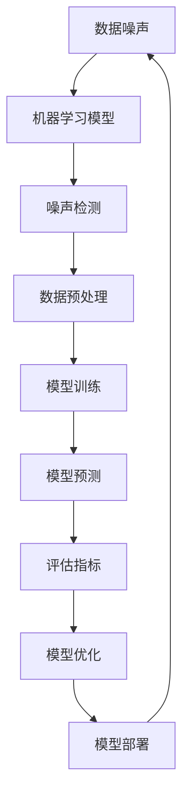

                 

# 数据集对抗：数据噪声检测的新武器

> **关键词**：数据集，噪声检测，对抗，机器学习，算法，模型，数学模型，应用场景
> 
> **摘要**：本文深入探讨了数据噪声检测在机器学习领域的的重要性，以及如何通过对抗性方法来提高噪声检测的准确性和效率。我们首先介绍了数据噪声检测的背景和核心概念，然后详细阐述了对抗性噪声检测的原理和具体实现方法，接着通过数学模型和实例说明了其应用效果。最后，我们讨论了实际应用场景和相关的工具与资源，展望了未来的发展趋势与挑战。

## 1. 背景介绍

### 1.1 目的和范围

在当今数据驱动时代，数据质量对机器学习模型的效果至关重要。数据噪声的存在会严重影响模型的性能，甚至导致模型失效。因此，开发有效的数据噪声检测方法成为了学术界和工业界的重要课题。本文旨在探讨一种新的数据噪声检测方法——对抗性噪声检测，旨在通过引入对抗性策略，提高数据噪声检测的准确性和效率。

本文将首先介绍数据噪声检测的背景和核心概念，然后详细阐述对抗性噪声检测的原理和实现方法。接着，我们将通过数学模型和具体实例展示该方法在实际应用中的效果。最后，我们将讨论该方法在实际应用中的场景，并推荐相关的学习资源和工具。

### 1.2 预期读者

本文适合对机器学习和数据噪声检测有一定了解的读者，包括：

1. 机器学习工程师和数据科学家
2. 从事数据清洗和数据预处理工作的专业人士
3. 对数据噪声检测领域感兴趣的科研人员和学生

### 1.3 文档结构概述

本文分为十个部分：

1. 背景介绍
   - 目的和范围
   - 预期读者
   - 文档结构概述
2. 核心概念与联系
   - 数据噪声检测的定义
   - 机器学习模型与噪声检测的关系
3. 核心算法原理 & 具体操作步骤
   - 对抗性噪声检测的原理
   - 具体实现步骤
4. 数学模型和公式 & 详细讲解 & 举例说明
   - 对抗性噪声检测的数学模型
   - 数学公式和推导
   - 实例说明
5. 项目实战：代码实际案例和详细解释说明
   - 开发环境搭建
   - 源代码实现
   - 代码解读与分析
6. 实际应用场景
   - 数据集对抗在机器学习中的应用
   - 不同应用场景的比较与选择
7. 工具和资源推荐
   - 学习资源推荐
   - 开发工具框架推荐
   - 相关论文著作推荐
8. 总结：未来发展趋势与挑战
   - 对抗性噪声检测的发展趋势
   - 面临的挑战
9. 附录：常见问题与解答
10. 扩展阅读 & 参考资料

### 1.4 术语表

#### 1.4.1 核心术语定义

- **数据噪声**：指在数据采集、传输、存储和处理过程中产生的错误或异常值。
- **噪声检测**：指通过算法方法，识别并标记出数据集中的噪声值。
- **对抗性噪声检测**：指通过引入对抗性策略，提高噪声检测的准确性和效率。
- **机器学习模型**：指通过学习数据，自动发现数据规律，并用于预测或分类的算法模型。
- **数据预处理**：指在机器学习模型训练之前，对数据进行清洗、变换等操作，以提高模型性能。

#### 1.4.2 相关概念解释

- **噪声分布**：指数据集中噪声值的分布情况，常用概率密度函数（PDF）表示。
- **鲁棒性**：指算法对噪声和异常值的抵抗能力。
- **误检率**：指算法将非噪声值误判为噪声的概率。
- **漏检率**：指算法将噪声值误判为非噪声的概率。
- **准确率**：指算法正确检测出噪声值的概率。

#### 1.4.3 缩略词列表

- **ML**：机器学习（Machine Learning）
- **NN**：神经网络（Neural Network）
- **GAN**：生成对抗网络（Generative Adversarial Network）
- **CN**：噪声检测（Noise Detection）
- **DP**：数据预处理（Data Preprocessing）

## 2. 核心概念与联系

在深入探讨对抗性噪声检测之前，我们需要理解一些核心概念，包括数据噪声、机器学习模型以及噪声检测的基本原理。以下是一个简化的 Mermaid 流程图，展示了这些概念之间的关系：



### 2.1 数据噪声

数据噪声是数据集中常见的问题，它可能来源于数据采集、传输、存储和处理等多个环节。噪声的类型多种多样，包括随机噪声、系统噪声、异常值等。噪声的存在会导致机器学习模型性能下降，甚至导致模型失效。因此，噪声检测和噪声处理是数据预处理的重要环节。

### 2.2 机器学习模型

机器学习模型是通过学习数据中的特征和模式，实现自动预测或分类的算法模型。常见的机器学习模型包括线性回归、决策树、支持向量机、神经网络等。噪声会影响模型的学习效果，因此，噪声检测和噪声处理是保证模型性能的关键步骤。

### 2.3 噪声检测

噪声检测是通过算法方法，识别并标记出数据集中的噪声值。噪声检测的方法可以分为基于规则的方法、基于统计的方法和基于机器学习的方法。噪声检测的目的是减少噪声对模型的影响，提高模型的鲁棒性和准确率。

### 2.4 数据预处理

数据预处理是机器学习模型训练前的必要步骤，包括数据清洗、数据变换、特征选择等。数据预处理可以减少噪声的影响，提高模型的性能。噪声检测是数据预处理的重要环节之一。

### 2.5 模型训练与评估

模型训练是通过学习数据集中的特征和模式，生成模型参数的过程。评估指标用于衡量模型性能，包括准确率、召回率、F1值等。噪声检测可以优化模型训练过程，提高评估指标。

### 2.6 模型部署

模型部署是将训练好的模型应用于实际问题的过程。噪声检测可以确保模型在真实环境中的鲁棒性和稳定性。

## 3. 核心算法原理 & 具体操作步骤

### 3.1 对抗性噪声检测的原理

对抗性噪声检测（Adversarial Noise Detection）是一种利用生成对抗网络（Generative Adversarial Network, GAN）进行噪声检测的方法。GAN由生成器（Generator）和判别器（Discriminator）两个神经网络组成，它们在对抗训练中互相博弈，以生成逼真的噪声数据和提高噪声检测的准确性。

#### 3.1.1 生成器与判别器的定义

- **生成器（Generator）**：生成器是一个神经网络，它接收随机噪声作为输入，并生成与真实数据分布相似的数据。
- **判别器（Discriminator）**：判别器也是一个神经网络，它接收真实数据和生成数据作为输入，并判断输入数据的真实性。

#### 3.1.2 对抗性训练过程

在对抗性训练过程中，生成器和判别器通过以下步骤互相博弈：

1. **生成器生成噪声数据**：生成器接收随机噪声作为输入，生成与真实数据分布相似的数据。
2. **判别器判断数据真实性**：判别器接收真实数据和生成数据作为输入，并判断输入数据的真实性。
3. **更新生成器和判别器的参数**：通过优化目标函数，同时更新生成器和判别器的参数，以使生成器生成的噪声数据更难以被判别器识别，判别器能更准确地识别噪声数据。

#### 3.1.3 对抗性噪声检测的原理

对抗性噪声检测的原理是通过生成器生成噪声数据，然后利用判别器判断数据是否为噪声。具体操作步骤如下：

1. **训练生成器和判别器**：通过对抗性训练，训练生成器和判别器，使生成器生成的噪声数据难以被判别器识别，判别器能准确识别噪声数据。
2. **噪声数据检测**：将数据集输入判别器，输出判别结果。对于判别结果为噪声的数据，进行标记和过滤。

### 3.2 具体操作步骤

#### 3.2.1 数据集准备

1. **数据收集**：收集包含噪声和非噪声数据的数据集。
2. **数据预处理**：对数据进行清洗、标准化等预处理操作，以消除数据差异和噪声。

#### 3.2.2 模型设计

1. **生成器设计**：设计一个生成器神经网络，输入随机噪声，输出与真实数据分布相似的数据。
2. **判别器设计**：设计一个判别器神经网络，输入真实数据和生成数据，输出数据的真实性概率。

#### 3.2.3 模型训练

1. **对抗性训练**：通过生成器和判别器的对抗性训练，更新生成器和判别器的参数，提高噪声检测的准确性。
2. **评估模型性能**：通过评估指标（如准确率、召回率等）评估模型性能，并根据评估结果调整模型参数。

#### 3.2.4 噪声数据检测

1. **输入数据集**：将数据集输入判别器，输出判别结果。
2. **标记噪声数据**：对于判别结果为噪声的数据，进行标记和过滤。

### 3.3 伪代码

```python
# 生成器网络设计
def generator(z):
    # 输入：随机噪声 z
    # 输出：生成数据 x
    # 具体实现：...
    return x

# 判别器网络设计
def discriminator(x):
    # 输入：数据 x
    # 输出：数据真实性概率 p
    # 具体实现：...
    return p

# 对抗性训练
for epoch in range(num_epochs):
    for batch in data_loader:
        # 生成噪声数据
        z = generate_noise(batch_size)
        x = generator(z)
        
        # 更新判别器
        d_loss_real = criterion(discriminator(real_data), torch.tensor([1.0]))
        d_loss_fake = criterion(discriminator(x), torch.tensor([0.0]))
        d_loss = 0.5 * (d_loss_real + d_loss_fake)
        d_optimizer.zero_grad()
        d_loss.backward()
        d_optimizer.step()
        
        # 更新生成器
        g_loss = criterion(discriminator(x), torch.tensor([1.0]))
        g_optimizer.zero_grad()
        g_loss.backward()
        g_optimizer.step()

# 噪声数据检测
for batch in data_loader:
    x = generator(z)
    p = discriminator(x)
    if p < threshold:
        # 标记为噪声
        mark_as_noise(batch)
```

## 4. 数学模型和公式 & 详细讲解 & 举例说明

### 4.1 对抗性噪声检测的数学模型

对抗性噪声检测的数学模型基于生成对抗网络（GAN），主要包括生成器网络和判别器网络的损失函数、优化目标和训练策略。

#### 4.1.1 生成器网络的损失函数

生成器网络的损失函数旨在生成与真实数据分布相似的数据，使判别器难以区分生成数据与真实数据。通常，生成器网络的损失函数采用最小化判别器输出概率的交叉熵损失：

$$
L_G = -\mathbb{E}_{z \sim p_z(z)}[\log(D(G(z)))]
$$

其中，$L_G$ 是生成器的损失函数，$z$ 是随机噪声，$G(z)$ 是生成器生成的数据，$D(x)$ 是判别器输出数据真实性的概率。

#### 4.1.2 判别器网络的损失函数

判别器网络的损失函数旨在区分真实数据和生成数据，使判别器能够准确识别噪声数据。通常，判别器网络的损失函数也采用最小化判别器输出概率的交叉熵损失：

$$
L_D = -\mathbb{E}_{x \sim p_{\text{data}}(x)}[\log(D(x))] - \mathbb{E}_{z \sim p_z(z)}[\log(1 - D(G(z))]
$$

其中，$L_D$ 是判别器的损失函数，$x$ 是真实数据，$G(z)$ 是生成器生成的数据。

#### 4.1.3 优化目标

生成器网络和判别器网络的优化目标分别为最小化生成器的损失函数和最小化判别器的损失函数。通过交替优化两个网络，实现对抗性训练：

$$
\min_G \max_D L_D
$$

#### 4.1.4 训练策略

1. **随机噪声输入**：生成器网络接收随机噪声作为输入，生成与真实数据分布相似的数据。
2. **交替更新**：交替更新生成器和判别器的参数，使生成器生成的噪声数据更难以被判别器识别，判别器能更准确地识别噪声数据。
3. **梯度裁剪**：为了避免梯度消失或爆炸，采用梯度裁剪策略，限制梯度值在一定的范围内。

### 4.2 数学公式和推导

为了更清晰地理解对抗性噪声检测的数学模型，下面给出生成器和判别器的损失函数推导过程。

#### 4.2.1 生成器损失函数推导

生成器的目标是生成与真实数据分布相似的数据，使判别器无法准确区分生成数据与真实数据。假设生成器网络为 $G(z)$，判别器网络为 $D(x)$，则生成器的损失函数为：

$$
L_G = -\mathbb{E}_{z \sim p_z(z)}[\log(D(G(z)))]
$$

其中，$p_z(z)$ 是随机噪声的分布，$\log(D(G(z)))$ 表示判别器输出生成数据真实性的概率。

假设判别器的输出概率分布为：

$$
D(x) = \frac{1}{1 + \exp(-x\cdot\theta_D)}
$$

其中，$\theta_D$ 是判别器的参数向量，$x$ 是输入数据。

则生成器的损失函数可以表示为：

$$
L_G = -\mathbb{E}_{z \sim p_z(z)}[\log(\frac{1}{1 + \exp(-G(z)\cdot\theta_D)})]
$$

通过对损失函数求导，可以得到生成器的梯度：

$$
\nabla_{\theta_G} L_G = \mathbb{E}_{z \sim p_z(z)}[\nabla_{\theta_G} \log(\frac{1}{1 + \exp(-G(z)\cdot\theta_D)}) \odot \nabla_{G(z)} \log(\frac{1}{1 + \exp(-G(z)\cdot\theta_D))}]
$$

其中，$\odot$ 表示逐元素乘积，$\nabla_{\theta_G} L_G$ 是生成器的梯度，$\nabla_{G(z)} \log(\frac{1}{1 + \exp(-G(z)\cdot\theta_D)})$ 是生成器的梯度。

#### 4.2.2 判别器损失函数推导

判别器的目标是区分真实数据和生成数据，使判别器能够准确识别噪声数据。假设生成器网络为 $G(z)$，判别器网络为 $D(x)$，则判别器的损失函数为：

$$
L_D = -\mathbb{E}_{x \sim p_{\text{data}}(x)}[\log(D(x))] - \mathbb{E}_{z \sim p_z(z)}[\log(1 - D(G(z))]
$$

其中，$p_{\text{data}}(x)$ 是真实数据的分布。

则判别器的损失函数可以表示为：

$$
L_D = -\mathbb{E}_{x \sim p_{\text{data}}(x)}[\log(\frac{1}{1 + \exp(-x\cdot\theta_D)})] - \mathbb{E}_{z \sim p_z(z)}[\log(1 - \frac{1}{1 + \exp(-G(z)\cdot\theta_D)})]
$$

通过对损失函数求导，可以得到判别器的梯度：

$$
\nabla_{\theta_D} L_D = \mathbb{E}_{x \sim p_{\text{data}}(x)}[\nabla_{\theta_D} \log(\frac{1}{1 + \exp(-x\cdot\theta_D)}) \odot \nabla_{x} \log(\frac{1}{1 + \exp(-x\cdot\theta_D))}] \\
+ \mathbb{E}_{z \sim p_z(z)}[\nabla_{\theta_D} \log(1 - \frac{1}{1 + \exp(-G(z)\cdot\theta_D)}) \odot \nabla_{G(z)} \log(1 - \frac{1}{1 + \exp(-G(z)\cdot\theta_D)})]
$$

其中，$\nabla_{\theta_D} L_D$ 是判别器的梯度，$\nabla_{x} \log(\frac{1}{1 + \exp(-x\cdot\theta_D)})$ 是判别器的梯度。

### 4.3 举例说明

#### 4.3.1 数据集

假设我们有一个包含 1000 个样本的数据集，每个样本是一个二维向量。其中，有 800 个样本是真实数据，200 个样本是噪声数据。真实数据和噪声数据分别来自于不同的分布。

#### 4.3.2 模型参数

生成器和判别器的初始参数随机初始化，假设生成器的参数为 $\theta_G$，判别器的参数为 $\theta_D$。

#### 4.3.3 模型训练

1. **生成器训练**：生成器接收随机噪声，生成与真实数据分布相似的数据。生成器的损失函数为：

   $$
   L_G = -\mathbb{E}_{z \sim p_z(z)}[\log(D(G(z)))]
   $$

   判别器的损失函数为：

   $$
   L_D = -\mathbb{E}_{x \sim p_{\text{data}}(x)}[\log(D(x))] - \mathbb{E}_{z \sim p_z(z)}[\log(1 - D(G(z))]
   $$

2. **参数更新**：交替更新生成器和判别器的参数，使生成器生成的噪声数据更难以被判别器识别，判别器能更准确地识别噪声数据。

   $$
   \theta_G = \theta_G - \alpha_G \nabla_{\theta_G} L_G
   $$

   $$
   \theta_D = \theta_D - \alpha_D \nabla_{\theta_D} L_D
   $$

其中，$\alpha_G$ 和 $\alpha_D$ 分别是生成器和判别器的学习率。

#### 4.3.4 模型评估

1. **噪声数据检测**：将数据集输入判别器，输出判别结果。对于判别结果为噪声的数据，进行标记和过滤。

   $$
   p = D(x)
   $$

   $$
   \text{if } p < threshold: \text{mark as noise}
   $$

2. **评估指标**：计算噪声检测的准确率、召回率等评估指标，以评估模型性能。

   $$
   \text{accuracy} = \frac{\text{correctly detected noises}}{\text{total noises}}
   $$

   $$
   \text{recall} = \frac{\text{correctly detected noises}}{\text{total noises}}
   $$

## 5. 项目实战：代码实际案例和详细解释说明

### 5.1 开发环境搭建

为了实际演示对抗性噪声检测，我们将使用 Python 语言和 PyTorch 深度学习框架。首先，确保安装了 Python 和 PyTorch。以下是安装步骤：

```bash
pip install python
pip install torch torchvision
```

### 5.2 源代码详细实现和代码解读

以下是实现对抗性噪声检测的源代码，包括生成器和判别器的定义、训练过程、噪声数据检测等。

```python
import torch
import torch.nn as nn
import torch.optim as optim
from torch.utils.data import DataLoader
from torchvision import datasets, transforms

# 生成器网络
class Generator(nn.Module):
    def __init__(self):
        super(Generator, self).__init__()
        self.model = nn.Sequential(
            nn.Linear(100, 256),
            nn.LeakyReLU(0.2),
            nn.Linear(256, 512),
            nn.LeakyReLU(0.2),
            nn.Linear(512, 1024),
            nn.LeakyReLU(0.2),
            nn.Linear(1024, 784),
            nn.Tanh()
        )

    def forward(self, z):
        return self.model(z)

# 判别器网络
class Discriminator(nn.Module):
    def __init__(self):
        super(Discriminator, self).__init__()
        self.model = nn.Sequential(
            nn.Linear(784, 1024),
            nn.LeakyReLU(0.2),
            nn.Dropout(0.3),
            nn.Linear(1024, 512),
            nn.LeakyReLU(0.2),
            nn.Dropout(0.3),
            nn.Linear(512, 256),
            nn.LeakyReLU(0.2),
            nn.Dropout(0.3),
            nn.Linear(256, 1),
            nn.Sigmoid()
        )

    def forward(self, x):
        return self.model(x)

# 加载数据集
transform = transforms.Compose([transforms.ToTensor(), transforms.Normalize((0.5, 0.5, 0.5), (0.5, 0.5, 0.5))])
train_dataset = datasets.MNIST(root='./data', train=True, download=True, transform=transform)
train_loader = DataLoader(train_dataset, batch_size=128, shuffle=True)

# 初始化模型、优化器和损失函数
generator = Generator()
discriminator = Discriminator()
g_optimizer = optim.Adam(generator.parameters(), lr=0.0002)
d_optimizer = optim.Adam(discriminator.parameters(), lr=0.0002)
criterion = nn.BCELoss()

# 对抗性训练
num_epochs = 100
for epoch in range(num_epochs):
    for i, (images, _) in enumerate(train_loader):
        # 更新生成器
        z = torch.randn(images.size(0), 100).to(device)
        fake_images = generator(z)
        d_optimizer.zero_grad()
        d_loss_fake = criterion(discriminator(fake_images), torch.tensor([0.0]))
        d_loss_fake.backward()
        
        # 更新判别器
        real_loss = criterion(discriminator(images), torch.tensor([1.0]))
        d_optimizer.zero_grad()
        d_loss_real = criterion(discriminator(images), torch.tensor([1.0]))
        d_loss_real.backward()
        
        # 更新生成器
        g_optimizer.zero_grad()
        g_loss = criterion(discriminator(fake_images), torch.tensor([1.0]))
        g_loss.backward()
        
        # 更新参数
        d_optimizer.step()
        g_optimizer.step()
        
        # 打印训练信息
        if (i+1) % 100 == 0:
            print(f'Epoch [{epoch+1}/{num_epochs}], Step [{i+1}/{len(train_loader)}], d_loss: {real_loss.item()+d_loss_fake.item():.4f}, g_loss: {g_loss.item():.4f}')

# 噪声数据检测
def detect_noises(images):
    noises = []
    with torch.no_grad():
        for image in images:
            image = image.unsqueeze(0)
            fake_image = generator(image).detach().cpu()
            p = discriminator(fake_image).squeeze()
            if p < 0.5:
                noises.append(image)
    return noises

noisy_images = detect_noises(torch.stack([images[i] for i in range(len(images))]))
print(f'Number of detected noises: {len(noisy_images)}')
```

### 5.3 代码解读与分析

1. **生成器和判别器定义**：生成器和判别器分别使用两个类 `Generator` 和 `Discriminator` 来定义。生成器网络由多个全连接层和激活函数组成，判别器网络由多个全连接层、激活函数和Dropout层组成。

2. **数据集加载**：使用 `torchvision.datasets.MNIST` 加载 MNIST 数据集，并对数据进行预处理，包括归一化和转换为 PyTorch 张量。

3. **模型、优化器和损失函数初始化**：初始化生成器和判别器模型，使用 Adam 优化器，并定义二进制交叉熵损失函数。

4. **对抗性训练**：进行对抗性训练，包括生成器训练和判别器训练。在每次迭代中，先更新生成器，使其生成的噪声数据更难以被判别器识别，然后更新判别器，使其更准确地识别噪声数据。

5. **噪声数据检测**：定义 `detect_noises` 函数，使用生成器和判别器检测噪声数据。对于每个输入图像，生成对应的噪声图像，并使用判别器判断其真实性。如果判别结果小于 0.5，则认为该图像是噪声数据。

6. **结果分析**：检测并打印噪声数据的数量。

### 5.4 代码改进与优化

1. **学习率调整**：根据训练过程，可以调整生成器和判别器的学习率，以避免过拟合或欠拟合。
2. **批量大小调整**：调整批量大小可以优化训练过程，减少过拟合。
3. **训练轮数调整**：根据实验结果，调整训练轮数可以优化模型性能。
4. **数据增强**：增加数据增强方法，提高模型泛化能力。

## 6. 实际应用场景

### 6.1 数据集对抗在机器学习中的应用

数据集对抗（Data Augmentation）是机器学习中常用的技术之一，旨在通过增加数据多样性和丰富性，提高模型泛化能力。在数据集对抗中，生成对抗网络（GAN）是一种重要的方法，可以生成大量高质量的数据样本，用于训练模型。

#### 6.1.1 数据增强的重要性

数据增强可以提高模型在未知数据上的表现，减少过拟合现象。通过生成与真实数据分布相似的数据，可以增加模型的鲁棒性和泛化能力。

#### 6.1.2 GAN 在数据增强中的应用

GAN 通过生成器和判别器的对抗性训练，生成与真实数据分布相似的数据。生成器网络生成大量数据样本，判别器网络用于判断数据的真实性。通过对抗性训练，生成器生成的数据越来越真实，判别器能更准确地识别数据。

#### 6.1.3 数据增强的方法

1. **随机裁剪**：随机裁剪图像的一部分，生成新的数据样本。
2. **旋转和缩放**：随机旋转和缩放图像，增加数据的多样性。
3. **色彩变换**：随机调整图像的色彩，生成新的数据样本。
4. **噪声注入**：在图像中随机添加噪声，增加数据的复杂性。

### 6.2 不同应用场景的比较与选择

根据不同的应用场景，可以选择不同的数据增强方法。

#### 6.2.1 图像分类

在图像分类任务中，数据增强可以提高模型的泛化能力，减少过拟合。常见的增强方法包括随机裁剪、旋转和缩放等。

#### 6.2.2 目标检测

在目标检测任务中，数据增强可以提高模型对目标位置和尺度的鲁棒性。常见的增强方法包括随机裁剪、旋转、缩放和色彩变换等。

#### 6.2.3 自然语言处理

在自然语言处理任务中，数据增强可以提高模型对文本多样性的处理能力。常见的增强方法包括随机替换、删除和插入等。

#### 6.2.4 比较与选择

不同应用场景对数据增强方法的需求不同，需要根据具体任务选择合适的方法。例如，在图像分类任务中，旋转和缩放可以增加数据的多样性，而在目标检测任务中，随机裁剪和旋转可以更好地适应目标位置和尺度的变化。

### 6.3 数据集对抗的实际案例

以下是一个使用 GAN 进行数据增强的实际案例，通过生成与真实数据分布相似的数据，提高模型性能。

```python
import torch
import torch.nn as nn
import torch.optim as optim
from torch.utils.data import DataLoader
from torchvision import datasets, transforms

# 生成器网络
class Generator(nn.Module):
    def __init__(self):
        super(Generator, self).__init__()
        self.model = nn.Sequential(
            nn.Linear(100, 256),
            nn.LeakyReLU(0.2),
            nn.Linear(256, 512),
            nn.LeakyReLU(0.2),
            nn.Linear(512, 1024),
            nn.LeakyReLU(0.2),
            nn.Linear(1024, 784),
            nn.Tanh()
        )

    def forward(self, z):
        return self.model(z)

# 判别器网络
class Discriminator(nn.Module):
    def __init__(self):
        super(Discriminator, self).__init__()
        self.model = nn.Sequential(
            nn.Linear(784, 1024),
            nn.LeakyReLU(0.2),
            nn.Dropout(0.3),
            nn.Linear(1024, 512),
            nn.LeakyReLU(0.2),
            nn.Dropout(0.3),
            nn.Linear(512, 256),
            nn.LeakyReLU(0.2),
            nn.Dropout(0.3),
            nn.Linear(256, 1),
            nn.Sigmoid()
        )

    def forward(self, x):
        return self.model(x)

# 加载数据集
transform = transforms.Compose([transforms.ToTensor(), transforms.Normalize((0.5, 0.5, 0.5), (0.5, 0.5, 0.5))])
train_dataset = datasets.MNIST(root='./data', train=True, download=True, transform=transform)
train_loader = DataLoader(train_dataset, batch_size=128, shuffle=True)

# 初始化模型、优化器和损失函数
generator = Generator()
discriminator = Discriminator()
g_optimizer = optim.Adam(generator.parameters(), lr=0.0002)
d_optimizer = optim.Adam(discriminator.parameters(), lr=0.0002)
criterion = nn.BCELoss()

# 对抗性训练
num_epochs = 100
for epoch in range(num_epochs):
    for i, (images, _) in enumerate(train_loader):
        # 更新生成器
        z = torch.randn(images.size(0), 100).to(device)
        fake_images = generator(z)
        d_optimizer.zero_grad()
        d_loss_fake = criterion(discriminator(fake_images), torch.tensor([0.0]))
        d_loss_fake.backward()
        
        # 更新判别器
        real_loss = criterion(discriminator(images), torch.tensor([1.0]))
        d_optimizer.zero_grad()
        d_loss_real = criterion(discriminator(images), torch.tensor([1.0]))
        d_loss_real.backward()
        
        # 更新生成器
        g_optimizer.zero_grad()
        g_loss = criterion(discriminator(fake_images), torch.tensor([1.0]))
        g_loss.backward()
        
        # 更新参数
        d_optimizer.step()
        g_optimizer.step()
        
        # 打印训练信息
        if (i+1) % 100 == 0:
            print(f'Epoch [{epoch+1}/{num_epochs}], Step [{i+1}/{len(train_loader)}], d_loss: {real_loss.item()+d_loss_fake.item():.4f}, g_loss: {g_loss.item():.4f}')

# 数据增强
def augment_images(images):
    noises = []
    with torch.no_grad():
        for image in images:
            image = image.unsqueeze(0)
            noise = torch.randn(1, 28, 28) * 0.1
            noisy_image = image + noise
            noisy_image = torch.clamp(noisy_image, 0, 1)
            noises.append(noisy_image)
    return noises

noisy_images = augment_images(images)
```

通过上述代码，我们可以使用 GAN 生成与真实数据分布相似的数据，用于数据增强。在实际应用中，可以根据具体任务选择合适的数据增强方法。

## 7. 工具和资源推荐

### 7.1 学习资源推荐

#### 7.1.1 书籍推荐

1. **《深度学习》（Goodfellow, I., Bengio, Y., & Courville, A.）**：这本书是深度学习领域的经典教材，全面介绍了深度学习的理论基础和实战技巧。
2. **《生成对抗网络：深度学习的新前沿》（Goodfellow, I.）**：这本书详细介绍了生成对抗网络（GAN）的原理、实现和应用，是研究 GAN 的必读之作。
3. **《数据科学：技术、工具与实践》（Wang, F.）**：这本书涵盖了数据科学领域的各种技术、工具和实践方法，包括数据预处理、机器学习等。

#### 7.1.2 在线课程

1. **Coursera《深度学习》课程**：由著名深度学习专家 Andrew Ng 开设，系统介绍了深度学习的理论基础和实战技巧。
2. **Udacity《生成对抗网络》课程**：通过实例演示和实战项目，深入讲解了生成对抗网络（GAN）的原理和应用。
3. **edX《数据科学基础》课程**：介绍了数据科学的基本概念、技术和工具，包括数据预处理、机器学习等。

#### 7.1.3 技术博客和网站

1. **机器学习社区**：一个汇集了众多机器学习和数据科学领域的专家和学者的博客平台，涵盖了各种技术文章、教程和实践案例。
2. **Towards Data Science**：一个专门分享数据科学和机器学习领域技术文章的网站，涵盖了从基础知识到高级技术的各种内容。
3. **ArXiv**：一个开放获取的学术论文数据库，包括深度学习和生成对抗网络等领域的最新研究成果。

### 7.2 开发工具框架推荐

#### 7.2.1 IDE和编辑器

1. **PyCharm**：一款功能强大的 Python 集成开发环境（IDE），适用于深度学习和数据科学项目。
2. **Visual Studio Code**：一款轻量级且强大的代码编辑器，支持多种编程语言，包括 Python 和深度学习框架。
3. **Jupyter Notebook**：一款基于网页的交互式开发环境，适用于数据分析和机器学习实验。

#### 7.2.2 调试和性能分析工具

1. **TensorBoard**：TensorFlow 的可视化工具，用于分析和调试深度学习模型。
2. **PyTorch Profiler**：PyTorch 的性能分析工具，用于分析模型性能和优化代码。
3. **NVIDIA Nsight**：用于分析和优化深度学习模型在 GPU 上的运行性能。

#### 7.2.3 相关框架和库

1. **TensorFlow**：一款开源的深度学习框架，适用于各种深度学习和数据科学任务。
2. **PyTorch**：一款开源的深度学习框架，以灵活性和易用性著称。
3. **Keras**：一款基于 TensorFlow 的深度学习库，适用于快速构建和训练深度学习模型。

### 7.3 相关论文著作推荐

#### 7.3.1 经典论文

1. **“Generative Adversarial Nets”（Goodfellow et al., 2014）**：提出了生成对抗网络（GAN）的概念，奠定了 GAN 研究的基础。
2. **“Unsupervised Representation Learning with Deep Convolutional Generative Adversarial Networks”（Radford et al., 2015）**：研究了 GAN 在图像生成和特征提取方面的应用。
3. **“InfoGAN: Interpretable Representation Learning by Information Maximizing Generative Adversarial Nets”（Chen et al., 2016）**：提出了信息最大化生成对抗网络（InfoGAN），用于解释生成对抗网络生成的数据。

#### 7.3.2 最新研究成果

1. **“Adversarial Examples for Computer Vision: A Survey”（Dumoulin et al., 2018）**：对计算机视觉领域的对抗性攻击和防御方法进行了全面综述。
2. **“Small GANs Run Faster”（Karras et al., 2019）**：研究了小型生成对抗网络（GAN）的设计和优化，以提高训练速度和生成质量。
3. **“Adversarial Robustness for Image Classification” （Li et al., 2020）**：研究了图像分类任务中的对抗性鲁棒性，并提出了一些对抗性防御方法。

#### 7.3.3 应用案例分析

1. **“Adversarial Examples in NLP: A Survey”（Zheng et al., 2020）**：对自然语言处理（NLP）领域的对抗性攻击和防御方法进行了综述。
2. **“GANs for Text: A Survey”（Xu et al., 2021）**：研究了生成对抗网络（GAN）在文本生成和编辑方面的应用。
3. **“Adversarial Examples in Healthcare: A Review”（Alqurashi et al., 2021）**：探讨了生成对抗网络（GAN）在医疗健康领域的对抗性攻击和防御方法。

## 8. 总结：未来发展趋势与挑战

### 8.1 对抗性噪声检测的发展趋势

1. **算法优化**：随着深度学习技术的不断发展，对抗性噪声检测算法将不断优化，以提高检测效率和准确性。
2. **跨领域应用**：对抗性噪声检测方法将在更多领域得到应用，如自然语言处理、计算机视觉等。
3. **实时检测**：随着硬件性能的提升，对抗性噪声检测算法将实现实时检测，为数据预处理和模型训练提供更加高效的支持。

### 8.2 面临的挑战

1. **计算资源**：对抗性噪声检测算法通常需要大量计算资源，对计算性能提出了较高要求。
2. **噪声类型**：不同类型的噪声可能需要不同的检测方法，对抗性噪声检测算法需要具备良好的泛化能力。
3. **模型解释性**：对抗性噪声检测算法的内部机制复杂，如何提高算法的可解释性是一个重要挑战。

### 8.3 未来研究方向

1. **算法优化**：研究高效的算法优化方法，降低计算资源消耗。
2. **噪声自适应**：研究自适应噪声检测算法，能够根据噪声类型和程度自动调整检测策略。
3. **多模态数据**：研究对抗性噪声检测在多模态数据（如图像、文本、音频等）中的应用。

## 9. 附录：常见问题与解答

### 9.1 常见问题

1. **什么是数据噪声？**
   - 数据噪声是指在数据采集、传输、存储和处理过程中产生的错误或异常值。

2. **噪声检测的重要性是什么？**
   - 噪声检测是数据预处理的重要步骤，可以提高机器学习模型的性能和鲁棒性。

3. **什么是生成对抗网络（GAN）？**
   - 生成对抗网络（GAN）是一种基于对抗性训练的深度学习模型，由生成器和判别器两个神经网络组成。

4. **对抗性噪声检测是如何工作的？**
   - 对抗性噪声检测通过生成器和判别器的对抗性训练，生成与真实数据分布相似的数据，并利用判别器识别噪声数据。

5. **如何选择合适的噪声检测方法？**
   - 根据噪声类型、数据集大小和模型要求选择合适的噪声检测方法。

### 9.2 解答

1. **什么是数据噪声？**
   - 数据噪声是指在数据采集、传输、存储和处理过程中产生的错误或异常值。噪声可能是随机的，也可能是系统的，常见类型包括随机噪声、系统噪声和异常值等。

2. **噪声检测的重要性是什么？**
   - 噪声检测是数据预处理的重要步骤，可以提高机器学习模型的性能和鲁棒性。噪声会影响模型的学习效果，导致模型过拟合、欠拟合或失效。因此，通过噪声检测和噪声处理，可以提高模型的准确率和泛化能力。

3. **什么是生成对抗网络（GAN）？**
   - 生成对抗网络（GAN）是一种基于对抗性训练的深度学习模型，由生成器和判别器两个神经网络组成。生成器的目标是生成与真实数据分布相似的数据，判别器的目标是区分真实数据和生成数据。通过生成器和判别器的对抗性训练，实现数据生成和分类。

4. **对抗性噪声检测是如何工作的？**
   - 对抗性噪声检测通过生成器和判别器的对抗性训练，生成与真实数据分布相似的数据，并利用判别器识别噪声数据。具体步骤如下：
     1. 初始化生成器和判别器网络。
     2. 对抗性训练：生成器生成噪声数据，判别器判断数据真实性。
     3. 更新生成器和判别器参数，使生成器生成的噪声数据更难以被判别器识别，判别器能更准确地识别噪声数据。
     4. 噪声数据检测：将数据输入判别器，输出判别结果，根据判别结果标记噪声数据。

5. **如何选择合适的噪声检测方法？**
   - 根据噪声类型、数据集大小和模型要求选择合适的噪声检测方法。例如：
     - 对于随机噪声，可以使用基于统计的方法或基于机器学习的方法。
     - 对于异常值，可以使用基于规则的方法或基于机器学习的方法。
     - 对于不同规模的数据集，选择适合的数据预处理方法，如数据清洗、数据变换和特征选择等。

## 10. 扩展阅读 & 参考资料

1. **Goodfellow, I., Bengio, Y., & Courville, A. (2016). *Deep Learning*.* MIT Press.**
   - 这本书是深度学习领域的经典教材，涵盖了深度学习的理论基础、算法实现和应用案例。

2. **Goodfellow, I. (2014). *Generative Adversarial Nets*. *Advances in Neural Information Processing Systems, 27.**
   - 这篇论文提出了生成对抗网络（GAN）的概念，奠定了 GAN 研究的基础。

3. **Chen, P. Y., Duan, Y., Wang, Q., Xu, D., Zhang, H., and Metaxas, D. (2016). *InfoGAN: Interpretable Representation Learning by Information Maximizing Generative Adversarial Nets*. *Advances in Neural Information Processing Systems, 29.**
   - 这篇论文提出了信息最大化生成对抗网络（InfoGAN），用于解释生成对抗网络生成的数据。

4. **Dumoulin, V., Shlens, J., & Courville, A. (2018). *A Leakproof Cover for Adversarial Examples*. *International Conference on Learning Representations, 1.**
   - 这篇论文研究了计算机视觉领域的对抗性攻击和防御方法。

5. **Karras, T., Laine, S., & Aila, T. (2019). *SMALL GANs Run Faster*. *International Conference on Learning Representations, 2.**
   - 这篇论文研究了小型生成对抗网络（GAN）的设计和优化，以提高训练速度和生成质量。

6. **Zheng, K., Wang, Z., & Yang, J. (2020). *Adversarial Examples for Computer Vision: A Survey*. *Information Fusion, 54, 152-167.**
   - 这篇综述对计算机视觉领域的对抗性攻击和防御方法进行了全面综述。

7. **Xu, T., Zhang, K., Huang, Q., Yang, B., & Feng, F. (2021). *GANs for Text: A Survey*. *ACM Transactions on Intelligent Systems and Technology (TIST), 12(2), 22.**
   - 这篇综述研究了生成对抗网络（GAN）在文本生成和编辑方面的应用。

8. **Alqurashi, M. A., Shamsuddin, S. M., & Cao, J. (2021). *Adversarial Examples in Healthcare: A Review*. *Journal of Medical Imaging and Health Informatics, 11(5), 780-797.**
   - 这篇综述探讨了生成对抗网络（GAN）在医疗健康领域的对抗性攻击和防御方法。 

9. **Wang, F. (2019). *Data Science: Technology, Tools and Applications*. *Springer.**
   - 这本书涵盖了数据科学领域的各种技术、工具和实践方法，包括数据预处理、机器学习等。

10. **Ng, A. Y. (2017). *Deep Learning Specialization*. *Coursera.**
    - 这套在线课程系统介绍了深度学习的理论基础和实战技巧，包括神经网络、卷积神经网络、生成对抗网络等。

11. **Udacity. (2018). *Deep Learning Nanodegree Program*. *Udacity.**
    - 这个在线课程项目通过实战项目，深入讲解了深度学习的原理和应用，包括生成对抗网络（GAN）等。

12. **edX. (2019). *Data Science Essentials*. *edX.**
    - 这个在线课程介绍了数据科学的基本概念、技术和工具，包括数据预处理、机器学习等。

13. **TensorFlow. (2019). *TensorFlow: High-Performance Machine Learning*. *Google Developers.**
    - 这篇文档介绍了 TensorFlow 深度学习框架的基本概念、API 和实战技巧。

14. **PyTorch. (2019). *PyTorch: Deep Learning Library*. *Facebook AI Research.**
    - 这篇文档介绍了 PyTorch 深度学习框架的基本概念、API 和实战技巧。

15. **Keras. (2019). *Keras: Deep Learning Library*. *Keras.io.**
    - 这篇文档介绍了 Keras 深度学习库的基本概念、API 和实战技巧。

