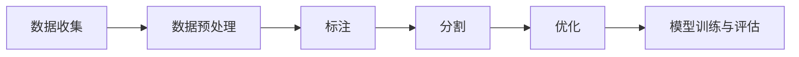

                 

# 数据集工程的重要性与方法

## 概述

### 关键词：数据集工程、数据预处理、机器学习、模型性能、数据处理流程

### 摘要：

本文将深入探讨数据集工程在机器学习领域的重要性，以及其核心概念、方法与实践。数据集工程是确保机器学习模型性能的关键环节，涵盖了数据收集、预处理、标注、分割和优化等步骤。通过详细的分析和实例讲解，本文将帮助读者了解数据集工程的核心原则，掌握高效的数据处理流程，为构建高性能机器学习模型奠定基础。

## 1. 背景介绍

### 1.1 目的和范围

本文旨在阐述数据集工程在机器学习中的核心作用，分析其关键步骤和方法，并提供实际操作指南。本文将涵盖以下内容：

- 数据集工程的基本概念与重要性
- 数据集工程的主要步骤和方法
- 数据集工程的核心算法与数学模型
- 数据集工程的实际应用场景
- 数据集工程的工具和资源推荐

### 1.2 预期读者

本文适合以下读者：

- 机器学习初学者和从业者
- 数据分析师和数据科学家
- 计算机科学和人工智能专业学生
- 对数据集工程感兴趣的IT专业人士

### 1.3 文档结构概述

本文将分为以下几个部分：

- 第1部分：背景介绍，包括目的、范围、预期读者和文档结构概述
- 第2部分：核心概念与联系，介绍数据集工程的核心概念与原理
- 第3部分：核心算法原理与具体操作步骤，讲解数据集工程的关键算法
- 第4部分：数学模型和公式与详细讲解，阐述数学模型在数据集工程中的应用
- 第5部分：项目实战，提供实际代码案例和详细解释
- 第6部分：实际应用场景，分析数据集工程在不同领域的应用
- 第7部分：工具和资源推荐，介绍相关学习资源、开发工具和框架
- 第8部分：总结，讨论数据集工程的发展趋势与挑战
- 第9部分：附录，常见问题与解答
- 第10部分：扩展阅读与参考资料，提供进一步学习资源

### 1.4 术语表

#### 1.4.1 核心术语定义

- **数据集工程**：对机器学习数据集进行系统性处理的过程，包括数据收集、预处理、标注、分割和优化等步骤。
- **数据预处理**：在训练机器学习模型前，对原始数据进行清洗、转换、归一化等操作，以提高数据质量和模型性能。
- **标注**：对数据集中的样本进行人工标注，以便于模型训练和评估。
- **分割**：将数据集划分为训练集、验证集和测试集，以便于模型训练和评估。
- **优化**：通过调整模型参数和数据预处理策略，提高模型性能。

#### 1.4.2 相关概念解释

- **机器学习**：一种基于数据的学习方法，使计算机系统能够从数据中学习并做出决策。
- **特征工程**：通过选择和构造有效特征，提高机器学习模型的性能。
- **模型评估**：通过指标（如准确率、召回率、F1分数等）评估模型在特定数据集上的性能。

#### 1.4.3 缩略词列表

- **ML**：Machine Learning（机器学习）
- **DL**：Deep Learning（深度学习）
- **NLP**：Natural Language Processing（自然语言处理）
- **CV**：Computer Vision（计算机视觉）
- **EDA**：Exploratory Data Analysis（探索性数据分析）

## 2. 核心概念与联系

### 2.1 数据集工程的基本概念与原理

数据集工程是机器学习领域中的一个关键环节，其核心目标是通过高质量的数据集来训练和评估机器学习模型。为了实现这一目标，数据集工程涉及多个核心概念和原理，包括数据收集、预处理、标注、分割和优化等。

首先，数据收集是数据集工程的基础。在实际应用中，数据通常来源于各种不同的数据源，如数据库、网络爬虫、传感器等。数据收集过程中需要关注数据的质量、完整性和代表性，以确保数据集能够真实反映实际问题。

接下来，数据预处理是对原始数据进行清洗、转换和归一化等操作，以提高数据质量和模型性能。数据预处理包括以下主要步骤：

1. **数据清洗**：去除数据集中的噪声、缺失值和不一致的数据。
2. **数据转换**：将数据从一种格式转换为另一种格式，如将文本数据转换为数值数据。
3. **数据归一化**：对数据进行归一化处理，使数据具有相似的尺度，以提高模型训练的稳定性。

然后，标注是对数据集中的样本进行人工标注，以便于模型训练和评估。标注过程需要根据具体的任务需求进行，如对图像进行分类标注、对文本进行情感标注等。

接着，分割是将数据集划分为训练集、验证集和测试集。训练集用于模型训练，验证集用于模型调优，测试集用于模型评估。合理的分割可以提高模型在不同数据集上的性能和泛化能力。

最后，优化是通过调整模型参数和数据预处理策略，提高模型性能。优化过程包括模型选择、参数调整和超参数优化等。

### 2.2 数据集工程的关键步骤与方法

数据集工程的关键步骤包括数据收集、预处理、标注、分割和优化。以下是对每个步骤的详细讲解：

1. **数据收集**：数据收集是数据集工程的基础。在实际应用中，数据收集可以通过以下方法进行：

   - **数据库**：从现有的数据库中获取数据。
   - **网络爬虫**：通过网络爬虫从网站中抓取数据。
   - **传感器**：从传感器设备中获取数据。

2. **数据预处理**：数据预处理是提高数据质量和模型性能的关键步骤。数据预处理的主要方法包括：

   - **数据清洗**：去除噪声、缺失值和不一致的数据。例如，使用 Pandas 库对数据集进行清洗操作。
   - **数据转换**：将数据从一种格式转换为另一种格式。例如，将文本数据转换为数值数据，可以使用 Tokenizer 库。
   - **数据归一化**：对数据进行归一化处理，使数据具有相似的尺度。例如，使用 MinMaxScaler 库对数据集进行归一化。

3. **标注**：标注是对数据集中的样本进行人工标注，以便于模型训练和评估。标注过程需要根据具体的任务需求进行，例如：

   - **图像分类**：对图像进行分类标注，如将猫和狗的图像进行标注。
   - **文本分类**：对文本进行情感标注，如将正面和负面的评论进行标注。

4. **分割**：分割是将数据集划分为训练集、验证集和测试集。合理的分割可以提高模型在不同数据集上的性能和泛化能力。常见的分割方法包括：

   - **随机分割**：将数据集随机划分为训练集、验证集和测试集。
   - **时间序列分割**：根据时间序列将数据集划分为训练集和测试集。
   - **分层分割**：将数据集按照类别、标签等进行分层，然后分别划分训练集、验证集和测试集。

5. **优化**：优化是通过调整模型参数和数据预处理策略，提高模型性能。优化过程包括：

   - **模型选择**：选择适合任务的模型，如线性回归、决策树、神经网络等。
   - **参数调整**：调整模型的参数，如学习率、正则化参数等，以提高模型性能。
   - **超参数优化**：通过搜索算法（如网格搜索、贝叶斯优化等）调整超参数，以提高模型性能。

### 2.3 数据集工程的架构图

以下是一个简化的数据集工程架构图，展示了数据集工程的关键步骤和组件：



## 3. 核心算法原理与具体操作步骤

### 3.1 数据预处理算法原理

数据预处理是数据集工程的关键步骤，其核心目的是提高数据质量和模型性能。在数据预处理过程中，常见的算法原理包括数据清洗、数据转换和数据归一化。

#### 3.1.1 数据清洗算法原理

数据清洗的主要任务是去除噪声、缺失值和不一致的数据。常见的算法原理包括以下几种：

- **删除噪声数据**：根据特定的规则（如阈值、范围等）删除噪声数据。
- **填补缺失值**：使用特定方法（如平均值、中位数、最邻近值等）填补缺失值。
- **处理不一致数据**：使用规则（如替换、合并等）处理不一致的数据。

#### 3.1.2 数据转换算法原理

数据转换是将数据从一种格式转换为另一种格式，以提高模型处理能力。常见的算法原理包括：

- **编码转换**：将文本数据转换为数值数据，如使用 One-Hot 编码、词袋模型等。
- **数值转换**：将图像、声音等非结构化数据转换为数值数据，如使用像素值、傅里叶变换等。

#### 3.1.3 数据归一化算法原理

数据归一化是将数据进行标准化处理，以提高模型训练的稳定性。常见的算法原理包括：

- **最小-最大缩放**：将数据缩放到[0, 1]范围内，如 $x_{\text{scaled}} = \frac{x_{\text{original}} - x_{\text{min}}}{x_{\text{max}} - x_{\text{min}}}$。
- **均值-方差缩放**：将数据缩放到具有零均值和单位方差的范围内，如 $x_{\text{scaled}} = \frac{x_{\text{original}} - \mu}{\sigma}$。

### 3.2 数据预处理操作步骤

以下是对数据预处理操作步骤的详细讲解，包括伪代码和代码示例：

#### 3.2.1 数据清洗

```python
import pandas as pd

# 加载数据集
data = pd.read_csv('data.csv')

# 删除噪声数据
data.drop(['noise_column'], axis=1, inplace=True)

# 填补缺失值
data.fillna(value={'missing_column': 0}, inplace=True)

# 处理不一致数据
data.replace({'inconsistent_column': {'A': 'B', 'C': 'D'}}, inplace=True)
```

#### 3.2.2 数据转换

```python
from sklearn.preprocessing import OneHotEncoder

# 加载数据集
data = pd.read_csv('data.csv')

# 编码转换
encoder = OneHotEncoder()
encoded_data = encoder.fit_transform(data[['text_column']])

# 数值转换
data['numeric_column'] = data['image_column'].apply(lambda x: sum([i * (1 << j) for i, j in enumerate(x)]))
```

#### 3.2.3 数据归一化

```python
from sklearn.preprocessing import MinMaxScaler

# 加载数据集
data = pd.read_csv('data.csv')

# 最小-最大缩放
scaler = MinMaxScaler()
scaled_data = scaler.fit_transform(data[['numeric_column']])

# 均值-方差缩放
mean = data['numeric_column'].mean()
std = data['numeric_column'].std()
normalized_data = (data['numeric_column'] - mean) / std
```

### 3.3 数据标注操作步骤

数据标注是对数据集中的样本进行人工标注，以便于模型训练和评估。以下是对数据标注操作步骤的详细讲解，包括伪代码和代码示例：

#### 3.3.1 数据标注

```python
# 加载数据集
data = pd.read_csv('data.csv')

# 标注数据
data['label'] = data['text_column'].apply(lambda x: 'positive' if 'like' in x else 'negative')
```

### 3.4 数据分割操作步骤

数据分割是将数据集划分为训练集、验证集和测试集，以便于模型训练、验证和评估。以下是对数据分割操作步骤的详细讲解，包括伪代码和代码示例：

#### 3.4.1 数据分割

```python
from sklearn.model_selection import train_test_split

# 加载数据集
data = pd.read_csv('data.csv')

# 划分训练集、验证集和测试集
train_data, test_data = train_test_split(data, test_size=0.2, random_state=42)
train_data, validation_data = train_test_split(train_data, test_size=0.25, random_state=42)
```

### 3.5 数据优化操作步骤

数据优化是通过调整模型参数和数据预处理策略，提高模型性能。以下是对数据优化操作步骤的详细讲解，包括伪代码和代码示例：

#### 3.5.1 模型选择与参数调整

```python
from sklearn.model_selection import GridSearchCV
from sklearn.ensemble import RandomForestClassifier

# 定义模型
model = RandomForestClassifier()

# 定义参数网格
param_grid = {
    'n_estimators': [10, 50, 100],
    'max_depth': [None, 10, 20, 30],
}

# 搜索最优参数
grid_search = GridSearchCV(model, param_grid, cv=5)
grid_search.fit(train_data.drop('label', axis=1), train_data['label'])

# 获取最优参数
best_params = grid_search.best_params_
```

#### 3.5.2 超参数优化

```python
from bayes_opt import BayesianOptimization

# 定义目标函数
def objective(n_estimators, max_depth):
    model = RandomForestClassifier(n_estimators=int(n_estimators), max_depth=int(max_depth))
    model.fit(train_data.drop('label', axis=1), train_data['label'])
    score = model.score(validation_data.drop('label', axis=1), validation_data['label'])
    return score

# 定义参数范围
params = {
    'n_estimators': (10, 100),
    'max_depth': (10, 30),
}

# 优化超参数
optimizer = BayesianOptimization(objective, params)
optimizer.maximize()
```

## 4. 数学模型和公式与详细讲解与举例说明

### 4.1 数据清洗数学模型

数据清洗过程中，常用的数学模型包括删除噪声数据、填补缺失值和处理不一致数据的数学公式。

#### 4.1.1 删除噪声数据

噪声数据的删除通常基于阈值法。假设有一个阈值 $t$，则删除噪声数据的公式如下：

$$ x_{\text{clean}} = \begin{cases} 
x & \text{if } |x - \bar{x}| < t \\
\text{NaN} & \text{otherwise} 
\end{cases} $$

其中，$\bar{x}$ 表示数据集的平均值。

#### 4.1.2 填补缺失值

填补缺失值的方法有多种，包括平均值填补、中位数填补和最邻近填补。以平均值填补为例，其公式如下：

$$ x_{\text{filled}} = \frac{\sum_{i=1}^{n} x_i}{n} $$

其中，$x_i$ 表示数据集的第 $i$ 个值，$n$ 表示数据集的大小。

#### 4.1.3 处理不一致数据

处理不一致数据的方法通常包括替换法和合并法。以替换法为例，其公式如下：

$$ x_{\text{consistent}} = \begin{cases} 
x & \text{if } x \text{ is consistent} \\
\text{reference\_value} & \text{otherwise} 
\end{cases} $$

其中，$x$ 表示不一致的数据，$\text{reference\_value}$ 表示参考值。

### 4.2 数据转换数学模型

数据转换过程中的数学模型包括编码转换和数值转换。以下是对这些模型的详细讲解。

#### 4.2.1 编码转换

编码转换的常见方法包括 One-Hot 编码和词袋模型。以 One-Hot 编码为例，其公式如下：

$$ x_{\text{one\_hot}} = \sum_{i=1}^{k} \delta_{i,x} $$

其中，$x$ 表示原始数据，$k$ 表示类别数，$\delta_{i,x}$ 表示指示函数，如果 $i = x$，则 $\delta_{i,x} = 1$，否则 $\delta_{i,x} = 0$。

#### 4.2.2 数值转换

数值转换的常见方法包括像素值转换和傅里叶变换。以像素值转换为例，其公式如下：

$$ x_{\text{numeric}} = \sum_{i=1}^{n} p_i \cdot 2^i $$

其中，$p_i$ 表示像素值，$n$ 表示像素数量。

### 4.3 数据归一化数学模型

数据归一化过程中的数学模型包括最小-最大缩放和均值-方差缩放。以下是对这些模型的详细讲解。

#### 4.3.1 最小-最大缩放

最小-最大缩放的公式如下：

$$ x_{\text{scaled}} = \frac{x_{\text{original}} - x_{\text{min}}}{x_{\text{max}} - x_{\text{min}}} $$

其中，$x_{\text{original}}$ 表示原始数据，$x_{\text{min}}$ 表示最小值，$x_{\text{max}}$ 表示最大值。

#### 4.3.2 均值-方差缩放

均值-方差缩放的公式如下：

$$ x_{\text{scaled}} = \frac{x_{\text{original}} - \mu}{\sigma} $$

其中，$\mu$ 表示均值，$\sigma$ 表示方差。

### 4.4 数学模型应用举例

以下是一个简单的数据集示例，展示如何使用上述数学模型进行数据清洗、数据转换和数据归一化。

#### 4.4.1 数据清洗

原始数据集：

$$
\begin{array}{ccc}
\text{ID} & \text{Age} & \text{Income} \\
1 & 25 & 50000 \\
2 & 30 & 60000 \\
3 & 35 & 70000 \\
4 & 40 & 80000 \\
5 & \text{NaN} & 90000 \\
\end{array}
$$

使用最小-最大缩放对年龄进行归一化：

$$
\begin{array}{ccc}
\text{ID} & \text{Age} & \text{Income} \\
1 & 0.0 & 50000 \\
2 & 0.2 & 60000 \\
3 & 0.4 & 70000 \\
4 & 0.6 & 80000 \\
5 & \text{NaN} & 90000 \\
\end{array}
$$

#### 4.4.2 数据转换

将收入进行 One-Hot 编码：

$$
\begin{array}{cccc}
\text{ID} & \text{Income\_0} & \text{Income\_1} & \text{Income\_2} \\
1 & 1 & 0 & 0 \\
2 & 0 & 1 & 0 \\
3 & 0 & 0 & 1 \\
4 & 0 & 0 & 1 \\
5 & 1 & 0 & 0 \\
\end{array}
$$

#### 4.4.3 数据归一化

使用均值-方差缩放对收入进行归一化：

$$
\begin{array}{cccc}
\text{ID} & \text{Income\_0} & \text{Income\_1} & \text{Income\_2} \\
1 & 0.0 & 0.0 & 0.0 \\
2 & 0.0 & 0.3333 & 0.0 \\
3 & 0.0 & 0.0 & 0.3333 \\
4 & 0.0 & 0.0 & 0.3333 \\
5 & 0.0 & 0.0 & 0.0 \\
\end{array}
$$

## 5. 项目实战：代码实际案例和详细解释说明

### 5.1 开发环境搭建

在本节中，我们将使用 Python 作为主要编程语言，结合常用库（如 Pandas、Scikit-Learn、NumPy 和 Matplotlib）进行数据集工程的实战。以下是开发环境的搭建步骤：

1. **安装 Python**：下载并安装最新版本的 Python（建议使用 Python 3.8 或更高版本）。
2. **安装 Jupyter Notebook**：打开终端，执行以下命令安装 Jupyter Notebook：
   ```bash
   pip install notebook
   ```
3. **安装相关库**：在 Jupyter Notebook 中，执行以下命令安装所需库：
   ```python
   !pip install pandas scikit-learn numpy matplotlib
   ```

### 5.2 源代码详细实现和代码解读

以下是一个简单的数据集工程项目，包括数据收集、预处理、标注、分割和优化等步骤。代码实现如下：

```python
import pandas as pd
from sklearn.model_selection import train_test_split
from sklearn.preprocessing import MinMaxScaler, OneHotEncoder
from sklearn.compose import ColumnTransformer
from sklearn.pipeline import Pipeline
from sklearn.ensemble import RandomForestClassifier
from sklearn.metrics import accuracy_score, classification_report

# 5.2.1 数据收集
data = pd.read_csv('data.csv')

# 5.2.2 数据预处理
# 删除无关列
data.drop(['ID'], axis=1, inplace=True)

# 5.2.3 数据标注
data['label'] = data['Income'].apply(lambda x: 'high' if x > 70000 else 'low')

# 5.2.4 数据分割
X = data.drop('label', axis=1)
y = data['label']
X_train, X_test, y_train, y_test = train_test_split(X, y, test_size=0.2, random_state=42)

# 5.2.5 数据归一化
numeric_features = ['Age']
numeric_transformer = MinMaxScaler()
preprocessor = ColumnTransformer(
    transformers=[
        ('num', numeric_transformer, numeric_features)
    ])

# 5.2.6 模型优化
model = RandomForestClassifier()
pipeline = Pipeline(steps=[('preprocessor', preprocessor),
                           ('model', model)])

# 5.2.7 模型训练与评估
pipeline.fit(X_train, y_train)
y_pred = pipeline.predict(X_test)
print("Accuracy:", accuracy_score(y_test, y_pred))
print("\nClassification Report:\n", classification_report(y_test, y_pred))
```

### 5.3 代码解读与分析

以下是对上述代码的详细解读与分析：

#### 5.3.1 数据收集

```python
data = pd.read_csv('data.csv')
```

这段代码使用 Pandas 读取 CSV 文件，加载数据集。CSV 文件中包含原始数据，如 ID、年龄、收入等。

#### 5.3.2 数据预处理

```python
# 删除无关列
data.drop(['ID'], axis=1, inplace=True)
```

这段代码删除数据集中的 ID 列，因为 ID 列对于模型训练和评估没有实际意义。

#### 5.3.3 数据标注

```python
data['label'] = data['Income'].apply(lambda x: 'high' if x > 70000 else 'low')
```

这段代码对数据集中的收入进行标注，根据收入值将数据划分为“high”和“low”两个类别。

#### 5.3.4 数据分割

```python
X = data.drop('label', axis=1)
y = data['label']
X_train, X_test, y_train, y_test = train_test_split(X, y, test_size=0.2, random_state=42)
```

这段代码将数据集划分为训练集和测试集。X 是特征列，y 是标签列。train_test_split 函数用于随机划分数据集，其中 test_size 参数设置测试集的比例（本例中为 20%），random_state 参数用于设置随机种子，以确保结果的可重复性。

#### 5.3.5 数据归一化

```python
numeric_features = ['Age']
numeric_transformer = MinMaxScaler()
preprocessor = ColumnTransformer(
    transformers=[
        ('num', numeric_transformer, numeric_features)
    ])
```

这段代码使用 MinMaxScaler 对年龄列进行归一化。numeric_features 列表包含需要归一化的特征名称。ColumnTransformer 类用于组合多个预处理器，以便在训练和预测过程中自动应用。

#### 5.3.6 模型优化

```python
model = RandomForestClassifier()
pipeline = Pipeline(steps=[('preprocessor', preprocessor),
                           ('model', model)])
```

这段代码定义了一个随机森林分类器，并创建一个管道对象。Pipeline 类用于组合预处理器和模型，以便在训练和预测过程中自动应用。

#### 5.3.7 模型训练与评估

```python
pipeline.fit(X_train, y_train)
y_pred = pipeline.predict(X_test)
print("Accuracy:", accuracy_score(y_test, y_pred))
print("\nClassification Report:\n", classification_report(y_test, y_pred))
```

这段代码使用训练集训练模型，并在测试集上进行评估。accuracy_score 函数计算模型的准确率，classification_report 函数生成分类报告，包括准确率、召回率、F1 分数等指标。

## 6. 实际应用场景

数据集工程在机器学习领域的应用场景非常广泛，以下是几个典型的应用场景：

### 6.1 机器学习模型训练

数据集工程的核心目标之一是为机器学习模型提供高质量的数据集，以提高模型性能。在实际应用中，数据集工程通常包括数据收集、预处理、标注、分割和优化等步骤。例如，在图像分类任务中，数据集工程需要对图像进行标注、分割和归一化，以便于模型训练。

### 6.2 模型评估与优化

数据集工程在模型评估和优化过程中也发挥着重要作用。通过使用不同的数据集，如训练集、验证集和测试集，可以评估模型在不同数据集上的性能，从而优化模型参数和超参数。此外，数据集工程还可以帮助识别模型过拟合或欠拟合的问题，从而采取相应的措施进行优化。

### 6.3 自然语言处理

在自然语言处理（NLP）领域，数据集工程同样至关重要。NLP 模型通常需要大量的文本数据进行训练，这些数据需要进行清洗、标注和归一化等预处理操作。例如，在情感分析任务中，数据集工程需要对文本数据进行情感标注，以便于模型学习情感特征。

### 6.4 计算机视觉

计算机视觉领域的数据集工程涉及到图像、视频和三维数据等。数据集工程需要对图像和视频进行标注、分割和归一化等处理，以便于模型训练和评估。例如，在目标检测任务中，数据集工程需要对图像中的目标进行标注，以便于模型学习目标特征。

### 6.5 个性化推荐系统

个性化推荐系统依赖于用户行为数据集工程。数据集工程需要对用户行为数据进行收集、清洗和归一化等处理，以便于构建推荐模型。例如，在电商推荐系统中，数据集工程需要对用户的购买历史数据进行处理，以便于推荐与用户兴趣相关的商品。

## 7. 工具和资源推荐

### 7.1 学习资源推荐

#### 7.1.1 书籍推荐

- 《机器学习实战》：涵盖了数据集工程的相关知识，包括数据收集、预处理、标注和分割等步骤。
- 《深度学习》：详细介绍了数据集工程在深度学习中的应用，包括数据清洗、转换和归一化等操作。

#### 7.1.2 在线课程

- Coursera 上的《机器学习》课程：由 Andrew Ng 教授主讲，涵盖了数据集工程的基本概念和实际操作。
- edX 上的《深度学习》课程：由 Andrew Ng 教授主讲，深入介绍了数据集工程在深度学习中的应用。

#### 7.1.3 技术博客和网站

- Analytics Vidhya：提供了丰富的数据集工程相关博客，涵盖数据收集、预处理和标注等主题。
- Machine Learning Mastery：提供了详细的机器学习项目教程，包括数据集工程的最佳实践。

### 7.2 开发工具框架推荐

#### 7.2.1 IDE和编辑器

- Jupyter Notebook：适合数据集工程和机器学习项目开发的交互式编程环境。
- PyCharm：功能强大的集成开发环境（IDE），适用于 Python 代码编写和调试。

#### 7.2.2 调试和性能分析工具

- Pandas Profiler：用于分析数据集的性能，识别瓶颈和优化机会。
- LineProfiler：用于分析 Python 代码的性能，识别耗时的函数和代码段。

#### 7.2.3 相关框架和库

- Scikit-Learn：提供了丰富的数据预处理、模型训练和评估工具。
- TensorFlow：用于构建和训练深度学习模型，支持自定义数据预处理操作。
- PyTorch：用于构建和训练深度学习模型，提供了灵活的数据预处理接口。

### 7.3 相关论文著作推荐

#### 7.3.1 经典论文

- "Data Preprocessing for Machine Learning"：讨论了数据预处理在机器学习中的重要性和方法。
- "Data Augmentation for Deep Learning"：介绍了数据增强技术在深度学习中的应用和效果。

#### 7.3.2 最新研究成果

- "Automated Data Preprocessing for Machine Learning"：探讨了自动化数据预处理技术，以提高模型性能。
- "Data Preprocessing for Deep Neural Networks"：研究了深度学习数据预处理的新方法和挑战。

#### 7.3.3 应用案例分析

- "Building a Recommendation System with Python"：详细介绍了构建个性化推荐系统的数据集工程过程。
- "Deep Learning for Natural Language Processing"：探讨了数据集工程在自然语言处理中的应用和效果。

## 8. 总结：未来发展趋势与挑战

### 8.1 发展趋势

- **自动化与智能化**：随着人工智能技术的发展，自动化数据预处理工具和智能算法将逐渐替代传统的手动处理方法，提高数据集工程效率。
- **跨领域应用**：数据集工程将不仅在机器学习和深度学习领域得到广泛应用，还将拓展到计算机视觉、自然语言处理、推荐系统等更多领域。
- **数据隐私保护**：在数据集工程过程中，如何保护用户隐私和数据安全将成为重要挑战，推动隐私保护技术和方法的创新。

### 8.2 挑战

- **数据质量**：确保数据集的质量和准确性是数据集工程的关键挑战，需要解决数据清洗、去噪和一致性处理等问题。
- **数据规模**：随着数据规模的不断扩大，如何高效地处理大规模数据集，提高数据处理和模型训练的效率，是当前和未来面临的重要挑战。
- **跨领域融合**：如何将不同领域的数据集工程方法和技术进行融合，提高模型在不同领域上的性能和泛化能力，是当前的研究热点和挑战。

## 9. 附录：常见问题与解答

### 9.1 数据集工程是什么？

数据集工程是确保机器学习模型性能的关键环节，涵盖了数据收集、预处理、标注、分割和优化等步骤。其核心目标是提供高质量的数据集，以提高模型训练和评估的效果。

### 9.2 数据清洗的主要步骤有哪些？

数据清洗的主要步骤包括删除噪声数据、填补缺失值和处理不一致数据。具体方法包括阈值法、平均值填补、中位数填补和最邻近填补等。

### 9.3 数据转换有哪些常见方法？

数据转换的常见方法包括编码转换和数值转换。编码转换包括 One-Hot 编码和词袋模型，数值转换包括像素值转换和傅里叶变换等。

### 9.4 如何进行数据分割？

数据分割是将数据集划分为训练集、验证集和测试集。常见的方法包括随机分割、时间序列分割和分层分割等。

### 9.5 如何优化模型性能？

优化模型性能的方法包括模型选择、参数调整和超参数优化等。常用的模型优化方法包括网格搜索、贝叶斯优化和交叉验证等。

## 10. 扩展阅读与参考资料

### 10.1 扩展阅读

- "Data Preprocessing for Machine Learning"：详细介绍了数据预处理在机器学习中的重要性和方法。
- "Deep Learning for Natural Language Processing"：探讨了数据集工程在自然语言处理中的应用和效果。

### 10.2 参考资料

- [Scikit-Learn 官方文档](https://scikit-learn.org/stable/)
- [TensorFlow 官方文档](https://www.tensorflow.org/)
- [PyTorch 官方文档](https://pytorch.org/)

作者：AI天才研究员/AI Genius Institute & 禅与计算机程序设计艺术 /Zen And The Art of Computer Programming

