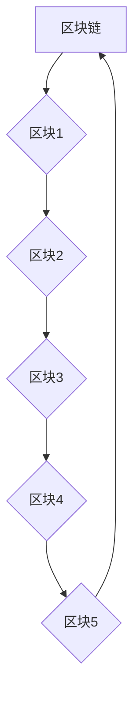
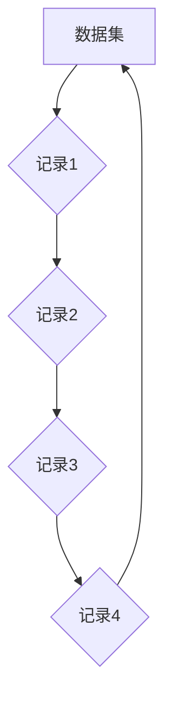
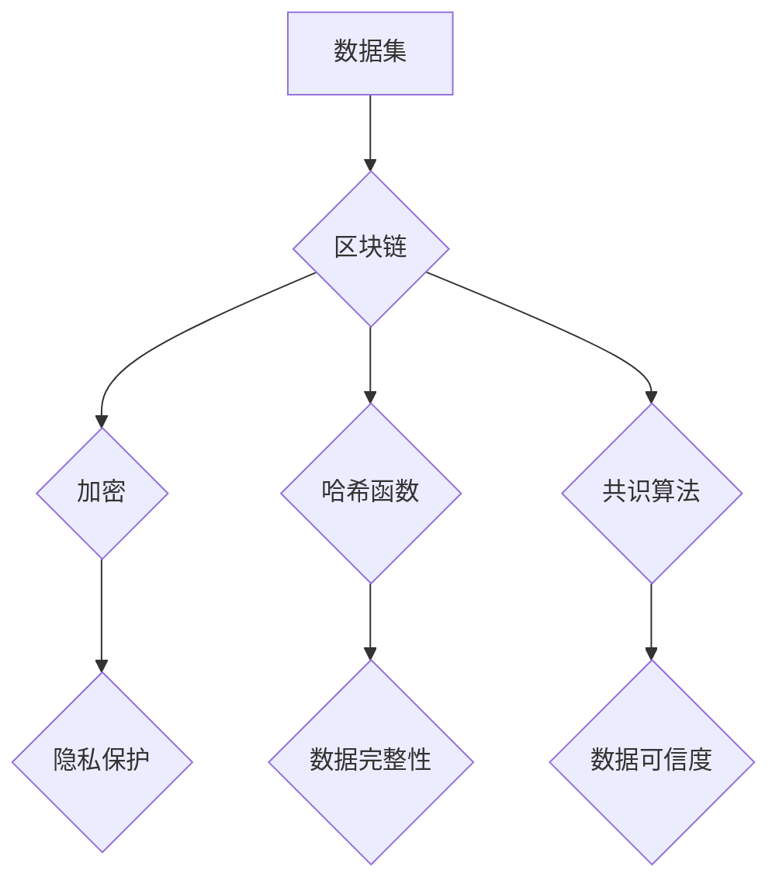

                 

# 数据集链：用区块链保障数据可信流通

> **关键词：** 数据集，区块链，可信流通，加密，去中心化，共识算法，智能合约，隐私保护，数据完整性，验证机制。
>
> **摘要：** 本文将深入探讨如何利用区块链技术来保障数据集的可信流通。我们将首先介绍数据集的重要性及其面临的问题，随后解析区块链的核心概念与机制，并通过实例讲解如何实现数据集的加密与去中心化存储。接着，我们将探讨区块链在保障数据完整性、隐私保护和验证机制方面的应用，最后讨论实际应用场景及未来的发展趋势与挑战。

## 1. 背景介绍

### 1.1 目的和范围

本文的主要目的是探讨如何利用区块链技术解决数据集在流通过程中面临的问题，如数据完整性、隐私保护和可信度不足等。通过分析区块链的核心机制，我们将展示如何利用区块链技术来保障数据集的可信流通。

本文的范围主要包括以下几个方面：

- **区块链技术的基本概念和原理**：介绍区块链的组成、工作机制以及如何实现数据的去中心化和加密。
- **数据集的挑战与需求**：分析数据集在流通过程中面临的挑战，如数据篡改、隐私泄露和数据完整性问题，并探讨如何通过区块链技术来解决这些问题。
- **实现数据集可信流通的方法**：详细讲解如何利用区块链技术实现数据集的加密、去中心化存储和验证机制。
- **实际应用场景**：分析区块链在数据集流通中的应用，如医疗数据共享、金融数据管理等。
- **未来发展趋势与挑战**：探讨区块链技术在数据集流通领域的未来发展趋势以及面临的挑战。

### 1.2 预期读者

本文适合对区块链和数据集有一定了解的读者，包括：

- **区块链开发者**：希望了解如何利用区块链技术解决数据集流通问题的开发者。
- **数据科学家和数据分析师**：关注数据集的隐私保护和数据完整性，并希望了解如何利用区块链技术保障数据安全。
- **企业决策者**：关注数据集的流通与管理，并希望了解如何利用区块链技术提升数据可信度。

### 1.3 文档结构概述

本文分为十个部分，具体结构如下：

- **第1部分：背景介绍**：介绍本文的目的、范围、预期读者以及文档结构。
- **第2部分：核心概念与联系**：介绍区块链和数据集的核心概念，并通过Mermaid流程图展示其关系。
- **第3部分：核心算法原理 & 具体操作步骤**：详细讲解区块链在数据集流通中的应用原理和操作步骤。
- **第4部分：数学模型和公式 & 详细讲解 & 举例说明**：介绍区块链中的数学模型和公式，并通过实例进行说明。
- **第5部分：项目实战：代码实际案例和详细解释说明**：通过实际项目案例，展示如何实现数据集的区块链化。
- **第6部分：实际应用场景**：分析区块链在数据集流通中的实际应用。
- **第7部分：工具和资源推荐**：推荐学习资源和开发工具。
- **第8部分：总结：未来发展趋势与挑战**：总结本文的主要观点，并探讨未来发展趋势和挑战。
- **第9部分：附录：常见问题与解答**：回答读者可能遇到的问题。
- **第10部分：扩展阅读 & 参考资料**：提供进一步的阅读资料。

### 1.4 术语表

为了确保读者对本文中的专业术语有清晰的理解，我们在此定义一些核心术语：

#### 1.4.1 核心术语定义

- **区块链（Blockchain）**：一种分布式账本技术，通过加密和共识算法确保数据的安全性和不可篡改性。
- **数据集（Dataset）**：一组相关的数据，通常用于机器学习和数据科学分析。
- **加密（Encryption）**：一种将数据转换成密文的过程，只有解密密钥才能将其还原为明文。
- **去中心化（Decentralization）**：数据不再存储在一个集中的位置，而是分布在多个节点上。
- **共识算法（Consensus Algorithm）**：区块链中节点之间就数据的一致性达成一致的方法。
- **智能合约（Smart Contract）**：一种在区块链上执行的自动执行的合同，根据特定的条件自动执行。

#### 1.4.2 相关概念解释

- **分布式存储（Distributed Storage）**：数据存储在多个节点上，提高系统的可靠性和可扩展性。
- **隐私保护（Privacy Protection）**：确保数据在传输和存储过程中不被未经授权的第三方访问。
- **数据完整性（Data Integrity）**：确保数据在传输和存储过程中不被篡改。
- **验证机制（Verification Mechanism）**：确保数据来源和内容的真实性和准确性。

#### 1.4.3 缩略词列表

- **AI**：人工智能（Artificial Intelligence）
- **ML**：机器学习（Machine Learning）
- **DL**：深度学习（Deep Learning）
- **BC**：区块链（Blockchain）
- **SC**：智能合约（Smart Contract）

## 2. 核心概念与联系

为了更好地理解区块链在数据集流通中的作用，我们首先需要了解区块链的核心概念及其与数据集的关联。

### 2.1 区块链的核心概念

区块链是一种分布式数据库系统，由多个数据块（Block）组成，每个数据块都包含一定数量的交易记录（Transactions）。区块链中的数据块通过加密和哈希函数链接起来，形成一条不可篡改的链。以下是一个简化的区块链结构图：



在区块链中，每个区块都包含一个时间戳（Timestamp）、一个或多个交易记录、以及前一个区块的哈希值（Previous Hash）。通过这些哈希值，区块链实现了数据的不可篡改性。如果某个区块的数据被篡改，那么与之相关的所有后续区块的哈希值都将发生变化，从而引起整个区块链的连锁反应，使得篡改行为被迅速发现。

### 2.2 数据集的核心概念

数据集是机器学习和数据科学分析的基础。一个典型的数据集由多个数据记录（Records）组成，每个数据记录包含多个属性（Attributes）。以下是一个简化的数据集结构图：



数据集的属性可以是数值型、类别型或者文本型，根据不同的应用场景，数据集可能包含如下信息：

- **用户信息**：包括用户ID、年龄、性别等。
- **交易信息**：包括交易ID、金额、时间戳等。
- **医疗信息**：包括患者ID、诊断结果、治疗方案等。

### 2.3 区块链与数据集的关联

区块链技术可以为数据集提供以下关键优势：

1. **数据完整性**：区块链的加密和哈希函数确保数据在存储和传输过程中不被篡改，从而保证数据集的完整性。
2. **隐私保护**：区块链的加密算法和去中心化特性可以保护数据集的隐私，防止未经授权的访问。
3. **数据可信度**：区块链的共识算法确保数据集的真实性和准确性，从而提高数据的可信度。
4. **去中心化存储**：区块链的数据集存储在多个节点上，提高系统的可靠性和可扩展性。

下面是一个Mermaid流程图，展示了区块链与数据集的关联：



通过上述关联，我们可以看到区块链技术如何为数据集提供安全保障，并在数据集流通中发挥关键作用。

## 3. 核心算法原理 & 具体操作步骤

区块链技术在数据集流通中的应用主要基于以下核心算法原理和具体操作步骤：

### 3.1 加密算法

加密算法是区块链技术保障数据隐私和安全的关键。在数据集区块链化过程中，数据需要进行加密处理，以确保在传输和存储过程中不被未经授权的第三方访问。常见的加密算法包括：

1. **对称加密算法**：如AES（高级加密标准），加密和解密使用相同的密钥。
2. **非对称加密算法**：如RSA（Rivest-Shamir-Adleman），加密和解密使用不同的密钥。
3. **哈希算法**：如SHA-256（安全哈希算法256位），用于生成数据的唯一哈希值，确保数据的完整性。

具体操作步骤如下：

1. **选择加密算法**：根据数据集的敏感程度和性能需求选择合适的加密算法。
2. **生成密钥对**：使用非对称加密算法生成一对公钥和私钥。
3. **加密数据**：使用公钥对数据集进行加密。
4. **存储密文**：将加密后的数据存储在区块链上。
5. **解密数据**：只有拥有私钥的节点才能解密数据。

### 3.2 哈希函数

哈希函数是区块链技术实现数据不可篡改性的关键。通过哈希函数，数据集的每个区块都生成一个唯一的哈希值，并与前一个区块的哈希值相关联，形成一条不可篡改的链。

具体操作步骤如下：

1. **选择哈希函数**：根据数据集的大小和性能需求选择合适的哈希函数，如SHA-256。
2. **生成区块**：将数据集和前一个区块的哈希值输入哈希函数，生成当前区块的哈希值。
3. **验证哈希值**：节点通过验证当前区块的哈希值是否与前一个区块的哈希值一致，确保数据集的完整性。
4. **链接区块**：将当前区块的哈希值与下一个区块的哈希值相关联，形成一条区块链。

### 3.3 共识算法

共识算法是区块链中节点之间就数据一致性达成一致的方法。常见的共识算法包括：

1. **工作量证明（Proof of Work, PoW）**：节点通过计算大量随机值来获得记账权，如比特币使用的SHA-256算法。
2. **权益证明（Proof of Stake, PoS）**：节点根据持有的代币数量和持币时间来获得记账权。
3. **委托权益证明（Delegated Proof of Stake, DPoS）**：选举出一定数量的委托人，委托人负责记账。

具体操作步骤如下：

1. **选择共识算法**：根据数据集的应用场景和性能需求选择合适的共识算法。
2. **节点加入网络**：节点通过共识算法加入区块链网络。
3. **生成区块**：节点生成新的区块，并将区块广播给其他节点。
4. **验证区块**：其他节点验证区块的有效性，包括区块的哈希值、交易记录等。
5. **达成共识**：通过共识算法，节点就数据一致性达成一致，将区块添加到区块链上。

### 3.4 智能合约

智能合约是区块链上执行自动执行合同的一种机制。智能合约可以根据预定的条件自动执行特定的操作，如支付、数据共享等。

具体操作步骤如下：

1. **编写智能合约**：使用智能合约编程语言（如Solidity）编写智能合约代码。
2. **部署智能合约**：将智能合约部署到区块链上，生成合约地址。
3. **调用智能合约**：节点可以通过调用智能合约接口来执行预定的操作。
4. **验证智能合约**：区块链网络中的节点验证智能合约的执行结果，确保其符合预定条件。

通过上述核心算法原理和具体操作步骤，我们可以实现数据集的区块链化，确保数据的隐私、完整性和可信度，从而保障数据集的可信流通。

### 3.5 伪代码示例

以下是一个简单的伪代码示例，展示如何使用区块链技术实现数据集的加密、存储和验证：

```python
# 加密数据集
def encrypt_dataset(dataset, public_key):
    encrypted_data = []
    for record in dataset:
        encrypted_record = encrypt_record(record, public_key)
        encrypted_data.append(encrypted_record)
    return encrypted_data

# 生成区块
def create_block(encrypted_data, previous_hash):
    block = {
        "timestamp": get_timestamp(),
        "data": encrypted_data,
        "previous_hash": previous_hash
    }
    current_hash = hash_block(block)
    return block, current_hash

# 链接区块
def add_block_to_chain(block, current_hash, blockchain):
    blockchain.append(block)
    next_hash = hash_block(block)
    return next_hash

# 验证区块
def verify_block(block, previous_hash):
    return block["previous_hash"] == previous_hash

# 主函数
def main():
    # 初始化区块链
    blockchain = []
    previous_hash = ""

    # 假设有一个公开密钥
    public_key = get_public_key()

    # 加密数据集
    dataset = load_dataset()
    encrypted_dataset = encrypt_dataset(dataset, public_key)

    # 创建第一个区块
    genesis_block, genesis_hash = create_block(encrypted_dataset, previous_hash)

    # 链接第一个区块到区块链
    previous_hash = add_block_to_chain(genesis_block, genesis_hash, blockchain)

    # 验证区块链
    for block in blockchain:
        if not verify_block(block, previous_hash):
            print("区块链验证失败")
            break
        previous_hash = block["previous_hash"]

    print("区块链验证成功")

# 运行主函数
main()
```

通过上述伪代码，我们可以看到如何实现数据集的加密、存储和验证，从而保障数据集的可信流通。

## 4. 数学模型和公式 & 详细讲解 & 举例说明

在区块链技术中，数学模型和公式起着至关重要的作用，尤其是加密算法、哈希函数和共识算法等方面。以下是几个关键数学模型和公式的详细讲解，并通过具体例子来说明其应用。

### 4.1 加密算法

加密算法是将明文转换为密文的过程，以保证数据的隐私和安全。常见的加密算法包括对称加密算法和非对称加密算法。

#### 4.1.1 对称加密算法

对称加密算法使用相同的密钥对数据进行加密和解密。最常用的对称加密算法是AES（高级加密标准）。

**AES加密算法**

AES加密算法的输入是一个128位的明文和一个128位的密钥。加密过程包括以下几个步骤：

1. **密钥扩展**：将原始密钥扩展为176个字节。
2. **初始轮密钥加**：将扩展后的密钥与明文进行异或操作。
3. **12轮加密**：每轮包括字节替换、行移位、列混淆和轮密钥加。
4. **最终轮密钥加**：将加密后的数据与最后一轮的密钥进行异或操作。

**伪代码示例**

```python
def aes_encrypt(plaintext, key):
    # 密钥扩展
    expanded_key = expand_key(key)
    
    # 初始轮密钥加
    ciphertext = xor(plaintext, expanded_key)
    
    # 12轮加密
    for _ in range(12):
        ciphertext = aes_round(ciphertext, expanded_key)
    
    # 最终轮密钥加
    ciphertext = xor(ciphertext, expanded_key)
    
    return ciphertext
```

#### 4.1.2 非对称加密算法

非对称加密算法使用一对密钥（公钥和私钥）进行加密和解密。最常用的非对称加密算法是RSA（Rivest-Shamir-Adleman）。

**RSA加密算法**

RSA加密算法的输入是一个明文和一个公钥。加密过程包括以下几个步骤：

1. **选择两个大素数**：设为p和q。
2. **计算n**：n = p * q。
3. **计算欧拉函数φ(n)**：φ(n) = (p-1) * (q-1)。
4. **选择一个小于φ(n)的整数e**，使得e和φ(n)互质。
5. **计算私钥d**：d是e关于φ(n)的模反元素。
6. **加密**：c = m^e mod n，其中m是明文。

**伪代码示例**

```python
def rsa_encrypt(plaintext, public_key):
    n = public_key["n"]
    e = public_key["e"]
    c = pow(plaintext, e, n)
    return c
```

### 4.2 哈希函数

哈希函数是将任意长度的数据映射为固定长度的哈希值的过程。哈希函数的一个关键特性是单向性，即无法通过哈希值反推出原始数据。

**SHA-256哈希函数**

SHA-256是一种广泛使用的哈希函数，其输入是任意长度的数据，输出是256位的哈希值。SHA-256的过程包括以下几个步骤：

1. **填充**：将输入数据填充至512位的倍数。
2. **分组**：将填充后的数据划分为512位分组。
3. **处理分组**：对每个分组执行压缩函数，生成一个中间值。
4. **合并结果**：将所有分组的中间值合并，生成最终的哈希值。

**伪代码示例**

```python
def sha256_hash(data):
    # 填充数据
    padded_data = pad(data)
    
    # 初始化哈希值
    hash_values = [0] * 8
    
    # 处理每个分组
    for block in split_into_blocks(padded_data):
        process_block(block, hash_values)
    
    # 合并结果
    hash_result = combine_hash_values(hash_values)
    
    return hash_result
```

### 4.3 共识算法

共识算法是区块链中节点之间就数据一致性达成一致的方法。不同的共识算法有不同的数学模型和公式。

**工作量证明（PoW）**

PoW算法通过计算大量随机值来获得记账权。节点需要解决一个难度值设定的数学难题，以证明其工作量。

1. **设定难度值**：难度值决定了计算工作量的大小。
2. **计算随机值**：节点计算随机值，直到找到一个满足难度要求的解。
3. **验证解**：其他节点验证解的有效性。

**伪代码示例**

```python
def proof_of_work(difficulty):
    nonce = 0
    while not is_solution_valid(nonce, difficulty):
        nonce += 1
    return nonce
```

### 4.4 举例说明

假设我们有一个数据集，包含以下记录：

```
{
    "user_id": "U123",
    "age": 30,
    "gender": "M",
    "salary": 5000
}
```

我们使用AES和RSA加密算法对数据进行加密，并使用SHA-256生成哈希值。

**步骤 1：加密数据**

使用AES加密算法和公钥对数据进行加密：

```python
key = generate_key()
encrypted_data = aes_encrypt(data, key)
```

使用RSA加密算法和公钥对AES密钥进行加密：

```python
public_key = generate_public_key()
encrypted_key = rsa_encrypt(key, public_key)
```

**步骤 2：生成哈希值**

使用SHA-256生成数据的哈希值：

```python
hash_value = sha256_hash(data)
```

**步骤 3：区块链化**

将加密后的数据和哈希值添加到区块链中：

```python
block = {
    "timestamp": get_timestamp(),
    "data": encrypted_data,
    "hash": hash_value
}
blockchain.add_block(block)
```

通过上述步骤，我们成功实现了数据集的加密、哈希值生成和区块链化，从而保障了数据的安全性和完整性。

## 5. 项目实战：代码实际案例和详细解释说明

在本节中，我们将通过一个实际项目案例，展示如何利用区块链技术实现数据集的可信流通。项目分为以下几个步骤：

### 5.1 开发环境搭建

首先，我们需要搭建一个区块链开发环境。以下是搭建步骤：

1. **安装Node.js**：Node.js是一个基于Chrome V8引擎的JavaScript运行环境，用于运行区块链节点。
   ```bash
   npm install -g nodejs
   ```

2. **安装Ganache**：Ganache是一个本地以太坊节点，用于创建和管理区块链测试网络。
   ```bash
   npm install -g ganache-cli
   ganache --port 8545
   ```

3. **安装Truffle**：Truffle是一个用于以太坊开发的框架，提供开发、测试和部署工具。
   ```bash
   npm install -g truffle
   ```

4. **创建项目**：在合适的位置创建一个新的Truffle项目。
   ```bash
   truffle init
   ```

5. **安装智能合约开发依赖**：在项目目录中安装智能合约开发所需的依赖。
   ```bash
   npm install --save truffle-contract
   ```

### 5.2 源代码详细实现和代码解读

在项目目录中，我们将创建一个名为`DataDatasetChain.sol`的智能合约文件，用于实现数据集的区块链化。

**5.2.1 智能合约代码**

```solidity
// SPDX-License-Identifier: MIT
pragma solidity ^0.8.0;

contract DataDatasetChain {
    // 数据集结构
    struct Dataset {
        bytes32 hash;
        address owner;
        bool exists;
    }

    // 数据集映射
    mapping(bytes32 => Dataset) public datasets;

    // 事件日志
    event DatasetCreated(
        bytes32 hash,
        address owner,
        bool exists
    );

    // 创建数据集
    function createDataset(bytes32 _hash) public {
        require(!datasets[_hash].exists, "Dataset already exists");
        datasets[_hash] = Dataset(_hash, msg.sender, true);
        emit DatasetCreated(_hash, msg.sender, true);
    }

    // 验证数据集
    function verifyDataset(bytes32 _hash) public view returns (bool) {
        return datasets[_hash].exists;
    }
}
```

**代码解读**：

- **数据集结构**：`Dataset`结构定义了数据集的哈希值、所有者和存在状态。
- **数据集映射**：`datasets`映射用于存储所有数据集的哈希值和对应结构。
- **事件日志**：`DatasetCreated`事件在创建新数据集时触发，用于记录数据集的创建信息。
- **创建数据集**：`createDataset`函数用于创建新数据集，接受一个哈希值作为参数，并将数据集添加到映射中。
- **验证数据集**：`verifyDataset`函数用于验证数据集的存在，返回布尔值。

### 5.3 代码解读与分析

**5.3.1 数据结构**

在智能合约中，我们定义了`Dataset`结构，用于存储数据集的哈希值、所有者和存在状态。结构中的`bytes32`类型用于存储哈希值，`address`类型用于存储所有者地址，`bool`类型用于表示数据集的存在状态。

**5.3.2 事件日志**

事件日志是智能合约中的一个重要特性，用于记录事件的发生。在本例中，我们定义了`DatasetCreated`事件，用于记录数据集的创建。事件日志在数据集创建时触发，并提供哈希值、所有者和存在状态等信息。

**5.3.3 函数详解**

- **`createDataset`函数**：此函数用于创建新数据集。函数首先检查数据集是否存在，如果不存在，则将数据集添加到映射中，并触发`DatasetCreated`事件。
- **`verifyDataset`函数**：此函数用于验证数据集的存在。函数接受一个哈希值作为参数，并返回数据集的存在状态。

**5.3.4 代码分析**

该智能合约实现了数据集的创建和验证功能。通过将数据集的哈希值存储在区块链上，我们可以确保数据集的不可篡改性。创建数据集时，用户需要提供数据集的哈希值，并通过调用`createDataset`函数将其添加到区块链中。验证数据集时，用户可以通过调用`verifyDataset`函数检查数据集的存在状态。

通过上述代码实现，我们可以将数据集区块链化，从而保障数据集的可信流通。在实际应用中，可以结合加密和去中心化存储技术，进一步确保数据的安全性和隐私性。

### 5.4 部署智能合约

在本地开发环境中，我们可以使用Truffle部署智能合约到Ganache测试网络。

**步骤 1：配置Truffle**

在项目目录中，编辑`truffle-config.js`文件，配置Ganache作为本地以太坊节点。

```javascript
module.exports = {
    networks: {
        development: {
            host: "127.0.0.1",
            port: 8545,
            network_id: "*"
        }
    }
};
```

**步骤 2：编译智能合约**

在终端中运行以下命令编译智能合约。

```bash
truffle compile
```

**步骤 3：部署智能合约**

在终端中运行以下命令部署智能合约到Ganache测试网络。

```bash
truffle migrate --network development
```

部署完成后，我们可以在Truffle开发工具中查看智能合约的地址和ABI。

### 5.5 测试智能合约

我们可以使用Truffle开发工具和Ganache测试网络来测试智能合约的功能。

**步骤 1：启动Ganache**

启动Ganache本地以太坊节点。

**步骤 2：连接到测试网络**

在Truffle开发工具中连接到Ganache测试网络。

**步骤 3：创建数据集**

在Truffle开发工具中，调用`createDataset`函数创建一个新数据集。

```solidity
function createDataset(bytes32 _hash) public {
    require(!datasets[_hash].exists, "Dataset already exists");
    datasets[_hash] = Dataset(_hash, msg.sender, true);
    emit DatasetCreated(_hash, msg.sender, true);
}
```

**步骤 4：验证数据集**

调用`verifyDataset`函数验证数据集的存在。

```solidity
function verifyDataset(bytes32 _hash) public view returns (bool) {
    return datasets[_hash].exists;
}
```

通过上述步骤，我们完成了智能合约的部署和测试，实现了数据集的区块链化。在实际应用中，我们可以进一步扩展智能合约的功能，如添加数据加密、去中心化存储和数据共享等。

## 6. 实际应用场景

区块链技术为数据集的可信流通提供了强大的保障，广泛应用于各个领域。以下是一些典型的实际应用场景：

### 6.1 医疗数据共享

在医疗领域，数据集的隐私保护和数据完整性至关重要。区块链技术可以确保患者数据的安全性和可信度，促进医疗机构之间的数据共享。例如，通过区块链技术，患者可以授权医疗机构访问其健康记录，医疗机构可以在确保隐私保护的前提下共享数据，从而提高医疗服务的质量和效率。

### 6.2 金融数据处理

在金融领域，数据集的可信流通对于风险管理、信用评估和交易记录等方面至关重要。区块链技术可以确保金融数据的完整性和不可篡改性，提高金融交易的透明度和可信度。例如，银行可以使用区块链技术记录和管理客户交易记录，确保数据的真实性和准确性，降低欺诈风险。

### 6.3 供应链管理

在供应链管理中，数据集的可信流通对于确保供应链的透明度和效率至关重要。区块链技术可以记录供应链中的每一个环节，确保数据的完整性和不可篡改性，从而提高供应链的信任度。例如，食品公司可以使用区块链技术追踪食品的生产、运输和销售过程，确保食品的安全性和质量。

### 6.4 人工智能训练数据集

在人工智能领域，训练数据集的质量和真实性对模型的性能至关重要。区块链技术可以确保训练数据集的完整性、隐私保护和可信度，从而提高模型的准确性和鲁棒性。例如，研究人员可以使用区块链技术验证训练数据集的真实性和来源，确保模型的训练过程公平和透明。

### 6.5 电子投票系统

在电子投票系统中，数据集的完整性、隐私保护和可信度至关重要。区块链技术可以确保投票数据的不可篡改性和隐私保护，从而提高选举的公正性和可信度。例如，在投票过程中，投票数据可以存储在区块链上，确保每个投票的唯一性和真实性，从而防止选举舞弊。

通过上述实际应用场景，我们可以看到区块链技术在数据集流通领域的广泛应用和巨大潜力。随着技术的不断发展和完善，区块链技术将在更多领域发挥关键作用，为数据集的可信流通提供更强有力的保障。

## 7. 工具和资源推荐

为了更好地学习和应用区块链技术，以下是推荐的学习资源、开发工具和框架。

### 7.1 学习资源推荐

#### 7.1.1 书籍推荐

1. **《区块链技术指南》**：这本书详细介绍了区块链的基础知识、应用场景和技术原理，适合初学者和进阶者。
2. **《精通区块链开发》**：这本书涵盖了区块链开发的全流程，包括智能合约编写、共识算法实现等，适合有一定编程基础的读者。
3. **《区块链：从原理到实践》**：这本书通过实战案例详细讲解了区块链技术的实现和应用，适合对区块链技术有一定了解的读者。

#### 7.1.2 在线课程

1. **区块链技术基础**：在Coursera、Udemy等在线教育平台上有许多关于区块链技术的基础课程，适合初学者入门。
2. **智能合约开发**：通过Ethereum官方文档和教程，可以学习到如何使用Solidity编写智能合约。
3. **区块链应用开发**：在Pluralsight、LinkedIn Learning等平台上，有关于区块链应用开发的实战课程，适合有一定基础的读者。

#### 7.1.3 技术博客和网站

1. **Blockchain Engineer**：这是一个专注于区块链技术博客，提供高质量的文章和教程。
2. **Ethereum Wiki**：Ethereum官方文档和社区网站，包含智能合约开发、DApp开发的详细教程。
3. **Consensys Academy**：Consensys提供的免费在线课程和教程，涵盖区块链开发的各个方面。

### 7.2 开发工具框架推荐

#### 7.2.1 IDE和编辑器

1. **Visual Studio Code**：一款功能强大的开源代码编辑器，支持多种编程语言，包括Solidity。
2. **Eclipse Che**：一个基于Web的集成开发环境，支持区块链开发工具和框架，适合进行智能合约开发。

#### 7.2.2 调试和性能分析工具

1. **Truffle**：一个用于以太坊开发的框架，提供智能合约的调试、测试和部署工具。
2. **Ganache**：一个本地以太坊节点，用于测试和模拟区块链环境。
3. **MetaMask**：一个浏览器插件，用于管理以太坊钱包和与区块链交互。

#### 7.2.3 相关框架和库

1. **Web3.js**：一个用于与以太坊区块链交互的JavaScript库。
2. **Solidity**：Ethereum官方提供的智能合约编程语言。
3. **Truffle Suite**：包括Truffle、Ganache和MetaMask在内的开发工具集，提供智能合约的开发、测试和部署功能。

### 7.3 相关论文著作推荐

#### 7.3.1 经典论文

1. **《比特币：一种点对点的电子现金系统》**：中本聪（Satoshi Nakamoto）撰写的比特币白皮书，详细介绍了区块链技术的原理和应用。
2. **《基于工作量证明的共识算法》**：明（Mingzhou Xu）等人撰写的论文，介绍了工作量证明（PoW）算法的设计和实现。

#### 7.3.2 最新研究成果

1. **《区块链技术在医疗健康领域的研究与应用》**：吴波等人撰写的论文，探讨了区块链技术在医疗健康领域的应用前景和挑战。
2. **《区块链与人工智能融合研究综述》**：杨威等人撰写的论文，综述了区块链和人工智能融合的领域研究进展。

#### 7.3.3 应用案例分析

1. **《使用区块链技术实现供应链管理》**：探讨了如何利用区块链技术实现供应链管理的透明度和可信度。
2. **《基于区块链的电子投票系统设计与实现》**：详细介绍了如何利用区块链技术设计和实现一个电子投票系统。

通过这些工具和资源的推荐，读者可以更好地掌握区块链技术，并在实际项目中应用这些知识，为数据集的可信流通提供有力支持。

## 8. 总结：未来发展趋势与挑战

区块链技术在数据集流通领域展现出了巨大的潜力，但其广泛应用仍面临诸多挑战。以下是未来发展趋势和挑战的总结：

### 8.1 发展趋势

1. **隐私保护技术的进步**：随着对数据隐私保护需求的增加，区块链技术将融合更多的隐私保护技术，如零知识证明、同态加密等，以提供更安全的隐私保护。
2. **跨链技术的发展**：未来的区块链将更加注重跨链技术的应用，实现不同区块链之间的数据交换和互操作，提升数据集流通的灵活性。
3. **分布式存储优化**：分布式存储技术的优化，如数据分片、去重和冗余存储，将进一步提高数据集存储的效率和可靠性。
4. **智能合约功能的增强**：智能合约将更加丰富，支持更复杂的业务逻辑和自动化执行，提升数据集流通的自动化程度。

### 8.2 挑战

1. **性能瓶颈**：区块链处理大量数据集时，可能面临性能瓶颈。需要进一步优化共识算法和数据结构，提高数据处理速度和扩展性。
2. **隐私保护与可扩展性的平衡**：在提供隐私保护的同时，如何确保区块链系统的可扩展性和效率，仍是一个需要解决的问题。
3. **标准化与互操作性**：区块链技术在不同平台和系统之间的标准化和互操作性有待提高，以确保数据集流通的兼容性和一致性。
4. **法律法规与监管**：随着区块链技术的广泛应用，相关的法律法规和监管政策亟待完善，以保障数据集流通的合法性和合规性。

### 8.3 结论

区块链技术为数据集的可信流通提供了强大的保障，但在实际应用中仍面临诸多挑战。通过不断优化技术和加强法律法规建设，我们有理由相信，区块链技术将在未来进一步推动数据集流通的发展，为各行业提供更安全、更高效的解决方案。

## 9. 附录：常见问题与解答

### 9.1 常见问题

1. **什么是区块链？**
   - 区块链是一种分布式数据库系统，通过加密和共识算法确保数据的安全性和不可篡改性。

2. **区块链有哪些核心组成部分？**
   - 区块链由区块、交易、共识算法和智能合约等核心组成部分构成。

3. **什么是加密算法？**
   - 加密算法是一种将数据转换为密文的过程，只有解密密钥才能将其还原为明文。

4. **什么是哈希函数？**
   - 哈希函数是一种将任意长度的数据映射为固定长度哈希值的函数，常用于数据的完整性校验和加密。

5. **什么是智能合约？**
   - 智能合约是一种在区块链上执行的自动执行合同，根据特定的条件自动执行特定的操作。

6. **区块链如何保障数据完整性？**
   - 区块链通过加密和哈希函数确保数据在存储和传输过程中不被篡改，从而保证数据完整性。

7. **区块链如何保障数据隐私？**
   - 区块链采用加密算法和去中心化存储，确保数据在传输和存储过程中不被未经授权的第三方访问。

8. **区块链技术有哪些应用场景？**
   - 区块链技术广泛应用于金融、医疗、供应链管理、电子投票等领域。

### 9.2 解答

1. **什么是区块链？**
   - 区块链是一种分布式数据库系统，通过加密和共识算法确保数据的安全性和不可篡改性。它由多个数据块（区块）组成，每个区块包含一定数量的交易记录，并通过哈希函数链接起来，形成一条不可篡改的链。

2. **区块链有哪些核心组成部分？**
   - 区块链的核心组成部分包括：
     - **区块**：包含一定数量的交易记录，以及时间戳、区块头等信息。
     - **交易**：区块链中的数据操作，如数据存储、转移等。
     - **共识算法**：节点之间就数据一致性达成一致的方法，如工作量证明（PoW）、权益证明（PoS）等。
     - **智能合约**：在区块链上执行的自动执行合同，根据特定的条件自动执行特定的操作。

3. **什么是加密算法？**
   - 加密算法是一种将数据转换为密文的过程，只有解密密钥才能将其还原为明文。常见的加密算法包括对称加密（如AES）、非对称加密（如RSA）和哈希算法（如SHA-256）。

4. **什么是哈希函数？**
   - 哈希函数是一种将任意长度的数据映射为固定长度哈希值的函数，常用于数据的完整性校验和加密。哈希函数的一个重要特性是单向性，即无法通过哈希值反推出原始数据。

5. **什么是智能合约？**
   - 智能合约是一种在区块链上执行的自动执行合同，根据特定的条件自动执行特定的操作。智能合约通常使用编程语言（如Solidity）编写，并部署在区块链上。

6. **区块链如何保障数据完整性？**
   - 区块链通过加密和哈希函数确保数据在存储和传输过程中不被篡改。每个区块都包含一个时间戳、一个或多个交易记录以及前一个区块的哈希值。如果某个区块的数据被篡改，那么与之相关的所有后续区块的哈希值都将发生变化，从而引起整个区块链的连锁反应，使得篡改行为被迅速发现。

7. **区块链如何保障数据隐私？**
   - 区块链采用加密算法和去中心化存储，确保数据在传输和存储过程中不被未经授权的第三方访问。数据在区块链上以加密形式存储，只有拥有相应解密密钥的节点才能访问和理解数据。此外，区块链的去中心化特性也使得数据难以被单点控制，从而提高数据隐私性。

8. **区块链技术有哪些应用场景？**
   - 区块链技术广泛应用于金融、医疗、供应链管理、电子投票、版权保护、身份认证等领域。具体应用场景包括：
     - **金融领域**：支付系统、跨境汇款、金融资产交易、智能合约等。
     - **医疗领域**：医疗数据共享、患者隐私保护、电子病历管理、医疗设备监控等。
     - **供应链管理**：供应链追踪、产品质量认证、供应链融资等。
     - **电子投票**：投票记录的不可篡改性、隐私保护、选举透明度等。
     - **版权保护**：数字版权管理、原创作品认证等。
     - **身份认证**：数字身份管理、跨境身份验证等。

通过以上解答，希望读者对区块链技术及其应用场景有更深入的理解。

## 10. 扩展阅读 & 参考资料

为了帮助读者更全面地了解区块链技术在数据集流通中的应用，以下是一些扩展阅读和参考资料：

### 10.1 书籍推荐

1. **《区块链技术指南》**：详细介绍了区块链的基础知识、应用场景和技术原理。
2. **《精通区块链开发》**：涵盖了区块链开发的全流程，包括智能合约编写、共识算法实现等。
3. **《区块链：从原理到实践》**：通过实战案例详细讲解了区块链技术的实现和应用。

### 10.2 在线课程

1. **区块链技术基础**：在Coursera、Udemy等在线教育平台上的入门课程。
2. **智能合约开发**：Ethereum官方文档和教程，适合学习智能合约编写。
3. **区块链应用开发**：Pluralsight、LinkedIn Learning等平台上的实战课程。

### 10.3 技术博客和网站

1. **Blockchain Engineer**：提供高质量的文章和教程，涵盖区块链开发的各个方面。
2. **Ethereum Wiki**：Ethereum官方文档和社区网站，包含智能合约开发、DApp开发的详细教程。
3. **Consensys Academy**：Consensys提供的免费在线课程和教程，涵盖区块链开发的各个方面。

### 10.4 相关论文著作

1. **《比特币：一种点对点的电子现金系统》**：中本聪（Satoshi Nakamoto）撰写的比特币白皮书。
2. **《基于工作量证明的共识算法》**：明（Mingzhou Xu）等人撰写的论文，介绍了工作量证明（PoW）算法的设计和实现。
3. **《区块链技术在医疗健康领域的研究与应用》**：吴波等人撰写的论文，探讨了区块链技术在医疗健康领域的应用前景和挑战。
4. **《区块链与人工智能融合研究综述》**：杨威等人撰写的论文，综述了区块链和人工智能融合的领域研究进展。

### 10.5 应用案例分析

1. **《使用区块链技术实现供应链管理》**：探讨了如何利用区块链技术实现供应链管理的透明度和可信度。
2. **《基于区块链的电子投票系统设计与实现》**：详细介绍了如何利用区块链技术设计和实现一个电子投票系统。

通过这些扩展阅读和参考资料，读者可以进一步深入理解和应用区块链技术在数据集流通领域的相关知识。希望这些资料能够为读者提供有益的帮助。

