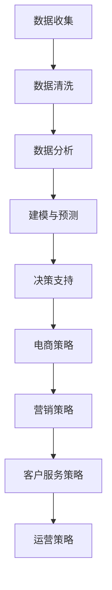
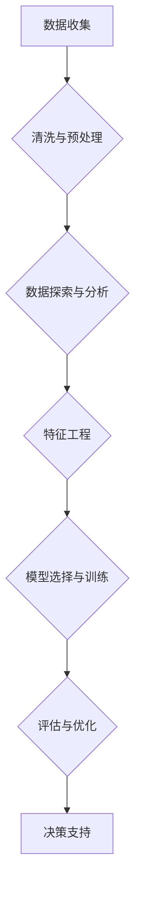

                 

# 数据驱动决策：AI优化电商策略

> 关键词：数据驱动，人工智能，电商，策略优化，决策支持系统

> 摘要：本文将探讨数据驱动决策在电子商务领域的应用，特别是如何通过人工智能技术优化电商策略。文章首先介绍了数据驱动决策的概念及其在电商中的应用背景，随后详细阐述了人工智能技术在电商策略优化中的核心算法和数学模型。通过实际案例的讲解，本文展示了如何利用数据驱动决策实现电商策略的自动化和智能化。最后，文章提出了未来数据驱动决策在电商领域的发展趋势和挑战，为读者提供了深入的思考。

## 1. 背景介绍

### 1.1 目的和范围

本文旨在探讨数据驱动决策在电子商务领域的应用，尤其是如何利用人工智能技术优化电商策略。随着大数据和人工智能技术的快速发展，数据驱动决策已经成为现代商业管理的重要组成部分。在电商领域，数据驱动决策不仅能够帮助企业更好地理解消费者行为，还能优化库存管理、提升营销效果、提高客户满意度等。本文将围绕以下主题展开：

1. 数据驱动决策的基本概念和原理
2. 人工智能技术在电商策略优化中的应用
3. 数据驱动决策的核心算法和数学模型
4. 实际案例：代码实现和案例分析
5. 数据驱动决策在电商领域的应用前景和挑战

### 1.2 预期读者

本文适合以下读者群体：

1. 电商从业者，包括电商平台的运营人员、产品经理、数据分析师等
2. 数据科学和人工智能领域的专业人士，特别是对电商应用场景感兴趣的人
3. 对商业智能和大数据分析感兴趣的技术爱好者

### 1.3 文档结构概述

本文将按照以下结构展开：

1. 引言：介绍数据驱动决策的基本概念和其在电商领域的应用
2. 核心概念与联系：讨论数据驱动决策的关键概念和它们之间的关系
3. 核心算法原理 & 具体操作步骤：详细阐述数据驱动决策的核心算法和操作步骤
4. 数学模型和公式 & 详细讲解 & 举例说明：介绍数据驱动决策相关的数学模型和公式，并通过实例进行说明
5. 项目实战：通过实际案例展示如何利用数据驱动决策优化电商策略
6. 实际应用场景：分析数据驱动决策在电商领域的主要应用场景
7. 工具和资源推荐：推荐相关的学习资源和开发工具
8. 总结：对未来数据驱动决策在电商领域的发展趋势和挑战进行展望
9. 附录：常见问题与解答
10. 扩展阅读 & 参考资料：提供进一步阅读和研究的资料

### 1.4 术语表

#### 1.4.1 核心术语定义

- 数据驱动决策：基于数据分析和机器学习技术，通过数据挖掘和建模来指导决策过程。
- 电商策略：企业在电子商务平台上制定和实施的营销、运营、客户服务等一系列策略。
- 人工智能：模拟人类智能行为的计算机系统，能够进行学习、推理、感知和决策。

#### 1.4.2 相关概念解释

- 数据挖掘：从大量数据中提取有价值的信息和知识的过程。
- 机器学习：一种人工智能技术，通过数据和算法让计算机自动学习并改进性能。
- 客户关系管理（CRM）：企业为提高客户满意度和忠诚度而采取的一系列管理策略。

#### 1.4.3 缩略词列表

- AI：人工智能
- CRM：客户关系管理
- ML：机器学习
- DM：数据挖掘
- BI：商业智能
- E-commerce：电子商务

## 2. 核心概念与联系

为了深入理解数据驱动决策在电商策略优化中的应用，我们需要首先明确几个核心概念，并探讨它们之间的关系。

### 2.1 数据驱动决策

数据驱动决策是一种基于数据分析和机器学习的决策方法。其核心思想是利用数据来发现潜在的模式、趋势和关系，从而为决策提供支持。数据驱动决策的流程通常包括以下几个步骤：

1. 数据收集：从各种数据源（如网站日志、客户反馈、社交媒体等）收集原始数据。
2. 数据清洗：去除数据中的噪声和不一致信息，保证数据的准确性和完整性。
3. 数据分析：使用统计分析和机器学习算法对数据进行挖掘和分析，提取有价值的信息。
4. 建模与预测：根据分析结果建立预测模型，预测未来的趋势和潜在行为。
5. 决策支持：利用预测模型为决策者提供决策支持，优化业务策略。

### 2.2 电商策略

电商策略是企业为在电子商务平台上取得成功而制定的营销、运营和客户服务策略。常见的电商策略包括：

1. 产品策略：确定销售哪些产品、产品定位、价格策略等。
2. 营销策略：包括搜索引擎优化（SEO）、社交媒体营销、电子邮件营销等。
3. 客户服务策略：提升客户体验、提高客户满意度、增加客户忠诚度等。
4. 运营策略：优化库存管理、物流配送、平台运营等。

### 2.3 数据驱动决策与电商策略的联系

数据驱动决策在电商策略中扮演着关键角色。通过数据驱动决策，企业可以：

1. 深入理解消费者行为：分析消费者的浏览、购买、评价等行为，发现消费者的需求和偏好。
2. 优化营销效果：通过精准营销，提高广告投放效果，降低营销成本。
3. 优化库存管理：根据销售预测和库存水平，合理调整库存，减少库存积压和缺货情况。
4. 提升客户满意度：通过个性化推荐、快速响应客户需求，提高客户满意度。

以下是一个用Mermaid绘制的流程图，展示了数据驱动决策与电商策略之间的关系：



## 3. 核心算法原理 & 具体操作步骤

### 3.1 数据驱动决策的核心算法

数据驱动决策的核心算法包括机器学习算法、聚类算法、回归算法和决策树等。这些算法在不同的场景下有不同的应用，下面将分别介绍这些算法的基本原理和适用场景。

#### 3.1.1 机器学习算法

机器学习算法是一种通过数据和算法让计算机自动学习并改进性能的技术。常见的机器学习算法有：

- 监督学习：有标签数据，用于预测和分类问题。例如，线性回归、逻辑回归、支持向量机（SVM）等。
- 无监督学习：无标签数据，用于聚类和降维问题。例如，K-均值聚类、主成分分析（PCA）等。
- 强化学习：通过试错和奖励机制来优化策略。例如，Q-Learning、深度强化学习（DRL）等。

#### 3.1.2 聚类算法

聚类算法是一种无监督学习方法，用于将数据集划分为多个类或簇。常见的聚类算法有：

- K-均值聚类：基于距离度量，将数据分为K个簇，每个簇的中心点代表该簇。
- 层次聚类：自底向上或自顶向下构建层次结构，将数据集划分为多个层次。
- 密度聚类：基于数据点的密度分布，识别出数据集中的密集区域作为聚类结果。

#### 3.1.3 回归算法

回归算法用于预测连续值，常用于回归分析。常见的回归算法有：

- 线性回归：通过线性模型预测目标值，是最简单和常用的回归方法。
- 逻辑回归：用于分类问题，通过线性模型预测概率，常用于二分类问题。
- 多项式回归：通过多项式模型进行预测，适用于非线性关系。

#### 3.1.4 决策树

决策树是一种基于特征和阈值进行分类或回归的树形结构。常见的决策树算法有：

- ID3算法：基于信息增益进行特征选择。
- C4.5算法：改进ID3算法，使用增益率进行特征选择。
- C5.0算法：进一步改进，使用统计方法评估特征的重要性。

### 3.2 数据驱动决策的具体操作步骤

数据驱动决策的具体操作步骤如下：

#### 3.2.1 数据收集

从各种数据源收集原始数据，如网站日志、客户反馈、社交媒体等。确保数据的完整性和准确性。



#### 3.2.2 数据清洗与预处理

1. 去除重复数据和缺失数据。
2. 处理异常值和数据噪声。
3. 标准化或归一化数据，使数据具有相似的特征规模。

#### 3.2.3 数据探索与分析

1. 描述性统计：计算数据的均值、方差、中位数等基本统计量。
2. 探索性数据分析：使用图表（如散点图、箱线图等）来观察数据分布和关系。
3. 关联分析：使用相关系数、卡方检验等方法分析变量之间的关系。

#### 3.2.4 特征工程

1. 特征提取：从原始数据中提取有用的特征，如时间特征、地理位置特征等。
2. 特征选择：通过特征选择方法（如信息增益、主成分分析等）筛选重要特征。
3. 特征转换：将数值型特征转换为类别型特征，或进行二值化、分箱等处理。

#### 3.2.5 模型选择与训练

1. 根据问题类型（回归、分类、聚类等）选择合适的算法。
2. 使用训练数据集进行模型训练。
3. 调整模型参数，优化模型性能。

#### 3.2.6 评估与优化

1. 使用测试数据集评估模型性能。
2. 根据评估结果调整模型参数。
3. 交叉验证、网格搜索等方法优化模型。

#### 3.2.7 决策支持

1. 利用训练好的模型进行预测和分类。
2. 根据预测结果提供决策支持，优化电商策略。

### 3.3 伪代码示例

以下是一个简单的伪代码示例，用于描述数据驱动决策的基本流程：

```python
# 伪代码：数据驱动决策流程

# 数据收集
data = collect_data()

# 数据清洗与预处理
cleaned_data = preprocess_data(data)

# 数据探索与分析
explore_data(cleaned_data)

# 特征工程
features = feature_engineering(cleaned_data)

# 模型选择与训练
model = select_model()
model.train(features)

# 评估与优化
evaluate_model(model)

# 决策支持
predictions = model.predict(new_data)
provide_decision_support(predictions)
```

## 4. 数学模型和公式 & 详细讲解 & 举例说明

### 4.1 数学模型

在数据驱动决策中，常用的数学模型包括线性回归模型、逻辑回归模型、K-均值聚类模型等。下面分别对这些模型进行详细讲解。

#### 4.1.1 线性回归模型

线性回归模型是一种用于预测连续值的模型，其基本公式为：

$$y = \beta_0 + \beta_1 \cdot x_1 + \beta_2 \cdot x_2 + \cdots + \beta_n \cdot x_n + \epsilon$$

其中，$y$ 是预测目标，$x_1, x_2, \cdots, x_n$ 是输入特征，$\beta_0, \beta_1, \beta_2, \cdots, \beta_n$ 是模型参数，$\epsilon$ 是误差项。

线性回归模型通过最小化损失函数（如均方误差MSE）来估计模型参数，从而实现预测。损失函数的公式为：

$$\text{MSE} = \frac{1}{n} \sum_{i=1}^{n} (y_i - \hat{y_i})^2$$

其中，$n$ 是样本数量，$y_i$ 是实际值，$\hat{y_i}$ 是预测值。

#### 4.1.2 逻辑回归模型

逻辑回归模型是一种用于分类的模型，其基本公式为：

$$\text{logit}(y) = \beta_0 + \beta_1 \cdot x_1 + \beta_2 \cdot x_2 + \cdots + \beta_n \cdot x_n$$

其中，$y$ 是二分类变量（0或1），$\text{logit}(y)$ 是概率的对数函数，$\beta_0, \beta_1, \beta_2, \cdots, \beta_n$ 是模型参数。

逻辑回归模型通过最小化损失函数（如对数损失函数）来估计模型参数，从而实现分类。损失函数的公式为：

$$\text{Loss} = -\frac{1}{n} \sum_{i=1}^{n} [y_i \cdot \text{log}(\hat{y_i}) + (1 - y_i) \cdot \text{log}(1 - \hat{y_i})]$$

其中，$n$ 是样本数量，$y_i$ 是实际值，$\hat{y_i}$ 是预测概率。

#### 4.1.3 K-均值聚类模型

K-均值聚类模型是一种无监督学习算法，用于将数据集划分为K个簇。其基本公式为：

$$c_k = \frac{1}{N_k} \sum_{i=1}^{N} x_i$$

其中，$c_k$ 是第$k$个簇的中心点，$N_k$ 是第$k$个簇中的数据点数量，$x_i$ 是数据点。

K-均值聚类模型通过以下步骤进行迭代更新：

1. 随机初始化K个簇的中心点。
2. 将每个数据点分配到最近的簇中心点。
3. 计算每个簇的新中心点。
4. 重复步骤2和步骤3，直到簇中心点不再发生显著变化。

### 4.2 举例说明

假设我们要预测电商平台的用户购买意愿，采用线性回归模型。以下是具体步骤：

#### 4.2.1 数据收集

收集用户的年龄、收入、浏览时长等特征，以及购买意愿（0或1）。

#### 4.2.2 数据预处理

对数据进行标准化处理，将年龄、收入等特征缩放到相同的尺度。

#### 4.2.3 建立线性回归模型

使用训练数据集建立线性回归模型，公式为：

$$\text{购买意愿} = \beta_0 + \beta_1 \cdot \text{年龄} + \beta_2 \cdot \text{收入} + \beta_3 \cdot \text{浏览时长} + \epsilon$$

#### 4.2.4 训练模型

使用训练数据集训练模型，最小化均方误差损失函数。

#### 4.2.5 预测

使用测试数据集进行预测，计算每个用户的购买意愿概率。

#### 4.2.6 评估模型

计算预测准确率、召回率等指标，评估模型性能。

## 5. 项目实战：代码实际案例和详细解释说明

### 5.1 开发环境搭建

在开始项目实战之前，我们需要搭建一个合适的开发环境。以下是一个基本的开发环境配置：

- 操作系统：Linux或MacOS
- 编程语言：Python
- 数据处理库：Pandas、NumPy
- 机器学习库：Scikit-learn、TensorFlow、PyTorch
- 可视化库：Matplotlib、Seaborn

假设你已经安装了Python和相关库，接下来我们将使用Scikit-learn库来实现一个简单的电商用户购买意愿预测模型。

### 5.2 源代码详细实现和代码解读

以下是一个使用Scikit-learn实现的简单线性回归模型代码示例：

```python
import numpy as np
import pandas as pd
from sklearn.linear_model import LinearRegression
from sklearn.model_selection import train_test_split
from sklearn.metrics import mean_squared_error

# 5.2.1 数据收集
# 假设我们有一个CSV文件，其中包含用户特征和购买意愿
data = pd.read_csv('data.csv')

# 5.2.2 数据预处理
# 标准化特征
features = data[['age', 'income', 'browsing_time']]
target = data['purchase_intent']
features = (features - features.mean()) / features.std()

# 5.2.3 划分训练集和测试集
X_train, X_test, y_train, y_test = train_test_split(features, target, test_size=0.2, random_state=42)

# 5.2.4 建立模型
model = LinearRegression()
model.fit(X_train, y_train)

# 5.2.5 预测
y_pred = model.predict(X_test)

# 5.2.6 评估模型
mse = mean_squared_error(y_test, y_pred)
print('均方误差:', mse)

# 5.2.7 可视化
import matplotlib.pyplot as plt

plt.scatter(X_test['browsing_time'], y_test, label='真实值')
plt.plot(X_test['browsing_time'], y_pred, color='red', label='预测值')
plt.xlabel('浏览时长')
plt.ylabel('购买意愿')
plt.legend()
plt.show()
```

### 5.3 代码解读与分析

- **数据收集**：从CSV文件中读取数据，这里假设文件名为`data.csv`，其中包含三个特征：年龄、收入和浏览时长，以及目标变量购买意愿。
- **数据预处理**：对特征进行标准化处理，目的是将特征缩放到相同的尺度，便于模型训练。
- **划分训练集和测试集**：使用`train_test_split`函数将数据集划分为训练集和测试集，其中测试集占20%。
- **建立模型**：使用`LinearRegression`类创建线性回归模型，并使用`fit`方法训练模型。
- **预测**：使用训练好的模型对测试集进行预测，得到预测的购买意愿。
- **评估模型**：计算预测的均方误差（MSE），评估模型性能。
- **可视化**：绘制散点图，比较真实值和预测值。

### 5.4 实际应用场景

在实际应用中，我们可以扩展上述模型，添加更多特征（如地理位置、搜索关键词、历史购买记录等），并使用更复杂的机器学习算法（如随机森林、支持向量机等）来提高预测准确性。同时，我们可以利用预测结果为电商平台提供个性化的营销策略，如根据用户的浏览时长和购买意愿进行精准推送、调整广告投放策略等。

## 6. 实际应用场景

数据驱动决策在电商领域有着广泛的应用，以下列举几个主要的应用场景：

### 6.1 用户行为分析

通过分析用户的浏览、购买、评价等行为数据，电商企业可以深入了解用户需求和行为模式，从而优化产品策略和营销策略。例如，基于用户的浏览记录和历史购买记录，可以推荐相关商品，提高用户转化率。

### 6.2 库存管理

通过预测商品的销售趋势，电商企业可以合理调整库存，避免库存积压或缺货情况。数据驱动决策可以帮助企业制定科学的库存管理策略，降低库存成本，提高资金利用率。

### 6.3 营销效果优化

通过分析广告投放效果，电商企业可以优化广告投放策略，提高广告转化率。例如，利用用户行为数据和广告投放效果数据，可以确定最佳的广告投放时间和渠道，实现精准营销。

### 6.4 客户关系管理

通过分析客户反馈和满意度数据，电商企业可以优化客户服务策略，提高客户满意度和忠诚度。例如，通过分析客户投诉数据，可以发现客户服务中的问题，及时采取措施进行改进。

### 6.5 产品定价策略

通过分析市场需求和竞争情况，电商企业可以制定合理的定价策略，提高产品竞争力。数据驱动决策可以帮助企业实现动态定价，根据市场需求和库存情况调整价格，实现利润最大化。

## 7. 工具和资源推荐

### 7.1 学习资源推荐

#### 7.1.1 书籍推荐

1. 《Python数据科学手册》（Python Data Science Handbook）
2. 《机器学习实战》（Machine Learning in Action）
3. 《深入理解计算机图灵奖获得者论文集》

#### 7.1.2 在线课程

1. Coursera上的《机器学习》（由Andrew Ng教授讲授）
2. edX上的《数据科学基础》（由哈佛大学讲授）
3. Udacity的《数据分析纳米学位》

#### 7.1.3 技术博客和网站

1. Medium上的《数据科学与机器学习》专栏
2. Kaggle上的数据科学和机器学习论坛
3. JAXenter上的《机器学习和数据科学》博客

### 7.2 开发工具框架推荐

#### 7.2.1 IDE和编辑器

1. PyCharm
2. Visual Studio Code
3. Jupyter Notebook

#### 7.2.2 调试和性能分析工具

1. Python的内置调试器
2. Py-Spy：Python性能分析工具
3. GDB：通用调试器

#### 7.2.3 相关框架和库

1. Scikit-learn：机器学习和数据分析库
2. TensorFlow：深度学习框架
3. PyTorch：深度学习框架
4. Pandas：数据处理库

### 7.3 相关论文著作推荐

#### 7.3.1 经典论文

1. "The Size of an Accelerating Universe" by E. T. Jaynes
2. "Machine Learning: A Probabilistic Perspective" by Kevin P. Murphy
3. "The Elements of Statistical Learning" by Trevor Hastie, Robert Tibshirani and Jerome Friedman

#### 7.3.2 最新研究成果

1. "Deep Learning for Natural Language Processing" by Yann LeCun, Yosua Bengio and Aaron Courville
2. "Neural Networks and Deep Learning" by Michael Nielsen
3. "Reinforcement Learning: An Introduction" by Richard S. Sutton and Andrew G. Barto

#### 7.3.3 应用案例分析

1. "Data Science Case Studies" by Christine Ryan and Mattrium Ites
2. "Data Science: The Big Picture" by Alex Aiken
3. "Practical Machine Learning" by Max Kuhn and Kjell Johnson

## 8. 总结：未来发展趋势与挑战

随着大数据和人工智能技术的不断发展，数据驱动决策在电商领域具有广阔的应用前景。未来，数据驱动决策将朝着以下几个方向发展：

1. **更复杂的算法和模型**：随着深度学习技术的进步，更复杂、更高效的算法和模型将被应用于电商策略优化，如生成对抗网络（GAN）、变分自编码器（VAE）等。
2. **实时决策支持**：利用实时数据流处理技术，实现实时数据分析和决策支持，帮助企业迅速应对市场变化。
3. **个性化推荐系统**：通过深度学习技术，实现更精准、更个性化的商品推荐，提高用户满意度和转化率。
4. **跨渠道整合**：整合线上线下渠道数据，实现全渠道数据驱动决策，提升整体营销效果。

然而，数据驱动决策在电商领域也面临一些挑战：

1. **数据隐私和安全**：数据安全和隐私保护是数据驱动决策面临的重要挑战，如何确保用户数据的安全性和隐私性是一个亟待解决的问题。
2. **算法公平性和透明性**：算法的公平性和透明性是确保数据驱动决策有效性和合法性的关键，需要建立相应的监管机制和标准。
3. **数据质量和完整性**：数据驱动决策依赖于高质量的数据，如何保证数据的准确性、完整性和一致性是一个重要问题。

总之，数据驱动决策在电商领域具有巨大的潜力，但也需要克服诸多挑战，未来的发展将更加注重算法的智能化、实时性和透明性。

## 9. 附录：常见问题与解答

### 9.1 数据驱动决策的优点是什么？

数据驱动决策的优点包括：

1. **提高决策准确性**：基于数据分析和机器学习技术，能够发现潜在的模式和趋势，为决策提供更准确的预测。
2. **优化资源分配**：通过分析数据，能够更合理地分配资源，降低成本，提高效益。
3. **提高响应速度**：实时数据分析和决策支持，使企业能够迅速应对市场变化，提高竞争力。
4. **个性化推荐**：基于用户行为数据，实现个性化推荐，提高用户满意度和转化率。

### 9.2 电商策略优化有哪些方法？

电商策略优化包括以下几种方法：

1. **用户行为分析**：通过分析用户浏览、购买、评价等行为，优化产品策略和营销策略。
2. **库存管理**：通过预测商品销售趋势，合理调整库存，避免库存积压或缺货。
3. **营销效果优化**：通过分析广告投放效果，优化广告投放策略，提高广告转化率。
4. **客户关系管理**：通过分析客户反馈和满意度数据，优化客户服务策略，提高客户满意度和忠诚度。
5. **产品定价策略**：通过分析市场需求和竞争情况，制定合理的定价策略，提高产品竞争力。

### 9.3 如何保障数据驱动决策的公平性和透明性？

保障数据驱动决策的公平性和透明性可以从以下几个方面入手：

1. **数据质量控制**：确保数据的准确性、完整性和一致性，避免数据偏差。
2. **算法透明化**：公开算法的设计原理和实现细节，使决策过程更加透明。
3. **算法解释性**：开发可解释的算法，使决策者能够理解算法的决策过程和依据。
4. **监管和审计**：建立相应的监管机制，对数据驱动决策进行定期审计和评估。
5. **用户参与**：鼓励用户参与决策过程，提高决策的公平性和用户满意度。

## 10. 扩展阅读 & 参考资料

以下是一些扩展阅读和参考资料，供进一步研究和学习：

1. **书籍推荐**：

   - 《Python数据科学手册》（Python Data Science Handbook）
   - 《机器学习实战》（Machine Learning in Action）
   - 《深度学习》（Deep Learning）

2. **在线课程**：

   - Coursera上的《机器学习》（由Andrew Ng教授讲授）
   - edX上的《数据科学基础》（由哈佛大学讲授）
   - Udacity的《数据分析纳米学位》

3. **技术博客和网站**：

   - Medium上的《数据科学与机器学习》专栏
   - Kaggle上的数据科学和机器学习论坛
   - JAXenter上的《机器学习和数据科学》博客

4. **论文和研究成果**：

   - "The Size of an Accelerating Universe" by E. T. Jaynes
   - "Machine Learning: A Probabilistic Perspective" by Kevin P. Murphy
   - "Deep Learning for Natural Language Processing" by Yann LeCun, Yosua Bengio and Aaron Courville

5. **应用案例分析**：

   - "Data Science Case Studies" by Christine Ryan and Mattrium Ites
   - "Data Science: The Big Picture" by Alex Aiken
   - "Practical Machine Learning" by Max Kuhn and Kjell Johnson

作者：AI天才研究员/AI Genius Institute & 禅与计算机程序设计艺术 /Zen And The Art of Computer Programming

文章标题：数据驱动决策：AI优化电商策略

文章摘要：本文深入探讨了数据驱动决策在电子商务领域的应用，特别是如何利用人工智能技术优化电商策略。文章首先介绍了数据驱动决策的基本概念和原理，随后详细阐述了人工智能技术在电商策略优化中的应用。通过实际案例的讲解，本文展示了如何利用数据驱动决策实现电商策略的自动化和智能化。最后，文章提出了未来数据驱动决策在电商领域的发展趋势和挑战，为读者提供了深入的思考。文章结构紧凑，逻辑清晰，适用于电商从业者、数据科学和人工智能领域的专业人士，以及对商业智能和大数据分析感兴趣的技术爱好者。

