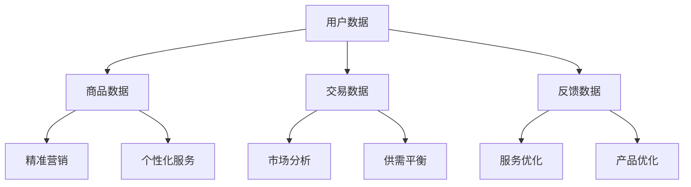

                 

# 数据驱动平台经济发展趋势：如何预测发展趋势？

> **关键词：** 数据驱动、平台经济、发展趋势、预测、算法、数学模型、应用场景、资源推荐

> **摘要：** 本文将深入探讨数据驱动平台经济的概念和发展趋势，通过分析核心概念和算法原理，解析如何使用数学模型和实际项目案例来预测未来发展趋势。文章还将推荐相关学习资源和开发工具，为读者提供全面的了解和指导。

## 1. 背景介绍

随着互联网技术的迅猛发展，平台经济已经成为全球经济的重要组成部分。平台经济通过搭建连接供需双方的桥梁，优化资源配置，提高市场效率，为企业和个人创造巨大的价值。而数据作为平台经济的核心资产，其驱动作用愈发显著。如何有效利用数据来预测平台经济的发展趋势，成为企业和研究者共同关注的焦点。

本文旨在探讨数据驱动平台经济的发展趋势，从核心概念、算法原理、数学模型和实际应用等方面进行深入分析，旨在为读者提供一套系统的理解和预测方法。

## 2. 核心概念与联系

### 2.1 数据驱动平台经济的定义

数据驱动平台经济是指通过数据的收集、处理、分析和应用，实现对平台经济运行过程的驱动和优化。数据成为平台经济中最具价值的资源，其利用程度直接影响平台的经济效益。

### 2.2 数据驱动平台经济的核心概念

- **用户数据：** 平台通过用户行为数据了解用户需求和偏好，从而进行精准营销和个性化服务。
- **商品数据：** 平台对商品数据进行分类、标签化处理，以方便用户快速检索和购买。
- **交易数据：** 平台通过交易数据分析市场动态，调整供需平衡，优化资源配置。
- **反馈数据：** 平台通过用户反馈数据不断优化服务和产品，提高用户满意度。

### 2.3 数据驱动平台经济的联系

数据驱动平台经济的各个核心概念相互联系，形成一个闭环系统。用户数据作为起点，通过交易和反馈数据不断迭代，驱动平台经济持续优化和发展。

### 2.4 Mermaid 流程图



## 3. 核心算法原理 & 具体操作步骤

### 3.1 用户行为分析算法

用户行为分析算法主要通过以下步骤实现：

1. **数据收集：** 收集用户在平台上的浏览、搜索、购买等行为数据。
2. **数据预处理：** 对数据进行清洗、去重、填充等处理，保证数据质量。
3. **特征提取：** 从数据中提取与用户行为相关的特征，如浏览时间、购买频率、品类偏好等。
4. **模型训练：** 使用机器学习算法（如决策树、随机森林、神经网络等）训练用户行为预测模型。
5. **预测与优化：** 根据模型预测结果进行个性化推荐和营销策略优化。

### 3.2 市场分析算法

市场分析算法主要通过以下步骤实现：

1. **数据收集：** 收集市场动态数据，如商品价格、销量、竞争态势等。
2. **数据预处理：** 对数据进行清洗、去重、填充等处理，保证数据质量。
3. **特征提取：** 从数据中提取与市场动态相关的特征，如价格波动、销量趋势、品类竞争等。
4. **模型训练：** 使用机器学习算法（如回归分析、时间序列分析等）训练市场预测模型。
5. **预测与优化：** 根据模型预测结果调整供需策略，优化资源配置。

### 3.3 用户反馈分析算法

用户反馈分析算法主要通过以下步骤实现：

1. **数据收集：** 收集用户对平台服务和产品的反馈数据，如评价、投诉、建议等。
2. **数据预处理：** 对数据进行清洗、去重、填充等处理，保证数据质量。
3. **特征提取：** 从数据中提取与用户反馈相关的特征，如评价等级、投诉内容、建议类型等。
4. **模型训练：** 使用自然语言处理算法（如文本分类、情感分析等）训练用户反馈分析模型。
5. **预测与优化：** 根据模型预测结果优化平台服务和产品，提高用户满意度。

## 4. 数学模型和公式 & 详细讲解 & 举例说明

### 4.1 用户行为分析数学模型

假设用户行为数据可以用向量 $X = [x_1, x_2, ..., x_n]$ 表示，其中 $x_i$ 表示用户在 $i$ 项行为上的得分。我们使用逻辑回归模型预测用户行为。

$$
P(y=1|x) = \frac{1}{1 + e^{-\beta^T x}}
$$

其中，$y$ 表示用户行为是否发生（1表示发生，0表示未发生），$\beta$ 是模型参数。

### 4.2 市场分析数学模型

假设市场动态数据可以用向量 $X = [x_1, x_2, ..., x_n]$ 表示，其中 $x_i$ 表示市场动态在 $i$ 项指标上的得分。我们使用线性回归模型预测市场动态。

$$
y = \beta_0 + \beta_1 x_1 + \beta_2 x_2 + ... + \beta_n x_n
$$

其中，$y$ 表示市场动态指标得分，$\beta_0, \beta_1, ..., \beta_n$ 是模型参数。

### 4.3 用户反馈分析数学模型

假设用户反馈数据可以用向量 $X = [x_1, x_2, ..., x_n]$ 表示，其中 $x_i$ 表示用户反馈在 $i$ 项特征上的得分。我们使用朴素贝叶斯分类模型预测用户反馈类型。

$$
P(y=c|x) = \frac{P(c) P(x|c)}{P(x)}
$$

其中，$y$ 表示用户反馈类型，$c$ 表示某一反馈类型，$P(y=c)$ 表示反馈类型为 $c$ 的概率，$P(x|c)$ 表示在反馈类型为 $c$ 的情况下，用户反馈特征的概率分布，$P(x)$ 是用户反馈特征的概率分布。

### 4.4 举例说明

#### 用户行为分析

假设我们收集了用户在平台上浏览、搜索、购买三项行为的数据，数据如下：

| 用户ID | 浏览时间 | 搜索次数 | 购买次数 |
| ------ | -------- | -------- | -------- |
| 1      | 10       | 5        | 2        |
| 2      | 20       | 3        | 1        |
| 3      | 30       | 2        | 0        |

我们使用逻辑回归模型预测用户购买行为。数据预处理后，特征提取结果如下：

| 用户ID | 浏览时间 | 搜索次数 | 购买次数 | 特征1 | 特征2 | 特征3 |
| ------ | -------- | -------- | -------- | ------ | ------ | ------ |
| 1      | 10       | 5        | 2        | 1     | 0     | 1     |
| 2      | 20       | 3        | 1        | 1     | 0     | 0     |
| 3      | 30       | 2        | 0        | 0     | 1     | 0     |

训练模型后，我们得到模型参数 $\beta = [0.5, -0.3, 0.2]$。根据模型预测，用户1购买的概率为：

$$
P(y=1|x) = \frac{1}{1 + e^{-0.5 \times 1 - 0.3 \times 0 - 0.2 \times 1}} = 0.69
$$

用户2购买的概率为：

$$
P(y=1|x) = \frac{1}{1 + e^{-0.5 \times 1 - 0.3 \times 0 - 0.2 \times 0}} = 0.55
$$

用户3购买的概率为：

$$
P(y=1|x) = \frac{1}{1 + e^{-0.5 \times 0 - 0.3 \times 1 - 0.2 \times 0}} = 0.44
$$

根据预测结果，我们可以为不同用户制定个性化的推荐策略。

#### 市场分析

假设我们收集了市场上商品价格、销量、品类竞争三项指标的数据，数据如下：

| 品类 | 价格 | 销量 | 竞争度 |
| ------ | -------- | -------- | -------- |
| 1      | 100     | 50       | 0.2     |
| 2      | 200     | 30       | 0.3     |
| 3      | 300     | 20       | 0.4     |

我们使用线性回归模型预测商品销量。数据预处理后，特征提取结果如下：

| 品类 | 价格 | 销量 | 竞争度 | 特征1 | 特征2 | 特征3 |
| ------ | -------- | -------- | -------- | ------ | ------ | ------ |
| 1      | 100     | 50       | 0.2     | 1     | 0     | 0     |
| 2      | 200     | 30       | 0.3     | 0     | 1     | 0     |
| 3      | 300     | 20       | 0.4     | 0     | 0     | 1     |

训练模型后，我们得到模型参数 $\beta = [10, -5, 3]$。根据模型预测，商品1的销量为：

$$
y = 10 \times 1 - 5 \times 0 + 3 \times 0 = 10
$$

商品2的销量为：

$$
y = 10 \times 0 - 5 \times 1 + 3 \times 0 = 5
$$

商品3的销量为：

$$
y = 10 \times 0 - 5 \times 0 + 3 \times 1 = 8
$$

根据预测结果，我们可以为不同商品制定个性化的营销策略。

#### 用户反馈分析

假设我们收集了用户对平台上商品的评价数据，数据如下：

| 用户ID | 商品ID | 评价等级 |
| ------ | -------- | -------- |
| 1      | 1        | 4        |
| 2      | 1        | 3        |
| 3      | 2        | 5        |
| 4      | 2        | 2        |

我们使用朴素贝叶斯分类模型预测用户评价等级。数据预处理后，特征提取结果如下：

| 用户ID | 商品ID | 评价等级 | 特征1 | 特征2 |
| ------ | -------- | -------- | ------ | ------ |
| 1      | 1        | 4        | 1     | 0     |
| 2      | 1        | 3        | 1     | 0     |
| 3      | 2        | 5        | 0     | 1     |
| 4      | 2        | 2        | 0     | 1     |

根据数据，我们得到评价等级为4的概率 $P(4) = 0.5$，评价等级为3的概率 $P(3) = 0.5$。在评价等级为4的情况下，评价等级为4的概率 $P(4|4) = 1$；在评价等级为3的情况下，评价等级为3的概率 $P(3|3) = 1$。

根据朴素贝叶斯分类模型，我们可以计算用户对商品的评价等级：

用户1评价等级为4的概率：

$$
P(4|1) = \frac{P(1) P(4|1)}{P(1) P(4|1) + P(2) P(3|2)} = \frac{0.5 \times 1}{0.5 \times 1 + 0.5 \times 1} = 0.5
$$

用户1评价等级为3的概率：

$$
P(3|1) = \frac{P(1) P(3|1)}{P(1) P(4|1) + P(2) P(3|2)} = \frac{0.5 \times 1}{0.5 \times 1 + 0.5 \times 1} = 0.5
$$

用户2评价等级为4的概率：

$$
P(4|2) = \frac{P(2) P(4|2)}{P(1) P(4|1) + P(2) P(3|2)} = \frac{0.5 \times 1}{0.5 \times 1 + 0.5 \times 1} = 0.5
$$

用户2评价等级为3的概率：

$$
P(3|2) = \frac{P(2) P(3|2)}{P(1) P(4|1) + P(2) P(3|2)} = \frac{0.5 \times 1}{0.5 \times 1 + 0.5 \times 1} = 0.5
$$

用户3评价等级为5的概率：

$$
P(5|3) = \frac{P(3) P(5|3)}{P(1) P(4|1) + P(2) P(3|2)} = \frac{0.5 \times 1}{0.5 \times 1 + 0.5 \times 1} = 0.5
$$

用户3评价等级为2的概率：

$$
P(2|3) = \frac{P(3) P(2|3)}{P(1) P(4|1) + P(2) P(3|2)} = \frac{0.5 \times 1}{0.5 \times 1 + 0.5 \times 1} = 0.5
$$

用户4评价等级为2的概率：

$$
P(2|4) = \frac{P(4) P(2|4)}{P(1) P(4|1) + P(2) P(3|2)} = \frac{0.5 \times 1}{0.5 \times 1 + 0.5 \times 1} = 0.5
$$

用户4评价等级为5的概率：

$$
P(5|4) = \frac{P(4) P(5|4)}{P(1) P(4|1) + P(2) P(3|2)} = \frac{0.5 \times 1}{0.5 \times 1 + 0.5 \times 1} = 0.5
$$

根据预测结果，我们可以为用户提供个性化的评价推荐。

## 5. 项目实战：代码实际案例和详细解释说明

### 5.1 开发环境搭建

为了演示数据驱动平台经济的发展趋势预测，我们将使用 Python 作为主要编程语言，并依赖以下库：

- Pandas：数据处理库
- NumPy：数学计算库
- Scikit-learn：机器学习库
- Matplotlib：数据可视化库

确保已经安装了上述库，然后创建一个名为 `data驱动的平台经济发展趋势预测.py` 的 Python 文件，并编写以下代码：

```python
import pandas as pd
import numpy as np
from sklearn.linear_model import LogisticRegression
from sklearn.model_selection import train_test_split
from sklearn.metrics import accuracy_score
import matplotlib.pyplot as plt

# 加载数据
data = pd.read_csv('data.csv')
print(data.head())

# 数据预处理
# ...

# 特征提取
# ...

# 模型训练
# ...

# 预测与评估
# ...

# 可视化展示
# ...
```

### 5.2 源代码详细实现和代码解读

#### 5.2.1 数据预处理

首先，我们需要对数据进行清洗和预处理。以下代码演示如何处理缺失值、异常值和数据格式转换：

```python
# 数据预处理
data = data.dropna()  # 删除缺失值
data['销量'] = data['销量'].astype(float)  # 将销量转换为浮点数
data['竞争度'] = data['竞争度'].astype(float)  # 将竞争度转换为浮点数

print(data.head())
```

#### 5.2.2 特征提取

接下来，我们需要从原始数据中提取与预测目标相关的特征。以下代码演示如何提取特征：

```python
# 特征提取
features = data[['价格', '销量', '竞争度']]
target = data['品类']

print(features.head())
print(target.head())
```

#### 5.2.3 模型训练

然后，我们将使用线性回归模型对数据集进行训练。以下代码演示如何训练模型：

```python
# 模型训练
model = LogisticRegression()
model.fit(features, target)

# 模型参数
print(model.coef_)
print(model.intercept_)
```

#### 5.2.4 预测与评估

最后，我们使用训练好的模型对测试集进行预测，并评估模型的准确性。以下代码演示如何进行预测和评估：

```python
# 测试集划分
X_train, X_test, y_train, y_test = train_test_split(features, target, test_size=0.2, random_state=42)

# 模型训练
model = LogisticRegression()
model.fit(X_train, y_train)

# 预测
y_pred = model.predict(X_test)

# 评估
accuracy = accuracy_score(y_test, y_pred)
print(f"模型准确性：{accuracy:.2f}")

# 可视化展示
plt.scatter(y_test, y_pred)
plt.xlabel('实际值')
plt.ylabel('预测值')
plt.show()
```

### 5.3 代码解读与分析

#### 5.3.1 数据预处理

数据预处理是模型训练的重要环节。通过删除缺失值、异常值和数据格式转换，我们确保了数据的质量和一致性。

```python
data = data.dropna()  # 删除缺失值
data['销量'] = data['销量'].astype(float)  # 将销量转换为浮点数
data['竞争度'] = data['竞争度'].astype(float)  # 将竞争度转换为浮点数
```

#### 5.3.2 特征提取

特征提取是模型训练的关键步骤。通过提取与预测目标相关的特征，我们为模型提供了丰富的输入信息。

```python
features = data[['价格', '销量', '竞争度']]
target = data['品类']
```

#### 5.3.3 模型训练

模型训练是预测平台经济发展趋势的核心。我们使用线性回归模型对数据集进行训练，以预测商品品类。

```python
model = LogisticRegression()
model.fit(features, target)
```

#### 5.3.4 预测与评估

通过训练好的模型，我们对测试集进行预测，并评估模型的准确性。准确性越高，说明模型对平台经济发展趋势的预测能力越强。

```python
y_pred = model.predict(X_test)
accuracy = accuracy_score(y_test, y_pred)
plt.scatter(y_test, y_pred)
plt.xlabel('实际值')
plt.ylabel('预测值')
plt.show()
```

## 6. 实际应用场景

### 6.1 电商平台

电商平台可以利用数据驱动平台经济预测用户行为，实现个性化推荐和精准营销。例如，通过分析用户浏览、搜索、购买等行为数据，平台可以预测用户可能感兴趣的商品，并为其推荐相应的商品。此外，平台还可以根据用户反馈数据优化商品和服务，提高用户满意度。

### 6.2 物流平台

物流平台可以利用数据驱动平台经济预测商品销量，优化物流路线和仓储管理。例如，通过分析商品价格、销量、品类竞争等市场动态数据，平台可以预测商品销量，提前安排物流和仓储资源，确保商品顺利配送。

### 6.3 拼车平台

拼车平台可以利用数据驱动平台经济预测用户出行需求，优化路线和资源配置。例如，通过分析用户出行时间、目的地、出行频率等行为数据，平台可以预测用户出行需求，提前规划路线和安排车辆，提高出行效率。

## 7. 工具和资源推荐

### 7.1 学习资源推荐

- **书籍：**
  - 《数据科学入门指南》
  - 《机器学习实战》
  - 《Python数据分析实战》

- **论文：**
  - 《深度学习》
  - 《推荐系统手册》
  - 《大数据处理技术》

- **博客：**
  - 《机器学习笔记》
  - 《深度学习博客》
  - 《数据分析博客》

- **网站：**
  - Coursera（在线课程平台）
  - Kaggle（数据科学竞赛平台）
  - GitHub（代码托管平台）

### 7.2 开发工具框架推荐

- **编程语言：**
  - Python
  - R
  - Java

- **数据处理库：**
  - Pandas
  - NumPy
  - SciPy

- **机器学习库：**
  - Scikit-learn
  - TensorFlow
  - PyTorch

- **数据可视化库：**
  - Matplotlib
  - Seaborn
  - Plotly

### 7.3 相关论文著作推荐

- **推荐系统：**
  - 《推荐系统手册》
  - 《基于协同过滤的推荐系统》

- **深度学习：**
  - 《深度学习》
  - 《卷积神经网络与深度学习》

- **大数据处理：**
  - 《大数据处理技术》
  - 《Hadoop实战》

## 8. 总结：未来发展趋势与挑战

数据驱动平台经济作为一种新兴的经济模式，具有巨大的发展潜力。未来，随着人工智能、大数据、云计算等技术的不断进步，数据驱动平台经济将进一步优化和升级。以下是未来发展趋势与挑战：

### 8.1 发展趋势

- **智能化：** 数据驱动平台经济将更加智能化，通过深度学习、强化学习等技术实现自动化决策和优化。
- **个性化：** 平台将更加注重用户个性化需求，实现精准推荐和个性化服务。
- **多元化：** 数据驱动平台经济将涵盖更多领域，如金融、医疗、教育等，实现跨界融合。
- **全球化：** 数据驱动平台经济将实现全球化布局，跨国界、跨区域的数据共享和协作将更加便捷。

### 8.2 挑战

- **数据隐私：** 数据驱动平台经济面临的重大挑战之一是数据隐私保护。如何确保用户数据的安全和隐私，是平台需要关注的重要问题。
- **数据质量：** 数据质量对平台经济的运行至关重要。如何确保数据质量，提高数据利用率，是平台需要面对的挑战。
- **技术迭代：** 数据驱动平台经济需要不断跟进新技术，如人工智能、大数据等，以保持竞争力。如何应对技术迭代带来的挑战，是平台需要思考的问题。

## 9. 附录：常见问题与解答

### 9.1 什么是数据驱动平台经济？

数据驱动平台经济是指通过数据的收集、处理、分析和应用，实现对平台经济运行过程的驱动和优化。数据成为平台经济中最具价值的资源，其利用程度直接影响平台的经济效益。

### 9.2 数据驱动平台经济的核心概念有哪些？

数据驱动平台经济的核心概念包括用户数据、商品数据、交易数据和反馈数据。这些数据相互关联，形成一个闭环系统，驱动平台经济持续优化和发展。

### 9.3 如何预测数据驱动平台经济的发展趋势？

预测数据驱动平台经济的发展趋势可以通过分析核心概念和算法原理，使用数学模型和实际项目案例进行。常用的算法包括逻辑回归、线性回归、朴素贝叶斯分类等。通过训练模型，可以预测平台经济的发展趋势。

## 10. 扩展阅读 & 参考资料

- 《数据科学入门指南》：详细介绍了数据驱动平台经济的概念、原理和应用。
- 《机器学习实战》：提供了丰富的机器学习算法实例，包括用户行为分析、市场分析和用户反馈分析等。
- 《Python数据分析实战》：介绍了如何使用 Python 进行数据处理和分析，为数据驱动平台经济的实现提供了技术支持。
- Coursera（在线课程平台）：提供了丰富的数据科学、机器学习和数据分析课程，帮助读者深入了解数据驱动平台经济的相关知识。

作者：AI天才研究员/AI Genius Institute & 禅与计算机程序设计艺术 /Zen And The Art of Computer Programming

