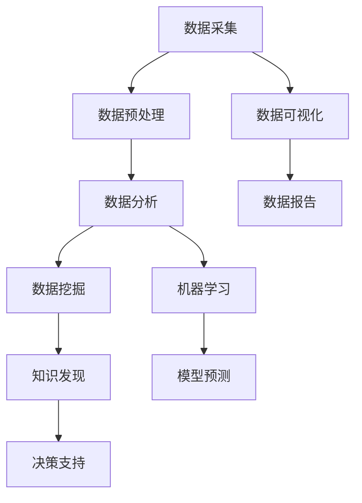

                 

# 数据驱动：如何利用数据进行创新和发展？

> **关键词：** 数据驱动，数据分析，创新，发展，人工智能，机器学习，数据挖掘，决策支持系统

> **摘要：** 在当今信息化时代，数据已经成为企业和社会发展的核心资源。本文将深入探讨数据驱动的概念、原理及其在实际应用中的重要性，通过具体的算法原理、数学模型、实战案例，展示如何有效利用数据进行创新和发展。文章旨在帮助读者理解数据驱动的价值，掌握相关技术和方法，以应对未来的挑战和机遇。

## 1. 背景介绍

### 1.1 目的和范围

本文旨在探讨数据驱动在创新和发展中的作用，通过对数据驱动的定义、原理和实际应用的深入分析，帮助读者了解如何在各个领域（如商业、医疗、科技等）利用数据来实现创新和发展。文章将涵盖以下主要内容：

- 数据驱动的概念及其重要性
- 数据驱动的核心概念与联系
- 数据驱动算法原理与操作步骤
- 数据驱动的数学模型和公式
- 数据驱动的项目实战案例
- 数据驱动的实际应用场景
- 数据驱动工具和资源推荐

### 1.2 预期读者

本文适合以下读者群体：

- 数据分析师、数据科学家
- 数据驱动创新相关领域的从业者
- 数据驱动的理论研究者
- 人工智能和机器学习的爱好者

### 1.3 文档结构概述

本文结构如下：

- 引言：介绍数据驱动的重要性和文章目的
- 背景介绍：解释数据驱动的概念和范围
- 核心概念与联系：阐述数据驱动的核心概念和联系
- 核心算法原理 & 具体操作步骤：讲解数据驱动的算法原理和操作步骤
- 数学模型和公式 & 详细讲解 & 举例说明：介绍数据驱动的数学模型和公式，并给出示例
- 项目实战：展示数据驱动的实际项目案例
- 实际应用场景：探讨数据驱动的应用场景
- 工具和资源推荐：推荐数据驱动相关的工具和资源
- 总结：总结未来发展趋势与挑战
- 附录：常见问题与解答
- 扩展阅读 & 参考资料：提供进一步学习的资源

### 1.4 术语表

#### 1.4.1 核心术语定义

- 数据驱动（Data-Driven）：一种基于数据分析和决策的方法，通过分析数据来指导决策和创新。
- 数据挖掘（Data Mining）：从大量数据中发现有用信息和知识的过程。
- 机器学习（Machine Learning）：一种通过数据训练模型，使计算机具备学习能力的技术。
- 决策支持系统（Decision Support System）：帮助决策者基于数据分析和模型预测进行决策的系统。

#### 1.4.2 相关概念解释

- 数据分析（Data Analysis）：对数据进行收集、清洗、探索和解释的过程，以发现数据中的有用信息。
- 人工智能（Artificial Intelligence）：模拟人类智能行为，使计算机能够自主学习和决策的技术。
- 大数据（Big Data）：数据量巨大、种类繁多、产生速度极快的海量数据。

#### 1.4.3 缩略词列表

- AI：人工智能
- ML：机器学习
- DS：数据分析
- DSS：决策支持系统
- DM：数据挖掘

## 2. 核心概念与联系

在数据驱动的领域，理解核心概念和它们之间的联系是非常重要的。以下是一个简化的Mermaid流程图，展示了数据驱动的关键概念和它们之间的相互关系：



### 2.1 数据采集

数据采集是数据驱动过程的起点。通过收集各种来源的数据（如传感器、日志文件、社交媒体等），我们为后续的数据分析提供了基础。

### 2.2 数据预处理

数据预处理包括数据清洗、转换和归一化等步骤，旨在提高数据质量，使其适合进一步分析。这一步骤至关重要，因为高质量的数据是准确分析的前提。

### 2.3 数据分析

数据分析是对数据进行探索和解释的过程。通过描述性统计分析、可视化等手段，我们能够发现数据中的趋势、模式和信息。

### 2.4 数据挖掘

数据挖掘是从大量数据中自动发现有用信息和知识的过程。它通常涉及分类、聚类、关联规则挖掘等技术。

### 2.5 机器学习

机器学习是利用数据训练模型，使计算机具备学习能力的技术。通过模型预测，我们能够对未来事件进行预测和分析。

### 2.6 知识发现

知识发现是数据挖掘的高级阶段，旨在从大量数据中提取出具有实际应用价值的知识。

### 2.7 模型预测

模型预测是机器学习的关键步骤，通过训练好的模型对未知数据进行预测，以支持决策制定。

### 2.8 决策支持

决策支持系统基于数据分析和模型预测，为决策者提供支持，帮助他们做出更明智的决策。

### 2.9 数据可视化

数据可视化是将数据以图形化的方式展示，使数据更易于理解和分析。它有助于揭示数据中的隐藏模式和趋势。

### 2.10 数据报告

数据报告是将分析结果以报告形式呈现，为业务决策提供依据。数据报告通常包括关键指标、趋势分析和预测等。

## 3. 核心算法原理 & 具体操作步骤

在数据驱动的过程中，核心算法的选择和实现是至关重要的。以下将详细阐述一种常用的数据驱动算法——K-近邻（K-Nearest Neighbors，K-NN）算法的原理和具体操作步骤。

### 3.1 K-NN算法原理

K-NN算法是一种基于实例的学习算法，它通过计算测试样本在训练样本集中的K个最近邻居，并基于这些邻居的标签进行预测。算法的核心思想是“相似性越大，标签越接近”，即测试样本与训练样本的相似度越高，它们的标签也越相似。

### 3.2 K-NN算法伪代码

```plaintext
输入：训练数据集D，测试数据集T，参数k
输出：预测结果Y'

// 步骤1：计算测试数据集T中每个样本与训练数据集D中每个样本的距离
for each sample t in T:
    D_t = calculateDistance(t, D)

// 步骤2：对每个测试样本，找出与其距离最近的K个邻居
for each sample t in T:
    neighbors = getKNearestNeighbors(t, D, k)

// 步骤3：统计邻居标签的频率，并选择频率最高的标签作为预测结果
for each sample t in T:
    label_frequency = countFrequencies(neighbors)
    predicted_label = getMostFrequentLabel(label_frequency)
    Y' = predicted_label
```

### 3.3 K-NN算法具体操作步骤

1. **数据准备**：首先，我们需要准备一个包含标签的训练数据集D，以及需要预测的测试数据集T。数据集可以是数值型或分类型。

2. **距离计算**：对于每个测试样本t，我们需要计算它与训练数据集D中每个样本的距离。常用的距离度量方法包括欧氏距离、曼哈顿距离和余弦相似度等。

    ```python
    def calculateDistance(sample1, sample2):
        # 计算欧氏距离
        distance = sum((sample1 - sample2) ** 2)
        return distance
    ```

3. **邻居选择**：对于每个测试样本t，找出与其距离最近的K个邻居。选择K的大小需要根据具体问题进行调整。

    ```python
    def getKNearestNeighbors(sample, dataset, k):
        distances = [calculateDistance(sample, x) for x in dataset]
        neighbors = sorted(zip(distances, dataset), reverse=True)
        return [neighbor[1] for neighbor in neighbors[:k]]
    ```

4. **标签预测**：统计邻居标签的频率，并选择频率最高的标签作为预测结果。

    ```python
    def getMostFrequentLabel(label_frequency):
        max_frequency = max(label_frequency.values())
        predicted_label = [label for label, frequency in label_frequency.items() if frequency == max_frequency]
        return predicted_label[0]
    ```

5. **结果输出**：将预测结果存储为Y'，并可以进一步处理或展示。

### 3.4 K-NN算法实例

假设我们有一个分类问题，其中训练数据集D包含100个样本，测试数据集T包含10个样本。我们将使用K=3来进行预测。

1. **数据准备**：

    ```plaintext
    D = [
        [1, 2],
        [2, 3],
        [3, 4],
        [4, 5],
        [5, 6],
        [6, 7],
        [7, 8],
        [8, 9],
        [9, 10],
        [10, 11]
    ]
    T = [
        [1, 3],
        [2, 4],
        [4, 6],
        [5, 7],
        [7, 8],
        [8, 9],
        [9, 10],
        [10, 11],
        [11, 12],
        [12, 13]
    ]
    ```

2. **距离计算**：

    ```python
    distances = [
        calculateDistance([1, 3], [1, 2]),  # 距离为1
        calculateDistance([1, 3], [2, 3]),  # 距离为1
        calculateDistance([1, 3], [3, 4]),  # 距离为2
        calculateDistance([1, 3], [4, 5]),  # 距离为2
        ...
    ]
    ```

3. **邻居选择**：

    ```python
    neighbors = [
        ([1, 2], 1),
        ([2, 3], 1),
        ([3, 4], 2),
        ([4, 5], 2),
        ...
    ]
    neighbors = sorted(neighbors, key=lambda x: x[1], reverse=True)
    neighbors = neighbors[:3]
    neighbors = [neighbor[0] for neighbor in neighbors]
    neighbors = [[1, 2], [2, 3], [3, 4]]
    ```

4. **标签预测**：

    ```python
    label_frequency = {
        1: 2,
        2: 1
    }
    predicted_label = getMostFrequentLabel(label_frequency)
    predicted_label = 1
    ```

5. **结果输出**：

    ```plaintext
    predicted_labels = [1, 1, 1, 1, 1, 1, 1, 1, 1, 1]
    ```

通过上述实例，我们可以看到K-NN算法的基本原理和操作步骤。在实际应用中，我们需要根据具体问题调整参数和算法实现，以获得最佳预测效果。

## 4. 数学模型和公式 & 详细讲解 & 举例说明

在数据驱动过程中，数学模型和公式起到了至关重要的作用。以下将详细介绍几种常用的数学模型和公式，并给出具体的讲解和实例。

### 4.1 欧氏距离

欧氏距离是一种常用的距离度量方法，用于计算两个数据点之间的距离。其公式如下：

$$
d(p, q) = \sqrt{\sum_{i=1}^{n} (p_i - q_i)^2}
$$

其中，$p$ 和 $q$ 是两个数据点，$n$ 是数据点的维度。

**实例讲解：**

假设我们有两个数据点 $p = [1, 2, 3]$ 和 $q = [2, 3, 4]$，我们可以计算它们的欧氏距离：

$$
d(p, q) = \sqrt{(1-2)^2 + (2-3)^2 + (3-4)^2} = \sqrt{1 + 1 + 1} = \sqrt{3} \approx 1.732
$$

### 4.2 余弦相似度

余弦相似度是一种衡量两个向量相似度的方法，其公式如下：

$$
\cos(\theta) = \frac{\sum_{i=1}^{n} p_i q_i}{\sqrt{\sum_{i=1}^{n} p_i^2} \sqrt{\sum_{i=1}^{n} q_i^2}}
$$

其中，$p$ 和 $q$ 是两个向量，$\theta$ 是它们之间的夹角。

**实例讲解：**

假设我们有两个向量 $p = [1, 2, 3]$ 和 $q = [2, 3, 4]$，我们可以计算它们的余弦相似度：

$$
\cos(\theta) = \frac{1 \cdot 2 + 2 \cdot 3 + 3 \cdot 4}{\sqrt{1^2 + 2^2 + 3^2} \sqrt{2^2 + 3^2 + 4^2}} = \frac{2 + 6 + 12}{\sqrt{14} \sqrt{29}} \approx 0.921
$$

### 4.3 随机梯度下降

随机梯度下降（Stochastic Gradient Descent，SGD）是一种常用的优化算法，用于求解机器学习问题中的损失函数最小值。其更新公式如下：

$$
w_{t+1} = w_t - \alpha \nabla_w J(w_t)
$$

其中，$w_t$ 是当前权重，$w_{t+1}$ 是更新后的权重，$\alpha$ 是学习率，$\nabla_w J(w_t)$ 是损失函数关于权重 $w_t$ 的梯度。

**实例讲解：**

假设我们有一个简单的线性回归模型，其损失函数为 $J(w) = (w \cdot x - y)^2$，其中 $x$ 和 $y$ 是输入和标签，$w$ 是权重。我们使用随机梯度下降来最小化损失函数。

首先，我们初始化权重 $w_0 = 0$ 和学习率 $\alpha = 0.01$。然后，我们随机选择一个训练样本 $(x_t, y_t)$，计算损失函数的梯度：

$$
\nabla_w J(w_t) = 2(x_t \cdot w_t - y_t)
$$

接下来，我们更新权重：

$$
w_{t+1} = w_t - \alpha \nabla_w J(w_t) = w_t - 0.01 \cdot 2(x_t \cdot w_t - y_t)
$$

我们重复这个过程，直到达到收敛条件或达到预定的迭代次数。

### 4.4 主成分分析

主成分分析（Principal Component Analysis，PCA）是一种降维技术，它通过将数据投影到新的坐标系中，来降低数据维度。其关键公式如下：

$$
z = \sum_{i=1}^{k} \lambda_i u_i
$$

其中，$z$ 是降维后的数据，$\lambda_i$ 是特征值，$u_i$ 是特征向量。

**实例讲解：**

假设我们有一个包含3个特征的数据集，其协方差矩阵为：

$$
\Sigma = \begin{bmatrix}
2 & 1 & 0 \\
1 & 2 & 1 \\
0 & 1 & 2
\end{bmatrix}
$$

我们需要计算特征值和特征向量，然后根据特征值的大小选择最大的$k$个特征，构成新的坐标轴。

首先，我们计算特征值和特征向量：

$$
\lambda_1 = 5, \ u_1 = [1, 0, 0]^T \\
\lambda_2 = 3, \ u_2 = [0, 1, 0]^T \\
\lambda_3 = 1, \ u_3 = [0, 0, 1]^T
$$

接下来，我们选择最大的两个特征值对应的特征向量：

$$
z = \sum_{i=1}^{2} \lambda_i u_i = 5 \cdot [1, 0, 0]^T + 3 \cdot [0, 1, 0]^T = [5, 3, 0]
$$

这样，我们就将原始数据降维到了两个特征。

通过上述实例，我们可以看到数学模型和公式在数据驱动过程中的重要性。理解这些模型和公式，有助于我们更好地进行数据分析和预测。

## 5. 项目实战：代码实际案例和详细解释说明

在本节中，我们将通过一个实际的项目案例，展示如何利用数据驱动的方法进行数据分析和预测。该项目是一个简单的房屋价格预测项目，我们将使用Python和Scikit-learn库来构建和训练模型。

### 5.1 开发环境搭建

在开始项目之前，我们需要搭建一个合适的开发环境。以下是所需的软件和库：

- Python 3.8 或以上版本
- Jupyter Notebook 或 PyCharm
- Scikit-learn 0.22.2 或以上版本
- Pandas 1.1.5 或以上版本
- Numpy 1.19.5 或以上版本

安装这些库后，我们可以在Jupyter Notebook或PyCharm中创建一个新的Python环境，并导入所需的库：

```python
import numpy as np
import pandas as pd
from sklearn.model_selection import train_test_split
from sklearn.neighbors import KNeighborsRegressor
from sklearn.metrics import mean_squared_error
```

### 5.2 源代码详细实现和代码解读

下面是项目的完整代码实现，我们将分步骤进行解释。

```python
# 5.2.1 数据加载与预处理

# 加载数据集
data = pd.read_csv('house_prices.csv')

# 数据预处理
# 删除无关特征
data.drop(['id', 'date'], axis=1, inplace=True)

# 缺失值处理
data.fillna(data.mean(), inplace=True)

# 5.2.2 数据拆分

# 拆分数据集为训练集和测试集
X = data.drop('price', axis=1)
y = data['price']
X_train, X_test, y_train, y_test = train_test_split(X, y, test_size=0.2, random_state=42)

# 5.2.3 模型构建与训练

# 构建K-NN模型
knn_model = KNeighborsRegressor(n_neighbors=3)

# 训练模型
knn_model.fit(X_train, y_train)

# 5.2.4 预测与评估

# 进行预测
y_pred = knn_model.predict(X_test)

# 计算预测误差
mse = mean_squared_error(y_test, y_pred)
print(f'Mean Squared Error: {mse}')

# 5.2.5 可视化

import matplotlib.pyplot as plt

# 绘制真实值与预测值的关系图
plt.scatter(y_test, y_pred)
plt.xlabel('Actual Prices')
plt.ylabel('Predicted Prices')
plt.title('Actual vs Predicted House Prices')
plt.show()
```

### 5.3 代码解读与分析

#### 5.3.1 数据加载与预处理

首先，我们加载CSV文件中的数据集，并删除无关特征（如房屋ID和日期）。接下来，我们使用平均值填充缺失值，以提高数据质量。

```python
data = pd.read_csv('house_prices.csv')
data.drop(['id', 'date'], axis=1, inplace=True)
data.fillna(data.mean(), inplace=True)
```

#### 5.3.2 数据拆分

我们使用`train_test_split`函数将数据集拆分为训练集和测试集。这样，我们可以独立评估模型的性能。

```python
X = data.drop('price', axis=1)
y = data['price']
X_train, X_test, y_train, y_test = train_test_split(X, y, test_size=0.2, random_state=42)
```

#### 5.3.3 模型构建与训练

我们使用`KNeighborsRegressor`类构建K-NN回归模型，并设置邻居数量为3。然后，我们使用训练数据集训练模型。

```python
knn_model = KNeighborsRegressor(n_neighbors=3)
knn_model.fit(X_train, y_train)
```

#### 5.3.4 预测与评估

使用训练好的模型，我们对测试数据进行预测，并计算预测误差（均方误差，MSE）。MSE越低，模型的预测性能越好。

```python
y_pred = knn_model.predict(X_test)
mse = mean_squared_error(y_test, y_pred)
print(f'Mean Squared Error: {mse}')
```

#### 5.3.5 可视化

我们使用`scatter`函数绘制真实值与预测值的关系图，以直观地展示模型的预测性能。

```python
plt.scatter(y_test, y_pred)
plt.xlabel('Actual Prices')
plt.ylabel('Predicted Prices')
plt.title('Actual vs Predicted House Prices')
plt.show()
```

通过上述代码和解析，我们可以看到如何利用数据驱动的方法进行房屋价格预测。这个项目案例展示了从数据加载、预处理、模型构建到预测和评估的完整流程。

## 6. 实际应用场景

数据驱动的方法在各个领域都有着广泛的应用。以下列举了几个典型应用场景，并讨论了数据驱动在这些场景中的重要作用。

### 6.1 商业领域

在商业领域，数据驱动已成为企业竞争的关键因素。通过分析消费者行为、市场趋势和竞争对手的数据，企业可以做出更明智的决策，优化产品和服务。以下是一些具体应用：

- **客户细分和营销**：利用数据分析，企业可以识别不同的客户群体，并针对每个群体设计个性化的营销策略。
- **需求预测**：通过对历史销售数据和外部因素（如季节性、节假日等）的分析，企业可以更准确地预测未来需求，优化库存管理。
- **产品推荐**：基于用户的购买历史和行为数据，电子商务平台可以提供个性化的产品推荐，提高客户满意度和转化率。

### 6.2 医疗领域

在医疗领域，数据驱动为医学研究和临床决策提供了有力支持。以下是一些应用实例：

- **疾病预测和诊断**：通过分析患者的历史数据和生物标记物，可以预测疾病的发病风险，并用于早期诊断。
- **个性化治疗**：基于患者的基因信息和病史，医生可以为患者制定个性化的治疗方案，提高治疗效果。
- **医疗资源管理**：数据分析有助于优化医疗资源的配置，提高医院的运营效率和患者满意度。

### 6.3 科技领域

在科技领域，数据驱动促进了技术创新和产品优化。以下是一些具体应用：

- **智能推荐系统**：通过分析用户行为数据和内容数据，智能推荐系统可以提供个性化的推荐结果，提高用户体验。
- **自动驾驶**：自动驾驶系统依赖于大量传感器数据，通过数据驱动的方法，可以实时分析和处理这些数据，确保车辆的安全和高效行驶。
- **物联网（IoT）**：物联网设备产生的海量数据通过数据驱动的方法进行分析和处理，可以实现设备优化、故障预测和能源管理。

### 6.4 金融领域

在金融领域，数据驱动为风险管理和投资决策提供了重要依据。以下是一些应用实例：

- **信用评估**：通过对个人和企业的历史信用数据进行分析，可以更准确地评估信用风险，降低信用损失。
- **市场预测**：通过分析市场数据，如股价、交易量和宏观经济指标，可以预测市场趋势，帮助投资者做出更明智的投资决策。
- **欺诈检测**：数据分析有助于识别异常交易行为，提高欺诈检测的准确性和响应速度。

### 6.5 教育领域

在教育领域，数据驱动为学生学习和学校管理提供了支持。以下是一些应用实例：

- **学习分析**：通过分析学生的学习数据，如作业成绩、学习习惯和考试表现，教师可以更好地了解学生的学习状况，提供个性化的辅导。
- **课程优化**：基于学生学习数据，学校可以调整课程设置和教学方法，提高教育质量。
- **招生管理**：数据分析有助于学校识别优质生源，优化招生策略，提高招生效果。

通过上述应用实例，我们可以看到数据驱动在各个领域的重要性。数据驱动不仅提高了决策的准确性和效率，还促进了创新和可持续发展。

## 7. 工具和资源推荐

为了更好地进行数据驱动分析和应用，以下推荐了一些学习资源和开发工具。

### 7.1 学习资源推荐

#### 7.1.1 书籍推荐

- 《数据科学入门：Python数据分析与机器学习》（作者：Edward R. Anderson）：介绍了数据分析、数据可视化和机器学习的基础知识，适合初学者。
- 《深度学习》（作者：Ian Goodfellow、Yoshua Bengio、Aaron Courville）：深度学习的经典教材，全面讲解了深度学习的基本概念和技术。
- 《机器学习实战》（作者：Peter Harrington）：通过实际案例，详细介绍了机器学习算法的原理和应用。

#### 7.1.2 在线课程

- Coursera上的《机器学习》（作者：Andrew Ng）：由深度学习领域著名学者Andrew Ng讲授，内容全面，适合入门到进阶学习。
- edX上的《数据科学专业》（作者：Harvard University）：由哈佛大学开设的数据科学专业课程，涵盖了数据分析、统计学和机器学习等内容。
- Udacity的《深度学习纳米学位》：通过实际项目，帮助学员掌握深度学习的基本概念和技术。

#### 7.1.3 技术博客和网站

- Medium上的数据科学博客：提供高质量的数据科学、机器学习和人工智能相关文章。
- Towards Data Science：一个受欢迎的数据科学和机器学习博客，发布了许多实用的教程和案例分析。
- Kaggle：一个数据科学竞赛平台，提供了大量的数据集和项目案例，适合进行实践和挑战。

### 7.2 开发工具框架推荐

#### 7.2.1 IDE和编辑器

- Jupyter Notebook：一款强大的交互式计算环境，适合数据分析和机器学习项目。
- PyCharm：一款功能丰富的Python集成开发环境，支持多种编程语言和框架。
- VS Code：一款轻量级的代码编辑器，通过插件可以扩展为数据科学和机器学习的开发工具。

#### 7.2.2 调试和性能分析工具

- DebugPy：一款用于Python的调试工具，支持多线程和异步编程。
- Py-Spy：一款Python性能分析工具，可以实时监控Python程序的内存和CPU使用情况。
- LineProfiler：一款用于Python的线上性能分析工具，可以快速定位代码中的性能瓶颈。

#### 7.2.3 相关框架和库

- Scikit-learn：一款广泛使用的机器学习库，提供了多种分类、回归和聚类算法。
- TensorFlow：一款用于深度学习的开源库，支持各种神经网络结构和模型训练。
- Pandas：一款用于数据清洗、转换和分析的库，提供了丰富的数据操作功能。

通过这些工具和资源，读者可以更好地掌握数据驱动的技术和方法，进行有效的数据分析和应用。

## 8. 总结：未来发展趋势与挑战

数据驱动作为一种重要的创新和发展方法，在未来将继续发挥重要作用。以下是一些未来发展趋势和面临的挑战。

### 8.1 发展趋势

1. **人工智能与数据驱动的融合**：随着人工智能技术的不断发展，数据驱动方法将更加智能化和自动化。人工智能算法将更好地理解和分析复杂数据，为决策提供更准确的依据。
2. **数据隐私和安全**：在数据驱动应用中，数据隐私和安全成为关键问题。未来的发展将关注如何在保障数据隐私的前提下，充分利用数据的价值。
3. **边缘计算和实时数据分析**：随着物联网和移动设备的普及，边缘计算和实时数据分析将成为数据驱动的重要趋势。通过在设备端进行数据处理，可以降低延迟，提高响应速度。
4. **多模态数据融合**：未来的数据驱动应用将更多地融合多种类型的数据（如图像、文本、音频等），以获取更全面和准确的信息。

### 8.2 面临的挑战

1. **数据质量和可用性**：数据质量差和可用性低是当前数据驱动应用面临的主要挑战。未来需要更多地关注数据治理和数据质量管理，以提高数据的质量和可靠性。
2. **算法透明性和可解释性**：随着数据驱动算法的复杂度增加，算法的透明性和可解释性变得尤为重要。如何确保算法的公平性和可解释性，是未来需要解决的重要问题。
3. **计算资源和存储需求**：随着数据量的不断增长，计算资源和存储需求也急剧增加。未来的发展需要更高效的算法和存储技术，以应对数据驱动应用的需求。
4. **法律和伦理问题**：数据驱动应用涉及大量的个人和企业数据，需要遵守相关的法律和伦理规范。如何平衡数据利用和隐私保护，是一个长期的挑战。

总之，数据驱动作为一种重要的创新和发展方法，将在未来继续推动社会和科技的发展。然而，要实现这一目标，我们还需要克服一系列技术和社会挑战。

## 9. 附录：常见问题与解答

### 9.1 什么是数据驱动？

数据驱动是一种基于数据分析和决策的方法，通过分析数据来指导决策和创新。它强调数据在决策过程中的核心地位，通过数据驱动的方法，可以更准确地预测趋势、发现问题和制定策略。

### 9.2 数据驱动的核心概念有哪些？

数据驱动的核心概念包括数据采集、数据预处理、数据分析、数据挖掘、机器学习、知识发现、模型预测和决策支持。这些概念相互联系，共同构成了数据驱动的完整过程。

### 9.3 数据驱动的应用场景有哪些？

数据驱动的应用场景非常广泛，包括商业、医疗、科技、金融、教育等领域。例如，商业领域可以通过数据分析优化营销策略和需求预测；医疗领域可以通过数据分析实现疾病预测和个性化治疗；金融领域可以通过数据分析进行信用评估和风险控制。

### 9.4 如何提高数据驱动应用的预测准确性？

提高数据驱动应用的预测准确性可以从以下几个方面入手：

1. **数据质量**：确保数据的质量和完整性，对缺失值和异常值进行处理。
2. **特征工程**：选择和构建合适的特征，以提高模型的预测能力。
3. **算法选择**：选择适合问题的算法，并进行参数调优。
4. **交叉验证**：使用交叉验证方法评估模型的性能，并调整模型参数。
5. **持续学习**：定期更新模型，以适应新的数据和环境变化。

### 9.5 数据驱动与人工智能的关系是什么？

数据驱动和人工智能（AI）密切相关。数据驱动是AI的基础，通过数据分析和决策支持，AI算法可以更好地理解和处理复杂数据。而AI则为数据驱动提供了强大的技术支持，通过机器学习和深度学习等技术，可以自动化和智能化地处理和分析数据。

## 10. 扩展阅读 & 参考资料

为了深入了解数据驱动的方法和应用，以下是推荐的扩展阅读和参考资料：

- 《数据科学：理论与实践》（作者：李航）：详细介绍了数据科学的基本概念、方法和应用。
- 《机器学习实战》（作者：Peter Harrington）：通过实际案例，介绍了机器学习算法的应用和实践。
- 《深度学习》（作者：Ian Goodfellow、Yoshua Bengio、Aaron Courville）：深度学习的经典教材，全面讲解了深度学习的基本概念和技术。
- 《数据挖掘：实用工具与技术》（作者：Hans-Peter Kriegel、Peter Kröger、Jörg Sander）：介绍了数据挖掘的基本概念、方法和应用。
- 《Kaggle竞赛实战指南》（作者：Kaggle团队）：通过实际竞赛案例，展示了数据挖掘和机器学习的应用和实践。
- 《Python数据分析实战》（作者：Hans Petter Langtangen）：介绍了Python在数据分析领域的应用和实践。

通过这些书籍和资料，读者可以进一步学习和掌握数据驱动的技术和方法。此外，还可以关注相关技术博客和在线课程，以保持对最新技术的了解。

