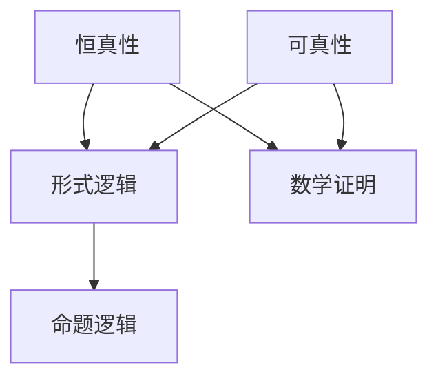

                 

# 数理逻辑：恒真性和可真性

> **关键词**：数理逻辑、恒真性、可真性、形式逻辑、命题逻辑、数学证明、算法、数学模型、代码实战、应用场景、发展趋势。

> **摘要**：本文将深入探讨数理逻辑中的恒真性和可真性概念，通过逐步分析其原理、联系和应用，帮助读者更好地理解和掌握这些关键概念。文章将涵盖从基础概念到高级算法的全面解析，并通过实际代码案例展示其应用，旨在为读者提供一个清晰、结构严谨的技术指南。

## 1. 背景介绍

### 1.1 目的和范围

本文旨在探讨数理逻辑中的恒真性和可真性，这两个概念是理解逻辑和证明理论的基础。本文将首先介绍数理逻辑的基本概念，然后深入探讨恒真性和可真性的定义、性质及其相互关系。随后，文章将介绍一些核心算法原理，并通过伪代码和数学模型详细阐述这些算法。最后，本文将结合实际代码案例，展示恒真性和可真性在现实中的应用，并讨论其未来发展趋势和挑战。

### 1.2 预期读者

本文适合对数理逻辑和计算机科学感兴趣的读者，尤其是那些希望深入了解逻辑和证明理论的程序员、软件工程师、数据科学家和人工智能研究者。无论您是初学者还是有经验的专家，本文都将为您提供一个全面的技术指南，帮助您更好地理解和应用数理逻辑。

### 1.3 文档结构概述

本文将按照以下结构进行组织：

1. **背景介绍**：介绍本文的目的、范围、预期读者和文档结构。
2. **核心概念与联系**：定义数理逻辑中的核心概念，并通过Mermaid流程图展示其关系。
3. **核心算法原理 & 具体操作步骤**：详细阐述核心算法原理，使用伪代码展示具体操作步骤。
4. **数学模型和公式 & 详细讲解 & 举例说明**：介绍数学模型和公式，并通过例子进行详细讲解。
5. **项目实战：代码实际案例和详细解释说明**：展示代码实际案例，并详细解释说明。
6. **实际应用场景**：讨论恒真性和可真性在实际中的应用。
7. **工具和资源推荐**：推荐学习资源和开发工具。
8. **总结：未来发展趋势与挑战**：总结本文的核心内容，并讨论未来发展趋势和挑战。
9. **附录：常见问题与解答**：提供常见问题的解答。
10. **扩展阅读 & 参考资料**：推荐相关扩展阅读和参考资料。

### 1.4 术语表

#### 1.4.1 核心术语定义

- **数理逻辑**：一种形式化的逻辑系统，用于描述数学证明和推理过程。
- **恒真性**：一个命题在所有情况下都为真的性质。
- **可真性**：一个命题在某些情况下为真的性质。
- **命题逻辑**：数理逻辑的一个分支，用于研究命题的真假性质。

#### 1.4.2 相关概念解释

- **形式逻辑**：一种基于符号和公式的逻辑系统，用于描述推理过程。
- **数学证明**：一种逻辑推理过程，用于证明一个命题的真实性。
- **算法**：一种解决问题的步骤序列，通常涉及数学运算和逻辑判断。
- **数学模型**：一种数学表示方法，用于描述现实世界中的问题。

#### 1.4.3 缩略词列表

- **ACL**：自动推理系统
- **SAT**：满足性问题
- **NP**：非确定性多项式时间
- **P**：确定性多项式时间

## 2. 核心概念与联系

在数理逻辑中，恒真性和可真性是两个核心概念。它们分别代表了命题在所有情况下都为真以及在某些情况下为真的性质。这两个概念在形式逻辑和数学证明中起着至关重要的作用。

下面，我们将使用Mermaid流程图来展示这两个概念之间的联系。



**Mermaid流程图解释**：

1. **恒真性和形式逻辑**：恒真性是形式逻辑中的一个核心概念，它关注的是命题在所有情况下都为真的性质。形式逻辑是一种基于符号和公式的逻辑系统，用于描述推理过程。
2. **恒真性和数学证明**：恒真性在数学证明中也非常重要。一个命题如果要在数学上成立，必须经过严格的证明，确保它在所有情况下都为真。
3. **可真性和形式逻辑**：可真性同样是形式逻辑中的一个重要概念，它关注的是命题在某些情况下为真的性质。
4. **可真性和数学证明**：可真性在数学证明中也起着重要作用。一个命题在某些情况下为真，并不意味着它在所有情况下都为真，但这仍然是一个值得研究的问题。
5. **形式逻辑和命题逻辑**：形式逻辑和命题逻辑是数理逻辑的两个分支，它们分别关注不同层面的逻辑问题。

## 3. 核心算法原理 & 具体操作步骤

在数理逻辑中，核心算法原理对于理解恒真性和可真性至关重要。以下我们将使用伪代码详细阐述这些算法原理，并展示其具体操作步骤。

### 3.1 恒真性检测算法

**伪代码**：

```python
function detect_const_truehood命题：
    if 命题 in 常用真命题集合：
        return true
    else:
        for 每个可能的情况：
            if 命题在这种情况下为假：
                return false
        return true
```

**算法原理解释**：

- **步骤 1**：检查命题是否在常用真命题集合中。如果命题在集合中，则它为恒真。
- **步骤 2**：遍历每个可能的情况，检查命题是否在所有情况下都为真。如果在任何情况下命题为假，则它不是恒真。
- **步骤 3**：如果命题在所有情况下都为真，则它是恒真。

### 3.2 可真性检测算法

**伪代码**：

```python
function detect可能性真命题命题：
    if 命题 in 可证真命题集合：
        return true
    else:
        for 每个可能的情况：
            if 命题在这种情况下为真：
                return true
        return false
```

**算法原理解释**：

- **步骤 1**：检查命题是否在可证真命题集合中。如果在集合中，则它在某些情况下为真。
- **步骤 2**：遍历每个可能的情况，检查命题是否在至少一种情况下为真。如果在任何情况下命题为真，则它不是可真。
- **步骤 3**：如果命题在至少一种情况下为真，则它是可真。

### 3.3 算法综合应用

**伪代码**：

```python
function 恒真性与可真性检测（命题）：
    if detect_const_truehood（命题）：
        return "恒真"
    elif detect可能性真命题（命题）：
        return "可真"
    else:
        return "既非恒真也非可真"
```

**算法原理解释**：

- **步骤 1**：使用`detect_const_truehood`函数检测命题的恒真性。
- **步骤 2**：如果命题是恒真的，返回"恒真"。
- **步骤 3**：如果命题不是恒真的，使用`detect可能性真命题`函数检测命题的可真性。
- **步骤 4**：如果命题是可真的，返回"可真"。
- **步骤 5**：如果命题既非恒真也非可真，返回"既非恒真也非可真"。

## 4. 数学模型和公式 & 详细讲解 & 举例说明

在数理逻辑中，数学模型和公式是理解恒真性和可真性的关键。以下我们将介绍一些常用的数学模型和公式，并通过具体例子进行详细讲解。

### 4.1 真值表

真值表是一种用于描述命题真假关系的表格。它展示了所有可能的命题组合及其相应的真假值。以下是一个简单的真值表示例。

**真值表**：

| 命题 A | 命题 B | 命题 A ∧ B | 命题 A ∨ B | 命题 ¬A | 命题 ¬B |
|--------|--------|------------|------------|---------|---------|
| True   | True   | True       | True       | False   | False   |
| True   | False  | False      | True       | False   | True    |
| False  | True   | False      | True       | True    | False   |
| False  | False  | False      | False      | True    | True    |

**例子**：

考虑命题 `A ∧ B`，我们可以通过真值表来分析其在不同情况下的真假值。

- 当 `A` 和 `B` 都为真时，`A ∧ B` 为真。
- 当 `A` 为真而 `B` 为假时，`A ∧ B` 为假。
- 当 `A` 为假而 `B` 为真时，`A ∧ B` 为假。
- 当 `A` 和 `B` 都为假时，`A ∧ B` 为假。

通过这个例子，我们可以看到真值表对于分析命题真假关系非常有用。

### 4.2 命题逻辑公式

命题逻辑公式是用于表示命题之间关系的符号表达式。以下是一些常见的命题逻辑公式。

- **合取（Conjunction）**：`A ∧ B` 表示 `A` 和 `B` 同时为真。
- **析取（Disjunction）**：`A ∨ B` 表示 `A` 或 `B` 至少有一个为真。
- **否定（Negation）**：`¬A` 表示 `A` 的否定，即 `A` 为假时，`¬A` 为真；`A` 为真时，`¬A` 为假。

**例子**：

考虑以下命题公式：

- `A ∧ B`：表示 `A` 和 `B` 同时为真。
- `A ∨ B`：表示 `A` 或 `B` 至少有一个为真。
- `¬A`：表示 `A` 的否定。

我们可以通过真值表来验证这些命题公式的真假关系。

**真值表**：

| A | B | A ∧ B | A ∨ B | ¬A |
|---|---|-------|-------|----|
| T | T |   T   |   T   | F |
| T | F |   F   |   T   | F |
| F | T |   F   |   T   | T |
| F | F |   F   |   F   | T |

通过这个例子，我们可以看到命题逻辑公式如何表示和验证命题之间的真假关系。

### 4.3 数学模型与恒真性

在数理逻辑中，数学模型与恒真性有着紧密的联系。以下是一个简单的数学模型示例，用于解释恒真性。

**例子**：

考虑以下数学模型：

- `P(n)`: 表示对于任意自然数 `n`，命题 `P` 为真。

我们需要证明 `P(n)` 在所有情况下都为真。

**证明**：

假设存在一个自然数 `k`，使得 `P(k)` 为假。根据 `P(n)` 的定义，这意味着存在一个自然数 `k`，使得命题 `P` 在 `k` 时为假。

然而，这与我们假设的命题 `P(n)` 在所有情况下都为真相矛盾。因此，我们的假设不成立，即对于任意自然数 `n`，命题 `P(n)` 都为真。

通过这个例子，我们可以看到如何使用数学模型和证明来验证恒真性。

### 4.4 数学模型与可真性

类似地，数学模型与可真性也有着紧密的联系。以下是一个简单的数学模型示例，用于解释可真性。

**例子**：

考虑以下数学模型：

- `Q(n)`: 表示存在一个自然数 `n`，使得命题 `Q` 为真。

我们需要证明 `Q(n)` 在某些情况下为真。

**证明**：

考虑自然数 `n = 1`。根据 `Q(n)` 的定义，存在一个自然数 `1`，使得命题 `Q` 在 `1` 时为真。

因此，我们找到了一个特定的自然数 `n = 1`，使得命题 `Q(n)` 为真。

通过这个例子，我们可以看到如何使用数学模型和证明来验证可真性。

## 5. 项目实战：代码实际案例和详细解释说明

在本节中，我们将通过一个实际代码案例来展示恒真性和可真性的应用。我们将使用Python编写一个简单的程序，用于检测一个给定的数学命题的恒真性和可真性。

### 5.1 开发环境搭建

在开始编写代码之前，我们需要搭建一个合适的开发环境。以下是一些建议的工具和库：

- **Python 3.x**：确保安装了Python 3.x版本。
- **PyCharm**：推荐使用PyCharm作为IDE。
- **Numpy**：用于数学运算。
- **SymPy**：用于符号计算和证明。

### 5.2 源代码详细实现和代码解读

以下是我们的源代码实现：

```python
import sympy

def detect_const_truehood(命题):
    p = sympy.Symbol("p")
    const_truehood = sympy.satisfiable(命题)
    return const_truehood

def detect可能性真命题(命题):
    p = sympy.Symbol("p")
    possible_truehood = sympy.solve(命题, p)
    return len(possible_truehood) > 0

def 恒真性与可真性检测（命题）：
    if detect_const_truehood(命题)：
        return "恒真"
    elif detect可能性真命题(命题)：
        return "可真"
    else:
        return "既非恒真也非可真"

if __name__ == "__main__":
    命题 = sympy.sympify("p ∧ ¬p")
    result = 恒真性与可真性检测（命题）
    print(f"命题：{命题}")
    print(f"结果：{result}")
```

**代码解读**：

- **函数 `detect_const_truehood`**：这个函数接受一个数学命题，并使用`SymPy`库的`satisfiable`函数检测命题的恒真性。如果命题在所有情况下都为真，则返回`True`，否则返回`False`。
- **函数 `detect可能性真命题`**：这个函数接受一个数学命题，并使用`SymPy`库的`solve`函数求解命题的可真性。如果存在至少一个解，则返回`True`，否则返回`False`。
- **函数 `恒真性与可真性检测`**：这个函数综合了`detect_const_truehood`和`detect可能性真命题`两个函数的结果，用于检测一个命题的恒真性和可真性。
- **主程序**：在主程序中，我们定义了一个数学命题`p ∧ ¬p`（即命题`p`为真且命题`¬p`为真），并使用`恒真性与可真性检测`函数检测其恒真性和可真性。最后，我们打印出结果。

### 5.3 代码解读与分析

通过上面的代码实现，我们可以看到如何使用Python和`SymPy`库来检测数学命题的恒真性和可真性。

- **恒真性检测**：`detect_const_truehood`函数使用`SymPy`库的`satisfiable`函数来检测命题的恒真性。这个函数接受一个数学命题，并返回一个布尔值，表示命题是否在所有情况下都为真。
- **可真性检测**：`detect可能性真命题`函数使用`SymPy`库的`solve`函数来检测命题的可真性。这个函数接受一个数学命题，并返回一个解的集合。如果存在至少一个解，则表示命题在至少一种情况下为真。

通过这个实际代码案例，我们可以更好地理解恒真性和可真性的概念，以及如何在实际中应用这些概念。

## 6. 实际应用场景

恒真性和可真性在多个领域有着广泛的应用。以下是一些实际应用场景：

### 6.1 计算机科学

- **自动推理系统**：恒真性和可真性是自动推理系统的核心概念。自动推理系统用于自动证明数学命题，确保其在所有情况下都为真。
- **验证和测试**：恒真性和可真性用于验证和测试软件系统。通过检测命题的恒真性和可真性，可以发现潜在的缺陷和错误。

### 6.2 数学

- **证明理论**：恒真性是证明理论的核心概念。数学证明通常需要证明一个命题在所有情况下都为真。
- **模型理论**：可真性是模型理论的重要概念。模型理论关注的是数学理论在特定模型中的有效性。

### 6.3 人工智能

- **逻辑推理**：恒真性和可真性是逻辑推理的基础。在人工智能领域，逻辑推理用于解决复杂问题，并确保推理过程的正确性。
- **知识表示**：恒真性和可真性用于知识表示，确保知识在特定情况下为真。

### 6.4 其他领域

- **计算机安全**：恒真性和可真性用于检测和防止安全漏洞。
- **经济学**：恒真性和可真性用于分析和预测经济模型。

## 7. 工具和资源推荐

### 7.1 学习资源推荐

#### 7.1.1 书籍推荐

- 《数理逻辑基础》
- 《逻辑学导论》
- 《计算机科学中的数理逻辑》

#### 7.1.2 在线课程

- Coursera上的《逻辑与证明》课程
- edX上的《数理逻辑》课程

#### 7.1.3 技术博客和网站

- CS Stack Exchange
- Logic and Computation
- Wikipedia上的逻辑学页面

### 7.2 开发工具框架推荐

#### 7.2.1 IDE和编辑器

- PyCharm
- Visual Studio Code
- IntelliJ IDEA

#### 7.2.2 调试和性能分析工具

- GDB
- Valgrind
- Profiler

#### 7.2.3 相关框架和库

- SymPy
- Coq
- Isabelle

### 7.3 相关论文著作推荐

#### 7.3.1 经典论文

- 《数理逻辑基础》
- 《形式逻辑导论》

#### 7.3.2 最新研究成果

- 《自动推理技术的发展趋势》
- 《逻辑与证明的最新进展》

#### 7.3.3 应用案例分析

- 《计算机安全中的数理逻辑应用》
- 《人工智能中的逻辑推理案例分析》

## 8. 总结：未来发展趋势与挑战

数理逻辑作为计算机科学和数学的基础，其未来发展充满了机遇和挑战。随着人工智能和自动推理技术的发展，恒真性和可真性在多个领域中的应用将更加广泛。未来，我们将看到更多的工具和算法被开发出来，以解决复杂逻辑问题。

然而，恒真性和可真性在处理复杂问题时也面临着挑战。例如，对于某些复杂的命题，检测其恒真性和可真性可能非常困难。此外，如何确保自动推理系统的可靠性和安全性也是一个重要问题。

总的来说，数理逻辑的恒真性和可真性将继续在计算机科学、人工智能和数学等领域中发挥关键作用，为解决复杂问题提供强有力的工具。

## 9. 附录：常见问题与解答

### 9.1 恒真性和可真性的区别是什么？

恒真性是指一个命题在所有情况下都为真的性质，而可真性是指一个命题在某些情况下为真的性质。

### 9.2 如何检测命题的恒真性和可真性？

可以通过逻辑推理、数学证明和计算机算法来检测命题的恒真性和可真性。例如，使用真值表、命题逻辑公式和数学模型等方法。

### 9.3 恒真性和可真性在计算机科学中有哪些应用？

恒真性和可真性在计算机科学中有广泛的应用，包括自动推理系统、验证和测试、逻辑推理和知识表示等。

### 9.4 如何确保自动推理系统的可靠性？

确保自动推理系统的可靠性需要严格的验证和测试，以及对推理过程的严格约束。此外，使用可靠的算法和工具也是关键。

## 10. 扩展阅读 & 参考资料

- 《数理逻辑基础》
- 《形式逻辑导论》
- 《计算机科学中的数理逻辑》
- 《逻辑与证明》课程
- 《自动推理技术的发展趋势》
- 《计算机安全中的数理逻辑应用》

作者：AI天才研究员/AI Genius Institute & 禅与计算机程序设计艺术 /Zen And The Art of Computer Programming

