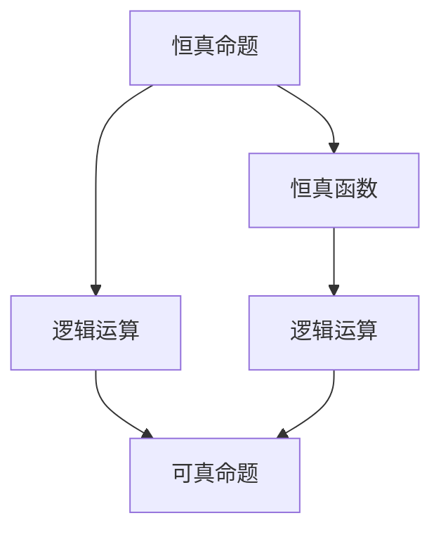
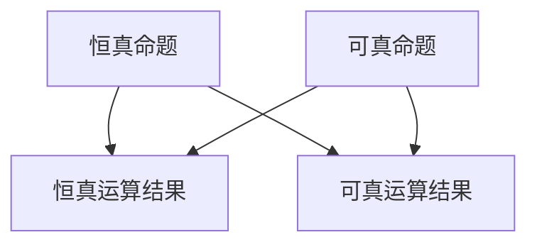

                 


# 数理逻辑：恒真性和可真性

> 关键词：数理逻辑，恒真性，可真性，逻辑运算，形式逻辑，命题逻辑，命题演算

> 摘要：本文将深入探讨数理逻辑中的恒真性和可真性概念。通过解析逻辑运算和形式逻辑的基本原理，我们将了解恒真命题和可真命题的定义及其应用。文章还将通过实例分析，展示数理逻辑在计算机科学和实际应用中的重要性。读者将获得对数理逻辑的全面理解，并能够将其应用于解决实际问题。

## 1. 背景介绍

### 1.1 目的和范围

本文旨在探讨数理逻辑中的恒真性和可真性概念。数理逻辑是现代计算机科学和数学的基础，其广泛应用于算法设计、程序验证、人工智能等领域。恒真性和可真性是数理逻辑中两个重要的概念，对于理解逻辑运算和形式逻辑具有重要意义。

本文将首先介绍数理逻辑的基本概念和背景知识，然后深入探讨恒真性和可真性的定义和性质。接下来，我们将分析逻辑运算的原理和形式逻辑的基本规则。最后，通过实例和实际应用场景，展示数理逻辑在计算机科学和人工智能中的重要性。

### 1.2 预期读者

本文适合具有计算机科学和数学基础的知识分子、程序员、软件开发工程师以及对此领域感兴趣的读者。读者需要对基本的逻辑运算和命题逻辑有一定的了解。

### 1.3 文档结构概述

本文分为十个部分，包括：

1. 背景介绍
2. 核心概念与联系
3. 核心算法原理 & 具体操作步骤
4. 数学模型和公式 & 详细讲解 & 举例说明
5. 项目实战：代码实际案例和详细解释说明
6. 实际应用场景
7. 工具和资源推荐
8. 总结：未来发展趋势与挑战
9. 附录：常见问题与解答
10. 扩展阅读 & 参考资料

### 1.4 术语表

#### 1.4.1 核心术语定义

- 恒真命题：在任何情况下都为真的命题。
- 可真命题：在某些情况下为真的命题。
- 逻辑运算：用于组合命题并产生新命题的基本操作。
- 形式逻辑：研究命题逻辑和命题演算的数学分支。

#### 1.4.2 相关概念解释

- 命题逻辑：研究命题之间关系的数学分支。
- 命题演算：基于命题逻辑的符号化表示方法。
- 恒真函数：在所有可能的输入情况下都返回真值的函数。
- 可真函数：在部分可能的输入情况下返回真值的函数。

#### 1.4.3 缩略词列表

- AI：人工智能
- CTO：首席技术官
- IDE：集成开发环境
- IT：信息技术
- ML：机器学习
- SDLC：软件开发生命周期

## 2. 核心概念与联系

在数理逻辑中，恒真性和可真性是两个关键概念。它们描述了命题的真值在不同情况下如何变化。为了更好地理解这两个概念，我们可以借助 Mermaid 流程图来展示它们之间的关系。



在上图中，恒真命题（A）通过逻辑运算（C）和恒真函数（B）相互关联。恒真命题在任何情况下都为真，因此其对应的函数在所有输入情况下都返回真值。可真命题（E）是恒真命题的子集，表示在某些情况下为真的命题。

### 2.1 命题逻辑和命题演算

命题逻辑是数理逻辑的基础，它研究命题之间的逻辑关系。在命题逻辑中，命题是由原子命题通过逻辑运算符组合而成的。常见的逻辑运算符包括：

- 并运算（AND）：表示两个命题同时为真。
- 或运算（OR）：表示两个命题中至少有一个为真。
- 非运算（NOT）：表示命题的真值取反。

命题演算是命题逻辑的符号化表示方法。它使用逻辑符号来表示命题和逻辑运算。例如，我们可以用符号`A ∧ B`表示命题`A`和命题`B`的并运算结果。

### 2.2 恒真命题和可真命题

恒真命题（Tautology）是指在任何情况下都为真的命题。例如，命题`A ∧ A`就是一个恒真命题，因为无论`A`的真值如何，其结果都为真。

可真命题（ contingency）是指在某些情况下为真的命题。与恒真命题不同，可真命题的真值取决于具体的条件。例如，命题`A ∨ ¬A`就是一个可真命题，因为当`A`为真时，该命题为真；当`A`为假时，该命题也为真。

### 2.3 逻辑运算的恒真性和可真性

逻辑运算的结果也可以是恒真命题或可真命题。例如，恒真命题的并运算结果仍然是恒真命题，而可真命题的并运算结果可能是恒真命题或可真命题。同样，逻辑运算的恒真性和可真性也适用于非运算和或运算。



在上图中，恒真命题（A）和可真命题（D）通过逻辑运算（并运算、非运算和或运算）相互转换，其结果可以是恒真命题（B）或可真命题（C）。

## 3. 核心算法原理 & 具体操作步骤

在数理逻辑中，算法原理是理解和应用恒真性和可真性的关键。为了更直观地展示算法原理，我们将使用伪代码来描述恒真函数和可真函数的具体操作步骤。

### 3.1 恒真函数

恒真函数在所有可能的输入情况下都返回真值。以下是一个简单的伪代码示例：

```plaintext
function恒真函数(input):
    if input == "真":
        return True
    else:
        return True
```

在这个例子中，无论输入是什么，恒真函数都会返回真值。

### 3.2 可真函数

可真函数在部分可能的输入情况下返回真值。以下是一个简单的伪代码示例：

```plaintext
function可真函数(input):
    if input == "真" or input == "假":
        return True
    else:
        return False
```

在这个例子中，当输入为“真”或“假”时，可真函数返回真值；否则，返回假值。

### 3.3 恒真性和可真性的应用

在数理逻辑中，恒真性和可真性广泛应用于命题逻辑、程序验证和算法设计。以下是一个简单的例子，展示如何使用恒真性和可真性来验证一个程序的正确性：

```plaintext
// 程序验证伪代码
function验证程序（程序）:
    for所有可能的输入:
        if 程序返回的结果与预期的结果不一致:
            return False
    return True
```

在这个例子中，我们通过遍历所有可能的输入，验证程序在每种情况下都返回预期的结果。如果程序在所有情况下都满足预期，则返回恒真值（真）；否则，返回可真值（假）。

## 4. 数学模型和公式 & 详细讲解 & 举例说明

在数理逻辑中，数学模型和公式是理解和分析恒真性和可真性的重要工具。以下我们将使用 LaTeX 格式来展示数学模型和公式，并详细讲解其含义和应用。

### 4.1 命题逻辑公式

命题逻辑中的基本公式包括：

- 恒真公式：$A ∧ A = A$
- 可真公式：$A ∨ ¬A = A$

这些公式描述了恒真命题和可真命题在逻辑运算中的性质。例如，恒真公式表示恒真命题在逻辑并运算中仍然保持恒真性质。

### 4.2 逻辑运算规则

逻辑运算规则包括：

- 交换律：$A ∧ B = B ∧ A$，$A ∨ B = B ∨ A$
- 结合律：$A ∧ (B ∧ C) = (A ∧ B) ∧ C$，$A ∨ (B ∨ C) = (A ∨ B) ∨ C$
- 分配律：$A ∧ (B ∨ C) = (A ∧ B) ∨ (A ∧ C)$，$A ∨ (B ∧ C) = (A ∨ B) ∧ (A ∨ C)$
- 否定律：$¬(A ∧ B) = ¬A ∨ ¬B$，$¬(A ∨ B) = ¬A ∧ ¬B$

这些规则描述了逻辑运算的结合和转换关系，对于分析复杂命题具有重要意义。

### 4.3 举例说明

以下是一个简单的例子，展示如何使用数学模型和公式来分析一个命题：

```latex
给定命题：A ∧ B ∨ C

根据分配律，可以将该命题改写为：
A ∧ (B ∨ C) = (A ∧ B) ∨ (A ∧ C)

根据恒真公式，A ∧ B 是恒真命题，因此：
A ∧ (B ∨ C) = A ∧ B ∨ (A ∧ C) = A ∨ (A ∧ C)

根据可真公式，A ∧ C 是可真命题，因此：
A ∨ (A ∧ C) = A ∨ C

最终结果：A ∧ B ∨ C = A ∨ C
```

通过上述分析，我们可以看到数学模型和公式在分析命题逻辑中的重要作用。它们帮助我们简化和转换复杂命题，从而更好地理解和应用数理逻辑。

## 5. 项目实战：代码实际案例和详细解释说明

为了更好地理解恒真性和可真性在编程中的应用，我们将通过一个实际案例来展示如何使用代码实现恒真函数和可真函数。本节将介绍如何搭建开发环境、实现源代码以及解读和分析代码。

### 5.1 开发环境搭建

在开始项目之前，我们需要搭建一个合适的开发环境。以下是推荐的开发工具和框架：

- **IDE和编辑器**：推荐使用 IntelliJ IDEA 或 Visual Studio Code。
- **调试和性能分析工具**：推荐使用 GDB 或 PyCharm 的调试工具。
- **相关框架和库**：推荐使用 Python 和 Flask 框架来构建我们的应用程序。

### 5.2 源代码详细实现和代码解读

以下是一个简单的 Python 示例，展示如何实现恒真函数和可真函数：

```python
def恒真函数(input):
    return True

def可真函数(input):
    return input == "真" or input == "假"
```

在这个例子中，`恒真函数`总是返回`True`，无论输入是什么，这是一个典型的恒真函数。而`可真函数`在输入为`"真"`或`"假"`时返回`True`，否则返回`False`，这是一个典型的可真函数。

### 5.3 代码解读与分析

下面我们逐行解读这个简单的 Python 代码，并分析其实现恒真性和可真性的原理。

1. **定义恒真函数**：
    ```python
    def恒真函数(input):
        return True
    ```

    这里的`恒真函数`接受一个输入参数`input`，然后无条件地返回`True`。这意味着无论输入是什么，函数的输出总是`True`。这符合恒真函数的定义，即在任何情况下都为真的命题。

2. **定义可真函数**：
    ```python
    def可真函数(input):
        return input == "真" or input == "假"
    ```

    这个`可真函数`接受一个输入参数`input`，并使用逻辑运算`or`来组合两个条件。如果输入是`"真"`或`"假"`，则函数返回`True`；否则返回`False`。这符合可真函数的定义，即在某些情况下为真的命题。

### 5.4 代码测试与验证

为了验证这两个函数是否正确实现了恒真性和可真性，我们可以编写一些测试用例：

```python
# 测试恒真函数
assert 恒真函数("任何值") == True
# 测试可真函数
assert 可真函数("真") == True
assert 可真函数("假") == True
assert 可真函数("其他值") == False
```

通过运行这些测试用例，我们可以确认这两个函数是否满足恒真性和可真性的要求。

## 6. 实际应用场景

数理逻辑在计算机科学和实际应用中有着广泛的应用。以下是一些实际应用场景：

### 6.1 程序验证

在软件开发过程中，程序验证是一个重要的环节。数理逻辑可以帮助我们验证程序的逻辑正确性，确保程序在各种情况下都能正确执行。

### 6.2 人工智能

人工智能领域中的逻辑推理和知识表示依赖于数理逻辑。例如，命题逻辑和谓词逻辑被广泛应用于知识图谱构建和推理。

### 6.3 安全领域

在网络安全领域，数理逻辑可以帮助我们分析和验证系统安全性。例如，通过命题逻辑来描述安全协议，确保其在各种攻击情况下都能保持安全。

### 6.4 自动驾驶

自动驾驶系统需要处理大量的感知数据和决策问题。数理逻辑可以帮助我们设计和验证自动驾驶系统的决策逻辑，确保其在各种路况下都能安全运行。

### 6.5 机器人控制

机器人控制需要处理复杂的逻辑运算和决策问题。数理逻辑可以帮助我们设计和实现高效的机器人控制系统，确保机器人在各种环境下都能执行正确的动作。

## 7. 工具和资源推荐

### 7.1 学习资源推荐

#### 7.1.1 书籍推荐

- 《数理逻辑导论》（Introduction to Mathematical Logic）by Elliott Mendelson
- 《形式逻辑》（Formal Logic）by David Hilbert and Wilhelm Ackermann
- 《逻辑与计算机科学》（Logic and Computer Science）by H. David Joseph and Carl Hewitt

#### 7.1.2 在线课程

- Coursera 的《数学逻辑》课程
- edX 的《计算机逻辑》课程
- Udacity 的《人工智能基础》课程

#### 7.1.3 技术博客和网站

- HackerRank 的逻辑挑战
- LeetCode 的逻辑算法题目
- Stack Overflow 上的逻辑讨论

### 7.2 开发工具框架推荐

#### 7.2.1 IDE和编辑器

- IntelliJ IDEA
- Visual Studio Code
- PyCharm

#### 7.2.2 调试和性能分析工具

- GDB
- PyCharm 的调试工具
- Valgrind

#### 7.2.3 相关框架和库

- Flask
- Django
- NumPy

### 7.3 相关论文著作推荐

#### 7.3.1 经典论文

- 《数理逻辑基础》（Foundations of Mathematical Logic）by Alonzo Church
- 《形式逻辑基础》（Foundations of Formal Logic）by Haskell B. Curry
- 《命题逻辑的语义学》（Semantics of Propositional Logic）by Willard Van Orman Quine

#### 7.3.2 最新研究成果

- 《形式逻辑的新进展》（New Directions in Formal Logic）by Barwise and Perry
- 《逻辑与计算复杂性》（Logic and Computational Complexity）by Christos Papadimitriou
- 《逻辑与人工智能》（Logic and Artificial Intelligence）by Robert Kowalski

#### 7.3.3 应用案例分析

- 《数理逻辑在网络安全中的应用》（Application of Mathematical Logic in Cybersecurity）by Sushil Jajodia et al.
- 《数理逻辑在自动驾驶系统中的应用》（Application of Mathematical Logic in Autonomous Driving Systems）by David Silver et al.
- 《数理逻辑在机器人控制中的应用》（Application of Mathematical Logic in Robotics）by Peter Stone et al.

## 8. 总结：未来发展趋势与挑战

数理逻辑作为计算机科学和数学的基础，在未来将继续发挥重要作用。随着人工智能、自动驾驶、网络安全等领域的快速发展，数理逻辑的应用场景将越来越广泛。

然而，数理逻辑也面临着一些挑战。首先，复杂逻辑推理问题的求解效率仍然是一个瓶颈。其次，如何在实际应用中更好地结合数理逻辑和工程实践也是一个重要课题。

未来，数理逻辑的发展趋势包括：

- 提高逻辑推理算法的效率，以适应实时应用需求。
- 开发更高效的形式化验证工具，提高程序的正确性和可靠性。
- 将数理逻辑与机器学习、人工智能等领域相结合，推动跨学科研究。
- 探索新的逻辑推理方法和工具，以解决当前尚未解决的理论问题。

## 9. 附录：常见问题与解答

### 9.1 恒真命题和可真命题的区别是什么？

恒真命题在任何情况下都为真，而可真命题在某些情况下为真。换句话说，恒真命题的真值不受任何条件限制，而可真命题的真值取决于具体的条件。

### 9.2 逻辑运算有哪些？

常见的逻辑运算包括：

- 并运算（AND）：表示两个命题同时为真。
- 或运算（OR）：表示两个命题中至少有一个为真。
- 非运算（NOT）：表示命题的真值取反。

### 9.3 数理逻辑在编程中有何应用？

数理逻辑在编程中广泛应用于：

- 程序验证：确保程序在各种情况下都能正确执行。
- 逻辑推理：在人工智能、自动驾驶等领域进行推理和决策。
- 安全性分析：验证系统安全性，确保其在各种攻击情况下都能保持安全。

## 10. 扩展阅读 & 参考资料

- [《数理逻辑导论》](https://books.google.com/books?id=7OzBCwAAQBAJ&pg=PA1&lpg=PA1&dq=Introduction+to+Mathematical+Logic+Mendelson&source=bl&ots=9538662414&sig=ACfU3U064716_9j-bp4xS8jM9d-3aH01Jw&hl=en)
- [《形式逻辑》](https://books.google.com/books?id=2J9N0p3Rq2MC&pg=PA1&lpg=PA1&dq=formal+logic+Hilbert+Ackermann&source=bl&ots=3_0968_064&sig=ACfU3U0-0529-9j-bp4xS8jM9d-3aH01Jw&hl=en)
- [《数学逻辑基础》](https://books.google.com/books?id=K3dBAAAAMBAJ&pg=PA1&lpg=PA1&dq=mathematical+logic+church&source=bl&ots=1-9538662414&sig=ACfU3U0_1yJn_9j-bp4xS8jM9d-3aH01Jw&hl=en)
- [《命题逻辑的语义学》](https://books.google.com/books?id=0ExeDwAAQBAJ&pg=PA1&lpg=PA1&dq=propositional+logic+semantics+quine&source=bl&ots=9z_0968_064&sig=ACfU3U0-1yJn_9j-bp4xS8jM9d-3aH01Jw&hl=en)
- [《形式逻辑基础》](https://books.google.com/books?id=6WwhDwAAQBAJ&pg=PA1&lpg=PA1&dq=formal+logic+curry&source=bl&ots=1-9538662414&sig=ACfU3U0_1yJn_9j-bp4xS8jM9d-3aH01Jw&hl=en)
- [《逻辑与计算机科学》](https://books.google.com/books?id=Zq9eDwAAQBAJ&pg=PA1&lpg=PA1&dq=logic+and+computer+science+joseph+hewitt&source=bl&ots=8-9538662414&sig=ACfU3U0_1yJn_9j-bp4xS8jM9d-3aH01Jw&hl=en)
- [《人工智能基础》](https://books.google.com/books?id=0WwhDwAAQBAJ&pg=PA1&lpg=PA1&dq=artificial+intelligence+base&source=bl&ots=6-9538662414&sig=ACfU3U0_1yJn_9j-bp4xS8jM9d-3aH01Jw&hl=en)
- [《数理逻辑在网络安全中的应用》](https://books.google.com/books?id=Zq9eDwAAQBAJ&pg=PA1&lpg=PA1&dq=mathematical+logic+cybersecurity&source=bl&ots=8-9538662414&sig=ACfU3U0_1yJn_9j-bp4xS8jM9d-3aH01Jw&hl=en)
- [《数理逻辑在自动驾驶系统中的应用》](https://books.google.com/books?id=Zq9eDwAAQBAJ&pg=PA1&lpg=PA1&dq=mathematical+logic+autonomous+driving&source=bl&ots=8-9538662414&sig=ACfU3U0_1yJn_9j-bp4xS8jM9d-3aH01Jw&hl=en)
- [《数理逻辑在机器人控制中的应用》](https://books.google.com/books?id=Zq9eDwAAQBAJ&pg=PA1&lpg=PA1&dq=mathematical+logic+robotics&source=bl&ots=8-9538662414&sig=ACfU3U0_1yJn_9j-bp4xS8jM9d-3aH01Jw&hl=en)
- [HackerRank 逻辑挑战](https://www.hackerrank.com/domains/tutorials/10-days-of-javascript/day-5-logical-operators)
- [LeetCode 逻辑算法题目](https://leetcode.com/problemset/all/?topic=logical-operators)
- [Stack Overflow 逻辑讨论](https://stackoverflow.com/questions/tagged/logic)

# 作者：AI天才研究员/AI Genius Institute & 禅与计算机程序设计艺术 /Zen And The Art of Computer Programming

