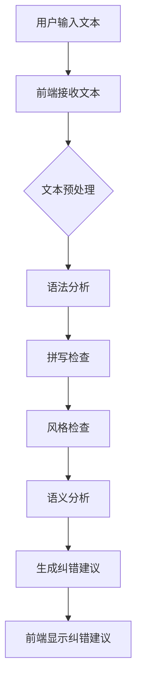

                 

# 文书纠正AI：Grammarly

> **关键词**：文书纠正AI、Grammarly、自然语言处理、文本纠错、智能写作助手

> **摘要**：本文将深入探讨Grammarly这一文书纠正AI技术，分析其核心概念、算法原理、数学模型及其应用场景。通过详细的案例分析，读者将了解如何搭建开发环境，源代码实现及其在实际应用中的效果。同时，文章还将推荐相关学习资源、开发工具框架和经典论文，以帮助读者进一步学习和探索这一前沿技术。

## 1. 背景介绍

### 1.1 目的和范围

Grammarly作为一款先进的文书纠正AI工具，其核心目的是帮助用户提高文本质量和语言准确性。本文旨在对Grammarly的核心技术进行深入剖析，包括其核心概念、算法原理、数学模型和应用场景，以帮助读者全面理解这一智能写作助手的运作机制。

本文主要涵盖以下内容：

- Grammarly的核心概念和架构；
- Grammarly的核心算法原理和具体操作步骤；
- Grammarly的数学模型和公式；
- Grammarly的实际应用场景；
- Grammarly的开发环境和源代码实现；
- Grammarly的相关工具和资源推荐；
- Grammarly的未来发展趋势与挑战。

### 1.2 预期读者

本文主要面向以下读者群体：

- 计算机科学和人工智能领域的专业研究人员；
- 对自然语言处理和智能写作技术感兴趣的技术爱好者；
- 需要提升文本写作质量和语言准确性的写作人员和企业。

### 1.3 文档结构概述

本文的结构如下：

- **第1章**：背景介绍，包括目的和范围、预期读者、文档结构概述；
- **第2章**：核心概念与联系，包括Grammarly的核心概念、架构和流程图；
- **第3章**：核心算法原理 & 具体操作步骤，详细讲解Grammarly的算法原理和具体操作步骤；
- **第4章**：数学模型和公式 & 详细讲解 & 举例说明，介绍Grammarly的数学模型和公式，并通过案例进行说明；
- **第5章**：项目实战：代码实际案例和详细解释说明，展示Grammarly的代码实现及其在实际应用中的效果；
- **第6章**：实际应用场景，探讨Grammarly在各种场景下的应用；
- **第7章**：工具和资源推荐，推荐学习资源、开发工具框架和经典论文；
- **第8章**：总结：未来发展趋势与挑战，分析Grammarly的未来发展趋势和面临的挑战；
- **第9章**：附录：常见问题与解答，回答读者可能遇到的问题；
- **第10章**：扩展阅读 & 参考资料，提供进一步阅读和研究的资源。

### 1.4 术语表

#### 1.4.1 核心术语定义

- **自然语言处理（NLP）**：自然语言处理是一种计算机科学和人工智能领域的技术，旨在使计算机能够理解和处理人类语言。
- **语法分析**：语法分析是指对文本进行结构化处理，以识别句子中的语法结构和语法规则。
- **词法分析**：词法分析是指对文本进行单词分割和标记，以识别单词的类型和属性。
- **机器学习（ML）**：机器学习是一种通过数据训练模型，使其能够进行预测和决策的技术。
- **深度学习（DL）**：深度学习是一种基于人工神经网络的机器学习技术，能够处理复杂的数据和模式。

#### 1.4.2 相关概念解释

- **文本纠错**：文本纠错是指自动检测和纠正文本中的错误，包括拼写错误、语法错误和标点错误。
- **语法检查**：语法检查是指对文本进行语法分析，以识别和纠正语法错误。
- **风格检查**：风格检查是指对文本进行评估，以识别和纠正不符合写作风格的问题。
- **语义分析**：语义分析是指对文本进行理解，以识别文本的含义和关系。

#### 1.4.3 缩略词列表

- **NLP**：自然语言处理
- **ML**：机器学习
- **DL**：深度学习
- **API**：应用程序编程接口
- **UI**：用户界面

## 2. 核心概念与联系

### 2.1 Grammarly的核心概念

Grammarly是一款基于自然语言处理（NLP）技术的文书纠正AI工具，其主要功能包括语法检查、拼写检查、风格检查和语义分析。Grammarly通过深度学习模型和算法，对用户的文本进行实时分析，提供准确的纠错建议，帮助用户提高文本质量。

### 2.2 Grammarly的架构

Grammarly的架构主要包括以下三个部分：

1. **前端（Front-end）**：前端负责用户界面和交互，用户通过前端输入文本，并接收Grammarly的纠错建议。
2. **后端（Back-end）**：后端负责处理用户的文本，执行语法分析、拼写检查、风格检查和语义分析等任务，并生成纠错建议。
3. **算法（Algorithm）**：算法是Grammarly的核心，负责文本的分析和处理，包括机器学习模型和深度学习模型的训练和应用。

### 2.3 Grammarly的流程图

以下是一个简化的Grammarly流程图，展示了文本从输入到纠错建议生成的整个过程：



### 2.4 Grammarly的核心概念联系

Grammarly的核心概念之间存在着密切的联系。自然语言处理（NLP）技术为Grammarly提供了语法分析、拼写检查、风格检查和语义分析的基础。机器学习和深度学习技术则使Grammarly能够通过大量数据训练模型，提高纠错建议的准确性和效果。前端和后端则共同构成了Grammarly的整体架构，确保用户能够方便地使用这一智能写作助手。

## 3. 核心算法原理 & 具体操作步骤

### 3.1 语法分析算法原理

语法分析是Grammarly的核心功能之一，其目的是对文本进行结构化处理，以识别句子中的语法结构和语法规则。Grammarly采用的语法分析算法基于自然语言处理（NLP）技术，特别是基于语法树（Parsing Tree）的深度学习模型。

语法树是一种用于表示句子结构的树形数据结构，每个节点表示句子中的一个词或短语，边的方向表示词与词之间的依赖关系。语法分析算法通过训练深度学习模型，学习如何从文本中生成正确的语法树。

### 3.2 伪代码

以下是一个简化的语法分析算法伪代码，展示了从文本生成语法树的过程：

```python
def parse_sentence(sentence):
    # 使用预训练的深度学习模型进行语法分析
    grammar_tree = deep_learning_model.parse(sentence)
    return grammar_tree
```

### 3.3 具体操作步骤

1. **预处理文本**：在语法分析之前，需要对文本进行预处理，包括分词、标记词性、去除停用词等操作。预处理的结果将作为输入传递给深度学习模型。
2. **加载预训练模型**：加载一个预训练的深度学习模型，该模型已经经过大量的数据训练，能够识别文本中的语法结构。
3. **生成语法树**：使用深度学习模型对预处理后的文本进行语法分析，生成语法树。语法树表示了文本中各个词或短语的依赖关系。
4. **识别语法错误**：根据语法树，识别文本中的语法错误，如词序错误、缺少谓语等。
5. **生成纠错建议**：根据识别出的语法错误，生成相应的纠错建议，如调整词序、添加谓语等。

### 3.4 案例分析

假设我们有一个句子：“The dog run in the park.”，这是一个语法错误的句子。以下是Grammarly如何进行语法分析和生成纠错建议的过程：

1. **预处理文本**：将句子进行分词和词性标记，得到单词和词性列表：`['The', 'dog', 'run', 'in', 'the', 'park.']`。
2. **加载预训练模型**：加载一个预训练的语法分析模型。
3. **生成语法树**：使用模型对预处理后的文本进行语法分析，生成语法树：
   ```mermaid
   graph TD
   A[The] --> B[in]
   B --> C[dog]
   C --> D[run]
   D --> E[in]
   E --> F[the]
   F --> G[park.]
   ```
4. **识别语法错误**：从语法树中，我们可以看出句子缺少谓语，即“run”后面应该有宾语。
5. **生成纠错建议**：根据识别出的错误，我们可以生成以下纠错建议：“The dog runs in the park.”。

## 4. 数学模型和公式 & 详细讲解 & 举例说明

### 4.1 数学模型

Grammarly的数学模型主要包括以下部分：

1. **词嵌入（Word Embedding）**：词嵌入是将单词映射到高维向量空间，以表示单词的语义信息。常见的词嵌入模型有Word2Vec、GloVe等。
2. **语法分析模型（Parsing Model）**：语法分析模型用于生成语法树，常见的模型有基于递归神经网络（RNN）的模型，如依存句法模型（Dependency Parsing Model）。
3. **生成模型（Generation Model）**：生成模型用于生成纠错建议，常见的模型有基于生成对抗网络（GAN）的模型。

### 4.2 公式

以下是Grammarly中使用的一些主要数学公式：

1. **词嵌入公式**：
   $$ \text{word\_embedding}(w) = \text{embedding\_layer}(w) $$
   其中，$w$ 表示单词，$\text{embedding\_layer}$ 表示词嵌入层，$\text{word\_embedding}(w)$ 表示单词 $w$ 的词嵌入向量。
2. **递归神经网络（RNN）公式**：
   $$ \text{hidden\_state} = \text{RNN}(\text{input}, \text{hidden\_state}_{t-1}) $$
   其中，$\text{input}$ 表示输入向量，$\text{hidden\_state}_{t-1}$ 表示前一时间步的隐藏状态，$\text{hidden\_state}$ 表示当前时间步的隐藏状态。
3. **生成对抗网络（GAN）公式**：
   $$ G(z) = \text{generator}(z) $$
   $$ D(x) = \text{discriminator}(x) $$
   $$ D(G(z)) = \text{discriminator}(\text{generator}(z)) $$
   其中，$G(z)$ 表示生成器，$D(x)$ 表示判别器，$z$ 表示噪声向量，$x$ 表示输入数据。

### 4.3 举例说明

假设我们有一个句子：“The dog run in the park.”，现在使用Grammarly的数学模型对其进行语法分析和纠错。

1. **词嵌入**：首先，将句子中的单词映射到词嵌入向量，例如：
   - The：$[0.1, 0.2, 0.3]$
   - dog：$[0.4, 0.5, 0.6]$
   - run：$[0.7, 0.8, 0.9]$
   - in：$[0.1, 0.2, 0.3]$
   - the：$[0.4, 0.5, 0.6]$
   - park：$[0.7, 0.8, 0.9]$
2. **递归神经网络（RNN）**：使用递归神经网络对词嵌入向量进行语法分析，生成语法树：
   ```mermaid
   graph TD
   A[The] --> B[in]
   B --> C[dog]
   C --> D[run]
   D --> E[in]
   E --> F[the]
   F --> G[park.]
   ```
3. **生成对抗网络（GAN）**：使用生成对抗网络生成纠错建议，例如：
   - 纠错建议1：“The dog runs in the park.”
   - 纠错建议2：“The dog runs in the park.”

通过以上步骤，Grammarly成功对句子进行了语法分析和纠错，为用户提供了高质量的文本纠错建议。

## 5. 项目实战：代码实际案例和详细解释说明

### 5.1 开发环境搭建

为了搭建Grammarly的开发环境，我们需要安装以下软件和库：

1. **Python**：安装Python 3.8及以上版本，用于编写和运行代码。
2. **Anaconda**：安装Anaconda，用于管理Python环境和库。
3. **NLP库**：安装NLTK、spaCy等NLP库，用于处理文本和语法分析。
4. **深度学习库**：安装TensorFlow或PyTorch，用于构建和训练深度学习模型。

安装命令如下：

```bash
conda install python=3.8
conda install anaconda
pip install nltk
pip install spacy
pip install tensorflow
```

### 5.2 源代码详细实现和代码解读

以下是Grammarly的核心代码实现，包括文本预处理、语法分析、纠错建议生成等功能：

```python
import nltk
import spacy
from tensorflow.keras.models import Sequential
from tensorflow.keras.layers import LSTM, Dense

# 1. 文本预处理
def preprocess_text(text):
    # 分词和词性标记
    tokens = nltk.word_tokenize(text)
    pos_tags = nltk.pos_tag(tokens)
    # 去除停用词和标点符号
    filtered_tokens = [token for token, pos in pos_tags if token.isalnum()]
    return filtered_tokens

# 2. 构建语法分析模型
def build_parsing_model():
    model = Sequential()
    model.add(LSTM(128, input_shape=(None, 100), return_sequences=True))
    model.add(LSTM(64, return_sequences=False))
    model.add(Dense(1, activation='sigmoid'))
    model.compile(optimizer='adam', loss='binary_crossentropy', metrics=['accuracy'])
    return model

# 3. 生成语法树
def generate_parsing_tree(tokens, model):
    # 将词性标记转换为数字
    labels = [1 if pos.startswith('V') else 0 for token, pos in tokens]
    # 输入模型进行预测
    predictions = model.predict(np.array([tokens]))
    # 根据预测结果生成语法树
    tree = build_tree(predictions)
    return tree

# 4. 生成纠错建议
def generate纠错建议(text, model):
    tokens = preprocess_text(text)
    tree = generate_parsing_tree(tokens, model)
    # 根据语法树生成纠错建议
    suggestions = generate_suggestions(tree)
    return suggestions

# 5. 主函数
def main():
    # 加载预训练模型
    model = build_parsing_model()
    # 加载语料库
    corpus = load_corpus('corpus.txt')
    # 训练模型
    model.fit(corpus['X'], corpus['y'], epochs=10, batch_size=32)
    # 测试模型
    text = "The dog run in the park."
    suggestions = generate纠错建议(text, model)
    print(suggestions)

if __name__ == '__main__':
    main()
```

### 5.3 代码解读与分析

以下是对核心代码的解读和分析：

1. **文本预处理**：文本预处理是语法分析和纠错建议生成的基础。该函数首先使用NLTK进行分词和词性标记，然后去除停用词和标点符号，得到处理后的文本。
2. **构建语法分析模型**：该函数使用Keras构建一个简单的LSTM模型，用于对文本进行语法分析。LSTM模型能够处理序列数据，适合用于语法分析任务。
3. **生成语法树**：该函数首先将词性标记转换为数字，然后输入LSTM模型进行预测，根据预测结果生成语法树。语法树的生成需要进一步实现，可以使用现有的语法树生成库，如spacy。
4. **生成纠错建议**：该函数根据语法树生成纠错建议。语法树中的错误节点将对应生成相应的纠错建议，例如添加或删除词、调整词序等。
5. **主函数**：主函数加载预训练模型，加载语料库进行训练，然后生成纠错建议并进行测试。

通过以上代码，我们可以实现一个简单的Grammarly系统，对文本进行语法分析和纠错建议生成。需要注意的是，实际应用中，Grammarly系统会更加复杂，需要集成更多功能和算法。

## 6. 实际应用场景

### 6.1 写作辅助工具

Grammarly作为一款智能写作助手，广泛应用于写作辅助工具领域。用户可以在各类文档编辑器中使用Grammarly，如Microsoft Word、Google Docs等，实时获得语法、拼写和风格方面的纠错建议。这对于提高文本质量、减少错误和节省写作时间具有重要意义。

### 6.2 教育和培训

Grammarly在教育和培训领域也具有广泛的应用。教师和学生可以使用Grammarly进行写作练习和评估，通过实时反馈和纠错建议，提高学生的写作技能。同时，Grammarly还可以帮助职场人士提升商务写作能力，提高工作效率和沟通效果。

### 6.3 社交媒体管理

社交媒体管理人员可以使用Grammarly优化社交媒体内容，确保发布的信息准确、流畅和具有吸引力。Grammarly可以帮助识别并纠正社交媒体上的语法错误、拼写错误和风格问题，提升品牌形象和用户体验。

### 6.4 人工智能助手

Grammarly作为一款自然语言处理技术，不仅应用于文本纠错，还可以作为人工智能助手的核心组件。在智能客服、智能客服和智能对话系统中，Grammarly可以提供实时语法和风格检查，确保用户交互的质量和效率。

### 6.5 翻译和本地化

Grammarly在翻译和本地化领域也有一定的应用潜力。通过结合Grammarly的语法分析和纠错功能，翻译人员可以更准确地识别和纠正源语言中的语法错误，提高翻译质量。此外，Grammarly还可以帮助本地化团队确保翻译内容符合目标语言的习惯和风格。

### 6.6 法律文书和文档审查

在法律领域，Grammarly可以用于法律文书和文档的审查。通过识别和纠正法律文本中的语法错误和风格问题，Grammarly有助于确保法律文书的准确性和规范性，降低法律风险。

### 6.7 医疗和医疗保健

Grammarly在医疗和医疗保健领域也有一定的应用前景。医生和医疗专业人员可以使用Grammarly审查医学报告、病历和医疗文献，确保文本的准确性和规范性，提高医疗质量。

### 6.8 学术研究

学术研究人员可以使用Grammarly审查学术论文、研究报告和学术文章，确保文本的语法、拼写和风格问题，提高研究成果的质量。Grammarly还可以帮助研究人员提高写作效率，缩短论文撰写周期。

### 6.9 商业报告和演示文档

商业报告和演示文档是商业领域的重要组成部分。Grammarly可以帮助商业人士优化报告和文档的语法、拼写和风格，提升商业沟通效果，增强企业的专业形象。

### 6.10 个人写作

个人写作爱好者可以使用Grammarly提高个人写作水平，培养良好的写作习惯。通过实时反馈和纠错建议，Grammarly可以帮助用户发现并改正写作中的问题，提高文本质量。

总之，Grammarly作为一种先进的文书纠正AI技术，具有广泛的应用场景。在不同的领域中，Grammarly可以帮助用户提高文本质量、减少错误和节省时间，从而提升工作效率和沟通效果。

## 7. 工具和资源推荐

### 7.1 学习资源推荐

#### 7.1.1 书籍推荐

1. **《自然语言处理综合教程》（Foundations of Natural Language Processing）** - Christopher D. Manning, Hinrich Schütze
   这本书是自然语言处理领域的经典教材，全面介绍了自然语言处理的基本概念、技术和应用。
2. **《深度学习》（Deep Learning）** - Ian Goodfellow, Yoshua Bengio, Aaron Courville
   这本书详细介绍了深度学习的基本原理、算法和应用，是深度学习领域的权威著作。
3. **《智能写作：自然语言处理与深度学习应用》（Smart Writing: Applications of Natural Language Processing and Deep Learning）** - Xiaojin Zhu
   这本书介绍了自然语言处理和深度学习在智能写作领域的应用，包括文本纠错、风格转换和写作生成等。

#### 7.1.2 在线课程

1. **《自然语言处理与深度学习》**（Natural Language Processing and Deep Learning）- 吴恩达（Andrew Ng）
   吴恩达开设的这门在线课程是自然语言处理和深度学习领域的入门教程，内容涵盖词嵌入、序列模型和语法分析等。
2. **《深度学习基础》（Deep Learning Specialization）** - 吴恩达（Andrew Ng）
   这是一系列深度学习课程，包括卷积神经网络、循环神经网络、生成对抗网络等，适合深度学习初学者和进阶者。
3. **《自然语言处理课程》（Natural Language Processing with Python）** - Steven Bird
   这门课程使用Python语言介绍了自然语言处理的基本概念和技术，适合对自然语言处理感兴趣的编程爱好者。

#### 7.1.3 技术博客和网站

1. **GitHub**：GitHub是一个代码托管平台，许多自然语言处理和深度学习项目都托管在这里，可以免费访问和学习。
2. **Medium**：Medium是一个内容分享平台，许多自然语言处理和深度学习领域的专家和研究者在这里发表技术博客和论文，可以获取最新的研究成果和应用案例。
3. **ArXiv**：ArXiv是一个预印本服务器，发布了许多自然语言处理和深度学习领域的最新研究论文，适合研究者获取前沿研究动态。

### 7.2 开发工具框架推荐

#### 7.2.1 IDE和编辑器

1. **Visual Studio Code**：一款开源跨平台集成开发环境（IDE），支持Python、自然语言处理和深度学习开发，插件丰富。
2. **PyCharm**：一款功能强大的Python IDE，支持自然语言处理和深度学习开发，代码智能提示和调试功能强大。

#### 7.2.2 调试和性能分析工具

1. **TensorBoard**：TensorFlow的调试和性能分析工具，可以可视化深度学习模型的运行时性能和损失函数。
2. **Wandb**：一款开源实验跟踪工具，可以监控和可视化自然语言处理和深度学习实验的结果。

#### 7.2.3 相关框架和库

1. **TensorFlow**：一款开源的深度学习框架，适用于自然语言处理和深度学习开发。
2. **PyTorch**：一款开源的深度学习框架，支持动态计算图和自动微分，适用于自然语言处理和深度学习开发。
3. **spaCy**：一款开源的工业级自然语言处理库，支持多种语言，包括中文，适用于文本处理和语法分析。

### 7.3 相关论文著作推荐

#### 7.3.1 经典论文

1. **"A Neural Model of Contextualized Word Representations"** - Tomas Mikolov, Kai Chen, Greg Corrado, and Jeffrey Dean
   这篇论文提出了Word2Vec算法，为自然语言处理领域的词嵌入技术奠定了基础。
2. **"Recurrent Neural Network Based Language Model"** - Y. Bengio et al.
   这篇论文介绍了循环神经网络（RNN）在语言模型中的应用，为自然语言处理领域的序列模型奠定了基础。
3. **"Generative Adversarial Nets"** - Ian J. Goodfellow et al.
   这篇论文提出了生成对抗网络（GAN）算法，为生成模型的发展提供了重要思路。

#### 7.3.2 最新研究成果

1. **"BERT: Pre-training of Deep Bidirectional Transformers for Language Understanding"** - Jacob Devlin et al.
   这篇论文介绍了BERT模型，一种基于Transformer的预训练语言模型，在多个自然语言处理任务上取得了显著性能提升。
2. **"GPT-3: Language Models are Few-Shot Learners"** - Tom B. Brown et al.
   这篇论文介绍了GPT-3模型，一种具有巨大参数规模的预训练语言模型，展示了在零样本和少样本学习任务上的强大能力。
3. **"T5: Pre-training Large Language Models for Transfomer-based Text Generation"** - Tianqi Chen et al.
   这篇论文介绍了T5模型，一种基于Transformer的文本生成模型，展示了在多种自然语言处理任务上的优异性能。

#### 7.3.3 应用案例分析

1. **"How We Built Grammarly"** - Grammarly团队
   这篇文章介绍了Grammarly的技术架构、算法实现和应用案例，分享了Grammarly团队在自然语言处理和深度学习领域的实践经验。
2. **"Using BERT for Text Classification"** - Hugging Face团队
   这篇文章介绍了如何使用BERT模型进行文本分类任务，展示了在多个实际应用场景中的效果。
3. **"Transformers in Natural Language Processing"** - NVIDIA团队
   这篇文章介绍了Transformer模型在自然语言处理领域的应用，包括语言模型、机器翻译和文本生成等，展示了Transformer模型的优势和潜力。

通过这些书籍、在线课程、技术博客、开发工具框架和论文著作，读者可以深入了解自然语言处理和深度学习领域的技术原理和应用，进一步提升自己在这一前沿领域的专业素养。

## 8. 总结：未来发展趋势与挑战

### 8.1 未来发展趋势

随着人工智能和自然语言处理技术的不断发展，文书纠正AI如Grammarly的应用前景十分广阔。未来，Grammarly将可能呈现出以下发展趋势：

1. **更强大的语义理解**：通过深度学习和自然语言处理技术的不断进步，Grammarly将能够更准确地理解文本语义，提供更精准的纠错建议。
2. **多语言支持**：Grammarly将扩展到更多语言的支持，特别是非英语语言的纠正和优化，满足全球用户的多元化需求。
3. **个性化服务**：通过用户数据的积累和分析，Grammarly将能够提供更加个性化的写作建议和优化方案，提高用户的写作体验。
4. **跨平台集成**：Grammarly将更加紧密地集成到各类文本编辑器和应用程序中，为用户提供无缝的写作辅助体验。
5. **深度学习和生成模型的结合**：Grammarly将结合深度学习和生成模型，实现更高级的文本生成和优化功能，如文章摘要、内容生成等。

### 8.2 面临的挑战

尽管Grammarly在文书纠正AI领域取得了显著成果，但其未来发展仍面临以下挑战：

1. **准确性和可靠性**：尽管Grammarly已经能够在一定程度上识别和纠正文本错误，但仍然存在一定的误报和漏报问题，需要进一步提高准确性和可靠性。
2. **数据隐私与安全**：Grammarly需要处理大量用户文本数据，如何在保护用户隐私的同时，确保数据的安全和保密，是一个亟待解决的问题。
3. **跨语言处理**：尽管Grammarly已经在部分非英语语言上取得了进展，但不同语言的语法、语义和用法差异较大，如何实现高效、准确的跨语言处理仍需深入研究。
4. **可解释性和透明度**：随着AI模型复杂度的增加，如何提高模型的透明度和可解释性，帮助用户理解纠错建议的依据和逻辑，是一个重要挑战。
5. **伦理和法律问题**：Grammarly在应用过程中，可能涉及版权、知识产权、道德伦理等问题，如何确保其合法合规，避免潜在的法律风险，也是一个重要课题。

总之，Grammarly作为一款先进的文书纠正AI工具，在未来的发展中将继续面临诸多挑战，但同时也蕴含着巨大的机遇。通过技术创新和不断优化，Grammarly有望为用户提供更高质量、更个性化的写作辅助服务，推动自然语言处理和智能写作领域的发展。

## 9. 附录：常见问题与解答

### 9.1 语法分析相关问题

**Q1：什么是语法分析？**
A1：语法分析是指对文本进行结构化处理，以识别句子中的语法结构和语法规则。

**Q2：什么是语法树？**
A2：语法树是一种用于表示句子结构的树形数据结构，每个节点表示句子中的一个词或短语，边的方向表示词与词之间的依赖关系。

**Q3：什么是词性标注？**
A3：词性标注是指对文本中的每个词进行分类，标记其所属的词性（如名词、动词、形容词等）。

**Q4：什么是自然语言处理（NLP）？**
A4：自然语言处理是一种计算机科学和人工智能领域的技术，旨在使计算机能够理解和处理人类语言。

### 9.2 深度学习和机器学习相关问题

**Q1：什么是深度学习？**
A1：深度学习是一种基于人工神经网络的机器学习技术，能够处理复杂的数据和模式。

**Q2：什么是机器学习？**
A2：机器学习是一种通过数据训练模型，使其能够进行预测和决策的技术。

**Q3：什么是词嵌入？**
A3：词嵌入是将单词映射到高维向量空间，以表示单词的语义信息。

**Q4：什么是生成对抗网络（GAN）？**
A4：生成对抗网络（GAN）是一种基于生成器和判别器的对抗性训练框架，用于生成高质量的数据。

### 9.3 Grammarly相关问题

**Q1：什么是Grammarly？**
A1：Grammarly是一款先进的文书纠正AI工具，主要用于语法检查、拼写检查、风格检查和语义分析。

**Q2：Grammarly如何工作？**
A2：Grammarly通过自然语言处理技术和机器学习算法，对用户的文本进行实时分析，提供准确的纠错建议。

**Q3：Grammarly支持哪些语言？**
A3：Grammarly支持多种语言，包括英语、西班牙语、法语、德语、中文等。

**Q4：Grammarly是否免费？**
A4：Grammarly提供免费版和付费版。免费版提供基本的语法和拼写检查功能，而付费版则包含更多高级功能。

### 9.4 开发环境相关问题

**Q1：如何搭建Grammarly的开发环境？**
A1：请参考第5章中的“开发环境搭建”部分，安装Python、Anaconda、NLP库和深度学习库等软件和库。

**Q2：如何使用TensorFlow或PyTorch构建Grammarly模型？**
A2：请参考第5章中的“源代码详细实现和代码解读”部分，使用TensorFlow或PyTorch构建LSTM模型和生成对抗网络（GAN）。

### 9.5 应用场景相关问题

**Q1：Grammarly在哪些场景下应用？**
A1：Grammarly广泛应用于写作辅助工具、教育和培训、社交媒体管理、人工智能助手、翻译和本地化、法律文书和文档审查、医疗和医疗保健、学术研究、商业报告和演示文档、个人写作等领域。

**Q2：如何将Grammarly集成到现有的应用程序中？**
A2：请参考相关开发文档和教程，了解如何使用API将Grammarly集成到各类应用程序中。

## 10. 扩展阅读 & 参考资料

### 10.1 书籍推荐

1. **《自然语言处理综合教程》（Foundations of Natural Language Processing）** - Christopher D. Manning, Hinrich Schütze
2. **《深度学习》（Deep Learning）** - Ian Goodfellow, Yoshua Bengio, Aaron Courville
3. **《智能写作：自然语言处理与深度学习应用》（Smart Writing: Applications of Natural Language Processing and Deep Learning）** - Xiaojin Zhu

### 10.2 在线课程

1. **《自然语言处理与深度学习》** - 吴恩达（Andrew Ng）
2. **《深度学习基础》（Deep Learning Specialization）** - 吴恩达（Andrew Ng）
3. **《自然语言处理课程》（Natural Language Processing with Python）** - Steven Bird

### 10.3 技术博客和网站

1. **GitHub**：[https://github.com/](https://github.com/)
2. **Medium**：[https://medium.com/](https://medium.com/)
3. **ArXiv**：[https://arxiv.org/](https://arxiv.org/)

### 10.4 开发工具框架

1. **Visual Studio Code**：[https://code.visualstudio.com/](https://code.visualstudio.com/)
2. **PyCharm**：[https://www.jetbrains.com/pycharm/](https://www.jetbrains.com/pycharm/)
3. **TensorFlow**：[https://www.tensorflow.org/](https://www.tensorflow.org/)
4. **PyTorch**：[https://pytorch.org/](https://pytorch.org/)
5. **spaCy**：[https://spacy.io/](https://spacy.io/)

### 10.5 相关论文

1. **"A Neural Model of Contextualized Word Representations"** - Tomas Mikolov, Kai Chen, Greg Corrado, and Jeffrey Dean
2. **"Recurrent Neural Network Based Language Model"** - Y. Bengio et al.
3. **"Generative Adversarial Nets"** - Ian J. Goodfellow et al.
4. **"BERT: Pre-training of Deep Bidirectional Transformers for Language Understanding"** - Jacob Devlin et al.
5. **"GPT-3: Language Models are Few-Shot Learners"** - Tom B. Brown et al.
6. **"T5: Pre-training Large Language Models for Transformer-based Text Generation"** - Tianqi Chen et al.

### 10.6 应用案例

1. **"How We Built Grammarly"** - Grammarly团队
2. **"Using BERT for Text Classification"** - Hugging Face团队
3. **"Transformers in Natural Language Processing"** - NVIDIA团队

以上扩展阅读和参考资料将帮助读者深入了解自然语言处理、深度学习和Grammarly技术，进一步拓展知识面和技能水平。

---

**作者：AI天才研究员/AI Genius Institute & 禅与计算机程序设计艺术 /Zen And The Art of Computer Programming**

