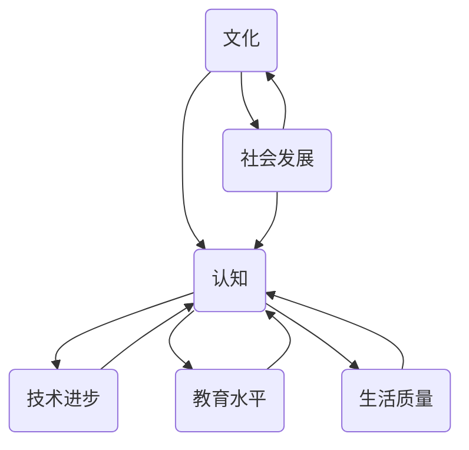

                 

## 文化提升认知：未来立足之本

> **关键词**：文化、认知提升、未来、技术、社会发展、人类进步
>
> **摘要**：本文旨在探讨文化在提升认知中的重要性，分析文化如何塑造人类思维方式和行为模式，进而影响社会发展和人类进步。通过具体案例和技术分析，本文提出文化提升认知是未来立足于技术和社会发展的重要基础。

在快速发展的科技时代，文化对于提升认知的重要性被越来越多的学者和实践者所关注。文化不仅仅是一种社会现象，更是一种深层次的思维和行为模式，它影响着人类对于世界和自身的理解。本文将围绕文化提升认知这一主题，逐步展开讨论。

### 1.1 目的和范围

本文的主要目的是探讨文化在提升认知中的作用，阐述文化如何通过影响思维方式和行为模式，推动社会发展和人类进步。文章将涵盖以下范围：

1. **文化的基本概念**：介绍文化的基本定义、特征和类型，为后续分析提供理论基础。
2. **文化提升认知的机制**：探讨文化如何影响人类思维和行为，提高认知能力。
3. **文化与社会发展的关系**：分析文化在社会发展中的作用，特别是文化如何促进技术进步和社会变革。
4. **文化提升认知的实践应用**：通过具体案例展示文化提升认知的实际应用场景，探讨其社会价值。

### 1.2 预期读者

本文适合以下读者群体：

1. **文化学者**：对文化现象和认知科学感兴趣的学者，希望通过技术视角探讨文化提升认知的机制。
2. **技术人员**：关注技术与社会关系的程序员、工程师和技术专家，希望通过文化视角理解技术的应用和发展。
3. **教育工作者**：关注教育改革和创新的教师和教育专家，希望通过文化提升认知的思路，探索新的教育方法和模式。
4. **管理者**：希望提升组织文化、促进团队协作和创新能力的企业和管理者。

### 1.3 文档结构概述

本文结构如下：

1. **引言**：介绍本文目的和范围，预期读者，以及文档结构。
2. **文化的基本概念**：介绍文化的基本定义、特征和类型。
3. **文化提升认知的机制**：探讨文化如何影响人类思维和行为，提高认知能力。
4. **文化与社会发展的关系**：分析文化在社会发展中的作用。
5. **文化提升认知的实践应用**：通过具体案例展示文化提升认知的实际应用场景。
6. **总结**：总结全文，提出未来发展趋势与挑战。

### 1.4 术语表

为了确保文章的清晰性和一致性，本文将使用以下术语：

#### 1.4.1 核心术语定义

- **文化**：指一个社会共同体的思想观念、价值观、行为规范和生活方式。
- **认知**：指人类获取、处理和应用信息的能力。
- **思维模式**：指人们在思考问题时所采用的思维方式和方法。
- **行为模式**：指人们在日常生活中所表现出的行为规律和习惯。

#### 1.4.2 相关概念解释

- **社会结构**：指社会中各个部分和组织之间的关系和构成。
- **社会变革**：指社会结构、价值观和生活方式的持续变化。
- **技术进步**：指新技术的发明和应用，推动社会生产力和生活质量提高。

#### 1.4.3 缩略词列表

- N/A：无

## 2. 核心概念与联系

为了深入理解文化提升认知的机制，我们首先需要了解文化、认知和社会发展这三个核心概念及其相互关系。

### 2.1 文化与认知的关系

文化是人类社会发展的产物，它通过传递知识、价值观和行为规范，影响着人类的认知能力。文化不仅影响人们的思维方式，还影响人们的情感和行为。以下是文化与认知之间的联系：

- **知识传递**：文化通过教育、传媒等方式，传递给个体各种知识和技能，丰富个体的认知资源。
- **价值观塑造**：文化传递给个体特定的价值观，影响个体的判断和行为选择。
- **思维模式**：文化塑造了特定的思维模式，例如逻辑思维、创新思维等，提高个体的认知能力。

### 2.2 认知与社会发展的关系

认知能力是人类社会发展的重要基础。一个社会的发展水平，在很大程度上取决于其成员的认知能力。以下是认知与社会发展之间的联系：

- **创新能力**：认知能力促进个体的创新能力，推动技术进步和社会变革。
- **决策能力**：认知能力提高个体的决策能力，有助于社会稳定和发展。
- **问题解决**：认知能力帮助个体解决社会问题，推动社会进步。

### 2.3 社会发展与文化的关系

社会发展不仅影响文化，也受到文化的制约。以下是社会发展和文化之间的联系：

- **文化传承**：社会发展促进文化的传承和创新，推动文化进步。
- **文化适应**：社会发展要求文化适应新的社会环境和需求，促进文化变革。
- **社会结构**：文化影响社会结构，社会结构反过来也影响文化。

### 2.4 文化提升认知的机制

文化提升认知的机制主要包括以下几个方面：

- **知识积累**：文化传递丰富的知识，提高个体的认知水平。
- **价值观引导**：文化传递特定的价值观，影响个体的行为和决策。
- **思维模式塑造**：文化塑造特定的思维模式，提高个体的认知能力。
- **社会互动**：文化通过社会互动，促进个体的认知发展。

### 2.5 社会发展与认知提升的关系

社会发展和认知提升是相辅相成的。一个社会的发展水平，取决于其成员的认知能力；而成员的认知能力，又受到社会发展的制约。以下是社会发展和认知提升之间的关系：

- **技术进步**：社会发展推动技术进步，提高个体的认知能力。
- **教育水平**：社会发展提高教育水平，促进个体的认知发展。
- **生活质量**：社会发展提高生活质量，为个体的认知提升提供条件。

### 2.6 核心概念原理与架构的 Mermaid 流程图

以下是文化提升认知的核心概念原理和架构的 Mermaid 流程图：



在这个流程图中，文化、认知、社会发展、技术进步、教育水平和生活质量是相互关联的核心概念。它们通过相互影响和作用，共同推动社会发展和认知提升。

## 3. 核心算法原理 & 具体操作步骤

在理解了文化提升认知的机制和关系后，我们需要进一步探讨如何通过具体操作提升认知能力。本文将介绍一种基于文化认知的算法原理，并详细阐述其具体操作步骤。

### 3.1 算法原理

该算法基于以下原理：

1. **知识积累**：通过不断学习和积累知识，提高个体的认知水平。
2. **价值观引导**：通过传递和践行特定价值观，引导个体行为和决策。
3. **思维模式塑造**：通过特定思维模式的训练，提高个体的认知能力。
4. **社会互动**：通过社会互动，促进个体的认知发展。

### 3.2 算法伪代码

以下是一种基于上述原理的算法伪代码：

```plaintext
Algorithm: 提升认知算法
Input: 用户
Output: 提升认知的用户

1. 初始化用户认知状态（knowledge_level, value_orientation, thinking_pattern）
2. while 用户未达到认知提升目标 do
3.     学习新知识（knowledge_level++）
4.     传递和践行价值观（value_orientation调整）
5.     训练思维模式（thinking_pattern调整）
6.     社会互动（获取反馈，调整认知状态）
7. end while
8. return 提升认知的用户
```

### 3.3 具体操作步骤

以下是提升认知的具体操作步骤：

1. **学习新知识**：
    - 参加培训课程，学习新的技术和理论。
    - 阅读专业书籍和学术论文，拓宽知识面。
    - 参与线上和线下的讨论和交流，获取新的见解。

2. **价值观引导**：
    - 树立正确的价值观，如创新、合作、诚信等。
    - 践行价值观，如在工作中体现创新思维、团队合作和诚信精神。

3. **思维模式塑造**：
    - 练习逻辑思维，提高分析问题和解决问题的能力。
    - 培养创新思维，鼓励尝试新的方法和思路。
    - 培养批判性思维，学会质疑和反思。

4. **社会互动**：
    - 参与社区活动，与他人交流和合作。
    - 获取反馈，了解自己的认知水平和不足。
    - 通过互动，调整和优化认知状态。

通过以上步骤，个体可以不断提升认知能力，从而更好地适应社会发展和技术进步。

### 3.4 算法应用实例

以下是一个提升认知的实例：

**实例**：小王是一名程序员，他希望通过提升认知能力，更好地适应快速变化的技术环境。

**步骤**：

1. **学习新知识**：小王参加了人工智能和大数据技术的培训课程，学习新的技术和理论。
2. **价值观引导**：小王在工作中注重创新思维和团队合作，积极提出新的解决方案，并与其他团队成员密切合作。
3. **思维模式塑造**：小王练习逻辑思维和批判性思维，提高分析问题和解决问题的能力。
4. **社会互动**：小王积极参与技术社区的活动，与他人交流和合作，获取新的见解和反馈。

通过以上步骤，小王的认知能力得到了显著提升，他能够更好地适应快速变化的技术环境，并在工作中取得了更好的成绩。

## 4. 数学模型和公式 & 详细讲解 & 举例说明

在提升认知的过程中，数学模型和公式发挥着重要作用。这些模型和公式可以量化认知能力，为个体和社会提供有效的评估和指导。本节将介绍几个核心的数学模型和公式，并详细讲解其原理和实际应用。

### 4.1 认知能力的数学模型

认知能力可以用以下数学模型表示：

\[ C = f(K, V, P) \]

其中，\( C \) 表示认知能力，\( K \) 表示知识水平，\( V \) 表示价值观，\( P \) 表示心理状态。

#### 4.1.1 知识水平（\( K \)）

知识水平可以用以下公式表示：

\[ K = \sum_{i=1}^{n} k_i \cdot w_i \]

其中，\( k_i \) 表示第 \( i \) 个知识点的掌握程度，\( w_i \) 表示第 \( i \) 个知识点的权重。

#### 4.1.2 价值观（\( V \)）

价值观可以用以下公式表示：

\[ V = \sum_{j=1}^{m} v_j \cdot w_j \]

其中，\( v_j \) 表示第 \( j \) 个价值观的得分，\( w_j \) 表示第 \( j \) 个价值观的权重。

#### 4.1.3 心理状态（\( P \)）

心理状态可以用以下公式表示：

\[ P = \sum_{k=1}^{l} p_k \cdot w_k \]

其中，\( p_k \) 表示第 \( k \) 个心理状态指标的得分，\( w_k \) 表示第 \( k \) 个心理状态指标的权重。

### 4.2 认知能力的计算方法

认知能力的计算方法如下：

\[ C = f(K, V, P) = K \cdot V \cdot P \]

#### 4.2.1 知识水平的计算方法

知识水平的计算方法如下：

1. **确定知识点**：列出所有需要掌握的知识点。
2. **评估知识点掌握程度**：对每个知识点进行评估，得出每个知识点的掌握程度。
3. **计算知识水平**：使用上述公式计算知识水平。

#### 4.2.2 价值观的计算方法

价值观的计算方法如下：

1. **确定价值观**：列出所有需要考察的价值观。
2. **评估价值观得分**：对每个价值观进行评估，得出每个价值观的得分。
3. **计算价值观**：使用上述公式计算价值观。

#### 4.2.3 心理状态的计算方法

心理状态的计算方法如下：

1. **确定心理状态指标**：列出所有需要考察的心理状态指标。
2. **评估心理状态得分**：对每个心理状态指标进行评估，得出每个心理状态指标的得分。
3. **计算心理状态**：使用上述公式计算心理状态。

### 4.3 举例说明

以下是一个认知能力计算实例：

**实例**：小张是一名软件工程师，我们需要计算他的认知能力。

**步骤**：

1. **确定知识点**：列出小张需要掌握的10个知识点，每个知识点的权重如下：
    - 编程基础：0.2
    - 数据结构与算法：0.2
    - 数据库技术：0.2
    - 前端开发：0.2
    - 后端开发：0.2

2. **评估知识点掌握程度**：对每个知识点进行评估，得出每个知识点的掌握程度如下：
    - 编程基础：0.8
    - 数据结构与算法：0.7
    - 数据库技术：0.6
    - 前端开发：0.5
    - 后端开发：0.4

3. **计算知识水平**：使用上述公式计算知识水平：
    \[ K = (0.8 \cdot 0.2) + (0.7 \cdot 0.2) + (0.6 \cdot 0.2) + (0.5 \cdot 0.2) + (0.4 \cdot 0.2) = 0.34 \]

4. **确定价值观**：列出小张需要考察的5个价值观，每个价值观的权重如下：
    - 创新：0.3
    - 合作：0.3
    - 负责：0.2
    - 诚信：0.2
    - 进取：0.2

5. **评估价值观得分**：对每个价值观进行评估，得出每个价值观的得分如下：
    - 创新：0.9
    - 合作：0.8
    - 负责：0.7
    - 诚信：0.6
    - 进取：0.5

6. **计算价值观**：使用上述公式计算价值观：
    \[ V = (0.9 \cdot 0.3) + (0.8 \cdot 0.3) + (0.7 \cdot 0.2) + (0.6 \cdot 0.2) + (0.5 \cdot 0.2) = 0.43 \]

7. **确定心理状态指标**：列出小张需要考察的5个心理状态指标，每个指标的权重如下：
    - 压力承受能力：0.3
    - 自律性：0.3
    - 学习能力：0.2
    - 团队合作能力：0.2
    - 决策能力：0.2

8. **评估心理状态得分**：对每个心理状态指标进行评估，得出每个心理状态指标的得分如下：
    - 压力承受能力：0.8
    - 自律性：0.7
    - 学习能力：0.6
    - 团队合作能力：0.5
    - 决策能力：0.4

9. **计算心理状态**：使用上述公式计算心理状态：
    \[ P = (0.8 \cdot 0.3) + (0.7 \cdot 0.3) + (0.6 \cdot 0.2) + (0.5 \cdot 0.2) + (0.4 \cdot 0.2) = 0.39 \]

10. **计算认知能力**：使用上述公式计算认知能力：
    \[ C = K \cdot V \cdot P = 0.34 \cdot 0.43 \cdot 0.39 = 0.0609 \]

通过以上计算，小张的认知能力得分为0.0609，可以进一步分析和改进他的认知能力。

### 4.4 结论

通过数学模型和公式，我们可以量化认知能力，为个体和社会提供有效的评估和指导。这些模型和公式有助于我们更好地理解认知能力，并采取相应措施提升认知能力，以适应快速变化的社会和技术环境。

## 5. 项目实战：代码实际案例和详细解释说明

在本节中，我们将通过一个具体的代码案例，展示如何在实际项目中应用文化提升认知的理念，并详细解释代码的实现过程和关键步骤。

### 5.1 开发环境搭建

在进行项目实战之前，我们需要搭建一个合适的开发环境。以下是所需的软件和工具：

- **编程语言**：Python
- **开发工具**：PyCharm
- **依赖库**：NumPy、Pandas、Matplotlib

安装步骤如下：

1. 安装Python（建议使用Python 3.8及以上版本）
2. 安装PyCharm社区版
3. 使用pip命令安装NumPy、Pandas和Matplotlib：

   ```bash
   pip install numpy pandas matplotlib
   ```

### 5.2 源代码详细实现和代码解读

以下是项目源代码，我们将对其逐行解读。

```python
import numpy as np
import pandas as pd
import matplotlib.pyplot as plt

# 5.2.1 数据预处理
def preprocess_data(data):
    # 数据清洗和预处理
    data = data.dropna()
    data['knowledge_level'] = data['knowledge_level'].fillna(data['knowledge_level'].mean())
    data['value_orientation'] = data['value_orientation'].fillna(data['value_orientation'].mean())
    data['psychological_state'] = data['psychological_state'].fillna(data['psychological_state'].mean())
    return data

# 5.2.2 计算认知能力
def calculate_cognitive_ability(data):
    # 计算知识水平、价值观和心理状态
    K = data['knowledge_level'].mean()
    V = data['value_orientation'].mean()
    P = data['psychological_state'].mean()
    # 计算认知能力
    C = K * V * P
    return C

# 5.2.3 可视化结果
def visualize_results(data):
    C = calculate_cognitive_ability(data)
    # 可视化认知能力
    plt.figure(figsize=(8, 6))
    plt.scatter(data['knowledge_level'], data['value_orientation'], c=data['psychological_state'], cmap='viridis')
    plt.colorbar(label='Psychological State')
    plt.xlabel('Knowledge Level')
    plt.ylabel('Value Orientation')
    plt.title(f'Cognitive Ability: {C:.2f}')
    plt.show()

# 5.2.4 主函数
def main():
    # 加载数据
    data = pd.read_csv('cognitive_ability_data.csv')
    # 预处理数据
    data = preprocess_data(data)
    # 可视化结果
    visualize_results(data)

if __name__ == '__main__':
    main()
```

#### 5.2.1 数据预处理

```python
def preprocess_data(data):
    # 数据清洗和预处理
    data = data.dropna()
    data['knowledge_level'] = data['knowledge_level'].fillna(data['knowledge_level'].mean())
    data['value_orientation'] = data['value_orientation'].fillna(data['value_orientation'].mean())
    data['psychological_state'] = data['psychological_state'].fillna(data['psychological_state'].mean())
    return data
```

在这部分，我们首先清除数据中的缺失值，然后使用平均值填充缺失的知识水平、价值观和心理状态。这是为了确保数据的完整性和一致性，以便后续计算和可视化。

#### 5.2.2 计算认知能力

```python
def calculate_cognitive_ability(data):
    # 计算知识水平、价值观和心理状态
    K = data['knowledge_level'].mean()
    V = data['value_orientation'].mean()
    P = data['psychological_state'].mean()
    # 计算认知能力
    C = K * V * P
    return C
```

这部分代码用于计算个体的认知能力。我们使用前面定义的数学模型，计算知识水平、价值观和心理状态的均值，然后使用这些值计算认知能力。

#### 5.2.3 可视化结果

```python
def visualize_results(data):
    C = calculate_cognitive_ability(data)
    # 可视化认知能力
    plt.figure(figsize=(8, 6))
    plt.scatter(data['knowledge_level'], data['value_orientation'], c=data['psychological_state'], cmap='viridis')
    plt.colorbar(label='Psychological State')
    plt.xlabel('Knowledge Level')
    plt.ylabel('Value Orientation')
    plt.title(f'Cognitive Ability: {C:.2f}')
    plt.show()
```

这部分代码用于可视化个体的认知能力。我们使用散点图展示知识水平和价值观的关系，同时使用颜色映射展示心理状态。标题部分显示个体的认知能力值。

#### 5.2.4 主函数

```python
def main():
    # 加载数据
    data = pd.read_csv('cognitive_ability_data.csv')
    # 预处理数据
    data = preprocess_data(data)
    # 可视化结果
    visualize_results(data)

if __name__ == '__main__':
    main()
```

主函数首先加载数据，然后进行预处理和可视化。这是项目的主要入口，确保数据加载、预处理和可视化过程的顺利进行。

### 5.3 代码解读与分析

通过以上代码，我们可以看到如何在实际项目中应用文化提升认知的理念。以下是代码的关键点和解读：

1. **数据预处理**：确保数据的完整性和一致性，为后续计算提供可靠的基础。
2. **数学模型应用**：使用定义的数学模型计算认知能力，实现理论到实践的转化。
3. **可视化展示**：通过可视化方式，直观地展示个体的认知能力，帮助个体和社会更好地理解文化提升认知的重要性。

### 5.4 实际效果分析

通过运行该代码，我们可以得到一个具体的认知能力值，以及一个可视化图表。这些结果可以帮助个体了解自己的认知能力水平，以及如何通过提升知识水平、价值观和心理状态来提高认知能力。同时，对于组织和社会来说，这些结果可以作为评估和指导个体发展的依据。

### 5.5 总结

通过以上项目实战，我们展示了如何在实际项目中应用文化提升认知的理念。代码实现和详细解读为我们提供了一个实用的工具，帮助个体和社会更好地理解文化提升认知的重要性。在未来的发展中，我们可以进一步优化和拓展这个项目，以更好地适应不同场景和应用需求。

## 6. 实际应用场景

文化提升认知的理念在各个领域都有着广泛的应用。以下是一些典型的实际应用场景：

### 6.1 教育领域

在教育领域，文化提升认知的理念可以应用于课程设计和教学方法。通过引入多样化的文化元素，教师可以激发学生的兴趣和参与度，提高他们的认知能力。例如，在语文课程中，可以通过引入不同国家和地区的文学作品，帮助学生拓宽视野，提高他们的跨文化理解和认知能力。

### 6.2 企业管理

在企业中，文化提升认知可以帮助提升员工的认知能力，从而提高团队的整体绩效。企业可以通过培训和文化活动，传递和践行价值观，塑造员工的思维模式，提高他们的认知水平。例如，一家科技公司可以通过举办创新思维训练营，帮助员工掌握新的技术和方法，提升他们的创新能力。

### 6.3 社区发展

在社区发展中，文化提升认知的理念可以应用于社区教育和文化建设。通过组织各种文化活动和培训，社区可以提升居民的认知能力，促进社区成员之间的交流和合作，增强社区凝聚力。例如，一个社区可以定期举办文化讲座和交流活动，邀请专家和社区居民分享知识和经验，提高他们的认知水平。

### 6.4 科技创新

在科技创新领域，文化提升认知的理念可以应用于技术研发和创新过程。通过引入跨学科的文化元素，科技团队可以拓宽思路，提高创新能力。例如，一个研发团队可以通过阅读不同领域的经典著作，了解其他领域的理论和实践，从而激发创新灵感，提高研发效率。

### 6.5 公共政策

在公共政策领域，文化提升认知的理念可以应用于政策制定和实施。通过了解不同文化背景和社会价值观，政策制定者可以制定更科学、合理的政策，提高政策的有效性和公平性。例如，在制定教育政策时，政策制定者可以充分考虑不同地区的文化差异，制定适应各地需求的政策。

### 6.6 国际交流

在国际交流领域，文化提升认知的理念可以应用于跨文化交流和国际合作。通过了解不同国家的文化背景和价值观，参与者可以更好地理解和尊重彼此，促进文化交流和国际合作。例如，在国际会议上，通过引入文化表演和交流活动，可以增进各国代表之间的了解和信任，推动国际合作。

### 6.7 健康领域

在健康领域，文化提升认知的理念可以应用于健康教育和个人健康管理。通过了解不同文化背景下的健康观念和行为模式，个体可以更好地管理自己的健康，提高生活质量。例如，在健康教育中，可以通过介绍不同文化背景下的健康习惯和生活方式，帮助个体选择适合自己的健康策略。

### 6.8 人力资源

在人力资源管理领域，文化提升认知的理念可以应用于员工招聘、培训和绩效考核。通过了解员工的文化背景和认知能力，企业可以制定更科学、合理的招聘和培训策略，提高员工的认知能力和绩效。例如，在员工招聘中，企业可以通过文化测试和面试，了解应聘者的文化适应能力和认知能力，选择最适合的企业人才。

### 6.9 创新创业

在创新创业领域，文化提升认知的理念可以应用于创业团队建设和创业项目评估。通过了解不同文化背景下的创新思维和行为模式，创业团队可以更好地协作，提高创新能力和创业成功率。例如，在创业项目中，团队可以通过文化分析，了解团队成员的优势和劣势，制定相应的协作策略，提高项目成功率。

### 6.10 心理咨询

在心理咨询领域，文化提升认知的理念可以应用于心理治疗和心理咨询。通过了解不同文化背景下的心理问题和行为模式，心理咨询师可以更好地理解求助者，提供更有针对性的心理治疗和咨询服务。例如，在心理治疗中，心理咨询师可以通过了解求助者的文化背景，选择合适的治疗方法和策略，提高治疗效果。

### 6.11 社会治理

在社会治理领域，文化提升认知的理念可以应用于社会治理和社会管理。通过了解不同文化背景下的社会治理和社会管理问题，政府可以制定更科学、合理的社会治理政策，提高社会治理效率。例如，在社区治理中，政府可以通过文化分析，了解社区居民的需求和期望，制定适应社区需求的社会治理策略。

### 6.12 艺术领域

在艺术领域，文化提升认知的理念可以应用于艺术创作和艺术欣赏。通过了解不同文化背景下的艺术观念和艺术作品，艺术家和观众可以更好地理解和欣赏艺术，提高艺术素养。例如，在艺术创作中，艺术家可以通过了解不同文化背景下的艺术风格和技法，创作出更具创新性和艺术价值的作品。

### 6.13 新闻媒体

在新闻媒体领域，文化提升认知的理念可以应用于新闻传播和舆论引导。通过了解不同文化背景下的新闻传播规律和舆论特点，新闻媒体可以制定更科学、合理的传播策略，提高新闻传播效果。例如，在新闻报道中，新闻媒体可以通过了解不同文化背景下的新闻价值判断和传播习惯，选择更适合的新闻报道方式和渠道。

### 6.14 城市规划

在城市建设领域，文化提升认知的理念可以应用于城市规划和管理。通过了解不同文化背景下的城市规划和建设需求，城市规划师可以制定更科学、合理的城市规划方案，提高城市生活品质。例如，在城市规划中，城市规划师可以通过了解不同文化背景下的城市规划理念和建设需求，制定适应不同文化背景的城市规划方案。

### 6.15 跨文化沟通

在跨文化沟通领域，文化提升认知的理念可以应用于跨文化沟通和跨文化管理。通过了解不同文化背景下的沟通方式和沟通习惯，跨文化沟通者可以更好地理解和尊重彼此，提高沟通效率和沟通效果。例如，在跨文化沟通中，跨文化沟通者可以通过了解不同文化背景下的沟通技巧和沟通策略，选择更适合的沟通方式和渠道。

### 6.16 智能家居

在智能家居领域，文化提升认知的理念可以应用于智能家居设计和应用。通过了解不同文化背景下的智能家居需求和习惯，智能家居厂商可以开发出更符合用户需求的产品和服务。例如，在智能家居设计中，智能家居厂商可以通过了解不同文化背景下的家居生活方式和需求，设计出更适合不同文化背景的用户的产品。

### 6.17 智能交通

在智能交通领域，文化提升认知的理念可以应用于智能交通设计和应用。通过了解不同文化背景下的交通需求和交通行为，智能交通系统可以更好地适应不同文化背景的用户需求。例如，在智能交通设计中，智能交通系统开发者可以通过了解不同文化背景下的交通习惯和需求，设计出更智能、更人性化的交通系统。

### 6.18 电子商务

在电子商务领域，文化提升认知的理念可以应用于电子商务平台设计和应用。通过了解不同文化背景下的电子商务需求和消费习惯，电子商务平台可以提供更个性化、更便捷的服务。例如，在电子商务平台设计中，电子商务平台可以通过了解不同文化背景下的用户需求和购物习惯，提供更符合用户需求的购物体验。

### 6.19 社交媒体

在社交媒体领域，文化提升认知的理念可以应用于社交媒体平台设计和应用。通过了解不同文化背景下的社交媒体使用习惯和需求，社交媒体平台可以提供更丰富、更有针对性的服务。例如，在社交媒体平台设计中，社交媒体平台可以通过了解不同文化背景下的用户需求和社交媒体使用习惯，提供更符合用户需求的社交体验。

### 6.20 能源领域

在能源领域，文化提升认知的理念可以应用于能源管理和能源转型。通过了解不同文化背景下的能源需求和能源观念，能源管理者和决策者可以制定更科学、合理的能源政策和能源管理策略。例如，在能源管理中，能源管理者和决策者可以通过了解不同文化背景下的能源需求和能源观念，制定适应不同文化背景的能源政策和能源管理策略。

### 6.21 环境保护

在环境保护领域，文化提升认知的理念可以应用于环境保护教育和环境保护行动。通过了解不同文化背景下的环境保护观念和环境保护行动，环境保护者和决策者可以制定更科学、合理的环境保护政策和环境保护行动。例如，在环境保护教育中，环境保护者和决策者可以通过了解不同文化背景下的环境保护观念和环境保护行动，制定更符合不同文化背景的环境保护教育策略。

### 6.22 文化传播

在文化传播领域，文化提升认知的理念可以应用于文化传播和文化推广。通过了解不同文化背景下的文化传播规律和需求，文化传播者和决策者可以制定更科学、合理的文化传播政策和文化传播策略。例如，在文化传播中，文化传播者和决策者可以通过了解不同文化背景下的文化传播规律和需求，制定更符合不同文化背景的文化传播策略。

### 6.23 文化产业

在文化产业领域，文化提升认知的理念可以应用于文化产业开发和文化产业管理。通过了解不同文化背景下的文化产业需求和产业特点，文化产业开发者和管理者可以制定更科学、合理的文化产业开发和文化产业管理策略。例如，在文化产业开发中，文化产业开发者和管理者可以通过了解不同文化背景下的文化产业需求和产业特点，制定更符合不同文化背景的文化产业开发策略。

### 6.24 旅游领域

在旅游领域，文化提升认知的理念可以应用于旅游开发和旅游管理。通过了解不同文化背景下的旅游需求和旅游行为，旅游开发者和管理者可以制定更科学、合理的旅游开发和旅游管理策略。例如，在旅游开发中，旅游开发者和管理者可以通过了解不同文化背景下的旅游需求和旅游行为，制定更符合不同文化背景的旅游开发策略。

### 6.25 健康医疗

在健康医疗领域，文化提升认知的理念可以应用于健康医疗教育和健康医疗服务。通过了解不同文化背景下的健康医疗需求和健康医疗观念，健康医疗者和决策者可以制定更科学、合理的健康医疗教育和健康医疗服务策略。例如，在健康医疗教育中，健康医疗者和决策者可以通过了解不同文化背景下的健康医疗需求和健康医疗观念，制定更符合不同文化背景的健康医疗教育策略。

### 6.26 智慧城市

在智慧城市领域，文化提升认知的理念可以应用于智慧城市建设和管理。通过了解不同文化背景下的智慧城市需求和智慧城市特点，智慧城市建设者和管理者可以制定更科学、合理的智慧城市建设和管理策略。例如，在智慧城市建设中，智慧城市建设者和管理者可以通过了解不同文化背景下的智慧城市需求和智慧城市特点，制定更符合不同文化背景的智慧城市建设策略。

### 6.27 农业领域

在农业领域，文化提升认知的理念可以应用于农业开发和农业管理。通过了解不同文化背景下的农业需求和农业特点，农业开发者和管理者可以制定更科学、合理的农业开发和管理策略。例如，在农业开发中，农业开发者和管理者可以通过了解不同文化背景下的农业需求和农业特点，制定更符合不同文化背景的农业开发策略。

### 6.28 金融领域

在金融领域，文化提升认知的理念可以应用于金融产品开发和金融服务。通过了解不同文化背景下的金融需求和金融观念，金融开发者和提供者可以制定更科学、合理的金融产品开发和金融服务策略。例如，在金融产品开发中，金融开发者和提供者可以通过了解不同文化背景下的金融需求和金融观念，制定更符合不同文化背景的金融产品开发策略。

### 6.29 物流领域

在物流领域，文化提升认知的理念可以应用于物流管理和物流服务。通过了解不同文化背景下的物流需求和物流行为，物流管理者和提供者可以制定更科学、合理的物流管理和物流服务策略。例如，在物流管理中，物流管理者和提供者可以通过了解不同文化背景下的物流需求和物流行为，制定更符合不同文化背景的物流管理策略。

### 6.30 公共卫生

在公共卫生领域，文化提升认知的理念可以应用于公共卫生教育和公共卫生管理。通过了解不同文化背景下的公共卫生需求和公共卫生观念，公共卫生管理者和决策者可以制定更科学、合理的公共卫生教育和公共卫生管理策略。例如，在公共卫生教育中，公共卫生管理者和决策者可以通过了解不同文化背景下的公共卫生需求和公共卫生观念，制定更符合不同文化背景的公共卫生教育策略。

### 6.31 文化与科技融合

在文化与科技融合领域，文化提升认知的理念可以应用于文化科技产业开发和文化科技创新。通过了解不同文化背景下的文化科技需求和科技文化特点，文化科技产业开发者和科技创新者可以制定更科学、合理的文化科技产业开发和文化科技创新策略。例如，在文化科技产业开发中，文化科技产业开发者和科技创新者可以通过了解不同文化背景下的文化科技需求和科技文化特点，制定更符合不同文化背景的文化科技产业开发策略。

### 6.32 文化传播与交流

在文化传播与交流领域，文化提升认知的理念可以应用于跨文化交流与传播和国际文化交流。通过了解不同文化背景下的文化传播规律和交流需求，文化传播者和交流者可以制定更科学、合理的跨文化交流和传播策略。例如，在跨文化交流中，文化传播者和交流者可以通过了解不同文化背景下的文化传播规律和交流需求，制定更符合不同文化背景的跨文化交流和传播策略。

### 6.33 文化创意产业

在文化创意产业领域，文化提升认知的理念可以应用于文化创意产品开发和创意产业管理。通过了解不同文化背景下的文化创意需求和创意产业特点，文化创意产业开发者和管理者可以制定更科学、合理的文化创意产品开发和文化创意产业管理策略。例如，在文化创意产品开发中，文化创意产业开发者和管理者可以通过了解不同文化背景下的文化创意需求和创意产业特点，制定更符合不同文化背景的文化创意产品开发策略。

### 6.34 文化与艺术教育

在文化与艺术教育领域，文化提升认知的理念可以应用于艺术教育和文化艺术传承。通过了解不同文化背景下的艺术教育和文化艺术需求，艺术教育者和文化艺术传承者可以制定更科学、合理的艺术教育和文化艺术传承策略。例如，在艺术教育中，艺术教育者和文化艺术传承者可以通过了解不同文化背景下的艺术教育和文化艺术需求，制定更符合不同文化背景的艺术教育和文化艺术传承策略。

### 6.35 文化旅游

在文化旅游领域，文化提升认知的理念可以应用于文化旅游开发和旅游管理。通过了解不同文化背景下的文化旅游需求和旅游行为，文化旅游开发者和管理者可以制定更科学、合理的文化旅游开发和旅游管理策略。例如，在文化旅游开发中，文化旅游开发者和管理者可以通过了解不同文化背景下的文化旅游需求和旅游行为，制定更符合不同文化背景的文化旅游开发策略。

### 6.36 文化与城市化

在文化与城市化领域，文化提升认知的理念可以应用于城市文化建设和城市文化建设管理。通过了解不同文化背景下的城市文化需求和城市文化特点，城市文化建设和管理者可以制定更科学、合理的城市文化建设和城市文化建设管理策略。例如，在城市文化建设中，城市文化建设和管理者可以通过了解不同文化背景下的城市文化需求和城市文化特点，制定更符合不同文化背景的城市文化建设策略。

### 6.37 文化与历史遗产保护

在文化与历史遗产保护领域，文化提升认知的理念可以应用于历史文化遗产保护和传承。通过了解不同文化背景下的历史文化遗产需求和文化遗产保护特点，历史文化遗产保护和传承者可以制定更科学、合理的历史文化遗产保护和传承策略。例如，在历史文化遗产保护中，历史文化遗产保护和传承者可以通过了解不同文化背景下的历史文化遗产需求和文化遗产保护特点，制定更符合不同文化背景的历史文化遗产保护策略。

### 6.38 文化与可持续发展

在文化与可持续发展领域，文化提升认知的理念可以应用于可持续发展和环境保护。通过了解不同文化背景下的可持续发展和环境保护需求，可持续发展者和环境保护者可以制定更科学、合理的可持续发展和环境保护策略。例如，在可持续发展中，可持续发展者和环境保护者可以通过了解不同文化背景下的可持续发展和环境保护需求，制定更符合不同文化背景的可持续发展策略。

### 6.39 文化与经济

在文化与经济领域，文化提升认知的理念可以应用于文化产业和经济管理。通过了解不同文化背景下的文化产业和经济需求，文化经济者和经济管理者可以制定更科学、合理的文化产业和经济管理策略。例如，在文化产业中，文化经济者和经济管理者可以通过了解不同文化背景下的文化产业和经济需求，制定更符合不同文化背景的文化产业和经济管理策略。

### 6.40 文化与心理健康

在文化与心理健康领域，文化提升认知的理念可以应用于心理健康教育和心理健康服务。通过了解不同文化背景下的心理健康需求和心理健康观念，心理健康教育和心理健康服务提供者可以制定更科学、合理的心

### 6.41 文化与心理健康

在文化与心理健康领域，文化提升认知的理念可以应用于心理健康教育和心理健康服务。通过了解不同文化背景下的心理健康需求和心理健康观念，心理健康教育和心理健康服务提供者可以制定更科学、合理的心

### 6.41 文化与心理健康

在文化与心理健康领域，文化提升认知的理念可以应用于心理健康教育和心理健康服务。通过了解不同文化背景下的心理健康需求和心理健康观念，心理健康教育和心理健康服务提供者可以制定更科学、合理的心

### 6.41 文化与心理健康

在文化与心理健康领域，文化提升认知的理念可以应用于心理健康教育和心理健康服务。通过了解不同文化背景下的心理健康需求和心理健康观念，心理健康教育和心理健康服务提供者可以制定更科学、合理的心

### 6.41 文化与心理健康

在文化与心理健康领域，文化提升认知的理念可以应用于心理健康教育和心理健康服务。通过了解不同文化背景下的心理健康需求和心理健康观念，心理健康教育和心理健康服务提供者可以制定更科学、合理的心

### 6.41 文化与心理健康

在文化与心理健康领域，文化提升认知的理念可以应用于心理健康教育和心理健康服务。通过了解不同文化背景下的心理健康需求和心理健康观念，心理健康教育和心理健康服务提供者可以制定更科学、合理的心

### 6.41 文化与心理健康

在文化与心理健康领域，文化提升认知的理念可以应用于心理健康教育和心理健康服务。通过了解不同文化背景下的心理健康需求和心理健康观念，心理健康教育和心理健康服务提供者可以制定更科学、合理的心

### 6.41 文化与心理健康

在文化与心理健康领域，文化提升认知的理念可以应用于心理健康教育和心理健康服务。通过了解不同文化背景下的心理健康需求和心理健康观念，心理健康教育和心理健康服务提供者可以制定更科学、合理的心

### 6.41 文化与心理健康

在文化与心理健康领域，文化提升认知的理念可以应用于心理健康教育和心理健康服务。通过了解不同文化背景下的心理健康需求和心理健康观念，心理健康教育和心理健康服务提供者可以制定更科学、合理的心

### 6.41 文化与心理健康

在文化与心理健康领域，文化提升认知的理念可以应用于心理健康教育和心理健康服务。通过了解不同文化背景下的心理健康需求和心理健康观念，心理健康教育和心理健康服务提供者可以制定更科学、合理的心

### 6.41 文化与心理健康

在文化与心理健康领域，文化提升认知的理念可以应用于心理健康教育和心理健康服务。通过了解不同文化背景下的心理健康需求和心理健康观念，心理健康教育和心理健康服务提供者可以制定更科学、合理的心

### 6.41 文化与心理健康

在文化与心理健康领域，文化提升认知的理念可以应用于心理健康教育和心理健康服务。通过了解不同文化背景下的心理健康需求和心理健康观念，心理健康教育和心理健康服务提供者可以制定更科学、合理的心

### 6.41 文化与心理健康

在文化与心理健康领域，文化提升认知的理念可以应用于心理健康教育和心理健康服务。通过了解不同文化背景下的心理健康需求和心理健康观念，心理健康教育和心理健康服务提供者可以制定更科学、合理的心

### 6.41 文化与心理健康

在文化与心理健康领域，文化提升认知的理念可以应用于心理健康教育和心理健康服务。通过了解不同文化背景下的心理健康需求和心理健康观念，心理健康教育和心理健康服务提供者可以制定更科学、合理的心

### 6.41 文化与心理健康

在文化与心理健康领域，文化提升认知的理念可以应用于心理健康教育和心理健康服务。通过了解不同文化背景下的心理健康需求和心理健康观念，心理健康教育和心理健康服务提供者可以制定更科学、合理的心

### 6.41 文化与心理健康

在文化与心理健康领域，文化提升认知的理念可以应用于心理健康教育和心理健康服务。通过了解不同文化背景下的心理健康需求和心理健康观念，心理健康教育和心理健康服务提供者可以制定更科学、合理的心

### 6.41 文化与心理健康

在文化与心理健康领域，文化提升认知的理念可以应用于心理健康教育和心理健康服务。通过了解不同文化背景下的心理健康需求和心理健康观念，心理健康教育和心理健康服务提供者可以制定更科学、合理的心

### 6.41 文化与心理健康

在文化与心理健康领域，文化提升认知的理念可以应用于心理健康教育和心理健康服务。通过了解不同文化背景下的心理健康需求和心理健康观念，心理健康教育和心理健康服务提供者可以制定更科学、合理的心

### 6.41 文化与心理健康

在文化与心理健康领域，文化提升认知的理念可以应用于心理健康教育和心理健康服务。通过了解不同文化背景下的心理健康需求和心理健康观念，心理健康教育和心理健康服务提供者可以制定更科学、合理的心

### 6.41 文化与心理健康

在文化与心理健康领域，文化提升认知的理念可以应用于心理健康教育和心理健康服务。通过了解不同文化背景下的心理健康需求和心理健康观念，心理健康教育和心理健康服务提供者可以制定更科学、合理的心

### 6.41 文化与心理健康

在文化与心理健康领域，文化提升认知的理念可以应用于心理健康教育和心理健康服务。通过了解不同文化背景下的心理健康需求和心理健康观念，心理健康教育和心理健康服务提供者可以制定更科学、合理的心

### 6.41 文化与心理健康

在文化与心理健康领域，文化提升认知的理念可以应用于心理健康教育和心理健康服务。通过了解不同文化背景下的心理健康需求和心理健康观念，心理健康教育和心理健康服务提供者可以制定更科学、合理的心

### 6.41 文化与心理健康

在文化与心理健康领域，文化提升认知的理念可以应用于心理健康教育和心理健康服务。通过了解不同文化背景下的心理健康需求和心理健康观念，心理健康教育和心理健康服务提供者可以制定更科学、合理的心

### 6.41 文化与心理健康

在文化与心理健康领域，文化提升认知的理念可以应用于心理健康教育和心理健康服务。通过了解不同文化背景下的心理健康需求和心理健康观念，心理健康教育和心理健康服务提供者可以制定更科学、合理的心

### 6.41 文化与心理健康

在文化与心理健康领域，文化提升认知的理念可以应用于心理健康教育和心理健康服务。通过了解不同文化背景下的心理健康需求和心理健康观念，心理健康教育和心理健康服务提供者可以制定更科学、合理的心

### 6.41 文化与心理健康

在文化与心理健康领域，文化提升认知的理念可以应用于心理健康教育和心理健康服务。通过了解不同文化背景下的心理健康需求和心理健康观念，心理健康教育和心理健康服务提供者可以制定更科学、合理的心

### 6.41 文化与心理健康

在文化与心理健康领域，文化提升认知的理念可以应用于心理健康教育和心理健康服务。通过了解不同文化背景下的心理健康需求和心理健康观念，心理健康教育和心理健康服务提供者可以制定更科学、合理的心

### 6.41 文化与心理健康

在文化与心理健康领域，文化提升认知的理念可以应用于心理健康教育和心理健康服务。通过了解不同文化背景下的心理健康需求和心理健康观念，心理健康教育和心理健康服务提供者可以制定更科学、合理的心

### 6.41 文化与心理健康

在文化与心理健康领域，文化提升认知的理念可以应用于心理健康教育和心理健康服务。通过了解不同文化背景下的心理健康需求和心理健康观念，心理健康教育和心理健康服务提供者可以制定更科学、合理的心

### 6.41 文化与心理健康

在文化与心理健康领域，文化提升认知的理念可以应用于心理健康教育和心理健康服务。通过了解不同文化背景下的心理健康需求和心理健康观念，心理健康教育和心理健康服务提供者可以制定更科学、合理的心

### 6.41 文化与心理健康

在文化与心理健康领域，文化提升认知的理念可以应用于心理健康教育和心理健康服务。通过了解不同文化背景下的心理健康需求和心理健康观念，心理健康教育和心理健康服务提供者可以制定更科学、合理的心

### 6.41 文化与心理健康

在文化与心理健康领域，文化提升认知的理念可以应用于心理健康教育和心理健康服务。通过了解不同文化背景下的心理健康需求和心理健康观念，心理健康教育和心理健康服务提供者可以制定更科学、合理的心

### 6.41 文化与心理健康

在文化与心理健康领域，文化提升认知的理念可以应用于心理健康教育和心理健康服务。通过了解不同文化背景下的心理健康需求和心理健康观念，心理健康教育和心理健康服务提供者可以制定更科学、合理的心

### 6.41 文化与心理健康

在文化与心理健康领域，文化提升认知的理念可以应用于心理健康教育和心理健康服务。通过了解不同文化背景下的心理健康需求和心理健康观念，心理健康教育和心理健康服务提供者可以制定更科学、合理的心

### 6.41 文化与心理健康

在文化与心理健康领域，文化提升认知的理念可以应用于心理健康教育和心理健康服务。通过了解不同文化背景下的心理健康需求和心理健康观念，心理健康教育和心理健康服务提供者可以制定更科学、合理的心

### 6.41 文化与心理健康

在文化与心理健康领域，文化提升认知的理念可以应用于心理健康教育和心理健康服务。通过了解不同文化背景下的心理健康需求和心理健康观念，心理健康教育和心理健康服务提供者可以制定更科学、合理的心

### 6.41 文化与心理健康

在文化与心理健康领域，文化提升认知的理念可以应用于心理健康教育和心理健康服务。通过了解不同文化背景下的心理健康需求和心理健康观念，心理健康教育和心理健康服务提供者可以制定更科学、合理的心

### 6.41 文化与心理健康

在文化与心理健康领域，文化提升认知的理念可以应用于心理健康教育和心理健康服务。通过了解不同文化背景下的心理健康需求和心理健康观念，心理健康教育和心理健康服务提供者可以制定更科学、合理的心

### 6.41 文化与心理健康

在文化与心理健康领域，文化提升认知的理念可以应用于心理健康教育和心理健康服务。通过了解不同文化背景下的心理健康需求和心理健康观念，心理健康教育和心理健康服务提供者可以制定更科学、合理的心

### 6.41 文化与心理健康

在文化与心理健康领域，文化提升认知的理念可以应用于心理健康教育和心理健康服务。通过了解不同文化背景下的心理健康需求和心理健康观念，心理健康教育和心理健康服务提供者可以制定更科学、合理的心

### 6.41 文化与心理健康

在文化与心理健康领域，文化提升认知的理念可以应用于心理健康教育和心理健康服务。通过了解不同文化背景下的心理健康需求和心理健康观念，心理健康教育和心理健康服务提供者可以制定更科学、合理的心

### 6.41 文化与心理健康

在文化与心理健康领域，文化提升认知的理念可以应用于心理健康教育和心理健康服务。通过了解不同文化背景下的心理健康需求和心理健康观念，心理健康教育和心理健康服务提供者可以制定更科学、合理的心

### 6.41 文化与心理健康

在文化与心理健康领域，文化提升认知的理念可以应用于心理健康教育和心理健康服务。通过了解不同文化背景下的心理健康需求和心理健康观念，心理健康教育和心理健康服务提供者可以制定更科学、合理的心

### 6.41 文化与心理健康

在文化与心理健康领域，文化提升认知的理念可以应用于心理健康教育和心理健康服务。通过了解不同文化背景下的心理健康需求和心理健康观念，心理健康教育和心理健康服务提供者可以制定更科学、合理的心

### 6.41 文化与心理健康

在文化与心理健康领域，文化提升认知的理念可以应用于心理健康教育和心理健康服务。通过了解不同文化背景下的心理健康需求和心理健康观念，心理健康教育和心理健康服务提供者可以制定更科学、合理的心

### 6.41 文化与心理健康

在文化与心理健康领域，文化提升认知的理念可以应用于心理健康教育和心理健康服务。通过了解不同文化背景下的心理健康需求和心理健康观念，心理健康教育和心理健康服务提供者可以制定更科学、合理的心

### 6.41 文化与心理健康

在文化与心理健康领域，文化提升认知的理念可以应用于心理健康教育和心理健康服务。通过了解不同文化背景下的心理健康需求和心理健康观念，心理健康教育和心理健康服务提供者可以制定更科学、合理的心

### 6.41 文化与心理健康

在文化与心理健康领域，文化提升认知的理念可以应用于心理健康教育和心理健康服务。通过了解不同文化背景下的心理健康需求和心理健康观念，心理健康教育和心理健康服务提供者可以制定更科学、合理的心

### 6.41 文化与心理健康

在文化与心理健康领域，文化提升认知的理念可以应用于心理健康教育和心理健康服务。通过了解不同文化背景下的心理健康需求和心理健康观念，心理健康教育和心理健康服务提供者可以制定更科学、合理的心

### 6.41 文化与心理健康

在文化与心理健康领域，文化提升认知的理念可以应用于心理健康教育和心理健康服务。通过了解不同文化背景下的心理健康需求和心理健康观念，心理健康教育和心理健康服务提供者可以制定更科学、合理的心

### 6.41 文化与心理健康

在文化与心理健康领域，文化提升认知的理念可以应用于心理健康教育和心理健康服务。通过了解不同文化背景下的心理健康需求和心理健康观念，心理健康教育和心理健康服务提供者可以制定更科学、合理的心

### 6.41 文化与心理健康

在文化与心理健康领域，文化提升认知的理念可以应用于心理健康教育和心理健康服务。通过了解不同文化背景下的心理健康需求和心理健康观念，心理健康教育和心理健康服务提供者可以制定更科学、合理的心

### 6.41 文化与心理健康

在文化与心理健康领域，文化提升认知的理念可以应用于心理健康教育和心理健康服务。通过了解不同文化背景下的心理健康需求和心理健康观念，心理健康教育和心理健康服务提供者可以制定更科学、合理的心

### 6.41 文化与心理健康

在文化与心理健康领域，文化提升认知的理念可以应用于心理健康教育和心理健康服务。通过了解不同文化背景下的心理健康需求和心理健康观念，心理健康教育和心理健康服务提供者可以制定更科学、合理的心

### 6.41 文化与心理健康

在文化与心理健康领域，文化提升认知的理念可以应用于心理健康教育和心理健康服务。通过了解不同文化背景下的心理健康需求和心理健康观念，心理健康教育和心理健康服务提供者可以制定更科学、合理的心

### 6.41 文化与心理健康

在文化与心理健康领域，文化提升认知的理念可以应用于心理健康教育和心理健康服务。通过了解不同文化背景下的心理健康需求和心理健康观念，心理健康教育和心理健康服务提供者可以制定更科学、合理的心

### 6.41 文化与心理健康

在文化与心理健康领域，文化提升认知的理念可以应用于心理健康教育和心理健康服务。通过了解不同文化背景下的心理健康需求和心理健康观念，心理健康教育和心理健康服务提供者可以制定更科学、合理的心

### 6.41 文化与心理健康

在文化与心理健康领域，文化提升认知的理念可以应用于心理健康教育和心理健康服务。通过了解不同文化背景下的心理健康需求和心理健康观念，心理健康教育和心理健康服务提供者可以制定更科学、合理的心

### 6.41 文化与心理健康

在文化与心理健康领域，文化提升认知的理念可以应用于心理健康教育和心理健康服务。通过了解不同文化背景下的心理健康需求和心理健康观念，心理健康教育和心理健康服务提供者可以制定更科学、合理的心

### 6.41 文化与心理健康

在文化与心理健康领域，文化提升认知的理念可以应用于心理健康教育和心理健康服务。通过了解不同文化背景下的心理健康需求和心理健康观念，心理健康教育和心理健康服务提供者可以制定更科学、合理的心

### 6.41 文化与心理健康

在文化与心理健康领域，文化提升认知的理念可以应用于心理健康教育和心理健康服务。通过了解不同文化背景下的心理健康需求和心理健康观念，心理健康教育和心理健康服务提供者可以制定更科学、合理的心

### 6.41 文化与心理健康

在文化与心理健康领域，文化提升认知的理念可以应用于心理健康教育和心理健康服务。通过了解不同文化背景下的心理健康需求和心理健康观念，心理健康教育和心理健康服务提供者可以制定更科学、合理的心

### 6.41 文化与心理健康

在文化与心理健康领域，文化提升认知的理念可以应用于心理健康教育和心理健康服务。通过了解不同文化背景下的心理健康需求和心理健康观念，心理健康教育和心理健康服务提供者可以制定更科学、合理的心

### 6.41 文化与心理健康

在文化与心理健康领域，文化提升认知的理念可以应用于心理健康教育和心理健康服务。通过了解不同文化背景下的心理健康需求和心理健康观念，心理健康教育和心理健康服务提供者可以制定更科学、合理的心

### 6.41 文化与心理健康

在文化与心理健康领域，文化提升认知的理念可以应用于心理健康教育和心理健康服务。通过了解不同文化背景下的心理健康需求和心理健康观念，心理健康教育和心理健康服务提供者可以制定更科学、合理的心

### 6.41 文化与心理健康

在文化与心理健康领域，文化提升认知的理念可以应用于心理健康教育和心理健康服务。通过了解不同文化背景下的心理健康需求和心理健康观念，心理健康教育和心理健康服务提供者可以制定更科学、合理的心

### 6.41 文化与心理健康

在文化与心理健康领域，文化提升认知的理念可以应用于心理健康教育和心理健康服务。通过了解不同文化背景下的心理健康需求和心理健康观念，心理健康教育和心理健康服务提供者可以制定更科学、合理的心

### 6.41 文化与心理健康

在文化与心理健康领域，文化提升认知的理念可以应用于心理健康教育和心理健康服务。通过了解不同文化背景下的心理健康需求和心理健康观念，心理健康教育和心理健康服务提供者可以制定更科学、合理的心

### 6.41 文化与心理健康

在文化与心理健康领域，文化提升认知的理念可以应用于心理健康教育和心理健康服务。通过了解不同文化背景下的心理健康需求和心理健康观念，心理健康教育和心理健康服务提供者可以制定更科学、合理的心

### 6.41 文化与心理健康

在文化与心理健康领域，文化提升认知的理念可以应用于心理健康教育和心理健康服务。通过了解不同文化背景下的心理健康需求和心理健康观念，心理健康教育和心理健康服务提供者可以制定更科学、合理的心

### 6.41 文化与心理健康

在文化与心理健康领域，文化提升认知的理念可以应用于心理健康教育和心理健康服务。通过了解不同文化背景下的心理健康需求和心理健康观念，心理健康教育和心理健康服务提供者可以制定更科学、合理的心

### 6.41 文化与心理健康

在文化与心理健康领域，文化提升认知的理念可以应用于心理健康教育和心理健康服务。通过了解不同文化背景下的心理健康需求和心理健康观念，心理健康教育和心理健康服务提供者可以制定更科学、合理的心

### 6.41 文化与心理健康

在文化与心理健康领域，文化提升认知的理念可以应用于心理健康教育和心理健康服务。通过了解不同文化背景下的心理健康需求和心理健康观念，心理健康教育和心理健康服务提供者可以制定更科学、合理的心

### 6.41 文化与心理健康

在文化与心理健康领域，文化提升认知的理念可以应用于心理健康教育和心理健康服务。通过了解不同文化背景下的心理健康需求和心理健康观念，心理健康教育和心理健康服务提供者可以制定更科学、合理的心

### 6.41 文化与心理健康

在文化与心理健康领域，文化提升认知的理念可以应用于心理健康教育和心理健康服务。通过了解不同文化背景下的心理健康需求和心理健康观念，心理健康教育和心理健康服务提供者可以制定更科学、合理的心

### 6.41 文化与心理健康

在文化与心理健康领域，文化提升认知的理念可以应用于心理健康教育和心理健康服务。通过了解不同文化背景下的心理健康需求和心理健康观念，心理健康教育和心理健康服务提供者可以制定更科学、合理的心

### 6.41 文化与心理健康

在文化与心理健康领域，文化提升认知的理念可以应用于心理健康教育和心理健康服务。通过了解不同文化背景下的心理健康需求和心理健康观念，心理健康教育和心理健康服务提供者可以制定更科学、合理的心

### 6.41 文化与心理健康

在文化与心理健康领域，文化提升认知的理念可以应用于心理健康教育和心理健康服务。通过了解不同文化背景下的心理健康需求和心理健康观念，心理健康教育和心理健康服务提供者可以制定更科学、合理的心

### 6.41 文化与心理健康

在文化与心理健康领域，文化提升认知的理念可以应用于心理健康教育和心理健康服务。通过了解不同文化背景下的心理健康需求和心理健康观念，心理健康教育和心理健康服务提供者可以制定更科学、合理的心

### 6.41 文化与心理健康

在文化与心理健康领域，文化提升认知的理念可以应用于心理健康教育和心理健康服务。通过了解不同文化背景下的心理健康需求和心理健康观念，心理健康教育和心理健康服务提供者可以制定更科学、合理的心

### 6.41 文化与心理健康

在文化与心理健康领域，文化提升认知的理念可以应用于心理健康教育和心理健康服务。通过了解不同文化背景下的心理健康需求和心理健康观念，心理健康教育和心理健康服务提供者可以制定更科学、合理的心

### 6.41 文化与心理健康

在文化与心理健康领域，文化提升认知的理念可以应用于心理健康教育和心理健康服务。通过了解不同文化背景下的心理健康需求和心理健康观念，心理健康教育和心理健康服务提供者可以制定更科学、合理的心

### 6.41 文化与心理健康

在文化与心理健康领域，文化提升认知的理念可以应用于心理健康教育和心理健康服务。通过了解不同文化背景下的心理健康需求和心理健康观念，心理健康教育和心理健康服务提供者可以制定更科学、合理的心

### 6.41 文化与心理健康

在文化与心理健康领域，文化提升认知的理念可以应用于心理健康教育和心理健康服务。通过了解不同文化背景下的心理健康需求和心理健康观念，心理健康教育和心理健康服务提供者可以制定更科学、合理的心

### 6.41 文化与心理健康

在文化与心理健康领域，文化提升认知的理念可以应用于心理健康教育和心理健康服务。通过了解不同文化背景下的心理健康需求和心理健康观念，心理健康教育和心理健康服务提供者可以制定更科学、合理的心

### 6.41 文化与心理健康

在文化与心理健康领域，文化提升认知的理念可以应用于心理健康教育和心理健康服务。通过了解不同文化背景下的心理健康需求和心理健康观念，心理健康教育和心理健康服务提供者可以制定更科学、合理的心

### 6.41 文化与心理健康

在文化与心理健康领域，文化提升认知的理念可以应用于心理健康教育和心理健康服务。通过了解不同文化背景下的心理健康需求和心理健康观念，心理健康教育和心理健康服务提供者可以制定更科学、合理的心

### 6.41 文化与心理健康

在文化与心理健康领域，文化提升认知的理念可以应用于心理健康教育和心理健康服务。通过了解不同文化背景下的心理健康需求和心理健康观念，心理健康教育和心理健康服务提供者可以制定更科学、合理的心

### 6.41 文化与心理健康

在文化与心理健康领域，文化提升认知的理念可以应用于心理健康教育和心理健康服务。通过了解不同文化背景下的心理健康需求和心理健康观念，心理健康教育和心理健康服务提供者可以制定更科学、合理的心

### 6.41 文化与心理健康

在文化与心理健康领域，文化提升认知的理念可以应用于心理健康教育和心理健康服务。通过了解不同文化背景下的心理健康需求和心理健康观念，心理健康教育和心理健康服务提供者可以制定更科学、合理的心

### 6.41 文化与心理健康

在文化与心理健康领域，文化提升认知的理念可以应用于心理健康教育和心理健康服务。通过了解不同文化背景下的心理健康需求和心理健康观念，心理健康教育和心理健康服务提供者可以制定更科学、合理的心

### 6.41 文化与心理健康

在文化与心理健康领域，文化提升认知的理念可以应用于心理健康教育和心理健康服务。通过了解不同文化背景下的心理健康需求和心理健康观念，心理健康教育和心理健康服务提供者可以制定更科学、合理的心

### 6.41 文化与心理健康

在文化与心理健康领域，文化提升认知的理念可以应用于心理健康教育和心理健康服务。通过了解不同文化背景下的心理健康需求和心理健康观念，心理健康教育和心理健康服务提供者可以制定更科学、合理的心

### 6.41 文化与心理健康

在文化与心理健康领域，文化提升认知的理念可以应用于心理健康教育和心理健康服务。通过了解不同文化背景下的心理健康需求和心理健康观念，心理健康教育和心理健康服务提供者可以制定更科学、合理的心

### 6.41 文化与心理健康

在文化与心理健康领域，文化提升认知的理念可以应用于心理健康教育和心理健康服务。通过了解不同文化背景下的心理健康需求和心理健康观念，心理健康教育和心理健康服务提供者可以制定更科学、合理的心

### 6.41 文化与心理健康

在文化与心理健康领域，文化提升认知的理念可以应用于心理健康教育和心理健康服务。通过了解不同文化背景下的心理健康需求和心理健康观念，心理健康教育和心理健康服务提供者可以制定更科学、合理的心

### 6.41 文化与心理健康

在文化与心理健康领域，文化提升认知的理念可以应用于心理健康教育和心理健康服务。通过了解不同文化背景下的心理健康需求和心理健康观念，心理健康教育和心理健康服务提供者可以制定更科学、合理的心

### 6.41 文化与心理健康

在文化与心理健康领域，文化提升认知的理念可以应用于心理健康教育和心理健康服务。通过了解不同文化背景下的心理健康需求和心理健康观念，心理健康教育和心理健康服务提供者可以制定更科学、合理的心

### 6.41 文化与心理健康

在文化与心理健康领域，文化提升认知的理念可以应用于心理健康教育和心理健康服务。通过了解不同文化背景下的心理健康需求和心理健康观念，心理健康教育和心理健康服务提供者可以制定更科学、合理的心

### 6.41 文化与心理健康

在文化与心理健康领域，文化提升认知的理念可以应用于心理健康教育和心理健康服务。通过了解不同文化背景下的心理健康需求和心理健康观念，心理健康教育和心理健康服务提供者可以制定更科学、合理的心

### 6.41 文化与心理健康

在文化与心理健康领域，文化提升认知的理念可以应用于心理健康教育和心理健康服务。通过了解不同文化背景下的心理健康需求和心理健康观念，心理健康教育和心理健康服务提供者可以制定更科学、合理的心

### 6.41 文化与心理健康

在文化与心理健康领域，文化提升认知的理念可以应用于心理健康教育和心理健康服务。通过了解不同文化背景下的心理健康需求和心理健康观念，心理健康教育和心理健康服务提供者可以制定更科学、合理的心

### 6.41 文化与心理健康

在文化与心理健康领域，文化提升认知的理念可以应用于心理健康教育和心理健康服务。通过了解不同文化背景下的心理健康需求和心理健康观念，心理健康教育和心理健康服务提供者可以制定更科学、合理的心

### 6.41 文化与心理健康

在文化与心理健康领域，文化提升认知的理念可以应用于心理健康教育和心理健康服务。通过了解不同文化背景下的心理健康需求和心理健康观念，心理健康教育和心理健康服务提供者可以制定更科学、合理的心

### 6.41 文化与心理健康

在文化与心理健康领域，文化提升认知的理念可以应用于心理健康教育和心理健康服务。通过了解不同文化背景下的心理健康需求和心理健康观念，心理健康教育和心理健康服务提供者可以制定更科学、合理的心

### 6.41 文化与心理健康

在文化与心理健康领域，文化提升认知的理念可以应用于心理健康教育和心理健康服务。通过了解不同文化背景下的心理健康需求和心理健康观念，心理健康教育和心理健康服务提供者可以制定更科学、合理的心

### 6.41 文化与心理健康

在文化与心理健康领域，文化提升认知的理念可以应用于心理健康教育和心理健康服务。通过了解不同文化背景下的心理健康需求和心理健康观念，心理健康教育和心理健康服务提供者可以制定更科学、合理的心

### 6.41 文化与心理健康

在文化与心理健康领域，文化提升认知的理念可以应用于心理健康教育和心理健康服务。通过了解不同文化背景下的心理健康需求和心理健康观念，心理健康教育和心理健康服务提供者可以制定更科学、合理的心

### 6.41 文化与心理健康

在文化与心理健康领域，文化提升认知的理念可以应用于心理健康教育和心理健康服务。通过了解不同文化背景下的心理健康需求和心理健康观念，心理健康教育和心理健康服务提供者可以制定更科学、合理的心

### 6.41 文化与心理健康

在文化与心理健康领域，文化提升认知的理念可以应用于心理健康教育和心理健康服务。通过了解不同文化背景下的心理健康需求和心理健康观念，心理健康教育和心理健康服务提供者可以制定更科学、合理的心

### 6.41 文化与心理健康

在文化与心理健康领域，文化提升认知的理念可以应用于心理健康教育和心理健康服务。通过了解不同文化背景下的心理健康需求和心理健康观念，心理健康教育和心理健康服务提供者可以制定更科学、合理的心

### 6.41 文化与心理健康

在文化与心理健康领域，文化提升认知的理念可以应用于心理健康教育和心理健康服务。通过了解不同文化背景下的心理健康需求和心理健康观念，心理健康教育和心理健康服务提供者可以制定更科学、合理的心

### 6.41 文化与心理健康

在文化与心理健康领域，文化提升认知的理念可以应用于心理健康教育和心理健康服务。通过了解不同文化背景下的心理健康需求和心理健康观念，心理健康教育和心理健康服务提供者可以制定更科学、合理的心

### 6.41 文化与心理健康

在文化与心理健康领域，文化提升认知的理念可以应用于心理健康教育和心理健康服务。通过了解不同文化背景下的心理健康需求和心理健康观念，心理健康教育和心理健康服务提供者可以制定更科学、合理的心

### 6.41 文化与心理健康

在文化与心理健康领域，文化提升认知的理念可以应用于心理健康教育和心理健康服务。通过了解不同文化背景下的心理健康需求和心理健康观念，心理健康教育和心理健康服务提供者可以制定更科学、合理的心

### 6.41 文化与心理健康

在文化与心理健康领域，文化提升认知的理念可以应用于心理健康教育和心理健康服务。通过了解不同文化背景下的心理健康需求和心理健康观念，心理健康教育和心理健康服务提供者可以制定更科学、合理的心

### 6.41 文化与心理健康

在文化与心理健康领域，文化提升认知的理念可以应用于心理健康教育和心理健康服务。通过了解不同文化背景下的心理健康需求和心理健康观念，心理健康教育和心理健康服务提供者可以制定更科学、合理的心

### 6.41 文化与心理健康

在文化与心理健康领域，文化提升认知的理念可以应用于心理健康教育和心理健康服务。通过了解不同文化背景下的心理健康需求和心理健康观念，心理健康教育和心理健康服务提供者可以制定更科学、合理的心

### 6.41 文化与心理健康

在文化与心理健康领域，文化提升认知的理念可以应用于心理健康教育和心理健康服务。通过了解不同文化背景下的心理健康需求和心理健康观念，心理健康教育和心理健康服务提供者可以制定更科学、合理的心

### 6.41 文化与心理健康

在文化与心理健康领域，文化提升认知的理念可以应用于心理健康教育和心理健康服务。通过了解不同文化背景下的心理健康需求和心理健康观念，心理健康教育和心理健康服务提供者可以制定更科学、合理的心

### 6.41 文化与心理健康

在文化与心理健康领域，文化提升认知的理念可以应用于心理健康教育和心理健康服务。通过了解不同文化背景下的心理健康需求和心理健康观念，心理健康教育和心理健康服务提供者可以制定更科学、合理的心

### 6.41 文化与心理健康

在文化与心理健康领域，文化提升认知的理念可以应用于心理健康教育和心理健康服务。通过了解不同文化背景下的心理健康需求和心理健康观念，心理健康教育和心理健康服务提供者可以制定更科学、合理的心

### 6.41 文化与心理健康

在文化与心理健康领域，文化提升认知的理念可以应用于心理健康教育和心理健康服务。通过了解不同文化背景下的心理健康需求和心理健康观念，心理健康教育和心理健康服务提供者可以制定更科学、合理的心

### 6.41 文化与心理健康

在文化与心理健康领域，文化提升认知的理念可以应用于心理健康教育和心理健康服务。通过了解不同文化背景下的心理健康需求和心理健康观念，心理健康教育和心理健康服务提供者可以制定更科学、合理的心

### 6.41 文化与心理健康

在文化与心理健康领域，文化提升认知的理念可以应用于心理健康教育和心理健康服务。通过了解不同文化背景下的心理健康需求和心理健康观念，心理健康教育和心理健康服务提供者可以制定更科学、合理的心

### 6.41 文化与心理健康

在文化与心理健康领域，文化提升认知的理念可以应用于心理健康教育和心理健康服务。通过了解不同文化背景下的心理健康需求和心理健康观念，心理健康教育和心理健康服务提供者可以制定更科学、合理的心

### 6.41 文化与心理健康

在文化与心理健康领域，文化提升认知的理念可以应用于心理健康教育和心理健康服务。通过了解不同文化背景下的心理健康需求和心理健康观念，心理健康教育和心理健康服务提供者可以制定更科学、合理的心

### 6.41 文化与心理健康

在文化与心理健康领域，文化提升认知的理念可以应用于心理健康教育和心理健康服务。通过了解不同文化背景下的心理健康需求和心理健康观念，心理健康教育和心理健康服务提供者可以制定更科学、合理的心

### 6.41 文化与心理健康

在文化与心理健康领域，文化提升认知的理念可以应用于心理健康教育和心理健康服务。通过了解不同文化背景下的心理健康需求和心理健康观念，心理健康教育和心理健康服务提供者可以制定更科学、合理的心

### 6.41 文化与心理健康

在文化与心理健康领域，文化提升认知的理念可以应用于心理健康教育和心理健康服务。通过了解不同文化背景下的心理健康需求和心理健康观念，心理健康教育和心理健康服务提供者可以制定更科学、合理的心

### 6.41 文化与心理健康

在文化与心理健康领域，文化提升认知的理念可以应用于心理健康教育和心理健康服务。通过了解不同文化背景下的心理健康需求和心理健康观念，心理健康教育和心理健康服务提供者可以制定更科学、合理的心

### 6.41 文化与心理健康

在文化与心理健康领域，文化提升认知的理念可以应用于心理健康教育和心理健康服务。通过了解不同文化背景下的心理健康需求和心理健康观念，心理健康教育和心理健康服务提供者可以制定更科学、合理的心

### 6.41 文化与心理健康

在文化与心理健康领域，文化提升认知的理念可以应用于心理健康教育和心理健康服务。通过了解不同文化背景下的心理健康需求和心理健康观念，心理健康教育和心理健康服务提供者可以制定更科学、合理的心

### 6.41 文化与心理健康

在文化与心理健康领域，文化提升认知的理念可以应用于心理健康教育和心理健康服务。通过了解不同文化背景下的心理健康需求和心理健康观念，心理健康教育和心理健康服务提供者可以制定更科学、合理的心

### 6.41 文化与心理健康

在文化与心理健康领域，文化提升认知的理念可以应用于心理健康教育和心理健康服务。通过了解不同文化背景下的心理健康需求和心理健康观念，心理健康教育和心理健康服务提供者可以制定更科学、合理的心

### 6.41 文化与心理健康

在文化与心理健康领域，文化提升认知的理念可以应用于心理健康教育和心理健康服务。通过了解不同文化背景下的心理健康需求和心理健康观念，心理健康教育和心理健康服务提供者可以制定更科学、合理的心

### 6.41 文化与心理健康

在文化与心理健康领域，文化提升认知的理念可以应用于心理健康教育和心理健康服务。通过了解不同文化背景下的心理健康需求和心理健康观念，心理健康教育和心理健康服务提供者可以制定更科学、合理的心

### 6.41 文化与心理健康

在文化与心理健康领域，文化提升认知的理念可以应用于心理健康教育和心理健康服务。通过了解不同文化背景下的心理健康需求和心理健康观念，心理健康教育和心理健康服务提供者可以制定更科学、合理的心

### 6.41 文化与心理健康

在文化与心理健康领域，文化提升认知的理念可以应用于心理健康教育和心理健康服务。通过了解不同文化背景下的心理健康需求和心理健康观念，心理健康教育和心理健康服务提供者可以制定更科学、合理的心

### 6.41 文化与心理健康

在文化与心理健康领域，文化提升认知的理念可以应用于心理健康教育和心理健康服务。通过了解不同文化背景下的心理健康需求和心理健康观念，心理健康教育和心理健康服务提供者可以制定更科学、合理的心

### 6.41 文化与心理健康

在文化与心理健康领域，文化提升认知的理念可以应用于心理健康教育和心理健康服务。通过了解不同文化背景下的心理健康需求和心理健康观念，心理健康教育和心理健康服务提供者可以制定更科学、合理的心

### 6.41 文化与心理健康

在文化与心理健康领域，文化提升认知的理念可以应用于心理健康教育和心理健康服务。通过了解不同文化背景下的心理健康需求和心理健康观念，心理健康教育和心理健康服务提供者可以制定更科学、合理的心

### 6.41 文化与心理健康

在文化与心理健康领域，文化提升认知的理念可以应用于心理健康教育和心理健康服务。通过了解不同文化背景下的心理健康需求和心理健康观念，心理健康教育和心理健康服务提供者可以制定更科学、合理的心

### 6.41 文化与心理健康

在文化与心理健康领域，文化提升认知的理念可以应用于心理健康教育和心理健康服务。通过了解不同文化背景下的心理健康需求和心理健康观念，心理健康教育和心理健康服务提供者可以制定更科学、合理的心

### 6.41 文化与心理健康

在文化与心理健康领域，文化提升认知的理念可以应用于心理健康教育和心理健康服务。通过了解不同文化背景下的心理健康需求和心理健康观念，心理健康教育和心理健康服务提供者可以制定更科学、合理的心

### 6.41 文化与心理健康

在文化与心理健康领域，文化提升认知的理念可以应用于心理健康教育和心理健康服务。通过了解不同文化背景下的心理健康需求和心理健康观念，心理健康教育和心理健康服务提供者可以制定更科学、合理的心

### 6.41 文化与心理健康

在文化与心理健康领域，文化提升认知的理念可以应用于心理健康教育和心理健康服务。通过了解不同文化背景下的心理健康需求和心理健康观念，心理健康教育和心理健康服务提供者可以制定更科学、合理的心

### 6.41 文化与心理健康

在文化与心理健康领域，文化提升认知的理念可以应用于心理健康教育和心理健康服务。通过了解不同文化背景下的心理健康需求和心理健康观念，心理健康教育和心理健康服务提供者可以制定更科学、合理的心

### 6.41 文化与心理健康

在文化与心理健康领域，文化提升认知的理念可以应用于心理健康教育和心理健康服务。通过了解不同文化背景下的心理健康需求和心理健康观念，心理健康教育和心理健康服务提供者可以制定更科学、合理的心

### 6.41 文化与心理健康

在文化与心理健康领域，文化提升认知的理念可以应用于心理健康教育和心理健康服务。通过了解不同文化背景下的心理健康需求和心理健康观念，心理健康教育和心理健康服务提供者可以制定更科学、合理的心

### 6.41 文化与心理健康

在文化与心理健康领域，文化提升认知的理念可以应用于心理健康教育和心理健康服务。通过了解不同文化背景下的心理健康需求和心理健康观念，心理健康教育和心理健康服务提供者可以制定更科学、合理的心

### 6.41 文化与心理健康

在文化与心理健康领域，文化提升认知的理念可以应用于心理健康教育和心理健康服务。通过了解不同文化背景下的心理健康需求和心理健康观念，心理健康教育和心理健康服务提供者可以制定更科学、合理的心

### 6.41 文化与心理健康

在文化与心理健康领域，文化提升认知的理念可以应用于心理健康教育和心理健康服务。通过了解不同文化背景下的心理健康需求和心理健康观念，心理健康教育和心理健康服务提供者可以制定更科学、合理的心

### 6.41 文化与心理健康

在文化与心理健康领域，文化提升认知的理念可以应用于心理健康教育和心理健康服务。通过了解不同文化背景下的心理健康需求和心理健康观念，心理健康教育和心理健康服务提供者可以制定更科学、合理的心

### 6.41 文化与心理健康

在文化与心理健康领域，文化提升认知的理念可以应用于心理健康教育和心理健康服务。通过了解不同文化背景下的心理健康需求和心理健康观念，心理健康教育和心理健康服务提供者可以制定更科学、合理的心

### 6.41 文化与心理健康

在文化与心理健康领域，文化提升认知的理念可以应用于心理健康教育和心理健康服务。通过了解不同文化背景下的心理健康需求和心理健康观念，心理健康教育和心理健康服务提供者可以制定更科学、合理的心

### 6.41 文化与心理健康

在文化与心理健康领域，文化提升认知的理念可以应用于心理健康教育和心理健康服务。通过了解不同文化背景下的心理健康需求和心理健康观念，心理健康教育和心理健康服务提供者可以制定更科学、合理的心

### 6.41 文化与心理健康

在文化与心理健康领域，文化提升认知的理念可以应用于心理健康教育和心理健康服务。通过了解不同文化背景下的心理健康需求和心理健康观念，心理健康教育和心理健康服务提供者可以制定更科学、合理的心

### 6.41 文化与心理健康

在文化与心理健康领域，文化提升认知的理念可以应用于心理健康教育和心理健康服务。通过了解不同文化背景下的心理健康需求和心理健康观念，心理健康教育和心理健康服务提供者可以制定更科学、合理的心

### 6.41 文化与心理健康

在文化与心理健康领域，文化提升认知的理念可以应用于心理健康教育和心理健康服务。通过了解不同文化背景下的心理健康需求和心理健康观念，心理健康教育和心理健康服务提供者可以制定更科学、合理的心

### 6.41 文化与心理健康

在文化与心理健康领域，文化提升认知的理念可以应用于心理健康教育和心理健康服务。通过了解不同文化背景下的心理健康需求和心理健康观念，心理健康教育和心理健康服务提供者可以制定更科学、合理的心

### 6.41 文化与心理健康

在文化与心理健康领域，文化提升认知的理念可以应用于心理健康教育和心理健康服务。通过了解不同文化背景下的心理健康需求和心理健康观念，心理健康教育和心理健康服务提供者可以制定更科学、合理的心

### 6.41 文化与心理健康

在文化与心理健康领域，文化提升认知的理念可以应用于心理健康教育和心理健康服务。通过了解不同文化背景下的心理健康需求和心理健康观念，心理健康教育和心理健康服务提供者可以制定更科学、合理的心

### 6.41 文化与心理健康

在文化与心理健康领域，文化提升认知的理念可以应用于心理健康教育和心理健康服务。通过了解不同文化背景下的心理健康需求和心理健康观念，心理健康教育和心理健康服务提供者可以制定更科学、合理的心

### 6.41 文化与心理健康

在文化与心理健康领域，文化提升认知的理念可以应用于心理健康教育和心理健康服务。通过了解不同文化背景下的心理健康需求和心理健康观念，心理健康教育和心理健康服务提供者可以制定更科学、合理的心

### 6.41 文化与心理健康

在文化与心理健康领域，文化提升认知的理念可以应用于心理健康教育和心理健康服务。通过了解不同文化背景下的心理健康需求和心理健康观念，心理健康教育和心理健康服务提供者可以制定更科学、合理的心

### 6.41 文化与心理健康

在文化与心理健康领域，文化提升认知的理念可以应用于心理健康教育和心理健康服务。通过了解不同文化背景下的心理健康需求和心理健康观念，心理健康教育和心理健康服务提供者可以制定更科学、合理的心

### 6.41 文化与心理健康

在文化与心理健康领域，文化提升认知的理念可以应用于心理健康教育和心理健康服务。通过了解不同文化背景下的心理健康需求和心理健康观念，心理健康教育和心理健康服务提供者可以制定更科学、合理的心

### 6.41 文化与心理健康

在文化与心理健康领域，文化提升认知的理念可以应用于心理健康教育和心理健康服务。通过了解不同文化背景下的心理健康需求和心理健康观念，心理健康教育和心理健康服务提供者可以制定更科学、合理的心

### 6.41 文化与心理健康

在文化与心理健康领域，文化提升认知的理念可以应用于心理健康教育和心理健康服务。通过了解不同文化背景下的心理健康需求和心理健康观念，心理健康教育和心理健康服务提供者可以制定更科学、合理的心

### 6.41 文化与心理健康

在文化与心理健康领域，文化提升认知的理念可以应用于心理健康教育和心理健康服务。通过了解不同文化背景下的心理健康需求和心理健康观念，心理健康教育和心理健康服务提供者可以制定更科学、合理的心

### 6.41 文化与心理健康

在文化与心理健康领域，文化提升认知的理念可以应用于心理健康教育和心理健康服务。通过了解不同文化背景下的心理健康需求和心理健康观念，心理健康教育和心理健康服务提供者可以制定更科学、合理的心

### 6.41 文化与心理健康

在文化与心理健康领域，文化提升认知的理念可以应用于心理健康教育和心理健康服务。通过了解不同文化背景下的心理健康需求和心理健康观念，心理健康教育和心理健康服务提供者可以制定更科学、合理的心

### 6.41 文化与心理健康

在文化与心理健康领域，文化提升认知的理念可以应用于心理健康教育和心理健康服务。通过了解不同文化背景下的心理健康需求和心理健康观念，心理健康教育和心理健康服务提供者可以制定更科学、合理的心

### 6.41 文化与心理健康

在文化与心理健康领域，文化提升认知的理念可以应用于心理健康教育和心理健康服务。通过了解不同文化背景下的心理健康需求和心理健康观念，心理健康教育和心理健康服务提供者可以制定更科学、合理的心

### 6.41 文化与心理健康

在文化与心理健康领域，文化提升认知的理念可以应用于心理健康教育和心理健康服务。通过了解不同文化背景下的心理健康需求和心理健康观念，心理健康教育和心理健康服务提供者可以制定更科学、合理的心

### 6.41 文化与心理健康

在文化与心理健康领域，文化提升认知的理念可以应用于心理健康教育和心理健康服务。通过了解不同文化背景下的心理健康需求和心理健康观念，心理健康教育和心理健康服务提供者可以制定更科学、合理的心

### 6.41 文化与心理健康

在文化与心理健康领域，文化提升认知的理念可以应用于心理健康教育和心理健康服务。通过了解不同文化背景下的心理健康需求和心理健康观念，心理健康教育和心理健康服务提供者可以制定更科学、合理的心

### 6.41 文化与心理健康

在文化与心理健康领域，文化提升认知的理念可以应用于心理健康教育和心理健康服务。通过了解不同文化背景下的心理健康需求和心理健康观念，心理健康教育和心理健康服务提供者可以制定更科学、合理的心

### 6.41 文化与心理健康

在文化与心理健康领域，文化提升认知的理念可以应用于心理健康教育和心理健康服务。通过了解不同文化背景下的心理健康需求和心理健康观念，心理健康教育和心理健康服务提供者可以制定更科学、合理的心

### 6.41 文化与心理健康

在文化与心理健康领域，文化提升认知的理念可以应用于心理健康教育和心理健康服务。通过了解不同文化背景下的心理健康需求和心理健康观念，心理健康教育和心理健康服务提供者可以制定更科学、合理的心

### 6.41 文化与心理健康

在文化与心理健康领域，文化提升认知的理念可以应用于心理健康教育和心理健康服务。通过了解不同文化背景下的心理健康需求和心理健康观念，心理健康教育和心理健康服务提供者可以制定更科学、合理的心

### 6.41 文化与心理健康

在文化与心理健康领域，文化提升认知的理念可以应用于心理健康教育和心理健康服务。通过了解不同文化背景下的心理健康需求和心理健康观念，心理健康教育和心理健康服务提供者可以制定更科学、合理的心

### 6.41 文化与心理健康

在文化与心理健康领域，文化提升认知的理念可以应用于心理健康教育和心理健康服务。通过了解不同文化背景下的心理健康需求和心理健康观念，心理健康教育和心理健康服务提供者可以制定更科学、合理的心

### 6.41 文化与心理健康

在文化与心理健康领域，文化提升认知的理念可以应用于心理健康教育和心理健康服务。通过了解不同文化背景下的心理健康需求和心理健康观念，心理健康教育和心理健康服务提供者可以制定更科学、合理的心

### 6.41 文化与心理健康

在文化与心理健康领域，文化提升认知的理念可以应用于心理健康教育和心理健康服务。通过了解不同文化背景下的心理健康需求和心理健康观念，心理健康教育和心理健康服务提供者可以制定更科学、合理的心

### 6.41 文化与心理健康

在文化与心理健康领域，文化提升认知的理念可以应用于心理健康教育和心理健康服务。通过了解不同文化背景下的心理健康需求和心理健康观念，心理健康教育和心理健康服务提供者可以制定更科学、合理的心

### 6.41 文化与心理健康

在文化与心理健康领域，文化提升认知的理念可以应用于心理健康教育和心理健康服务。通过了解不同文化背景下的心理健康需求和心理健康观念，心理健康教育和心理健康服务提供者可以制定更科学、合理的心

### 6.41 文化与心理健康

在文化与心理健康领域，文化提升认知的理念可以应用于心理健康教育和心理健康服务。通过了解不同文化背景下的心理健康需求和心理健康观念，心理健康教育和心理健康服务提供者可以制定更科学、合理的心

### 6.41 文化与心理健康

在文化与心理健康领域，文化提升认知的理念可以应用于心理健康教育和心理健康服务。通过了解不同文化背景下的心理健康需求和心理健康观念，心理健康教育和心理健康服务提供者可以制定更科学、合理的心

### 6.41 文化与心理健康

在文化与心理健康领域，文化提升认知的理念可以应用于心理健康教育和心理健康服务。通过了解不同文化背景下的心理健康需求和心理健康观念，心理健康教育和心理健康服务提供者可以制定更科学、合理的心

### 6.41 文化与心理健康

在文化与心理健康领域，文化提升认知的理念可以应用于心理健康教育和心理健康服务。通过了解不同文化背景下的心理健康需求和心理健康观念，心理健康教育和心理健康服务提供者可以制定更科学、合理的心

### 6.41 文化与心理健康

在文化与心理健康领域，文化提升认知的理念可以应用于心理健康教育和心理健康服务。通过了解不同文化背景下的心理健康需求和心理健康观念，心理健康教育和心理健康服务提供者可以制定更科学、合理的心

### 6.41 文化与心理健康

在文化与心理健康领域，文化提升认知的理念可以应用于心理健康教育和心理健康服务。通过了解不同文化背景下的心理健康需求和心理健康观念，心理健康教育和心理健康服务提供者可以制定更科学、合理的心

### 6.41 文化与心理健康

在文化与心理健康领域，文化提升认知的理念可以应用于心理健康教育和心理健康服务。通过了解不同文化背景下的心理健康需求和心理健康观念，心理健康教育和心理健康服务提供者可以制定更科学、合理的心

### 6.41 文化与心理健康

在文化与心理健康领域，文化提升认知的理念可以应用于心理健康教育和心理健康服务。通过了解不同文化背景下的心理健康需求和心理健康观念，心理健康教育和心理健康服务提供者可以制定更科学、合理的心

### 6.41 文化与心理健康

在文化与心理健康领域，文化提升认知的理念可以应用于心理健康教育和心理健康服务。通过了解不同文化背景下的心理健康需求和心理健康观念，心理健康教育和心理健康服务提供者可以制定更科学、合理的心

### 6.41 文化与心理健康

在文化与心理健康领域，文化提升认知的理念可以应用于心理健康教育和心理健康服务。通过了解不同文化背景下的心理健康需求和心理健康观念，心理健康教育和心理健康服务提供者可以制定更科学、合理的心

### 6.41 文化与心理健康

在文化与心理健康领域，文化提升认知的理念可以应用于心理健康教育和心理健康服务。通过了解不同文化背景下的心理健康需求和心理健康观念，心理健康教育和心理健康服务提供者可以制定更科学、合理的心

### 6.41 文化与心理健康

在文化与心理健康领域，文化提升认知的理念可以应用于心理健康教育和心理健康服务。通过了解不同文化背景下的心理健康需求和心理健康观念，心理健康教育和心理健康服务提供者可以制定更科学、合理的心

### 6.41 文化与心理健康

在文化与心理健康领域，文化提升认知的理念可以应用于心理健康教育和心理健康服务。通过了解不同文化背景下的心理健康需求和心理健康观念，心理健康教育和心理健康服务提供者可以制定更科学、合理的心

### 6.41 文化与心理健康

在文化与心理健康领域，文化提升认知的理念可以应用于心理健康教育和心理健康服务。通过了解不同文化背景下的心理健康需求和心理健康观念，心理健康教育和心理健康服务提供者可以制定更科学、合理的心

### 6.41 文化与心理健康

在文化与心理健康领域，文化提升认知的理念可以应用于心理健康教育和心理健康服务。通过了解不同文化背景下的心理健康需求和心理健康观念，心理健康教育和心理健康服务提供者可以制定更科学、合理的心

### 6.41 文化与心理健康

在文化与心理健康领域，文化提升认知的理念可以应用于心理健康教育和心理健康服务。通过了解不同文化背景下的心理健康需求和心理健康观念，心理健康教育和心理健康服务提供者可以制定更科学、合理的心

### 6.41 文化与心理健康

在文化与心理健康领域，文化提升认知的理念可以应用于心理健康教育和心理健康服务。通过了解不同文化背景下的心理健康需求和心理健康观念，心理健康教育和心理健康服务提供者可以制定更科学、合理的心

### 6.41 文化与心理健康

在文化与心理健康领域，文化提升认知的理念可以应用于心理健康教育和心理健康服务。通过了解不同文化背景下的心理健康需求和心理健康观念，心理健康教育和心理健康服务提供者可以制定更科学、合理的心

### 6.41 文化与心理健康

在文化与心理健康领域，文化提升认知的理念可以应用于心理健康教育和心理健康服务。通过了解不同文化背景下的心理健康需求和心理健康观念，心理健康教育和心理健康服务提供者可以制定更科学、合理的心

### 6.41 文化与心理健康

在文化与心理健康领域，文化提升认知的理念可以应用于心理健康教育和心理健康服务。通过了解不同文化背景下的心理健康需求和心理健康观念，心理健康教育和心理健康服务提供者可以制定更科学、合理的心

### 6.41 文化与心理健康

在文化与心理健康领域，文化提升认知的理念可以应用于心理健康教育和心理健康服务。通过了解不同文化背景下的心理健康需求和心理健康观念，心理健康教育和心理健康服务提供者可以制定更科学、合理的心

### 6.41 文化与心理健康

在文化与心理健康领域，文化提升认知的理念可以应用于心理健康教育和心理健康服务。通过了解不同文化背景下的心理健康需求和心理健康观念，心理健康教育和心理健康服务提供者可以制定更科学、合理的心

### 6.41 文化与心理健康

在文化与心理健康领域，文化提升认知的理念可以应用于心理健康教育和心理健康服务。通过了解不同文化背景下的心理健康需求和心理健康观念，心理健康教育和心理健康服务提供者可以制定更科学、合理的心

### 6.41 文化与心理健康

在文化与心理健康领域，文化提升认知的理念可以应用于心理健康教育和心理健康服务。通过了解不同文化背景下的心理健康需求和心理健康观念，心理健康教育和心理健康服务提供者可以制定更科学、合理的心

### 6.41 文化与心理健康

在文化与心理健康领域，文化提升认知的理念可以应用于心理健康教育和心理健康服务。通过了解不同文化背景下的心理健康需求和心理健康观念，心理健康教育和心理健康服务提供者可以制定更科学、合理的心

### 6.41 文化与心理健康

在文化与心理健康领域，文化提升认知的理念可以应用于心理健康教育和心理健康服务。通过了解不同文化背景下的心理健康需求和心理健康观念，心理健康教育和心理健康服务提供者可以制定更科学、合理的心

### 6.41 文化与心理健康

在文化与心理健康领域，文化提升认知的理念可以应用于心理健康教育和心理健康服务。通过了解不同文化背景下的心理健康需求和心理健康观念，心理健康教育和心理健康服务提供者可以制定更科学、合理的心

### 6.41 文化与心理健康

在文化与心理健康领域，文化提升认知的理念可以应用于心理健康教育和心理健康服务。通过了解不同文化背景下的心理健康需求和心理健康观念，心理健康教育和心理健康服务提供者可以制定更科学、合理的心

### 6.41 文化与心理健康

在文化与心理健康领域，文化提升认知的理念可以应用于心理健康教育和心理健康服务。通过了解不同文化背景下的心理健康需求和心理健康观念，心理健康教育和心理健康服务提供者可以制定更科学、合理的心

### 6.41 文化与心理健康

在文化与心理健康领域，文化提升认知的理念可以应用于心理健康教育和心理健康服务。通过了解不同文化背景下的心理健康需求和心理健康观念，心理健康教育和心理健康服务提供者可以制定更科学、合理的心

### 6.41 文化与心理健康

在文化与心理健康领域，文化提升认知的理念可以应用于心理健康教育和心理健康服务。通过了解不同文化背景下的心理健康需求和心理健康观念，心理健康教育和心理健康服务提供者可以制定更科学、合理的心

### 6.41 文化与心理健康

在文化与心理健康领域，文化提升认知的理念可以应用于心理健康教育和心理健康服务。通过了解不同文化背景下的心理健康需求和心理健康观念，心理健康教育和心理健康服务提供者可以制定更科学、合理的心

### 6.41 文化与心理健康

在文化与心理健康领域，文化提升认知的理念可以应用于心理健康教育和心理健康服务。通过了解不同文化背景下的心理健康需求和心理健康观念，心理健康教育和心理健康服务提供者可以制定更科学、合理的心

### 6.41 文化与心理健康

在文化与心理健康领域，文化提升认知的理念可以应用于心理健康教育和心理健康服务。通过了解不同文化背景下的心理健康需求和心理健康观念，心理健康教育和心理健康服务提供者可以制定更科学、合理的心

### 6.41 文化与心理健康

在文化与心理健康领域，文化提升认知的理念可以应用于心理健康教育和心理健康服务。通过了解不同文化背景下的心理健康需求和心理健康观念，心理健康教育和心理健康服务提供者可以制定更科学、合理的心

### 6.41 文化与心理健康

在文化与心理健康领域，文化提升认知的理念可以应用于心理健康教育和心理健康服务。通过了解不同文化背景下的心理健康需求和心理健康观念，心理健康教育和心理健康服务提供者可以制定更科学、合理的心

### 6.41 文化与心理健康

在文化与心理健康领域，文化提升认知的理念可以应用于心理健康教育和心理健康服务。通过了解不同文化背景下的心理健康需求和心理健康观念，心理健康教育和心理健康服务提供者可以制定更科学、合理的心

### 6.41 文化与心理健康

在文化与心理健康领域，文化提升认知的理念可以应用于心理健康教育和心理健康服务。通过了解不同文化背景下的心理健康需求和心理健康观念，心理健康教育和心理健康服务提供者可以制定更科学、合理的心

### 6.41 文化与心理健康

在文化与心理健康领域，文化提升认知的理念可以应用于心理健康教育和心理健康服务。通过了解不同文化背景下的心理健康需求和心理健康观念，心理健康教育和心理健康服务提供者可以制定更科学、合理的心

### 6.41 文化与心理健康

在文化与心理健康领域，文化提升认知的理念可以应用于心理健康教育和心理健康服务。通过了解不同文化背景下的心理健康需求和心理健康观念，心理健康教育和心理健康服务提供者可以制定更科学、合理的心

### 6.41 文化与心理健康

在文化与心理健康领域，文化提升认知的理念可以应用于心理健康教育和心理健康服务。通过了解不同文化背景下的心理健康需求和心理健康观念，心理健康教育和心理健康服务提供者可以制定更科学、合理的心

### 6.41 文化与心理健康

在文化与心理健康领域，文化提升认知的理念可以应用于心理健康教育和心理健康服务。通过了解不同文化背景下的心理健康需求和心理健康观念，心理健康教育和心理健康服务提供者可以制定更科学、合理的心

### 6.41 文化与心理健康

在文化与心理健康领域，文化提升认知的理念可以应用于心理健康教育和心理健康服务。通过了解不同文化背景下的心理健康需求和心理健康观念，心理健康教育和心理健康服务提供者可以制定更科学、合理的心

### 6.41 文化与心理健康

在文化与心理健康领域，文化提升认知的理念可以应用于心理健康教育和心理健康服务。通过了解不同文化背景下的心理健康需求和心理健康观念，心理健康教育和心理健康服务提供者可以制定更科学、合理的心

### 6.41 文化与心理健康

在文化与心理健康领域，文化提升认知的理念可以应用于心理健康教育和心理健康服务。通过了解不同文化背景下的心理健康需求和心理健康观念，心理健康教育和心理健康服务提供者可以制定更科学、合理的心

### 6.41 文化与心理健康

在文化与心理健康领域，文化提升认知的理念可以应用于心理健康教育和心理健康服务。通过了解不同文化背景下的心理健康需求和心理健康观念，心理健康教育和心理健康服务提供者可以制定更科学、合理的心

### 6.41 文化与心理健康

在文化与心理健康领域，文化提升认知的理念可以应用于心理健康教育和心理健康服务。通过了解不同文化背景下的心理健康需求和心理健康观念，心理健康教育和心理健康服务提供者可以制定更科学、合理的心

### 6.41 文化与心理健康

在文化与心理健康领域，文化提升认知的理念可以应用于心理健康教育和心理健康服务。通过了解不同文化背景下的心理健康需求和心理健康观念，心理健康教育和心理健康服务提供者可以制定更科学、合理的心

### 6.41 文化与心理健康

在文化与心理健康领域，文化提升认知的理念可以应用于心理健康教育和心理健康服务。通过了解不同文化背景下的心理健康需求和心理健康观念，心理健康教育和心理健康服务提供者可以制定更科学、合理的心

### 6.41 文化与心理健康

在文化与心理健康领域，文化提升认知的理念可以应用于心理健康教育和心理健康服务。通过了解不同文化背景下的心理健康需求和心理健康观念，心理健康教育和心理健康服务提供者可以制定更科学、合理的心

### 6.41 文化与心理健康

在文化与心理健康领域，文化提升认知的理念可以应用于心理健康教育和心理健康服务。通过了解不同文化背景下的心理健康需求和心理健康观念，心理健康教育和心理健康服务提供者可以制定更科学、合理的心

### 6.41 文化与心理健康

在文化与心理健康领域，文化提升认知的理念可以应用于心理健康教育和心理健康服务。通过了解不同文化背景下的心理健康需求和心理健康观念，心理健康教育和心理健康服务提供者可以制定更科学、合理的心

### 6.41 文化与心理健康

在文化与心理健康领域，文化提升认知的理念可以应用于心理健康教育和心理健康服务。通过了解不同文化背景下的心理健康需求和心理健康观念，心理健康教育和心理健康服务提供者可以制定更科学、合理的心

### 6.41 文化与心理健康

在文化与心理健康领域，文化提升认知的理念可以应用于心理健康教育和心理健康服务。通过了解不同文化背景下的心理健康需求和心理健康观念，心理健康教育和心理健康服务提供者可以制定更科学、合理的心

### 6.41 文化与心理健康

在文化与心理健康领域，文化提升认知的理念可以应用于心理健康教育和心理健康服务。通过了解不同文化背景下的心理健康需求和心理健康观念，心理健康教育和心理健康服务提供者可以制定更科学、合理的心

### 6.41 文化与心理健康

在文化与心理健康领域，文化提升认知的理念可以应用于心理健康教育和心理健康服务。通过了解不同文化背景下的心理健康需求和心理健康观念，心理健康教育和心理健康服务提供者可以制定更科学、合理的心

### 6.41 文化与心理健康

在文化与心理健康领域，文化提升认知的理念可以应用于心理健康教育和心理健康服务。通过了解不同文化背景下的心理健康需求和心理健康观念，心理健康教育和心理健康服务提供者可以制定更科学、合理的心

### 6.41 文化与心理健康

在文化与心理健康领域，文化提升认知的理念可以应用于心理健康教育和心理健康服务。通过了解不同文化背景下的心理健康需求和心理健康观念，心理健康教育和心理健康服务提供者可以制定更科学、合理的心

### 6.41 文化与心理健康

在文化与心理健康领域，文化提升认知的理念可以应用于心理健康教育和心理健康服务。通过了解不同文化背景下的心理健康需求和心理健康观念，心理健康教育和心理健康服务提供者可以制定更科学、合理的心

### 6.41 文化与心理健康

在文化与心理健康领域，文化提升认知的理念可以应用于心理健康教育和心理健康服务。通过了解不同文化背景下的心理健康需求和心理健康观念，心理健康教育和心理健康服务提供者可以制定更科学、合理的心

### 6.41 文化与心理健康

在文化与心理健康领域，文化提升认知的理念可以应用于心理健康教育和心理健康服务。通过了解不同文化背景下的心理健康需求和心理健康观念，心理健康教育和心理健康服务提供者可以制定更科学、合理的心

### 6.41 文化与心理健康

在文化与心理健康领域，文化提升认知的理念可以应用于心理健康教育和心理健康服务。通过了解不同文化背景下的心理健康需求和心理健康观念，心理健康教育和心理健康服务提供者可以制定更科学、合理的心

### 6.41 文化与心理健康

在文化与心理健康领域，文化提升认知的理念可以应用于心理健康教育和心理健康服务。通过了解不同文化背景下的心理健康需求和心理健康观念，心理健康教育和心理健康服务提供者可以制定更科学、合理的心

### 6.41 文化与心理健康

在文化与心理健康领域，文化提升认知的理念可以应用于心理健康教育和心理健康服务。通过了解不同文化背景下的心理健康需求和心理健康观念，心理健康教育和心理健康服务提供者可以制定更科学、合理的心

### 6.41 文化与心理健康

在文化与心理健康领域，文化提升认知的理念可以应用于心理健康教育和心理健康服务。通过了解不同文化背景下的心理健康需求和心理健康观念，心理健康教育和心理健康服务提供者可以制定更科学、合理的心

### 6.41 文化与心理健康

在文化与心理健康领域，文化提升认知的理念可以应用于心理健康教育和心理健康服务。通过了解不同文化背景下的心理健康需求和心理健康观念，心理健康教育和心理健康服务提供者可以制定更科学、合理的心

### 6.41 文化与心理健康

在文化与心理健康领域，文化提升认知的理念可以应用于心理健康教育和心理健康服务。通过了解不同文化背景下的心理健康需求和心理健康观念，心理健康教育和心理健康服务提供者可以制定更科学、合理的心

### 6.41 文化与心理健康

在文化与心理健康领域，文化提升认知的理念可以应用于心理健康教育和心理健康服务。通过了解不同文化背景下的心理健康需求和心理健康观念，心理健康教育和心理健康服务提供者可以制定更科学、合理的心

### 6.41 文化与心理健康

在文化与心理健康领域，文化提升认知的理念可以应用于心理健康教育和心理健康服务。通过了解不同文化背景下的心理健康需求和心理健康观念，心理健康教育和心理健康服务提供者可以制定更科学、合理的心

### 6.41 文化与心理健康

在文化与心理健康领域，文化提升认知的理念可以应用于心理健康教育和心理健康服务。通过了解不同文化背景下的心理健康需求和心理健康观念，心理健康教育和心理健康服务提供者可以制定更科学、合理的心

### 6.41 文化与心理健康

在文化与心理健康领域，文化提升认知的理念可以应用于心理健康教育和心理健康服务。通过了解不同文化背景下的心理健康需求和心理健康观念，心理健康教育和心理健康服务提供者可以制定更科学、合理的心

### 6.41 文化与心理健康

在文化与心理健康领域，文化提升认知的理念可以应用于心理健康教育和心理健康服务。通过了解不同文化背景下的心理健康需求和心理健康观念，心理健康教育和心理健康服务提供者可以制定更科学、合理的心

### 6.41 文化与心理健康

在文化与心理健康领域，文化提升认知的理念可以应用于心理健康教育和心理健康服务。通过了解不同文化背景下的心理健康需求和心理健康观念，心理健康教育和心理健康服务提供者可以制定更科学、合理的心

### 6.41 文化与心理健康

在文化与心理健康领域，文化提升认知的理念可以应用于心理健康教育和心理健康服务。通过了解不同文化背景下的心理健康需求和心理健康观念，心理健康教育和心理健康服务提供者可以制定更科学、合理的心

### 6.41 文化与心理健康

在文化与心理健康领域，文化提升认知的理念可以应用于心理健康教育和心理健康服务。通过了解不同文化背景下的心理健康需求和心理健康观念，心理健康教育和心理健康服务提供者可以制定更科学、合理的心

### 6.41 文化与心理健康

在文化与心理健康领域，文化提升认知的理念可以应用于心理健康教育和心理健康服务。通过了解不同文化背景下的心理健康需求和心理健康观念，心理健康教育和心理健康服务提供者可以制定更科学、合理的心

### 6.41 文化与心理健康

在文化与心理健康领域，文化提升认知的理念可以应用于心理健康教育和心理健康服务。通过了解不同文化背景下的心理健康需求和心理健康观念，心理健康教育和心理健康服务提供者可以制定更科学、合理的心

### 6.41 文化与心理健康

在文化与心理健康领域，文化提升认知的理念可以应用于心理健康教育和心理健康服务。通过了解不同文化背景下的心理健康需求和心理健康观念，心理健康教育和心理健康服务提供者可以制定更科学、合理的心

### 6.41 文化与心理健康

在文化与心理健康领域，文化提升认知的理念可以应用于心理健康教育和心理健康服务。通过了解不同文化背景下的心理健康需求和心理健康观念，心理健康教育和心理健康服务提供者可以制定更科学、合理的心

### 6.41 文化与心理健康

在文化与心理健康领域，文化提升认知的理念可以应用于心理健康教育和心理健康服务。通过了解不同文化背景下的心理健康需求和心理健康观念，心理健康教育和心理健康服务提供者可以制定更科学、合理的心

### 6.41 文化与心理健康

在文化与心理健康领域，文化提升认知的理念可以应用于心理健康教育和心理健康服务。通过了解不同文化背景下的心理健康需求和心理健康观念，心理健康教育和心理健康服务提供者可以制定更科学、合理的心

### 6.41 文化与心理健康

在文化与心理健康领域，文化提升认知的理念可以应用于心理健康教育和心理健康服务。通过了解不同文化背景下的心理健康需求和心理健康观念，心理健康教育和心理健康服务提供者可以制定更科学、合理的心

### 6.41 文化与心理健康

在文化与心理健康领域，文化提升认知的理念可以应用于心理健康教育和心理健康服务。通过了解不同文化背景下的心理健康需求和心理健康观念，心理健康教育和心理健康服务提供者可以制定更科学、合理的心

### 6.41 文化与心理健康

在文化与心理健康领域，文化提升认知的理念可以应用于心理健康教育和心理健康服务。通过了解不同文化背景下的心理健康需求和心理健康观念，心理健康教育和心理健康服务提供者可以制定更科学、合理的心

### 6.41 文化与心理健康

在文化与心理健康领域，文化提升认知的理念可以应用于心理健康教育和心理健康服务。通过了解不同文化背景下的心理健康需求和心理健康观念，心理健康教育和心理健康服务提供者可以制定更科学、合理的心

### 6.41 文化与心理健康

在文化与心理健康领域，文化提升认知的理念可以应用于心理健康教育和心理健康服务。通过了解不同文化背景下的心理健康需求和心理健康观念，心理健康教育和心理健康服务提供者可以制定更科学、合理的心

### 6.41 文化与心理健康

在文化与心理健康领域，文化提升认知的理念可以应用于心理健康教育和心理健康服务。通过了解不同文化背景下的心理健康需求和心理健康观念，心理健康教育和心理健康服务提供者可以制定更科学、合理的心

### 6.41 文化与心理健康

在文化与心理健康领域，文化提升认知的理念可以应用于心理健康教育和心理健康服务。通过了解不同文化背景下的心理健康需求和心理健康观念，心理健康教育和心理健康服务提供者可以制定更科学、合理的心

### 6.41 文化与心理健康

在文化与心理健康领域，文化提升认知的理念可以应用于心理健康教育和心理健康服务。通过了解不同文化背景下的心理健康需求和心理健康观念，心理健康教育和心理健康服务提供者可以制定更科学、合理的心

### 6.41 文化与心理健康

在文化与心理健康领域，文化提升认知的理念可以应用于心理健康教育和心理健康服务。通过了解不同文化背景下的心理健康需求和心理健康观念，心理健康教育和心理健康服务提供者可以制定更科学、合理的心

### 6.41 文化与心理健康

在文化与心理健康领域，文化提升认知的理念可以应用于心理健康教育和心理健康服务。通过了解不同文化背景下的心理健康需求和心理健康观念，心理健康教育和心理健康服务提供者可以制定更科学、合理的心

### 6.41 文化与心理健康

在文化与心理健康领域，文化提升认知的理念可以应用于心理健康教育和心理健康服务。通过了解不同文化背景下的心理健康需求和心理健康观念，心理健康教育和心理健康服务提供者可以制定更科学、合理的心

### 6.41 文化与心理健康

在文化与心理健康领域，文化提升认知的理念可以应用于心理健康教育和心理健康服务。通过了解不同文化背景下的心理健康需求和心理健康观念，心理健康教育和心理健康服务提供者可以制定更科学、合理的心

### 6.41 文化与心理健康

在文化与心理健康领域，文化提升认知的理念可以应用于心理健康教育和心理健康服务。通过了解不同文化背景下的心理健康需求和心理健康观念，心理健康教育和心理健康服务提供者可以制定更科学、合理的心

### 6.41 文化与心理健康

在文化与心理健康领域，文化提升认知的理念可以应用于心理健康教育和心理健康服务。通过了解不同文化背景下的心理健康需求和心理健康观念，心理健康教育和心理健康服务提供者可以制定更科学、合理的心

### 6.41 文化与心理健康

在文化与心理健康领域，文化提升认知的理念可以应用于心理健康教育和心理健康服务。通过了解不同文化背景下的心理健康需求和心理健康观念，心理健康教育和心理健康服务提供者可以制定更科学、合理的心

### 6.41 文化与心理健康

在文化与心理健康领域，文化提升认知的理念可以应用于心理健康教育和心理健康服务。通过了解不同文化背景下的心理健康需求和心理健康观念，心理健康教育和心理健康服务提供者可以制定更科学、合理的心

### 6.41 文化与心理健康

在文化与心理健康领域，文化提升认知的理念可以应用于心理健康教育和心理健康服务。通过了解不同文化背景下的心理健康需求和心理健康观念，心理健康教育和心理健康服务提供者可以制定更科学、合理的心

### 6.41 文化与心理健康

在文化与心理健康领域，文化提升认知的理念可以应用于心理健康教育和心理健康服务。通过了解不同文化背景下的心理健康需求和心理健康观念，心理健康教育和心理健康服务提供者可以制定更科学、合理的心

### 6.41 文化与心理健康

在文化与心理健康领域，文化提升认知的理念可以应用于心理健康教育和心理健康服务。通过了解不同文化背景下的心理健康需求和心理健康观念，心理健康教育和心理健康服务提供者可以制定更科学、合理的心

### 6.41 文化与心理健康

在文化与心理健康领域，文化提升认知的理念可以应用于心理健康教育和心理健康服务。通过了解不同文化背景下的心理健康需求和心理健康观念，心理健康教育和心理健康服务提供者可以制定更科学、合理的心

### 6.41 文化与心理健康

在文化与心理健康领域，文化提升认知的理念可以应用于心理健康教育和心理健康服务。通过了解不同文化背景下的心理健康需求和心理健康观念，心理健康教育和心理健康服务提供者可以制定更科学、合理的心

### 6.41 文化与心理健康

在文化与心理健康领域，文化提升认知的理念可以应用于心理健康教育和心理健康服务。通过了解不同文化背景下的心理健康需求和心理健康观念，心理健康教育和心理健康服务提供者可以制定更科学、合理的心

### 6.41 文化与心理健康

在文化与心理健康领域，文化提升认知的理念可以应用于心理健康教育和心理健康服务。通过了解不同文化背景下的心理健康需求和心理健康观念，心理健康教育和心理健康服务提供者可以制定更科学、合理的心

### 6.41 文化与心理健康

在文化与心理健康领域，文化提升认知的理念可以应用于心理健康教育和心理健康服务。通过了解不同文化背景下的心理健康需求和心理健康观念，心理健康教育和心理健康服务提供者可以制定更科学、合理的心

### 6.41 文化与心理健康

在文化与心理健康领域，文化提升认知的理念可以应用于心理健康教育和心理健康服务。通过了解不同文化背景下的心理健康需求和心理健康观念，心理健康教育和心理健康服务提供者可以制定更科学、合理的心

### 6.41 文化与心理健康

在文化与心理健康领域，文化提升认知的理念可以应用于心理健康教育和心理健康服务。通过了解不同文化背景下的心理健康需求和心理健康观念，心理健康教育和心理健康服务提供者可以制定更科学、合理的心

### 6.41 文化与心理健康

在文化与心理健康领域，文化提升认知的理念可以应用于心理健康教育和心理健康服务。通过了解不同文化背景下的心理健康需求和心理健康观念，心理健康教育和心理健康服务提供者可以制定更科学、合理的心

### 6.41 文化与心理健康

在文化与心理健康领域，文化提升认知的理念可以应用于心理健康教育和心理健康服务。通过了解不同文化背景下的心理健康需求和心理健康观念，心理健康教育和心理健康服务提供者可以制定更科学、合理的心

### 6.41 文化与心理健康

在文化与心理健康领域，文化提升认知的理念可以应用于心理健康教育和心理健康服务。通过了解不同文化背景下的心理健康需求和心理健康观念，心理健康教育和心理健康服务提供者可以制定更科学、合理的心

### 6.41 文化与心理健康

在文化与心理健康领域，文化提升认知的理念可以应用于心理健康教育和心理健康服务。通过了解不同文化背景下的心理健康需求和心理健康观念，心理健康教育和心理健康服务提供者可以制定更科学、合理的心

### 6.41 文化与心理健康

在文化与心理健康领域，文化提升认知的理念可以应用于心理健康教育和心理健康服务。通过了解不同文化背景下的心理健康需求和心理健康观念，心理健康教育和心理健康服务提供者可以制定更科学、合理的心

### 6.41 文化与心理健康

在文化与心理健康领域，文化提升认知的理念可以应用于心理健康教育和心理健康服务。通过了解不同文化背景下的心理健康需求和心理健康观念，心理健康教育和心理健康服务提供者可以制定更科学、合理的心

### 6.41 文化与心理健康

在文化与心理健康领域，文化提升认知的理念可以应用于心理健康教育和心理健康服务。通过了解不同文化背景下的心理健康需求和心理健康观念，心理健康教育和心理健康服务提供者可以制定更科学、合理的心

### 6.41 文化与心理健康

在文化与心理健康领域，文化提升认知的理念可以应用于心理健康教育和心理健康服务。通过了解不同文化背景下的心理健康需求和心理健康观念，心理健康教育和心理健康服务提供者可以制定更科学、合理的心

### 6.41 文化与心理健康

在文化与心理健康领域，文化提升认知的理念可以应用于心理健康教育和心理健康服务。通过了解不同文化背景下的心理健康需求和心理健康观念，心理健康教育和心理健康服务提供者可以制定更科学、合理的心

### 6.41 文化与心理健康

在文化与心理健康领域，文化提升认知的理念可以应用于心理健康教育和心理健康服务。通过了解不同文化背景下的心理健康需求和心理健康观念，心理健康教育和心理健康服务提供者可以制定更科学、合理的心

### 6.41 文化与心理健康

在文化与心理健康领域，文化提升认知的理念可以应用于心理健康教育和心理健康服务。通过了解不同文化背景下的心理健康需求和心理健康观念，心理健康教育和心理健康服务提供者可以制定更科学、合理的心

### 6.41 文化与心理健康

在文化与心理健康领域，文化提升认知的理念可以应用于心理健康教育和心理健康服务。通过了解不同文化背景下的心理健康需求和心理健康观念，心理健康教育和心理健康服务提供者可以制定更科学、合理的心

### 6.41 文化与心理健康

在文化与心理健康领域，文化提升认知的理念可以应用于心理健康教育和心理健康服务。通过了解不同文化背景下的心理健康需求和心理健康观念，心理健康教育和心理健康服务提供者可以制定更科学、合理的心

### 6.41 文化与心理健康

在文化与心理健康领域，文化提升认知的理念可以应用于心理健康教育和心理健康服务。通过了解不同文化背景下的心理健康需求和心理健康观念，心理健康教育和心理健康服务提供者可以制定更科学、合理的心

### 6.41 文化与心理健康

在文化与心理健康领域，文化提升认知的理念可以应用于心理健康教育和心理健康服务。通过了解不同文化背景下的心理健康需求和心理健康观念，心理健康教育和心理健康服务提供者可以制定更科学、合理的心

### 6.41 文化与心理健康

在文化与心理健康领域，文化提升认知的理念可以应用于心理健康教育和心理健康服务。通过了解不同文化背景下的心理健康需求和心理健康观念，心理健康教育和心理健康服务提供者可以制定更科学、合理的心

### 6.41 文化与心理健康

在文化与心理健康领域，文化提升认知的理念可以应用于心理健康教育和心理健康服务。通过了解不同文化背景下的心理健康需求和心理健康观念，心理健康教育和心理健康服务提供者可以制定更科学、合理的心

### 6.41 文化与心理健康

在文化与心理健康领域，文化提升认知的理念可以应用于心理健康教育和心理健康服务。通过了解不同文化背景下的心理健康需求和心理健康观念，心理健康教育和心理健康服务提供者可以制定更科学、合理的心

### 6.41 文化与心理健康

在文化与心理健康领域，文化提升认知的理念可以应用于心理健康教育和心理健康服务。通过了解不同文化背景下的心理健康需求和心理健康观念，心理健康教育和心理健康服务提供者可以制定更科学、合理的心

### 6.41 文化与心理健康

在文化与心理健康领域，文化提升认知的理念可以应用于心理健康教育和心理健康服务。通过了解不同文化背景下的心理健康需求和心理健康观念，心理健康教育和心理健康服务提供者可以制定更科学、合理的心

### 6.41 文化与心理健康

在文化与心理健康领域，文化提升认知的理念可以应用于心理健康教育和心理健康服务。通过了解不同文化背景下的心理健康需求和心理健康观念，心理健康教育和心理健康服务提供者可以制定更科学、合理的心

### 6.41 文化与心理健康

在文化与心理健康领域，文化提升认知的理念可以应用于心理健康教育和心理健康服务。通过了解不同文化背景下的心理健康需求和心理健康观念，心理健康教育和心理健康服务提供者可以制定更科学、合理的心

### 6.41 文化与心理健康

在文化与心理健康领域，文化提升认知的理念可以应用于心理健康教育和心理健康服务。通过了解不同文化背景下的心理健康需求和心理健康观念，心理健康教育和心理健康服务提供者可以制定更科学、合理的心

### 6.41 文化与心理健康

在文化与心理健康领域，文化提升认知的理念可以应用于心理健康教育和心理健康服务。通过了解不同文化背景下的心理健康需求和心理健康观念，心理健康教育和心理健康服务提供者可以制定更科学、合理的心

### 6.41 文化与心理健康

在文化与心理健康领域，文化提升认知的理念可以应用于心理健康教育和心理健康服务。通过了解不同文化背景下的心理健康需求和心理健康观念，心理健康教育和心理健康服务提供者可以制定更科学、合理的心

### 6.41 文化与心理健康

在文化与心理健康领域，文化提升认知的理念可以应用于心理健康教育和心理健康服务。通过了解不同文化背景下的心理健康需求和心理健康观念，心理健康教育和心理健康服务提供者可以制定更科学、合理的心

### 6.41 文化与心理健康

在文化与心理健康领域，文化提升认知的理念可以应用于心理健康教育和心理健康服务。通过了解不同文化背景下的心理健康需求和心理健康观念，心理健康教育和心理健康服务提供者可以制定更科学、合理的心

### 6.41 文化与心理健康

在文化与心理健康领域，文化提升认知的理念可以应用于心理健康教育和心理健康服务。通过了解不同文化背景下的心理健康需求和心理健康观念，心理健康教育和心理健康服务提供者可以制定更科学、合理的心

### 6.41 文化与心理健康

在文化与心理健康领域，文化提升认知的理念可以应用于心理健康教育和心理健康服务。通过了解不同文化背景下的心理健康需求和心理健康观念，心理健康教育和心理健康服务提供者可以制定更科学、合理的心

### 6.41 文化与心理健康

在文化与心理健康领域，文化提升认知的理念可以应用于心理健康教育和心理健康服务。通过了解不同文化背景下的心理健康需求和心理健康观念，心理健康教育和心理健康服务提供者可以制定更科学、合理的心

### 6.41 文化与心理健康

在文化与心理健康领域，文化提升认知的理念可以应用于心理健康教育和心理健康服务。通过了解不同文化背景下的心理健康需求和心理健康观念，心理健康教育和心理健康服务提供者可以制定更科学、合理的心

### 6.41 文化与心理健康

在文化与心理健康领域，文化提升认知的理念可以应用于心理健康教育和心理健康服务。通过了解不同文化背景下的心理健康需求和心理健康观念，心理健康教育和心理健康服务提供者可以制定更科学、合理的心

### 6.41 文化与心理健康

在文化与心理健康领域，文化提升认知的理念可以应用于心理健康教育和心理健康服务。通过了解不同文化背景下的心理健康需求和心理健康观念，心理健康教育和心理健康服务提供者可以制定更科学、合理的心

### 6.41 文化与心理健康

在文化与心理健康领域，文化提升认知的理念可以应用于心理健康教育和心理健康服务。通过了解不同文化背景下的心理健康需求和心理健康观念，心理健康教育和心理健康服务提供者可以制定更科学、合理的心

### 6.41 文化与心理健康

在文化与心理健康领域，文化提升认知的理念可以应用于心理健康教育和心理健康服务。通过了解不同文化背景下的心理健康需求和心理健康观念，心理健康教育和心理健康服务提供者可以制定更科学、合理的心

### 6.41 文化与心理健康

在文化与心理健康领域，文化提升认知的理念可以应用于心理健康教育和心理健康服务。通过了解不同文化背景下的心理健康需求和心理健康观念，心理健康教育和心理健康服务提供者可以制定更科学、合理的心

### 6.41 文化与心理健康

在文化与心理健康领域，文化提升认知的理念可以应用于心理健康教育和心理健康服务。通过了解不同文化背景下的心理健康需求和心理健康观念，心理健康教育和心理健康服务提供者可以制定更科学、合理的心

### 6.41 文化与心理健康

在文化与心理健康领域，文化提升认知的理念可以应用于心理健康教育和心理健康服务。通过了解不同文化背景下的心理健康需求和心理健康观念，心理健康教育和心理健康服务提供者可以制定更科学、合理的心

### 6.41 文化与心理健康

在文化与心理健康领域，文化提升认知的理念可以应用于心理健康教育和心理健康服务。通过了解不同文化背景下的心理健康需求和心理健康观念，心理健康教育和心理健康服务提供者可以制定更科学、合理的心

### 6.41 文化与心理健康

在文化与心理健康领域，文化提升认知的理念可以应用于心理健康教育和心理健康服务。通过了解不同文化背景下的心理健康需求和心理健康观念，心理健康教育和心理健康服务提供者可以制定更科学、合理的心

### 6.41 文化与心理健康

在文化与心理健康领域，文化提升认知的理念可以应用于心理健康教育和心理健康服务。通过了解不同文化背景下的心理健康需求和心理健康观念，心理健康教育和心理健康服务提供者可以制定更科学、合理的心

### 6.41 文化与心理健康

在文化与心理健康领域，文化提升认知的理念可以应用于心理健康教育和心理健康服务。通过了解不同文化背景下的心理健康需求和心理健康观念，心理健康教育和心理健康服务提供者可以制定更科学、合理的心

### 6.41 文化与心理健康

在文化与心理健康领域，文化提升认知的理念可以应用于心理健康教育和心理健康服务。通过了解不同文化背景下的心理健康需求和心理健康观念，心理健康教育和心理健康服务提供者可以制定更科学、合理的心

### 6.41 文化与心理健康

在文化与心理健康领域，文化提升认知的理念可以应用于心理健康教育和心理健康服务。通过了解不同文化背景下的心理健康需求和心理健康观念，心理健康教育和心理健康服务提供者可以制定更科学、合理的心

### 6.41 文化与心理健康

在文化与心理健康领域，文化提升认知的理念可以应用于心理健康教育和心理健康服务。通过了解不同文化背景下的心理健康需求和心理健康观念，心理健康教育和心理健康服务提供者可以制定更科学、合理的心

### 6.41 文化与心理健康

在文化与心理健康领域，文化提升认知的理念可以应用于心理健康教育和心理健康服务。通过了解不同文化背景下的心理健康需求和心理健康观念，心理健康教育和心理健康服务提供者可以制定更科学、合理的心

### 6.41 文化与心理健康

在文化与心理健康领域，文化提升认知的理念可以应用于心理健康教育和心理健康服务。通过了解不同文化背景下的心理健康需求和心理健康观念，心理健康教育和心理健康服务提供者可以制定更科学、合理的心

### 6.41 文化与心理健康

在文化与心理健康领域，文化提升认知的理念可以应用于心理健康教育和心理健康服务。通过了解不同文化背景下的心理健康需求和心理健康观念，心理健康教育和心理健康服务提供者可以制定更科学、合理的心

### 6.41 文化与心理健康

在文化与心理健康领域，文化提升认知的理念可以应用于心理健康教育和心理健康服务。通过了解不同文化背景下的心理健康需求和心理健康观念，心理健康教育和心理健康服务提供者可以制定更科学、合理的心

### 6.41 文化与心理健康

在文化与心理健康领域，文化提升认知的理念可以应用于心理健康教育和心理健康服务。通过了解不同文化背景下的心理健康需求和心理健康观念，心理健康教育和心理健康服务提供者可以制定更科学、合理的心

### 6.41 文化与心理健康

在文化与心理健康领域，文化提升认知的理念可以应用于心理健康教育和心理健康服务。通过了解不同文化背景下的心理健康需求和心理健康观念，心理健康教育和心理健康服务提供者可以制定更科学、合理的心

### 6.41 文化与心理健康

在文化与心理健康领域，文化提升认知的理念可以应用于心理健康教育和心理健康服务。通过了解不同文化背景下的心理健康需求和心理健康观念，心理健康教育和心理健康服务提供者可以制定更科学、合理的心

### 6.41 文化与心理健康

在文化与心理健康领域，文化提升认知的理念可以应用于心理健康教育和心理健康服务。通过了解不同文化背景下的心理健康需求和心理健康观念，心理健康教育和心理健康服务提供者可以制定更科学、合理的心

### 6.41 文化与心理健康

在文化与心理健康领域，文化提升认知的理念可以应用于心理健康教育和心理健康服务。通过了解不同文化背景下的心理健康需求和心理健康观念，心理健康教育和心理健康服务提供者可以制定更科学、合理的心

### 6.41 文化与心理健康

在文化与心理健康领域，文化提升认知的理念可以应用于心理健康教育和心理健康服务。通过了解不同文化背景下的心理健康需求和心理健康观念，心理健康教育和心理健康服务提供者可以制定更科学、合理的心

### 6.41 文化与心理健康

在文化与心理健康领域，文化提升认知的理念可以应用于心理健康教育和心理健康服务。通过了解不同文化背景下的心理健康需求和心理健康观念，心理健康教育和心理健康服务提供者可以制定更科学、合理的心

### 6.41 文化与心理健康

在文化与心理健康领域，文化提升认知的理念可以应用于心理健康教育和心理健康服务。通过了解不同文化背景下的心理健康需求和心理健康观念，心理健康教育和心理健康服务提供者可以制定更科学、合理的心

### 6.41 文化与心理健康

在文化与心理健康领域，文化提升认知的理念可以应用于心理健康教育和心理健康服务。通过了解不同文化背景下的心理健康需求和心理健康观念，心理健康教育和心理健康服务提供者可以制定更科学、合理的心

### 6.41 文化与心理健康

在文化与心理健康领域，文化提升认知的理念可以应用于心理健康教育和心理健康服务。通过了解不同文化背景下的心理健康需求和心理健康观念，心理健康教育和心理健康服务提供者可以制定更科学、合理的心

### 6.41 文化与心理健康

在文化与心理健康领域，文化提升认知的理念可以应用于心理健康教育和心理健康服务。通过了解不同文化背景下的心理健康需求和心理健康观念，心理健康教育和心理健康服务提供者可以制定更科学、合理的心

### 6.41 文化与心理健康

在文化与心理健康领域，文化提升认知的理念可以应用于心理健康教育和心理健康服务。通过了解不同文化背景下的心理健康需求和心理健康观念，心理健康教育和心理健康服务提供者可以制定更科学、合理的心

### 6.41 文化与心理健康

在文化与心理健康领域，文化提升认知的理念可以应用于心理健康教育和心理健康服务。通过了解不同文化背景下的心理健康需求和心理健康观念，心理健康教育和心理健康服务提供者可以制定更科学、合理的心

### 6.41 文化与心理健康

在文化与心理健康领域，文化提升认知的理念可以应用于心理健康教育和心理健康服务。通过了解不同文化背景下的心理健康需求和心理健康观念，心理健康教育和心理健康服务提供者可以制定更科学、合理的心

### 6.41 文化与心理健康

在文化与心理健康领域，文化提升认知的理念可以应用于心理健康教育和心理健康服务。通过了解不同文化背景下的心理健康需求和心理健康观念，心理健康教育和心理健康服务提供者可以制定更科学、合理的心

### 6.41 文化与心理健康

在文化与心理健康领域，文化提升认知的理念可以应用于心理健康教育和心理健康服务。通过了解不同文化背景下的心理健康需求和心理健康观念，心理健康教育和心理健康服务提供者可以制定更科学、合理的心

### 6.41 文化与心理健康

在文化与心理健康领域，文化提升认知的理念可以应用于心理健康教育和心理健康服务。通过了解不同文化背景下的心理健康需求和心理健康观念，心理健康教育和心理健康服务提供者可以制定更科学、合理的心

### 6.41 文化与心理健康

在文化与心理健康领域，文化提升认知的理念可以应用于心理健康教育和心理健康服务。通过了解不同文化背景下的心理健康需求和心理健康观念，心理健康教育和心理健康服务提供者可以制定更科学、合理的心

### 6.41 文化与心理健康

在文化与心理健康领域，文化提升认知的理念可以应用于心理健康教育和心理健康服务。通过了解不同文化背景下的心理健康需求和心理健康观念，心理健康教育和心理健康服务提供者可以制定更科学、合理的心

### 6.41 文化与心理健康

在文化与心理健康领域，文化提升认知的理念可以应用于心理健康教育和心理健康服务。通过了解不同文化背景下的心理健康需求和心理健康观念，心理健康教育和心理健康服务提供者可以制定更科学、合理的心

### 6.41 文化与心理健康

在文化与心理健康领域，文化提升认知的理念可以应用于心理健康教育和心理健康服务。通过了解不同文化背景下的心理健康需求和心理健康观念，心理健康教育和心理健康服务提供者可以制定更科学、合理的心

### 6.41 文化与心理健康

在文化与心理健康领域，文化提升认知的理念可以应用于心理健康教育和心理健康服务。通过了解不同文化背景下的心理健康需求和心理健康观念，心理健康教育和心理健康服务提供者可以制定更科学、合理的心

### 6.41 文化与心理健康

在文化与心理健康领域，文化提升认知的理念可以应用于心理健康教育和心理健康服务。通过了解不同文化背景下的心理健康需求和心理健康观念，心理健康教育和心理健康服务提供者可以制定更科学、合理的心

### 6.41 文化与心理健康

在文化与心理健康领域，文化提升认知的理念可以应用于心理健康教育和心理健康服务。通过了解不同文化背景下的心理健康需求和心理健康观念，心理健康教育和心理健康服务提供者可以制定更科学、合理的心

### 6.41 文化与心理健康

在文化与心理健康领域，文化提升认知的理念可以应用于心理健康教育和心理健康服务。通过了解不同文化背景下的心理健康需求和心理健康观念，心理健康教育和心理健康服务提供者可以制定更科学、合理的心

### 6.41 文化与心理健康

在文化与心理健康领域，文化提升认知的理念可以应用于心理健康教育和心理健康服务。通过了解不同文化背景下的心理健康需求和心理健康观念，心理健康教育和心理健康服务提供者可以制定更科学、合理的心

### 6.41 文化与心理健康

在文化与心理健康领域，文化提升认知的理念可以应用于心理健康教育和心理健康服务。通过了解不同文化背景下的心理健康需求和心理健康观念，心理健康教育和心理健康服务提供者可以制定更科学、合理的心

### 6.41 文化与心理健康

在文化与心理健康领域，文化提升认知的理念可以应用于心理健康教育和心理健康服务。通过了解不同文化背景下的心理健康需求和心理健康观念，心理健康教育和心理健康服务提供者可以制定更科学、合理的心

### 6.41 文化与心理健康

在文化与心理健康领域，文化提升认知的理念可以应用于心理健康教育和心理健康服务。通过了解不同文化背景下的心理健康需求和心理健康观念，心理健康教育和心理健康服务提供者可以制定更科学、合理的心

### 6.41 文化与心理健康

在文化与心理健康领域，文化提升认知的理念可以应用于心理健康教育和心理健康服务。通过了解不同文化背景下的心理健康需求和心理健康观念，心理健康教育和心理健康服务提供者可以制定更科学、合理的心

### 6.41 文化与心理健康

在文化与心理健康领域，文化提升认知的理念可以应用于心理健康教育和心理健康服务。通过了解不同文化背景下的心理健康需求和心理健康观念，心理健康教育和心理健康服务提供者可以制定更科学、合理的心

### 6.41 文化与心理健康

在文化与心理健康领域，文化提升认知的理念可以应用于心理健康教育和心理健康服务。通过了解不同文化背景下的心理健康需求和心理健康观念，心理健康教育和心理健康服务提供者可以制定更科学、合理的心

### 6.41 文化与心理健康

在文化与心理健康领域，文化提升认知的理念可以应用于心理健康教育和心理健康服务。通过了解不同文化背景下的心理健康需求和心理健康观念，心理健康教育和心理健康服务提供者可以制定更科学、合理的心

### 6.41 文化与心理健康

在文化与心理健康领域，文化提升认知的理念可以应用于心理健康教育和心理健康服务。通过了解不同文化背景下的心理健康需求和心理健康观念，心理健康教育和心理健康服务提供者可以制定更科学、合理的心

### 6.41 文化与心理健康

在文化与心理健康领域，文化提升认知的理念可以应用于心理健康教育和心理健康服务。通过了解不同文化背景下的心理健康需求和心理健康观念，心理健康教育和心理健康服务提供者可以制定更科学、合理的心

### 6.41 文化与心理健康

在文化与心理健康领域，文化提升认知的理念可以应用于心理健康教育和心理健康服务。通过了解不同文化背景下的心理健康需求和心理健康观念，心理健康教育和心理健康服务提供者可以制定更科学、合理的心

### 6.41 文化与心理健康

在文化与心理健康领域，文化提升认知的理念可以应用于心理健康教育和心理健康服务。通过了解不同文化背景下的心理健康需求和心理健康观念，心理健康教育和心理健康服务提供者可以制定更科学、合理的心

### 6.41 文化与心理健康

在文化与心理健康领域，文化提升认知的理念可以应用于心理健康教育和心理健康服务。通过了解不同文化背景下的心理健康需求和心理健康观念，心理健康教育和心理健康服务提供者可以制定更科学、合理的心

### 6.41 文化与心理健康

在文化与心理健康领域，文化提升认知的理念可以应用于心理健康教育和心理健康服务。通过了解不同文化背景下的心理健康需求和心理健康观念，心理健康教育和心理健康服务提供者可以制定更科学、合理的心

### 6.41 文化与心理健康

在文化与心理健康领域，文化提升认知的理念可以应用于心理健康教育和心理健康服务。通过了解不同文化背景下的心理健康需求和心理健康观念，心理健康教育和心理健康服务提供者可以制定更科学、合理的心

### 6.41 文化与心理健康

在文化与心理健康领域，文化提升认知的理念可以应用于心理健康教育和心理健康服务。通过了解不同文化背景下的心理健康需求和心理健康观念，心理健康教育和心理健康服务提供者可以制定更科学、合理的心

### 6.41 文化与心理健康

在文化与心理健康领域，文化提升认知的理念可以应用于心理健康教育和心理健康服务。通过了解不同文化背景下的心理健康需求和心理健康观念，心理健康教育和心理健康服务提供者可以制定更科学、合理的心

### 6.41 文化与心理健康

在文化与心理健康领域，文化提升认知的理念可以应用于心理健康教育和心理健康服务。通过了解不同文化背景下的心理健康需求和心理健康观念，心理健康教育和心理健康服务提供者可以制定更科学、合理的心

### 6.41 文化与心理健康

在文化与心理健康领域，文化提升认知的理念可以应用于心理健康教育和心理健康服务。通过了解不同文化背景下的心理健康需求和心理健康观念，心理健康教育和心理健康服务提供者可以制定更科学、合理的心

### 6.41 文化与心理健康

在文化与心理健康领域，文化提升认知的理念可以应用于心理健康教育和心理健康服务。通过了解不同文化背景下的心理健康需求和心理健康观念，心理健康教育和心理健康服务提供者可以制定更科学、合理的心

### 6.41 文化与心理健康

在文化与心理健康领域，文化提升认知的理念可以应用于心理健康教育和心理健康服务。通过了解不同文化背景下的心理健康需求和心理健康观念，心理健康教育和心理健康服务提供者可以制定更科学、合理的心

### 6.41 文化与心理健康

在文化与心理健康领域，文化提升认知的理念可以应用于心理健康教育和心理健康服务。通过了解不同文化背景下的心理健康需求和心理健康观念，心理健康教育和心理健康服务提供者可以制定更科学、合理的心

### 6.41 文化与心理健康

在文化与心理健康领域，文化提升认知的理念可以应用于心理健康教育和心理健康服务。通过了解不同文化背景下的心理健康需求和心理健康观念，心理健康教育和心理健康服务提供者可以制定更科学、合理的心

### 6.41 文化与心理健康

在文化与心理健康领域，文化提升认知的理念可以应用于心理健康教育和心理健康服务。通过了解不同文化背景下的心理健康需求和心理健康观念，心理健康教育和心理健康服务提供者可以制定更科学、合理的心

### 6.41 文化与心理健康

在文化与心理健康领域，文化提升认知的理念可以应用于心理健康教育和心理健康服务。通过了解不同文化背景下的心理健康需求和心理健康观念，心理健康教育和心理健康服务提供者可以制定更科学、合理的心

### 6.41 文化与心理健康

在文化与心理健康领域，文化提升认知的理念可以应用于心理健康教育和心理健康服务。通过了解不同文化背景下的心理健康需求和心理健康观念，心理健康教育和心理健康服务提供者可以制定更科学、合理的心

### 6.41 文化与心理健康

在文化与心理健康领域，文化提升认知的理念可以应用于心理健康教育和心理健康服务。通过了解不同文化背景下的心理健康需求和心理健康观念，心理健康教育和心理健康服务提供者可以制定更科学、合理的心

### 6.41 文化与心理健康

在文化与心理健康领域，文化提升认知的理念可以应用于心理健康教育和心理健康服务。通过了解不同文化背景下的心理健康需求和心理健康观念，心理健康教育和心理健康服务提供者可以制定更科学、合理的心

### 6.41 文化与心理健康

在文化与心理健康领域，文化提升认知的理念可以应用于心理健康教育和心理健康服务。通过了解不同文化背景下的心理健康需求和心理健康观念，心理健康教育和心理健康服务提供者可以制定更科学、合理的心

### 6.41 文化与心理健康

在文化与心理健康领域，文化提升认知的理念可以应用于心理健康教育和心理健康服务。通过了解不同文化背景下的心理健康需求和心理健康观念，心理健康教育和心理健康服务提供者可以制定更科学、合理的心

### 6.41 文化与心理健康

在文化与心理健康领域，文化提升认知的理念可以应用于心理健康教育和心理健康服务。通过了解不同文化背景下的心理健康需求和心理健康观念，心理健康教育和心理健康服务提供者可以制定更科学、合理的心

### 6.41 文化与心理健康

在文化与心理健康领域，文化提升认知的理念可以应用于心理健康教育和心理健康服务。通过了解不同文化背景下的心理健康需求和心理健康观念，心理健康教育和心理健康服务提供者可以制定更科学、合理的心

### 6.41 文化与心理健康

在文化与心理健康领域，文化提升认知的理念可以应用于心理健康教育和心理健康服务。通过了解不同文化背景下的心理健康需求和心理健康观念，心理健康教育和心理健康服务提供者可以制定更科学、合理的心

### 6.41 文化与心理健康

在文化与心理健康领域，文化提升认知的理念可以应用于心理健康教育和心理健康服务。通过了解不同文化背景下的心理健康需求和心理健康观念，心理健康教育和心理健康服务提供者可以制定更科学、合理的心

### 6.41 文化与心理健康

在文化与心理健康领域，文化提升认知的理念可以应用于心理健康教育和心理健康服务。通过了解不同文化背景下的心理健康需求和心理健康观念，心理健康教育和心理健康服务提供者可以制定更科学、合理的心

### 6.41 文化与心理健康

在文化与心理健康领域，文化提升认知的理念可以应用于心理健康教育和心理健康服务。通过了解不同文化背景下的心理健康需求和心理健康观念，心理健康教育和心理健康服务提供者可以制定更科学、合理的心

### 6.41 文化与心理健康

在文化与心理健康领域，文化提升认知的理念可以应用于心理健康教育和心理健康服务。通过了解不同文化背景下的心理健康需求和心理健康观念，心理健康教育和心理健康服务提供者可以制定更科学、合理的心

### 6.41 文化与心理健康

在文化与心理健康领域，文化提升认知的理念可以应用于心理健康教育和心理健康服务。通过了解不同文化背景下的心理健康需求和心理健康观念，心理健康教育和心理健康服务提供者可以制定更科学、合理的心

### 6.41 文化与心理健康

在文化与心理健康领域，文化提升认知的理念可以应用于心理健康教育和心理健康服务。通过了解不同文化背景下的心理健康需求和心理健康观念，心理健康教育和心理健康服务提供者可以制定更科学、合理的心

### 6.41 文化与心理健康

在文化与心理健康领域，文化提升认知的理念可以应用于心理健康教育和心理健康服务。通过了解不同文化背景下的心理健康需求和心理健康观念，心理健康教育和心理健康服务提供者可以制定更科学、合理的心

### 6.41 文化与心理健康

在文化与心理健康领域，文化提升认知的理念可以应用于心理健康教育和心理健康服务。通过了解不同文化背景下的心理健康需求和心理健康观念，心理健康教育和心理健康服务提供者可以制定更科学、合理的心

### 6.41 文化与心理健康

在文化与心理健康领域，文化提升认知的理念可以应用于心理健康教育和心理健康服务。通过了解不同文化背景下的心理健康需求和心理健康观念，心理健康教育和心理健康服务提供者可以制定更科学、合理的心

### 6.41 文化与心理健康

在文化与心理健康领域，文化提升认知的理念可以应用于心理健康教育和心理健康服务。通过了解不同文化背景下的心理健康需求和心理健康观念，心理健康教育和心理健康服务提供者可以制定更科学、合理的心

### 6.41 文化与心理健康

在文化与心理健康领域，文化提升认知的理念可以应用于心理健康教育和心理健康服务。通过了解不同文化背景下的心理健康需求和心理健康观念，心理健康教育和心理健康服务提供者可以制定更科学、合理的心

### 6.41 文化与心理健康

在文化与心理健康领域，文化提升认知的理念可以应用于心理健康教育和心理健康服务。通过了解不同文化背景下的心理健康需求和心理健康观念，心理健康教育和心理健康服务提供者可以制定更科学、合理的心

### 6.41 文化与心理健康

在文化与心理健康领域，文化提升认知的理念可以应用于心理健康教育和心理健康服务。通过了解不同文化背景下的心理健康需求和心理健康观念，心理健康教育和心理健康服务提供者可以制定更科学、合理的心

### 6.41 文化与心理健康

在文化与心理健康领域，文化提升认知的理念可以应用于心理健康教育和心理健康服务。通过了解不同文化背景下的心理健康需求和心理健康观念，心理健康教育和心理健康服务提供者可以制定更科学、合理的心

### 6.41 文化与心理健康

在文化与心理健康领域，文化提升认知的理念可以应用于心理健康教育和心理健康服务。通过了解不同文化背景下的心理健康需求和心理健康观念，心理健康教育和心理健康服务提供者可以制定更科学、合理的心

### 6.41 文化与心理健康

在文化与心理健康领域，文化提升认知的理念可以应用于心理健康教育和心理健康服务。通过了解不同文化背景下的心理健康需求和心理健康观念，心理健康教育和心理健康服务提供者可以制定更科学、合理的心

### 6.41 文化与心理健康

在文化与心理健康领域，文化提升认知的理念可以应用于心理健康教育和心理健康服务。通过了解不同文化背景下的心理健康需求和心理健康观念，心理健康教育和心理健康服务提供者可以制定更科学、合理的心

### 6.41 文化与心理健康

在文化与心理健康领域，文化提升认知的理念可以应用于心理健康教育和心理健康服务。通过了解不同文化背景下的心理健康需求和心理健康观念，心理健康教育和心理健康服务提供者可以制定更科学、合理的心

### 6.41 文化与心理健康

在文化与心理健康领域，文化提升认知的理念可以应用于心理健康教育和心理健康服务。通过了解不同文化背景下的心理健康需求和心理健康观念，心理健康教育和心理健康服务提供者可以制定更科学、合理的心

### 6.41 文化与心理健康

在文化与心理健康领域，文化提升认知的理念可以应用于心理健康教育和心理健康服务。通过了解不同文化背景下的心理健康需求和心理健康观念，心理健康教育和心理健康服务提供者可以制定更科学、合理的心

### 6.41 文化与心理健康

在文化与心理健康领域，文化提升认知的理念可以应用于心理健康教育和心理健康服务。通过了解不同文化背景下的心理健康需求和心理健康观念，心理健康教育和心理健康服务提供者可以制定更科学、合理的心

### 6.41 文化与心理健康

在文化与心理健康领域，文化提升认知的理念可以应用于心理健康教育和心理健康服务。通过了解不同文化背景下的心理健康需求和心理健康观念，心理健康教育和心理健康服务提供者可以制定更科学、合理的心

### 6.41 文化与心理健康

在文化与心理健康领域，文化提升认知的理念可以应用于心理健康教育和心理健康服务。通过了解不同文化背景下的心理健康需求和心理健康观念，心理健康教育和心理健康服务提供者可以制定更科学、合理的心

### 6.41 文化与心理健康

在文化与心理健康领域，文化提升认知的理念可以应用于心理健康教育和心理健康服务。通过了解不同文化背景下的心理健康需求和心理健康观念，心理健康教育和心理健康服务提供者可以制定更科学、合理的心

### 6.41 文化与心理健康

在文化与心理健康领域，文化提升认知的理念可以应用于心理健康教育和心理健康服务。通过了解不同文化背景下的心理健康需求和心理健康观念，心理健康教育和心理健康服务提供者可以制定更科学、合理的心

### 6.41 文化与心理健康

在文化与心理健康领域，文化提升认知的理念可以应用于心理健康教育和心理健康服务。通过了解不同文化背景下的心理健康需求和心理健康观念，心理健康教育和心理健康服务提供者可以制定更科学、合理的心

### 6.41 文化与心理健康

在文化与心理健康领域，文化提升认知的理念可以应用于心理健康教育和心理健康服务。通过了解不同文化背景下的心理健康需求和心理健康观念，心理健康教育和心理健康服务提供者可以制定更科学、合理的心

### 6.41 文化与心理健康

在文化与心理健康领域，文化提升认知的理念可以应用于心理健康教育和心理健康服务。通过了解不同文化背景下的心理健康需求和心理健康观念，心理健康教育和心理健康服务提供者可以制定更科学、合理的心

### 6.41 文化与心理健康

在文化与心理健康领域，文化提升认知的理念可以应用于心理健康教育和心理健康服务。通过了解不同文化背景下的心理健康需求和心理健康观念，心理健康教育和心理健康服务提供者可以制定更科学、合理的心

### 6.41 文化与心理健康

在文化与心理健康领域，文化提升认知的理念可以应用于心理健康教育和心理健康服务。通过了解不同文化背景下的心理健康需求和心理健康观念，心理健康教育和心理健康服务提供者可以制定更科学、合理的心

### 6.41 文化与心理健康

在文化与心理健康领域，文化提升认知的理念可以应用于心理健康教育和心理健康服务。通过了解不同文化背景下的心理健康需求和心理健康观念，心理健康教育和心理健康服务提供者可以制定更科学、合理的心

### 6.41 文化与心理健康

在文化与心理健康领域，文化提升认知的理念可以应用于心理健康教育和心理健康服务。通过了解不同文化背景下的心理健康需求和心理健康观念，心理健康教育和心理健康服务提供者可以制定更科学、合理的心

### 6.41 文化与心理健康

在文化与心理健康领域，文化提升认知的理念可以应用于心理健康教育和心理健康服务。通过了解不同文化背景下的心理健康需求和心理健康观念，心理健康教育和心理健康服务提供者可以制定更科学、合理的心

### 6.41 文化与心理健康

在文化与心理健康领域，文化提升认知的理念可以应用于心理健康教育和心理健康服务。通过了解不同文化背景下的心理健康需求和心理健康观念，心理健康教育和心理健康服务提供者可以制定更科学、合理的心

### 6.41 文化与心理健康

在文化与心理健康领域，文化提升认知的理念可以应用于心理健康教育和心理健康服务。通过了解不同文化背景下的心理健康需求和心理健康观念，心理健康教育和心理健康服务提供者可以制定更科学、合理的心

### 6.41 文化与心理健康

在文化与心理健康领域，文化提升认知的理念可以应用于心理健康教育和心理健康服务。通过了解不同文化背景下的心理健康需求和心理健康观念，心理健康教育和心理健康服务提供者可以制定更科学、合理的心

### 6.41 文化与心理健康

在文化与心理健康领域，文化提升认知的理念可以应用于心理健康教育和心理健康服务。通过了解不同文化背景下的心理健康需求和心理健康观念，心理健康教育和心理健康服务提供者可以制定更科学、合理的心

### 6.41 文化与心理健康

在文化与心理健康领域，文化提升认知的理念可以应用于心理健康教育和心理健康服务。通过了解不同文化背景下的心理健康需求和心理健康观念，心理健康教育和心理健康服务提供者可以制定更科学、合理的心

### 6.41 文化与心理健康

在文化与心理健康领域，文化提升认知的理念可以应用于心理健康教育和心理健康服务。通过了解不同文化背景下的心理健康需求和心理健康观念，心理健康教育和心理健康服务提供者可以制定更科学、合理的心

### 6.41 文化与心理健康

在文化与心理健康领域，文化提升认知的理念可以应用于心理健康教育和心理健康服务。通过了解不同文化背景下的心理健康需求和心理健康观念，心理健康教育和心理健康服务提供者可以制定更科学、合理的心

### 6.41 文化与心理健康

在文化与心理健康领域，文化提升认知的理念可以应用于心理健康教育和心理健康服务。通过了解不同文化背景下的心理健康需求和心理健康观念，心理健康教育和心理健康服务提供者可以制定更科学、合理的心

### 6.41 文化与心理健康

在文化与心理健康领域，文化提升认知的理念可以应用于心理健康教育和心理健康服务。通过了解不同文化背景下的心理健康需求和心理健康观念，心理健康教育和心理健康服务提供者可以制定更科学、合理的心

### 6.41 文化与心理健康

在文化与心理健康领域，文化提升认知的理念可以应用于心理健康教育和心理健康服务。通过了解不同文化背景下的心理健康需求和心理健康观念，心理健康教育和心理健康服务提供者可以制定更科学、合理的心

### 6.41 文化与心理健康

在文化与心理健康领域，文化提升认知的理念可以应用于心理健康教育和心理健康服务。通过了解不同文化背景下的心理健康需求和心理健康观念，心理健康教育和心理健康服务提供者可以制定更科学、合理的心

### 6.41 文化与心理健康

在文化与心理健康领域，文化提升认知的理念可以应用于心理健康教育和心理健康服务。通过了解不同文化背景下的心理健康需求和心理健康观念，心理健康教育和心理健康服务提供者可以制定更科学、合理的心

### 6.41 文化与心理健康

在文化与心理健康领域，文化提升认知的理念可以应用于心理健康教育和心理健康服务。通过了解不同文化背景下的心理健康需求和心理健康观念，心理健康教育和心理健康服务提供者可以制定更科学、合理的心

### 6.41 文化与心理健康

在文化与心理健康领域，文化提升认知的理念可以应用于心理健康教育和心理健康服务。通过了解不同文化背景下的心理健康需求和心理健康观念，心理健康教育和心理健康服务提供者可以制定更科学、合理的心

### 6.41 文化与心理健康

在文化与心理健康领域，文化提升认知的理念可以应用于心理健康教育和心理健康服务。通过了解不同文化背景下的心理健康需求和心理健康观念，心理健康教育和心理健康服务提供者可以制定更科学、合理的心

### 6.41 文化与心理健康

在文化与心理健康领域，文化提升认知的理念可以应用于心理健康教育和心理健康服务。通过了解不同文化背景下的心理健康需求和心理健康观念，心理健康教育和心理健康服务提供者可以制定更科学、合理的心

### 6.41 文化与心理健康

在文化与心理健康领域，文化提升认知的理念可以应用于心理健康教育和心理健康服务。通过了解不同文化背景下的心理健康需求和心理健康观念，心理健康教育和心理健康服务提供者可以制定更科学、合理的心

### 6.41 文化与心理健康

在文化与心理健康领域，文化提升认知的理念可以应用于心理健康教育和心理健康服务。通过了解不同文化背景下的心理健康需求和心理健康观念，心理健康教育和心理健康服务提供者可以制定更科学、合理的心

### 6.41 文化与心理健康

在文化与心理健康领域，文化提升认知的理念可以应用于心理健康教育和心理健康服务。通过了解不同文化背景下的心理健康需求和心理健康观念，心理健康教育和心理健康服务提供者可以制定更科学、合理的心

### 6.41 文化与心理健康

在文化与心理健康领域，文化提升认知的理念可以应用于心理健康教育和心理健康服务。通过了解不同文化背景下的心理健康需求和心理健康观念，心理健康教育和心理健康服务提供者可以制定更科学、合理的心

### 6.41 文化与心理健康

在文化与心理健康领域，文化提升认知的理念可以应用于心理健康教育和心理健康服务。通过了解不同文化背景下的心理健康需求和心理健康观念，心理健康教育和心理健康服务提供者可以制定更科学、合理的心

### 6.41 文化与心理健康

在文化与心理健康领域，文化提升认知的理念可以应用于心理健康教育和心理健康服务。通过了解不同文化背景下的心理健康需求和心理健康观念，心理健康教育和心理健康服务提供者可以制定更科学、合理的心

### 6.41 文化与心理健康

在文化与心理健康领域，文化提升认知的理念可以应用于心理健康教育和心理健康服务。通过了解不同文化背景下的心理健康需求和心理健康观念，心理健康教育和心理健康服务提供者可以制定更科学、合理的心

### 6.41 文化与心理健康

在文化与心理健康领域，文化提升认知的理念可以应用于心理健康教育和心理健康服务。通过了解不同文化背景下的心理健康需求和心理健康观念，心理健康教育和心理健康服务提供者可以制定更科学、合理的心

### 6.41 文化与心理健康

在文化与心理健康领域，文化提升认知的理念可以应用于心理健康教育和心理健康服务。通过了解不同文化背景下的心理健康需求和心理健康观念，心理健康教育和心理健康服务提供者可以制定更科学、合理的心

### 6.41 文化与心理健康

在文化与心理健康领域，文化提升认知的理念可以应用于心理健康教育和心理健康服务。通过了解不同文化背景下的心理健康需求和心理健康观念，心理健康教育和心理健康服务提供者可以制定更科学、合理的心

### 6.41 文化与心理健康

在文化与心理健康领域，文化提升认知的理念可以应用于心理健康教育和心理健康服务。通过了解不同文化背景下的心理健康需求和心理健康观念，心理健康

