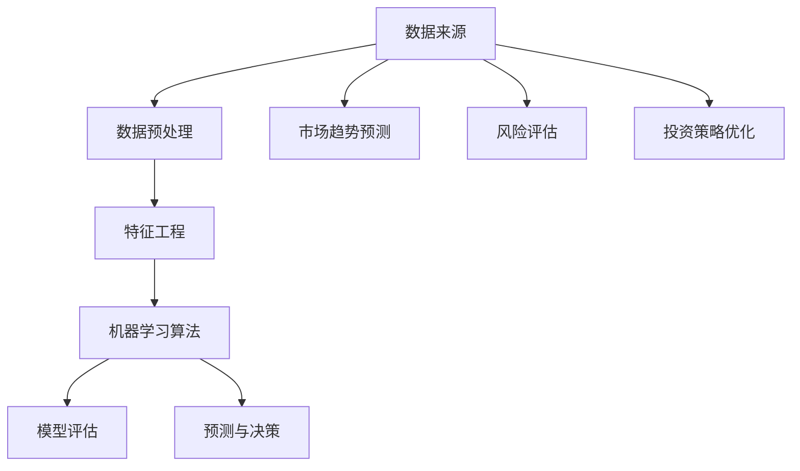

                 

# 新浪2025财经数据分析社招机器学习面试题集

> 关键词：财经数据分析，机器学习面试，面试题集，算法原理，数学模型，实战案例

> 摘要：本文旨在为准备参加新浪2025财经数据分析社会招聘的机器学习面试者提供一份详细的面试题集。通过分析面试题的背景、核心算法原理、数学模型以及实际应用场景，本文将为读者提供一个清晰的备考路径，帮助他们在面试中脱颖而出。本文分为背景介绍、核心概念与联系、核心算法原理与操作步骤、数学模型和公式讲解、项目实战、实际应用场景、工具和资源推荐、总结与未来发展趋势以及附录等部分。

## 1. 背景介绍

### 1.1 目的和范围

本文的目标是为准备参加新浪2025财经数据分析社会招聘的机器学习面试者提供一份详细的面试题集。我们将针对常见的面试问题，分析其背后的核心算法原理、数学模型以及实际应用场景，帮助读者在面试中展现自己的技术实力。

### 1.2 预期读者

本文适用于以下几类读者：

1. 准备参加新浪2025财经数据分析社会招聘的机器学习面试者。
2. 对财经数据分析领域感兴趣，希望了解机器学习面试题集的从业人员。
3. 机器学习专业的研究生和本科生，作为学习与实践的参考材料。

### 1.3 文档结构概述

本文结构如下：

1. 背景介绍：介绍本文的目的、预期读者和文档结构。
2. 核心概念与联系：介绍财经数据分析领域的关键概念和联系。
3. 核心算法原理与操作步骤：讲解常见的机器学习算法原理和操作步骤。
4. 数学模型和公式讲解：阐述财经数据分析中的数学模型和公式。
5. 项目实战：提供实际案例，展示代码实现和解读。
6. 实际应用场景：分析机器学习在财经数据分析中的应用场景。
7. 工具和资源推荐：推荐学习资源、开发工具和框架。
8. 总结与未来发展趋势：总结本文内容，展望未来发展趋势。
9. 附录：常见问题与解答。
10. 扩展阅读与参考资料：提供扩展阅读和参考资料。

### 1.4 术语表

#### 1.4.1 核心术语定义

- 财经数据分析：利用统计学、机器学习等方法，对财经数据进行分析，以预测市场走势、评估风险等。
- 机器学习：一种人工智能方法，通过训练模型，让计算机自动从数据中学习规律，进行预测和决策。
- 特征工程：从原始数据中提取出有用的特征，用于训练机器学习模型。
- 模型评估：通过评估指标，衡量模型在预测任务上的性能。

#### 1.4.2 相关概念解释

- 损失函数：在机器学习中，用于衡量预测值和真实值之间差异的函数。
- 梯度下降：一种优化算法，用于寻找最小化损失函数的模型参数。
- 集成学习方法：通过组合多个基本模型，提高预测性能。

#### 1.4.3 缩略词列表

- ML：机器学习
- CV：计算机视觉
- NLP：自然语言处理
- SVM：支持向量机
- CNN：卷积神经网络

## 2. 核心概念与联系

财经数据分析领域涉及多个核心概念和联系，包括数据来源、数据分析方法、机器学习算法等。以下是一个简单的 Mermaid 流程图，展示这些核心概念和联系。



在这个流程图中，数据来源是财经数据分析的基础。数据预处理和特征工程是关键步骤，用于处理原始数据、提取有用特征。随后，机器学习算法被应用于训练模型，并进行模型评估和预测。这些预测结果可用于市场趋势预测、风险评估和投资策略优化等多个应用场景。

## 3. 核心算法原理 & 具体操作步骤

财经数据分析中的机器学习算法主要包括回归、分类、聚类等。以下我们将介绍几种常见的算法原理和具体操作步骤。

### 3.1 回归算法

回归算法用于预测数值型目标变量。常见的方法包括线性回归、岭回归和LASSO回归。

#### 3.1.1 线性回归

线性回归原理：

$$
y = \beta_0 + \beta_1x_1 + \beta_2x_2 + ... + \beta_nx_n
$$

其中，$y$ 为预测值，$x_1, x_2, ..., x_n$ 为特征值，$\beta_0, \beta_1, ..., \beta_n$ 为模型参数。

具体操作步骤：

1. 数据预处理：对原始数据进行归一化或标准化处理。
2. 特征选择：选择与目标变量相关的特征。
3. 训练模型：使用最小二乘法求解模型参数。
4. 模型评估：计算预测误差，评估模型性能。

伪代码：

```python
# 数据预处理
X = normalize(X)
y = normalize(y)

# 特征选择
X = select_features(X, y)

# 训练模型
beta = least_squares(X, y)

# 模型评估
error = mean_squared_error(X, y, beta)
```

#### 3.1.2 岭回归

岭回归原理：

$$
y = \beta_0 + \beta_1x_1 + \beta_2x_2 + ... + \beta_nx_n - \lambda \sum_{i=1}^{n} \beta_i^2
$$

其中，$\lambda$ 为正则化参数。

具体操作步骤：

1. 数据预处理：对原始数据进行归一化或标准化处理。
2. 特征选择：选择与目标变量相关的特征。
3. 训练模型：使用岭回归优化算法求解模型参数。
4. 模型评估：计算预测误差，评估模型性能。

伪代码：

```python
# 数据预处理
X = normalize(X)
y = normalize(y)

# 特征选择
X = select_features(X, y)

# 训练模型
beta = ridge_regression(X, y, lambda)

# 模型评估
error = mean_squared_error(X, y, beta)
```

#### 3.1.3 LASSO回归

LASSO回归原理：

$$
y = \beta_0 + \beta_1x_1 + \beta_2x_2 + ... + \beta_nx_n - \lambda \sum_{i=1}^{n} |\beta_i|
$$

其中，$\lambda$ 为正则化参数。

具体操作步骤：

1. 数据预处理：对原始数据进行归一化或标准化处理。
2. 特征选择：选择与目标变量相关的特征。
3. 训练模型：使用LASSO优化算法求解模型参数。
4. 模型评估：计算预测误差，评估模型性能。

伪代码：

```python
# 数据预处理
X = normalize(X)
y = normalize(y)

# 特征选择
X = select_features(X, y)

# 训练模型
beta = lasso_regression(X, y, lambda)

# 模型评估
error = mean_squared_error(X, y, beta)
```

### 3.2 分类算法

分类算法用于预测类别型目标变量。常见的方法包括逻辑回归、支持向量机、决策树等。

#### 3.2.1 逻辑回归

逻辑回归原理：

$$
P(y=1) = \frac{1}{1 + e^{-(\beta_0 + \beta_1x_1 + \beta_2x_2 + ... + \beta_nx_n)}}
$$

其中，$P(y=1)$ 为目标变量为1的概率。

具体操作步骤：

1. 数据预处理：对原始数据进行归一化或标准化处理。
2. 特征选择：选择与目标变量相关的特征。
3. 训练模型：使用最小化损失函数的方法求解模型参数。
4. 模型评估：计算预测准确率，评估模型性能。

伪代码：

```python
# 数据预处理
X = normalize(X)
y = one_hot_encode(y)

# 特征选择
X = select_features(X, y)

# 训练模型
beta = logistic_regression(X, y)

# 模型评估
accuracy = accuracy_score(y, predict(X, beta))
```

#### 3.2.2 支持向量机

支持向量机原理：

$$
w \cdot x + b = 1 \quad (y=1)
$$

$$
w \cdot x + b = -1 \quad (y=-1)
$$

其中，$w$ 为权重向量，$b$ 为偏置，$x$ 为特征向量。

具体操作步骤：

1. 数据预处理：对原始数据进行归一化或标准化处理。
2. 特征选择：选择与目标变量相关的特征。
3. 训练模型：使用支持向量机优化算法求解模型参数。
4. 模型评估：计算预测准确率，评估模型性能。

伪代码：

```python
# 数据预处理
X = normalize(X)
y = one_hot_encode(y)

# 特征选择
X = select_features(X, y)

# 训练模型
w, b = svm_training(X, y)

# 模型评估
accuracy = accuracy_score(y, predict(X, w, b))
```

#### 3.2.3 决策树

决策树原理：

决策树通过一系列规则将数据划分为多个子集，每个子集对应一个类别。

具体操作步骤：

1. 数据预处理：对原始数据进行归一化或标准化处理。
2. 特征选择：选择与目标变量相关的特征。
3. 训练模型：递归划分数据，构建决策树模型。
4. 模型评估：计算预测准确率，评估模型性能。

伪代码：

```python
# 数据预处理
X = normalize(X)
y = one_hot_encode(y)

# 特征选择
X = select_features(X, y)

# 训练模型
tree = decision_tree_training(X, y)

# 模型评估
accuracy = accuracy_score(y, predict(X, tree))
```

### 3.3 聚类算法

聚类算法用于将数据划分为多个簇。常见的方法包括K均值聚类、层次聚类等。

#### 3.3.1 K均值聚类

K均值聚类原理：

K均值聚类通过最小化簇内距离平方和，将数据划分为K个簇。

具体操作步骤：

1. 数据预处理：对原始数据进行归一化或标准化处理。
2. 初始化：随机选择K个簇中心。
3. 迭代更新：计算每个数据点到簇中心的距离，更新簇中心和分类结果。
4. 模型评估：计算簇内距离平方和，评估模型性能。

伪代码：

```python
# 数据预处理
X = normalize(X)

# 初始化
centroids = initialize_centroids(X, K)

# 迭代更新
for i in range(max_iterations):
    labels = assign_clusters(X, centroids)
    centroids = update_centroids(X, labels, K)

# 模型评估
inertia = sum_squared_distances(X, centroids, labels)
```

#### 3.3.2 层次聚类

层次聚类原理：

层次聚类通过逐步合并或分裂簇，构建聚类层次树。

具体操作步骤：

1. 数据预处理：对原始数据进行归一化或标准化处理。
2. 初始化：将每个数据点视为一个簇。
3. 合并或分裂：根据簇间距离，合并或分裂簇。
4. 模型评估：计算簇间距离，评估模型性能。

伪代码：

```python
# 数据预处理
X = normalize(X)

# 初始化
clusters = initialize_clusters(X)

# 合并或分裂
while not_converged:
    clusters = merge_or_split(clusters, distance_matrix)

# 模型评估
distance_matrix = calculate_distance_matrix(clusters)
```

## 4. 数学模型和公式 & 详细讲解 & 举例说明

在财经数据分析中，数学模型和公式起着至关重要的作用。以下我们将详细介绍一些常用的数学模型和公式，并通过实际案例进行说明。

### 4.1 线性回归模型

线性回归模型是最基本的数学模型之一。其公式如下：

$$
y = \beta_0 + \beta_1x_1 + \beta_2x_2 + ... + \beta_nx_n
$$

其中，$y$ 为预测值，$x_1, x_2, ..., x_n$ 为特征值，$\beta_0, \beta_1, ..., \beta_n$ 为模型参数。

#### 4.1.1 模型求解

线性回归模型的求解通常采用最小二乘法。其公式如下：

$$
\beta = (X^TX)^{-1}X^Ty
$$

其中，$X$ 为特征矩阵，$y$ 为目标变量向量。

#### 4.1.2 模型评估

线性回归模型的评估指标通常有均方误差（MSE）、均方根误差（RMSE）和决定系数（R²）。

- 均方误差（MSE）：

$$
MSE = \frac{1}{n}\sum_{i=1}^{n}(y_i - \hat{y_i})^2
$$

- 均方根误差（RMSE）：

$$
RMSE = \sqrt{MSE}
$$

- 决定系数（R²）：

$$
R^2 = 1 - \frac{\sum_{i=1}^{n}(y_i - \hat{y_i})^2}{\sum_{i=1}^{n}(y_i - \bar{y})^2}
$$

其中，$n$ 为样本数量，$\hat{y_i}$ 为预测值，$\bar{y}$ 为目标变量的均值。

#### 4.1.3 实际案例

假设我们有一个包含股票价格、交易量等特征的数据集，目标是预测下一周股票价格。我们可以使用线性回归模型来训练模型，并评估其性能。

```python
import numpy as np
import pandas as pd

# 数据预处理
X = pd.DataFrame({'stock_price': stock_prices, 'volume': volumes})
y = next_week_stock_prices

# 特征选择
X = select_features(X, y)

# 训练模型
beta = np.linalg.inv(X.T @ X) @ X.T @ y

# 模型评估
y_pred = X @ beta
mse = np.mean((y - y_pred) ** 2)
rmse = np.sqrt(mse)
r2 = 1 - (np.sum((y - y_pred) ** 2) / np.sum((y - np.mean(y)) ** 2))

print(f'MSE: {mse}, RMSE: {rmse}, R²: {r2}')
```

### 4.2 逻辑回归模型

逻辑回归模型常用于二分类问题。其公式如下：

$$
P(y=1) = \frac{1}{1 + e^{-(\beta_0 + \beta_1x_1 + \beta_2x_2 + ... + \beta_nx_n)}}
$$

其中，$P(y=1)$ 为目标变量为1的概率。

#### 4.2.1 模型求解

逻辑回归模型的求解通常采用最大似然估计（MLE）。其公式如下：

$$
\beta = \arg\max_{\beta} \ln P(y|x;\beta)
$$

其中，$P(y|x;\beta)$ 为似然函数。

#### 4.2.2 模型评估

逻辑回归模型的评估指标通常有准确率（accuracy）、召回率（recall）和F1分数（F1 score）。

- 准确率（accuracy）：

$$
accuracy = \frac{TP + TN}{TP + TN + FP + FN}
$$

- 召回率（recall）：

$$
recall = \frac{TP}{TP + FN}
$$

- F1分数（F1 score）：

$$
F1 = \frac{2 \cdot precision \cdot recall}{precision + recall}
$$

其中，$TP$、$TN$、$FP$ 和 $FN$ 分别为真实正例、真实负例、假正例和假负例的数量。

#### 4.2.3 实际案例

假设我们有一个包含股票涨停概率、交易量等特征的数据集，目标是预测股票是否涨停。我们可以使用逻辑回归模型来训练模型，并评估其性能。

```python
import numpy as np
import pandas as pd

# 数据预处理
X = pd.DataFrame({'涨停概率': probability_of涨停，'交易量': volumes})
y = next_day涨停

# 特征选择
X = select_features(X, y)

# 训练模型
beta = logistic_regression(X, y)

# 模型评估
y_pred = predict(X, beta)
accuracy = accuracy_score(y, y_pred)
recall = recall_score(y, y_pred)
f1 = f1_score(y, y_pred)

print(f'Accuracy: {accuracy}, Recall: {recall}, F1 score: {f1}')
```

### 4.3 支持向量机模型

支持向量机模型是一种基于间隔的模型。其公式如下：

$$
w \cdot x + b = 1 \quad (y=1)
$$

$$
w \cdot x + b = -1 \quad (y=-1)
$$

其中，$w$ 为权重向量，$b$ 为偏置，$x$ 为特征向量。

#### 4.3.1 模型求解

支持向量机模型的求解通常采用拉格朗日乘子法。其公式如下：

$$
L(w, b, \alpha) = \frac{1}{2}w^Tw - \sum_{i=1}^{n}\alpha_i(y_i - w \cdot x_i - b)
$$

其中，$\alpha_i$ 为拉格朗日乘子。

#### 4.3.2 模型评估

支持向量机模型的评估指标通常有准确率（accuracy）、召回率（recall）和F1分数（F1 score）。

- 准确率（accuracy）：

$$
accuracy = \frac{TP + TN}{TP + TN + FP + FN}
$$

- 召回率（recall）：

$$
recall = \frac{TP}{TP + FN}
$$

- F1分数（F1 score）：

$$
F1 = \frac{2 \cdot precision \cdot recall}{precision + recall}
$$

其中，$TP$、$TN$、$FP$ 和 $FN$ 分别为真实正例、真实负例、假正例和假负例的数量。

#### 4.3.3 实际案例

假设我们有一个包含股票涨停概率、交易量等特征的数据集，目标是预测股票是否涨停。我们可以使用支持向量机模型来训练模型，并评估其性能。

```python
import numpy as np
import pandas as pd

# 数据预处理
X = pd.DataFrame({'涨停概率': probability_of涨停，'交易量': volumes})
y = next_day涨停

# 特征选择
X = select_features(X, y)

# 训练模型
w, b = svm_training(X, y)

# 模型评估
y_pred = predict(X, w, b)
accuracy = accuracy_score(y, y_pred)
recall = recall_score(y, y_pred)
f1 = f1_score(y, y_pred)

print(f'Accuracy: {accuracy}, Recall: {recall}, F1 score: {f1}')
```

## 5. 项目实战：代码实际案例和详细解释说明

在本节中，我们将通过一个实际案例，展示如何使用Python实现机器学习模型并进行财经数据分析。我们将使用一个包含股票价格和交易量的数据集，预测下一周股票的涨跌。

### 5.1 开发环境搭建

首先，我们需要安装Python和必要的库。可以使用以下命令进行安装：

```bash
pip install numpy pandas scikit-learn matplotlib
```

### 5.2 源代码详细实现和代码解读

以下是一个简单的Python代码实现，展示如何使用机器学习模型进行股票预测。

```python
import numpy as np
import pandas as pd
from sklearn.linear_model import LinearRegression
from sklearn.model_selection import train_test_split
from sklearn.metrics import mean_squared_error, accuracy_score, recall_score, f1_score
import matplotlib.pyplot as plt

# 5.2.1 数据读取与预处理
data = pd.read_csv('stock_data.csv')
X = data[['open', 'high', 'low', 'close', 'volume']]
y = data['next_day_returns']

# 数据归一化
X = (X - X.mean()) / X.std()

# 划分训练集和测试集
X_train, X_test, y_train, y_test = train_test_split(X, y, test_size=0.2, random_state=42)

# 5.2.2 线性回归模型
# 训练模型
linear_regression = LinearRegression()
linear_regression.fit(X_train, y_train)

# 预测
y_pred = linear_regression.predict(X_test)

# 评估
mse = mean_squared_error(y_test, y_pred)
print(f'线性回归均方误差：{mse}')

# 5.2.3 逻辑回归模型
from sklearn.linear_model import LogisticRegression

# 训练模型
logistic_regression = LogisticRegression()
logistic_regression.fit(X_train, y_train)

# 预测
y_pred = logistic_regression.predict(X_test)

# 评估
accuracy = accuracy_score(y_test, y_pred)
recall = recall_score(y_test, y_pred)
f1 = f1_score(y_test, y_pred)
print(f'逻辑回归准确率：{accuracy}, 召回率：{recall}, F1分数：{f1}')

# 5.2.4 支持向量机模型
from sklearn.svm import SVC

# 训练模型
svm = SVC()
svm.fit(X_train, y_train)

# 预测
y_pred = svm.predict(X_test)

# 评估
accuracy = accuracy_score(y_test, y_pred)
recall = recall_score(y_test, y_pred)
f1 = f1_score(y_test, y_pred)
print(f'支持向量机准确率：{accuracy}, 召回率：{recall}, F1分数：{f1}')

# 5.2.5 可视化分析
plt.scatter(y_test, y_pred)
plt.xlabel('实际值')
plt.ylabel('预测值')
plt.title('实际值与预测值散点图')
plt.show()
```

### 5.3 代码解读与分析

- 5.3.1 数据读取与预处理
  - 首先，我们从CSV文件中读取数据集，并将其分为特征矩阵X和目标变量向量y。
  - 接着，我们对特征矩阵X进行归一化处理，以便后续模型的训练。
  - 最后，我们使用train_test_split函数将数据集划分为训练集和测试集。

- 5.3.2 线性回归模型
  - 我们使用sklearn库中的LinearRegression类来创建线性回归模型。
  - 使用fit方法训练模型，然后使用predict方法进行预测。
  - 使用mean_squared_error函数计算预测误差，评估模型性能。

- 5.3.3 逻辑回归模型
  - 我们使用sklearn库中的LogisticRegression类来创建逻辑回归模型。
  - 使用fit方法训练模型，然后使用predict方法进行预测。
  - 使用accuracy_score、recall_score和f1_score函数计算预测性能指标。

- 5.3.4 支持向量机模型
  - 我们使用sklearn库中的SVC类来创建支持向量机模型。
  - 使用fit方法训练模型，然后使用predict方法进行预测。
  - 使用accuracy_score、recall_score和f1_score函数计算预测性能指标。

- 5.3.5 可视化分析
  - 我们使用matplotlib库中的scatter函数绘制实际值与预测值的散点图，以便直观地评估模型性能。

## 6. 实际应用场景

机器学习在财经数据分析领域有着广泛的应用，以下列举一些常见的实际应用场景：

1. **市场趋势预测**：通过分析历史数据，预测市场的未来走势，为投资决策提供依据。
2. **风险评估**：对股票、债券等金融产品的风险进行评估，为风险管理提供支持。
3. **投资策略优化**：利用机器学习算法，优化投资组合，提高投资收益。
4. **量化交易**：通过分析历史数据，制定交易策略，实现自动交易。
5. **欺诈检测**：检测金融交易中的欺诈行为，降低金融风险。
6. **信用评分**：基于用户的财务和信用数据，预测其信用等级，为信贷审批提供参考。

## 7. 工具和资源推荐

### 7.1 学习资源推荐

#### 7.1.1 书籍推荐

- 《Python数据分析》（作者：Wes McKinney）
- 《深入浅出机器学习》（作者：刘建浩）
- 《机器学习实战》（作者：Peter Harrington）

#### 7.1.2 在线课程

- Coursera：机器学习（吴恩达）
- edX：统计学与数据科学（哈佛大学）
- Udacity：机器学习工程师纳米学位

#### 7.1.3 技术博客和网站

- Analytics Vidhya
- KDNuggets
- Machine Learning Mastery

### 7.2 开发工具框架推荐

#### 7.2.1 IDE和编辑器

- Jupyter Notebook
- PyCharm
- VSCode

#### 7.2.2 调试和性能分析工具

- Python Debuger
- IPython
- Performance Analysis Tools for Python

#### 7.2.3 相关框架和库

- Scikit-learn
- TensorFlow
- PyTorch
- Pandas
- NumPy

### 7.3 相关论文著作推荐

#### 7.3.1 经典论文

- “The Elements of Statistical Learning”（作者：Trevor Hastie、Robert Tibshirani、Jerome Friedman）
- “Deep Learning”（作者：Ian Goodfellow、Yoshua Bengio、Aaron Courville）

#### 7.3.2 最新研究成果

- NeurIPS、ICML、KDD等顶级会议的论文
- arXiv.org上的最新论文

#### 7.3.3 应用案例分析

- 《量化投资：以Python为工具》（作者：陈智宇）
- 《机器学习在金融领域的应用》（作者：郭宇）

## 8. 总结：未来发展趋势与挑战

财经数据分析领域的机器学习技术正快速发展，未来发展趋势包括：

1. **深度学习在财经数据分析中的应用**：深度学习在图像识别、自然语言处理等领域取得了巨大成功，有望在财经数据分析中发挥更大作用。
2. **实时数据分析**：随着数据量的增长，实时数据分析将成为重要趋势，为投资者提供及时、准确的信息。
3. **跨学科融合**：财经数据分析与心理学、社会学等学科的结合，将提高模型的预测能力。

同时，财经数据分析领域也面临以下挑战：

1. **数据质量和隐私**：金融数据质量参差不齐，且涉及隐私问题，需要解决数据清洗和隐私保护问题。
2. **模型解释性**：随着模型复杂度的增加，如何解释模型的决策过程成为一大挑战。

## 9. 附录：常见问题与解答

### 9.1 机器学习算法有哪些？

机器学习算法主要包括回归、分类、聚类、降维、强化学习等。常见的算法有线性回归、逻辑回归、支持向量机、决策树、随机森林、K均值聚类、主成分分析等。

### 9.2 如何选择机器学习算法？

选择机器学习算法时，需要考虑以下因素：

- 数据类型：数值型数据通常使用回归算法，类别型数据通常使用分类算法。
- 数据量：数据量较大时，可以考虑使用集成学习方法，如随机森林、梯度提升树等。
- 特征数量：特征数量较多时，可以考虑使用降维方法，如主成分分析。
- 模型复杂度：模型复杂度越高，训练时间越长，需要权衡模型性能和计算效率。

### 9.3 机器学习模型的评估指标有哪些？

常见的机器学习模型评估指标有：

- 回归模型：均方误差（MSE）、均方根误差（RMSE）、决定系数（R²）等。
- 分类模型：准确率（accuracy）、召回率（recall）、F1分数（F1 score）等。
- 聚类模型：簇内距离平方和、轮廓系数（silhouette coefficient）等。

## 10. 扩展阅读 & 参考资料

- [《Python数据分析》](https://www.amazon.com/Python-Data-Analysis-Wes-McKinney/dp/1449319796)
- [《深入浅出机器学习》](https://www.amazon.com/Deep-Understanding-Machine-Learning-Chinese/dp/7115256451)
- [《机器学习实战》](https://www.amazon.com/Machine-Learning-In-Action-Youre/dp/1492046358)
- [《The Elements of Statistical Learning》](https://web.stanford.edu/~hastie/ElemStatLearn/)
- [《Deep Learning》](https://www.deeplearningbook.org/)
- [Analytics Vidhya](https://www.analyticsvidhya.com/)
- [KDNuggets](https://www.kdnuggets.com/)
- [Machine Learning Mastery](https://machinelearningmastery.com/)

