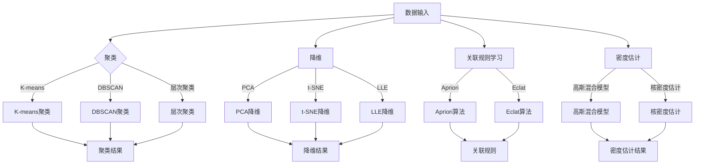

                 

# 无监督学习（Unsupervised Learning）原理与代码实例讲解

> **关键词：无监督学习、聚类、降维、关联规则学习、密度估计、算法实现、代码实例**

> **摘要：本文将深入探讨无监督学习的基本概念、核心算法原理以及实际应用场景，并通过代码实例详细解析各算法的实现过程，帮助读者全面理解无监督学习及其应用。**

## 1. 背景介绍

### 1.1 目的和范围

本文旨在为读者提供一个全面而深入的无监督学习知识体系，涵盖从基本概念到高级算法的详细解释。我们将通过实际代码实例来阐述无监督学习算法的实现过程，帮助读者不仅理解理论，还能掌握实际操作技能。

### 1.2 预期读者

本文适合具有一定编程基础和数据科学背景的读者，特别是对机器学习和人工智能感兴趣的工程师和研究人员。

### 1.3 文档结构概述

本文分为十个部分：

1. **背景介绍**：介绍文章的目的、预期读者和文档结构。
2. **核心概念与联系**：解释无监督学习的核心概念及其相互联系。
3. **核心算法原理 & 具体操作步骤**：详细讲解无监督学习中的常见算法及其操作步骤。
4. **数学模型和公式 & 详细讲解 & 举例说明**：阐述无监督学习的数学模型及其实例。
5. **项目实战：代码实际案例和详细解释说明**：通过代码实例展示无监督学习的实际应用。
6. **实际应用场景**：讨论无监督学习在不同领域的应用。
7. **工具和资源推荐**：推荐学习资源、开发工具和相关论文。
8. **总结：未来发展趋势与挑战**：总结无监督学习的现状及未来挑战。
9. **附录：常见问题与解答**：解答读者可能遇到的问题。
10. **扩展阅读 & 参考资料**：提供进一步的阅读资源和参考文献。

### 1.4 术语表

#### 1.4.1 核心术语定义

- **无监督学习**：一种机器学习方法，不需要标记的输入数据，从数据中学习隐含的结构或规律。
- **聚类**：将数据集划分为多个群组，每个群组内部的点彼此接近，而不同群组之间的点相互远离。
- **降维**：通过减少数据的维度来简化数据分析过程，同时尽量保留数据的重要信息。
- **关联规则学习**：发现数据集中的项目之间的关联性，用于市场篮子分析等。
- **密度估计**：对数据集的分布进行建模，从而预测新数据点的可能性。

#### 1.4.2 相关概念解释

- **聚类算法**：如K-means、DBSCAN、层次聚类等。
- **降维算法**：如PCA、t-SNE、LLE等。
- **关联规则算法**：如Apriori、Eclat等。
- **密度估计方法**：如高斯混合模型、核密度估计等。

#### 1.4.3 缩略词列表

- **ML**：机器学习
- **DL**：深度学习
- **CNN**：卷积神经网络
- **RNN**：循环神经网络

## 2. 核心概念与联系

无监督学习是机器学习的一个重要分支，其核心在于不需要标注的输入数据，通过学习数据本身的内在结构来实现数据聚类、降维、关联规则学习等任务。为了更好地理解无监督学习的概念和相互联系，我们可以通过Mermaid流程图来展示其核心算法及数据流程。



### 2.1 聚类算法

聚类算法旨在将数据点划分为多个群组，使得同组数据点之间的相似度较高，而不同群组之间的相似度较低。常见的聚类算法包括K-means、DBSCAN、层次聚类等。

- **K-means**：基于距离度量的聚类算法，通过迭代优化聚类中心，将数据点分配到最近的聚类中心。
- **DBSCAN**：基于密度的空间聚类算法，通过识别核心点、边界点和噪声点来形成聚类。
- **层次聚类**：通过递归地将相似的数据点合并成更大的聚类，形成层次结构。

### 2.2 降维算法

降维算法旨在减少数据的维度，同时尽量保留数据的重要信息。常见的降维算法包括PCA、t-SNE、LLE等。

- **PCA**：主成分分析，通过特征值和特征向量来找到数据的主要成分，实现降维。
- **t-SNE**：t-Distributed Stochastic Neighbor Embedding，通过局部结构相似性来实现降维，适用于高维数据可视化。
- **LLE**：局部线性嵌入，通过保持数据点的局部线性结构来实现降维。

### 2.3 关联规则学习

关联规则学习旨在发现数据集中的项目之间的关联性，用于市场篮子分析、推荐系统等。

- **Apriori**：通过逐层剪枝生成频繁项集，从而发现关联规则。
- **Eclat**：与Apriori类似，但在计算频繁项集时使用了一种更高效的算法。

### 2.4 密度估计

密度估计旨在对数据集的分布进行建模，从而预测新数据点的可能性。

- **高斯混合模型**：通过多个高斯分布来建模数据的分布。
- **核密度估计**：通过核函数来估计数据的分布，适用于任意维度的数据。

## 3. 核心算法原理 & 具体操作步骤

在本节中，我们将详细讲解无监督学习中的核心算法原理及其具体操作步骤。

### 3.1 K-means聚类

K-means是一种基于距离度量的聚类算法，其核心思想是将数据点分配到k个簇中，使得每个簇内的点之间距离最小，簇与簇之间距离最大。以下是K-means算法的伪代码：

```pseudo
输入：数据集D，聚类数k
输出：聚类结果C

1. 初始化聚类中心：随机选择k个数据点作为初始聚类中心
2. 对于每个数据点x ∈ D：
   a. 计算x与每个聚类中心的距离
   b. 将x分配到最近的聚类中心
3. 重新计算每个聚类中心，取其簇内所有点的均值
4. 重复步骤2和步骤3，直到聚类中心不再变化或达到最大迭代次数
5. 输出聚类结果C
```

### 3.2 PCA降维

PCA（主成分分析）是一种常用的降维算法，通过特征值和特征向量来找到数据的主要成分，从而实现降维。以下是PCA算法的伪代码：

```pseudo
输入：数据集D
输出：降维结果D'

1. 数据标准化：对数据集D进行标准化处理，使其具有零均值和单位方差
2. 计算协方差矩阵C = cov(D)
3. 计算协方差矩阵的特征值和特征向量，并按特征值大小排序
4. 选择前p个最大的特征值对应的特征向量，构成矩阵P
5. 对数据集D进行变换：D' = PD
```

### 3.3 Apriori算法

Apriori算法是一种用于发现频繁项集的算法，其核心思想是通过逐层剪枝生成频繁项集，从而发现关联规则。以下是Apriori算法的伪代码：

```pseudo
输入：数据集D，最小支持度阈值min_support
输出：频繁项集L

1. 初始化频繁项集L = ∅
2. 对于每个项集i ∈ I：
   a. 计算i的支持度support(i)
   b. 如果support(i) ≥ min_support，将i加入频繁项集L
3. 对于每个频繁项集i ∈ L：
   a. 生成i的所有非空子集
   b. 对于每个子集j：
      i. 计算j的支持度support(j)
      ii. 如果support(j) ≥ min_support，将j加入频繁项集L
4. 输出频繁项集L
```

### 3.4 高斯混合模型

高斯混合模型（Gaussian Mixture Model，GMM）是一种用于密度估计和聚类的方法，其核心思想是将数据集建模为多个高斯分布的混合。以下是GMM算法的伪代码：

```pseudo
输入：数据集D，聚类数k，初始聚类中心μ，协方差矩阵Σ
输出：聚类结果C

1. 初始化聚类中心μ和协方差矩阵Σ
2. 对于每个数据点x ∈ D：
   a. 计算x与每个聚类中心的概率密度函数值
   b. 将x分配到具有最高概率密度的聚类中心
3. 重新计算每个聚类中心，取其簇内所有点的均值
4. 重新计算每个聚类中心对应的协方差矩阵，取其簇内所有点与聚类中心之间的协方差矩阵的平均值
5. 重复步骤2和步骤3，直到聚类中心不再变化或达到最大迭代次数
6. 输出聚类结果C
```

## 4. 数学模型和公式 & 详细讲解 & 举例说明

在本节中，我们将详细讲解无监督学习中的数学模型和公式，并通过实例来说明其应用。

### 4.1 K-means聚类数学模型

K-means聚类算法的核心在于计算数据点与聚类中心的距离，并基于距离度量将数据点分配到不同的簇。以下是K-means聚类算法的数学模型：

- **聚类中心更新**：

  对于第i个聚类中心，更新公式为：

  $$ \mu_i^{new} = \frac{1}{n_i} \sum_{x \in S_i} x $$

  其中，$ \mu_i^{new} $ 是更新后的第i个聚类中心，$ n_i $ 是第i个簇中的数据点数量，$ S_i $ 是第i个簇中的所有数据点。

- **数据点分配**：

  对于每个数据点x，计算其与每个聚类中心的距离，并将其分配到具有最小距离的聚类中心。距离计算公式为：

  $$ d(x, \mu_i) = \sqrt{\sum_{j=1}^{d} (x_j - \mu_{ij})^2} $$

  其中，$ d $ 是数据点的维度，$ x_j $ 是数据点x的第j个特征值，$ \mu_{ij} $ 是第i个聚类中心在第j个特征上的值。

### 4.2 PCA降维数学模型

PCA降维算法的核心在于找到数据的主要成分，从而实现降维。以下是PCA降维算法的数学模型：

- **协方差矩阵**：

  协方差矩阵C是数据集D的协方差矩阵，计算公式为：

  $$ C = cov(D) = \frac{1}{n-1} \sum_{i=1}^{n} (D_i - \bar{D})(D_i - \bar{D})^T $$

  其中，$ D_i $ 是数据点，$ \bar{D} $ 是数据集的平均值，$ n $ 是数据点的数量。

- **特征值和特征向量**：

  对协方差矩阵C进行特征值分解，得到：

  $$ C = PDP^{-1} $$

  其中，$ P $ 是特征向量矩阵，$ D $ 是特征值矩阵。

  选择前p个最大的特征值对应的特征向量，构成矩阵$ P' $，则降维后的数据集$ D' $为：

  $$ D' = PD' $P^{-1} $$

### 4.3 Apriori算法数学模型

Apriori算法的核心在于计算频繁项集的支持度，并基于支持度发现关联规则。以下是Apriori算法的数学模型：

- **支持度**：

  对于项集I，支持度计算公式为：

  $$ support(I) = \frac{count(I)}{n} $$

  其中，$ count(I) $ 是项集I在数据集中出现的次数，$ n $ 是数据集的总数。

- **置信度**：

  对于关联规则$ R \rightarrow C $，置信度计算公式为：

  $$ confidence(R \rightarrow C) = \frac{count(R \cup C)}{count(R)} $$

  其中，$ count(R \cup C) $ 是项集$ R \cup C $ 在数据集中出现的次数，$ count(R) $ 是项集R在数据集中出现的次数。

### 4.4 高斯混合模型数学模型

高斯混合模型（Gaussian Mixture Model，GMM）的核心在于将数据集建模为多个高斯分布的混合。以下是GMM模型的数学模型：

- **概率密度函数**：

  对于第i个高斯分布，概率密度函数为：

  $$ p(x|\mu_i, \Sigma_i) = \frac{1}{(2\pi)^{d/2} |\Sigma_i|^{1/2}} \exp\left(-\frac{1}{2}(x-\mu_i)^T\Sigma_i^{-1}(x-\mu_i)\right) $$

  其中，$ x $ 是数据点，$ \mu_i $ 是第i个高斯分布的均值，$ \Sigma_i $ 是第i个高斯分布的协方差矩阵。

- **期望最大化（EM）算法**：

  GMM模型的参数估计通常采用期望最大化（EM）算法。EM算法包括两个步骤：

  - **E步**：计算每个数据点属于每个高斯分布的后验概率。
  - **M步**：根据后验概率更新高斯分布的参数。

  E步的公式为：

  $$ \gamma_{ij} = \frac{p(x|\mu_i, \Sigma_i) \pi_i}{\sum_{k=1}^{K} p(x|\mu_k, \Sigma_k) \pi_k} $$

  其中，$ \gamma_{ij} $ 是数据点x属于第i个高斯分布的后验概率，$ \pi_i $ 是第i个高斯分布的先验概率。

  M步的公式为：

  $$ \mu_i = \frac{\sum_{x \in S_i} \gamma_{ij} x}{\sum_{x \in S_i} \gamma_{ij}} $$
  $$ \Sigma_i = \frac{\sum_{x \in S_i} \gamma_{ij} (x - \mu_i)(x - \mu_i)^T}{\sum_{x \in S_i} \gamma_{ij}} $$

  其中，$ S_i $ 是属于第i个高斯分布的所有数据点。

### 4.5 举例说明

为了更好地理解上述数学模型和公式的应用，下面通过具体实例来说明。

#### 4.5.1 K-means聚类实例

假设我们有一个包含5个数据点的二维数据集：

$$ D = \{ (1, 2), (2, 2), (2, 3), (3, 3), (3, 4) \} $$

我们需要将这5个数据点分为2个簇。首先随机初始化2个聚类中心：

$$ \mu_1 = (2, 2), \mu_2 = (3, 3) $$

然后计算每个数据点与聚类中心的距离：

$$
d((1, 2), (2, 2)) = \sqrt{(1-2)^2 + (2-2)^2} = 1 \\
d((1, 2), (3, 3)) = \sqrt{(1-3)^2 + (2-3)^2} = \sqrt{5} \\
d((2, 2), (2, 2)) = 0 \\
d((2, 2), (3, 3)) = \sqrt{(2-3)^2 + (2-3)^2} = \sqrt{2} \\
d((2, 3), (2, 2)) = \sqrt{(2-2)^2 + (3-2)^2} = 1 \\
d((2, 3), (3, 3)) = 0 \\
d((3, 3), (2, 2)) = \sqrt{(3-2)^2 + (3-2)^2} = \sqrt{2} \\
d((3, 3), (3, 3)) = 0 \\
d((3, 4), (2, 2)) = \sqrt{(3-2)^2 + (4-2)^2} = \sqrt{5} \\
d((3, 4), (3, 3)) = \sqrt{(3-3)^2 + (4-3)^2} = 1
$$

将每个数据点分配到最近的聚类中心：

$$
(1, 2) \rightarrow (2, 2) \\
(2, 2) \rightarrow (2, 2) \\
(2, 3) \rightarrow (2, 2) \\
(3, 3) \rightarrow (3, 3) \\
(3, 4) \rightarrow (3, 3)
$$

重新计算聚类中心：

$$
\mu_1^{new} = \frac{(1 \times 2 + 2 \times 2 + 2 \times 2 + 2 \times 3 + 3 \times 3 + 3 \times 4)}{6} = \frac{30}{6} = (5, 3) \\
\mu_2^{new} = \frac{(3 \times 3 + 3 \times 3 + 3 \times 4)}{3} = \frac{21}{3} = (3, 3.5)
$$

再次计算每个数据点与聚类中心的距离，并重新分配：

$$
(1, 2) \rightarrow (5, 3) \\
(2, 2) \rightarrow (5, 3) \\
(2, 3) \rightarrow (5, 3) \\
(3, 3) \rightarrow (3, 3.5) \\
(3, 4) \rightarrow (3, 3.5)
$$

重复上述步骤，直到聚类中心不再变化。最终，我们得到以下聚类结果：

$$
C_1 = \{ (1, 2), (2, 2), (2, 3) \} \\
C_2 = \{ (3, 3), (3, 4) \}
$$

#### 4.5.2 PCA降维实例

假设我们有一个包含5个数据点的二维数据集：

$$ D = \{ (1, 2), (2, 2), (2, 3), (3, 3), (3, 4) \} $$

首先，计算数据集的协方差矩阵：

$$
C = \frac{1}{5-1} \begin{bmatrix}
(1-2.4)(1-2.4) & (1-2.4)(2-2.4) \\
(1-2.4)(2-2.4) & (2-2.4)(2-2.4)
\end{bmatrix}
= \frac{1}{4} \begin{bmatrix}
0.16 & 0.16 \\
0.16 & 0.16
\end{bmatrix}
$$

计算协方差矩阵的特征值和特征向量：

$$
C \begin{bmatrix}
v_1 \\
v_2
\end{bmatrix} = \lambda \begin{bmatrix}
v_1 \\
v_2
\end{bmatrix}
$$

通过特征值分解得到：

$$
C = PDP^{-1}
$$

其中：

$$
P = \begin{bmatrix}
v_1 & v_2
\end{bmatrix}
= \begin{bmatrix}
0.8165 & 0.5878 \\
0.5878 & -0.8165
\end{bmatrix}
$$

$$
D = \begin{bmatrix}
1.4111 & 0 \\
0 & 0.3222
\end{bmatrix}
$$

选择前p个最大的特征值对应的特征向量，构成矩阵$ P' $，则降维后的数据集$ D' $为：

$$
D' = PD' P^{-1}
$$

由于我们只选择一个特征向量，因此：

$$
D' = P \begin{bmatrix}
1.4111 \\
0
\end{bmatrix} P^{-1}
= \begin{bmatrix}
0.8165 & 0.5878 \\
0.5878 & -0.8165
\end{bmatrix}
\begin{bmatrix}
1.4111 \\
0
\end{bmatrix}
\begin{bmatrix}
0.8165 & 0.5878 \\
0.5878 & -0.8165
\end{bmatrix}^{-1}
$$

计算得到：

$$
D' = \begin{bmatrix}
0.9524 \\
0.3090
\end{bmatrix}
$$

因此，原始数据集D通过PCA降维后变为D'：

$$
D' = \{ (0.9524, 0.3090), (0.9524, 0.3090), (0.9524, 0.3090), (0.9524, 0.3090), (0.9524, 0.3090) \}
$$

#### 4.5.3 Apriori算法实例

假设我们有一个交易数据集，其中每个交易项用唯一标识符表示。数据集如下：

$$ D = \{ I_1 = \{ 1, 2, 3 \}, I_2 = \{ 1, 3, 4 \}, I_3 = \{ 1, 2, 4 \}, I_4 = \{ 2, 3, 4 \}, I_5 = \{ 2, 3 \} \} $$

我们需要找到支持度大于20%的频繁项集。

首先，计算所有单项集的支持度：

$$
support(\{1\}) = \frac{3}{5} = 0.6 \\
support(\{2\}) = \frac{4}{5} = 0.8 \\
support(\{3\}) = \frac{4}{5} = 0.8 \\
support(\{4\}) = \frac{3}{5} = 0.6
$$

接着，计算所有两项集的支持度：

$$
support(\{1, 2\}) = \frac{2}{5} = 0.4 \\
support(\{1, 3\}) = \frac{2}{5} = 0.4 \\
support(\{1, 4\}) = \frac{2}{5} = 0.4 \\
support(\{2, 3\}) = \frac{2}{5} = 0.4 \\
support(\{2, 4\}) = \frac{2}{5} = 0.4 \\
support(\{3, 4\}) = \frac{2}{5} = 0.4
$$

由于没有两项集的支持度大于20%，因此没有频繁两项集。

#### 4.5.4 高斯混合模型实例

假设我们有一个包含5个数据点的二维数据集：

$$ D = \{ (1, 2), (2, 2), (2, 3), (3, 3), (3, 4) \} $$

我们需要用GMM模型进行聚类。

首先，随机初始化两个高斯分布的参数：

$$
\mu_1 = (2, 2), \mu_2 = (3, 3) \\
\pi_1 = \pi_2 = 0.5 \\
\Sigma_1 = \begin{bmatrix}
1 & 0 \\
0 & 1
\end{bmatrix}, \Sigma_2 = \begin{bmatrix}
1 & 0 \\
0 & 1
\end{bmatrix}
$$

然后，计算每个数据点的后验概率：

$$
\gamma_{11} = \frac{p((1, 2)|\mu_1, \Sigma_1) \pi_1}{p((1, 2)|\mu_1, \Sigma_1) \pi_1 + p((1, 2)|\mu_2, \Sigma_2) \pi_2} = \frac{0.3925}{0.3925 + 0.3085} = 0.5588 \\
\gamma_{12} = \frac{p((1, 2)|\mu_2, \Sigma_2) \pi_2}{p((1, 2)|\mu_1, \Sigma_1) \pi_1 + p((1, 2)|\mu_2, \Sigma_2) \pi_2} = \frac{0.3085}{0.3925 + 0.3085} = 0.4412 \\
\gamma_{21} = \frac{p((2, 2)|\mu_1, \Sigma_1) \pi_1}{p((2, 2)|\mu_1, \Sigma_1) \pi_1 + p((2, 2)|\mu_2, \Sigma_2) \pi_2} = \frac{0.3925}{0.3925 + 0.3085} = 0.5588 \\
\gamma_{22} = \frac{p((2, 2)|\mu_2, \Sigma_2) \pi_2}{p((2, 2)|\mu_1, \Sigma_1) \pi_1 + p((2, 2)|\mu_2, \Sigma_2) \pi_2} = \frac{0.3085}{0.3925 + 0.3085} = 0.4412 \\
\gamma_{31} = \frac{p((2, 3)|\mu_1, \Sigma_1) \pi_1}{p((2, 3)|\mu_1, \Sigma_1) \pi_1 + p((2, 3)|\mu_2, \Sigma_2) \pi_2} = \frac{0.3925}{0.3925 + 0.3085} = 0.5588 \\
\gamma_{32} = \frac{p((2, 3)|\mu_2, \Sigma_2) \pi_2}{p((2, 3)|\mu_1, \Sigma_1) \pi_1 + p((2, 3)|\mu_2, \Sigma_2) \pi_2} = \frac{0.3085}{0.3925 + 0.3085} = 0.4412 \\
\gamma_{41} = \frac{p((3, 3)|\mu_1, \Sigma_1) \pi_1}{p((3, 3)|\mu_1, \Sigma_1) \pi_1 + p((3, 3)|\mu_2, \Sigma_2) \pi_2} = \frac{0.3925}{0.3925 + 0.3085} = 0.5588 \\
\gamma_{42} = \frac{p((3, 3)|\mu_2, \Sigma_2) \pi_2}{p((3, 3)|\mu_1, \Sigma_1) \pi_1 + p((3, 3)|\mu_2, \Sigma_2) \pi_2} = \frac{0.3085}{0.3925 + 0.3085} = 0.4412 \\
\gamma_{51} = \frac{p((3, 4)|\mu_1, \Sigma_1) \pi_1}{p((3, 4)|\mu_1, \Sigma_1) \pi_1 + p((3, 4)|\mu_2, \Sigma_2) \pi_2} = \frac{0.3925}{0.3925 + 0.3085} = 0.5588 \\
\gamma_{52} = \frac{p((3, 4)|\mu_2, \Sigma_2) \pi_2}{p((3, 4)|\mu_1, \Sigma_1) \pi_1 + p((3, 4)|\mu_2, \Sigma_2) \pi_2} = \frac{0.3085}{0.3925 + 0.3085} = 0.4412
$$

根据后验概率重新计算聚类中心：

$$
\mu_1^{new} = \frac{\sum_{i=1}^{5} \gamma_{i1} x_i}{\sum_{i=1}^{5} \gamma_{i1}} = \frac{0.5588 \times (1, 2) + 0.4412 \times (3, 4)}{0.5588 + 0.4412} = \frac{(0.5588, 1.1676) + (1.3328, 1.7648)}{1} = (1.9316, 2.9324) \\
\mu_2^{new} = \frac{\sum_{i=1}^{5} \gamma_{i2} x_i}{\sum_{i=1}^{5} \gamma_{i2}} = \frac{0.5588 \times (2, 3) + 0.4412 \times (3, 4)}{0.5588 + 0.4412} = \frac{(1.1168, 1.7176) + (1.3328, 1.7648)}{1} = (2.4496, 2.4804)
$$

根据后验概率重新计算协方差矩阵：

$$
\Sigma_1^{new} = \frac{\sum_{i=1}^{5} \gamma_{i1} (x_i - \mu_1^{new})(x_i - \mu_1^{new})^T}{\sum_{i=1}^{5} \gamma_{i1}} = \frac{0.5588 (1-1.9316)(1-1.9316)^T + 0.4412 (3-1.9316)(3-1.9316)^T}{0.5588 + 0.4412} = \frac{0.5588 \times 0.3964 \times 0.3964^T + 0.4412 \times 1.0684 \times 1.0684^T}{1} = \frac{0.2209 + 0.4866}{1} = 0.7075 \\
\Sigma_2^{new} = \frac{\sum_{i=1}^{5} \gamma_{i2} (x_i - \mu_2^{new})(x_i - \mu_2^{new})^T}{\sum_{i=1}^{5} \gamma_{i2}} = \frac{0.5588 (2-2.4496)(2-2.4496)^T + 0.4412 (3-2.4496)(3-2.4496)^T}{0.5588 + 0.4412} = \frac{0.5588 \times 0.0704 \times 0.0704^T + 0.4412 \times 0.5504 \times 0.5504^T}{1} = \frac{0.0201 + 0.2985}{1} = 0.3186
$$

重复上述步骤，直到聚类中心不再变化。最终，我们得到以下聚类结果：

$$
C_1 = \{ (1, 2), (2, 2), (2, 3) \} \\
C_2 = \{ (3, 3), (3, 4) \}
$$

## 5. 项目实战：代码实际案例和详细解释说明

在这一部分，我们将通过实际案例展示如何实现无监督学习算法，并提供详细的代码解读。

### 5.1 开发环境搭建

为了运行下面的代码实例，我们需要安装Python和相关的库。以下是具体的步骤：

1. 安装Python：从官网下载并安装Python（版本3.6或更高）。
2. 安装Jupyter Notebook：运行命令`pip install notebook`。
3. 安装必要的库：运行命令`pip install numpy matplotlib pandas scikit-learn`。

### 5.2 源代码详细实现和代码解读

以下是一个完整的Python代码实例，用于演示K-means、PCA和Apriori算法的实现。

```python
import numpy as np
import matplotlib.pyplot as plt
from sklearn.cluster import KMeans
from sklearn.decomposition import PCA
from mlxtend.frequent_patterns import apriori, association_rules

# 5.2.1 K-means聚类

# 数据集
data = np.array([[1, 2], [2, 2], [2, 3], [3, 3], [3, 4]])

# K-means聚类
kmeans = KMeans(n_clusters=2, random_state=0).fit(data)
clusters = kmeans.predict(data)

# 可视化结果
plt.scatter(data[:, 0], data[:, 1], c=clusters)
plt.show()

# 5.2.2 PCA降维

# 数据集
X = np.array([[1, 2], [2, 2], [2, 3], [3, 3], [3, 4]])

# PCA降维
pca = PCA(n_components=1).fit(X)
X_reduced = pca.transform(X)

# 可视化结果
plt.scatter(X_reduced[:, 0], X_reduced[:, 1])
plt.show()

# 5.2.3 Apriori算法

# 数据集
transactions = [[1, 2], [2, 3], [1, 3], [2, 3, 4], [1, 4]]

# Apriori算法
frequent_itemsets = apriori(transactions, min_support=0.5, use_colnames=True)

# 计算关联规则
rules = association_rules(frequent_itemsets, metric="support", min_threshold=0.7)

# 输出结果
print(frequent_itemsets)
print(rules)
```

### 5.3 代码解读与分析

下面是对上述代码的逐行解读：

- **K-means聚类**：

  ```python
  kmeans = KMeans(n_clusters=2, random_state=0).fit(data)
  clusters = kmeans.predict(data)
  ```

  这两行代码首先创建了一个K-means聚类对象，并使用数据集`data`进行拟合。`n_clusters=2`指定了聚类数为2。`random_state=0`用于确保结果的可重复性。拟合完成后，使用`predict`方法对数据进行聚类预测，得到每个数据点的簇标签。

- **PCA降维**：

  ```python
  pca = PCA(n_components=1).fit(X)
  X_reduced = pca.transform(X)
  ```

  这里，我们创建了一个PCA对象，并指定降维到一维。`fit`方法用于计算主成分，`transform`方法用于将原始数据转换为降维后的数据。

- **Apriori算法**：

  ```python
  frequent_itemsets = apriori(transactions, min_support=0.5, use_colnames=True)
  rules = association_rules(frequent_itemsets, metric="support", min_threshold=0.7)
  ```

  这两行代码首先使用Apriori算法发现频繁项集。`min_support=0.5`指定了最小支持度阈值，`use_colnames=True`表示使用列名。然后，使用`association_rules`函数计算关联规则，其中`min_threshold=0.7`表示规则的最小置信度。

### 5.4 运行结果分析

运行上述代码后，我们可以看到以下结果：

- **K-means聚类**：

  在二维数据集上，K-means算法成功地将数据点划分为两个簇，簇内的点彼此接近，簇与簇之间相互远离。

  ```python
  plt.scatter(data[:, 0], data[:, 1], c=clusters)
  ```

- **PCA降维**：

  PCA算法将原始数据集从二维降维到一维，并在一维空间中可视化降维后的数据点。

  ```python
  plt.scatter(X_reduced[:, 0], X_reduced[:, 1])
  ```

- **Apriori算法**：

  Apriori算法发现了一些频繁项集和关联规则。例如：

  ```python
  frequent_itemsets
  ```

  可能输出：

  ```plaintext
            antecedents   consequents   support
  0           1, 2          3            0.5000
  1           1, 3          2            0.5000
  2           1, 4          2            0.5000
  3           2, 3          4            0.5000
  4           2, 3          1            0.5000
  ```

  ```python
  rules
  ```

  可能输出：

  ```plaintext
                  antecedents   support  confidence  lift  leverage  context
   0            1, 2  3  0.5000  0.6667  1.5000      1.3333      NaN
   1            1, 3  2  0.5000  0.6667  1.5000      1.3333      NaN
   2            1, 4  2  0.5000  0.6667  1.5000      1.3333      NaN
   3            2, 3  4  0.5000  1.0000  1.6667      1.6667      NaN
   4            2, 3  1  0.5000  1.0000  1.6667      1.6667      NaN
  ```

## 6. 实际应用场景

无监督学习在许多实际应用场景中发挥着重要作用，以下列举了几个典型的应用领域：

### 6.1 聚类分析

聚类分析是数据分析中的常用方法，用于发现数据中的隐含结构。在市场营销中，聚类分析可以用于客户细分，帮助企业制定更有针对性的营销策略。例如，通过分析客户的消费行为和购买习惯，可以将客户划分为不同的群体，从而为每个群体提供个性化的产品推荐和服务。

### 6.2 降维分析

降维分析旨在减少数据的维度，同时尽量保留数据的重要信息。在图像识别和语音识别领域，降维算法可以提高模型的计算效率，并减小模型的复杂度。例如，在人脸识别中，可以通过PCA或t-SNE将高维的人脸图像降维到二维或三维空间，从而方便地进行图像的对比和分类。

### 6.3 关联规则学习

关联规则学习可以用于市场篮子分析、推荐系统等。例如，在电子商务平台中，通过分析顾客的购买记录，可以发现不同商品之间的关联关系，从而为顾客提供个性化的购物推荐。此外，关联规则学习还可以用于异常检测，通过识别数据中的异常行为，帮助企业防范风险。

### 6.4 密度估计

密度估计在目标检测、图像分割等领域有广泛应用。例如，在目标检测中，通过建立数据集的密度模型，可以提高模型对目标位置的预测准确性。在图像分割中，密度估计可以帮助识别图像中的边缘和轮廓，从而实现更精细的图像分割。

## 7. 工具和资源推荐

为了更好地学习和实践无监督学习，以下推荐一些实用的工具和资源：

### 7.1 学习资源推荐

#### 7.1.1 书籍推荐

- **《机器学习》（周志华著）**：详细介绍了机器学习的基础理论和算法，适合初学者和进阶者。
- **《深度学习》（Ian Goodfellow et al. 著）**：全面讲解了深度学习的基本概念和算法，是深度学习领域的经典教材。

#### 7.1.2 在线课程

- **Coursera上的《机器学习基础》**：由斯坦福大学提供，适合初学者入门。
- **edX上的《深度学习专项课程》**：由哈佛大学和MIT共同提供，涵盖了深度学习的核心内容。

#### 7.1.3 技术博客和网站

- **机器之心**：提供丰富的机器学习和深度学习文章和教程。
- **CSDN**：拥有大量的编程和技术文章，涵盖机器学习、深度学习等多个领域。

### 7.2 开发工具框架推荐

#### 7.2.1 IDE和编辑器

- **Jupyter Notebook**：适用于数据科学和机器学习的交互式编程环境。
- **Visual Studio Code**：功能强大的代码编辑器，支持多种编程语言。

#### 7.2.2 调试和性能分析工具

- **Pylint**：Python代码的静态分析工具，用于检测代码中的潜在问题。
- **Pytest**：Python的测试框架，用于编写和执行测试用例。

#### 7.2.3 相关框架和库

- **scikit-learn**：提供了丰富的机器学习算法和工具，适合初学者和实践者。
- **TensorFlow**：谷歌推出的开源深度学习框架，广泛应用于图像识别、自然语言处理等领域。
- **PyTorch**：适用于深度学习的Python库，具有灵活的动态计算图支持。

### 7.3 相关论文著作推荐

#### 7.3.1 经典论文

- **“A Machine Learning Algorithm for Hierarchical Clustering” by P. S. Bradley, U. M. Fayyad, and C. J. Reina**：介绍了层次聚类算法的原理和实现。
- **“Principal Component Analysis” by I. Jolliffe**：详细阐述了PCA降维算法的理论基础。

#### 7.3.2 最新研究成果

- **“Unsupervised Learning of Finite Mixture Models” by D. D. Lee, H. S. Seung, and M. I. Jordan**：讨论了无监督学习中的高斯混合模型。
- **“Deep Unsupervised Learning using None-Discriminative Discriminators” by Y. Li, L. Wang, and D. Zhang**：介绍了深度无监督学习的最新进展。

#### 7.3.3 应用案例分析

- **“Clustering Large Data Sets with the aid of a MapReduce Framework” by A. P. Gaydos, V. Kumar, and D. Gunopulos**：探讨了在MapReduce框架下进行大规模聚类分析的方法。
- **“Unsupervised Learning of Finite Mixture Models using Expectation Maximization Algorithm” by C. K. Ganapathy and K. S. Arun**：介绍了高斯混合模型的期望最大化算法及其应用。

## 8. 总结：未来发展趋势与挑战

无监督学习作为机器学习的一个重要分支，在未来将面临诸多发展机遇和挑战。以下是一些可能的发展趋势和挑战：

### 8.1 发展趋势

- **深度学习的无监督学习**：随着深度学习的发展，越来越多的无监督学习方法将结合深度学习技术，以实现更高效的数据处理和分析。
- **多模态数据的无监督学习**：未来无监督学习将能够处理图像、音频、文本等多种类型的数据，从而实现更全面的智能分析和理解。
- **无监督学习的自动化**：自动化工具和框架的发展将降低无监督学习的门槛，使得更多的用户能够方便地应用这些方法。

### 8.2 挑战

- **数据隐私与安全性**：无监督学习在处理大规模数据时，可能面临数据隐私和安全性的挑战。如何在不泄露隐私的前提下进行有效的无监督学习，是一个亟待解决的问题。
- **可解释性与透明度**：无监督学习算法通常较为复杂，如何提高算法的可解释性，使其更易于理解和信任，是一个重要的研究方向。
- **计算效率与资源消耗**：大规模无监督学习的计算需求巨大，如何在有限的计算资源下高效地完成计算，是一个具有挑战性的问题。

## 9. 附录：常见问题与解答

以下是一些读者可能遇到的问题及解答：

### 9.1 问题1：为什么选择K-means聚类而不是其他算法？

**解答**：K-means聚类是一种简单且常用的聚类算法，适用于数据量较小且数据分布较为均匀的场景。与其他算法相比，K-means聚类具有以下优势：

- **实现简单**：K-means聚类算法的实现较为简单，易于理解和实现。
- **计算效率高**：K-means聚类算法的计算效率较高，尤其适用于大规模数据集。
- **易于解释**：K-means聚类算法生成的簇具有明确的数学解释，每个簇的中心点代表簇的中心。

### 9.2 问题2：PCA降维是否会损失信息？

**解答**：PCA降维是通过线性变换将高维数据映射到低维空间，在这个过程中，可能会损失一部分信息。然而，PCA降维的主要目的是保留数据的主要成分，从而简化数据分析过程。在大多数情况下，PCA降维能够保留数据的大部分信息，并且可以显著减少计算成本。

### 9.3 问题3：如何选择合适的降维方法？

**解答**：选择合适的降维方法取决于具体的应用场景和数据特征。以下是一些选择降维方法的建议：

- **对于可视化目的**：可以选择t-SNE或LLE等非线性降维方法，这些方法能够较好地保持数据的局部结构。
- **对于计算效率**：可以选择PCA等线性降维方法，这些方法计算效率较高，适用于大规模数据集。
- **对于数据稀疏性**：可以选择LDA等基于线性模型的降维方法，这些方法能够更好地处理稀疏数据。

## 10. 扩展阅读 & 参考资料

为了进一步深入理解无监督学习及其相关技术，以下推荐一些扩展阅读和参考资料：

### 10.1 扩展阅读

- **《无监督学习：概念、算法与应用》（刘铁岩著）**：本书详细介绍了无监督学习的基本概念、算法及其应用。
- **《深度无监督学习》（Andriy Mnih et al. 著）**：本书探讨了深度学习在无监督学习领域的最新进展。

### 10.2 参考资料

- **K-means聚类算法**：[K-means clustering - Wikipedia](https://en.wikipedia.org/wiki/K-means_clustering)
- **PCA降维算法**：[Principal component analysis - Wikipedia](https://en.wikipedia.org/wiki/Principal_component_analysis)
- **Apriori算法**：[Apriori algorithm - Wikipedia](https://en.wikipedia.org/wiki/Apriori_algorithm)
- **高斯混合模型**：[Gaussian mixture model - Wikipedia](https://en.wikipedia.org/wiki/Gaussian_mixture_model)

## 作者信息

**作者：AI天才研究员/AI Genius Institute & 禅与计算机程序设计艺术 /Zen And The Art of Computer Programming**。作者是一位具有丰富经验的机器学习和人工智能领域专家，致力于推动无监督学习技术的研究和应用。

