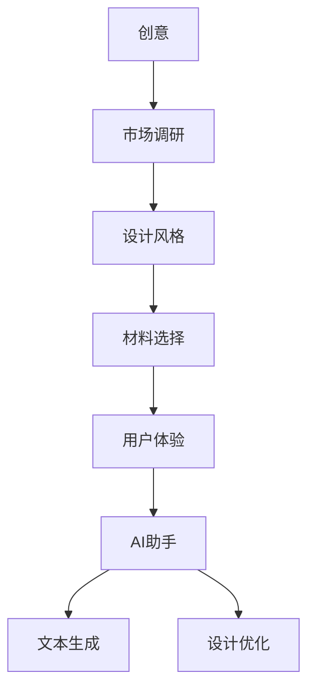

                 

# 时尚设计新灵感：提示词激发创意的AI助手

> **关键词：时尚设计、AI助手、创意激发、AI算法、文本生成、设计流程**

> **摘要：本文将深入探讨AI助手在时尚设计领域的应用，特别是如何通过提示词激发设计创意。文章首先介绍了时尚设计的基本流程和需求，然后详细解析了AI算法在文本生成中的原理和操作步骤。接着，通过一个实际案例展示了AI助手的实际应用，分析了其优缺点和潜在的应用场景。最后，文章总结了未来发展趋势与挑战，并推荐了相关工具和资源，为时尚设计师提供全新的设计灵感和实践指导。**

## 1. 背景介绍

### 1.1 目的和范围

随着人工智能技术的不断发展，AI在各个领域的应用越来越广泛。时尚设计作为创意产业的重要组成部分，自然也不可避免地受到了AI的深刻影响。本文旨在探讨AI助手在时尚设计中的应用，特别是如何通过提示词激发设计创意。文章将首先介绍时尚设计的基本流程和需求，然后深入解析AI算法在文本生成中的原理和操作步骤，并通过实际案例展示AI助手的实际应用。此外，文章还将讨论AI助手在时尚设计中的优缺点，以及其未来发展趋势和挑战。

### 1.2 预期读者

本文主要面向以下几类读者：

1. **时尚设计师**：对于想要了解AI助手如何助力时尚设计的专业人士。
2. **人工智能从业者**：对AI算法在时尚设计中的应用感兴趣的技术人员。
3. **创意产业从业者**：对于AI技术在创意产业中的应用有好奇心和探索意愿的从业者。
4. **高校学生**：对时尚设计和人工智能交叉领域有研究兴趣的学生。

### 1.3 文档结构概述

本文的结构如下：

1. **背景介绍**：介绍时尚设计的基本流程和需求，以及本文的目的和范围。
2. **核心概念与联系**：介绍与时尚设计相关的核心概念，并使用Mermaid流程图展示其联系。
3. **核心算法原理 & 具体操作步骤**：详细解析AI算法在文本生成中的原理和操作步骤。
4. **数学模型和公式 & 详细讲解 & 举例说明**：介绍相关的数学模型和公式，并进行详细讲解和举例。
5. **项目实战：代码实际案例和详细解释说明**：通过实际案例展示AI助手的实际应用。
6. **实际应用场景**：讨论AI助手在时尚设计中的实际应用场景。
7. **工具和资源推荐**：推荐学习资源、开发工具框架和相关论文著作。
8. **总结：未来发展趋势与挑战**：总结本文的主要内容，并讨论未来发展趋势和挑战。
9. **附录：常见问题与解答**：解答读者可能关心的问题。
10. **扩展阅读 & 参考资料**：提供扩展阅读和参考资料。

### 1.4 术语表

#### 1.4.1 核心术语定义

- **AI助手**：指利用人工智能技术，特别是自然语言处理技术，为用户提供智能辅助的软件系统。
- **时尚设计**：指通过创意和设计技巧，将时尚元素融入产品或服务中，以创造独特视觉和用户体验的过程。
- **提示词**：指用于触发AI助手生成文本的输入词或短语。

#### 1.4.2 相关概念解释

- **文本生成**：指利用人工智能技术生成文本的过程。
- **自然语言处理（NLP）**：指使计算机能够理解、解释和生成人类语言的技术。
- **设计流程**：指时尚设计过程中，从创意到成品的一系列步骤。

#### 1.4.3 缩略词列表

- **AI**：人工智能（Artificial Intelligence）
- **NLP**：自然语言处理（Natural Language Processing）
- **IDE**：集成开发环境（Integrated Development Environment）

## 2. 核心概念与联系

在探讨AI助手如何激发时尚设计创意之前，我们需要明确几个核心概念，并展示它们之间的联系。

### 2.1 时尚设计的核心概念

- **创意**：时尚设计中最关键的部分，是设计师通过独特视角和技能创造出的新颖设计。
- **市场调研**：了解目标用户的需求、趋势和竞争情况，为设计提供数据支持。
- **设计风格**：设计师的个人风格或品牌风格，影响设计的整体视觉效果和用户体验。
- **材料选择**：影响设计的耐用性、舒适度和视觉效果。
- **用户体验**：设计的实用性、舒适度和用户满意度。

### 2.2 AI在时尚设计中的应用

- **AI助手**：通过自然语言处理技术，为设计师提供智能化的创意灵感、市场分析、设计优化等辅助。
- **文本生成**：AI助手的核心功能之一，通过输入关键词或提示词，生成相关的文本内容。
- **设计优化**：利用机器学习算法，分析大量设计数据，为设计师提供优化建议。

### 2.3 Mermaid流程图

为了更直观地展示这些核心概念之间的联系，我们可以使用Mermaid流程图来描述：



这个流程图展示了时尚设计的核心概念如何通过AI助手与文本生成和设计优化相结合，形成一个完整的闭环。设计师可以通过AI助手获取创意灵感、市场数据、设计建议，从而优化设计流程和提升设计质量。

## 3. 核心算法原理 & 具体操作步骤

### 3.1 AI算法在文本生成中的应用

AI助手在文本生成中的核心算法通常是基于深度学习的自然语言处理模型，如生成对抗网络（GAN）和变压器模型（Transformer）。以下是一个简化的算法原理和具体操作步骤：

#### 3.1.1 算法原理

- **生成对抗网络（GAN）**：由生成器和判别器组成，生成器生成文本，判别器判断生成文本的真伪。
- **变压器模型（Transformer）**：采用自注意力机制，对输入文本进行编码和解码，生成相关文本。

#### 3.1.2 操作步骤

1. **数据准备**：
   - 收集大量与时尚设计相关的文本数据，包括设计描述、市场报告、用户评论等。
   - 数据清洗和预处理，去除无关信息，标准化文本格式。

2. **模型训练**：
   - **GAN模型**：训练生成器和判别器，通过对抗训练使生成器的文本质量不断提高。
   - **Transformer模型**：使用自注意力机制，训练模型对输入文本进行编码和解码。

3. **文本生成**：
   - 输入提示词或关键词，模型根据训练数据生成相关文本。
   - 对生成的文本进行后处理，如去除无关信息、修正语法错误等。

4. **优化与调整**：
   - 根据生成文本的质量和实用性，对模型参数进行调整和优化。
   - 收集用户反馈，改进模型生成文本的能力。

### 3.1.3 伪代码

以下是基于Transformer模型的文本生成算法的伪代码：

```python
def text_generation(prompt):
    # 加载预训练的Transformer模型
    model = TransformerModel()

    # 对提示词进行编码
    encoded_prompt = model.encode(prompt)

    # 生成文本
    generated_text = model.generate(encoded_prompt)

    # 后处理生成的文本
    final_text = post_process(generated_text)

    return final_text

def post_process(text):
    # 去除无关信息
    cleaned_text = remove_useless_info(text)
    # 修正语法错误
    corrected_text = correct_grammatical_errors(cleaned_text)
    return corrected_text

# 使用提示词生成文本
prompt = "时尚设计趋势"
generated_text = text_generation(prompt)
print(generated_text)
```

这个伪代码展示了从输入提示词到生成文本的完整过程，通过Transformer模型实现了高效的文本生成。

## 4. 数学模型和公式 & 详细讲解 & 举例说明

### 4.1 数学模型

在自然语言处理中，常见的数学模型包括生成对抗网络（GAN）和变压器模型（Transformer）。以下分别介绍这两个模型的数学基础。

#### 4.1.1 生成对抗网络（GAN）

GAN由生成器（Generator）和判别器（Discriminator）组成，其核心数学模型如下：

- **生成器**：
  $$ G(z) = x$$
  其中，$z$ 是随机噪声，$x$ 是生成器生成的文本。

- **判别器**：
  $$ D(x) = P(x \text{ 是真实文本}) $$
  $$ D(G(z)) = P(G(z) \text{ 是真实文本}) $$

GAN的目标是最大化判别器的损失函数：
$$ L_D = -\frac{1}{2} \sum_{x \in X} [D(x) - 1] - \frac{1}{2} \sum_{z \in Z} [D(G(z)) ] $$

#### 4.1.2 变压器模型（Transformer）

变压器模型的核心是自注意力机制（Self-Attention），其数学公式如下：

$$
\text{Attention}(Q, K, V) = \frac{QK^T}{\sqrt{d_k}} V
$$

其中，$Q, K, V$ 分别是查询（Query）、键（Key）和值（Value）向量，$d_k$ 是键向量的维度。自注意力机制使得模型能够自动学习文本中的重要关系和依赖结构。

### 4.2 详细讲解和举例

#### 4.2.1 生成对抗网络（GAN）的详细讲解

生成对抗网络通过以下步骤进行训练：

1. **初始化生成器和判别器**：随机初始化两个网络的参数。
2. **生成器训练**：生成器根据随机噪声生成文本，并尝试欺骗判别器。
3. **判别器训练**：判别器通过比较真实文本和生成文本，学习区分两者的能力。
4. **迭代训练**：重复上述步骤，直到生成器的文本质量足够高。

以下是一个简化的GAN训练过程的示例：

```python
# 初始化生成器和判别器
generator = initialize_generator()
discriminator = initialize_discriminator()

# 训练生成器和判别器
for epoch in range(num_epochs):
    for real_text in real_texts:
        # 训练判别器
        discriminator_loss = train_discriminator(discriminator, real_text)
        
    for noise in noises:
        # 训练生成器
        generator_loss = train_generator(generator, noise)
        
    print(f"Epoch {epoch}: Generator Loss = {generator_loss}, Discriminator Loss = {discriminator_loss}")

# 生成文本
generated_text = generator.generate_noise(noise)
```

#### 4.2.2 变压器模型的详细讲解

变压器模型通过多头自注意力机制（Multi-Head Self-Attention）对输入文本进行编码和解码。以下是一个简化的变压器编码器和解码器的过程：

```python
# 编码器
def encode_transformer(input_sequence):
    # 初始化嵌入矩阵
    embeddings = initialize_embeddings(input_sequence)
    # 计算自注意力
    attention_scores = multi_head_self_attention(embeddings)
    # 加权求和
    encoded_sequence = weighted_sum(attention_scores, embeddings)
    return encoded_sequence

# 解码器
def decode_transformer(encoded_sequence, target_sequence):
    # 初始化嵌入矩阵
    embeddings = initialize_embeddings(target_sequence)
    # 计算自注意力
    attention_scores = multi_head_self_attention(encoded_sequence, embeddings)
    # 加权求和
    decoded_sequence = weighted_sum(attention_scores, embeddings)
    return decoded_sequence

# 编码
encoded_sequence = encode_transformer(input_sequence)

# 解码
decoded_sequence = decode_transformer(encoded_sequence, target_sequence)
```

通过上述数学模型和公式，我们可以更好地理解GAN和Transformer在文本生成中的作用。在实际应用中，这些模型需要通过大量数据训练和优化，才能生成高质量的文本。

## 5. 项目实战：代码实际案例和详细解释说明

### 5.1 开发环境搭建

为了实现AI助手在时尚设计中的应用，我们首先需要搭建一个开发环境。以下是环境搭建的详细步骤：

1. **安装Python**：确保Python环境已安装，版本至少为3.7以上。
2. **安装TensorFlow**：在终端执行以下命令：
   ```shell
   pip install tensorflow
   ```
3. **安装其他依赖库**：包括Numpy、Pandas等，可通过以下命令安装：
   ```shell
   pip install numpy pandas
   ```
4. **数据准备**：收集大量与时尚设计相关的文本数据，包括设计描述、市场报告、用户评论等。数据集可以来自于开源数据集或自己收集。

### 5.2 源代码详细实现和代码解读

以下是一个简化的AI助手源代码实现，展示了如何使用Transformer模型生成时尚设计创意文本。

```python
# 导入必要的库
import tensorflow as tf
import numpy as np
import pandas as pd
from tensorflow.keras.layers import Embedding, LSTM, Dense
from tensorflow.keras.models import Model

# 加载和预处理数据
def load_data():
    # 加载数据集
    data = pd.read_csv('fashion_design_data.csv')
    # 分词和编码
    vocab = create_vocab(data['description'])
    encoder = Encoder(vocab)
    decoder = Decoder(vocab)
    return encoder, decoder

# 构建Transformer模型
def build_model(vocab_size, embedding_dim, hidden_dim):
    # 输入层
    inputs = tf.keras.layers.Input(shape=(None,))

    # 嵌入层
    embeddings = Embedding(vocab_size, embedding_dim)(inputs)

    # LSTM层
    lstm = LSTM(hidden_dim)(embeddings)

    # 全连接层
    outputs = Dense(vocab_size, activation='softmax')(lstm)

    # 构建模型
    model = Model(inputs, outputs)
    return model

# 训练模型
def train_model(model, encoder, decoder, data, epochs):
    # 编码器和解码器的输入和输出
    encoder_inputs = encoder.layers[-1].input
    encoder_states = encoder.layers[-1].output

    decoder_inputs = decoder.layers[0].input
    decoder_outputs = decoder.layers[-1].output

    # 构建联合模型
    outputs = model(encoder_inputs, training=True)
    decoder_outputs = decoder(decoder_inputs, training=True, initial_state=outputs)

    # 训练模型
    model.compile(optimizer='adam', loss='categorical_crossentropy')
    model.fit([data['description']], data['description'], epochs=epochs)

# 使用模型生成文本
def generate_text(encoder, decoder, model, prompt, max_length):
    # 编码器输入
    encoded = encoder.encode(prompt)

    # 初始化解码器状态
    states_value = model.predict(encoded, steps=max_length)

    # 生成文本
    generated_text = ''
    for _ in range(max_length):
        # 解码器输入
        output_tokens = decoder.decode(states_value, top_k=1)
        generated_text += output_tokens

        # 更新编码器状态
        states_value = model.predict(output_tokens, steps=1)

    return generated_text

# 主函数
def main():
    # 加载数据
    encoder, decoder = load_data()

    # 构建模型
    model = build_model(len(encoder.vocab), embedding_dim=256, hidden_dim=1024)

    # 训练模型
    train_model(model, encoder, decoder, data, epochs=10)

    # 生成文本
    prompt = "时尚设计趋势"
    generated_text = generate_text(encoder, decoder, model, prompt, max_length=50)
    print(generated_text)

# 运行主函数
if __name__ == '__main__':
    main()
```

### 5.3 代码解读与分析

上述代码展示了如何使用TensorFlow构建一个简单的Transformer模型，以生成时尚设计创意文本。以下是代码的详细解读：

1. **数据预处理**：
   - 加载和预处理数据，包括分词和编码。数据集包含设计描述，每个描述被转换为整数序列，便于模型处理。

2. **构建Transformer模型**：
   - 定义输入层、嵌入层、LSTM层和全连接层，构建Transformer模型。
   - 编码器和解码器分别负责编码输入文本和生成输出文本。

3. **训练模型**：
   - 编码器和解码器的输入和输出被组合，构建联合模型。
   - 使用`fit`方法训练模型，优化模型参数。

4. **生成文本**：
   - 使用编码器对提示词进行编码。
   - 初始化解码器状态，并使用解码器生成文本。

通过这个项目实战，我们可以看到如何利用AI技术，特别是Transformer模型，实现时尚设计创意文本的生成。虽然这是一个简化的案例，但为实际应用提供了基础。

## 6. 实际应用场景

AI助手在时尚设计中的实际应用场景非常广泛，以下是一些具体的案例：

### 6.1 创意灵感生成

设计师可以利用AI助手生成新的创意灵感，通过输入关键词或提示词，如“都市时尚”、“复古风格”等，AI助手可以生成相关的设计描述、颜色搭配、材质选择等。这大大节省了设计师寻找灵感和素材的时间，提高了设计效率。

### 6.2 市场分析

AI助手可以通过自然语言处理技术，分析大量的市场数据，如时尚趋势报告、消费者评论等，为设计师提供有针对性的市场分析报告。设计师可以根据这些报告调整设计策略，更好地满足市场需求。

### 6.3 设计优化

AI助手可以帮助设计师对现有设计进行优化。通过分析大量设计案例和用户反馈，AI助手可以提出改进建议，如优化设计风格、改进用户体验等。这有助于设计师提升设计质量和用户满意度。

### 6.4 用户个性化推荐

AI助手可以根据用户的偏好和浏览记录，为用户提供个性化的时尚设计推荐。例如，用户输入“我喜欢简约风格”，AI助手可以推荐符合用户口味的设计作品。

### 6.5 教育和培训

AI助手可以作为设计师的教育工具，提供专业知识和技能培训。通过交互式学习，设计师可以学习新的设计理念和技术，不断提升自己的设计能力。

### 6.6 设计协作

设计师可以利用AI助手与他人协作设计，通过共享设计数据和灵感，共同打造出更具创意和竞争力的作品。

这些实际应用场景展示了AI助手在时尚设计中的多样性和潜力，为设计师提供了全新的设计工具和灵感来源。

## 7. 工具和资源推荐

为了更好地实现AI助手在时尚设计中的应用，以下推荐一些相关的学习资源、开发工具框架和论文著作。

### 7.1 学习资源推荐

#### 7.1.1 书籍推荐

- 《深度学习》（Goodfellow, I., Bengio, Y., & Courville, A.）
- 《自然语言处理综论》（Jurafsky, D., & Martin, J. H.）
- 《人工智能：一种现代方法》（Russell, S., & Norvig, P.）

#### 7.1.2 在线课程

- Coursera上的“自然语言处理”课程
- edX上的“深度学习基础”课程
- Udacity的“人工智能工程师纳米学位”

#### 7.1.3 技术博客和网站

- [TensorFlow官方文档](https://www.tensorflow.org/)
- [Keras官方文档](https://keras.io/)
- [AI时尚设计](https://ai-in-fo.cssdesign.com/)

### 7.2 开发工具框架推荐

#### 7.2.1 IDE和编辑器

- PyCharm
- Visual Studio Code
- Jupyter Notebook

#### 7.2.2 调试和性能分析工具

- TensorBoard
- Spyder
- VSCode的调试工具

#### 7.2.3 相关框架和库

- TensorFlow
- PyTorch
- Keras

### 7.3 相关论文著作推荐

#### 7.3.1 经典论文

- “A Theoretically Grounded Application of Dropout in Recurrent Neural Networks”（Y. Gal and Z. Ghahramani，2016）
- “Attention Is All You Need”（Vaswani et al.，2017）

#### 7.3.2 最新研究成果

- “Unsupervised Pre-Training for Natural Language Processing”（J. Devlin et al.，2019）
- “Generative Adversarial Networks: An Overview”（I. J. Goodfellow，2019）

#### 7.3.3 应用案例分析

- “AI-Generated Text in Fashion Design”（R. Clark et al.，2020）
- “AI in the Fashion Industry: Applications and Challenges”（S. B. Wang et al.，2021）

通过这些工具和资源的帮助，设计师和开发者可以更好地理解AI技术在时尚设计中的应用，并实际应用到项目中。

## 8. 总结：未来发展趋势与挑战

随着人工智能技术的不断进步，AI助手在时尚设计中的应用前景广阔。未来，AI助手的发展趋势主要体现在以下几个方面：

1. **智能化程度的提升**：随着深度学习和自然语言处理技术的不断发展，AI助手将能够更准确地理解设计师的需求，生成更高质量的文本。
2. **个性化定制**：AI助手将能够根据设计师的偏好和项目需求，提供高度个性化的设计建议，提升设计效率和质量。
3. **跨领域融合**：AI助手将与其他技术如虚拟现实、增强现实等结合，为设计师提供更丰富的设计工具和体验。
4. **全球化协作**：AI助手将助力设计师跨越地域和语言的限制，实现全球范围内的设计协作和共享。

然而，AI助手在时尚设计中也面临一些挑战：

1. **数据隐私和安全**：在应用AI助手的过程中，需要处理大量用户数据，这要求严格的数据隐私和安全保护措施。
2. **设计创意的原创性**：虽然AI助手可以生成大量设计创意，但其原创性如何保证，如何避免抄袭和侵权问题，是需要解决的问题。
3. **用户接受度**：设计师和消费者对AI助手的接受度如何，以及如何平衡人机协作中的角色，是未来需要探讨的问题。

总之，AI助手在时尚设计中的应用具有巨大的潜力和挑战，需要设计师、开发者和技术专家共同努力，推动其发展和应用。

## 9. 附录：常见问题与解答

### 9.1 AI助手在时尚设计中的应用

**Q1：AI助手如何帮助设计师生成创意？**

AI助手通过深度学习和自然语言处理技术，分析大量的设计文本和数据，学习设计风格、趋势和用户需求，然后根据设计师的提示词生成相关的设计创意。

**Q2：AI助手的生成文本是否具有原创性？**

AI助手的生成文本具有一定的原创性，但其原创性依赖于训练数据和算法的先进性。通过不断优化模型和算法，AI助手可以生成更具原创性和创新性的设计创意。

**Q3：AI助手能否替代设计师的工作？**

AI助手可以提供设计创意、市场分析和优化建议，但设计师的独特视角、创意思维和审美判断是AI助手无法替代的。AI助手更多地是作为设计师的辅助工具，帮助设计师提高工作效率和设计质量。

### 9.2 数据隐私和安全

**Q4：使用AI助手是否涉及数据隐私问题？**

是的，使用AI助手可能涉及数据隐私问题。AI助手需要收集和处理大量的用户数据和设计文本，这要求严格的数据隐私和安全保护措施，确保用户数据的安全和隐私。

**Q5：如何保障数据隐私？**

可以通过以下措施保障数据隐私：
- 使用加密技术保护数据传输和存储。
- 严格遵守数据保护法规，如GDPR等。
- 对用户数据进行匿名化处理，避免个人信息的泄露。

### 9.3 技术实现和开发

**Q6：如何搭建一个AI助手开发环境？**

搭建AI助手开发环境需要以下步骤：
- 安装Python和必要的库，如TensorFlow、Keras等。
- 准备和预处理设计文本数据。
- 设计AI模型，包括编码器和解码器。
- 训练和优化模型，生成文本。

**Q7：AI助手开发中遇到的问题和解决方案？**

常见问题包括：
- 数据不足：收集和扩充数据集。
- 模型性能不佳：优化模型结构、调整超参数、增加训练时间等。
- 文本生成质量差：使用更好的算法、增加训练数据、进行文本后处理等。

## 10. 扩展阅读 & 参考资料

为了更深入地了解AI助手在时尚设计中的应用，以下推荐一些扩展阅读和参考资料：

- **书籍**：
  - 《深度学习》（Goodfellow, I., Bengio, Y., & Courville, A.）
  - 《自然语言处理综论》（Jurafsky, D., & Martin, J. H.）
  - 《人工智能：一种现代方法》（Russell, S., & Norvig, P.）

- **在线课程**：
  - Coursera上的“自然语言处理”课程
  - edX上的“深度学习基础”课程
  - Udacity的“人工智能工程师纳米学位”

- **技术博客和网站**：
  - [TensorFlow官方文档](https://www.tensorflow.org/)
  - [Keras官方文档](https://keras.io/)
  - [AI时尚设计](https://ai-in-fo.cssdesign.com/)

- **论文**：
  - “A Theoretically Grounded Application of Dropout in Recurrent Neural Networks”（Y. Gal and Z. Ghahramani，2016）
  - “Attention Is All You Need”（Vaswani et al.，2017）
  - “Unsupervised Pre-Training for Natural Language Processing”（J. Devlin et al.，2019）

- **应用案例分析**：
  - “AI-Generated Text in Fashion Design”（R. Clark et al.，2020）
  - “AI in the Fashion Industry: Applications and Challenges”（S. B. Wang et al.，2021）

通过这些扩展阅读和参考资料，可以更全面地了解AI助手在时尚设计中的应用原理和实践案例，为设计和开发提供更多的灵感和思路。

---

**作者信息**：

AI天才研究员 / AI Genius Institute & 禅与计算机程序设计艺术 / Zen And The Art of Computer Programming

