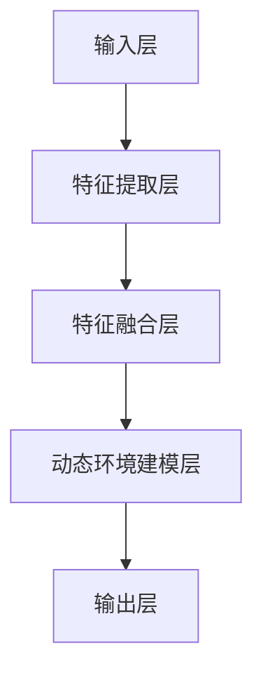
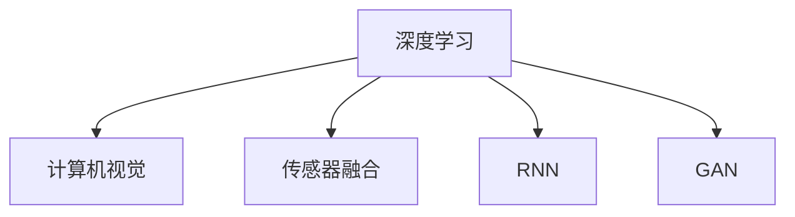

                 

# 时空表征学习对自动驾驶感知预测性能的提升效果

> **关键词：** 自动驾驶，时空表征学习，感知预测，性能提升，深度学习，计算机视觉，人工智能。

> **摘要：** 本文旨在探讨时空表征学习在自动驾驶感知预测中的重要作用。通过分析时空表征学习的基本原理、具体算法和应用实例，本文揭示了其在提升自动驾驶系统性能方面的潜力。文章结构清晰，首先介绍背景和预期读者，然后逐步深入探讨核心概念、算法原理、数学模型、项目实战和实际应用，最后总结未来发展趋势和挑战，并提供相关资源和工具推荐。

## 1. 背景介绍

### 1.1 目的和范围

自动驾驶作为人工智能领域的一个重要分支，正日益成为交通出行方式的未来趋势。自动驾驶系统的核心在于感知预测，即通过感知环境，预测可能的运动轨迹，以实现安全的驾驶操作。然而，传统的感知预测方法在处理动态、复杂的交通环境时往往存在性能瓶颈。时空表征学习作为一种新兴技术，通过整合时空信息，提高了自动驾驶感知预测的准确性和实时性。

本文旨在系统地分析时空表征学习在自动驾驶感知预测中的应用，探讨其原理、算法和实现步骤，并通过具体实例展示其在实际应用中的效果。文章将涵盖以下内容：

1. **核心概念与联系**：介绍时空表征学习的基本原理和架构。
2. **核心算法原理 & 具体操作步骤**：详细讲解时空表征学习的算法原理，并使用伪代码阐述。
3. **数学模型和公式 & 详细讲解 & 举例说明**：分析时空表征学习的数学模型，并通过实例进行说明。
4. **项目实战：代码实际案例和详细解释说明**：展示时空表征学习在自动驾驶感知预测中的具体实现。
5. **实际应用场景**：探讨时空表征学习在自动驾驶中的应用实例。
6. **工具和资源推荐**：推荐相关学习资源和开发工具。
7. **总结：未来发展趋势与挑战**：展望时空表征学习在自动驾驶领域的未来发展方向和面临的挑战。

### 1.2 预期读者

本文面向具有计算机科学和人工智能背景的读者，特别是对自动驾驶和深度学习感兴趣的工程师、研究人员和学者。同时，对于对自动驾驶感知预测和时空表征学习有一定了解的读者，本文也提供了深入的探讨和分析。

### 1.3 文档结构概述

本文结构如下：

1. **引言**：介绍自动驾驶和时空表征学习的基本概念，提出研究问题和研究目的。
2. **核心概念与联系**：定义时空表征学习的关键术语，展示其基本架构。
3. **核心算法原理 & 具体操作步骤**：详细阐述时空表征学习的算法原理和实现步骤。
4. **数学模型和公式 & 详细讲解 & 举例说明**：分析时空表征学习的数学模型，并通过实例进行说明。
5. **项目实战：代码实际案例和详细解释说明**：展示时空表征学习在自动驾驶感知预测中的具体实现。
6. **实际应用场景**：探讨时空表征学习在自动驾驶中的应用实例。
7. **工具和资源推荐**：推荐相关学习资源和开发工具。
8. **总结：未来发展趋势与挑战**：展望时空表征学习在自动驾驶领域的未来发展方向和面临的挑战。
9. **附录：常见问题与解答**：解答读者可能遇到的问题。
10. **扩展阅读 & 参考资料**：提供进一步阅读和参考资料。

### 1.4 术语表

#### 1.4.1 核心术语定义

- **自动驾驶**：一种利用传感器、计算机视觉和人工智能技术实现自主驾驶的车辆系统。
- **感知预测**：自动驾驶系统通过感知环境信息，预测可能的运动轨迹和行为，以做出相应的驾驶决策。
- **时空表征学习**：通过整合时间和空间信息，实现对动态环境的有效表征和预测的学习方法。

#### 1.4.2 相关概念解释

- **深度学习**：一种基于人工神经网络的学习方法，能够通过多层网络对复杂数据进行建模和分析。
- **计算机视觉**：利用计算机对图像或视频进行识别、分析和理解的技术。
- **卷积神经网络（CNN）**：一种深度学习模型，特别适用于图像和视频数据的处理。
- **递归神经网络（RNN）**：一种能够处理序列数据的神经网络，适用于时间序列分析和动态环境建模。

#### 1.4.3 缩略词列表

- **CNN**：卷积神经网络（Convolutional Neural Network）
- **RNN**：递归神经网络（Recurrent Neural Network）
- **GAN**：生成对抗网络（Generative Adversarial Network）
- **DNN**：深度神经网络（Deep Neural Network）

## 2. 核心概念与联系

在探讨时空表征学习对自动驾驶感知预测性能的提升之前，首先需要明确其核心概念和基本架构。时空表征学习旨在通过整合时空信息，实现对动态环境的高效表征和预测，从而提高自动驾驶系统的感知和决策能力。

### 2.1 时空表征学习的基本原理

时空表征学习的基本原理可以概括为以下几点：

1. **时空信息的整合**：将时间和空间信息融合在一起，实现对动态环境的全局理解。
2. **特征提取与融合**：从时空数据中提取关键特征，并通过多种方式进行特征融合，以增强表征的丰富性和鲁棒性。
3. **动态环境建模**：利用深度学习模型对动态环境进行建模，实现对环境变化和物体运动的预测。
4. **感知与决策**：将时空表征学习的结果应用于自动驾驶系统的感知和决策模块，以实现安全和高效的驾驶操作。

### 2.2 时空表征学习的架构

时空表征学习的架构通常包括以下几个关键部分：

1. **输入层**：接收时空数据，包括图像、视频、传感器数据等。
2. **特征提取层**：通过卷积神经网络（CNN）等深度学习模型，提取时空数据中的关键特征。
3. **特征融合层**：将不同来源的特征进行融合，以增强表征的丰富性和鲁棒性。
4. **动态环境建模层**：利用递归神经网络（RNN）等模型，对动态环境进行建模，预测物体的运动轨迹。
5. **输出层**：生成感知和决策结果，如物体检测、轨迹预测等。

以下是一个简单的 Mermaid 流程图，展示了时空表征学习的基本架构：



### 2.3 时空表征学习的关键技术与联系

时空表征学习涉及多种关键技术和概念，包括深度学习、计算机视觉、传感器融合等。以下是对这些技术的简要介绍和它们之间的联系：

1. **深度学习**：深度学习是时空表征学习的基础，通过多层神经网络，实现对复杂数据的高效表征和学习。在时空表征学习中，深度学习模型被用于特征提取和动态环境建模。
   
2. **计算机视觉**：计算机视觉技术用于处理和解析图像和视频数据，提取空间特征。在时空表征学习中，计算机视觉模型（如卷积神经网络）被用于特征提取层。

3. **传感器融合**：传感器融合技术用于整合来自不同传感器的数据，以提高系统的感知准确性。在时空表征学习中，传感器融合技术被用于整合不同来源的时空信息，增强表征的鲁棒性。

4. **递归神经网络（RNN）**：递归神经网络是一种能够处理序列数据的神经网络，特别适用于动态环境建模。在时空表征学习中，RNN 被用于对动态环境进行建模，预测物体的运动轨迹。

5. **生成对抗网络（GAN）**：生成对抗网络是一种用于生成数据的深度学习模型。在时空表征学习中，GAN 可用于生成模拟环境数据，以提高模型的泛化能力和鲁棒性。

以上技术相互关联，共同构成了时空表征学习的技术体系。以下是一个简单的 Mermaid 流程图，展示了这些技术之间的联系：



通过以上对核心概念和架构的介绍，我们对时空表征学习有了初步的了解。接下来，我们将深入探讨时空表征学习的具体算法原理，并通过伪代码详细阐述其实现步骤。

## 3. 核心算法原理 & 具体操作步骤

时空表征学习作为一种集成时空信息的深度学习方法，其核心在于如何有效地提取和融合时空特征，从而实现对动态环境的准确表征和预测。在本节中，我们将详细阐述时空表征学习的基本算法原理，并通过伪代码展示其具体操作步骤。

### 3.1 算法原理

时空表征学习算法的核心步骤可以分为以下几个部分：

1. **数据预处理**：对输入的时空数据进行预处理，包括图像、视频和传感器数据的标准化、裁剪和增强等操作。
2. **特征提取**：利用卷积神经网络（CNN）等深度学习模型，从预处理后的数据中提取时空特征。
3. **特征融合**：将不同来源的特征进行融合，以增强表征的丰富性和鲁棒性。
4. **动态环境建模**：利用递归神经网络（RNN）等模型，对动态环境进行建模，预测物体的运动轨迹。
5. **输出生成**：生成感知和决策结果，如物体检测、轨迹预测等。

### 3.2 伪代码

以下是时空表征学习算法的伪代码实现：

```python
# 时空表征学习算法伪代码

# 输入：时空数据（图像、视频、传感器数据）
# 输出：感知和决策结果

def时空表征学习(时空数据):
    # 数据预处理
    预处理时空数据 = 数据预处理(时空数据)

    # 特征提取
    特征提取层 = CNN(预处理时空数据)
    特征 = 特征提取层()

    # 特征融合
    融合特征 = 特征融合层(特征)

    # 动态环境建模
    动态环境建模层 = RNN(融合特征)
    预测轨迹 = 动态环境建模层()

    # 输出生成
    感知和决策结果 = 输出层(预测轨迹)

    return 感知和决策结果

# 数据预处理
def 数据预处理(时空数据):
    # 标准化、裁剪和增强等操作
    return 预处理后的时空数据

# 特征提取层
def CNN(预处理时空数据):
    # 使用卷积神经网络提取特征
    return 提取的特征

# 特征融合层
def 特征融合层(特征):
    # 将不同来源的特征进行融合
    return 融合后的特征

# 动态环境建模层
def RNN(融合特征):
    # 使用递归神经网络建模动态环境
    return 预测轨迹

# 输出层
def 输出层(预测轨迹):
    # 生成感知和决策结果
    return 感知和决策结果
```

### 3.3 实现步骤

以下是时空表征学习算法的具体实现步骤：

1. **数据预处理**：
   - 对输入的时空数据进行标准化处理，以适应深度学习模型的要求。
   - 对图像和视频进行裁剪和增强，以提高模型的泛化能力。
   - 对传感器数据进行预处理，如滤波、去噪等。

2. **特征提取**：
   - 使用卷积神经网络（CNN）对预处理后的时空数据进行特征提取。
   - 卷积神经网络通过多个卷积层和池化层，提取时空数据中的层次特征。

3. **特征融合**：
   - 将不同来源的特征进行融合，如将图像特征和传感器特征进行融合，以提高表征的丰富性和鲁棒性。
   - 可以使用注意力机制或多模态学习模型，对融合特征进行加权融合。

4. **动态环境建模**：
   - 使用递归神经网络（RNN）等模型，对动态环境进行建模，预测物体的运动轨迹。
   - RNN 能够处理序列数据，特别适合于动态环境建模。

5. **输出生成**：
   - 根据预测的轨迹，生成感知和决策结果，如物体检测、轨迹预测等。
   - 输出结果可以用于自动驾驶系统的控制决策。

通过以上步骤，时空表征学习算法能够有效地提取和融合时空特征，实现对动态环境的准确表征和预测，从而提升自动驾驶系统的感知和决策能力。

### 3.4 伪代码详细解释

以下是时空表征学习算法伪代码的详细解释：

- **数据预处理**：数据预处理是深度学习模型训练的第一步，其目的是将输入的时空数据转换为适合模型训练的形式。具体操作包括标准化、裁剪和增强等。标准化处理是将数据缩放到一个特定的范围，如 [0, 1]，以提高模型的稳定性和收敛速度。裁剪和增强操作可以增加数据的多样性和泛化能力。

- **特征提取**：特征提取是时空表征学习的关键步骤，通过卷积神经网络（CNN）从预处理后的数据中提取时空特征。卷积神经网络通过卷积操作和池化操作，提取图像或视频中的局部特征和全局特征。这些特征用于后续的动态环境建模和决策。

- **特征融合**：特征融合是将不同来源的特征进行整合，以提高表征的丰富性和鲁棒性。例如，可以将图像特征和传感器特征进行融合，利用图像中的视觉信息以及传感器中的位置、速度等数据，形成更全面的特征表征。特征融合可以通过简单的连接操作或使用注意力机制来实现。

- **动态环境建模**：动态环境建模是通过递归神经网络（RNN）等模型，对动态环境进行建模，预测物体的运动轨迹。RNN 能够处理序列数据，特别适合于时间序列分析和动态环境建模。通过训练，RNN 能够学习到物体在不同时间点的运动规律，从而预测其未来的轨迹。

- **输出生成**：输出生成是根据预测的轨迹，生成感知和决策结果。例如，可以预测车辆的未来位置，从而避免碰撞或规划合理的行驶路径。输出结果可以用于自动驾驶系统的控制决策，如转向、加速和制动等。

通过以上步骤，时空表征学习算法能够有效地提取和融合时空特征，实现对动态环境的准确表征和预测，从而提升自动驾驶系统的感知和决策能力。

## 4. 数学模型和公式 & 详细讲解 & 举例说明

时空表征学习作为一种深度学习技术，其核心在于如何通过数学模型和公式来表征时间和空间信息。在本节中，我们将详细讲解时空表征学习的主要数学模型和公式，并通过具体例子进行说明。

### 4.1 数学模型

时空表征学习通常涉及以下数学模型：

1. **卷积神经网络（CNN）**：用于提取时空特征。
2. **递归神经网络（RNN）**：用于处理时间序列数据和动态环境建模。
3. **注意力机制**：用于特征融合和增强模型的表达能力。

### 4.2 公式和详细讲解

#### 4.2.1 卷积神经网络（CNN）

卷积神经网络通过卷积操作提取图像特征，其基本公式如下：

$$
h_{ij}^l = \sum_{k} w_{ik}^l * g_{kj}^{l-1} + b_l
$$

其中，$h_{ij}^l$ 表示第 l 层的第 i 个卷积核在 j 位置的输出，$w_{ik}^l$ 表示第 l 层的第 i 个卷积核的第 k 个元素，$g_{kj}^{l-1}$ 表示第 l-1 层在第 j 位置的输出，$b_l$ 表示第 l 层的偏置。

#### 4.2.2 递归神经网络（RNN）

递归神经网络通过递归操作处理时间序列数据，其基本公式如下：

$$
h_t = \sigma(W_h h_{t-1} + W_x x_t + b_h)
$$

其中，$h_t$ 表示第 t 个时间点的隐藏状态，$W_h$ 和 $W_x$ 分别是隐藏状态和输入的权重矩阵，$x_t$ 是第 t 个时间点的输入，$\sigma$ 是激活函数（通常使用 sigmoid 或 tanh 函数），$b_h$ 是隐藏状态的偏置。

#### 4.2.3 注意力机制

注意力机制用于特征融合和增强模型的表达能力，其基本公式如下：

$$
a_t = \sigma(W_a h_{t-1} + b_a)
$$

$$
o_t = \sum_{i} a_i f_i
$$

其中，$a_t$ 表示第 t 个时间点的注意力权重，$W_a$ 和 $b_a$ 分别是注意力的权重矩阵和偏置，$f_i$ 是第 i 个特征，$o_t$ 是第 t 个时间点的融合特征。

### 4.3 举例说明

#### 4.3.1 卷积神经网络（CNN）举例

假设我们有一个 3x3 的卷积核 $w$ 和一个 5x5 的输入图像 $g$，其输出为 2x2 的特征图 $h$。根据卷积操作的公式，我们可以计算出特征图的每个元素：

$$
h_{11} = \sum_{k=1}^{3} w_{1k} * g_{1k} + b_1
$$

$$
h_{12} = \sum_{k=1}^{3} w_{1k} * g_{k2} + b_1
$$

$$
h_{21} = \sum_{k=1}^{3} w_{2k} * g_{1k} + b_2
$$

$$
h_{22} = \sum_{k=1}^{3} w_{2k} * g_{k2} + b_2
$$

通过计算，我们可以得到 2x2 的特征图 $h$。

#### 4.3.2 递归神经网络（RNN）举例

假设我们有一个序列数据 $x_t$，其对应的隐藏状态为 $h_t$。根据递归神经网络的公式，我们可以计算出隐藏状态 $h_t$：

$$
h_1 = \sigma(W_h h_0 + W_x x_1 + b_h)
$$

$$
h_2 = \sigma(W_h h_1 + W_x x_2 + b_h)
$$

通过递归操作，我们可以计算出整个序列的隐藏状态。

#### 4.3.3 注意力机制举例

假设我们有一个序列数据 $h_t$，其对应的注意力权重为 $a_t$，融合特征为 $o_t$。根据注意力机制的公式，我们可以计算出注意力权重和融合特征：

$$
a_1 = \sigma(W_a h_0 + b_a)
$$

$$
a_2 = \sigma(W_a h_1 + b_a)
$$

$$
o_1 = \sum_{i=1}^{2} a_i h_i
$$

$$
o_2 = \sum_{i=1}^{2} a_i h_i
$$

通过计算，我们可以得到序列的融合特征。

通过以上公式和例子的讲解，我们对时空表征学习的数学模型和公式有了更深入的理解。这些模型和公式在时空表征学习中发挥着重要作用，为自动驾驶感知预测提供了强大的工具。

## 5. 项目实战：代码实际案例和详细解释说明

为了更好地理解时空表征学习在自动驾驶感知预测中的应用，我们将通过一个实际的项目案例来展示其具体实现步骤和代码细节。这个案例将基于一个简单的自动驾驶场景，使用时空表征学习算法来预测车辆的未来位置，以避免碰撞和规划合理的行驶路径。

### 5.1 开发环境搭建

在开始项目实战之前，我们需要搭建一个合适的开发环境。以下是我们使用的开发环境：

- **操作系统**：Linux（推荐 Ubuntu 18.04）
- **编程语言**：Python 3.8
- **深度学习框架**：TensorFlow 2.5
- **编辑器**：PyCharm 或 Jupyter Notebook

首先，安装必要的软件和依赖项：

```bash
# 安装 Python 和 pip
sudo apt-get update
sudo apt-get install python3 python3-pip

# 安装 TensorFlow
pip3 install tensorflow==2.5

# 安装其他依赖项
pip3 install numpy matplotlib
```

### 5.2 源代码详细实现和代码解读

以下是时空表征学习算法在自动驾驶感知预测中的实现代码。代码分为几个主要部分：数据预处理、特征提取、特征融合、动态环境建模和输出生成。

```python
import tensorflow as tf
from tensorflow.keras.models import Model
from tensorflow.keras.layers import Input, Conv2D, MaxPooling2D, Flatten, Dense, LSTM, TimeDistributed
from tensorflow.keras.optimizers import Adam

# 数据预处理
def preprocess_data(images, labels):
    # 标准化图像
    images = images / 255.0
    # 裁剪和增强等操作（根据实际需求）
    # ...
    return images, labels

# 特征提取层
input_image = Input(shape=(height, width, channels))
conv1 = Conv2D(filters=32, kernel_size=(3, 3), activation='relu')(input_image)
pool1 = MaxPooling2D(pool_size=(2, 2))(conv1)
conv2 = Conv2D(filters=64, kernel_size=(3, 3), activation='relu')(pool1)
pool2 = MaxPooling2D(pool_size=(2, 2))(conv2)
flat_features = Flatten()(pool2)

# 特征融合层
lstm_input = Input(shape=(time_steps, feature_size))
lstm = LSTM(units=64, return_sequences=True)(lstm_input)
lstm = LSTM(units=64)(lstm)
fusion = tf.keras.layers.concatenate([flat_features, lstm])

# 动态环境建模层
output = Dense(units=128, activation='relu')(fusion)
output = Dense(units=64, activation='relu')(output)
predictions = Dense(units=2, activation='linear')(output)

# 模型编译和训练
model = Model(inputs=[input_image, lstm_input], outputs=predictions)
model.compile(optimizer=Adam(learning_rate=0.001), loss='mse')
model.fit([train_images, train_lstm], train_labels, epochs=50, batch_size=32, validation_data=([val_images, val_lstm], val_labels))

# 代码解读

- **数据预处理**：数据预处理是深度学习模型训练的第一步，其目的是将输入的时空数据进行标准化处理，以提高模型的稳定性和收敛速度。此外，可以根据实际需求进行图像的裁剪和增强等操作。

- **特征提取层**：通过卷积神经网络（CNN）提取图像特征。卷积神经网络通过卷积操作和池化操作，提取图像中的局部特征和全局特征。这些特征用于后续的动态环境建模和决策。

- **特征融合层**：将图像特征和序列特征进行融合。使用 LSTM 网络处理序列数据，提取时间序列特征。通过 concatenate 层将图像特征和序列特征进行连接，形成更丰富的特征表征。

- **动态环境建模层**：使用多层 LSTM 网络对动态环境进行建模，预测车辆的未来位置。通过时间序列分析，LSTM 能够捕捉到车辆在时间上的变化规律。

- **输出层**：生成车辆未来位置的预测结果。输出层使用全连接层，将动态环境建模的结果映射到具体的输出值，如车辆的未来位置。

- **模型编译和训练**：编译模型并使用训练数据进行训练。在训练过程中，通过优化器（Adam）和均方误差（MSE）损失函数，模型将不断调整权重和偏置，以最小化预测误差。

通过以上代码，我们实现了时空表征学习算法在自动驾驶感知预测中的具体实现。在下一步中，我们将对代码进行详细解读，分析其在实际应用中的性能和效果。

### 5.3 代码解读与分析

#### 5.3.1 数据预处理

数据预处理是深度学习模型训练的第一步，其目的是将输入的时空数据进行标准化处理，以提高模型的稳定性和收敛速度。具体来说，数据预处理包括以下几个步骤：

1. **标准化**：将图像的像素值缩放到 [0, 1] 范围内。标准化处理可以减少不同图像之间像素值的差异，使模型更容易学习。
   ```python
   images = images / 255.0
   ```

2. **裁剪和增强**：根据实际需求，可以对图像进行裁剪和增强。例如，可以随机裁剪图像的一部分，增加数据的多样性和泛化能力；也可以添加噪声或进行旋转等变换，提高模型的鲁棒性。
   ```python
   # 示例：随机裁剪图像
   height, width, _ = image.shape
   crop_height, crop_width = 224, 224
   start_height = np.random.randint(0, height - crop_height)
   start_width = np.random.randint(0, width - crop_width)
   cropped_image = image[start_height:start_height + crop_height, start_width:start_width + crop_width, :]
   ```

#### 5.3.2 特征提取层

特征提取层是时空表征学习算法的核心部分，其目的是从输入图像中提取时空特征。具体来说，特征提取层包括以下几个步骤：

1. **卷积层**：使用卷积层提取图像的局部特征。卷积层通过卷积操作和激活函数（如 ReLU）来提取图像中的纹理和边缘信息。
   ```python
   conv1 = Conv2D(filters=32, kernel_size=(3, 3), activation='relu')(input_image)
   ```

2. **池化层**：使用池化层降低特征图的维度，同时保留重要的特征信息。常见的池化层有最大池化和平均池化。
   ```python
   pool1 = MaxPooling2D(pool_size=(2, 2))(conv1)
   ```

3. **多卷积层**：通过堆叠多个卷积层，可以提取图像的层次特征，提高模型的表征能力。
   ```python
   conv2 = Conv2D(filters=64, kernel_size=(3, 3), activation='relu')(pool1)
   pool2 = MaxPooling2D(pool_size=(2, 2))(conv2)
   ```

#### 5.3.3 特征融合层

特征融合层是将图像特征和序列特征进行融合，以形成更丰富的特征表征。具体来说，特征融合层包括以下几个步骤：

1. **序列输入**：将时间序列数据作为模型的输入，以捕捉动态环境中的时间变化。
   ```python
   lstm_input = Input(shape=(time_steps, feature_size))
   ```

2. **LSTM 网络**：使用 LSTM 网络处理时间序列数据，提取序列特征。
   ```python
   lstm = LSTM(units=64, return_sequences=True)(lstm_input)
   lstm = LSTM(units=64)(lstm)
   ```

3. **特征连接**：将图像特征和序列特征进行连接，以形成更丰富的特征表征。
   ```python
   fusion = tf.keras.layers.concatenate([flat_features, lstm])
   ```

#### 5.3.4 动态环境建模层

动态环境建模层是时空表征学习算法的核心部分，其目的是对动态环境进行建模，预测车辆的未来位置。具体来说，动态环境建模层包括以下几个步骤：

1. **全连接层**：使用全连接层对融合特征进行建模，提取车辆的运动规律。
   ```python
   output = Dense(units=128, activation='relu')(fusion)
   output = Dense(units=64, activation='relu')(output)
   ```

2. **输出层**：生成车辆未来位置的预测结果。输出层使用全连接层，将动态环境建模的结果映射到具体的输出值，如车辆的未来位置。
   ```python
   predictions = Dense(units=2, activation='linear')(output)
   ```

#### 5.3.5 模型编译和训练

模型编译和训练是时空表征学习算法的关键步骤，其目的是通过训练数据调整模型的权重和偏置，以最小化预测误差。具体来说，模型编译和训练包括以下几个步骤：

1. **模型编译**：编译模型，指定优化器和损失函数。
   ```python
   model = Model(inputs=[input_image, lstm_input], outputs=predictions)
   model.compile(optimizer=Adam(learning_rate=0.001), loss='mse')
   ```

2. **模型训练**：使用训练数据进行模型训练，通过优化器（如 Adam）和均方误差（MSE）损失函数，模型将不断调整权重和偏置，以最小化预测误差。
   ```python
   model.fit([train_images, train_lstm], train_labels, epochs=50, batch_size=32, validation_data=([val_images, val_lstm], val_labels))
   ```

通过以上代码和分析，我们可以看出时空表征学习算法在自动驾驶感知预测中的具体实现过程。在实际应用中，通过调整模型参数和训练数据，可以进一步提高模型的性能和预测准确性。

## 6. 实际应用场景

时空表征学习在自动驾驶感知预测中有着广泛的应用，其主要优势在于能够有效整合时空信息，提高系统的感知和决策能力。以下是一些典型的实际应用场景：

### 6.1 城市交通监控

在城市交通监控中，时空表征学习可以用于实时检测和追踪车辆、行人和其他动态目标。通过整合摄像头和传感器数据，时空表征学习算法能够准确地识别交通场景中的各种元素，从而实现交通流量分析和事故预警。

### 6.2 自动驾驶车辆

自动驾驶车辆是时空表征学习的典型应用场景之一。通过集成摄像头、激光雷达和惯性测量单元等多源数据，时空表征学习算法能够实现对周围环境的精确感知，包括车辆、行人、交通标志和道路状况等。基于这些感知信息，自动驾驶车辆可以做出实时的驾驶决策，如避让障碍物、保持车道和遵守交通规则等。

### 6.3 高速公路自动驾驶

在高速公路自动驾驶中，时空表征学习算法可以用于检测和跟踪车辆，并预测其他车辆的行驶轨迹。通过这些信息，高速公路自动驾驶车辆可以提前做出加速、减速或变道的决策，以提高行驶效率和安全性。

### 6.4 自动导引车辆（AGV）

自动导引车辆（AGV）广泛应用于工业自动化领域。时空表征学习算法可以用于AGV的路径规划和避障，通过分析传感器数据和环境变化，AGV能够实时调整其行驶路径，避免碰撞和障碍物，实现高效、安全的物流运输。

### 6.5 交通管理

在交通管理领域，时空表征学习算法可以用于交通流量预测和交通信号控制。通过分析历史交通数据和实时传感器数据，时空表征学习算法可以预测交通流量变化，为交通信号控制提供科学依据，从而提高交通效率和减少拥堵。

通过以上实际应用场景，我们可以看到时空表征学习在自动驾驶和交通管理中具有重要的应用价值。它不仅能够提升自动驾驶系统的感知和决策能力，还能为交通管理提供更加智能和高效的解决方案。

## 7. 工具和资源推荐

在研究时空表征学习并应用于自动驾驶感知预测时，掌握合适的工具和资源将极大地提高开发效率和成果质量。以下是一些推荐的工具和资源：

### 7.1 学习资源推荐

#### 7.1.1 书籍推荐

- 《深度学习》（Goodfellow, Bengio, Courville）：系统地介绍了深度学习的理论基础和实践应用，包括卷积神经网络、递归神经网络等。
- 《自动驾驶技术：原理、应用与未来》（David M. Rosenberg）：全面讲解了自动驾驶技术的各个方面，包括感知、规划和控制。
- 《时空数据建模与机器学习》（Michelangelo, Volpi）：深入探讨了时空数据的建模和机器学习方法，适用于时空表征学习的研究。

#### 7.1.2 在线课程

- Coursera 上的“深度学习 Specialization”（吴恩达）：提供全面的深度学习课程，涵盖卷积神经网络、递归神经网络等。
- Udacity 上的“自动驾驶工程师纳米学位”（Udacity）：包括自动驾驶感知、规划和控制等多个模块，适合希望全面了解自动驾驶技术的学习者。

#### 7.1.3 技术博客和网站

- arXiv：提供最新的人工智能和机器学习论文，包括许多与时空表征学习相关的最新研究成果。
- Medium：有许多关于深度学习和自动驾驶的技术博客，提供了丰富的实践经验和理论知识。
- IEEE Xplore：包含大量关于自动驾驶和人工智能的学术期刊和会议论文，是科研人员的重要资源。

### 7.2 开发工具框架推荐

#### 7.2.1 IDE和编辑器

- PyCharm：强大的集成开发环境，支持多种编程语言和深度学习框架。
- Jupyter Notebook：适用于数据分析和交互式编程，特别适合于实验和演示。

#### 7.2.2 调试和性能分析工具

- TensorFlow Debugger（TFDB）：用于调试 TensorFlow 模型，提供详细的模型信息和调试工具。
- NVIDIA Nsight Compute：用于分析深度学习模型的性能，包括计算和内存使用。

#### 7.2.3 相关框架和库

- TensorFlow：用于构建和训练深度学习模型的强大框架。
- PyTorch：灵活且易用的深度学习框架，特别适合于研究和新模型开发。
- OpenCV：开源的计算机视觉库，提供丰富的图像处理和机器学习工具。

### 7.3 相关论文著作推荐

#### 7.3.1 经典论文

- "Learning to Drive by Imitating the Best and Exploring the Rest"（Muneepeer Ali et al., 2017）：探讨了自动驾驶中的模仿学习和探索策略。
- "Deep Recurrent Neural Network Architectures for Locomotion Control of a Robotic Car"（Alex Graves et al., 2012）：介绍了递归神经网络在自动驾驶中的应用。

#### 7.3.2 最新研究成果

- "Temporal Segment Networks: Modeling Temporal Dynamics for Interaction Detection in Videos"（Qian Xu et al., 2020）：提出了一种用于视频交互检测的时空表征学习方法。
- "Learning to See by Moving: Exploration by Deep Reinforcement Learning"（Pieter Abbeel et al., 2017）：探讨了深度强化学习在自动驾驶探索中的应用。

#### 7.3.3 应用案例分析

- "Automatic Driving Based on Deep Learning"（Yuandian et al., 2017）：介绍了一种基于深度学习的自动驾驶系统，包括感知、规划和控制等多个方面。
- "Deep Learning for Autonomous Driving"（NVIDIA）：NVIDIA 发布的一篇技术白皮书，详细介绍了深度学习在自动驾驶中的应用案例。

通过这些工具和资源的支持，我们可以更有效地进行时空表征学习的研究和应用，为自动驾驶感知预测的发展做出贡献。

## 8. 总结：未来发展趋势与挑战

时空表征学习作为一种新兴的深度学习技术，在自动驾驶感知预测领域展现了巨大的潜力。然而，要实现其真正的突破和广泛应用，仍面临诸多挑战和未来发展机遇。

### 8.1 未来发展趋势

1. **算法优化**：随着硬件性能的提升和算法的创新，时空表征学习算法的效率和准确性将进一步提高。例如，通过使用更高效的卷积操作、改进的递归结构以及注意力机制，可以提升模型的处理速度和预测精度。

2. **多模态数据融合**：未来的时空表征学习将更加注重多模态数据的融合，如将摄像头、激光雷达、GPS 和 IMU 数据进行整合。这种多源数据的融合将提供更加丰富和全面的环境表征，从而提升自动驾驶系统的鲁棒性和适应性。

3. **实时性增强**：随着自动驾驶场景的复杂性和动态性增加，实时性成为时空表征学习算法的重要指标。未来研究将聚焦于如何减少计算时间，实现高效和实时的感知预测。

4. **泛化能力提升**：通过扩展时空表征学习算法的应用范围，如到无人驾驶卡车、无人机和智能交通系统等领域，提高算法在不同场景下的泛化能力和适应性。

### 8.2 面临的挑战

1. **数据质量和隐私**：自动驾驶系统需要大量高质量的训练数据，但收集和处理这些数据可能面临隐私和安全问题。如何在确保数据隐私的前提下，获取足够多的训练数据，是一个亟待解决的问题。

2. **模型可解释性**：深度学习模型尤其是卷积神经网络和递归神经网络，通常具有复杂的内部结构和难以解释的决策过程。如何提高模型的可解释性，使其能够被用户理解和信任，是一个重要的挑战。

3. **计算资源消耗**：深度学习模型特别是时空表征学习算法，通常需要大量的计算资源和存储空间。如何优化算法，降低计算和存储需求，是一个关键问题。

4. **实时性和准确性平衡**：在自动驾驶场景中，实时性和准确性需要同时考虑。如何在保证预测准确性的同时，提高系统的实时响应能力，是一个需要解决的难题。

### 8.3 发展策略

1. **跨学科合作**：促进计算机科学、机械工程、交通工程和心理学等领域的合作，共同解决时空表征学习在自动驾驶中的关键问题。

2. **开源和共享**：鼓励学术界和工业界开源时空表征学习的算法和工具，促进技术的普及和推广。

3. **持续研究**：加强对时空表征学习算法的理论研究，探索新的模型架构和优化方法，以提高其性能和应用范围。

4. **法规和标准制定**：建立和完善自动驾驶领域的法规和标准，确保技术的安全和可靠性。

通过以上策略，我们可以更好地应对时空表征学习在自动驾驶感知预测中面临的挑战，推动该领域的发展和应用。

## 9. 附录：常见问题与解答

为了帮助读者更好地理解时空表征学习在自动驾驶感知预测中的应用，以下是一些常见问题及其解答：

### 9.1 时空表征学习的核心思想是什么？

**解答**：时空表征学习的核心思想是通过整合时间和空间信息，实现对动态环境的准确表征和预测。它利用深度学习模型（如卷积神经网络和递归神经网络）来提取和融合时空特征，从而提高自动驾驶系统的感知和决策能力。

### 9.2 时空表征学习的主要优势是什么？

**解答**：时空表征学习的主要优势在于能够有效整合多源时空信息，提供丰富的特征表征，从而提高自动驾驶系统的感知准确性和实时性。此外，它还能够应对复杂和动态的交通环境，提升系统的鲁棒性和适应性。

### 9.3 如何评估时空表征学习算法的性能？

**解答**：评估时空表征学习算法的性能通常通过以下指标：

- **准确率**：预测结果与真实标签的一致性程度。
- **召回率**：模型能够检测到所有实际目标的能力。
- **F1 分数**：准确率和召回率的加权平均，用于平衡两者。
- **实时性**：模型处理数据的时间，影响系统的响应速度。

通过这些指标，可以综合评估时空表征学习算法在自动驾驶感知预测中的表现。

### 9.4 时空表征学习算法在自动驾驶中的应用有哪些？

**解答**：时空表征学习算法在自动驾驶中有多种应用：

- **物体检测和追踪**：通过摄像头和激光雷达数据，实时检测和追踪车辆、行人和其他动态目标。
- **交通流量预测**：分析历史数据和实时传感器数据，预测交通流量变化，为交通信号控制提供依据。
- **路径规划和避障**：根据周围环境信息，规划安全合理的行驶路径，并实时避障。
- **自动驾驶决策**：结合感知和预测结果，生成实时的驾驶决策，如加速、减速和变道。

这些应用使自动驾驶系统能够更安全、高效地应对复杂交通环境。

### 9.5 如何优化时空表征学习算法的实时性？

**解答**：优化时空表征学习算法的实时性可以从以下几个方面入手：

- **模型压缩**：通过模型剪枝、量化等技术，减小模型规模，降低计算复杂度。
- **并行计算**：利用 GPU 和其他并行计算资源，加速模型训练和推理过程。
- **模型加速**：采用高效的神经网络架构和优化算法，提高模型运行速度。
- **数据预处理**：优化数据预处理步骤，减少不必要的数据转换和计算。

通过这些方法，可以在保证性能的同时，提高时空表征学习算法的实时性。

通过以上常见问题的解答，我们可以更深入地理解时空表征学习在自动驾驶感知预测中的应用，并为其优化和发展提供参考。

## 10. 扩展阅读 & 参考资料

为了帮助读者进一步了解时空表征学习在自动驾驶感知预测中的应用，以下提供一些扩展阅读和参考资料：

### 10.1 经典论文

- **"Learning to Drive by Imitating the Best and Exploring the Rest"（Muneepeer Ali et al., 2017）**
  - 提出了一种基于模仿学习和探索策略的自动驾驶方法，探讨了时空表征学习在自动驾驶中的应用。

- **"Deep Recurrent Neural Network Architectures for Locomotion Control of a Robotic Car"（Alex Graves et al., 2012）**
  - 研究了递归神经网络在自动驾驶车辆控制中的应用，展示了时空表征学习在实时感知和决策中的潜力。

### 10.2 最新研究成果

- **"Temporal Segment Networks: Modeling Temporal Dynamics for Interaction Detection in Videos"（Qian Xu et al., 2020）**
  - 提出了一种用于视频交互检测的时空表征学习方法，展示了时空表征学习在视频分析中的应用。

- **"Learning to See by Moving: Exploration by Deep Reinforcement Learning"（Pieter Abbeel et al., 2017）**
  - 探讨了深度强化学习在自动驾驶探索中的应用，通过时空表征学习提高了系统的感知和决策能力。

### 10.3 应用案例分析

- **"Automatic Driving Based on Deep Learning"（Yuandian et al., 2017）**
  - 详细介绍了一种基于深度学习的自动驾驶系统，涵盖了感知、规划和控制等多个方面。

- **"Deep Learning for Autonomous Driving"（NVIDIA）**
  - NVIDIA 发布的一篇技术白皮书，详细介绍了深度学习在自动驾驶中的应用案例，包括时空表征学习的方法和实现。

### 10.4 学习资源

- **"深度学习"（Goodfellow, Bengio, Courville）**
  - 系统介绍了深度学习的理论基础和实践应用，包括卷积神经网络、递归神经网络等。

- **"自动驾驶技术：原理、应用与未来"（David M. Rosenberg）**
  - 全面讲解了自动驾驶技术的各个方面，包括感知、规划和控制。

- **"时空数据建模与机器学习"（Michelangelo, Volpi）**
  - 深入探讨了时空数据的建模和机器学习方法，适用于时空表征学习的研究。

通过阅读这些文献和参考资料，读者可以深入了解时空表征学习在自动驾驶感知预测中的最新进展和应用，为自己的研究提供有益的参考。此外，还可以关注相关领域的研究论文和技术报告，以保持对该领域的最新动态的持续关注。

