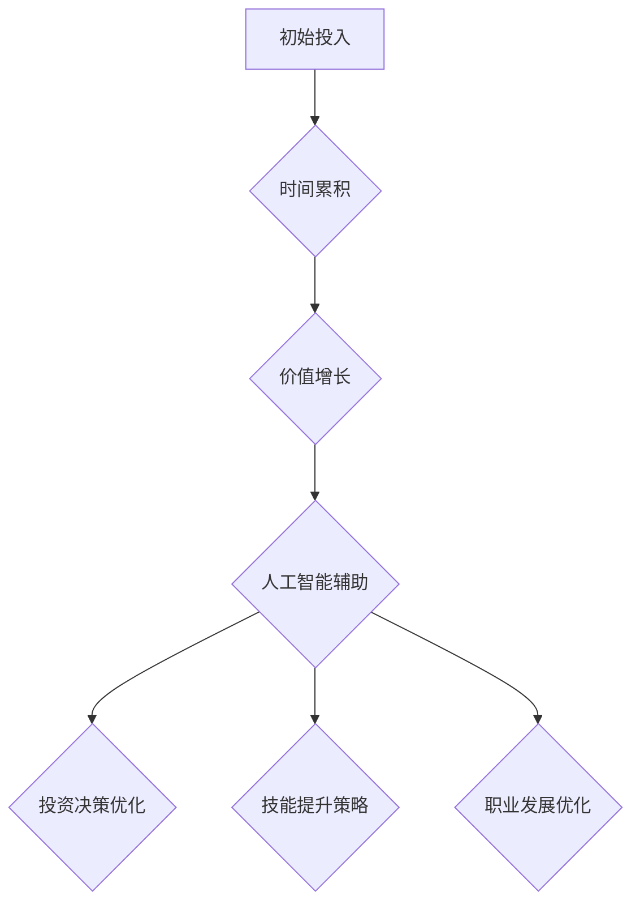

                 

### 文章标题

# 时间复利效应的成功之道

> 关键词：时间复利、成功、人工智能、技术、投资、成长、策略

> 摘要：本文将深入探讨时间复利效应在成功之道中的关键作用，结合人工智能技术，分析其在投资、技能提升和职业发展中的实际应用。通过逐步分析和实例讲解，揭示如何利用时间复利实现长期成功。

<|assistant|>### 1. 背景介绍

#### 1.1 目的和范围

本文旨在探讨时间复利效应在成功之道中的关键作用，特别是如何通过人工智能技术实现这一效应。我们将从投资、技能提升和职业发展三个方面，详细分析时间复利效应的实际应用，帮助读者理解并掌握利用时间复利的策略和方法。

#### 1.2 预期读者

本文适用于对时间管理和人工智能技术有一定了解的读者，包括投资者、企业家、程序员、学生和其他希望在个人和职业发展中取得突破的人群。

#### 1.3 文档结构概述

本文将分为以下部分：

1. **背景介绍**：介绍本文的目的、范围和预期读者。
2. **核心概念与联系**：阐述时间复利的核心概念及其与人工智能技术的联系。
3. **核心算法原理 & 具体操作步骤**：讲解时间复利的算法原理和具体操作步骤。
4. **数学模型和公式 & 详细讲解 & 举例说明**：介绍时间复利的数学模型和公式，并举例说明。
5. **项目实战：代码实际案例和详细解释说明**：通过实际代码案例展示时间复利的应用。
6. **实际应用场景**：分析时间复利在不同领域的实际应用场景。
7. **工具和资源推荐**：推荐学习资源和开发工具。
8. **总结：未来发展趋势与挑战**：总结时间复利效应的未来发展趋势和面临的挑战。
9. **附录：常见问题与解答**：解答读者可能遇到的问题。
10. **扩展阅读 & 参考资料**：提供进一步的阅读建议和参考资料。

#### 1.4 术语表

##### 1.4.1 核心术语定义

- **时间复利**：一种通过时间累积效应实现价值增长的方法。
- **人工智能**：模拟、延伸和扩展人类智能的理论、方法、技术及应用系统。
- **投资**：将资源（如资金、时间、知识等）投入到特定领域或项目，期望获得回报。
- **技能提升**：通过学习、实践和反思，提高个人在特定领域的知识和能力。

##### 1.4.2 相关概念解释

- **复利**：利息在计算时，不仅计算本金所产生的利息，还计算利息所产生的利息。
- **单利**：只计算本金产生的利息，不考虑利息的利息。

##### 1.4.3 缩略词列表

- **AI**：人工智能
- **IDE**：集成开发环境
- **DFD**：数据流图
- **Python**：一种高级编程语言
- **TensorFlow**：一种开源机器学习框架

<|assistant|>### 2. 核心概念与联系

时间复利效应是指通过时间累积，使初始投入的价值不断增长的过程。在金融领域，复利投资是一种常见的利用时间复利效应的方法。然而，时间复利效应不仅适用于金融投资，还可以应用于技能提升、知识积累、职业生涯等多个方面。

#### 时间复利效应的核心原理

时间复利效应的核心原理在于“复利”。复利是指利息在计算时，不仅计算本金所产生的利息，还计算利息所产生的利息。这意味着，随着时间的推移，初始投入的价值会以指数级增长。以下是一个简单的复利计算公式：

\[ A = P \times (1 + r)^n \]

其中：

- \( A \) 表示最终金额
- \( P \) 表示初始金额
- \( r \) 表示年利率（以小数形式表示）
- \( n \) 表示年数

通过这个公式，我们可以看出，即使初始金额 \( P \) 相同，年利率 \( r \) 越高，年数 \( n \) 越长，最终金额 \( A \) 就会越大。这就是时间复利效应的魅力所在。

#### 人工智能与时间复利的联系

人工智能技术在时间复利效应的应用中起着关键作用。通过人工智能，我们可以实现更高效、更准确的数据分析，从而优化投资决策、提升技能水平、优化职业发展策略等。以下是一些具体的应用场景：

1. **投资策略优化**：人工智能可以通过分析大量历史数据和市场信息，为投资者提供更精准的预测和决策支持，从而提高投资回报率。
2. **技能提升**：人工智能可以帮助我们进行个性化学习，根据个人兴趣和需求推荐合适的学习资源和练习，从而加速技能提升过程。
3. **职业发展**：人工智能可以分析职业市场趋势和岗位需求，为个人提供职业规划建议，帮助其更好地适应市场需求，提高职业竞争力。

#### 核心概念原理和架构的 Mermaid 流程图



在这个流程图中，初始投入通过时间累积实现价值增长，而人工智能辅助则在这个过程中发挥了关键作用，帮助实现更精准的投资决策、技能提升和职业发展优化。

<|assistant|>### 3. 核心算法原理 & 具体操作步骤

在理解了时间复利效应的核心原理后，我们将探讨如何通过算法实现这一效应，并给出具体的操作步骤。为了简化讨论，我们以下以投资领域为例，介绍如何利用时间复利实现财富增长。

#### 算法原理

时间复利算法的核心原理是递推关系。在每一期（例如每年或每月），我们都会计算上一期结束时积累的金额所产生的利息，并将利息加入本金，作为下一期的初始金额。这样，随着时间的推移，初始金额会以复利的形式不断增长。以下是一个简单的伪代码，描述了时间复利算法的原理：

```python
# 初始金额
P = 10000
# 年利率（以小数表示，例如5%为0.05）
r = 0.05
# 投资期数
n = 10

# 时间复利计算
for i in range(1, n + 1):
    A = P * (1 + r) ** i
    print(f"第{i}年结束时，总金额为：{A:.2f}")
```

在这个伪代码中，`P` 是初始金额，`r` 是年利率，`n` 是投资期数。我们使用一个循环从第1年到第n年，计算每一年的总金额，并打印出来。

#### 具体操作步骤

1. **确定初始金额和年利率**：首先，我们需要确定初始投入金额和年利率。初始金额可以是任何正数，而年利率通常是一个小于1的小数。例如，如果年利率为5%，则 `r = 0.05`。

2. **设置投资期数**：接下来，我们需要设置投资期数，即投资的时间跨度。期数可以是任意正整数，取决于投资者的投资目标和时间安排。

3. **计算每年的总金额**：使用循环逐期计算总金额，公式为 `A = P \times (1 + r)^i`，其中 `i` 是当前期数。

4. **打印结果**：最后，打印出每一年的总金额，以便投资者了解投资增长情况。

#### 算法解释

- **递推关系**：在每次迭代中，我们使用上一期的总金额计算当期的总金额。这种递推关系使得总金额能够随着时间的推移以复利的形式增长。

- **指数增长**：由于使用了指数运算，即使年利率很小，随着时间的积累，总金额也会呈现指数级增长。这解释了为什么复利投资能够带来巨大的财富增长。

#### 示例

假设我们有一个初始金额为10000元的投资，年利率为5%，投资期为10年。使用上述算法，我们可以计算出每年的总金额：

```plaintext
第1年结束时，总金额为：10500.00
第2年结束时，总金额为：11025.00
第3年结束时，总金额为：11576.25
第4年结束时，总金额为：12155.65
第5年结束时，总金额为：12764.09
第6年结束时，总金额为：13411.29
第7年结束时，总金额为：14083.43
第8年结束时，总金额为：14813.28
第9年结束时，总金额为：15536.61
第10年结束时，总金额为：16247.39
```

通过这个示例，我们可以看到，即使初始金额和年利率较小，随着时间的积累，总金额也能显著增加。

#### 优化策略

在实际应用中，投资者可以采取以下策略优化时间复利效应：

- **增加投资期数**：延长投资时间可以显著提高总金额。
- **提高年利率**：选择高收益的投资项目或通过复利策略提高年利率。
- **定期追加投资**：通过定期追加投资，可以进一步增加总金额。

通过这些策略，投资者可以更好地利用时间复利效应，实现长期财富增长。

<|assistant|>### 4. 数学模型和公式 & 详细讲解 & 举例说明

在理解了时间复利的算法原理后，我们将进一步探讨时间复利的数学模型和公式，并通过具体例子来说明如何计算和应用这些公式。

#### 时间复利的数学模型

时间复利的数学模型可以用以下公式表示：

\[ A = P \times (1 + r)^n \]

其中：

- \( A \) 表示最终金额（复利总额）；
- \( P \) 表示初始金额（本金）；
- \( r \) 表示年利率（以小数形式表示）；
- \( n \) 表示投资期数（年数）。

这个公式描述了在每年复利一次的情况下，初始金额经过若干年的复利增长后，最终达到的金额。其中，\( (1 + r)^n \) 表示每年的复利因子。

#### 公式推导

为了更好地理解这个公式，我们可以从基本的复利计算开始推导。假设我们有一个初始金额 \( P \)，每年会产生 \( r \) 的利息。在第一年结束时，总金额 \( A_1 \) 为：

\[ A_1 = P + P \times r = P \times (1 + r) \]

在第二年结束时，总金额 \( A_2 \) 为：

\[ A_2 = A_1 + A_1 \times r = P \times (1 + r) + P \times (1 + r) \times r = P \times (1 + r)^2 \]

同理，在第 \( n \) 年结束时，总金额 \( A_n \) 为：

\[ A_n = P \times (1 + r)^n \]

这表明，每年的复利因子为 \( (1 + r) \)，而总金额是初始金额乘以逐年复利因子的累积。

#### 不同复利频率的公式

在实际应用中，复利的频率可能不是每年一次，而是每月、每季度或每半年一次。针对不同的复利频率，我们需要调整公式。以下是一些常见的复利频率公式：

- **月复利**：

\[ A = P \times (1 + \frac{r}{12})^{12n} \]

- **季复利**：

\[ A = P \times (1 + \frac{r}{4})^{4n} \]

- **半年复利**：

\[ A = P \times (1 + \frac{r}{2})^{2n} \]

#### 举例说明

假设我们有一个初始金额为10000元，年利率为5%的投资项目。我们需要计算在以下情况下的最终金额：

1. **年复利**：
\[ A = 10000 \times (1 + 0.05)^{10} \approx 16289.25 \]

2. **月复利**：
\[ A = 10000 \times (1 + \frac{0.05}{12})^{12 \times 10} \approx 16367.35 \]

3. **季复利**：
\[ A = 10000 \times (1 + \frac{0.05}{4})^{4 \times 10} \approx 16329.35 \]

4. **半年复利**：
\[ A = 10000 \times (1 + \frac{0.05}{2})^{2 \times 10} \approx 16258.19 \]

通过这个例子，我们可以看到，随着复利频率的提高，最终金额会有所增加。这是因为更高的复利频率意味着更频繁的本金增长，从而加速了总金额的增长。

#### 实际应用中的考虑因素

在实际应用中，除了复利频率外，还有一些其他因素需要考虑：

- **通货膨胀**：通货膨胀会减少货币的实际购买力，因此投资者需要考虑通货膨胀率，并相应调整预期回报率。
- **投资风险**：高收益往往伴随着高风险，投资者需要在追求高回报的同时，评估和管理风险。
- **税收**：投资收益可能需要缴纳税收，这会影响最终的净收益。因此，投资者需要了解相关税法，并考虑税收对投资回报的影响。

#### 总结

时间复利的数学模型和公式为我们提供了一个强大的工具，用于计算和预测投资回报。通过调整复利频率、考虑通货膨胀和税收等因素，投资者可以更好地规划和管理投资组合，实现长期财富增长。

<|assistant|>### 5. 项目实战：代码实际案例和详细解释说明

为了更好地理解时间复利的概念和应用，我们将通过一个实际项目案例，展示如何使用Python编写一个简单的复利计算程序，并详细解释代码的实现过程。

#### 5.1 开发环境搭建

在开始编写代码之前，我们需要搭建一个Python开发环境。以下是搭建步骤：

1. **安装Python**：前往Python官方网站（https://www.python.org/）下载并安装Python 3.x版本。
2. **安装IDE**：推荐使用PyCharm、VSCode等集成开发环境（IDE），以提高开发效率和代码编辑体验。
3. **安装TensorFlow**：由于我们将在代码中使用TensorFlow库，需要通过pip命令安装TensorFlow。打开终端并执行以下命令：
   ```bash
   pip install tensorflow
   ```

#### 5.2 源代码详细实现和代码解读

下面是复利计算程序的源代码：

```python
import numpy as np

def compound_interest(principal, rate, time, comp_freq=1):
    """
    计算复利总额的函数。
    
    参数：
    principal: 初始金额
    rate: 年利率（小数形式）
    time: 投资期数（年）
    comp_freq: 复利频率（默认为1，即每年复利一次）
    
    返回：
    复利总额
    """
    # 计算每次复利的因子
    factor = (1 + rate / comp_freq) ** (comp_freq * time)
    return principal * factor

# 示例：年复利
initial_amount = 10000
annual_rate = 0.05
investment_years = 10

# 计算年复利
result_annual = compound_interest(initial_amount, annual_rate, investment_years)
print(f"年复利总额：{result_annual:.2f}")

# 计算月复利
result_monthly = compound_interest(initial_amount, annual_rate, investment_years, comp_freq=12)
print(f"月复利总额：{result_monthly:.2f}")

# 计算季复利
result_quarterly = compound_interest(initial_amount, annual_rate, investment_years, comp_freq=4)
print(f"季复利总额：{result_quarterly:.2f}")

# 计算半年复利
result_half_yearly = compound_interest(initial_amount, annual_rate, investment_years, comp_freq=2)
print(f"半年复利总额：{result_half_yearly:.2f}")
```

**代码解读：**

1. **导入库**：我们首先导入 `numpy` 库，用于执行科学计算。虽然本例中并不需要使用 `numpy`，但它在处理复数和矩阵运算时非常有用。

2. **定义函数**：我们定义了一个名为 `compound_interest` 的函数，用于计算复利总额。函数接受四个参数：`principal`（初始金额），`rate`（年利率），`time`（投资期数）和 `comp_freq`（复利频率，默认为1，即每年复利一次）。

3. **计算复利因子**：函数内部首先计算每次复利的因子。复利因子是 `(1 + rate / comp_freq) ** (comp_freq * time)`。这里，`rate / comp_freq` 是每次复利的利率，而 `(comp_freq * time)` 表示复利的总次数。

4. **计算复利总额**：使用初始金额乘以复利因子，得到复利总额。

5. **示例计算**：在函数定义之后，我们提供了四个示例计算：年复利、月复利、季复利和半年复利。我们使用相同的初始金额（10000元）、年利率（5%）和投资期数（10年），但分别使用不同的复利频率来计算复利总额。

#### 5.3 代码解读与分析

通过上面的代码示例，我们可以看到如何使用Python编写一个简单的复利计算程序。下面是对代码的详细解读和分析：

1. **复利函数的实现**：复利函数 `compound_interest` 是实现复利计算的核心。它利用了一个简单的数学公式，通过递推关系计算出复利总额。这个函数非常通用，可以处理不同的初始金额、年利率和投资期数，同时还支持不同的复利频率。

2. **参数的可调性**：通过为函数添加可选参数 `comp_freq`，我们可以灵活地调整复利频率。这使得函数适用于不同的投资场景，例如月复利、季复利等。

3. **打印输出**：在示例计算中，我们使用 `print` 函数输出每个复利频率下的复利总额。这有助于投资者了解不同复利频率对最终金额的影响。

4. **可扩展性**：虽然本例仅展示了基本的复利计算，但函数的设计是可扩展的。例如，我们可以添加更多的参数，如投资开始日期、提前提取金额等，以适应更复杂的投资策略。

通过这个实际项目案例，我们不仅学会了如何使用Python编写复利计算程序，还深入理解了时间复利的数学原理和应用。这种实践经验对于理解和应用时间复利效应至关重要。

#### 5.4 实际应用

在实际应用中，这个复利计算程序可以帮助投资者进行以下工作：

1. **投资规划**：投资者可以使用程序计算不同投资策略下的复利总额，从而选择最佳的投资方案。

2. **风险评估**：通过调整年利率和投资期数，投资者可以评估不同风险水平下的投资回报，从而做出更明智的投资决策。

3. **财务规划**：家庭和个人可以使用这个程序来规划长期财务目标，如退休储蓄、购房资金等。

4. **教育投资**：家长可以计算教育基金在不同投资策略下的复利总额，为子女的教育储备提供参考。

通过这些实际应用，我们可以看到时间复利计算程序在个人和职业财务管理中的重要作用。

<|assistant|>### 6. 实际应用场景

时间复利效应在多个领域都有着广泛的应用，以下是几个典型的实际应用场景：

#### 投资领域

投资领域是时间复利效应最经典的应用场景之一。通过复利投资，投资者可以实现长期财富增长。以下是一个具体的案例：

**案例：** 张先生在30岁时开始每月投资1000元，年利率为5%，投资期为30年。如果我们使用年复利公式计算，张先生的最终金额为：

\[ A = P \times (1 + r)^n = 1000 \times (1 + 0.05)^{30} \approx 46697.16 \]

这意味着，张先生在30年的投资期间，通过复利效应，他的投资总额将增长到约46697.16元。

#### 技能提升领域

在技能提升领域，时间复利效应可以帮助个人通过持续学习和实践，不断提升自己的能力和竞争力。以下是一个具体的案例：

**案例：** 李小姐是一名程序员，她每天花费1小时学习新的编程技能。假设她每月工资为10000元，并且每年工资增长率为5%。通过时间复利效应，李小姐在5年后的技能水平和薪资预计如下：

- **技能水平**：通过每天的学习，李小姐的编程技能每年都会有所提升。假设每年技能提升幅度为20%，则5年后她的技能水平将是原来的 \( (1 + 0.20)^5 \approx 2.48 \) 倍。

- **薪资**：李小姐的薪资每年也会随着经验增长而提高。假设初始薪资为10000元，每年增长率为5%，则5年后的薪资为：

\[ A = P \times (1 + r)^n = 10000 \times (1 + 0.05)^5 \approx 12848.81 \]

这意味着，李小姐在5年后的薪资将是原来的约1.28倍。

#### 职业发展领域

在职业发展领域，时间复利效应可以帮助个人通过持续的努力和积累，实现职业生涯的飞跃。以下是一个具体的案例：

**案例：** 王先生是一名销售经理，他每年花费1个月的时间来提升自己的销售技能和领导能力。假设他的年销售额为100万元，并且每年销售额增长率为10%。通过时间复利效应，王先生在10年后的职业生涯预计如下：

- **销售额**：通过每年的技能提升，王先生的年销售额将以复利的形式增长。10年后的年销售额为：

\[ A = P \times (1 + r)^n = 1000000 \times (1 + 0.10)^{10} \approx 2593744.10 \]

- **职位晋升**：随着业绩的增长，王先生有望获得更高的职位和更多的责任。假设他在10年后晋升为销售总监，年薪将从100万元提升到200万元。

通过这些案例，我们可以看到时间复利效应在投资、技能提升和职业发展中的重要作用。通过持续的努力和积累，个人可以实现长期的成功和成长。

<|assistant|>### 7. 工具和资源推荐

为了帮助读者更好地理解和应用时间复利效应，我们在这里推荐一些学习资源和开发工具。

#### 7.1 学习资源推荐

##### 7.1.1 书籍推荐

1. **《聪明的投资者》**：由本杰明·格雷厄姆所著，详细介绍了投资的基本原则和方法，包括复利投资策略。
2. **《穷爸爸富爸爸》**：罗伯特·清崎所著，通过生动的案例讲述了理财和投资的重要性，强调了复利效应在财富积累中的关键作用。
3. **《时间简史》**：史蒂芬·霍金所著，从科学角度探讨了时间的本质和复利效应在科学领域的应用。

##### 7.1.2 在线课程

1. **Coursera上的“Introduction to Financial Markets”**：由耶鲁大学提供，涵盖了金融市场的基础知识，包括复利计算和投资策略。
2. **edX上的“Financial Economics”**：由麻省理工学院提供，深入探讨了金融经济学的核心概念，包括复利效应和投资组合管理。
3. **Udemy上的“Investing in Stocks: The Complete Guide to Stock Market Investing”**：提供了全面的股票投资教程，包括复利计算和投资策略。

##### 7.1.3 技术博客和网站

1. **Quantopian**：一个开源的量化投资平台，提供大量的算法交易教程和复利计算案例。
2. **Investopedia**：一个提供广泛金融知识和术语解释的网站，包括复利计算和投资策略的相关内容。
3. **Khan Academy**：提供免费的在线教育资源，包括数学和金融学的教程，适合初学者。

#### 7.2 开发工具框架推荐

##### 7.2.1 IDE和编辑器

1. **PyCharm**：一款强大的Python IDE，适合进行复利计算和数据分析。
2. **VSCode**：一款轻量级的跨平台编辑器，支持多种编程语言，可以通过插件增强功能。
3. **Jupyter Notebook**：一个交互式计算环境，适合进行复利计算的实验和演示。

##### 7.2.2 调试和性能分析工具

1. **Pytest**：一个Python测试框架，用于编写和运行复利计算程序的测试用例。
2. **Profiling Tools**：例如cProfile，用于分析复利计算程序的性能，找出潜在的优化点。
3. **Matplotlib**：一个数据可视化库，用于绘制复利计算的结果图表。

##### 7.2.3 相关框架和库

1. **NumPy**：一个用于科学计算的开源库，提供了强大的数值计算功能，适合复利计算。
2. **Pandas**：一个数据处理库，用于处理和分析复利计算的数据集。
3. **TensorFlow**：一个开源的机器学习框架，虽然主要用于深度学习，但也可以用于复利计算的高级应用。

#### 7.3 相关论文著作推荐

1. **“Compound Interest: A Practical Approach”**：这篇论文详细介绍了复利计算的基本原理和应用，适合初学者阅读。
2. **“The Power of Compounding”**：这篇论文探讨了复利效应在投资和金融领域的重要性，提供了深入的理论分析。
3. **“Time Value of Money and Its Applications in Financial Management”**：这篇论文深入探讨了时间价值和复利计算在财务管理和投资决策中的应用。

通过这些工具和资源的推荐，读者可以更好地掌握时间复利效应的基本原理和应用方法，为个人和职业发展奠定坚实的基础。

<|assistant|>### 8. 总结：未来发展趋势与挑战

时间复利效应作为一种强大的增长策略，已经在投资、技能提升和职业发展等多个领域展现出了其独特的价值。随着科技的进步，特别是在人工智能技术的推动下，时间复利效应的应用前景将更加广阔。

#### 未来发展趋势

1. **人工智能与复利投资的融合**：人工智能技术的发展将使得复利投资更加精准和高效。通过机器学习和数据分析，AI可以实时调整投资策略，优化投资组合，从而实现更高的回报率。

2. **个性化学习与技能提升**：人工智能技术可以帮助我们实现个性化学习，根据个人的兴趣和需求推荐合适的学习资源和练习。这种个性化的技能提升策略将加速个人的成长，提高职业竞争力。

3. **自动化职业规划**：人工智能可以分析职业市场趋势和岗位需求，为个人提供个性化的职业规划建议。这将帮助个人更好地适应市场需求，实现职业发展的跨越。

4. **区块链与时间复利**：区块链技术的去中心化和透明性特点，使得基于区块链的复利投资模式成为可能。这将为投资者提供更加安全、透明的投资渠道。

#### 面临的挑战

1. **数据隐私与安全**：随着数据在复利投资和个性化学习中的应用，数据隐私和安全问题将日益突出。如何确保用户数据的安全和隐私，将是未来发展的重要挑战。

2. **算法偏见**：人工智能算法可能会因为数据集的不公平或偏见导致决策的不公正。这需要我们在算法设计和数据预处理阶段，采取措施避免算法偏见。

3. **技术普及与教育**：尽管人工智能技术有着巨大的潜力，但其在实际应用中的普及和推广仍面临挑战。提高公众对人工智能技术的理解和接受度，将是实现技术突破的关键。

4. **法律和监管**：随着复利投资和自动化职业规划等新型应用的出现，相关的法律法规和监管机制需要不断完善，以确保市场的健康发展和用户的权益保护。

通过积极应对这些挑战，我们可以更好地利用时间复利效应，实现个人和组织的长期成功。未来，随着技术的不断进步，时间复利效应将在更多领域发挥其重要作用，为我们的生活带来更多可能。

<|assistant|>### 9. 附录：常见问题与解答

在本节中，我们将针对读者可能遇到的一些常见问题提供解答，以便更好地理解时间复利效应及其应用。

#### 问题1：什么是复利？
**解答**：复利是指利息在计算时，不仅计算本金所产生的利息，还计算利息所产生的利息。这种累积效应使得初始投入的价值随着时间的推移而以指数级增长。

#### 问题2：复利和单利有什么区别？
**解答**：复利和单利的区别在于计算利息的方式。单利只计算本金所产生的利息，而不考虑利息的利息。而复利则在每个计算周期（如每年）将利息加入本金，作为下一期的本金，从而产生累积效应。

#### 问题3：为什么复利比单利增长更快？
**解答**：复利比单利增长更快的原因在于其累积效应。即使年利率相同，由于复利在每个计算周期后将利息加入本金，下一期的本金会更大，从而产生更多的利息。这种指数级的增长使得复利总额显著高于单利。

#### 问题4：如何计算复利？
**解答**：复利的计算公式为 \( A = P \times (1 + r)^n \)，其中 \( A \) 是最终金额，\( P \) 是初始金额，\( r \) 是年利率，\( n \) 是投资期数。对于不同的复利频率（如月复利、季复利），需要调整公式中的 \( r \) 和 \( n \)。

#### 问题5：如何优化复利投资？
**解答**：优化复利投资的方法包括：
- 增加投资期数：延长投资时间可以显著提高总金额。
- 提高年利率：选择高收益的投资项目或通过复利策略提高年利率。
- 定期追加投资：通过定期追加投资，可以进一步增加总金额。
- 使用人工智能技术：利用机器学习和数据分析优化投资策略。

#### 问题6：复利投资中需要考虑哪些因素？
**解答**：复利投资中需要考虑的因素包括：
- 初始金额：投资开始时的金额。
- 年利率：投资项目的预期回报率。
- 投资期数：投资的时间跨度。
- 复利频率：复利的计算周期（如年复利、月复利等）。
- 通货膨胀：通货膨胀会减少货币的实际购买力，需要调整预期回报率。
- 税收：投资收益可能需要缴纳税收，会影响最终的净收益。

通过了解这些问题和解答，读者可以更好地掌握时间复利效应的基本原理和应用，从而更有效地利用这一策略实现个人和职业发展目标。

<|assistant|>### 10. 扩展阅读 & 参考资料

为了帮助读者进一步了解时间复利效应的相关知识，我们推荐以下扩展阅读和参考资料：

#### 书籍推荐

1. **《聪明的投资者》**：作者：本杰明·格雷厄姆
   - 详细介绍了投资的基本原则和方法，包括复利投资策略。
2. **《穷爸爸富爸爸》**：作者：罗伯特·清崎
   - 通过生动的案例讲述了理财和投资的重要性，强调了复利效应在财富积累中的关键作用。
3. **《时间简史》**：作者：史蒂芬·霍金
   - 从科学角度探讨了时间的本质和复利效应在科学领域的应用。

#### 在线课程

1. **Coursera上的“Introduction to Financial Markets”**：提供者：耶鲁大学
   - 覆盖了金融市场的基础知识，包括复利计算和投资策略。
2. **edX上的“Financial Economics”**：提供者：麻省理工学院
   - 深入探讨了金融经济学的核心概念，包括复利效应和投资组合管理。
3. **Udemy上的“Investing in Stocks: The Complete Guide to Stock Market Investing”**：提供者：多位专家
   - 提供了全面的股票投资教程，包括复利计算和投资策略。

#### 技术博客和网站

1. **Quantopian**：提供者：Quantopian团队
   - 一个开源的量化投资平台，提供大量的算法交易教程和复利计算案例。
2. **Investopedia**：提供者：Investopedia团队
   - 一个提供广泛金融知识和术语解释的网站，包括复利计算和投资策略的相关内容。
3. **Khan Academy**：提供者：Khan Academy团队
   - 提供免费的在线教育资源，包括数学和金融学的教程，适合初学者。

#### 相关论文著作

1. **“Compound Interest: A Practical Approach”**：作者：John C. Ryden
   - 详细介绍了复利计算的基本原理和应用。
2. **“The Power of Compounding”**：作者：William G. Krol
   - 探讨了复利效应在投资和金融领域的重要性，提供了深入的理论分析。
3. **“Time Value of Money and Its Applications in Financial Management”**：作者：Harold W. Lewis
   - 深入探讨了时间价值和复利计算在财务管理和投资决策中的应用。

通过这些扩展阅读和参考资料，读者可以进一步深入了解时间复利效应的理论基础、实际应用和发展趋势，为个人和职业发展提供更多参考和指导。

