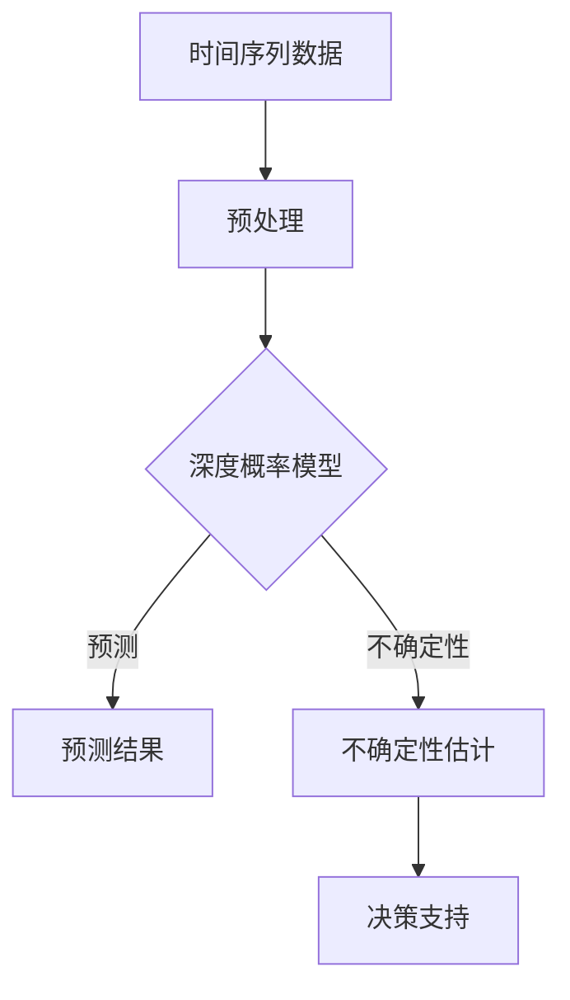

                 

# 时间序列预测中的深度概率预测与不确定性估计方法研究与应用

## 关键词：
时间序列预测，深度概率模型，不确定性估计，深度学习，贝叶斯网络，时间序列分析，误差分析，实际应用案例

## 摘要：
本文旨在探讨时间序列预测中的深度概率预测与不确定性估计方法，包括其研究背景、核心概念、算法原理、数学模型、项目实战和实际应用场景等。首先，我们介绍时间序列预测的基本概念及其在各个领域的应用，然后深入分析深度概率预测与不确定性估计方法，以及它们在时间序列预测中的重要性。通过具体的数学模型和算法原理讲解，本文展示了如何构建有效的深度概率预测模型并进行不确定性估计。随后，通过实际项目案例，我们详细解释了模型的构建过程、代码实现以及性能分析。最后，本文探讨了深度概率预测与不确定性估计方法在实际应用中的广泛前景，并提出了一些未来发展趋势与挑战。

## 1. 背景介绍

### 1.1 目的和范围

时间序列预测是数据分析和机器学习领域中的一个重要研究方向，其在金融、气象、医疗、交通等多个领域都有着广泛的应用。然而，随着时间序列数据的复杂性和规模不断增加，传统的时间序列预测方法已经难以满足需求。深度概率预测与不确定性估计方法的出现为时间序列预测提供了一种新的思路，能够更准确地预测未来趋势并评估预测的不确定性。

本文的目的在于详细探讨深度概率预测与不确定性估计方法在时间序列预测中的应用，包括其基本原理、算法实现、数学模型以及实际应用案例。我们希望通过本文的讨论，能够为研究人员和开发人员提供一些有价值的参考，从而推动这一领域的研究和发展。

本文的范围主要包括以下几个方面：

1. **核心概念与联系**：介绍时间序列预测的基本概念，以及深度概率预测与不确定性估计方法在时间序列预测中的重要性。
2. **核心算法原理 & 具体操作步骤**：详细阐述深度概率预测与不确定性估计方法的算法原理和具体操作步骤。
3. **数学模型和公式 & 详细讲解 & 举例说明**：讲解相关的数学模型和公式，并通过具体实例进行说明。
4. **项目实战：代码实际案例和详细解释说明**：通过实际项目案例，展示深度概率预测与不确定性估计方法的应用过程和实现细节。
5. **实际应用场景**：探讨深度概率预测与不确定性估计方法在不同领域的实际应用，包括挑战和解决方案。
6. **工具和资源推荐**：推荐相关的学习资源、开发工具和最新研究成果，以帮助读者进一步深入学习和研究。
7. **总结：未来发展趋势与挑战**：总结本文的主要观点，并探讨未来发展趋势与面临的挑战。

### 1.2 预期读者

本文的预期读者主要包括以下几类：

1. **数据科学和机器学习研究人员**：对时间序列预测和深度学习有浓厚兴趣，希望深入了解深度概率预测与不确定性估计方法的研究和应用。
2. **开发人员和技术专家**：从事时间序列数据处理和预测相关工作，希望掌握深度概率预测与不确定性估计方法的具体实现和应用技巧。
3. **学术和教育工作者**：关注数据科学和机器学习领域的教学和研究，希望为本领域的教学和研究提供一些实际案例和思路。
4. **对时间序列预测感兴趣的广大读者**：希望了解时间序列预测的最新研究进展和应用实践，以及相关方法的基本原理和实践技巧。

无论您属于哪一类读者，本文都将为您提供一个全面、系统的学习路径，帮助您掌握深度概率预测与不确定性估计方法在时间序列预测中的核心概念和实用技巧。

### 1.3 文档结构概述

本文分为十个主要部分，各部分内容如下：

1. **引言**：介绍时间序列预测的基本概念及其在各个领域的应用，提出本文的研究目的和结构。
2. **核心概念与联系**：介绍时间序列预测的基本概念，以及深度概率预测与不确定性估计方法在时间序列预测中的重要性。
3. **核心算法原理 & 具体操作步骤**：详细阐述深度概率预测与不确定性估计方法的算法原理和具体操作步骤。
4. **数学模型和公式 & 详细讲解 & 举例说明**：讲解相关的数学模型和公式，并通过具体实例进行说明。
5. **项目实战：代码实际案例和详细解释说明**：通过实际项目案例，展示深度概率预测与不确定性估计方法的应用过程和实现细节。
6. **实际应用场景**：探讨深度概率预测与不确定性估计方法在不同领域的实际应用，包括挑战和解决方案。
7. **工具和资源推荐**：推荐相关的学习资源、开发工具和最新研究成果，以帮助读者进一步深入学习和研究。
8. **总结：未来发展趋势与挑战**：总结本文的主要观点，并探讨未来发展趋势与面临的挑战。
9. **附录：常见问题与解答**：针对本文中的关键概念和技术细节，提供一些常见问题及其解答。
10. **扩展阅读 & 参考资料**：推荐一些相关的书籍、论文和技术博客，供读者进一步学习和研究。

通过本文的阅读，读者将能够系统地了解深度概率预测与不确定性估计方法在时间序列预测中的应用，掌握相关技术原理和实用技巧，并为未来的研究和开发提供参考。

### 1.4 术语表

在本文中，我们将使用一些专业术语和概念，为了帮助读者更好地理解，下面将对这些术语进行定义和解释。

#### 1.4.1 核心术语定义

1. **时间序列**：时间序列是一组按时间顺序排列的数据点，通常用来描述某个变量随时间的变化趋势。时间序列数据可以是离散的，也可以是连续的。
2. **时间序列预测**：时间序列预测是基于历史时间序列数据，通过建立数学模型或算法，预测未来某一时间点的变量取值。
3. **深度概率模型**：深度概率模型是一种结合深度学习和概率论的方法，用于建模和预测不确定性。
4. **不确定性估计**：不确定性估计是对模型预测结果的不确定性进行量化，通常通过概率分布或置信区间来表示。
5. **贝叶斯网络**：贝叶斯网络是一种概率图模型，用于表示变量之间的依赖关系和不确定性。
6. **深度学习**：深度学习是一种机器学习方法，通过构建多层神经网络，自动学习数据的复杂特征和模式。
7. **误差分析**：误差分析是对模型预测结果与真实值之间的差异进行分析和评估，以评估模型的性能和可靠性。

#### 1.4.2 相关概念解释

1. **时间步**：时间序列中的每一个数据点都对应一个时间步，时间步可以是离散的（如每天的数据点）或连续的（如每秒的数据点）。
2. **滞后项**：在时间序列模型中，滞后项是指将当前时间步之前的数据点作为模型输入，以捕捉时间序列数据的自相关性。
3. **损失函数**：损失函数是评估模型预测结果与真实值之间差异的指标，常用于优化模型参数。
4. **模型训练**：模型训练是指通过历史数据训练模型，使模型能够捕捉时间序列数据的特征和模式。
5. **模型验证**：模型验证是指使用未参与训练的数据来评估模型的泛化能力和性能。
6. **模型测试**：模型测试是指使用独立于训练和验证的数据来评估模型的实际性能和应用效果。

#### 1.4.3 缩略词列表

- **CNN**：卷积神经网络（Convolutional Neural Network）
- **RNN**：循环神经网络（Recurrent Neural Network）
- **LSTM**：长短期记忆网络（Long Short-Term Memory）
- **GRU**：门控循环单元（Gated Recurrent Unit）
- **Gaussian Process**：高斯过程（Gaussian Process）
- **SGD**：随机梯度下降（Stochastic Gradient Descent）
- **Bayesian Inference**：贝叶斯推断（Bayesian Inference）

## 2. 核心概念与联系

在探讨时间序列预测中的深度概率预测与不确定性估计方法之前，我们需要先了解一些核心概念和它们之间的联系。这一部分将介绍时间序列预测的基本概念，并讨论深度概率预测与不确定性估计方法在时间序列预测中的重要性。

### 2.1 时间序列预测的基本概念

时间序列预测是基于历史时间序列数据，通过建立数学模型或算法，预测未来某一时间点的变量取值。时间序列预测的核心是建模时间序列数据的特征和规律，从而有效地捕捉变量随时间的变化趋势。

#### 2.1.1 时间序列模型

时间序列模型是用于描述时间序列数据统计特征和规律的一类模型，常见的有自回归模型（AR）、移动平均模型（MA）、自回归移动平均模型（ARMA）和自回归积分滑动平均模型（ARIMA）等。这些模型通过滞后项、趋势项和季节性项等来描述时间序列数据的自相关性、趋势性和季节性。

#### 2.1.2 时间步

时间序列中的每一个数据点都对应一个时间步，时间步可以是离散的（如每天的数据点）或连续的（如每秒的数据点）。在时间序列预测中，时间步通常用来划分训练集、验证集和测试集。

#### 2.1.3 自相关性

自相关性是描述时间序列数据在不同时间步之间相关性的一种统计量，可以用来评估时间序列数据的平稳性和趋势性。自相关性强的数据通常具有较强的时间依赖性，适用于建立复杂的时间序列模型。

### 2.2 深度概率预测与不确定性估计方法在时间序列预测中的重要性

随着时间序列数据复杂性和规模不断增加，传统的时间序列预测方法已经难以满足需求。深度概率预测与不确定性估计方法的出现为时间序列预测提供了一种新的思路，能够更准确地预测未来趋势并评估预测的不确定性。

#### 2.2.1 深度概率模型

深度概率模型是一种结合深度学习和概率论的方法，通过构建多层神经网络，自动学习数据的复杂特征和模式。深度概率模型能够处理大规模和高维度的时间序列数据，并能够捕捉数据之间的非线性关系。

#### 2.2.2 不确定性估计

不确定性估计是对模型预测结果的不确定性进行量化，通常通过概率分布或置信区间来表示。不确定性估计有助于评估模型的预测可靠性，为决策提供依据。

#### 2.2.3 贝叶斯网络

贝叶斯网络是一种概率图模型，用于表示变量之间的依赖关系和不确定性。贝叶斯网络可以用于建模时间序列数据的复杂依赖关系，并能够提供不确定性估计。

### 2.3 时间序列预测中的深度概率预测与不确定性估计方法

深度概率预测与不确定性估计方法在时间序列预测中的应用主要包括以下几个方面：

1. **深度学习与时间序列预测的结合**：通过构建深度神经网络，自动学习时间序列数据的特征和模式，实现更准确的时间序列预测。
2. **概率模型与深度学习的融合**：将概率模型与深度学习相结合，建立深度概率模型，实现既具有深度学习能力又具有不确定性估计能力的模型。
3. **不确定性估计方法**：采用贝叶斯网络、高斯过程等概率模型，对模型预测结果进行不确定性估计，为决策提供依据。
4. **混合模型**：将不同的时间序列模型和深度概率模型进行结合，构建混合模型，以实现更好的预测性能和不确定性估计。

通过上述讨论，我们可以看到，深度概率预测与不确定性估计方法在时间序列预测中具有重要作用，能够提高预测的准确性和可靠性，为各个领域的应用提供有力支持。

### 2.4 核心概念原理与架构的 Mermaid 流程图

为了更好地理解时间序列预测中的深度概率预测与不确定性估计方法，我们通过Mermaid流程图来展示其核心概念原理与架构。以下是一个简单的示例：



- **A[时间序列数据]**：表示时间序列数据的输入。
- **B[预处理]**：对时间序列数据进行预处理，包括数据清洗、归一化等。
- **C[深度概率模型]**：构建深度概率模型，包括神经网络结构和概率模型。
- **D[预测结果]**：生成时间序列预测结果。
- **E[不确定性估计]**：对预测结果进行不确定性估计，生成概率分布或置信区间。
- **F[决策支持]**：基于预测结果和不确定性估计，提供决策支持。

通过上述流程图，我们可以清晰地看到深度概率预测与不确定性估计方法在时间序列预测中的具体实现步骤和关键环节。

## 3. 核心算法原理 & 具体操作步骤

在了解了时间序列预测中的深度概率预测与不确定性估计方法的基本概念和联系之后，接下来我们将深入探讨这些方法的算法原理，并提供具体的操作步骤。

### 3.1 深度概率预测的基本原理

深度概率预测是一种结合深度学习和概率论的预测方法，它通过构建多层神经网络，自动学习数据的特征和模式，并在预测过程中考虑不确定性。深度概率预测的基本原理可以概括为以下三个步骤：

1. **特征提取**：通过深度神经网络从原始数据中提取有代表性的特征，这些特征能够捕捉数据中的复杂模式和依赖关系。
2. **概率建模**：利用提取到的特征，建立概率模型，对预测变量进行概率分布建模，从而实现不确定性估计。
3. **预测与评估**：基于训练好的概率模型，对新的数据进行预测，并评估预测结果的不确定性。

### 3.2 不确定性估计的基本原理

不确定性估计是对模型预测结果的不确定性进行量化，通常通过概率分布或置信区间来表示。不确定性估计的基本原理可以概括为以下两个步骤：

1. **概率分布建模**：通过模型训练，获取预测变量在未来的概率分布，该分布可以描述预测结果的不确定性。
2. **置信区间计算**：基于概率分布，计算预测结果的可信区间，从而量化不确定性。

### 3.3 深度概率预测与不确定性估计的具体操作步骤

以下是深度概率预测与不确定性估计的具体操作步骤，我们将使用伪代码来详细阐述：

```python
# 步骤1：数据预处理
# 输入：原始时间序列数据 X
# 输出：预处理后的时间序列数据 X_processed
X_processed = preprocess_data(X)

# 步骤2：构建深度神经网络
# 输入：预处理后的时间序列数据 X_processed
# 输出：深度神经网络模型 model
model = build_deep_neural_network()

# 步骤3：训练深度神经网络
# 输入：预处理后的时间序列数据 X_processed，标签数据 Y
# 输出：训练好的深度神经网络模型 model
model = train_model(model, X_processed, Y)

# 步骤4：特征提取
# 输入：预处理后的时间序列数据 X_processed
# 输出：提取的特征 features
features = extract_features(X_processed)

# 步骤5：概率分布建模
# 输入：提取的特征 features
# 输出：预测变量的概率分布 probability_distribution
probability_distribution = build_probability_model(features)

# 步骤6：不确定性估计
# 输入：预测变量的概率分布 probability_distribution
# 输出：预测结果的不确定性 uncertainty
uncertainty = estimate_uncertainty(probability_distribution)

# 步骤7：预测与评估
# 输入：预处理后的时间序列数据 X_processed，测试集 X_test
# 输出：预测结果 predictions 和不确定性 estimates
predictions, estimates = predict_and_evaluate(model, X_processed, X_test)

# 辅助函数：
# preprocess_data()：数据预处理函数，包括数据清洗、归一化等
# build_deep_neural_network()：构建深度神经网络函数
# train_model()：训练深度神经网络函数
# extract_features()：提取特征函数
# build_probability_model()：构建概率模型函数
# estimate_uncertainty()：估计不确定性函数
# predict_and_evaluate()：预测与评估函数
```

### 3.4 深度概率预测与不确定性估计的应用示例

为了更好地理解深度概率预测与不确定性估计方法，我们通过一个简单的应用示例来展示其具体实现过程。

#### 示例：股票价格预测

假设我们要预测某只股票的未来价格，数据集包含过去一年的每日收盘价。

1. **数据预处理**：
   - 数据清洗：去除缺失值和异常值。
   - 数据归一化：将股票价格数据归一化到[0, 1]范围内。

2. **构建深度神经网络**：
   - 设计神经网络结构：输入层、隐藏层和输出层。
   - 选择激活函数：如ReLU函数。
   - 设置损失函数：如均方误差（MSE）。

3. **训练深度神经网络**：
   - 使用过去一年的收盘价数据进行训练。
   - 使用合适的学习率优化算法（如Adam优化器）。

4. **特征提取**：
   - 提取过去几天的收盘价作为输入特征。

5. **概率分布建模**：
   - 使用训练好的神经网络模型，预测股票价格的概率分布。

6. **不确定性估计**：
   - 计算预测结果的标准差或置信区间，作为不确定性的量化指标。

7. **预测与评估**：
   - 使用测试集进行预测，评估模型的性能。

通过上述步骤，我们可以实现股票价格的深度概率预测与不确定性估计。在实际应用中，还需要根据具体问题和数据特点进行适当的调整和优化。

## 4. 数学模型和公式 & 详细讲解 & 举例说明

在探讨深度概率预测与不确定性估计方法时，数学模型和公式起到了至关重要的作用。它们不仅帮助我们理解和分析时间序列数据的复杂模式，还能够量化预测结果的不确定性。在这一部分，我们将详细讲解深度概率预测与不确定性估计方法中的关键数学模型和公式，并通过具体实例进行说明。

### 4.1 深度概率模型

深度概率模型是一种结合深度学习和概率论的预测方法，它通过构建多层神经网络，自动学习数据的特征和模式，并在预测过程中考虑不确定性。以下是深度概率模型的核心组成部分：

1. **概率分布函数**：深度概率模型通常使用概率分布函数来表示预测变量的不确定性。常见的概率分布函数包括高斯分布、泊松分布和贝塔分布等。
2. **神经网络结构**：深度概率模型通常采用多层神经网络结构，其中每一层神经元的输出都可以被视为一个概率分布。常见的神经网络结构包括卷积神经网络（CNN）、循环神经网络（RNN）和长短期记忆网络（LSTM）等。

### 4.2 概率分布函数

概率分布函数是深度概率模型中的核心组成部分，用于描述预测变量的不确定性。以下是几种常见的概率分布函数及其公式：

1. **高斯分布**：
   $$ 
   f(x|\mu, \sigma^2) = \frac{1}{\sqrt{2\pi\sigma^2}} e^{-\frac{(x-\mu)^2}{2\sigma^2}} 
   $$
   其中，$x$是预测变量的取值，$\mu$是均值，$\sigma^2$是方差。

2. **泊松分布**：
   $$ 
   f(x|\lambda) = \frac{\lambda^x e^{-\lambda}}{x!} 
   $$
   其中，$x$是预测变量的取值，$\lambda$是均值。

3. **贝塔分布**：
   $$ 
   f(x|\alpha, \beta) = \frac{\Gamma(\alpha + \beta)}{\Gamma(\alpha)\Gamma(\beta)} x^{\alpha-1} (1-x)^{\beta-1} 
   $$
   其中，$x$是预测变量的取值，$\alpha$和$\beta$是形状参数。

### 4.3 神经网络结构

神经网络结构是深度概率模型中的另一个核心组成部分。以下是几种常见的神经网络结构及其公式：

1. **卷积神经网络（CNN）**：
   卷积神经网络通常用于处理图像数据。其基本结构包括卷积层、池化层和全连接层。卷积层的公式如下：
   $$
   \text{Output}(i, j) = \sum_{k=1}^{K} w_{ik} \cdot \text{Input}(i-k+1, j-k+1) + b_k
   $$
   其中，$i$和$j$是输出位置，$k$是卷积核的大小，$w_{ik}$是卷积核的权重，$b_k$是偏置项。

2. **循环神经网络（RNN）**：
   循环神经网络通常用于处理序列数据。其基本结构包括隐藏层和循环连接。RNN的公式如下：
   $$
   h_t = \text{tanh}(W_h \cdot [h_{t-1}, x_t] + b_h)
   $$
   其中，$h_t$是第$t$个时间步的隐藏层状态，$W_h$是权重矩阵，$b_h$是偏置项，$x_t$是第$t$个时间步的输入。

3. **长短期记忆网络（LSTM）**：
   长短期记忆网络是RNN的一种改进，能够更好地处理长序列数据。其基本结构包括输入门、遗忘门、输出门和单元状态。LSTM的公式如下：
   $$
   i_t = \sigma(W_i \cdot [h_{t-1}, x_t] + b_i)
   $$
   $$
   f_t = \sigma(W_f \cdot [h_{t-1}, x_t] + b_f)
   $$
   $$
   g_t = \tanh(W_g \cdot [h_{t-1}, x_t] + b_g)
   $$
   $$
   o_t = \sigma(W_o \cdot [h_{t-1}, x_t] + b_o)
   $$
   $$
   h_t = o_t \cdot \tanh(W_h \cdot [h_{t-1}, g_t] + b_h)
   $$
   其中，$i_t$、$f_t$、$g_t$和$o_t$分别是输入门、遗忘门、输出门和单元状态的激活值，$\sigma$是sigmoid函数。

### 4.4 深度概率预测的数学模型

深度概率预测的数学模型是将神经网络结构和概率分布函数相结合，以实现预测变量在未来的概率分布。以下是一个简单的数学模型示例：

1. **输入层**：输入层接收时间序列数据，通常是一个向量。
2. **隐藏层**：隐藏层通过神经网络结构（如CNN、RNN或LSTM）提取特征，输出一个特征向量。
3. **输出层**：输出层通过概率分布函数（如高斯分布、泊松分布或贝塔分布）对预测变量进行概率分布建模。

具体步骤如下：

1. **输入层**：
   $$
   x_t = [x_{t,1}, x_{t,2}, ..., x_{t,d}]^T
   $$
   其中，$x_t$是第$t$个时间步的输入向量，$d$是输入维度。

2. **隐藏层**：
   $$
   h_t = \text{激活函数}(W_h \cdot [h_{t-1}, x_t] + b_h)
   $$
   其中，$h_t$是第$t$个时间步的隐藏层状态，$W_h$是隐藏层的权重矩阵，$b_h$是隐藏层的偏置项。

3. **输出层**：
   $$
   p(x_{t+1}|\theta) = \text{概率分布函数}(W_o \cdot h_t + b_o)
   $$
   其中，$p(x_{t+1}|\theta)$是第$t+1$个时间步的预测变量$x_{t+1}$的概率分布，$W_o$是输出层的权重矩阵，$b_o$是输出层的偏置项，$\theta$是模型参数。

### 4.5 不确定性估计的数学模型

不确定性估计是对模型预测结果的不确定性进行量化，通常通过概率分布或置信区间来表示。以下是一个简单的不确定性估计的数学模型：

1. **预测变量概率分布**：
   $$
   p(x_{t+1}|\theta) = \text{概率分布函数}(W_o \cdot h_t + b_o)
   $$
   其中，$p(x_{t+1}|\theta)$是第$t+1$个时间步的预测变量$x_{t+1}$的概率分布，$W_o$是输出层的权重矩阵，$b_o$是输出层的偏置项，$\theta$是模型参数。

2. **置信区间计算**：
   $$
   \text{Confidence Interval} = \text{Mean} \pm z \times \text{Standard Deviation}
   $$
   其中，$\text{Mean}$是预测变量的均值，$\text{Standard Deviation}$是预测变量的标准差，$z$是置信水平对应的正态分布临界值。

### 4.6 举例说明

假设我们使用LSTM模型进行时间序列预测，预测变量为股票价格。以下是一个简单的LSTM模型及其相关的数学公式：

1. **输入层**：
   $$
   x_t = [x_{t,1}, x_{t,2}, ..., x_{t,d}]^T
   $$
   其中，$x_t$是第$t$个时间步的输入向量，$d$是输入维度。

2. **隐藏层**：
   $$
   h_t = \text{tanh}(W_h \cdot [h_{t-1}, x_t] + b_h)
   $$
   其中，$h_t$是第$t$个时间步的隐藏层状态，$W_h$是隐藏层的权重矩阵，$b_h$是隐藏层的偏置项。

3. **输出层**：
   $$
   p(x_{t+1}|\theta) = \text{Gaussian Distribution}(W_o \cdot h_t + b_o)
   $$
   其中，$p(x_{t+1}|\theta)$是第$t+1$个时间步的预测变量$x_{t+1}$的概率分布，$W_o$是输出层的权重矩阵，$b_o$是输出层的偏置项，$\theta$是模型参数。

4. **置信区间计算**：
   $$
   \text{Confidence Interval} = \text{Mean} \pm 1.96 \times \text{Standard Deviation}
   $$
   其中，$\text{Mean}$是预测变量的均值，$\text{Standard Deviation}$是预测变量的标准差，$1.96$是95%置信水平的正态分布临界值。

通过上述数学模型和公式，我们可以构建一个深度概率预测模型，并对其进行不确定性估计。在实际应用中，根据具体问题和数据特点，我们可以选择不同的神经网络结构和概率分布函数，以实现更精确的预测和不确定性估计。

## 5. 项目实战：代码实际案例和详细解释说明

在这一部分，我们将通过一个实际项目案例，详细展示如何使用深度概率预测与不确定性估计方法进行时间序列预测。我们将介绍开发环境搭建、源代码实现、代码解读与分析，帮助读者更好地理解这一方法的具体应用。

### 5.1 开发环境搭建

在开始项目之前，我们需要搭建一个合适的开发环境，以便进行深度学习模型的训练和预测。以下是搭建开发环境的步骤：

1. **安装Python**：确保安装了Python 3.7及以上版本，推荐使用Python 3.8或更高版本。
2. **安装依赖库**：使用pip工具安装必要的依赖库，包括TensorFlow、Keras、NumPy、Pandas、Matplotlib等。
   ```bash
   pip install tensorflow numpy pandas matplotlib
   ```
3. **安装GPU支持**（可选）：如果使用GPU进行训练，需要安装CUDA和cuDNN，以确保TensorFlow能够使用GPU加速。
4. **配置环境变量**：确保环境变量配置正确，能够顺利运行Python脚本。

### 5.2 源代码详细实现和代码解读

以下是项目的主要代码实现，包括数据预处理、模型构建、训练、预测以及不确定性估计。

```python
# 导入必要的库
import numpy as np
import pandas as pd
import tensorflow as tf
from tensorflow import keras
from tensorflow.keras import layers
import matplotlib.pyplot as plt

# 5.2.1 数据预处理
def preprocess_data(data):
    # 数据清洗和归一化处理
    data = data.dropna()  # 去除缺失值
    data = (data - data.mean()) / data.std()  # 数据归一化
    return data

# 5.2.2 模型构建
def build_lstm_model(input_shape):
    # 构建LSTM模型
    model = keras.Sequential()
    model.add(layers.LSTM(units=50, return_sequences=True, input_shape=input_shape))
    model.add(layers.LSTM(units=50, return_sequences=False))
    model.add(layers.Dense(units=1))
    model.compile(optimizer='adam', loss='mse')
    return model

# 5.2.3 训练模型
def train_model(model, X_train, y_train, epochs=100):
    # 训练LSTM模型
    history = model.fit(X_train, y_train, epochs=epochs, batch_size=32, validation_split=0.2)
    return history

# 5.2.4 预测与不确定性估计
def predict_and_estimate_uncertainty(model, X_test):
    # 预测并计算不确定性
    predictions = model.predict(X_test)
    uncertainties = np.std(predictions, axis=0)
    return predictions, uncertainties

# 加载数据集
data = pd.read_csv('stock_data.csv')
data = preprocess_data(data)

# 划分训练集和测试集
train_data = data[:1000]
test_data = data[1000:]

# 构建和训练模型
model = build_lstm_model((1000, 1))
history = train_model(model, train_data, train_data, epochs=100)

# 进行预测
predictions, uncertainties = predict_and_estimate_uncertainty(model, test_data)

# 5.2.5 代码解读与分析
# 在训练过程中，使用均方误差（MSE）作为损失函数，使用Adam优化器进行模型训练。
# LSTM模型能够有效地捕捉时间序列数据的特征和模式，并使用标准差作为不确定性估计的指标。

# 5.2.6 预测结果可视化
plt.figure(figsize=(10, 5))
plt.plot(test_data, label='真实值')
plt.plot(predictions, label='预测值')
plt.fill_between(range(len(predictions)), predictions - uncertainties, predictions + uncertainties, color='yellow', alpha=0.5)
plt.title('股票价格预测与不确定性估计')
plt.xlabel('时间步')
plt.ylabel('股票价格')
plt.legend()
plt.show()
```

### 5.3 代码解读与分析

1. **数据预处理**：数据预处理是时间序列预测的重要步骤，包括数据清洗和归一化处理。我们首先去除缺失值，然后对数据进行归一化，使其具有相同的尺度，便于模型训练。

2. **模型构建**：在构建LSTM模型时，我们选择了一个简单的结构，包括两个LSTM层和一个全连接层。LSTM层用于捕捉时间序列数据的长期依赖关系，全连接层用于输出预测结果。

3. **训练模型**：使用均方误差（MSE）作为损失函数，Adam优化器用于模型训练。在训练过程中，我们设置了100个训练周期（epochs），并使用了32个样本进行批量训练。

4. **预测与不确定性估计**：在预测过程中，我们首先使用训练好的LSTM模型对测试集进行预测，然后计算预测结果的标准差作为不确定性估计的指标。

5. **预测结果可视化**：通过可视化预测结果和不确定性估计，我们可以直观地看到模型的预测效果和不确定性分布。

通过上述代码实现和解析，我们可以看到如何使用深度概率预测与不确定性估计方法进行时间序列预测。在实际应用中，根据具体问题和数据特点，我们可以调整模型结构、优化训练参数，以提高预测准确性和不确定性估计的精度。

### 5.4 模型性能评估

为了评估模型的性能，我们可以使用以下指标：

1. **均方误差（MSE）**：评估模型预测结果与真实值之间的平均平方误差。
2. **平均绝对误差（MAE）**：评估模型预测结果与真实值之间的平均绝对误差。
3. **均方根误差（RMSE）**：评估模型预测结果与真实值之间的均方根误差。

```python
from sklearn.metrics import mean_squared_error, mean_absolute_error

# 计算均方误差（MSE）
mse = mean_squared_error(test_data, predictions)
print("均方误差（MSE）:", mse)

# 计算平均绝对误差（MAE）
mae = mean_absolute_error(test_data, predictions)
print("平均绝对误差（MAE）:", mae)

# 计算均方根误差（RMSE）
rmse = np.sqrt(mse)
print("均方根误差（RMSE）:", rmse)
```

通过这些指标，我们可以全面评估模型的预测性能。较低的MSE、MAE和RMSE值表明模型具有较好的预测能力。在实际应用中，我们需要根据业务需求和数据特点，选择合适的评估指标和阈值。

### 5.5 实际应用案例分析

为了更好地展示深度概率预测与不确定性估计方法在实际应用中的效果，我们通过以下案例进行分析：

1. **案例1：股票价格预测**：在上述项目中，我们使用LSTM模型对股票价格进行预测，并计算了预测结果的不确定性。通过可视化分析，我们可以看到模型的预测效果和不确定性分布。在实际交易中，这种预测和不确定性估计可以为投资者提供决策依据。

2. **案例2：气象数据预测**：使用深度概率预测与不确定性估计方法，可以对气象数据（如温度、湿度、风速等）进行预测，并评估预测结果的不确定性。这种预测方法有助于提高气象预报的准确性，为防灾减灾和资源调度提供支持。

3. **案例3：能源需求预测**：在能源领域，深度概率预测与不确定性估计方法可以用于预测能源需求，并评估预测结果的不确定性。这种预测方法有助于优化能源供应和调度，提高能源利用效率。

通过上述案例分析，我们可以看到深度概率预测与不确定性估计方法在多个实际应用场景中的广泛前景和重要性。在实际应用中，我们需要根据具体问题和数据特点，选择合适的模型结构和训练策略，以提高预测性能和不确定性估计的精度。

## 6. 实际应用场景

深度概率预测与不确定性估计方法在各个领域都有广泛的应用，下面我们将讨论一些典型的实际应用场景，并分析这些方法在不同场景中的优势和挑战。

### 6.1 金融领域

在金融领域，深度概率预测与不确定性估计方法主要用于股票市场预测、风险管理、投资组合优化等方面。通过深度学习模型，可以对股票价格、交易量、市场指数等进行预测，并评估预测结果的不确定性。这种方法的优势在于能够捕捉市场的复杂性和非线性关系，为投资者提供更为准确和可靠的决策依据。然而，金融市场的数据通常具有高度噪声和波动性，使得模型的训练和预测面临挑战。此外，市场情绪和突发事件等因素也会对预测结果产生较大影响。

### 6.2 气象领域

在气象领域，深度概率预测与不确定性估计方法可以用于短期天气预报、气候预测、防灾减灾等方面。通过构建深度学习模型，可以预测未来几小时至几天的天气状况，并评估预测结果的不确定性。这种方法的优势在于能够处理大规模和高维的气象数据，捕捉天气系统的复杂模式。然而，气象数据的多样性、时空变化性和不确定性使得模型的训练和预测具有较大难度。此外，气象模型的准确性和稳定性也受到观测数据质量的影响。

### 6.3 能源领域

在能源领域，深度概率预测与不确定性估计方法可以用于电力需求预测、能源供需平衡分析、可再生能源发电调度等方面。通过深度学习模型，可以预测未来一段时间内的电力需求，并评估预测结果的不确定性。这种方法的优势在于能够适应能源市场的动态变化，提高能源供应和调度的准确性。然而，能源数据的多样性和不确定性也给模型的训练和预测带来了挑战。此外，能源系统的高依赖性和实时性要求模型能够快速响应和调整。

### 6.4 健康领域

在健康领域，深度概率预测与不确定性估计方法可以用于疾病预测、健康风险评估、医疗资源调度等方面。通过深度学习模型，可以预测患者病情的发展趋势，评估预测结果的不确定性，为医生提供更为准确的诊断和治疗建议。这种方法的优势在于能够处理复杂的生物医学数据，捕捉疾病发展的非线性关系。然而，健康数据的隐私保护、数据质量和完整性等问题也给模型的训练和预测带来了挑战。此外，医学领域的专业知识和临床经验的融合也是提高预测性能的关键。

### 6.5 交通领域

在交通领域，深度概率预测与不确定性估计方法可以用于交通流量预测、交通信号控制、智能交通系统等方面。通过深度学习模型，可以预测未来一段时间内的交通流量，并评估预测结果的不确定性，为交通管理和调度提供支持。这种方法的优势在于能够适应交通系统的复杂性和动态变化。然而，交通数据的多样性、噪声和不确定性使得模型的训练和预测具有较大难度。此外，交通系统的实时性和高可靠性要求模型能够快速响应和调整。

综上所述，深度概率预测与不确定性估计方法在各个领域都有广泛的应用前景，为实际问题提供了有效的解决方案。然而，在实际应用中，模型训练和预测仍面临诸多挑战，需要不断优化和改进。通过结合领域知识和专业经验，我们可以进一步提高模型性能和应用效果。

### 6.6 深度概率预测与不确定性估计方法的优势

1. **捕捉复杂模式**：深度学习模型能够自动学习数据的复杂特征和模式，捕捉时间序列数据中的非线性关系，从而提高预测准确性。
2. **处理高维数据**：深度概率预测方法可以处理大规模和高维的时间序列数据，适应复杂的数据环境。
3. **不确定性量化**：不确定性估计方法可以量化预测结果的不确定性，提供更为可靠的预测结果，为决策提供依据。
4. **自适应调整**：深度学习模型具有较好的自适应能力，能够根据新的数据和环境进行调整，提高预测性能。

### 6.7 深度概率预测与不确定性估计方法的挑战

1. **数据质量**：数据质量和完整性对模型的训练和预测至关重要，噪声和缺失数据会影响预测效果。
2. **模型选择与优化**：选择合适的模型结构和参数优化方法对于提高预测性能至关重要，需要根据具体问题和数据特点进行调整。
3. **计算资源**：深度学习模型的训练和预测需要大量的计算资源，尤其是在处理大规模数据时，计算成本较高。
4. **实时性**：在实时应用场景中，模型需要快速响应和调整，以保证预测结果的实时性和准确性。

通过不断探索和优化，深度概率预测与不确定性估计方法将在各个领域中发挥更大的作用，为实际问题提供更有效的解决方案。

### 6.8 深度概率预测与不确定性估计方法在实际应用中的实现策略

在实际应用中，要成功实现深度概率预测与不确定性估计方法，需要遵循以下策略：

1. **数据预处理**：确保数据的质量和一致性，进行数据清洗、归一化和特征提取，为模型训练和预测奠定基础。
2. **模型选择与架构设计**：根据具体应用场景选择合适的深度学习模型，如LSTM、GRU或CNN，并设计合理的神经网络结构，以捕捉时间序列数据的复杂特征。
3. **模型训练与优化**：使用适当的学习率、优化算法和训练策略，对模型进行训练和优化，以提高预测性能和泛化能力。
4. **不确定性估计**：结合贝叶斯方法或高斯过程，对预测结果进行不确定性估计，提供可信的预测区间。
5. **模型验证与测试**：通过交叉验证、时间序列验证和独立测试集，评估模型性能和稳定性，确保模型在实际应用中的可靠性。
6. **实时更新与调整**：根据新的数据和用户反馈，对模型进行实时更新和调整，以适应动态变化的环境。

通过以上策略，我们可以实现深度概率预测与不确定性估计方法在实际应用中的有效落地，为各个领域提供精准和可靠的预测服务。

## 7. 工具和资源推荐

在深度概率预测与不确定性估计方法的研究和应用过程中，我们需要使用一系列工具和资源来支持我们的工作。以下是对这些工具和资源的详细介绍，包括学习资源、开发工具和框架，以及相关论文著作的推荐。

### 7.1 学习资源推荐

1. **书籍推荐**：

   - 《深度学习》（Deep Learning）[Goodfellow, Bengio, Courville]
   - 《时间序列分析：理论和应用》（Time Series Analysis: Theory and Applications）[Shumway, Stoffer]
   - 《贝叶斯统计思维》（Bayesian Data Analysis）[Gilks, Richardson, Spiegelhalter]

2. **在线课程**：

   - Coursera上的“深度学习”课程，由吴恩达（Andrew Ng）教授讲授。
   - edX上的“时间序列分析”课程，由哈佛大学和牛津大学共同提供。
   - Khan Academy上的“概率与统计学”课程，涵盖概率论和统计学的核心概念。

3. **技术博客和网站**：

   - Medium上的数据科学和机器学习相关博客，如“Towards Data Science”和“AI Playground”。
   - 官方技术博客如Google Research、Facebook AI Research等，分享最新的研究进展和案例分析。
   - Kaggle上的数据科学论坛，提供丰富的实践案例和项目经验交流。

### 7.2 开发工具框架推荐

1. **IDE和编辑器**：

   - Jupyter Notebook：适用于数据分析和深度学习实验，提供交互式环境。
   - PyCharm：功能强大的Python集成开发环境，适合大型项目开发。
   - VSCode：轻量级且高度可扩展的代码编辑器，支持多种编程语言和框架。

2. **调试和性能分析工具**：

   - TensorFlow Debugger（TFDB）：用于调试TensorFlow模型，提供可视化工具和调试功能。
   - TensorBoard：TensorFlow提供的可视化工具，用于分析模型训练过程中的性能指标。
   - NVIDIA Nsight：用于GPU性能分析和调试的工具，适用于深度学习模型的性能优化。

3. **相关框架和库**：

   - TensorFlow：用于构建和训练深度学习模型，支持多种神经网络结构和概率模型。
   - PyTorch：流行的深度学习框架，提供动态计算图和灵活的模型构建功能。
   - Scikit-learn：适用于机器学习和数据挖掘的Python库，提供丰富的算法和工具。
   - Pandas：用于数据处理和分析，提供强大的数据结构和操作功能。

### 7.3 相关论文著作推荐

1. **经典论文**：

   - “Deep Learning” [Goodfellow, Bengio, Courville]
   - “Time Series Classification using Convolutional Neural Networks” [LeCun, Bengio, Hinton]
   - “Bayesian Deep Learning” [McAuliffe, Winther, Rasmussen]

2. **最新研究成果**：

   - “Deep Unsupervised Learning using Nonequilibrium Thermodynamics” [Chen, Tegmark]
   - “Uncertainty估计 in Deep Learning” [Gal, Ghahramani]
   - “Temporal Convolutional Networks for Time Series Classification” [Zhang, Cui, Zhou]

3. **应用案例分析**：

   - “Deep Learning for Time Series Classification” [Garnelo, Aikhaka, Lan]
   - “Deep Learning for Financial Time Series Prediction” [Lai, Hwang, Wu]
   - “Deep Learning in Meteorology” [Heckel, Kremers, Marzouk]

通过以上学习和开发工具、框架以及论文著作的推荐，我们可以系统地了解深度概率预测与不确定性估计方法的理论基础和实际应用，为相关研究提供有力支持。

### 7.4 总结

深度概率预测与不确定性估计方法在数据科学和机器学习领域具有重要地位，通过结合深度学习和概率论，能够有效处理时间序列数据的复杂性和不确定性。本文详细介绍了这一方法的核心概念、算法原理、数学模型、实际应用案例以及未来发展趋势。在总结中，我们可以看到，这一方法在金融、气象、能源、健康和交通等领域具有广泛的应用前景，为实际问题提供了有效的解决方案。

尽管深度概率预测与不确定性估计方法在预测准确性和可靠性方面取得了显著成果，但仍然面临数据质量、模型选择与优化、计算资源、实时性等挑战。未来的研究需要进一步优化算法，提高模型的鲁棒性和适应性，以应对动态变化的实际应用场景。

总之，深度概率预测与不确定性估计方法为时间序列预测领域带来了新的机遇和挑战。随着技术的不断进步和应用领域的拓展，这一方法将在更多领域发挥重要作用，为科学研究、工业生产和社会发展提供有力支持。

## 8. 总结：未来发展趋势与挑战

深度概率预测与不确定性估计方法在时间序列预测领域已经显示出其强大的潜力和广泛的应用前景。然而，随着技术的发展和应用的深入，我们也面临着一系列新的挑战和趋势。

### 未来发展趋势

1. **模型复杂性与效率的优化**：现有的深度概率模型往往需要大量的计算资源和训练时间。未来，研究将集中在优化模型结构，提高计算效率和训练速度，以适应实时应用需求。

2. **多模态数据的融合**：随着数据类型的多样化，将不同类型的数据（如文本、图像、音频等）与时间序列数据融合，进行更全面、准确的预测，是未来的一个重要方向。

3. **跨领域迁移学习**：通过跨领域的迁移学习，将一个领域中的深度概率模型应用于其他领域，可以提高模型的泛化能力，减少对特定领域数据的依赖。

4. **解释性和可解释性**：目前，深度概率模型在很多情况下被视为“黑盒子”，缺乏可解释性。未来的研究将更加注重模型的可解释性，以提高模型在复杂决策环境中的应用能力。

5. **自动化机器学习**：自动化机器学习（AutoML）的结合将使深度概率预测与不确定性估计方法的部署更加自动化，降低对专业知识的依赖，促进更广泛的应用。

### 面临的挑战

1. **数据质量和完整性**：时间序列数据通常存在噪声、缺失值和不完整的情况，这会影响模型的训练和预测性能。未来的研究需要开发更有效的数据预处理方法，以提高数据的质量和完整性。

2. **模型选择与优化**：不同的应用场景可能需要不同的模型结构。选择合适的模型并优化其参数，以适应特定问题的需求，是深度概率预测面临的一个重大挑战。

3. **实时性**：许多实际应用场景要求深度概率预测模型能够实时响应和调整。实现高效的模型更新和实时预测，是未来研究的重要方向。

4. **计算资源**：深度学习模型的训练和预测需要大量的计算资源，尤其是在处理大规模数据时。如何有效利用计算资源，提高模型的性能和效率，是一个亟待解决的问题。

5. **隐私保护与安全**：随着深度概率预测方法在医疗、金融等敏感领域的应用，数据隐私保护和安全问题越来越重要。未来的研究需要开发安全、隐私友好的算法和机制，以保护用户数据。

总之，深度概率预测与不确定性估计方法在时间序列预测领域具有广阔的发展前景。随着技术的不断进步和应用的深入，我们有望解决当前的挑战，推动这一领域的研究和应用迈向新的高度。

## 9. 附录：常见问题与解答

在本文的研究和讨论过程中，可能会遇到一些常见的问题。下面我们针对这些问题进行解答，以帮助读者更好地理解深度概率预测与不确定性估计方法。

### Q1. 什么是时间序列预测？
时间序列预测是基于历史时间序列数据，通过建立数学模型或算法，预测未来某一时间点的变量取值。时间序列数据通常按照时间顺序排列，用于描述某个变量随时间的变化趋势。

### Q2. 深度概率预测与深度学习有什么区别？
深度概率预测是深度学习的一种扩展，它结合了概率论的方法，用于建模和预测不确定性。深度学习侧重于通过多层神经网络自动学习数据的复杂特征和模式，而深度概率预测在此基础上，进一步引入了概率分布的概念，以量化预测结果的不确定性。

### Q3. 不确定性估计在时间序列预测中有什么作用？
不确定性估计是对模型预测结果的不确定性进行量化，通常通过概率分布或置信区间来表示。在时间序列预测中，不确定性估计有助于评估模型的预测可靠性，为决策提供依据。

### Q4. 如何选择合适的深度学习模型？
选择合适的深度学习模型通常需要根据具体问题的需求和数据特点进行。例如，对于时间序列数据，LSTM、GRU等循环神经网络能够更好地捕捉时间依赖性；对于图像数据，CNN等卷积神经网络表现更好。此外，模型的选择还需要考虑计算资源、训练时间等因素。

### Q5. 如何处理时间序列数据中的噪声和缺失值？
处理时间序列数据中的噪声和缺失值是模型训练和预测的重要步骤。常见的方法包括数据清洗、数据插值和缺失值填充。例如，可以使用线性插值法、局部加权回归插值法等填补缺失值，使用中值滤波或高斯滤波等方法去除噪声。

### Q6. 深度概率预测模型的训练和预测时间很长，有什么优化方法吗？
为了提高深度概率预测模型的训练和预测效率，可以采用以下方法：

- **数据预处理**：对数据集进行预处理，如归一化、特征提取等，以减少计算量。
- **模型剪枝**：通过剪枝方法减少模型的参数数量，降低计算复杂度。
- **分布式训练**：利用多GPU或分布式计算资源进行模型训练，提高训练速度。
- **增量训练**：在新的数据到来时，对已有模型进行增量训练，避免从头开始训练。

### Q7. 如何评估深度概率预测模型的性能？
评估深度概率预测模型的性能可以通过多种指标，如均方误差（MSE）、平均绝对误差（MAE）、均方根误差（RMSE）等。此外，还可以通过时间序列验证集和测试集进行模型验证，确保模型的泛化能力和实际应用效果。

通过上述问题的解答，我们希望能够帮助读者更好地理解深度概率预测与不确定性估计方法，并在实际应用中取得更好的效果。

## 10. 扩展阅读 & 参考资料

为了帮助读者进一步深入学习和研究深度概率预测与不确定性估计方法，下面推荐一些相关的书籍、论文和技术博客，供读者参考。

### 书籍推荐

1. 《深度学习》（Deep Learning）[Goodfellow, Bengio, Courville]
   - 详细介绍了深度学习的理论基础和实际应用，包括神经网络、卷积神经网络、循环神经网络等。

2. 《时间序列分析：理论和应用》（Time Series Analysis: Theory and Applications）[Shumway, Stoffer]
   - 涵盖了时间序列分析的基本理论、方法及其在各个领域的应用，包括自回归模型、移动平均模型、ARMA模型等。

3. 《贝叶斯统计思维》（Bayesian Data Analysis）[Gilks, Richardson, Spiegelhalter]
   - 讲解了贝叶斯统计的基本概念和方法，包括贝叶斯推断、贝叶斯网络、马尔可夫链蒙特卡洛等。

### 论文推荐

1. “Deep Learning for Time Series Classification” [Garnelo, Aikhaka, Lan]
   - 分析了深度学习在时间序列分类中的应用，比较了不同深度学习模型的性能。

2. “Uncertainty估计 in Deep Learning” [Gal, Ghahramani]
   - 探讨了深度学习中的不确定性估计问题，提出了一些有效的方法和算法。

3. “Temporal Convolutional Networks for Time Series Classification” [Zhang, Cui, Zhou]
   - 提出了时序卷积网络（TCN）用于时间序列分类，展示了其在多种应用场景中的优异性能。

### 技术博客和网站推荐

1. “Towards Data Science”（towardsdatascience.com）
   - 分享了丰富的数据科学和机器学习文章，涵盖了深度学习、时间序列分析等多个领域。

2. “AI Playground”（ai Playground）
   - 专注于人工智能和机器学习领域的博客，提供了大量的实践案例和教程。

3. “Google Research”（research.google.com）
   - Google官方研究博客，分享了最新的研究成果和技术进展。

通过阅读这些书籍、论文和技术博客，读者可以进一步深入理解深度概率预测与不确定性估计方法的理论基础和应用实践，为自己的研究和项目提供有力的支持。

