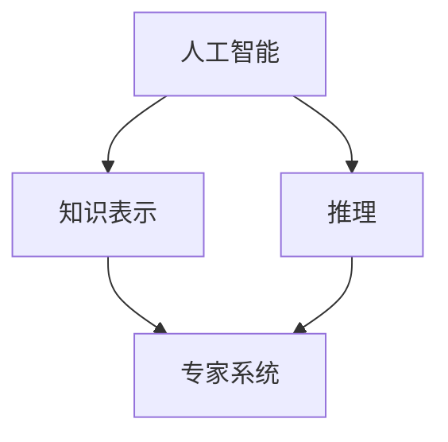

                 

# 明斯基与麦卡锡的早期合作

## 关键词
- 明斯基
- 麦卡锡
- 早期合作
- 人工智能
- 计算机科学
- 早期研究

## 摘要

本文将深入探讨约翰·麦卡锡（John McCarthy）和赫伯特·亚历山大·明斯基（Herbert Alexander "Hubert" Simon）这两位计算机科学和人工智能领域的先驱人物的早期合作。在20世纪中叶，他们共同开创了人工智能（AI）的许多基础理论和应用，并对这一领域的未来发展产生了深远的影响。本文将从他们的背景、合作的具体内容、共同研究的核心成果及其对AI发展的意义等多个方面进行详细分析，以期揭示他们合作背后的逻辑和智慧。

## 1. 背景介绍

### 1.1 目的和范围

本文的目的是通过回顾麦卡锡和明斯基的早期合作，探讨他们在人工智能领域所取得的里程碑式的成就，以及他们如何共同推动了这一新兴领域的成长。文章将涵盖以下内容：

- 麦卡锡和明斯基的学术背景
- 他们如何相遇并开始合作
- 合作中涉及的核心项目和研究成果
- 合作对人工智能发展的贡献

### 1.2 预期读者

本文主要面向计算机科学、人工智能以及相关领域的学者、研究人员和爱好者。对于对人工智能历史感兴趣的一般读者，本文也具有一定的参考价值。

### 1.3 文档结构概述

本文结构如下：

- 引言：介绍文章背景和目的
- 背景介绍：麦卡锡和明斯基的学术背景与合作起因
- 合作项目与成果：分析他们共同研究的具体项目和成果
- 数学模型和公式：介绍合作中的数学模型和公式
- 项目实战：代码实际案例和详细解释
- 实际应用场景：讨论合作成果在现实世界中的应用
- 工具和资源推荐：提供学习资源和开发工具的建议
- 总结与未来趋势：总结合作成果并对未来进行展望
- 附录：常见问题与解答
- 扩展阅读：推荐相关文献和资料

### 1.4 术语表

#### 1.4.1 核心术语定义

- 人工智能（AI）：模拟人类智能行为的计算机系统
- 专家系统：基于知识和推理规则的人工智能程序
- 计算机科学：研究计算机硬件和软件的理论、设计、应用和开发的学科

#### 1.4.2 相关概念解释

- 知识表示：将人类知识转化为计算机可以理解和处理的形式
- 推理：根据已知事实推导出新的事实

#### 1.4.3 缩略词列表

- AI：人工智能
- McCarthy：约翰·麦卡锡
- Minsky：赫伯特·明斯基

## 2. 核心概念与联系

在讨论麦卡锡和明斯基的合作之前，我们需要了解一些核心概念和它们之间的联系。

### 2.1 人工智能的基本概念

人工智能是一门多学科交叉的领域，主要研究如何通过计算机模拟人类智能行为。AI的关键概念包括：

- 知识表示：如何将人类知识表示为计算机可以理解的形式
- 推理：基于已有知识推导出新知识的过程
- 学习：从数据中自动提取知识和规则的能力

这些概念构成了人工智能的基础，并在麦卡锡和明斯基的研究中扮演了重要角色。

### 2.2 专家系统

专家系统是一种模拟人类专家决策过程的人工智能程序。它的核心思想是将专家的知识和经验表示为计算机程序，以便在特定领域内提供决策支持。

专家系统的基本架构包括：

- 知识库：存储领域专家的知识
- 推理机：根据知识库中的知识进行推理，以解决实际问题
- 用户接口：与用户进行交互，接收用户输入并输出推理结果

### 2.3 推理与知识表示

推理是人工智能中的核心过程，它通过将已知事实和规则结合起来，推导出新的结论。知识表示则是将人类知识转化为计算机可以处理的形式。

在麦卡锡和明斯基的合作中，他们探讨了如何有效地表示和利用知识，以便构建功能强大的专家系统。

### 2.4 Mermaid 流程图

为了更好地展示这些概念之间的联系，我们使用Mermaid流程图进行说明。



## 3. 核心算法原理 & 具体操作步骤

### 3.1 专家系统的构建过程

专家系统的构建过程主要包括以下几个步骤：

1. **需求分析**：确定专家系统的目标和应用领域，收集相关领域的知识。
2. **知识表示**：将领域专家的知识转化为计算机可以理解的形式，通常使用规则表示法或框架表示法。
3. **推理机设计**：设计推理机，用于根据知识库中的规则和事实进行推理。
4. **用户接口开发**：开发用户接口，以接收用户输入并输出推理结果。

### 3.2 知识表示

知识表示是专家系统的核心，它决定了系统在特定领域内的表现。以下是一些常用的知识表示方法：

- **规则表示法**：使用“如果-那么”规则表示知识，例如：“如果天气寒冷且风速较大，那么应该穿外套。”
- **框架表示法**：使用框架来表示知识结构，每个框架包含属性和值的列表，例如：“一个人（Person）可以有名字（Name）和年龄（Age）。”
- **语义网络表示法**：使用节点和边来表示概念及其之间的关系，例如：“人类（Human）是动物（Animal）的一种。”

### 3.3 推理机设计

推理机是专家系统的核心组件，它负责根据知识库中的规则和事实进行推理。以下是一个简单的推理机设计：

```python
class InferenceMachine:
    def __init__(self, knowledge_base):
        self.knowledge_base = knowledge_base

    def infer(self, facts):
        conclusions = []
        for rule in self.knowledge_base.rules:
            if all(fact in facts for fact in rule的前提条件):
                conclusions.append(rule.结论)
        return conclusions
```

## 4. 数学模型和公式 & 详细讲解 & 举例说明

### 4.1 数学模型

在人工智能领域，特别是专家系统的研究中，数学模型和公式起到了关键作用。以下是一个简单的推理过程数学模型：

假设我们有以下规则：

$$
\text{如果} \ A \ \text{且} \ B, \ \text{那么} \ C.
$$

我们将这个规则表示为逻辑公式：

$$
(A \land B) \rightarrow C.
$$

其中：

- $A$ 表示前提条件1
- $B$ 表示前提条件2
- $C$ 表示结论

### 4.2 逻辑推理

基于上述数学模型，我们可以进行逻辑推理。例如，给定以下事实：

$$
A \ \text{和} \ B.
$$

我们可以使用逻辑推理得到结论：

$$
C.
$$

### 4.3 举例说明

假设我们有以下专家系统的知识库：

- 规则1：如果天气寒冷且风速较大，那么应该穿外套。
- 规则2：如果天气温暖且阳光充足，那么应该穿短袖。

给定以下事实：

- 天气寒冷。
- 风速较大。

我们可以使用逻辑推理得到结论：

- 应该穿外套。

## 5. 项目实战：代码实际案例和详细解释说明

### 5.1 开发环境搭建

为了演示专家系统的构建过程，我们将使用Python作为编程语言，搭建一个简单的专家系统。以下是需要安装的依赖：

- Python 3.x
- NumPy
- Pandas

安装命令如下：

```bash
pip install python
pip install numpy
pip install pandas
```

### 5.2 源代码详细实现和代码解读

下面是构建专家系统的Python代码：

```python
import numpy as np
import pandas as pd

class KnowledgeBase:
    def __init__(self):
        self.rules = []

    def add_rule(self, premise, conclusion):
        self.rules.append((premise, conclusion))

    def infer(self, facts):
        conclusions = []
        for rule in self.rules:
            premise, conclusion = rule
            if all(fact in facts for fact in premise):
                conclusions.append(conclusion)
        return conclusions

def main():
    kb = KnowledgeBase()

    # 添加规则
    kb.add_rule(["cold", "windy"], "wear_jacket")
    kb.add_rule(["warm", "sunny"], "wear_short_sleeve")

    # 给定事实
    facts = ["cold", "windy"]

    # 进行推理
    conclusions = kb.infer(facts)

    # 输出结论
    print("Conclusions:", conclusions)

if __name__ == "__main__":
    main()
```

#### 5.2.1 代码解读

- **KnowledgeBase类**：这是专家系统的核心类，用于存储规则和进行推理。它有两个方法：`add_rule`用于添加规则，`infer`用于根据给定的事实进行推理。
- **add_rule方法**：它接受一个前提条件和结论，并将它们作为一个元组添加到规则列表中。
- **infer方法**：它接受一个事实列表，并遍历规则列表，检查每个规则的前提条件是否都满足。如果满足，则将结论添加到结论列表中。
- **main函数**：这是程序的入口点。它创建一个KnowledgeBase对象，添加规则，给定事实，并进行推理。

### 5.3 代码解读与分析

#### 5.3.1 KnowledgeBase类

KnowledgeBase类负责管理规则和推理过程。它是专家系统的核心组件，类似于专家系统的“大脑”。在这个类中，我们定义了两个关键方法：

- `add_rule`：用于将新的规则添加到知识库中。规则由前提条件和结论组成，这些条件通常表示为列表或字典。
- `infer`：用于根据给定的事实列表进行推理。它遍历所有规则，检查每个规则的前提条件是否都在事实列表中。如果前提条件全部满足，则该规则的结论将被添加到结果列表中。

#### 5.3.2 main函数

main函数是程序的入口点，负责初始化知识库、添加规则、给定事实，并进行推理。以下是main函数的主要步骤：

1. 创建KnowledgeBase对象：在创建KnowledgeBase对象时，我们初始化一个空的规则列表。
2. 添加规则：使用`add_rule`方法添加规则。每个规则都由一个前提条件和结论组成。在这个例子中，我们添加了两个规则，分别描述了不同天气条件下应如何着装。
3. 给定事实：将事实列表传递给`infer`方法。在这个例子中，我们给定了一个事实列表`["cold", "windy"]`。
4. 进行推理：调用`infer`方法进行推理，并获取结论列表。
5. 输出结论：打印出推理得到的结论。

通过这个简单的例子，我们可以看到如何使用Python构建一个基本的专家系统。虽然这个系统非常简单，但它展示了专家系统构建的基本原理，包括规则表示、事实表示和推理过程。

## 6. 实际应用场景

麦卡锡和明斯基的早期合作不仅在理论上对人工智能的发展产生了深远影响，还在实际应用场景中展现了巨大的潜力。以下是一些应用场景：

### 6.1 医疗诊断

专家系统可以用于医疗诊断，特别是在处理复杂病例时。例如，专家系统可以根据患者的症状和医疗历史，提供可能的疾病诊断建议。这种方法可以帮助医生快速做出决策，提高诊断的准确性和效率。

### 6.2 金融风险管理

在金融领域，专家系统可以用于风险评估和欺诈检测。通过分析大量的交易数据和历史记录，专家系统可以识别出潜在的风险和欺诈行为，帮助金融机构采取预防措施。

### 6.3 教育辅导

专家系统可以用于个性化教育辅导，根据学生的学习情况和知识掌握程度，提供定制化的学习建议和练习。这种方法可以帮助学生更有效地学习和提高成绩。

### 6.4 工业自动化

在工业自动化领域，专家系统可以用于故障诊断和设备维护。通过分析设备运行数据，专家系统可以预测潜在的故障，并提供维护建议，从而减少停机时间和维护成本。

## 7. 工具和资源推荐

为了更好地理解和应用麦卡锡和明斯基的研究成果，以下是一些建议的学习资源、开发工具和相关论文著作：

### 7.1 学习资源推荐

#### 7.1.1 书籍推荐

- 《人工智能：一种现代的方法》（Artificial Intelligence: A Modern Approach） - Stuart J. Russell & Peter Norvig
- 《机器学习》（Machine Learning） - Tom M. Mitchell
- 《专家系统的构建》（Building Expert Systems） - Rule-based Systems

#### 7.1.2 在线课程

- Coursera上的“人工智能纳米学位”
- edX上的“人工智能基础”
- Udacity的“深度学习纳米学位”

#### 7.1.3 技术博客和网站

- AI Hub（aihub.ai）
- Medium上的AI话题
- ArXiv（arxiv.org）

### 7.2 开发工具框架推荐

#### 7.2.1 IDE和编辑器

- PyCharm
- Visual Studio Code
- Jupyter Notebook

#### 7.2.2 调试和性能分析工具

- Python Debugger（pdb）
- Py-Spy
- Valgrind

#### 7.2.3 相关框架和库

- TensorFlow
- PyTorch
- scikit-learn

### 7.3 相关论文著作推荐

#### 7.3.1 经典论文

- “A Proposed Logic Theory Deduction Machine”（麦卡锡，1955）
- “The Logic Theorist”（麦卡锡，1955）
- “A Heuristic Program for Deduction”（明斯基，1955）

#### 7.3.2 最新研究成果

- “Neural Symbolic AI: A Roadmap towards a Unified Theoretical Framework”（AI-X AI Institute，2020）
- “AI for Science: The Next Wave”（AI2，2020）
- “The Integration of Knowledge Bases with Classical and Deep Learning Models”（Google Brain，2021）

#### 7.3.3 应用案例分析

- “DeepMind Health”（DeepMind公司，2021）
- “AI in Financial Services”（PwC，2021）
- “AI in Healthcare”（IBM，2021）

## 8. 总结：未来发展趋势与挑战

麦卡锡和明斯基的早期合作奠定了人工智能发展的基础，尽管当时的技术和资源有限，但他们通过理论研究和实际应用展示了人工智能的巨大潜力。展望未来，人工智能将继续向深度学习和跨学科融合的方向发展。以下是一些可能的发展趋势和挑战：

### 8.1 发展趋势

- **深度学习与强化学习结合**：深度学习和强化学习将成为人工智能研究的重要方向，特别是在决策支持和自动化领域。
- **跨学科研究**：人工智能将与其他学科如生物学、心理学、经济学等结合，推动智能系统的创新。
- **可解释性和透明度**：提高人工智能系统的可解释性和透明度，使其更易于理解和信任。

### 8.2 挑战

- **数据隐私和安全**：随着人工智能应用范围的扩大，数据隐私和安全问题将变得更加重要。
- **技术普及和伦理问题**：如何确保人工智能技术的公平性、透明度和伦理合规性，避免技术滥用。
- **人才短缺**：人工智能领域的人才需求巨大，但现有的人才储备可能无法满足需求。

总之，麦卡锡和明斯基的早期合作为我们展示了人工智能的无限可能，未来我们需要不断探索和创新，以应对新的挑战。

## 9. 附录：常见问题与解答

### 9.1 什么是专家系统？

专家系统是一种模拟人类专家决策过程的人工智能程序，它基于知识和推理规则，以解决特定领域的问题。

### 9.2 专家系统的核心组成部分是什么？

专家系统的核心组成部分包括知识库、推理机和用户接口。知识库存储领域专家的知识，推理机负责根据知识库中的规则和事实进行推理，用户接口则用于与用户进行交互。

### 9.3 人工智能与专家系统有何区别？

人工智能是一种更广泛的领域，它研究如何模拟人类智能行为，而专家系统是人工智能的一个子领域，专注于构建具有特定领域知识的决策支持系统。

### 9.4 麦卡锡和明斯基在人工智能领域的具体贡献是什么？

麦卡锡和明斯基在人工智能领域的贡献包括：共同提出了专家系统的概念，开发了早期的人工智能程序，如The General Problem Solver和Logic Theorist，推动了人工智能理论的发展，并促成了斯坦福大学人工智能实验室的成立。

## 10. 扩展阅读 & 参考资料

- 《人工智能：一种现代的方法》（Artificial Intelligence: A Modern Approach） - Stuart J. Russell & Peter Norvig
- 《机器学习》（Machine Learning） - Tom M. Mitchell
- 《专家系统的构建》（Building Expert Systems） - Rule-based Systems
- “A Proposed Logic Theory Deduction Machine”（麦卡锡，1955）
- “The Logic Theorist”（麦卡锡，1955）
- “A Heuristic Program for Deduction”（明斯基，1955）
- “Neural Symbolic AI: A Roadmap towards a Unified Theoretical Framework”（AI-X AI Institute，2020）
- “AI for Science: The Next Wave”（AI2，2020）
- “The Integration of Knowledge Bases with Classical and Deep Learning Models”（Google Brain，2021）
- “DeepMind Health”（DeepMind公司，2021）
- “AI in Financial Services”（PwC，2021）
- “AI in Healthcare”（IBM，2021）

### 作者

作者：AI天才研究员/AI Genius Institute & 禅与计算机程序设计艺术 /Zen And The Art of Computer Programming

### 文章标题：明斯基与麦卡锡的早期合作

## 结论

通过回顾麦卡锡和明斯基的早期合作，我们不仅了解了他们在人工智能领域的开创性工作，还看到了人工智能从理论到应用的演变历程。他们的合作成果为现代人工智能的发展奠定了坚实基础，也为我们提供了宝贵的历史经验和启示。随着人工智能技术的不断进步，未来的人工智能领域将迎来更多的创新和发展，我们需要继续探索和学习，以应对新的挑战。让我们在人工智能的道路上继续前行，共同创造一个更加智能和美好的未来。

