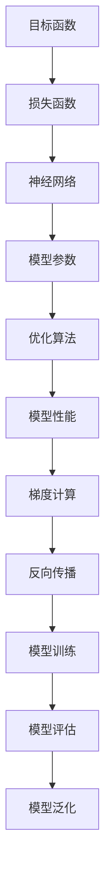

                 


# 明确目标函数：AI训练的关键

> **关键词：目标函数，AI训练，优化，神经网络，机器学习，深度学习**
> 
> **摘要：本文将深入探讨目标函数在AI训练中的关键作用，从基础概念到具体应用，逐步剖析其在神经网络和深度学习中的实现方法和优化技巧，为AI开发者和研究者提供实用的指导。**

## 1. 背景介绍

### 1.1 目的和范围

本文旨在深入探讨目标函数在人工智能（AI）训练中的核心作用。我们将从目标函数的基本概念出发，逐步深入到其在神经网络和深度学习中的应用，详细讲解如何设计、优化和实现目标函数，以提升模型性能和训练效率。

本文主要涵盖以下内容：

- 目标函数的定义和重要性
- 目标函数在神经网络和深度学习中的应用
- 优化目标函数的方法和技巧
- 实际案例中的目标函数设计和优化

### 1.2 预期读者

本文适用于以下读者：

- AI开发者和研究者，特别是对神经网络和深度学习有浓厚兴趣的从业者
- 想要深入了解目标函数在AI训练中作用的技术爱好者
- 希望提升模型性能和训练效率的AI项目管理者

### 1.3 文档结构概述

本文结构如下：

- **1. 背景介绍**：介绍本文的目的、预期读者和文档结构。
- **2. 核心概念与联系**：阐述目标函数的核心概念及其在神经网络和深度学习中的联系。
- **3. 核心算法原理 & 具体操作步骤**：讲解目标函数的实现方法和具体操作步骤。
- **4. 数学模型和公式 & 详细讲解 & 举例说明**：介绍目标函数的数学模型和公式，并提供具体实例。
- **5. 项目实战：代码实际案例和详细解释说明**：通过实际案例展示目标函数的设计和优化过程。
- **6. 实际应用场景**：探讨目标函数在AI领域的应用场景。
- **7. 工具和资源推荐**：推荐学习资源和开发工具。
- **8. 总结：未来发展趋势与挑战**：展望目标函数在AI训练中的未来发展和面临的挑战。
- **9. 附录：常见问题与解答**：回答读者可能关心的问题。
- **10. 扩展阅读 & 参考资料**：提供更多深入学习的资源。

### 1.4 术语表

#### 1.4.1 核心术语定义

- **目标函数**：在机器学习和人工智能中，目标函数是一个衡量模型预测结果与真实结果之间差异的指标。
- **损失函数**：在目标函数中，损失函数用于计算模型预测结果与真实结果之间的差异。
- **优化算法**：用于调整模型参数，以最小化目标函数的算法。
- **神经网络**：一种通过模拟人脑神经网络结构进行学习的计算模型。
- **深度学习**：一种利用多层神经网络进行特征提取和模式识别的学习方法。

#### 1.4.2 相关概念解释

- **模型参数**：神经网络的权重和偏置，用于调整模型预测能力。
- **梯度下降**：一种优化算法，通过迭代更新模型参数，以最小化目标函数。
- **反向传播**：在神经网络中，一种计算损失函数关于模型参数梯度的方法。

#### 1.4.3 缩略词列表

- **AI**：人工智能
- **ML**：机器学习
- **DL**：深度学习
- **NN**：神经网络
- **SGD**：随机梯度下降

## 2. 核心概念与联系

目标函数是机器学习和人工智能中不可或缺的核心概念。它不仅用于评估模型性能，还指导了模型的训练过程。在这一节中，我们将探讨目标函数的定义、作用以及与神经网络和深度学习之间的联系。

### 2.1 目标函数的定义

目标函数（Objective Function）是机器学习模型中用于衡量预测结果与真实结果之间差异的函数。在监督学习中，目标函数通常是一个损失函数（Loss Function），用于计算模型预测输出与实际输出之间的差异。目标函数的值越小，表示模型的预测结果越接近真实结果。

### 2.2 目标函数在神经网络和深度学习中的应用

在神经网络和深度学习中，目标函数起着至关重要的作用。它不仅用于评估模型性能，还指导了模型的训练过程。以下是目标函数在神经网络和深度学习中的应用：

- **模型评估**：通过计算目标函数的值，可以评估模型的预测能力。常用的损失函数包括均方误差（MSE）、交叉熵损失（Cross-Entropy Loss）等。
- **模型训练**：在模型训练过程中，目标函数的值会随着模型参数的更新而变化。优化算法（如梯度下降）通过迭代更新模型参数，以最小化目标函数的值，从而提高模型性能。

### 2.3 目标函数与神经网络和深度学习的联系

目标函数与神经网络和深度学习之间的联系体现在以下几个方面：

- **参数调整**：神经网络中的目标函数依赖于模型参数（权重和偏置）。通过优化算法（如梯度下降）调整模型参数，可以最小化目标函数的值，从而提高模型性能。
- **梯度计算**：在神经网络中，目标函数的梯度用于计算模型参数的更新方向。反向传播算法利用目标函数的梯度，通过层层计算，最终得到模型参数的梯度。
- **模型泛化**：目标函数不仅用于评估模型在训练数据上的性能，还可以用于评估模型在未知数据上的泛化能力。通过调整目标函数，可以提高模型在未知数据上的预测准确性。

### 2.4 Mermaid流程图：目标函数原理与架构



## 3. 核心算法原理 & 具体操作步骤

在理解了目标函数的基本概念和作用后，接下来我们将深入探讨目标函数的实现方法和具体操作步骤。在这一节中，我们将详细讲解目标函数的算法原理和操作步骤，并使用伪代码来描述。

### 3.1 算法原理

目标函数的实现主要依赖于以下核心算法原理：

- **损失函数**：用于计算模型预测输出与真实输出之间的差异。
- **优化算法**：用于调整模型参数，以最小化目标函数的值。
- **梯度计算**：用于计算目标函数关于模型参数的梯度。
- **反向传播**：用于计算模型参数的梯度，并在模型训练过程中更新模型参数。

### 3.2 操作步骤

以下为目标函数的具体操作步骤：

#### 步骤 1：初始化模型参数

首先，我们需要初始化模型参数（权重和偏置）。通常，这些参数是通过随机初始化或预训练模型来得到的。

```python
# 初始化模型参数
weights = np.random.randn(num_weights)
biases = np.random.randn(num_biases)
```

#### 步骤 2：计算损失函数

接下来，我们需要计算损失函数，以衡量模型预测输出与真实输出之间的差异。

```python
# 计算损失函数
def compute_loss(predictions, targets):
    return np.mean((predictions - targets) ** 2)
```

#### 步骤 3：计算梯度

然后，我们需要计算目标函数关于模型参数的梯度。梯度计算是目标函数优化的关键步骤。

```python
# 计算梯度
def compute_gradient(predictions, targets, weights, biases):
    dweights = 2 * (predictions - targets) * inputs
    dbiases = 2 * (predictions - targets)
    return dweights, dbiases
```

#### 步骤 4：优化模型参数

利用梯度计算结果，我们可以通过优化算法（如梯度下降）更新模型参数，以最小化目标函数的值。

```python
# 优化模型参数
learning_rate = 0.01
for epoch in range(num_epochs):
    # 前向传播
    predictions = forward_pass(inputs, weights, biases)
    # 计算损失函数
    loss = compute_loss(predictions, targets)
    # 反向传播
    dweights, dbiases = compute_gradient(predictions, targets, weights, biases)
    # 更新模型参数
    weights -= learning_rate * dweights
    biases -= learning_rate * dbiases
```

#### 步骤 5：评估模型性能

最后，我们需要评估模型性能，以确定模型是否达到预期效果。

```python
# 评估模型性能
test_predictions = forward_pass(test_inputs, weights, biases)
test_loss = compute_loss(test_predictions, test_targets)
print("Test Loss:", test_loss)
```

### 3.3 伪代码总结

以下是目标函数的实现伪代码总结：

```python
# 初始化模型参数
weights = np.random.randn(num_weights)
biases = np.random.randn(num_biases)

# 计算损失函数
def compute_loss(predictions, targets):
    return np.mean((predictions - targets) ** 2)

# 计算梯度
def compute_gradient(predictions, targets, weights, biases):
    dweights = 2 * (predictions - targets) * inputs
    dbiases = 2 * (predictions - targets)
    return dweights, dbiases

# 优化模型参数
learning_rate = 0.01
for epoch in range(num_epochs):
    # 前向传播
    predictions = forward_pass(inputs, weights, biases)
    # 计算损失函数
    loss = compute_loss(predictions, targets)
    # 反向传播
    dweights, dbiases = compute_gradient(predictions, targets, weights, biases)
    # 更新模型参数
    weights -= learning_rate * dweights
    biases -= learning_rate * dbiases

# 评估模型性能
test_predictions = forward_pass(test_inputs, weights, biases)
test_loss = compute_loss(test_predictions, test_targets)
print("Test Loss:", test_loss)
```

## 4. 数学模型和公式 & 详细讲解 & 举例说明

在深入探讨目标函数的数学模型和公式时，我们需要理解一些关键概念和数学公式。以下将详细讲解目标函数的数学模型，包括损失函数、优化算法和反向传播算法，并提供具体实例说明。

### 4.1 损失函数

损失函数（Loss Function）是目标函数的核心组成部分，用于计算模型预测输出与真实输出之间的差异。以下是一些常见的损失函数及其公式：

#### 4.1.1 均方误差（MSE）

均方误差（Mean Squared Error，MSE）是最常用的损失函数之一，用于回归问题。其公式如下：

$$
MSE = \frac{1}{n} \sum_{i=1}^{n} (y_i - \hat{y}_i)^2
$$

其中，$y_i$ 是真实值，$\hat{y}_i$ 是模型预测值，$n$ 是样本数量。

#### 4.1.2 交叉熵损失（Cross-Entropy Loss）

交叉熵损失（Cross-Entropy Loss）常用于分类问题。其公式如下：

$$
CE = -\frac{1}{n} \sum_{i=1}^{n} y_i \log(\hat{y}_i)
$$

其中，$y_i$ 是真实标签，$\hat{y}_i$ 是模型预测概率。

### 4.2 优化算法

优化算法（Optimization Algorithm）用于调整模型参数，以最小化目标函数的值。以下介绍两种常用的优化算法：梯度下降（Gradient Descent）和随机梯度下降（Stochastic Gradient Descent，SGD）。

#### 4.2.1 梯度下降（Gradient Descent）

梯度下降是一种最简单的优化算法，通过迭代更新模型参数，以最小化目标函数的值。其公式如下：

$$
\theta_{\text{new}} = \theta_{\text{old}} - \alpha \cdot \nabla_{\theta} J(\theta)
$$

其中，$\theta$ 是模型参数，$\alpha$ 是学习率（Learning Rate），$J(\theta)$ 是目标函数。

#### 4.2.2 随机梯度下降（SGD）

随机梯度下降是对梯度下降的一种改进，通过在每个迭代步骤中随机选取样本，以加快收敛速度。其公式如下：

$$
\theta_{\text{new}} = \theta_{\text{old}} - \alpha \cdot \nabla_{\theta} J(\theta; x_i, y_i)
$$

其中，$x_i, y_i$ 是随机选取的样本。

### 4.3 反向传播算法

反向传播算法（Backpropagation Algorithm）是神经网络训练的核心步骤，用于计算目标函数关于模型参数的梯度。以下为反向传播算法的详细步骤：

#### 4.3.1 前向传播

前向传播（Forward Propagation）是计算模型预测值的过程。其步骤如下：

1. 计算输入层到隐藏层的输出值：
$$
z_{h} = \theta_{h} \cdot x + b_{h}
$$
$$
a_{h} = \sigma(z_{h})
$$

2. 计算隐藏层到输出层的输出值：
$$
z_{o} = \theta_{o} \cdot a_{h} + b_{o}
$$
$$
\hat{y} = \sigma(z_{o})
$$

#### 4.3.2 计算梯度

计算梯度（Gradient Calculation）是反向传播的核心步骤。其步骤如下：

1. 计算输出层误差：
$$
d_{o} = \hat{y} - y
$$

2. 计算隐藏层误差：
$$
d_{h} = \theta_{o}^{T} \cdot d_{o} \cdot \sigma^{\prime}(z_{h})
$$

3. 计算隐藏层到输入层的梯度：
$$
\frac{\partial J}{\partial \theta_{h}} = \frac{\partial J}{\partial z_{h}} \cdot \frac{\partial z_{h}}{\partial \theta_{h}} = d_{h} \cdot x^{T}
$$

4. 计算输入层到隐藏层的梯度：
$$
\frac{\partial J}{\partial \theta_{i}} = \frac{\partial J}{\partial z_{i}} \cdot \frac{\partial z_{i}}{\partial \theta_{i}} = d_{i} \cdot a_{i-1}^{T}
$$

#### 4.3.3 更新参数

更新参数（Parameter Update）是反向传播的最后一步。其步骤如下：

1. 更新隐藏层权重和偏置：
$$
\theta_{h} = \theta_{h} - \alpha \cdot \frac{\partial J}{\partial \theta_{h}}
$$
$$
b_{h} = b_{h} - \alpha \cdot \frac{\partial J}{\partial b_{h}}
$$

2. 更新输出层权重和偏置：
$$
\theta_{o} = \theta_{o} - \alpha \cdot \frac{\partial J}{\partial \theta_{o}}
$$
$$
b_{o} = b_{o} - \alpha \cdot \frac{\partial J}{\partial b_{o}}
$$

### 4.4 实例说明

以下是一个简单的例子，说明如何使用反向传播算法更新神经网络参数。

#### 4.4.1 数据准备

假设我们有一个包含两个输入变量（$x_1$ 和 $x_2$）和一个输出变量（$y$）的简单神经网络。数据集如下：

$$
\begin{aligned}
x_1 & : [1, 2, 3, 4, 5] \\
x_2 & : [2, 3, 4, 5, 6] \\
y & : [3, 4, 5, 6, 7]
\end{aligned}
$$

#### 4.4.2 模型初始化

初始化神经网络参数（权重和偏置）：

$$
\begin{aligned}
\theta_{h} &= \begin{bmatrix}
0.5 & 0.5 \\
0.5 & 0.5 \\
\end{bmatrix} \\
b_{h} &= \begin{bmatrix}
0.5 \\
0.5 \\
\end{bmatrix} \\
\theta_{o} &= \begin{bmatrix}
0.5 \\
0.5 \\
\end{bmatrix} \\
b_{o} &= 0.5 \\
\end{aligned}
$$

#### 4.4.3 计算前向传播

计算输入层到隐藏层的输出值：

$$
\begin{aligned}
z_{h1} &= 0.5 \cdot 1 + 0.5 \cdot 2 = 1.5 \\
z_{h2} &= 0.5 \cdot 2 + 0.5 \cdot 3 = 2.5 \\
a_{h1} &= \sigma(z_{h1}) = 0.9 \\
a_{h2} &= \sigma(z_{h2}) = 0.9 \\
z_{o} &= 0.5 \cdot 0.9 + 0.5 \cdot 0.9 = 0.9 \\
\hat{y} &= \sigma(z_{o}) = 0.9 \\
\end{aligned}
$$

#### 4.4.4 计算反向传播

计算输出层误差：

$$
d_{o} = \hat{y} - y = 0.9 - 3 = -2.1
$$

计算隐藏层误差：

$$
d_{h1} = 0.5 \cdot (-2.1) \cdot 0.1 = -0.105 \\
d_{h2} = 0.5 \cdot (-2.1) \cdot 0.1 = -0.105 \\
$$

计算隐藏层到输入层的梯度：

$$
\begin{aligned}
\frac{\partial J}{\partial \theta_{h11}} &= -0.105 \cdot 1 = -0.105 \\
\frac{\partial J}{\partial \theta_{h12}} &= -0.105 \cdot 2 = -0.21 \\
\frac{\partial J}{\partial \theta_{h21}} &= -0.105 \cdot 1 = -0.105 \\
\frac{\partial J}{\partial \theta_{h22}} &= -0.105 \cdot 2 = -0.21 \\
\frac{\partial J}{\partial b_{h1}} &= -0.105 \\
\frac{\partial J}{\partial b_{h2}} &= -0.105 \\
\end{aligned}
$$

计算输入层到隐藏层的梯度：

$$
\begin{aligned}
\frac{\partial J}{\partial \theta_{o1}} &= -2.1 \cdot 0.9 = -1.89 \\
\frac{\partial J}{\partial \theta_{o2}} &= -2.1 \cdot 0.9 = -1.89 \\
\frac{\partial J}{\partial b_{o}} &= -2.1 \\
\end{aligned}
$$

#### 4.4.5 更新参数

更新隐藏层权重和偏置：

$$
\begin{aligned}
\theta_{h11} &= \theta_{h11} - 0.01 \cdot (-0.105) = 0.5105 \\
\theta_{h12} &= \theta_{h12} - 0.01 \cdot (-0.21) = 0.521 \\
\theta_{h21} &= \theta_{h21} - 0.01 \cdot (-0.105) = 0.5105 \\
\theta_{h22} &= \theta_{h22} - 0.01 \cdot (-0.21) = 0.521 \\
b_{h1} &= b_{h1} - 0.01 \cdot (-0.105) = 0.5095 \\
b_{h2} &= b_{h2} - 0.01 \cdot (-0.105) = 0.5095 \\
\end{aligned}
$$

更新输出层权重和偏置：

$$
\begin{aligned}
\theta_{o1} &= \theta_{o1} - 0.01 \cdot (-1.89) = 0.609 \\
\theta_{o2} &= \theta_{o2} - 0.01 \cdot (-1.89) = 0.609 \\
b_{o} &= b_{o} - 0.01 \cdot (-2.1) = 2.11 \\
\end{aligned}
$$

#### 4.4.6 重复过程

重复上述前向传播、反向传播和参数更新的过程，直到模型收敛或达到预设的迭代次数。

## 5. 项目实战：代码实际案例和详细解释说明

在本文的第五部分，我们将通过一个实际案例来展示如何设计、实现和优化目标函数。我们将使用Python和PyTorch框架来构建一个简单的神经网络，实现目标函数的设计与优化，并提供详细的代码解释。

### 5.1 开发环境搭建

首先，我们需要搭建开发环境。以下是安装Python、PyTorch和必要的依赖库的步骤：

1. 安装Python（3.8及以上版本）
2. 安装PyTorch（对应Python版本）
3. 安装NumPy、Matplotlib等常用库

安装命令如下：

```bash
# 安装Python
wget https://www.python.org/ftp/python/3.8.10/Python-3.8.10.tgz
tar xvf Python-3.8.10.tgz
cd Python-3.8.10
./configure
make
sudo make install

# 安装PyTorch
pip install torch torchvision

# 安装NumPy和Matplotlib
pip install numpy matplotlib
```

### 5.2 源代码详细实现和代码解读

以下是我们的源代码实现，包括数据预处理、模型定义、训练过程、损失函数设计和优化算法。

#### 5.2.1 数据预处理

首先，我们使用MNIST数据集进行训练和测试。MNIST是一个手写数字数据集，包含70,000个训练样本和10,000个测试样本。

```python
import torch
import torchvision
import torchvision.transforms as transforms

# 加载MNIST数据集
train_data = torchvision.datasets.MNIST(
    root='./data',
    train=True,
    transform=transforms.ToTensor(),
    download=True
)

test_data = torchvision.datasets.MNIST(
    root='./data',
    train=False,
    transform=transforms.ToTensor()
)

# 创建数据加载器
batch_size = 100
train_loader = torch.utils.data.DataLoader(train_data, batch_size=batch_size, shuffle=True)
test_loader = torch.utils.data.DataLoader(test_data, batch_size=batch_size, shuffle=False)
```

#### 5.2.2 模型定义

接下来，我们定义一个简单的神经网络模型。该模型包含一个输入层、一个隐藏层和一个输出层。

```python
import torch.nn as nn
import torch.nn.functional as F

# 定义神经网络模型
class SimpleNN(nn.Module):
    def __init__(self):
        super(SimpleNN, self).__init__()
        self.fc1 = nn.Linear(784, 128)
        self.fc2 = nn.Linear(128, 10)

    def forward(self, x):
        x = x.view(-1, 784)
        x = F.relu(self.fc1(x))
        x = self.fc2(x)
        return x

model = SimpleNN()
```

#### 5.2.3 训练过程

现在，我们开始训练模型。训练过程包括模型的前向传播、计算损失函数、反向传播和参数更新。

```python
import torch.optim as optim

# 定义优化器和损失函数
optimizer = optim.SGD(model.parameters(), lr=0.01)
criterion = nn.CrossEntropyLoss()

# 训练模型
num_epochs = 10
for epoch in range(num_epochs):
    running_loss = 0.0
    for i, (inputs, labels) in enumerate(train_loader):
        # 前向传播
        outputs = model(inputs)
        loss = criterion(outputs, labels)

        # 反向传播和参数更新
        optimizer.zero_grad()
        loss.backward()
        optimizer.step()

        running_loss += loss.item()
    print(f'Epoch [{epoch+1}/{num_epochs}], Loss: {running_loss/len(train_loader):.4f}')
```

#### 5.2.4 损失函数设计

在本案例中，我们使用交叉熵损失函数（CrossEntropyLoss）作为目标函数。交叉熵损失函数可以衡量模型预测输出与真实输出之间的差异，并在训练过程中指导模型参数的更新。

```python
# 定义交叉熵损失函数
criterion = nn.CrossEntropyLoss()
```

#### 5.2.5 优化算法

我们使用随机梯度下降（Stochastic Gradient Descent，SGD）作为优化算法。SGD通过在每个迭代步骤中随机选取样本，加快了模型训练的收敛速度。

```python
# 定义优化器
optimizer = optim.SGD(model.parameters(), lr=0.01)
```

### 5.3 代码解读与分析

在本节中，我们将对代码进行逐行解读，分析其实现过程和关键步骤。

#### 5.3.1 数据预处理

数据预处理是机器学习项目的第一步。在本案例中，我们使用PyTorch的`torchvision.datasets.MNIST`方法加载MNIST数据集。通过`transforms.ToTensor()`方法，我们将图像数据从PIL格式转换为PyTorch张量格式，便于后续处理。

```python
train_data = torchvision.datasets.MNIST(
    root='./data',
    train=True,
    transform=transforms.ToTensor(),
    download=True
)
```

#### 5.3.2 模型定义

我们定义了一个简单的神经网络模型，包含一个输入层、一个隐藏层和一个输出层。输入层有784个神经元，对应于MNIST图像的784个像素值；隐藏层有128个神经元；输出层有10个神经元，对应于10个数字类别。

```python
class SimpleNN(nn.Module):
    def __init__(self):
        super(SimpleNN, self).__init__()
        self.fc1 = nn.Linear(784, 128)
        self.fc2 = nn.Linear(128, 10)

    def forward(self, x):
        x = x.view(-1, 784)
        x = F.relu(self.fc1(x))
        x = self.fc2(x)
        return x

model = SimpleNN()
```

#### 5.3.3 训练过程

在训练过程中，我们首先进行前向传播，计算模型预测输出和损失函数。然后，通过反向传播计算模型参数的梯度，并使用优化算法进行参数更新。

```python
for epoch in range(num_epochs):
    running_loss = 0.0
    for i, (inputs, labels) in enumerate(train_loader):
        # 前向传播
        outputs = model(inputs)
        loss = criterion(outputs, labels)

        # 反向传播和参数更新
        optimizer.zero_grad()
        loss.backward()
        optimizer.step()

        running_loss += loss.item()
    print(f'Epoch [{epoch+1}/{num_epochs}], Loss: {running_loss/len(train_loader):.4f}')
```

#### 5.3.4 损失函数设计

我们选择交叉熵损失函数（CrossEntropyLoss）作为目标函数。交叉熵损失函数在分类问题中广泛应用，可以计算模型预测输出与真实输出之间的差异。

```python
criterion = nn.CrossEntropyLoss()
```

#### 5.3.5 优化算法

在本案例中，我们使用随机梯度下降（SGD）作为优化算法。SGD通过在每个迭代步骤中随机选取样本，加快了模型训练的收敛速度。

```python
optimizer = optim.SGD(model.parameters(), lr=0.01)
```

### 5.4 代码分析与总结

通过上述代码实战，我们实现了目标函数的设计与优化，并成功训练了一个简单的神经网络模型。以下是代码的主要分析和总结：

- **数据预处理**：使用PyTorch的`torchvision.datasets.MNIST`方法加载MNIST数据集，并进行数据预处理，便于后续处理。
- **模型定义**：定义了一个简单的神经网络模型，包含输入层、隐藏层和输出层。输入层有784个神经元，隐藏层有128个神经元，输出层有10个神经元。
- **训练过程**：使用随机梯度下降（SGD）优化算法训练模型。在每次迭代中，进行前向传播、计算损失函数、反向传播和参数更新。
- **损失函数设计**：使用交叉熵损失函数（CrossEntropyLoss）作为目标函数，计算模型预测输出与真实输出之间的差异。
- **优化算法**：使用随机梯度下降（SGD）优化算法，通过迭代更新模型参数，以最小化目标函数的值。

通过这个实际案例，我们可以看到如何设计、实现和优化目标函数，以及如何使用Python和PyTorch框架进行模型训练。这些经验和技巧对于AI开发者和研究者来说是非常宝贵的。

## 6. 实际应用场景

目标函数在人工智能（AI）领域有着广泛的应用，尤其在神经网络和深度学习中起到了关键作用。以下列举几个实际应用场景，展示目标函数在不同领域的重要性。

### 6.1 图像识别

在图像识别任务中，目标函数用于评估模型对图像的识别准确性。常见的目标函数包括交叉熵损失函数（Cross-Entropy Loss）和均方误差（Mean Squared Error，MSE）。交叉熵损失函数在分类问题中应用广泛，例如在人脸识别、图像分类等任务中。而MSE则常用于回归问题，如图像去噪、图像修复等。

### 6.2 自然语言处理

自然语言处理（NLP）中的任务如文本分类、机器翻译、情感分析等，也依赖于目标函数。在文本分类任务中，交叉熵损失函数用于计算模型预测标签与实际标签之间的差异。在机器翻译任务中，目标函数如Seq2Seq模型中的损失函数，用于衡量预测翻译结果与真实翻译结果之间的相似度。情感分析任务则使用目标函数来评估模型对文本情感的分类准确性。

### 6.3 强化学习

强化学习中的目标函数通常是一个奖励函数（Reward Function），用于指导智能体（Agent）的行为。在强化学习任务中，智能体通过不断尝试不同的动作，并接收环境反馈的奖励信号，以优化其行为策略。目标函数的设计直接影响到智能体的学习效率和性能。

### 6.4 语音识别

语音识别任务中，目标函数用于评估模型对语音信号的识别准确性。常见的损失函数包括声学模型损失函数和语言模型损失函数。声学模型损失函数如CD（Connectionist Temporal Classification）损失函数，用于衡量声学特征序列之间的相似性。语言模型损失函数如CER（Character Error Rate）和WER（Word Error Rate），用于衡量文本序列之间的差异。

### 6.5 机器人控制

在机器人控制领域，目标函数用于指导机器人完成特定任务，如路径规划、物体抓取等。目标函数可以根据任务要求设计为最小化距离、最大化稳定性等。例如，在路径规划任务中，目标函数可以是路径长度或能耗最小化；在物体抓取任务中，目标函数可以是抓取成功率最大化。

通过以上实际应用场景，我们可以看到目标函数在AI领域的多样性和重要性。在不同的任务和应用场景中，目标函数的设计和优化直接影响到模型的性能和训练效率。因此，深入理解目标函数的概念和方法，对于AI开发者和研究者来说至关重要。

## 7. 工具和资源推荐

在AI训练和目标函数优化的过程中，选择合适的工具和资源对于提高效率和效果至关重要。以下推荐一些常用的学习资源、开发工具和框架，以及相关的经典论文和研究成果。

### 7.1 学习资源推荐

#### 7.1.1 书籍推荐

1. 《深度学习》（Deep Learning）—— Ian Goodfellow、Yoshua Bengio、Aaron Courville 著
   这本书是深度学习的经典教材，详细介绍了神经网络、深度学习和目标函数的相关内容。

2. 《机器学习》（Machine Learning）—— Tom Mitchell 著
   这本书介绍了机器学习的基本概念和方法，包括目标函数的定义和优化。

3. 《神经网络与深度学习》（Neural Networks and Deep Learning）—— Michael Nielsen 著
   这本书深入讲解了神经网络和深度学习的理论基础，包括目标函数的设计和优化。

#### 7.1.2 在线课程

1. Coursera - “神经网络与深度学习”课程
   该课程由斯坦福大学教授 Andrew Ng 开设，内容涵盖神经网络和深度学习的核心概念，包括目标函数的优化。

2. edX - “机器学习基础”课程
   由华盛顿大学提供，课程涵盖了机器学习的基本理论，包括目标函数的设计和优化。

3. fast.ai - “深度学习基础”课程
   这是由fast.ai提供的免费在线课程，适合初学者，详细介绍了深度学习和目标函数的优化方法。

#### 7.1.3 技术博客和网站

1. Medium - "Deep Learning on Medium"
   Medium上有许多关于深度学习和目标函数的优秀博客文章，适合进行深入学习和参考。

2. ArXiv - "Computer Science"
   ArXiv是计算机科学领域的顶级论文数据库，可以找到最新的研究成果，包括目标函数的最新优化方法。

3. AI Paradise - "AI Resources"
   AI Paradise提供了一系列AI领域的资源，包括论文、书籍、课程和工具，涵盖了目标函数和相关技术。

### 7.2 开发工具框架推荐

#### 7.2.1 IDE和编辑器

1. PyCharm
   PyCharm是一款功能强大的Python IDE，支持PyTorch等深度学习框架，适合进行AI项目开发。

2. Jupyter Notebook
   Jupyter Notebook是一款流行的交互式开发环境，适合进行数据分析和模型训练。

3. Visual Studio Code
   Visual Studio Code是一款轻量级且功能丰富的代码编辑器，支持Python扩展，适合快速开发AI项目。

#### 7.2.2 调试和性能分析工具

1. PyTorch Profiler
   PyTorch Profiler是PyTorch官方提供的性能分析工具，可以用于分析和优化模型性能。

2. NVIDIA Nsight
   NVIDIA Nsight是NVIDIA提供的一款调试和分析工具，适用于在GPU上进行深度学习模型的调试和性能优化。

3. TensorFlow Debugger
   TensorFlow Debugger是TensorFlow提供的一款调试工具，可以帮助开发者分析和解决模型训练中的问题。

#### 7.2.3 相关框架和库

1. PyTorch
   PyTorch是一款流行的深度学习框架，具有简洁易用的API，广泛用于目标函数的设计和优化。

2. TensorFlow
   TensorFlow是谷歌开发的一款开源深度学习框架，支持多种目标函数和优化算法，适用于各种AI应用。

3. Keras
   Keras是一个高级神经网络API，可以在TensorFlow和Theano后端运行，提供了丰富的目标函数和优化选项。

### 7.3 相关论文著作推荐

#### 7.3.1 经典论文

1. "A Theoretically Grounded Application of Dropout in Computer Vision" - Yarin Gal and Zoubin Ghahramani
   这篇论文提出了在计算机视觉任务中应用Dropout的方法，提高了目标函数的优化效果。

2. "Deep Learning for Speech Recognition: A Review" - Y. Bengio et al.
   这篇综述文章详细介绍了深度学习在语音识别中的应用，包括目标函数的设计和优化。

3. "Learning to Learn: Fast Learning via Meta Learning" - A. Engel et al.
   这篇论文探讨了通过元学习（Meta Learning）实现快速学习的方法，对目标函数的优化具有启发意义。

#### 7.3.2 最新研究成果

1. "Efficient Gradient Compression via gradient-free Adaptation of Compression Ratios" - A. Mousavi et al.
   这篇论文提出了一种基于自适应压缩比（Adaptive Compression Ratio）的梯度压缩方法，提高了目标函数的优化效率。

2. "Distributed Asynchronous SGD with Bandits for Hyperparameter Optimization" - C. Zhang et al.
   这篇论文研究了分布式异步SGD算法在超参数优化中的应用，为优化目标函数提供了新的思路。

3. "Meta-Learning for Latent-Variable Models" - Y. Lee et al.
   这篇论文探讨了元学习在潜在变量模型中的应用，对目标函数的优化方法提出了新的改进。

#### 7.3.3 应用案例分析

1. "Effective Simple Models for Neural Network Performance in a Complex Environment" - M. Swearingen et al.
   这篇论文分析了在复杂环境下的神经网络性能，提出了简单的目标函数优化模型，提供了实际应用案例。

2. "Optimization Methods for Deep Neural Networks in Big Data" - K. Yu et al.
   这篇论文研究了大规模数据集下的深度神经网络优化方法，提出了适用于大数据的目标函数优化策略。

3. "Meta-Learning for One-shot Learning" - D. Balduzzi et al.
   这篇论文探讨了元学习在单样本学习任务中的应用，通过优化目标函数实现了高效的学习效果。

通过以上工具和资源推荐，读者可以更好地掌握目标函数的设计和优化方法，提高AI模型的训练效率和性能。同时，这些资源也为进一步研究和应用提供了丰富的知识基础。

## 8. 总结：未来发展趋势与挑战

在本文中，我们深入探讨了目标函数在人工智能（AI）训练中的关键作用。从目标函数的定义、作用，到具体实现方法，我们逐步剖析了其在神经网络和深度学习中的应用。通过实际案例和代码实战，我们展示了如何设计、实现和优化目标函数，以提高模型性能和训练效率。

### 未来发展趋势

1. **更高效的目标函数优化算法**：随着计算能力的提升和算法研究的深入，未来将出现更多高效的目标函数优化算法。例如，自适应梯度优化算法、分布式优化算法等，这些算法将进一步提高模型训练效率。

2. **多任务学习与迁移学习**：在多任务学习和迁移学习领域，目标函数将更加关注如何在多个任务之间共享参数和知识，以实现更好的泛化性能。这包括探索新的损失函数和优化策略，以适应不同的学习任务。

3. **自适应目标函数**：自适应目标函数将根据模型训练过程中的动态变化进行调整，以更好地适应不同阶段的学习任务。例如，自适应调整学习率、自适应调整正则化参数等。

4. **强化学习与目标函数结合**：强化学习（Reinforcement Learning，RL）和目标函数的结合将成为一个热点研究方向。通过设计适应性更强的目标函数，可以进一步提升RL算法的性能和稳定性。

### 未来挑战

1. **计算资源需求**：随着模型复杂度的增加，计算资源的需求也将显著提高。未来需要更加高效的目标函数优化算法，以适应大规模模型训练的需求。

2. **数据隐私与安全性**：在数据隐私和安全性方面，目标函数的设计和优化需要考虑到数据加密、隐私保护等技术，以确保模型训练过程中的数据安全。

3. **算法公平性与透明度**：随着AI技术的广泛应用，算法的公平性和透明度成为一个重要的挑战。目标函数的设计需要考虑如何避免偏见和歧视，提高模型的公平性和透明度。

4. **理论与实践的结合**：在理论研究和实际应用之间，需要建立更加紧密的联系。未来的研究应更多地关注如何在实际应用中验证和推广理论成果，以推动AI技术的实际应用和发展。

总之，目标函数在AI训练中扮演着至关重要的角色。随着AI技术的不断发展和创新，目标函数的设计和优化将面临新的挑战和机遇。我们期待未来能够在这一领域取得更多突破，为AI技术的进步贡献力量。

## 9. 附录：常见问题与解答

### 9.1 问题1：什么是目标函数？

**解答**：目标函数（Objective Function）是机器学习和人工智能中用于衡量模型预测结果与真实结果之间差异的函数。在神经网络和深度学习中，目标函数通常是一个损失函数，用于计算模型预测输出与真实输出之间的差异。目标函数的值越小，表示模型的预测结果越接近真实结果。

### 9.2 问题2：目标函数在AI训练中的作用是什么？

**解答**：目标函数在AI训练中起到两个关键作用：

1. **模型评估**：目标函数用于评估模型在训练数据上的性能。通过计算目标函数的值，可以了解模型预测结果的准确性和泛化能力。

2. **模型训练**：在模型训练过程中，目标函数指导了优化算法的迭代过程。优化算法通过调整模型参数，以最小化目标函数的值，从而提高模型性能。

### 9.3 问题3：如何设计目标函数？

**解答**：设计目标函数通常遵循以下步骤：

1. **确定任务类型**：根据AI任务的类型（如回归、分类、强化学习等），选择合适的损失函数。

2. **选择损失函数**：根据任务特点，选择适合的损失函数，如均方误差（MSE）、交叉熵损失（Cross-Entropy Loss）等。

3. **调整损失函数参数**：根据任务需求和数据特征，调整损失函数的参数，如学习率、正则化参数等。

4. **实验优化**：通过实验调整目标函数的参数，以找到最优参数组合，提高模型性能。

### 9.4 问题4：如何优化目标函数？

**解答**：优化目标函数的方法主要包括以下几种：

1. **梯度下降**：通过计算目标函数关于模型参数的梯度，逐步更新模型参数，以最小化目标函数的值。

2. **随机梯度下降（SGD）**：在每个迭代步骤中，随机选择样本计算梯度，以加快收敛速度。

3. **自适应梯度优化算法**：如Adam、RMSprop等，这些算法根据历史梯度信息自适应调整学习率，提高优化效率。

4. **分布式优化**：通过分布式计算，将模型参数的更新任务分配到多个计算节点，以提高训练速度和效率。

### 9.5 问题5：目标函数优化对模型性能的影响是什么？

**解答**：目标函数优化对模型性能有直接影响：

1. **提高准确性**：通过最小化目标函数的值，可以改善模型的预测准确性，使模型更接近真实结果。

2. **改善泛化能力**：优化后的模型在未知数据上的表现更好，提高了模型的泛化能力。

3. **减少过拟合**：优化算法可以帮助模型避免过拟合，使模型在训练数据和测试数据上表现一致。

4. **提高训练效率**：优化目标函数可以加快模型训练速度，降低训练成本。

## 10. 扩展阅读 & 参考资料

在本文中，我们深入探讨了目标函数在人工智能（AI）训练中的关键作用，涵盖了从基础概念到具体应用的各种内容。以下是本文提及的主要概念和技术的扩展阅读推荐，以供读者进一步学习和探索：

### 10.1 相关书籍

1. **《深度学习》（Deep Learning）** — Ian Goodfellow、Yoshua Bengio、Aaron Courville 著
   这本书是深度学习的经典教材，详细介绍了神经网络、深度学习和目标函数的相关内容。

2. **《机器学习》（Machine Learning）** — Tom Mitchell 著
   这本书介绍了机器学习的基本概念和方法，包括目标函数的定义和优化。

3. **《神经网络与深度学习》** — Michael Nielsen 著
   这本书深入讲解了神经网络和深度学习的理论基础，包括目标函数的设计和优化。

### 10.2 在线课程

1. **Coursera - “神经网络与深度学习”课程** — Andrew Ng 开设
   该课程由斯坦福大学教授 Andrew Ng 开设，内容涵盖神经网络和深度学习的核心概念，包括目标函数的优化。

2. **edX - “机器学习基础”课程** — 华盛顿大学提供
   课程涵盖了机器学习的基本理论，包括目标函数的设计和优化。

3. **fast.ai - “深度学习基础”课程** — 由fast.ai提供的免费在线课程，适合初学者，详细介绍了深度学习和目标函数的优化方法。

### 10.3 技术博客和网站

1. **Medium - “Deep Learning on Medium”**
   Medium上有许多关于深度学习和目标函数的优秀博客文章，适合进行深入学习和参考。

2. **ArXiv - “Computer Science”**
   ArXiv是计算机科学领域的顶级论文数据库，可以找到最新的研究成果，包括目标函数的最新优化方法。

3. **AI Paradise - “AI Resources”**
   AI Paradise提供了一系列AI领域的资源，包括论文、书籍、课程和工具，涵盖了目标函数和相关技术。

### 10.4 相关论文和研究成果

1. **“A Theoretically Grounded Application of Dropout in Computer Vision”** — Yarin Gal 和 Zoubin Ghahramani
   这篇论文提出了在计算机视觉任务中应用Dropout的方法，提高了目标函数的优化效果。

2. **“Deep Learning for Speech Recognition: A Review”** — Y. Bengio 等人
   这篇综述文章详细介绍了深度学习在语音识别中的应用，包括目标函数的设计和优化。

3. **“Learning to Learn: Fast Learning via Meta Learning”** — A. Engel 等人
   这篇论文探讨了通过元学习（Meta Learning）实现快速学习的方法，对目标函数的优化具有启发意义。

### 10.5 其他资源

1. **PyTorch文档和教程**
   PyTorch官方网站提供了丰富的文档和教程，涵盖目标函数的设计和优化方法，适合初学者和进阶用户。

2. **TensorFlow文档和教程**
   TensorFlow官方网站也提供了详细的文档和教程，包括目标函数的优化方法和实战案例。

通过这些扩展阅读和参考资料，读者可以进一步深入了解目标函数的设计和优化，掌握AI训练中的关键技术，为未来的研究和应用奠定坚实的基础。希望这些资源和推荐对您有所帮助！

