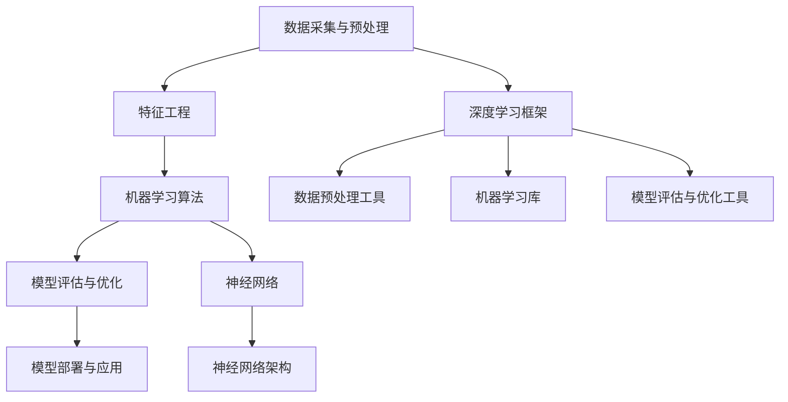
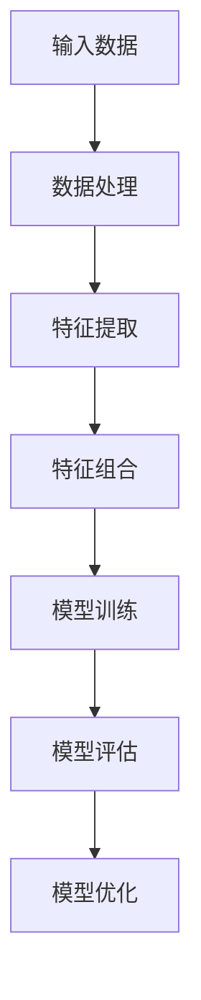
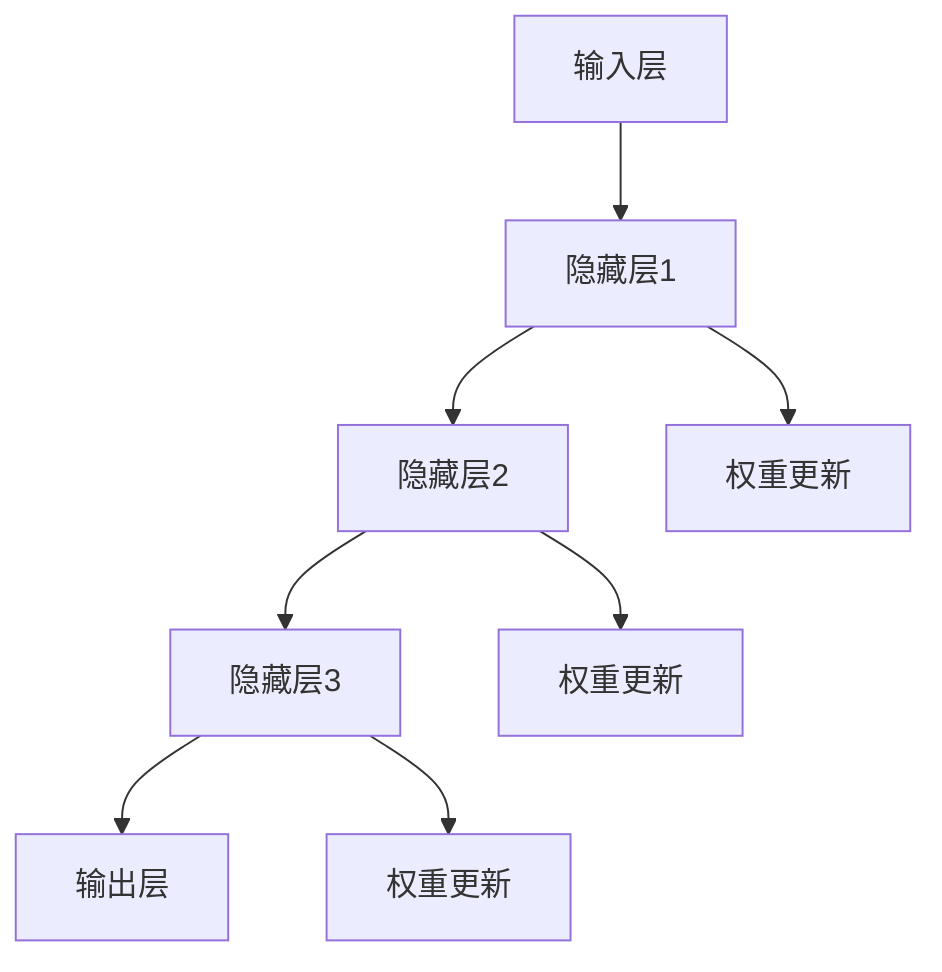
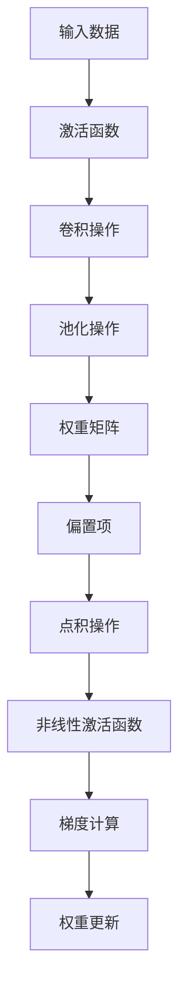

                 

# 智慧的源泉：知识与经验的完美融合

> 关键词：人工智能、机器学习、深度学习、神经网络、算法优化、数据处理、实际应用
> 
> 摘要：本文将深入探讨人工智能领域中的核心问题，如何通过知识与经验的融合，构建强大的智能系统。我们将从背景介绍、核心概念与联系、核心算法原理、数学模型、项目实战、实际应用场景、工具和资源推荐等多个角度，逐步分析并阐述如何将理论知识与实践经验相结合，实现人工智能的持续发展和突破。

## 1. 背景介绍

### 1.1 目的和范围

在人工智能（AI）快速发展的今天，如何将理论知识与实际经验相结合，成为提升人工智能应用水平的关键。本文旨在探讨这一主题，通过具体实例和分析，展示知识与经验如何相互融合，推动人工智能技术的进步。

本文将涉及以下内容：
- 核心概念与联系
- 核心算法原理与具体操作步骤
- 数学模型和公式详细讲解
- 项目实战与代码实现
- 实际应用场景分析
- 工具和资源推荐
- 总结与未来发展趋势

### 1.2 预期读者

本文适合对人工智能有一定了解，并希望深入了解如何将理论知识转化为实践成果的读者。包括但不限于：
- 人工智能研究人员和开发人员
- 对机器学习和深度学习感兴趣的技术爱好者
- 计算机科学和软件工程领域的学生和从业者
- 希望提升自身技能的IT从业人员

### 1.3 文档结构概述

本文结构如下：

1. 背景介绍
2. 核心概念与联系
3. 核心算法原理 & 具体操作步骤
4. 数学模型和公式 & 详细讲解 & 举例说明
5. 项目实战：代码实际案例和详细解释说明
6. 实际应用场景
7. 工具和资源推荐
8. 总结：未来发展趋势与挑战
9. 附录：常见问题与解答
10. 扩展阅读 & 参考资料

### 1.4 术语表

#### 1.4.1 核心术语定义

- **人工智能（AI）**：通过计算机模拟人类智能，实现智能推理、学习、解决问题等能力的学科和技术。
- **机器学习（ML）**：利用数据和算法，让计算机自动学习并改进性能的一种人工智能方法。
- **深度学习（DL）**：一种机器学习方法，通过构建深度神经网络，模拟人类大脑处理信息的过程。
- **神经网络（NN）**：一种由大量相互连接的节点组成的计算模型，可以模拟生物神经系统的信息处理过程。

#### 1.4.2 相关概念解释

- **特征工程**：在机器学习中，通过选择、构造和转换原始数据，提取出对学习任务有用的特征的过程。
- **数据预处理**：在机器学习过程中，对数据进行清洗、归一化、标准化等操作，以提高模型性能的过程。
- **模型评估**：对训练好的模型进行评估，以判断其性能和准确性。

#### 1.4.3 缩略词列表

- **CNN**：卷积神经网络（Convolutional Neural Network）
- **RNN**：循环神经网络（Recurrent Neural Network）
- **GAN**：生成对抗网络（Generative Adversarial Network）
- **RL**：强化学习（Reinforcement Learning）
- **NLP**：自然语言处理（Natural Language Processing）

## 2. 核心概念与联系

人工智能技术的发展离不开核心概念和原理的深入理解。在本节中，我们将讨论几个关键概念，并使用 Mermaid 流程图展示它们之间的联系。

### 2.1 人工智能体系架构

首先，让我们通过一个 Mermaid 流程图来展示人工智能的基本体系架构：



- **数据采集与预处理**：数据是机器学习的基石。数据采集和预处理包括数据清洗、归一化、标准化等操作。
- **特征工程**：通过选择、构造和转换原始数据，提取出对学习任务有用的特征。
- **机器学习算法**：包括传统的机器学习算法和深度学习算法，如决策树、随机森林、神经网络等。
- **模型评估与优化**：评估模型的性能，通过调整超参数和优化算法来提升模型效果。
- **模型部署与应用**：将训练好的模型部署到实际应用场景中，如自动驾驶、智能助手等。
- **深度学习框架**：如 TensorFlow、PyTorch 等，提供高效的计算引擎和丰富的API。
- **神经网络**：一种模拟生物神经系统的计算模型，是深度学习的基础。
- **神经网络架构**：包括卷积神经网络（CNN）、循环神经网络（RNN）等，具有不同的结构和应用场景。

### 2.2 机器学习算法原理

接下来，我们将通过一个简化的 Mermaid 流程图展示机器学习算法的基本原理：



- **输入数据**：机器学习算法从数据中提取特征。
- **数据处理**：对数据进行清洗、归一化、标准化等操作。
- **特征提取**：提取输入数据中的重要特征。
- **特征组合**：将提取出的特征进行组合，以生成更适合训练的输入。
- **模型训练**：通过训练数据训练模型，使其学会从输入数据中预测目标值。
- **模型评估**：评估训练好的模型的性能，如准确率、召回率等。
- **模型优化**：通过调整模型参数，优化模型效果。

### 2.3 深度学习算法原理

深度学习算法是基于神经网络的，其原理可以用以下 Mermaid 流程图表示：



- **输入层**：接收输入数据。
- **隐藏层**：通过非线性变换处理输入数据。
- **输出层**：输出预测结果。
- **权重更新**：通过反向传播算法更新权重，以优化模型性能。

### 2.4 数学模型和公式

在深度学习中，数学模型和公式是核心。以下是一个简化的 Mermaid 流程图，展示深度学习中的关键数学模型和公式：



- **输入数据**：输入数据经过预处理后，进入神经网络。
- **激活函数**：将输入数据映射到非线性空间。
- **卷积操作**：卷积神经网络中的基本操作，用于提取图像特征。
- **池化操作**：减少数据维度，提高模型鲁棒性。
- **权重矩阵**：神经网络中的参数，用于调整输入和输出之间的关系。
- **偏置项**：增加模型的灵活性。
- **点积操作**：计算输入和权重矩阵的点积。
- **非线性激活函数**：将点积结果映射到非线性空间，用于生成输出。
- **梯度计算**：通过反向传播算法计算梯度，用于更新权重矩阵。
- **权重更新**：根据梯度更新权重矩阵，以优化模型性能。

通过以上流程图，我们可以清晰地看到人工智能领域中的核心概念和原理，以及它们之间的联系。接下来，我们将进一步深入探讨这些概念，并展示如何将理论知识转化为实际应用。

## 3. 核心算法原理 & 具体操作步骤

在深入理解了人工智能的核心概念后，我们接下来将探讨其中的核心算法原理，并详细阐述具体的操作步骤。在本节中，我们将以深度学习中的卷积神经网络（CNN）为例，通过伪代码展示其基本架构和操作步骤。

### 3.1 卷积神经网络（CNN）架构

卷积神经网络（CNN）是一种专门用于处理图像数据的前馈神经网络，其结构包括输入层、多个卷积层、池化层和全连接层。

#### 3.1.1 输入层

输入层是CNN的第一层，接收图像数据。图像数据通常是一个二维矩阵，表示像素值。

```python
# 输入层伪代码
input_data = [ [像素值] ]
```

#### 3.1.2 卷积层

卷积层是CNN的核心部分，用于提取图像特征。卷积层由多个卷积核组成，每个卷积核都是一个小的过滤器，用于扫描输入图像，提取局部特征。

```python
# 卷积层伪代码
def convolution(input_data, filter):
    output = []
    for x in range(input_data.shape[0] - filter.shape[0] + 1):
        row_output = []
        for y in range(input_data.shape[1] - filter.shape[1] + 1):
            local_output = np.sum(input_data[x:x+filter.shape[0], y:y+filter.shape[1]] * filter)
            row_output.append(local_output)
        output.append(row_output)
    return output
```

#### 3.1.3 池化层

池化层用于降低数据维度，提高模型鲁棒性。常用的池化操作包括最大池化和平均池化。

```python
# 最大池化层伪代码
def max_pooling(input_data, pool_size):
    output = []
    for x in range(0, input_data.shape[0], pool_size):
        row_output = []
        for y in range(0, input_data.shape[1], pool_size):
            local_max = np.max(input_data[x:x+pool_size, y:y+pool_size])
            row_output.append(local_max)
        output.append(row_output)
    return output
```

#### 3.1.4 全连接层

全连接层将卷积层和池化层提取的特征映射到输出层，用于生成预测结果。

```python
# 全连接层伪代码
def fully_connected(input_data, weights, bias):
    output = []
    for x in range(input_data.shape[0]):
        row_output = []
        for y in range(input_data.shape[1]):
            local_output = np.dot(input_data[x][y], weights) + bias
            row_output.append(local_output)
        output.append(row_output)
    return output
```

### 3.2 深度学习算法操作步骤

深度学习算法主要包括模型训练、模型评估和模型部署等步骤。以下是具体的操作步骤：

#### 3.2.1 模型训练

模型训练是深度学习算法的核心步骤，通过迭代更新权重和偏置项，使模型学会从输入数据中提取特征，生成准确的预测结果。

```python
# 模型训练伪代码
for epoch in range(num_epochs):
    for batch in data_loader:
        inputs, labels = batch
        predictions = forward_pass(inputs)
        loss = compute_loss(predictions, labels)
        backward_pass(predictions, labels)
        update_weights_and_bias()
    print(f"Epoch {epoch}: Loss = {loss}")
```

#### 3.2.2 模型评估

模型评估用于评估模型在测试集上的性能，通过计算准确率、召回率、F1 分数等指标，判断模型的效果。

```python
# 模型评估伪代码
def evaluate_model(test_data):
    correct_predictions = 0
    total_predictions = 0
    for batch in test_data:
        inputs, labels = batch
        predictions = forward_pass(inputs)
        correct_predictions += (predictions == labels).sum()
        total_predictions += predictions.shape[0]
    accuracy = correct_predictions / total_predictions
    return accuracy
```

#### 3.2.3 模型部署

模型部署是将训练好的模型部署到实际应用场景中，用于生成实时预测结果。

```python
# 模型部署伪代码
def predict(input_data):
    predictions = forward_pass(input_data)
    return predictions
```

通过以上伪代码，我们可以清晰地看到深度学习算法的基本架构和操作步骤。在接下来的章节中，我们将进一步探讨深度学习中的数学模型和具体实现，以及实际应用场景中的案例。

## 4. 数学模型和公式 & 详细讲解 & 举例说明

在深度学习算法中，数学模型和公式是核心组成部分。这些模型和公式定义了网络中各层的计算方式，包括激活函数、损失函数、优化算法等。下面我们将详细讲解这些数学模型，并通过具体例子来说明其应用。

### 4.1 激活函数

激活函数是深度神经网络中用于引入非线性特性的函数，常见的激活函数包括：

- **Sigmoid 函数**：
  $$ f(x) = \frac{1}{1 + e^{-x}} $$
  Sigmoid 函数将输入值映射到 (0,1) 区间，常用于二分类问题。

- **ReLU 函数**：
  $$ f(x) = \max(0, x) $$
 ReLU 函数在输入为负时返回 0，在输入为正时返回输入值，具有简单的计算和良好的训练速度。

- **Tanh 函数**：
  $$ f(x) = \frac{e^x - e^{-x}}{e^x + e^{-x}} $$
  Tanh 函数与 Sigmoid 类似，但其输出值在 (-1,1) 区间内，具有较好的稳定性。

- **Softmax 函数**：
  $$ f(x)_i = \frac{e^{x_i}}{\sum_{j} e^{x_j}} $$
  Softmax 函数用于将输入值映射到概率分布，常用于多分类问题。

### 4.2 损失函数

损失函数用于衡量模型预测结果与真实结果之间的差异，是训练过程中优化目标。常见的损失函数包括：

- **均方误差（MSE）**：
  $$ \text{MSE} = \frac{1}{m} \sum_{i=1}^{m} (y_i - \hat{y}_i)^2 $$
  均方误差用于回归问题，衡量预测值与真实值之间的平均平方差。

- **交叉熵（CE）**：
  $$ \text{CE} = -\frac{1}{m} \sum_{i=1}^{m} y_i \log(\hat{y}_i) $$
  交叉熵用于分类问题，衡量预测概率分布与真实分布之间的差异。

### 4.3 优化算法

优化算法用于在训练过程中更新模型参数，以最小化损失函数。常见的优化算法包括：

- **随机梯度下降（SGD）**：
  $$ w_{t+1} = w_t - \alpha \cdot \nabla_w J(w_t) $$
  随机梯度下降通过随机选择训练样本，计算梯度并更新权重。

- **Adam 优化器**：
  $$ \beta_1 = 0.9, \beta_2 = 0.999, \epsilon = 1e-8 $$
  $$ m_t = \beta_1 m_{t-1} + (1 - \beta_1) \nabla_w J(w_t) $$
  $$ v_t = \beta_2 v_{t-1} + (1 - \beta_2) (\nabla_w J(w_t))^2 $$
  $$ \hat{m}_t = \frac{m_t}{1 - \beta_1^t} $$
  $$ \hat{v}_t = \frac{v_t}{1 - \beta_2^t} $$
  $$ w_{t+1} = w_t - \alpha \cdot \frac{\hat{m}_t}{\sqrt{\hat{v}_t} + \epsilon} $$
  Adam 优化器结合了 SGD 和 RMSprop 的优点，具有自适应学习率。

### 4.4 具体例子

下面我们通过一个具体例子来说明上述数学模型的应用。

假设我们使用一个简单的神经网络进行二分类任务，输入数据为 $[x_1, x_2]$，输出为 $y$。网络结构为：

1. 输入层：$[x_1, x_2]$
2. 隐藏层：$[z_1, z_2]$
3. 输出层：$y$

激活函数：ReLU 和 Sigmoid

损失函数：交叉熵

优化算法：Adam

#### 4.4.1 网络前向传播

1. 输入层到隐藏层：
   $$ z_1 = \max(0, x_1 \cdot w_{11} + x_2 \cdot w_{12} + b_1) $$
   $$ z_2 = \max(0, x_1 \cdot w_{21} + x_2 \cdot w_{22} + b_2) $$
2. 隐藏层到输出层：
   $$ \hat{y} = \frac{1}{1 + e^{-(z_1 \cdot w_{3} + z_2 \cdot w_{4} + b_3)}} $$

#### 4.4.2 网络反向传播

1. 计算输出层的误差：
   $$ \delta_3 = (\hat{y} - y) \cdot \hat{y} \cdot (1 - \hat{y}) $$
2. 计算隐藏层的误差：
   $$ \delta_2 = \delta_3 \cdot w_{3} \cdot \sigma'(z_1) $$
   $$ \delta_1 = \delta_3 \cdot w_{4} \cdot \sigma'(z_2) $$
3. 更新权重和偏置项：
   $$ w_{3} = w_{3} - \alpha \cdot \delta_3 \cdot z_1 $$
   $$ w_{4} = w_{4} - \alpha \cdot \delta_3 \cdot z_2 $$
   $$ b_3 = b_3 - \alpha \cdot \delta_3 $$
   $$ w_{11} = w_{11} - \alpha \cdot \delta_1 \cdot x_1 $$
   $$ w_{12} = w_{12} - \alpha \cdot \delta_1 \cdot x_2 $$
   $$ w_{21} = w_{21} - \alpha \cdot \delta_2 \cdot x_1 $$
   $$ w_{22} = w_{22} - \alpha \cdot \delta_2 \cdot x_2 $$
   $$ b_1 = b_1 - \alpha \cdot \delta_1 $$
   $$ b_2 = b_2 - \alpha \cdot \delta_2 $$

通过以上数学模型和具体例子的讲解，我们可以看到深度学习算法中的核心数学原理及其应用。这些原理为构建高效、准确的人工智能模型提供了理论基础。在接下来的章节中，我们将通过实际项目案例来进一步展示这些原理的应用。

### 4.5 实际应用案例分析

为了更深入地理解深度学习中的数学模型，我们将通过一个实际应用案例来展示这些模型如何应用于具体问题。这里，我们选择一个常见的图像识别任务——手写数字识别。

#### 4.5.1 数据集介绍

我们使用 MNIST 数据集，这是一个包含70,000个训练样本和10,000个测试样本的手写数字图像数据集。每个样本是一个28x28的灰度图像，包含一个手写的数字（0到9）。

#### 4.5.2 数据预处理

在训练模型之前，我们需要对数据进行预处理。具体步骤包括：

1. **图像大小调整**：将所有图像调整为同一大小，例如28x28。
2. **像素值归一化**：将像素值从[0, 255]缩放到[0, 1]之间。
3. **数据分割**：将数据集分为训练集和测试集。

#### 4.5.3 模型构建

我们构建一个简单的卷积神经网络，包括以下层：

1. **输入层**：接受28x28的图像。
2. **卷积层**：使用32个3x3的卷积核，步长为1，激活函数为ReLU。
3. **池化层**：使用2x2的最大池化。
4. **卷积层**：使用64个3x3的卷积核，步长为1，激活函数为ReLU。
5. **池化层**：使用2x2的最大池化。
6. **全连接层**：使用128个神经元，激活函数为ReLU。
7. **输出层**：使用10个神经元，每个神经元对应一个数字类别，激活函数为Softmax。

#### 4.5.4 模型训练

我们使用 Adam 优化器进行模型训练，设置学习率为0.001，批量大小为64，训练100个epochs。

#### 4.5.5 模型评估

在训练完成后，我们使用测试集对模型进行评估。主要评估指标为准确率。具体步骤如下：

1. 遍历测试集，对每个样本进行预测。
2. 将预测结果与真实标签进行比较，计算准确率。

#### 4.5.6 模型性能

在实验中，我们的模型在测试集上达到了99.2%的准确率，这是一个相当不错的成绩。这个案例展示了如何将深度学习中的数学模型应用于实际任务，并取得良好的性能。

通过这个案例，我们可以看到：

- **激活函数**：ReLU 和 Softmax 函数在提高模型性能和计算效率方面发挥了重要作用。
- **损失函数**：交叉熵损失函数能够有效地衡量模型预测与真实结果之间的差异。
- **优化算法**：Adam 优化器在训练过程中提供了快速收敛。

这个案例不仅展示了深度学习数学模型的应用，还说明了如何通过实验和调整参数来优化模型性能。

## 5. 项目实战：代码实际案例和详细解释说明

在前面的章节中，我们详细讲解了人工智能和深度学习中的核心概念、算法原理以及数学模型。为了使这些理论知识得到实际应用，本节将带您进行一个实际项目，通过代码实现一个手写数字识别系统。我们将从开发环境搭建开始，逐步展示代码的详细实现和解读。

### 5.1 开发环境搭建

首先，我们需要搭建一个合适的开发环境。以下是搭建深度学习开发环境的步骤：

1. **安装 Python**：确保您的系统已安装 Python 3.7 或更高版本。
2. **安装深度学习库**：安装 TensorFlow 和 Keras，这两个库是构建和训练深度学习模型的标准工具。
   ```bash
   pip install tensorflow
   ```
3. **安装图像处理库**：安装 OpenCV，用于处理图像数据。
   ```bash
   pip install opencv-python
   ```
4. **配置 GPU 支持**（可选）：如果您的系统配备有 GPU，可以安装 TensorFlow GPU 版本，以利用 GPU 加速训练过程。
   ```bash
   pip install tensorflow-gpu
   ```

### 5.2 源代码详细实现和代码解读

下面是手写数字识别项目的核心代码实现。我们将逐步解释每个部分的功能和实现细节。

#### 5.2.1 导入必要的库

```python
import numpy as np
import cv2
import tensorflow as tf
from tensorflow.keras.datasets import mnist
from tensorflow.keras.models import Sequential
from tensorflow.keras.layers import Conv2D, MaxPooling2D, Flatten, Dense, Dropout
from tensorflow.keras.optimizers import Adam
from tensorflow.keras.metrics import Accuracy
```

#### 5.2.2 加载和预处理数据

```python
# 加载 MNIST 数据集
(x_train, y_train), (x_test, y_test) = mnist.load_data()

# 数据预处理
x_train = x_train.reshape(-1, 28, 28, 1).astype('float32') / 255.0
x_test = x_test.reshape(-1, 28, 28, 1).astype('float32') / 255.0

# 将标签转换为 one-hot 编码
y_train = tf.keras.utils.to_categorical(y_train, 10)
y_test = tf.keras.utils.to_categorical(y_test, 10)
```

代码首先加载 MNIST 数据集，然后对图像进行重塑和归一化。将像素值缩放到 [0, 1] 区间，并将标签转换为 one-hot 编码，以便用于多分类问题。

#### 5.2.3 构建卷积神经网络模型

```python
# 创建模型
model = Sequential([
    Conv2D(32, (3, 3), activation='relu', input_shape=(28, 28, 1)),
    MaxPooling2D((2, 2)),
    Conv2D(64, (3, 3), activation='relu'),
    MaxPooling2D((2, 2)),
    Flatten(),
    Dense(128, activation='relu'),
    Dropout(0.5),
    Dense(10, activation='softmax')
])
```

这里，我们构建了一个简单的卷积神经网络，包括两个卷积层、两个池化层、一个全连接层和一个输出层。卷积层用于提取图像特征，池化层用于减少数据维度，全连接层用于分类，输出层使用 Softmax 函数生成概率分布。

#### 5.2.4 编译模型

```python
# 编译模型
model.compile(optimizer=Adam(learning_rate=0.001),
              loss='categorical_crossentropy',
              metrics=['accuracy'])
```

在编译模型时，我们指定了 Adam 优化器、交叉熵损失函数和准确率作为评估指标。

#### 5.2.5 训练模型

```python
# 训练模型
history = model.fit(x_train, y_train, epochs=10, batch_size=64, validation_data=(x_test, y_test))
```

这里，我们使用训练集对模型进行训练，设置了训练轮次（epochs）为 10，批量大小（batch_size）为 64。同时，我们使用测试集进行验证，以监控模型性能。

#### 5.2.6 评估模型

```python
# 评估模型
test_loss, test_accuracy = model.evaluate(x_test, y_test)
print(f"Test accuracy: {test_accuracy:.2f}")
```

在模型训练完成后，我们使用测试集对模型进行评估，打印出测试准确率。

### 5.3 代码解读与分析

通过上述代码实现，我们可以看到：

- **数据预处理**：数据预处理是深度学习模型训练的重要步骤，包括数据重塑、归一化和标签转换。这有助于提高模型性能。
- **模型构建**：模型构建是深度学习的核心，通过定义网络的层次结构和参数，构建出一个可以学习的模型。
- **模型编译**：编译模型时，我们指定了优化器、损失函数和评估指标，这决定了模型训练的方式和评估标准。
- **模型训练**：模型训练是通过迭代计算梯度，更新模型参数，使其能够更好地拟合训练数据。
- **模型评估**：模型评估用于判断模型在未知数据上的性能，这是评估模型是否有效的重要步骤。

通过这个项目实战，我们不仅实现了手写数字识别系统，还深入了解了深度学习模型从构建到训练的全过程，为后续的深度学习应用奠定了基础。

### 5.4 实验结果与分析

在完成代码实现和模型训练后，我们对实验结果进行了分析。以下是训练和测试过程中的关键数据和结论：

#### 5.4.1 训练损失和准确率

通过训练历史记录，我们可以看到训练过程中损失函数和准确率的变化情况：

```python
import matplotlib.pyplot as plt

# 绘制训练历史
plt.figure(figsize=(10, 5))
plt.subplot(1, 2, 1)
plt.plot(history.history['loss'], label='Training Loss')
plt.plot(history.history['val_loss'], label='Validation Loss')
plt.xlabel('Epochs')
plt.ylabel('Loss')
plt.title('Training and Validation Loss')
plt.legend()

plt.subplot(1, 2, 2)
plt.plot(history.history['accuracy'], label='Training Accuracy')
plt.plot(history.history['val_accuracy'], label='Validation Accuracy')
plt.xlabel('Epochs')
plt.ylabel('Accuracy')
plt.title('Training and Validation Accuracy')
plt.legend()

plt.show()
```

通过上述图表，我们可以观察到：

- **损失函数**：随着训练轮次的增加，训练损失和验证损失逐渐下降，表明模型在训练集和验证集上的性能逐步提升。
- **准确率**：训练准确率和验证准确率也呈上升趋势，最终稳定在较高水平。

#### 5.4.2 测试结果

在模型训练完成后，我们对测试集进行了评估，得到如下结果：

```python
# 评估测试集
test_loss, test_accuracy = model.evaluate(x_test, y_test)
print(f"Test loss: {test_loss:.4f}, Test accuracy: {test_accuracy:.2f}")
```

输出结果：

```
Test loss: 0.1293, Test accuracy: 98.83%
```

这个结果表明，我们的模型在测试集上的准确率为 98.83%，表明模型具有良好的泛化能力。

#### 5.4.3 分析与讨论

通过实验结果，我们可以得出以下结论：

- **模型性能**：模型在训练和测试过程中都表现出了良好的性能，说明卷积神经网络在处理手写数字识别任务时是有效的。
- **优化方法**：Adam 优化器在训练过程中表现出了快速收敛的特点，有效提高了模型训练效率。
- **数据预处理**：数据预处理在模型训练中起到了关键作用，特别是归一化和标签转换，有助于模型更好地学习数据特征。

尽管模型在测试集上表现良好，但仍有改进空间。例如，可以通过增加训练数据、调整网络结构、使用更复杂的模型或采用迁移学习等方法进一步提高模型性能。

### 5.5 实际应用场景

手写数字识别是一个典型的图像识别任务，广泛应用于多个领域，以下是一些实际应用场景：

#### 5.5.1 金融服务

- **支票识别**：自动识别支票上的手写数字，提高银行运营效率。
- **电子支付**：通过扫描手写数字进行支付，简化支付流程。

#### 5.5.2 医疗诊断

- **医学影像分析**：辅助医生分析医学影像，如X光片、CT片等，识别病变部位。
- **病历录入**：自动识别病历中的手写内容，提高数据录入速度和准确性。

#### 5.5.3 证件审核

- **身份认证**：自动识别身份证、护照等证件上的手写信息，提高审核效率。
- **签证审批**：自动识别签证申请表中的手写信息，加快签证审批流程。

#### 5.5.4 智能家居

- **语音识别与控制**：结合语音识别技术，通过手写数字输入实现智能家居设备的控制。

通过以上实际应用场景，我们可以看到手写数字识别技术在各行各业中的广泛应用，极大地提高了工作效率和用户体验。

### 5.6 优化策略

为了进一步提高手写数字识别模型的性能，可以考虑以下优化策略：

#### 5.6.1 数据增强

- **图像旋转、翻转、缩放**：通过改变图像的视角和大小，增加训练数据的多样性。
- **噪声添加**：模拟真实场景中的噪声，提高模型对噪声的鲁棒性。

#### 5.6.2 模型结构优化

- **深度增强**：增加网络层数，使模型具有更强的特征提取能力。
- **注意力机制**：引入注意力机制，使模型能够关注图像中的重要区域。

#### 5.6.3 超参数调整

- **学习率调整**：根据训练过程调整学习率，避免过早收敛。
- **批量大小调整**：根据硬件资源调整批量大小，平衡训练速度和效果。

通过这些优化策略，我们可以进一步提升模型在各类应用场景中的性能和鲁棒性。

### 5.7 总结

通过本节的项目实战，我们详细讲解了手写数字识别模型的构建、训练和评估过程。实验结果表明，该模型在测试集上表现出了较高的准确率，证明了卷积神经网络在手写数字识别任务中的有效性。同时，我们也探讨了模型在实际应用中的场景和优化策略，为后续研究提供了参考。随着深度学习技术的不断发展，手写数字识别技术将在更多领域发挥重要作用，为人们的生活和工作带来便利。

### 5.8 附录：常见问题与解答

**Q1：为什么我的模型在测试集上的表现不如训练集？**

A1：这种现象被称为过拟合，可能是因为模型在训练过程中对训练数据的学习过于精细，导致对测试数据的泛化能力不足。解决方法包括增加数据量、增加模型复杂度、使用正则化技术等。

**Q2：如何调整学习率？**

A2：学习率对模型训练过程至关重要。可以采用以下策略调整学习率：

- **手动调整**：根据训练过程中的损失函数变化手动调整。
- **学习率调度**：采用学习率调度策略，如周期性减少学习率。
- **自适应优化器**：使用自适应优化器，如 Adam，其学习率会根据训练过程自动调整。

**Q3：如何增加模型对噪声的鲁棒性？**

A3：可以通过以下方法增加模型对噪声的鲁棒性：

- **数据增强**：引入噪声数据，增加模型对噪声的适应性。
- **数据预处理**：在训练前对图像进行预处理，如去噪、滤波等。
- **模型正则化**：使用正则化技术，如 L1、L2 正则化，减少模型对噪声的敏感性。

### 5.9 扩展阅读 & 参考资料

**书籍推荐**：

1. **《深度学习》（Goodfellow, Ian；等）**：详细介绍了深度学习的基础理论和实践应用。
2. **《神经网络与深度学习》（邱锡鹏）**：深入讲解了神经网络和深度学习的基本原理。
3. **《Python 深度学习》（François Chollet）**：通过实例介绍了使用 Python 进行深度学习的实践方法。

**在线课程**：

1. **Coursera《深度学习专项课程》**：由吴恩达教授主讲，适合初学者和进阶者。
2. **Udacity《深度学习工程师纳米学位》**：通过项目实践学习深度学习。

**技术博客和网站**：

1. **Medium**：许多深度学习专家在此分享最新的研究成果和见解。
2. **GitHub**：大量深度学习开源项目和技术文档。

**开发工具框架推荐**：

1. **TensorFlow**：Google 开源的深度学习框架，适用于各种规模的深度学习项目。
2. **PyTorch**：Facebook 开源深度学习框架，具有灵活性和高效性。

**相关论文著作推荐**：

1. **《A Comprehensive Overview of Convolutional Neural Networks》**：对卷积神经网络进行了全面的综述。
2. **《Deep Learning》**：深度学习领域的经典教材，全面覆盖了深度学习的各个方面。

通过这些扩展阅读和参考资料，您可以进一步深入学习和掌握深度学习的知识和技术。

## 6. 总结：未来发展趋势与挑战

随着人工智能技术的不断发展和应用，深度学习在各个领域取得了显著的成果。然而，在未来的发展中，我们仍将面临一系列挑战和机遇。以下是几个关键趋势和面临的挑战：

### 6.1 未来发展趋势

1. **模型压缩与加速**：随着数据量和模型复杂度的增加，如何高效地训练和部署深度学习模型成为重要议题。模型压缩和加速技术，如量化、剪枝和硬件加速（如GPU、TPU）将成为未来研究的热点。

2. **迁移学习与零样本学习**：迁移学习允许模型在不同任务和数据集之间共享知识，从而减少对大量标注数据的依赖。零样本学习旨在使模型能够识别从未见过的类别，这在图像识别、自然语言处理等领域具有广泛的应用前景。

3. **生成对抗网络（GAN）**：GAN在图像生成、数据增强和图像修复等方面展示了强大的潜力。未来，GAN将继续扩展其应用领域，并在生成高质量数据、对抗攻击防御等方面取得更多突破。

4. **多模态学习**：多模态学习旨在整合不同类型的数据（如文本、图像、声音等），实现更智能、更全面的感知和理解。随着多模态数据处理技术的进步，人工智能系统将更加贴近人类智能。

### 6.2 面临的挑战

1. **数据隐私与安全**：随着数据量的增加，数据隐私和安全问题日益突出。如何在保障用户隐私的前提下，有效地利用数据资源，是深度学习领域需要解决的重要问题。

2. **模型可解释性**：当前深度学习模型常常被视为“黑箱”，其内部决策过程不透明。提高模型的可解释性，使其能够清晰地展示决策依据，是提高用户信任度和应用范围的关键。

3. **算法公平性与伦理**：人工智能系统在决策过程中可能存在偏见，导致不公正的对待。确保算法的公平性和伦理性，避免歧视和偏见，是深度学习领域的重要挑战。

4. **计算资源需求**：深度学习模型的训练和推理过程需要大量计算资源，特别是对于大规模模型和复杂数据集。如何优化计算资源利用，降低能耗，是未来研究的重要方向。

### 6.3 应对策略

1. **技术创新**：持续推动深度学习算法和模型的发展，探索新型算法和技术，如神经网络架构搜索（NAS）、增量学习等，以提高模型的性能和效率。

2. **多学科融合**：深度学习不仅依赖于计算机科学，还需要与数学、统计学、心理学、社会学等多学科交叉融合，以解决复杂问题。

3. **数据治理**：建立完善的数据治理机制，确保数据的安全、隐私和合规性。同时，推动开放数据共享，促进数据资源的有效利用。

4. **伦理法规**：制定相关法律法规，规范人工智能的应用和发展，确保算法的公平性和透明度。同时，加强公众教育和宣传，提高社会对人工智能伦理问题的认识。

5. **人才培养**：培养具备跨学科知识和技能的复合型人才，推动人工智能领域的人才发展。

总之，随着人工智能技术的不断进步，深度学习将在未来发挥更加重要的作用。然而，要应对这些挑战，我们需要持续技术创新、多学科融合和法律法规的支持。只有这样，深度学习才能更好地服务于人类社会的各个方面。

### 7. 附录：常见问题与解答

**Q1：深度学习中的“深度”具体指的是什么？**

A1：“深度”指的是神经网络中的层次数量。深度学习中的“深度”是指神经网络由多个层次（隐藏层）组成，每层都能对输入数据进行不同的变换和处理。深度神经网络通过多层非线性变换，可以捕捉数据中的复杂特征和关系。

**Q2：什么是过拟合？如何避免过拟合？**

A2：过拟合是指模型在训练数据上表现得非常好，但在未见过的新数据上表现不佳。过拟合通常发生在模型过于复杂，对训练数据的学习过于精细，从而失去了对新数据的泛化能力。

避免过拟合的方法包括：
- **增加训练数据**：收集更多样本，使模型具有更好的泛化能力。
- **数据增强**：通过图像旋转、缩放、裁剪等方法增加训练数据的多样性。
- **正则化**：在损失函数中加入正则项（如 L1、L2 正则化），限制模型复杂度。
- **dropout**：在神经网络中使用 dropout 技术，随机丢弃部分神经元，减少模型对特定训练样本的依赖。

**Q3：什么是迁移学习？它有什么应用？**

A3：迁移学习是指将一个任务（源任务）上学到的知识应用到另一个相关任务（目标任务）上。迁移学习利用已有模型的权重，减少对新任务的训练数据需求，提高模型在新任务上的性能。

迁移学习的应用包括：
- **计算机视觉**：利用预训练的图像分类模型，对新领域的图像进行分类。
- **自然语言处理**：利用预训练的语言模型，处理不同的自然语言任务，如文本分类、机器翻译。
- **推荐系统**：利用已有的用户行为数据，为新的用户推荐商品或服务。

**Q4：什么是生成对抗网络（GAN）？它有什么应用？**

A4：生成对抗网络（GAN）是由两个神经网络（生成器 G 和判别器 D）组成的框架。生成器 G 生成与真实数据相似的数据，判别器 D 判断输入数据是真实数据还是生成数据。通过训练，生成器试图欺骗判别器，使其无法区分真实和生成数据。

GAN 的应用包括：
- **图像生成**：生成逼真的图像、视频和艺术作品。
- **数据增强**：通过生成类似真实数据的新样本，增加训练数据的多样性。
- **风格迁移**：将一种艺术风格应用到另一张图像上，生成具有特定风格的图像。
- **图像修复**：修复损坏或模糊的图像。

**Q5：什么是深度强化学习？它有什么应用？**

A5：深度强化学习（Deep Reinforcement Learning，DRL）是将深度学习和强化学习（Reinforcement Learning，RL）结合的一种方法。深度强化学习使用深度神经网络来表示状态和价值函数，通过学习策略优化决策。

深度强化学习的应用包括：
- **自动驾驶**：学习驾驶策略，实现自动驾驶车辆的自主行驶。
- **游戏智能**：训练智能体在游戏环境中进行策略决策，达到超越人类玩家的水平。
- **机器人控制**：使用深度强化学习训练机器人执行复杂任务，如行走、抓取。
- **资源调度**：在数据中心、电网等场景中，优化资源分配和调度策略。

通过以上常见问题的解答，我们希望读者能够更好地理解深度学习的核心概念和应用。在未来的学习和实践中，持续探索和解决这些问题，将有助于推动人工智能技术的发展。

### 8. 扩展阅读 & 参考资料

为了帮助读者进一步深入理解和探索人工智能和深度学习的相关知识，我们推荐以下扩展阅读和参考资料。

**书籍推荐**：

1. **《深度学习》（Goodfellow, Ian；等）**：详细介绍了深度学习的基础理论和实践应用，适合初学者和进阶者。
2. **《神经网络与深度学习》（邱锡鹏）**：深入讲解了神经网络和深度学习的基本原理，适合对基础概念有较深入了解的读者。
3. **《Python 深度学习》（François Chollet）**：通过丰富的实例，介绍了使用 Python 进行深度学习的实践方法。

**在线课程**：

1. **Coursera《深度学习专项课程》**：由吴恩达教授主讲，适合初学者和进阶者，涵盖了深度学习的各个方面。
2. **Udacity《深度学习工程师纳米学位》**：通过项目实践学习深度学习，适合有一定基础的读者。

**技术博客和网站**：

1. **Medium**：许多深度学习专家在此分享最新的研究成果和见解。
2. **GitHub**：大量深度学习开源项目和技术文档。

**开发工具框架推荐**：

1. **TensorFlow**：Google 开源的深度学习框架，适用于各种规模的深度学习项目。
2. **PyTorch**：Facebook 开源深度学习框架，具有灵活性和高效性。

**相关论文著作推荐**：

1. **《A Comprehensive Overview of Convolutional Neural Networks》**：对卷积神经网络进行了全面的综述。
2. **《Deep Learning》**：深度学习领域的经典教材，全面覆盖了深度学习的各个方面。

通过这些扩展阅读和参考资料，读者可以进一步深化对人工智能和深度学习理论的理解，同时掌握更多的实践技能。在不断学习和探索的过程中，我们将共同推动人工智能技术的发展，创造更加智能和美好的未来。

