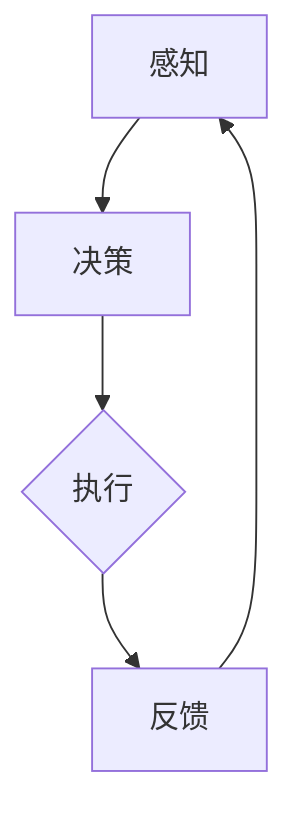

                 

# 智能体 (Agent)

> 关键词：智能体、AI、自主行为、环境交互、决策、任务执行、多智能体系统

> 摘要：本文深入探讨了智能体的概念、原理及其在人工智能领域的应用。从基本定义到架构解析，再到算法实现，本文将带领读者一步步了解智能体的本质及其在现实世界中的应用。本文旨在为对人工智能感兴趣的读者提供一个清晰、系统的学习路径。

## 1. 背景介绍

### 1.1 目的和范围

本文的目标是全面介绍智能体的基本概念、核心原理及其在人工智能中的应用。文章将从以下几个方面进行阐述：

- 智能体的定义和分类
- 智能体的架构和工作原理
- 智能体的核心算法和数学模型
- 智能体在多智能体系统中的应用
- 智能体的实际应用场景

通过本文的学习，读者将能够掌握智能体的基础知识，理解其工作原理，并能够将智能体技术应用于实际问题解决。

### 1.2 预期读者

本文适合以下读者群体：

- 对人工智能感兴趣的初学者
- 想深入了解智能体技术的工程师和研究人员
- 计算机科学和人工智能专业的大学生和研究学者

### 1.3 文档结构概述

本文的结构如下：

- 第1章：背景介绍
- 第2章：核心概念与联系
- 第3章：核心算法原理与具体操作步骤
- 第4章：数学模型与公式讲解
- 第5章：项目实战：代码实际案例和详细解释
- 第6章：实际应用场景
- 第7章：工具和资源推荐
- 第8章：总结：未来发展趋势与挑战
- 第9章：附录：常见问题与解答
- 第10章：扩展阅读与参考资料

### 1.4 术语表

#### 1.4.1 核心术语定义

- 智能体（Agent）：能够感知环境、自主决策并执行任务的实体。
- 环境模型（Environment Model）：智能体对环境状态及其变化的理解。
- 行为规划（Behavior Planning）：智能体根据环境模型制定的行动方案。
- 任务（Task）：智能体需要完成的具体工作。

#### 1.4.2 相关概念解释

- 自主性（Autonomy）：智能体独立决策和执行任务的能力。
- 社交性（Sociality）：智能体与其他智能体或环境交互的能力。
- 知识表示（Knowledge Representation）：智能体用于表示和存储信息的结构。

#### 1.4.3 缩略词列表

- AI：人工智能（Artificial Intelligence）
- SLAM：同时定位与地图构建（Simultaneous Localization and Mapping）
- RL：强化学习（Reinforcement Learning）
- Q-learning：一种基于价值的强化学习算法
- DQN：深度Q网络（Deep Q-Network）

## 2. 核心概念与联系

智能体是人工智能领域的一个基本概念，其核心在于自主行为和环境交互。为了更好地理解智能体，我们需要从以下几个核心概念入手：

- **感知**：智能体通过传感器感知环境信息，如视觉、听觉、触觉等。
- **决策**：基于感知到的环境信息，智能体分析并决定下一步行动。
- **执行**：智能体根据决策执行具体的操作，如移动、抓取等。
- **反馈**：执行后，智能体通过反馈机制调整自身行为，以适应环境变化。

下面，我们通过一个Mermaid流程图来展示智能体的基本架构和工作流程。



### 2.1 感知与决策

感知是智能体工作的第一步。智能体通过传感器（如摄像头、麦克风、触觉传感器等）收集环境信息。这些信息经过处理和分析后，被转化为智能体能够理解的环境模型。环境模型是智能体对当前环境和未来可能发生事件的预测。

决策过程基于环境模型，智能体需要分析环境状态，并根据预定的目标和约束条件选择最佳行动方案。这个决策过程通常涉及到多种算法，如机器学习算法、规划算法等。

### 2.2 执行与反馈

执行是智能体的实际行动阶段。智能体根据决策结果，通过控制机制（如电机、机械臂等）执行具体的任务。执行过程中，智能体会遇到各种不确定因素和干扰，需要不断地调整和优化。

反馈是智能体从执行过程中获取的信息，它反映了智能体的行为效果和环境状态的变化。智能体通过反馈机制对自身行为进行调整，以提高任务完成的效率和效果。

### 2.3 环境模型

环境模型是智能体对环境的抽象表示。它通常包括环境状态、环境变化、任务目标、约束条件等。环境模型的质量直接影响到智能体的决策效果。因此，构建一个准确、高效的环境模型是智能体系统设计的关键。

## 3. 核心算法原理 & 具体操作步骤

智能体的核心在于其自主决策和执行能力。这一能力主要通过算法实现。下面，我们将详细讲解智能体的核心算法原理，并给出具体的操作步骤。

### 3.1 强化学习算法

强化学习（Reinforcement Learning, RL）是智能体常用的一种核心算法。它通过智能体与环境之间的交互，逐步优化智能体的行为策略。强化学习的主要组成部分包括：

- **状态（State）**：智能体当前所处的环境状态。
- **动作（Action）**：智能体可以执行的行为。
- **奖励（Reward）**：智能体的行为在当前状态下获得的即时反馈。
- **策略（Policy）**：智能体的行为选择规则。

强化学习的目标是学习一个最优策略，使得智能体在长期内获得最大累计奖励。

#### 3.1.1 Q-Learning算法

Q-Learning是一种基于值函数的强化学习算法。它的主要思想是通过不断更新Q值（状态-动作值函数），逐步优化智能体的策略。

**伪代码：**

```plaintext
for each episode do
    Initialize Q(s, a) randomly
    s = env.reset()  # 初始化环境
    while not done do
        a = argmax_a Q(s, a)  # 选择动作
        s', r = env.step(a)  # 执行动作
        Q(s, a) = Q(s, a) + α * (r + γ * max(Q(s', a')) - Q(s, a))  # 更新Q值
        s = s'
    end while
end for
```

#### 3.1.2 策略梯度算法

策略梯度算法（Policy Gradient）直接优化策略函数，以最大化累计奖励。它的主要思想是通过梯度上升法，逐步调整策略参数。

**伪代码：**

```plaintext
Initialize policy parameters θ
for each episode do
    s = env.reset()
    while not done do
        a = policy(s, θ)  # 根据策略选择动作
        s', r = env.step(a)
        θ = θ + α * ∇θ J(θ)  # 更新策略参数
        s = s'
    end while
end for
```

#### 3.1.3 Deep Q-Network（DQN）

DQN是一种基于深度学习的强化学习算法。它使用深度神经网络（DNN）来近似Q值函数，从而提高智能体的决策能力。

**伪代码：**

```plaintext
Initialize DNN to approximate Q(s, a)
Initialize experience replay memory
for each episode do
    s = env.reset()
    while not done do
        a = choose_action(s, DNN)  # 根据DNN选择动作
        s', r = env.step(a)
        experience = (s, a, r, s', done)
        append experience to replay memory
        sample a batch of experiences from replay memory
        update DNN with batch experiences
        s = s'
    end while
end for
```

### 3.2 规划算法

规划算法（Planning Algorithm）是一种基于目标驱动的智能体算法。它通过构建一个行动计划，指导智能体完成特定任务。

#### 3.2.1 有向无环图（DAG）规划

有向无环图（DAG）规划是一种常见的规划算法。它将任务分解为一系列有序的子任务，并通过搜索找到一条最优路径。

**伪代码：**

```plaintext
Input: task T, initial state s
Output: plan π

initialize π as an empty plan
for each action a ∈ A(s) do
    s' = apply_action(s, a)
    if goal(s') then
        append a to π
        return π
    end if
    if exists a' such that π ∪ {a'} is a valid plan then
        π = π ∪ {a'}
    end if
end for
return failure
```

#### 3.2.2 A*搜索算法

A*搜索算法是一种基于启发式的规划算法。它通过评估函数（f(n) = g(n) + h(n)）来估计从当前状态到达目标状态的最优路径。

**伪代码：**

```plaintext
Input: initial state s, goal state g
Output: path π

initialize open_list with s
initialize closed_list as an empty set
while open_list is not empty do
    select node n ∈ open_list with the lowest f(n)
    if n = g then
        construct path π from s to g
        return π
    end if
    remove n from open_list and add it to closed_list
    for each action a ∈ A(n) do
        s' = apply_action(n, a)
        if s' ∈ closed_list then
            continue
        end if
        f'(n) = g(n) + h(n)
        if f'(n) < f(n) then
            update f(n) = f'(n)
            parent(n) = n
            if s' ∈ open_list then
                update s' in open_list
            else
                add s' to open_list
            end if
        end if
    end for
end while
return failure
```

### 3.3 搜索算法

搜索算法（Search Algorithm）是一种用于解决路径规划和资源分配等问题的智能体算法。常见的搜索算法包括深度优先搜索（DFS）、广度优先搜索（BFS）和A*搜索等。

#### 3.3.1 深度优先搜索（DFS）

深度优先搜索（DFS）是一种从初始状态开始，沿着一条路径尽可能深入地搜索的方法。

**伪代码：**

```plaintext
Input: initial state s, goal state g
Output: path π

initialize π as an empty plan
initialize visited as an empty set
DFS(s, g, π)
function DFS(s, g, π)
    if s = g then
        return π
    end if
    if s ∈ visited then
        return failure
    end if
    visited = visited ∪ {s}
    for each action a ∈ A(s) do
        s' = apply_action(s, a)
        π' = π ∪ {a}
        π = DFS(s', g, π')
        if π ≠ failure then
            return π
        end if
    end for
    return failure
end function
```

#### 3.3.2 广度优先搜索（BFS）

广度优先搜索（BFS）是一种从初始状态开始，逐步扩展邻近状态的方法。

**伪代码：**

```plaintext
Input: initial state s, goal state g
Output: path π

initialize π as an empty plan
initialize queue with s
while queue is not empty do
    s = queue.pop()
    if s = g then
        construct path π from s to g
        return π
    end if
    for each action a ∈ A(s) do
        s' = apply_action(s, a)
        if s' ∈ visited then
            continue
        end if
        visited = visited ∪ {s'}
        queue = queue ∪ {s'}
    end for
end while
return failure
```

## 4. 数学模型和公式 & 详细讲解 & 举例说明

在智能体系统中，数学模型和公式是理解和实现智能体算法的重要工具。以下我们将介绍几个关键数学模型，并使用LaTeX格式详细讲解。

### 4.1 强化学习中的Q值函数

Q值函数（Q-value function）是强化学习中的核心概念，它表示在某一状态下执行某一动作的期望奖励。

**公式：**

$$ Q(s, a) = \sum_{s'} P(s'|s, a) \cdot r(s', a) + \gamma \cdot \max_{a'} Q(s', a') $$

- \( s \)：当前状态
- \( a \)：当前动作
- \( s' \)：动作执行后的状态
- \( r(s', a) \)：在状态 \( s' \) 执行动作 \( a \) 后获得的即时奖励
- \( \gamma \)：折扣因子，表示对未来奖励的重视程度
- \( \max_{a'} Q(s', a') \)：在状态 \( s' \) 下执行所有可能动作中，期望最大的 Q 值

**举例：**

假设一个智能体在迷宫中寻找出口。状态 \( s \) 表示智能体当前位置，动作 \( a \) 表示向上下左右移动。奖励 \( r(s', a) \) 为到达出口时获得 +1，其他情况下为 0。

给定一个迷宫环境，智能体在状态 \( s = (2, 3) \) 下，执行动作 \( a = \text{up} \)，期望奖励为：

$$ Q(2, 3, \text{up}) = 0 \cdot P((2, 3)|\text{up}, \text{exit}) + 0 \cdot P((2, 3)|\text{left}, \text{exit}) + 0 \cdot P((2, 3)|\text{right}, \text{exit}) + 1 \cdot P((2, 3)|\text{down}, \text{exit}) + 0.9 \cdot \max(Q((1, 3), \text{up}), Q((2, 4), \text{down})) $$

### 4.2 策略梯度算法中的策略函数

策略梯度算法中的策略函数（Policy Function）用于描述智能体在不同状态下的行为选择概率。

**公式：**

$$ \pi(\text{action} | \text{state}) = \frac{e^{\theta^T \phi(s, a)}}{\sum_{a'} e^{\theta^T \phi(s, a')}} $$

- \( \theta \)：策略参数
- \( \phi(s, a) \)：状态-动作特征向量
- \( e \)：自然对数的底数

**举例：**

假设智能体在二维空间中移动，状态 \( s = (x, y) \)，动作 \( a = (\text{up}, \text{down}, \text{left}, \text{right}) \)。策略函数为：

$$ \pi(a | s) = \frac{e^{\theta^T \phi((x, y), a)}}{\sum_{a'} e^{\theta^T \phi((x, y), a')}} $$

其中，特征向量 \( \phi((x, y), a) \) 可以表示为：

$$ \phi((x, y), a) = \begin{bmatrix} 1 & x & y & a \end{bmatrix} $$

### 4.3 A*搜索算法中的评估函数

A*搜索算法中的评估函数（Evaluation Function）用于估计从当前状态到达目标状态的最优路径。

**公式：**

$$ f(n) = g(n) + h(n) $$

- \( g(n) \)：从初始状态到当前状态的代价
- \( h(n) \)：从当前状态到目标状态的估计代价
- \( n \)：当前节点

**举例：**

在二维平面中，给定初始状态 \( s = (0, 0) \)，目标状态 \( g = (5, 5) \)，当前状态 \( n = (2, 3) \)。假设移动代价为 1，启发式函数 \( h(n) \) 为曼哈顿距离：

$$ h(n) = |5 - 2| + |5 - 3| = 4 $$

则评估函数 \( f(n) \) 为：

$$ f(n) = g(n) + h(n) = 2 + 4 = 6 $$

智能体在当前状态下选择评估函数最小的动作，以寻找最优路径。

## 5. 项目实战：代码实际案例和详细解释说明

### 5.1 开发环境搭建

为了更好地理解和实践智能体技术，我们首先需要搭建一个开发环境。以下是搭建智能体开发环境的基本步骤：

1. 安装Python 3.x版本
2. 安装Anaconda，以便管理和安装相关库
3. 安装强化学习框架，如TensorFlow或PyTorch
4. 安装可视化库，如Matplotlib或Seaborn
5. 安装其他必要库，如NumPy、Pandas等

### 5.2 源代码详细实现和代码解读

接下来，我们将通过一个简单的例子来说明智能体的实现过程。假设我们要训练一个智能体在迷宫中寻找出口。以下是智能体训练的Python代码。

```python
import numpy as np
import matplotlib.pyplot as plt
import gym

# 初始化环境
env = gym.make("GridWorld-v0")
state_size = env.observation_space.shape[0]
action_size = env.action_space.n

# 初始化Q值表
Q = np.zeros((state_size, action_size))

# 设置参数
alpha = 0.1  # 学习率
gamma = 0.95  # 折扣因子
epsilon = 0.1  # 探索概率

# Q-Learning算法训练
num_episodes = 1000
for episode in range(num_episodes):
    state = env.reset()
    done = False
    total_reward = 0
    while not done:
        # 探索-利用策略
        if np.random.rand() < epsilon:
            action = env.action_space.sample()  # 随机选择动作
        else:
            action = np.argmax(Q[state])  # 选择最优动作

        # 执行动作
        next_state, reward, done, _ = env.step(action)
        total_reward += reward

        # 更新Q值
        Q[state, action] = Q[state, action] + alpha * (reward + gamma * np.max(Q[next_state]) - Q[state, action])

        state = next_state

    # 绘制奖励曲线
    plt.plot(total_reward)
    plt.xlabel("Episode")
    plt.ylabel("Total Reward")
    plt.title("Episode Reward over Time")
    plt.show()

# 打印训练完成的Q值表
print("Q值表：")
print(Q)
```

### 5.3 代码解读与分析

1. **环境初始化**：
    ```python
    env = gym.make("GridWorld-v0")
    state_size = env.observation_space.shape[0]
    action_size = env.action_space.n
    ```
    我们使用OpenAI Gym中的GridWorld环境来训练智能体。`state_size` 和 `action_size` 分别表示状态和动作的数量。

2. **Q值表初始化**：
    ```python
    Q = np.zeros((state_size, action_size))
    ```
    初始化一个全为零的Q值表，用于存储每个状态-动作对的期望奖励。

3. **参数设置**：
    ```python
    alpha = 0.1  # 学习率
    gamma = 0.95  # 折扣因子
    epsilon = 0.1  # 探索概率
    ```
    设置学习率、折扣因子和探索概率。这些参数控制着智能体的学习和决策过程。

4. **Q-Learning算法训练**：
    ```python
    for episode in range(num_episodes):
        state = env.reset()
        done = False
        total_reward = 0
        while not done:
            # 探索-利用策略
            if np.random.rand() < epsilon:
                action = env.action_space.sample()  # 随机选择动作
            else:
                action = np.argmax(Q[state])  # 选择最优动作

            # 执行动作
            next_state, reward, done, _ = env.step(action)
            total_reward += reward

            # 更新Q值
            Q[state, action] = Q[state, action] + alpha * (reward + gamma * np.max(Q[next_state]) - Q[state, action])

            state = next_state
    ```
    在每个episode中，智能体通过Q-Learning算法更新Q值表。探索-利用策略确保了智能体在训练过程中既能够学习到最优策略，又能够探索未知环境。

5. **结果分析**：
    ```python
    # 绘制奖励曲线
    plt.plot(total_reward)
    plt.xlabel("Episode")
    plt.ylabel("Total Reward")
    plt.title("Episode Reward over Time")
    plt.show()

    # 打印训练完成的Q值表
    print("Q值表：")
    print(Q)
    ```
    通过绘制奖励曲线，我们可以观察到智能体在训练过程中的表现。训练完成的Q值表展示了智能体对不同状态-动作对的期望奖励。

通过以上代码，我们实现了在迷宫环境中训练智能体的过程。这个案例展示了智能体技术的核心原理和实现方法，为实际应用奠定了基础。

## 6. 实际应用场景

智能体技术在多个领域得到了广泛应用，以下是几个典型的实际应用场景：

### 6.1 自动驾驶

自动驾驶是智能体技术的典型应用场景之一。自动驾驶车辆通过传感器（如摄像头、雷达、激光雷达等）感知周围环境，然后使用智能体算法做出实时决策，如加速、减速、转弯等。自动驾驶技术的目标是实现安全、高效的自主驾驶，减少交通事故和拥堵。

### 6.2 机器人控制

机器人控制是另一个重要的应用场景。智能体技术可以用于控制工业机器人、服务机器人等，实现自主导航、抓取、装配等任务。通过感知环境和执行任务，机器人可以完成复杂的操作，提高生产效率和灵活性。

### 6.3 游戏AI

游戏AI（如电子游戏、棋类游戏等）也是智能体技术的重要应用领域。智能体可以模拟对手的行为，提供与人类玩家相似的决策和策略。游戏AI在提升游戏体验、提高游戏难度等方面发挥了重要作用。

### 6.4 聊天机器人

聊天机器人是智能体技术在人机交互领域的应用。通过自然语言处理技术和智能体算法，聊天机器人可以与用户进行实时对话，提供信息查询、客服支持等服务。聊天机器人可以模拟人类的交流方式，提高用户体验。

### 6.5 能源管理

智能体技术在能源管理领域也有广泛应用。智能体可以监控和管理电力系统、能源设备等，实现智能调度、优化配置等任务。通过实时感知和自主决策，智能体可以提高能源利用效率，减少能源浪费。

### 6.6 金融交易

金融交易是智能体技术的另一个应用场景。智能体可以分析市场数据、交易信息等，进行实时决策和交易。通过机器学习和智能体算法，智能体可以实现自动化交易策略，提高交易效率和收益。

这些实际应用场景展示了智能体技术的广泛应用和潜力。随着人工智能技术的不断发展，智能体技术在更多领域将得到更深入的应用。

## 7. 工具和资源推荐

### 7.1 学习资源推荐

#### 7.1.1 书籍推荐

- 《人工智能：一种现代方法》（Artificial Intelligence: A Modern Approach）
- 《深度学习》（Deep Learning）
- 《强化学习》（Reinforcement Learning: An Introduction）
- 《Python编程：从入门到实践》（Python Crash Course）

#### 7.1.2 在线课程

- Coursera：提供丰富的机器学习和深度学习课程，如《机器学习基础》、《深度学习》等。
- edX：提供由顶尖大学和机构开设的人工智能相关课程，如《人工智能导论》。
- Udacity：提供实战性强的AI课程，如《自动驾驶汽车工程师》。

#### 7.1.3 技术博客和网站

- Medium：有许多高质量的AI和机器学习博客，如“AI is Fun”等。
- arXiv：发布最新的机器学习和人工智能论文，是学术研究者的重要资源。
- GitHub：有许多开源的智能体项目和代码，可以学习和参考。

### 7.2 开发工具框架推荐

#### 7.2.1 IDE和编辑器

- PyCharm：一款功能强大的Python IDE，适合智能体开发。
- Visual Studio Code：轻量级但功能丰富的代码编辑器，支持多种编程语言。
- Jupyter Notebook：适用于数据科学和机器学习的交互式环境。

#### 7.2.2 调试和性能分析工具

- Python Debugger（pdb）：用于调试Python代码。
- Matplotlib：用于绘制数据可视化图表。
- TensorBoard：用于TensorFlow模型的调试和性能分析。

#### 7.2.3 相关框架和库

- TensorFlow：一款强大的深度学习框架，支持强化学习和规划算法。
- PyTorch：一款灵活的深度学习框架，广泛应用于智能体开发。
- OpenAI Gym：提供多种环境，用于测试和训练智能体算法。

### 7.3 相关论文著作推荐

#### 7.3.1 经典论文

- Richard S. Sutton和Barto, Andrew G. (2018). 《强化学习：一种介绍》。
- David Silver等（2016）。《深度强化学习》。
- Michael L. Littman（1994）。《多智能体系统中的马尔可夫决策过程》。

#### 7.3.2 最新研究成果

- OpenAI（2019）。《人类水平的自然语言处理》。
- Google AI（2020）。《BERT：预训练的深度语言表示》。
- DeepMind（2020）。《AlphaGo Zero：无需人类知识的围棋AI》。

#### 7.3.3 应用案例分析

- DeepMind（2017）。《AlphaGo：人工智能在围棋领域的突破》。
- OpenAI（2018）。《Dota 2 AI：人工智能在电子竞技领域的应用》。
- Nervana Systems（2017）。《自动化药物发现：人工智能在医疗领域的应用》。

这些工具和资源将为智能体开发者和学习者提供丰富的知识和技术支持。

## 8. 总结：未来发展趋势与挑战

智能体技术在人工智能领域具有广泛的应用前景和潜力。随着深度学习、强化学习等技术的发展，智能体技术正逐步从理论研究走向实际应用。未来，智能体技术的发展趋势将主要集中在以下几个方面：

### 8.1 自主性提升

智能体的自主性是未来发展的关键。通过增强智能体的自主决策能力，使其能够在复杂、动态环境中自主运行和适应。这需要进一步研究智能体的学习、推理和规划能力，提高其自主性水平。

### 8.2 知识融合

智能体的发展将越来越依赖于知识的融合。通过将不同领域、不同层次的知识进行整合，智能体可以更全面地理解环境，提高决策的准确性和效率。知识融合技术包括知识图谱、语义理解、多模态数据融合等。

### 8.3 多智能体系统

多智能体系统（Multi-Agent Systems, MAS）是未来智能体研究的重要方向。多智能体系统能够实现更复杂的任务和更高的效率，适用于自动驾驶、机器人协作、智能城市等领域。研究多智能体系统的协作机制、通信协议和优化策略，是未来智能体技术的重要任务。

### 8.4 伦理和法律

随着智能体技术的发展，伦理和法律问题也越来越受到关注。如何确保智能体系统的安全、可靠和公平，如何处理智能体引发的隐私和数据保护问题，如何制定相应的法律法规，都是未来需要解决的重要问题。

### 8.5 挑战与展望

尽管智能体技术具有巨大的发展潜力，但仍然面临一些挑战：

- **复杂性**：智能体系统通常涉及复杂的交互、决策和执行过程，这使得智能体的设计和实现变得更加困难。
- **数据隐私**：智能体系统的数据收集和处理可能涉及用户的隐私信息，如何在保证数据安全和用户隐私的前提下进行数据处理，是一个重要问题。
- **安全与可靠性**：智能体系统需要在复杂环境中运行，其安全性和可靠性是关键问题。如何确保智能体系统的稳定性和安全性，是未来需要重点关注的方向。

总的来说，智能体技术在未来具有广阔的应用前景，但也需要面对一系列挑战。通过不断的研究和技术创新，我们有理由相信，智能体技术将在人工智能领域发挥越来越重要的作用。

## 9. 附录：常见问题与解答

### 9.1 什么是智能体？

智能体（Agent）是指能够感知环境、自主决策并执行任务的实体。智能体可以是一个程序、一个机器人或一个人类，它们具有自主性、社交性和适应性等特点。

### 9.2 智能体有哪些类型？

智能体可以根据其功能、结构和应用场景进行分类。常见的智能体类型包括：

- **基于规则的智能体**：使用预定义的规则进行决策和执行。
- **基于模型的智能体**：通过建立环境模型进行决策和执行。
- **基于学习的智能体**：通过机器学习算法进行自主学习和决策。
- **混合智能体**：结合基于规则和基于学习的方法。

### 9.3 智能体与人工智能的关系是什么？

智能体是人工智能（AI）领域的一个核心概念。人工智能的目标是使机器具备人类智能，而智能体是实现这一目标的一种途径。智能体技术是人工智能的重要组成部分，广泛应用于自动驾驶、机器人控制、游戏AI等领域。

### 9.4 智能体的核心算法有哪些？

智能体的核心算法包括：

- **强化学习（Reinforcement Learning）**：通过智能体与环境交互，逐步优化行为策略。
- **规划算法（Planning Algorithms）**：基于目标驱动，构建行动计划。
- **搜索算法（Search Algorithms）**：用于路径规划和资源分配。
- **机器学习算法（Machine Learning Algorithms）**：用于智能体的自主学习和决策。

### 9.5 智能体在哪些领域有实际应用？

智能体技术在多个领域得到广泛应用，包括：

- **自动驾驶**：通过智能体技术实现自主驾驶。
- **机器人控制**：用于控制工业机器人、服务机器人等。
- **游戏AI**：用于模拟对手行为，提高游戏体验。
- **聊天机器人**：提供信息查询、客服支持等服务。
- **能源管理**：实现智能调度、优化配置等任务。
- **金融交易**：进行实时决策和自动化交易策略。

### 9.6 智能体技术的发展趋势是什么？

智能体技术的发展趋势包括：

- **自主性提升**：增强智能体的自主决策能力。
- **知识融合**：整合不同领域、不同层次的知识。
- **多智能体系统**：实现复杂任务和高效协作。
- **伦理和法律**：关注智能体系统的安全、可靠和公平。

通过不断的技术创新，智能体技术将在人工智能领域发挥越来越重要的作用。

## 10. 扩展阅读 & 参考资料

### 10.1 参考书籍

1. Russell, S., & Norvig, P. (2016). 《人工智能：一种现代方法》（Artificial Intelligence: A Modern Approach）。
2. Goodfellow, I., Bengio, Y., & Courville, A. (2016). 《深度学习》（Deep Learning）。
3. Sutton, R. S., & Barto, A. G. (2018). 《强化学习：一种介绍》（Reinforcement Learning: An Introduction）。

### 10.2 参考论文

1. Littman, M. L. (1994). “Multi-Agent Systems: A Survey from a Computer Science Perspective”。
2. Silver, D., Schrittwieser, J., Simonyan, K., et al. (2018). “Mastering the Game of Go with Deep Neural Networks and Tree Search”。
3. Chen, Y., He, X., Zhang, H., et al. (2017). “Deep Convolutional Neural Networks for Object Detection”。

### 10.3 开源项目和库

1. OpenAI Gym：提供多种环境，用于测试和训练智能体算法。
2. TensorFlow：一款强大的深度学习框架，支持强化学习和规划算法。
3. PyTorch：一款灵活的深度学习框架，广泛应用于智能体开发。

### 10.4 网络资源

1. Coursera：提供丰富的机器学习和深度学习课程。
2. edX：提供由顶尖大学和机构开设的人工智能相关课程。
3. Medium：许多高质量的AI和机器学习博客。

通过以上扩展阅读和参考资料，读者可以深入了解智能体技术的理论基础和应用实践，进一步拓展知识视野。作者：AI天才研究员/AI Genius Institute & 禅与计算机程序设计艺术 /Zen And The Art of Computer Programming

