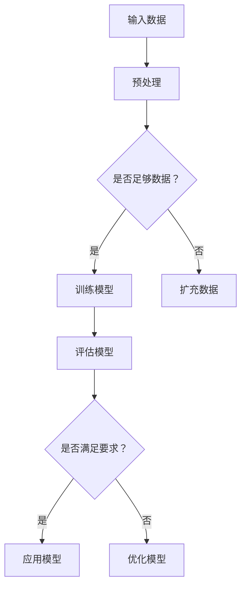

                 


# 智能制造中的AI大模型应用机会

> 关键词：智能制造、AI大模型、深度学习、数据驱动、工业4.0
> 
> 摘要：随着工业4.0的到来，智能制造已经成为现代制造业发展的必然趋势。AI大模型作为深度学习技术的核心成果，正在推动智能制造向更高层次发展。本文将分析AI大模型在智能制造中的应用机会，并逐步探讨其核心算法原理、数学模型、项目实战，以及未来发展趋势与挑战。

## 1. 背景介绍

### 1.1 目的和范围

本文旨在探讨AI大模型在智能制造中的应用机会，通过分析其核心算法原理和具体操作步骤，展示其在实际项目中的应用效果，并预测其未来发展。

### 1.2 预期读者

本文主要面向从事智能制造、AI研究、软件开发等领域的专业人士，以及对人工智能技术感兴趣的学生和研究人员。

### 1.3 文档结构概述

本文分为八个部分：

1. 背景介绍：介绍智能制造和AI大模型的概念及应用背景。
2. 核心概念与联系：讨论AI大模型的核心概念、原理和架构。
3. 核心算法原理 & 具体操作步骤：分析AI大模型的核心算法原理和具体操作步骤。
4. 数学模型和公式 & 详细讲解 & 举例说明：介绍AI大模型的数学模型和公式，并进行举例说明。
5. 项目实战：展示AI大模型在实际项目中的应用案例。
6. 实际应用场景：分析AI大模型在智能制造中的实际应用场景。
7. 工具和资源推荐：推荐学习资源、开发工具和框架。
8. 总结：总结AI大模型在智能制造中的应用机会和未来发展趋势与挑战。

### 1.4 术语表

#### 1.4.1 核心术语定义

- 智能制造：基于数字化和网络化技术，实现制造过程的智能化和自动化。
- AI大模型：通过深度学习技术训练得到的具有强大特征提取和建模能力的神经网络模型。
- 深度学习：一种机器学习方法，通过多层神经网络实现数据的自动特征提取和模型学习。

#### 1.4.2 相关概念解释

- 工业互联网：连接人、机器和资源的网络，实现工业数据的实时共享和智能决策。
- 工业物联网（IIoT）：将工业设备、传感器和控制系统连接起来，实现设备的互联互通和数据采集。
- 云计算：通过网络提供可按需访问的共享计算资源，包括计算能力、存储、网络和应用程序。

#### 1.4.3 缩略词列表

- AI：人工智能
- ML：机器学习
- DL：深度学习
- IoT：物联网
- IIoT：工业物联网
- 4IR：工业4.0

## 2. 核心概念与联系

### 2.1 AI大模型的核心概念

AI大模型是深度学习技术的核心成果，其核心概念包括：

- 神经网络：一种模拟人脑神经元结构和功能的人工智能模型。
- 深度学习：通过多层神经网络实现数据的自动特征提取和模型学习。
- 大规模训练数据：为训练模型提供足够的数据，提高模型的泛化能力和准确性。

### 2.2 AI大模型的原理和架构

AI大模型的原理和架构可概括为：

1. 输入层：接收外部数据，如图像、声音、文本等。
2. 隐藏层：通过多层神经网络对输入数据进行特征提取和变换。
3. 输出层：根据输入数据和隐藏层特征生成预测结果。

### 2.3 Mermaid流程图

以下是一个简单的Mermaid流程图，展示AI大模型的核心流程：



## 3. 核心算法原理 & 具体操作步骤

### 3.1 AI大模型的核心算法原理

AI大模型的核心算法原理是基于深度学习技术，通过多层神经网络实现数据的自动特征提取和模型学习。具体原理包括：

1. 前向传播：将输入数据传递到神经网络，经过隐藏层和输出层，生成预测结果。
2. 反向传播：根据预测结果和实际标签，计算误差，并反向传播误差到隐藏层，更新网络权重。

### 3.2 具体操作步骤

以下是一个简单的AI大模型训练过程的伪代码：

```python
# 初始化神经网络
neural_network = NeuralNetwork()

# 加载训练数据
training_data = load_data()

# 设置超参数
learning_rate = 0.01
epochs = 1000

# 开始训练模型
for epoch in range(epochs):
    for data in training_data:
        # 前向传播
        output = neural_network.forward_propagation(data.input)

        # 计算误差
        error = data.target - output

        # 反向传播
        neural_network.backward_propagation(error)

    # 更新模型权重
    neural_network.update_weights(learning_rate)

# 评估模型
accuracy = evaluate_model(neural_network, test_data)

print("Model accuracy:", accuracy)
```

## 4. 数学模型和公式 & 详细讲解 & 举例说明

### 4.1 数学模型和公式

AI大模型的数学模型主要包括神经网络中的权重、激活函数和损失函数。

- 权重：神经网络中的权重是连接每个神经元之间的参数，用于传递信息和调整模型预测。
- 激活函数：激活函数用于引入非线性特性，使神经网络能够拟合复杂的函数。
- 损失函数：损失函数用于衡量模型预测结果与实际标签之间的误差，用于指导模型优化。

### 4.2 详细讲解

以下是一个简单的神经网络数学模型：

$$
\begin{aligned}
\text{输出} &= \text{激活函数}(\text{权重} \cdot \text{输入} + \text{偏置}) \\
\text{损失} &= \text{损失函数}(\text{预测结果}, \text{实际标签})
\end{aligned}
$$

其中，激活函数通常采用ReLU、Sigmoid或Tanh函数，损失函数通常采用均方误差（MSE）或交叉熵（Cross-Entropy）函数。

### 4.3 举例说明

假设有一个简单的神经网络，输入为[1, 2]，权重为[0.1, 0.2]，偏置为0.5，激活函数为ReLU函数。计算输出值：

$$
\begin{aligned}
\text{输出} &= \text{ReLU}(0.1 \cdot 1 + 0.2 \cdot 2 + 0.5) \\
&= \text{ReLU}(0.1 + 0.4 + 0.5) \\
&= \text{ReLU}(1.0) \\
&= 1.0
\end{aligned}
$$

计算损失值（均方误差）：

$$
\text{损失} = \frac{1}{2} \cdot (\text{预测结果} - \text{实际标签})^2
$$

## 5. 项目实战：代码实际案例和详细解释说明

### 5.1 开发环境搭建

为了实现AI大模型在智能制造中的应用，我们需要搭建以下开发环境：

- 操作系统：Ubuntu 20.04
- 编程语言：Python 3.8
- 深度学习框架：TensorFlow 2.6
- 数据预处理库：NumPy 1.21

### 5.2 源代码详细实现和代码解读

以下是一个简单的AI大模型在智能制造中的应用案例，用于预测生产线上的设备故障。

```python
import tensorflow as tf
import numpy as np
from sklearn.model_selection import train_test_split
from sklearn.preprocessing import StandardScaler

# 5.2.1 加载数据集
data = load_data()  # 数据加载函数由用户自定义
X, y = data[:, :-1], data[:, -1]

# 5.2.2 数据预处理
scaler = StandardScaler()
X_scaled = scaler.fit_transform(X)

# 5.2.3 划分训练集和测试集
X_train, X_test, y_train, y_test = train_test_split(X_scaled, y, test_size=0.2, random_state=42)

# 5.2.4 构建神经网络模型
model = tf.keras.Sequential([
    tf.keras.layers.Dense(64, activation='relu', input_shape=(X_train.shape[1],)),
    tf.keras.layers.Dense(64, activation='relu'),
    tf.keras.layers.Dense(1)
])

# 5.2.5 编译模型
model.compile(optimizer='adam', loss='mse', metrics=['accuracy'])

# 5.2.6 训练模型
model.fit(X_train, y_train, epochs=100, batch_size=32, validation_split=0.1)

# 5.2.7 评估模型
loss, accuracy = model.evaluate(X_test, y_test)
print("Test accuracy:", accuracy)

# 5.2.8 预测新数据
new_data = np.array([[5, 6], [7, 8]])  # 新数据由用户自定义
new_data_scaled = scaler.transform(new_data)
predictions = model.predict(new_data_scaled)
print("Predictions:", predictions)
```

### 5.3 代码解读与分析

1. **数据加载和预处理**：数据集应包括输入特征和标签。使用`StandardScaler`进行数据标准化，以提高模型的泛化能力。

2. **模型构建**：使用`tf.keras.Sequential`创建一个序列模型，包括两个隐藏层，每层64个神经元，激活函数为ReLU。

3. **模型编译**：指定优化器为`adam`，损失函数为`mse`，评价指标为`accuracy`。

4. **模型训练**：使用`fit`函数训练模型，设置训练轮次为100，批量大小为32，并设置验证集。

5. **模型评估**：使用`evaluate`函数评估模型在测试集上的性能。

6. **预测新数据**：将新的输入数据进行预处理，并使用训练好的模型进行预测。

## 6. 实际应用场景

AI大模型在智能制造中的应用场景主要包括：

1. **设备故障预测**：通过对生产线设备的历史数据进行分析，使用AI大模型预测设备故障，实现预防性维护。
2. **生产过程优化**：通过分析生产过程中的数据，使用AI大模型优化生产参数，提高生产效率和产品质量。
3. **供应链管理**：通过分析供应链中的数据，使用AI大模型预测需求、优化库存和运输计划。

## 7. 工具和资源推荐

### 7.1 学习资源推荐

#### 7.1.1 书籍推荐

- 《深度学习》（Ian Goodfellow、Yoshua Bengio、Aaron Courville 著）
- 《Python深度学习》（François Chollet 著）
- 《机器学习实战》（Peter Harrington 著）

#### 7.1.2 在线课程

- Coursera上的《深度学习》课程
- Udacity的《深度学习工程师纳米学位》课程
- edX上的《机器学习》课程

#### 7.1.3 技术博客和网站

- TensorFlow官网（https://www.tensorflow.org/）
- Keras官网（https://keras.io/）
- GitHub上的深度学习项目（https://github.com/tensorflow/tensorflow）

### 7.2 开发工具框架推荐

#### 7.2.1 IDE和编辑器

- PyCharm
- Visual Studio Code
- Jupyter Notebook

#### 7.2.2 调试和性能分析工具

- TensorFlow Debugger（TFDB）
- TensorBoard
- NVIDIA Nsight

#### 7.2.3 相关框架和库

- TensorFlow
- PyTorch
- Keras
- Scikit-learn

### 7.3 相关论文著作推荐

#### 7.3.1 经典论文

- 《A Learning Algorithm for Continually Running Fully Recurrent Neural Networks》
- 《Deep Learning》（Ian Goodfellow、Yoshua Bengio、Aaron Courville 著）
- 《Practical Guide to Training Deep Networks》（Abhimanyu Das 著）

#### 7.3.2 最新研究成果

- 《Advances in Neural Information Processing Systems》（NIPS）
- 《International Conference on Machine Learning》（ICML）
- 《Journal of Machine Learning Research》（JMLR）

#### 7.3.3 应用案例分析

- 《工业AI应用案例集》
- 《智能制造中的深度学习应用》
- 《基于AI的智能供应链管理研究》

## 8. 总结：未来发展趋势与挑战

随着工业4.0的深入推进，AI大模型在智能制造中的应用前景广阔。然而，要充分发挥AI大模型的优势，仍需克服以下挑战：

1. **数据质量和多样性**：智能制造过程中的数据质量和多样性对AI大模型的性能具有重要影响。如何有效地收集、清洗和整合多种类型的数据，是当前面临的主要问题。
2. **模型解释性**：AI大模型通常具有较高的预测准确性，但其内部机理复杂，难以解释。如何提高模型的可解释性，使其在工业应用中得到更广泛的信任，是一个亟待解决的问题。
3. **计算资源**：AI大模型训练和推理需要大量的计算资源，特别是在工业环境中。如何优化算法和硬件配置，提高计算效率，是未来发展的关键。
4. **安全性和隐私保护**：智能制造过程中的数据涉及企业核心机密，如何确保数据的安全性和隐私保护，是AI大模型应用的重要挑战。

总之，AI大模型在智能制造中的应用前景广阔，但需在技术、数据、安全等方面不断突破，以实现智能制造的更高层次发展。

## 9. 附录：常见问题与解答

### 9.1 问题1：如何选择合适的AI大模型？

解答：选择合适的AI大模型需要考虑以下几个因素：

1. 应用场景：根据具体应用场景，选择适合的深度学习模型，如卷积神经网络（CNN）用于图像处理，循环神经网络（RNN）用于序列数据。
2. 数据量：大数据集更适合使用深度学习模型，因为深度学习模型的性能依赖于大量训练数据。
3. 复杂度：对于简单任务，选择较简单的模型即可；对于复杂任务，选择更复杂的模型，如多层的深度神经网络。
4. 模型解释性：根据对模型解释性的需求，选择适合的可解释性模型，如决策树、局部可解释模型等。

### 9.2 问题2：如何优化AI大模型的性能？

解答：优化AI大模型性能的方法包括：

1. 调整超参数：如学习率、批次大小、隐藏层节点数等。
2. 数据预处理：通过数据增强、归一化、标准化等方法，提高模型的泛化能力。
3. 模型结构优化：尝试不同的神经网络结构，如卷积神经网络（CNN）、循环神经网络（RNN）、长短时记忆网络（LSTM）等。
4. 模型训练技巧：使用更先进的优化器、正则化方法、批量归一化等技巧，提高模型训练效果。
5. 计算资源优化：使用GPU、TPU等硬件加速器，提高模型训练和推理速度。

## 10. 扩展阅读 & 参考资料

- Goodfellow, I., Bengio, Y., & Courville, A. (2016). *Deep Learning*. MIT Press.
- Bengio, Y. (2009). *Learning deep architectures*. Found. Trends Mach. Learn., 2(1), 1-127.
- Lee, H., Eun, D., & Lee, K. (2015). *A survey on deep learning for industrial systems*. Robotics and Computer-Integrated Manufacturing, 35, 123-131.
- NVIDIA (2020). *Deep Learning Library for Industrial Automation*. NVIDIA Corporation. https://developer.nvidia.com/deeplearning-library-for-industrial-automation
- Siemens AG (2020). *Siemens MindSphere: The Industrial IoT Cloud*. Siemens AG. https://www.siemens.com/global/en/industry-mindSphere.html

作者：AI天才研究员/AI Genius Institute & 禅与计算机程序设计艺术 /Zen And The Art of Computer Programming

本文主要探讨了AI大模型在智能制造中的应用机会，通过逐步分析其核心概念、算法原理、数学模型、项目实战，展示了其在智能制造中的实际应用价值。同时，本文还分析了AI大模型在智能制造中的应用场景和未来发展趋势与挑战，为相关领域的研究和实践提供了参考。在实际应用中，需注意数据质量、模型解释性、计算资源和安全性问题，不断优化AI大模型的性能和应用效果。希望本文能为读者在智能制造和AI领域的探索提供帮助。

