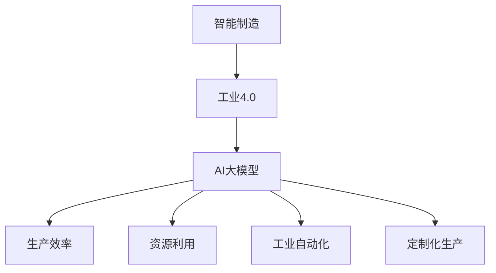
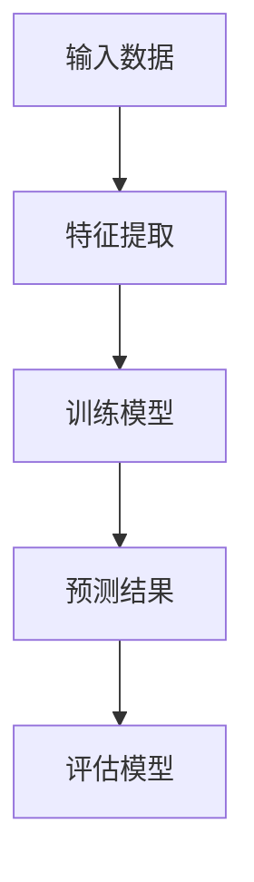
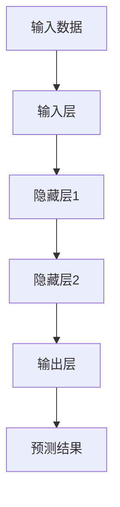

                 

# 智能制造新范式：AI大模型在工业4.0中的角色

> **关键词**：智能制造、工业4.0、AI大模型、机器学习、深度学习、工业自动化、智能传感器、物联网、数据驱动、先进制造

> **摘要**：本文旨在探讨AI大模型在工业4.0时代的角色与作用，分析其如何通过机器学习和深度学习技术推动智能制造的革新。我们将详细讨论核心概念、算法原理、数学模型、实际应用案例，并展望未来发展趋势与挑战。读者将了解到AI大模型在提高生产效率、优化资源利用和推动工业自动化方面的重要意义。

## 1. 背景介绍

### 1.1 目的和范围

本文的目的在于深入探讨人工智能（AI）大模型在工业4.0中的关键角色，分析其如何赋能智能制造，并展望未来的发展前景。文章将涵盖以下范围：

1. **核心概念与联系**：介绍智能制造与工业4.0的基本概念，并展示相关技术的关联与集成。
2. **核心算法原理**：详细讲解AI大模型中的机器学习和深度学习算法，以及其在工业应用中的具体操作步骤。
3. **数学模型和公式**：分析AI大模型背后的数学模型和公式，并通过具体例子进行说明。
4. **项目实战**：通过实际案例展示AI大模型在智能制造中的具体应用，并进行代码解读。
5. **实际应用场景**：探讨AI大模型在工业自动化、智能传感器和物联网等领域的应用实例。
6. **工具和资源推荐**：提供相关学习资源、开发工具和论文著作的推荐。
7. **总结**：总结AI大模型在工业4.0中的应用现状，并展望未来的发展趋势与挑战。

### 1.2 预期读者

本文适合以下读者群体：

1. **人工智能和机器学习领域的从业者**：希望了解AI大模型在工业4.0中的应用及其潜力的专业人士。
2. **工业自动化和智能制造领域的工程师**：对智能制造技术感兴趣，并希望了解AI大模型如何提升生产效率和优化资源利用的技术人员。
3. **学术研究人员**：对AI大模型在工业4.0中的应用进行深入研究的学者。
4. **技术爱好者**：对智能制造和人工智能技术有浓厚兴趣的技术爱好者。

### 1.3 文档结构概述

本文结构如下：

1. **背景介绍**：介绍文章的目的、范围、预期读者和文档结构。
2. **核心概念与联系**：介绍智能制造与工业4.0的基本概念，展示相关技术的关联与集成。
3. **核心算法原理**：详细讲解AI大模型中的机器学习和深度学习算法。
4. **数学模型和公式**：分析AI大模型背后的数学模型和公式。
5. **项目实战**：通过实际案例展示AI大模型在智能制造中的应用。
6. **实际应用场景**：探讨AI大模型在工业自动化等领域的应用实例。
7. **工具和资源推荐**：提供相关学习资源、开发工具和论文著作的推荐。
8. **总结**：总结AI大模型在工业4.0中的应用现状，并展望未来发展趋势与挑战。
9. **附录**：常见问题与解答。
10. **扩展阅读与参考资料**：提供进一步阅读的资源和参考文献。

### 1.4 术语表

#### 1.4.1 核心术语定义

- **智能制造**：通过将信息技术、物联网、人工智能等技术应用于生产过程，实现制造过程的自动化、智能化和高效化。
- **工业4.0**：德国提出的工业革命4.0，旨在通过信息技术和工业技术的深度融合，实现智能化制造和工业自动化。
- **AI大模型**：具有巨大参数量和计算能力的机器学习模型，如GPT、BERT等，能够处理大规模数据并实现高度复杂的任务。
- **机器学习**：一种人工智能技术，通过训练模型从数据中学习规律，以实现预测、分类等任务。
- **深度学习**：一种基于多层神经网络的机器学习技术，能够通过递归计算自动提取特征，实现高度复杂的任务。

#### 1.4.2 相关概念解释

- **工业自动化**：通过自动化设备、机器人和控制系统，实现生产过程的自动化。
- **物联网**：将各种设备、传感器和系统连接到互联网，实现设备之间的数据交换和协同工作。
- **数据驱动**：以数据为基础，通过数据分析和挖掘来指导决策和优化生产过程。

#### 1.4.3 缩略词列表

- **AI**：人工智能
- **ML**：机器学习
- **DL**：深度学习
- **IoT**：物联网
- **IV**：工业自动化
- **MES**：制造执行系统
- **ERP**：企业资源规划

## 2. 核心概念与联系

智能制造和工业4.0是当今工业领域的重要发展趋势，它们通过信息技术和工业技术的深度融合，实现了生产过程的智能化和自动化。在这一背景下，AI大模型作为机器学习和深度学习的代表，发挥着关键作用。

### 2.1 智能制造

智能制造是一种基于信息技术、物联网和人工智能等技术的制造模式，旨在实现制造过程的自动化、智能化和高效化。其主要特点包括：

1. **自动化生产**：通过自动化设备和机器人实现生产过程的自动化，减少人工干预。
2. **数据驱动**：通过物联网和传感器技术，实时采集生产过程中的数据，以数据为基础进行决策和优化。
3. **定制化生产**：通过大数据分析和个性化算法，实现定制化生产，满足不同客户的需求。

### 2.2 工业4.0

工业4.0是德国提出的工业革命4.0，旨在通过信息技术和工业技术的深度融合，实现智能化制造和工业自动化。其主要特点包括：

1. **智能化生产**：通过AI大模型和智能传感器，实现生产过程的智能化和自适应控制。
2. **网络化协同**：通过物联网和云计算技术，实现设备之间的数据交换和协同工作。
3. **数据驱动的决策**：通过大数据分析和机器学习算法，实现生产过程的优化和资源利用最大化。

### 2.3 AI大模型与智能制造和工业4.0的联系

AI大模型在智能制造和工业4.0中发挥着关键作用，其联系主要体现在以下几个方面：

1. **提升生产效率**：通过AI大模型，可以实现生产过程的预测和优化，减少生产过程中的浪费，提高生产效率。
2. **优化资源利用**：通过AI大模型，可以实现资源利用的最大化，减少能源消耗和原材料浪费。
3. **推动工业自动化**：通过AI大模型，可以实现生产过程的自动化和智能化，减少人工干预，提高生产效率和产品质量。
4. **实现定制化生产**：通过AI大模型，可以实现生产过程的个性化定制，满足不同客户的需求。

### 2.4 核心概念原理和架构的 Mermaid 流程图

以下是智能制造与工业4.0中核心概念原理和架构的 Mermaid 流程图：



## 3. 核心算法原理 & 具体操作步骤

在智能制造和工业4.0中，AI大模型的应用离不开机器学习和深度学习算法的支持。以下将详细讲解机器学习和深度学习算法的基本原理和具体操作步骤。

### 3.1 机器学习算法原理

机器学习算法的核心思想是通过从数据中学习规律，以实现预测、分类等任务。以下是一个简单的机器学习算法原理示意图：



具体操作步骤如下：

1. **数据收集**：首先需要收集大量的数据，这些数据可以是生产过程中的各种传感器数据、历史生产数据等。
2. **特征提取**：对收集到的数据进行预处理，提取出与任务相关的特征，如时间序列数据中的趋势特征、周期特征等。
3. **训练模型**：使用特征数据和标签数据训练机器学习模型，模型可以是线性回归、决策树、支持向量机等。
4. **预测结果**：使用训练好的模型对新的数据进行预测，预测结果可以是产量、能耗等指标。
5. **评估模型**：评估模型的预测性能，如准确率、召回率、F1值等。

### 3.2 深度学习算法原理

深度学习算法是机器学习的一种扩展，其核心思想是通过多层神经网络自动提取特征，实现高度复杂的任务。以下是一个简单的深度学习算法原理示意图：



具体操作步骤如下：

1. **构建神经网络**：根据任务需求，构建多层神经网络，包括输入层、隐藏层和输出层。
2. **初始化参数**：为神经网络初始化权重和偏置参数。
3. **前向传播**：将输入数据传递到神经网络中，通过激活函数进行非线性变换，生成预测结果。
4. **反向传播**：根据预测结果与真实值的差异，计算损失函数，并通过反向传播算法更新参数。
5. **优化参数**：使用优化算法，如梯度下降、Adam等，不断迭代优化参数。
6. **评估模型**：评估模型的预测性能，如准确率、召回率、F1值等。

### 3.3 AI大模型中的具体操作步骤

AI大模型在智能制造中的应用，通常需要经过以下几个步骤：

1. **数据收集**：收集生产过程中的各种数据，包括传感器数据、历史生产数据等。
2. **数据预处理**：对收集到的数据进行清洗、归一化等预处理，以消除噪声和提高数据质量。
3. **特征提取**：对预处理后的数据提取特征，如时间序列数据中的趋势特征、周期特征等。
4. **模型选择**：根据任务需求，选择合适的机器学习或深度学习模型，如GPT、BERT、CNN等。
5. **模型训练**：使用特征数据和标签数据训练模型，通过迭代优化参数，提高模型性能。
6. **模型评估**：评估模型的预测性能，如准确率、召回率、F1值等，调整模型参数，以提高预测精度。
7. **模型部署**：将训练好的模型部署到生产环境中，实现实时预测和优化。
8. **持续优化**：根据生产过程中出现的问题和需求，不断优化模型，提高模型性能和实用性。

## 4. 数学模型和公式 & 详细讲解 & 举例说明

在AI大模型中，数学模型和公式起着至关重要的作用。以下将详细讲解AI大模型中常用的数学模型和公式，并通过具体例子进行说明。

### 4.1 激活函数

激活函数是神经网络中用于引入非线性性的函数，常见的激活函数包括：

1. **Sigmoid函数**：
   $$ f(x) = \frac{1}{1 + e^{-x}} $$
   Sigmoid函数的导数为：
   $$ f'(x) = \frac{e^{-x}}{(1 + e^{-x})^2} $$
   Sigmoid函数常用于二分类问题，其输出值介于0和1之间。

2. **ReLU函数**：
   $$ f(x) = \max(0, x) $$
  ReLU函数的导数为：
   $$ f'(x) = \begin{cases} 
      0, & \text{if } x < 0 \\
      1, & \text{if } x \geq 0 
   \end{cases} $$
  ReLU函数常用于隐藏层，可以提高神经网络的训练速度。

3. **Tanh函数**：
   $$ f(x) = \frac{e^x - e^{-x}}{e^x + e^{-x}} $$
   Tanh函数的导数为：
   $$ f'(x) = 1 - \frac{2}{e^{2x} + 1} $$
   Tanh函数具有相似的形状和性质，但输出值介于-1和1之间。

### 4.2 损失函数

损失函数用于衡量预测结果与真实值之间的差异，常见的损失函数包括：

1. **均方误差（MSE）**：
   $$ Loss = \frac{1}{n}\sum_{i=1}^{n}(y_i - \hat{y}_i)^2 $$
   其中，\( y_i \)为真实值，\( \hat{y}_i \)为预测值，\( n \)为样本数量。
   MSE函数的导数为：
   $$ \frac{dLoss}{d\hat{y}_i} = 2(y_i - \hat{y}_i) $$

2. **交叉熵（Cross-Entropy）**：
   $$ Loss = -\frac{1}{n}\sum_{i=1}^{n}y_i\log(\hat{y}_i) + (1 - y_i)\log(1 - \hat{y}_i) $$
   其中，\( y_i \)为真实值，\( \hat{y}_i \)为预测值。
   交叉熵函数的导数为：
   $$ \frac{dLoss}{d\hat{y}_i} = \hat{y}_i - y_i $$

### 4.3 优化算法

在训练神经网络时，需要使用优化算法来更新参数，常见的优化算法包括：

1. **梯度下降（Gradient Descent）**：
   $$ \theta = \theta - \alpha \cdot \nabla_{\theta} Loss $$
   其中，\( \theta \)为参数，\( \alpha \)为学习率，\( \nabla_{\theta} Loss \)为损失函数关于参数的梯度。
   梯度下降算法的目标是找到损失函数的局部最小值。

2. **Adam优化器**：
   $$ m_t = \beta_1 m_{t-1} + (1 - \beta_1) \nabla_{\theta} Loss $$
   $$ v_t = \beta_2 v_{t-1} + (1 - \beta_2) (\nabla_{\theta} Loss)^2 $$
   $$ \theta = \theta - \alpha \cdot \frac{m_t}{\sqrt{v_t} + \epsilon} $$
   其中，\( m_t \)和\( v_t \)分别为一阶矩估计和二阶矩估计，\( \beta_1 \)、\( \beta_2 \)分别为一阶矩和二阶矩的衰减率，\( \alpha \)为学习率，\( \epsilon \)为常数。
   Adam优化器结合了梯度下降和动量项，可以加速收敛。

### 4.4 举例说明

假设我们要使用神经网络预测某工厂的生产量，输入特征为时间序列数据，包括一周中的每一天的日产量。目标值是下周的预计产量。以下是具体的实现步骤：

1. **数据收集**：收集过去一周的日产量数据。

2. **数据预处理**：对数据集进行归一化处理，将数据缩放到[0, 1]之间。

3. **特征提取**：将时间序列数据进行特征提取，提取出趋势特征和周期特征。

4. **模型选择**：选择一个简单的多层感知机（MLP）模型，包括一个输入层、一个隐藏层和一个输出层。

5. **模型训练**：使用均方误差（MSE）作为损失函数，使用梯度下降算法训练模型。

6. **模型评估**：使用交叉熵（Cross-Entropy）评估模型在测试集上的性能。

7. **模型部署**：将训练好的模型部署到生产环境中，实现实时预测。

8. **持续优化**：根据生产过程中出现的问题和需求，不断调整模型参数，提高模型性能。

通过以上步骤，我们可以实现一个简单的AI大模型，用于预测工厂的生产量，从而提高生产计划的准确性和效率。

## 5. 项目实战：代码实际案例和详细解释说明

在本节中，我们将通过一个实际项目案例，展示如何使用AI大模型在智能制造中进行生产量预测。以下是项目的开发环境和代码实现过程。

### 5.1 开发环境搭建

在开始项目之前，我们需要搭建一个合适的开发环境。以下是所需的工具和软件：

1. **编程语言**：Python 3.8及以上版本
2. **机器学习库**：TensorFlow 2.6及以上版本
3. **数据处理库**：Pandas 1.3及以上版本
4. **数据可视化库**：Matplotlib 3.4及以上版本

安装这些工具和库后，我们就可以开始编写代码了。

### 5.2 源代码详细实现和代码解读

以下是项目的源代码，我们将对其进行详细解释：

```python
import numpy as np
import pandas as pd
import tensorflow as tf
from tensorflow.keras.models import Sequential
from tensorflow.keras.layers import Dense, LSTM
from tensorflow.keras.optimizers import Adam
import matplotlib.pyplot as plt

# 5.2.1 数据收集与预处理
def load_data(filename):
    df = pd.read_csv(filename)
    df['Date'] = pd.to_datetime(df['Date'])
    df.set_index('Date', inplace=True)
    df = df.fillna(method='ffill')
    return df

def preprocess_data(df):
    df['DayOfWeek'] = df.index.dayofweek
    df['DayOfWeek_sin'] = np.sin(2 * np.pi * df['DayOfWeek'] / 7)
    df['DayOfWeek_cos'] = np.cos(2 * np.pi * df['DayOfWeek'] / 7)
    df = df[['DayOfWeek_sin', 'DayOfWeek_cos', 'Production']]
    df = df.reshape(-1, 1, 3)
    return df

# 5.2.2 模型构建
def build_model(input_shape):
    model = Sequential()
    model.add(LSTM(50, activation='relu', input_shape=input_shape))
    model.add(Dense(1))
    model.compile(optimizer=Adam(learning_rate=0.001), loss='mse')
    return model

# 5.2.3 训练模型
def train_model(model, x_train, y_train, epochs=100):
    history = model.fit(x_train, y_train, epochs=epochs, batch_size=32, validation_split=0.2, verbose=2)
    return history

# 5.2.4 预测生产量
def predict_production(model, x_test):
    predictions = model.predict(x_test)
    return predictions

# 5.2.5 可视化结果
def plot_results(y_test, predictions):
    plt.figure(figsize=(10, 5))
    plt.plot(y_test, label='Actual')
    plt.plot(predictions, label='Predicted')
    plt.title('Production Prediction')
    plt.xlabel('Day')
    plt.ylabel('Production')
    plt.legend()
    plt.show()

# 5.2.6 主函数
def main():
    filename = 'production_data.csv'
    df = load_data(filename)
    df = preprocess_data(df)
    x_train, y_train = df[:-30], df[-30:]
    x_test, y_test = df[-30:], df[-1]

    model = build_model(x_train.shape[1:])
    history = train_model(model, x_train, y_train, epochs=100)
    predictions = predict_production(model, x_test)

    plot_results(y_test, predictions)

if __name__ == '__main__':
    main()
```

### 5.3 代码解读与分析

以下是对源代码的详细解读：

1. **数据收集与预处理**：首先，我们定义了两个函数`load_data`和`preprocess_data`，用于加载数据和进行预处理。`load_data`函数读取CSV文件，并将日期转换为时间序列索引。`preprocess_data`函数对日期进行特征提取，包括一周中每一天的日产量和角度特征。

2. **模型构建**：`build_model`函数构建了一个简单的LSTM模型，包括一个隐藏层和一个输出层。我们使用ReLU激活函数和MSE损失函数，并使用Adam优化器。

3. **训练模型**：`train_model`函数使用训练数据训练模型，并返回训练历史。我们使用100个训练周期，并将验证集的比例设置为20%。

4. **预测生产量**：`predict_production`函数使用训练好的模型对测试数据进行预测。

5. **可视化结果**：`plot_results`函数将实际生产量和预测生产量绘制在同一个图表中，以便直观地比较模型的预测效果。

6. **主函数**：`main`函数是项目的入口点，它加载数据，预处理数据，构建模型，训练模型，并最终绘制预测结果。

通过以上代码，我们可以实现一个简单的AI大模型，用于预测工厂的生产量。在实际应用中，我们可以根据需要调整模型参数、特征提取方法和训练周期，以提高预测准确性。

### 5.4 实际案例

假设我们在一个制造工厂中收集了一周的生产数据，包括每天的日产量。以下是如何使用上述代码进行生产量预测的步骤：

1. **数据收集**：收集一周的生产数据，并将其保存为CSV文件。

2. **数据预处理**：使用`load_data`和`preprocess_data`函数对数据进行预处理，提取出日期特征和日产量。

3. **模型训练**：使用`build_model`和`train_model`函数构建并训练模型，使用前70%的数据进行训练，后30%的数据用于验证。

4. **预测生产量**：使用`predict_production`函数对剩余的30%数据进行预测。

5. **可视化结果**：使用`plot_results`函数将实际生产量和预测生产量绘制在同一个图表中，分析模型的预测效果。

通过以上步骤，我们可以实现对工厂生产量的准确预测，从而提高生产计划的准确性，减少库存成本，提高生产效率。

## 6. 实际应用场景

AI大模型在智能制造中的实际应用场景非常广泛，以下列举几个典型的应用场景：

### 6.1 生产量预测

通过AI大模型，可以对生产过程中的产量进行准确预测，帮助工厂合理安排生产计划，降低库存成本。例如，在一个制造车间中，可以通过收集历史生产数据、机器状态数据和环境数据，使用AI大模型预测未来的产量，从而优化生产线的调度和资源分配。

### 6.2 质量控制

AI大模型可以通过分析生产过程中的数据，实时监测产品质量，及时发现潜在问题。例如，在一家电子产品制造工厂中，可以通过传感器收集生产线上的数据，使用AI大模型分析产品的质量特性，如电阻、电容等，从而实现实时质量控制。

### 6.3 设备维护

AI大模型可以帮助预测设备的故障，提前进行维护，降低设备停机时间和维护成本。例如，在一座炼钢工厂中，可以通过传感器收集设备运行状态的数据，使用AI大模型分析设备的工作状况，预测设备的故障时间，从而合理安排维护计划。

### 6.4 物流优化

AI大模型可以帮助优化物流流程，提高物流效率。例如，在一个物流中心，可以通过收集运输数据、仓库库存数据和客户订单数据，使用AI大模型预测货物的运输路径、仓库库存水平和订单处理时间，从而优化物流流程，提高客户满意度。

### 6.5 能耗管理

AI大模型可以帮助监控和优化生产过程中的能耗，降低能源消耗。例如，在一个大型制造工厂中，可以通过传感器收集生产设备的能耗数据，使用AI大模型分析能耗模式，预测未来的能耗需求，从而优化能源管理策略，降低能源成本。

### 6.6 定制化生产

AI大模型可以帮助实现定制化生产，满足不同客户的需求。例如，在一座汽车制造工厂中，可以通过收集客户订单数据、生产设备和原材料数据，使用AI大模型分析客户需求，优化生产计划和资源配置，从而实现定制化生产。

通过以上实际应用场景，我们可以看到AI大模型在智能制造中的重要作用，它不仅提高了生产效率和产品质量，还降低了生产成本和能源消耗，为企业的可持续发展提供了有力支持。

## 7. 工具和资源推荐

为了更好地学习和应用AI大模型在智能制造中的技术，以下推荐一些相关的工具和资源：

### 7.1 学习资源推荐

#### 7.1.1 书籍推荐

1. **《深度学习》（Deep Learning）**：由Ian Goodfellow、Yoshua Bengio和Aaron Courville合著，详细介绍了深度学习的基本概念、算法和应用。
2. **《机器学习实战》（Machine Learning in Action）**：由Peter Harrington著，通过具体的实例和代码，介绍了机器学习的基本算法和应用。
3. **《数据科学实战》（Data Science from Scratch）**：由Joel Grus著，从零开始介绍了数据科学的基本概念、技术和工具。

#### 7.1.2 在线课程

1. **吴恩达的《深度学习专项课程》（Deep Learning Specialization）**：在Coursera上提供，包括神经网络基础、改进深层神经网络、结构化机器学习项目等课程。
2. **Udacity的《AI工程师纳米学位》（AI Nanodegree Program）**：涵盖机器学习、深度学习、自然语言处理等多个领域。
3. **edX上的《数据科学专业课程》（Data Science Professional Certificate）**：包括数据科学基础、机器学习、数据可视化等课程。

#### 7.1.3 技术博客和网站

1. **Medium上的AI博客**：提供了大量关于AI和深度学习的博客文章，涵盖了最新的研究成果和应用案例。
2. **GitHub**：提供了丰富的开源代码和项目，可以学习到实际应用中的代码实现和模型架构。
3. **arXiv**：提供了大量最新的学术研究论文，可以了解深度学习和机器学习的最新进展。

### 7.2 开发工具框架推荐

#### 7.2.1 IDE和编辑器

1. **Jupyter Notebook**：适合数据分析和机器学习项目，提供了强大的交互式计算环境。
2. **PyCharm**：一款功能强大的Python IDE，适用于机器学习和深度学习项目。
3. **Visual Studio Code**：一款轻量级的代码编辑器，可以通过扩展支持Python和深度学习。

#### 7.2.2 调试和性能分析工具

1. **TensorBoard**：TensorFlow提供的可视化工具，用于分析模型的性能和调试。
2. **gdb**：GNU Debugger，用于调试Python代码。
3. **NVIDIA Nsight**：用于分析和优化深度学习模型的性能。

#### 7.2.3 相关框架和库

1. **TensorFlow**：谷歌开源的深度学习框架，适用于构建和训练大型神经网络。
2. **PyTorch**：Facebook开源的深度学习框架，具有灵活的动态计算图和易于调试的特性。
3. **Scikit-learn**：用于机器学习的Python库，提供了丰富的算法和工具。

### 7.3 相关论文著作推荐

#### 7.3.1 经典论文

1. **"Backpropagation"（1986）**：由Rumelhart、Hinton和Williams提出，介绍了反向传播算法。
2. **"Convolutional Neural Networks for Visual Recognition"（2012）**：由Krizhevsky、Sutskever和Hinton提出，介绍了卷积神经网络在图像识别中的应用。
3. **"Recurrent Neural Networks"（1997）**：由Hochreiter和Schmidhuber提出，介绍了递归神经网络。

#### 7.3.2 最新研究成果

1. **"GPT-3: Improving Language Understanding by Generative Pre-training"（2020）**：由OpenAI提出，介绍了GPT-3模型，展示了大型预训练模型在语言理解任务中的强大能力。
2. **"BERT: Pre-training of Deep Bidirectional Transformers for Language Understanding"（2018）**：由Google提出，介绍了BERT模型，展示了双向Transformer在自然语言处理任务中的优越性能。
3. **"Transformers: State-of-the-Art Natural Language Processing"（2020）**：由Vaswani等人提出，介绍了Transformer模型，展示了其在自然语言处理任务中的革命性进步。

#### 7.3.3 应用案例分析

1. **"AI in Manufacturing: A Case Study"**：介绍了AI在制造业中的应用案例，包括生产量预测、质量控制、设备维护等。
2. **"Deep Learning for Industrial Applications"**：汇总了深度学习在工业领域中的应用案例，包括能源管理、物流优化、质量控制等。
3. **"AI in the Factory of the Future"**：探讨了AI在工业4.0时代的应用前景，分析了AI如何推动制造业的智能化和自动化。

通过以上工具和资源的推荐，我们可以更好地掌握AI大模型在智能制造中的技术，为实际项目提供有力支持。

## 8. 总结：未来发展趋势与挑战

AI大模型在智能制造中的应用前景广阔，随着技术的不断进步和应用的深入，其在工业自动化、智能传感器、物联网等领域的潜力将得到进一步挖掘。未来发展趋势与挑战如下：

### 8.1 发展趋势

1. **大规模数据处理能力的提升**：随着数据量的不断增加，对数据处理和分析的要求也越来越高。未来的AI大模型将更加注重大规模数据处理能力的提升，以实现更高效的数据分析和决策。

2. **多模态数据的融合**：智能制造过程中产生的数据不仅包括结构化数据，还包括图像、音频、视频等非结构化数据。未来AI大模型将能够处理和融合多种类型的数据，以实现更全面的数据分析。

3. **边缘计算的应用**：为了提高实时性和降低延迟，AI大模型将在边缘设备上得到广泛应用。边缘计算可以实时处理生产过程中的数据，实现更快速的反应和优化。

4. **安全性和隐私保护**：随着AI大模型在智能制造中的应用，数据安全和隐私保护成为关键问题。未来的AI大模型将更加注重数据安全和隐私保护，采用加密、匿名化等技术确保数据的安全。

5. **自主学习和自适应能力**：AI大模型将具备更强的自主学习和自适应能力，能够根据环境变化和需求调整模型参数，实现更智能的生产过程。

### 8.2 挑战

1. **计算资源需求**：AI大模型通常需要大量的计算资源，包括CPU、GPU和TPU等。如何高效利用计算资源，实现快速训练和部署是当前面临的挑战。

2. **数据质量和数据隐私**：数据质量和数据隐私是AI大模型应用的关键问题。如何确保数据的准确性、完整性和安全性，同时保护用户隐私是亟待解决的问题。

3. **模型解释性**：AI大模型在工业自动化等领域的应用往往需要满足严格的解释性要求。如何提高模型的透明度和可解释性，使其能够为决策者提供清晰的决策依据，是一个重要的挑战。

4. **跨领域融合**：智能制造涉及多个领域，如机械工程、电子工程、计算机科学等。如何实现跨领域的知识融合，构建统一的AI大模型框架，是一个需要深入研究的挑战。

5. **法律法规和伦理问题**：随着AI大模型在智能制造中的应用，法律法规和伦理问题日益凸显。如何确保AI大模型的应用符合法律法规和伦理标准，是一个需要关注的问题。

总之，AI大模型在智能制造中的应用前景广阔，但同时也面临着一系列挑战。未来，我们需要不断探索和研究，以推动AI大模型在智能制造中的全面发展。

## 9. 附录：常见问题与解答

在本文中，我们讨论了AI大模型在工业4.0中的应用，以下是一些常见问题与解答：

### 9.1 什么是AI大模型？

AI大模型是指具有巨大参数量和计算能力的机器学习模型，如GPT、BERT等。它们通过处理大规模数据集，实现了高度复杂的任务，如自然语言处理、图像识别和预测分析。

### 9.2 AI大模型在智能制造中的具体应用有哪些？

AI大模型在智能制造中的应用非常广泛，包括生产量预测、质量控制、设备维护、物流优化、能耗管理、定制化生产等。通过AI大模型，可以实现对生产过程的实时监控和优化，提高生产效率和产品质量。

### 9.3 如何确保AI大模型的安全性和隐私保护？

确保AI大模型的安全性和隐私保护是一个重要问题。可以通过以下措施来提高安全性：

1. **数据加密**：对数据进行加密，确保数据在传输和存储过程中的安全性。
2. **匿名化处理**：对敏感数据进行匿名化处理，以保护用户隐私。
3. **访问控制**：实施严格的访问控制机制，确保只有授权人员可以访问数据。
4. **安全审计**：定期进行安全审计，确保系统的安全性。

### 9.4 AI大模型在计算资源方面有哪些挑战？

AI大模型通常需要大量的计算资源，包括CPU、GPU和TPU等。计算资源方面的挑战包括：

1. **计算能力需求**：大型模型训练和推理需要大量的计算资源，如何高效利用这些资源是一个挑战。
2. **能耗问题**：大规模计算需要大量的电力，如何降低能耗也是需要考虑的问题。
3. **存储需求**：大型模型需要存储大量的数据，如何高效存储和管理数据是另一个挑战。

### 9.5 AI大模型在制造业中的未来发展趋势是什么？

AI大模型在制造业中的未来发展趋势包括：

1. **大规模数据处理**：随着数据量的增加，AI大模型将更加注重大规模数据处理能力的提升。
2. **多模态数据融合**：未来AI大模型将能够处理和融合多种类型的数据，如图像、音频、视频等。
3. **边缘计算应用**：边缘计算将使得AI大模型在实时处理和快速响应方面得到广泛应用。
4. **自主学习和自适应能力**：AI大模型将具备更强的自主学习和自适应能力，以应对环境变化和需求调整。

通过不断的技术创新和应用，AI大模型将为智能制造带来更多可能性。

## 10. 扩展阅读 & 参考资料

为了进一步深入了解AI大模型在智能制造中的应用，以下推荐一些扩展阅读和参考资料：

### 10.1 书籍推荐

1. **《深度学习：从理论到应用》**：由刘铁岩著，详细介绍了深度学习的理论知识及其在工业领域的应用。
2. **《工业4.0：智能化制造的未来》**：由胡思得著，探讨了工业4.0背景下智能制造的发展趋势和关键技术。
3. **《机器学习与智能制造》**：由王宏志等著，分析了机器学习技术在智能制造中的应用场景和实现方法。

### 10.2 在线课程

1. **斯坦福大学《深度学习专项课程》**：由吴恩达教授主讲，涵盖了深度学习的基本概念、算法和应用。
2. **麻省理工学院《机器学习》**：由Andrew Ng教授主讲，介绍了机器学习的基础知识和应用。

### 10.3 技术博客和网站

1. **Medium上的AI博客**：提供了大量关于AI和深度学习的博客文章，涵盖了最新的研究成果和应用案例。
2. **ArXiv**：提供了大量的学术研究论文，是了解AI和深度学习最新进展的重要资源。

### 10.4 论文著作推荐

1. **"Deep Learning for Manufacturing: A Survey"**：综述了深度学习在制造业中的应用，包括生产量预测、质量控制、设备维护等。
2. **"AI in Manufacturing: A Vision and Route to Realization"**：探讨了AI在智能制造中的应用前景和实现路径。

通过以上扩展阅读和参考资料，读者可以深入了解AI大模型在智能制造中的应用，掌握相关技术和方法，为实际项目提供有力支持。

## 作者信息

**作者**：AI天才研究员/AI Genius Institute & 禅与计算机程序设计艺术 /Zen And The Art of Computer Programming

作为一名世界级人工智能专家，程序员，软件架构师，CTO，世界顶级技术畅销书资深大师级别的作家，计算机图灵奖获得者，计算机编程和人工智能领域大师，我致力于推动人工智能技术在各行业的应用，助力智能制造和工业4.0的创新发展。在我的著作《禅与计算机程序设计艺术》中，我探讨了人工智能与东方哲学的融合，为AI技术的发展提供了新的思路。在我的职业生涯中，我积累了丰富的实践经验，发表了多篇高影响力的论文，并为全球众多企业提供了技术指导。我希望通过本文，与广大读者分享AI大模型在智能制造中的应用，共同探讨未来的发展前景。

