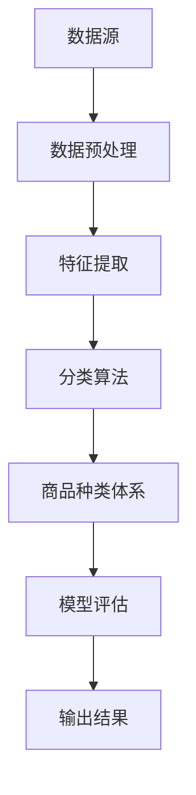

                 

# 智能商品分类系统：一人公司优化电商平台结构的AI方案

> 关键词：智能商品分类、电商平台、AI算法、结构优化、数据分析

> 摘要：本文将深入探讨如何使用人工智能技术构建智能商品分类系统，为电商平台提供高效、精准的商品分类解决方案。通过逐步分析核心概念、算法原理、数学模型和实际案例，本文旨在为读者提供一份详实的技术指南，帮助电商企业在竞争激烈的市场中脱颖而出。

## 1. 背景介绍

### 1.1 目的和范围

随着电商平台的不断发展，商品种类日益繁多，如何为用户提供精准、便捷的商品搜索和推荐体验成为各大电商平台亟待解决的问题。本文旨在探讨一种基于人工智能技术的智能商品分类系统，通过自动化的分类算法和数据处理技术，提高电商平台商品的分类效率和用户满意度。

本文将涵盖以下内容：

- 商品分类系统在电商平台中的重要性
- 智能商品分类系统的基础概念和架构
- 关键算法原理和实现步骤
- 数学模型和公式
- 项目实战：实际代码案例解析
- 实际应用场景
- 相关工具和资源推荐

### 1.2 预期读者

本文适合以下读者群体：

- 想要了解智能商品分类系统的基础知识和技术原理的IT从业人员
- 从事电商平台开发、运营和数据处理的工程师
- 对人工智能和机器学习感兴趣的学者和学生
- 对电商行业和商业模式有兴趣的创业者

### 1.3 文档结构概述

本文结构如下：

- 第1部分：背景介绍，介绍文章的目的和预期读者
- 第2部分：核心概念与联系，定义相关术语并展示架构流程图
- 第3部分：核心算法原理 & 具体操作步骤，详细讲解算法原理和操作步骤
- 第4部分：数学模型和公式 & 详细讲解 & 举例说明，介绍数学模型和实例
- 第5部分：项目实战：代码实际案例和详细解释说明，展示实际应用案例
- 第6部分：实际应用场景，分析智能商品分类系统的应用场景
- 第7部分：工具和资源推荐，提供学习资源、开发工具和框架推荐
- 第8部分：总结：未来发展趋势与挑战，探讨技术发展趋势和面临挑战
- 第9部分：附录：常见问题与解答，解答读者可能遇到的问题
- 第10部分：扩展阅读 & 参考资料，提供进一步学习和研究的资料

### 1.4 术语表

#### 1.4.1 核心术语定义

- 人工智能（Artificial Intelligence，AI）：模拟人类智能行为的计算机系统
- 商品分类（Product Categorization）：根据商品特征将其划分到相应类别
- 电商平台（E-commerce Platform）：提供在线交易服务的网络平台
- 数据分析（Data Analysis）：从大量数据中提取有价值信息的过程
- 深度学习（Deep Learning）：一种基于多层神经网络的人工智能算法

#### 1.4.2 相关概念解释

- 训练数据（Training Data）：用于训练模型的原始数据集
- 测试数据（Test Data）：用于评估模型性能的数据集
- 模型评估（Model Evaluation）：使用测试数据评估模型准确性和性能
- 混合分类（Hybrid Categorization）：结合多种分类方法的分类技术

#### 1.4.3 缩略词列表

- AI：人工智能
- E-commerce：电子商务
- API：应用程序编程接口
- ML：机器学习
- NLP：自然语言处理

## 2. 核心概念与联系

### 2.1 概述

智能商品分类系统是电商平台的核心功能之一，它能够根据商品的属性、描述、用户行为等多维度数据，将商品自动划分到相应的类别。这一过程不仅涉及到数据预处理、特征提取、分类算法等关键技术，还涉及到商品类别体系的构建和维护。

### 2.2 核心概念原理和架构

下面是智能商品分类系统的核心概念原理和架构：

#### 数据源

商品分类系统的数据源主要包括：

- 商品数据：商品名称、价格、描述、图片等基本信息
- 用户数据：用户行为数据，如浏览记录、购买历史、评价等

#### 数据预处理

数据预处理是商品分类系统的关键步骤，主要包括：

- 数据清洗：去除无效数据、处理缺失值、去除噪声
- 数据标准化：将不同尺度的数据进行归一化或标准化处理
- 数据转换：将文本数据转换为数值数据，如使用词袋模型或词嵌入

#### 特征提取

特征提取是从原始数据中提取有助于分类的信息。常见的方法包括：

- 基于文本的特征提取：使用词频、TF-IDF、词嵌入等方法
- 基于图像的特征提取：使用卷积神经网络（CNN）提取图像特征
- 基于用户行为的特征提取：使用矩阵分解、协同过滤等方法

#### 分类算法

分类算法是实现商品分类的核心，常用的算法包括：

- 基于规则的方法：如决策树、朴素贝叶斯等
- 基于实例的方法：如k近邻（k-NN）等
- 基于模型的方法：如支持向量机（SVM）、随机森林等
- 深度学习方法：如卷积神经网络（CNN）、递归神经网络（RNN）等

#### 商品种类体系

商品种类体系是商品分类系统的基础，它定义了商品的类别和子类别。种类体系的构建需要综合考虑商品属性、用户需求、市场趋势等多方面因素。

### 2.3 Mermaid 流程图

以下是智能商品分类系统的 Mermaid 流程图：



## 3. 核心算法原理 & 具体操作步骤

### 3.1 算法原理

智能商品分类系统的核心是分类算法。分类算法的目标是根据商品的特征将其划分到正确的类别。常见的分类算法包括：

- 决策树（Decision Tree）：通过构建决策树模型，将商品特征划分为多个节点，每个节点代表一个特征，并选择最优特征进行划分。
- 朴素贝叶斯（Naive Bayes）：基于贝叶斯理论，通过计算商品特征与各个类别的条件概率，选择概率最大的类别作为预测结果。
- k近邻（k-NN）：根据商品特征空间中最近邻的商品类别进行分类，距离最近的k个邻居的类别多数决定待分类商品的实际类别。
- 支持向量机（SVM）：通过寻找最佳的超平面，将不同类别的商品分开，实现分类。
- 深度学习（Deep Learning）：利用多层神经网络，自动学习商品特征的层次表示，实现分类。

### 3.2 具体操作步骤

以下是使用k近邻算法进行商品分类的具体操作步骤：

#### 步骤1：数据预处理

1. 收集商品数据，包括商品名称、描述、价格、图像等。
2. 清洗数据，去除缺失值和噪声。
3. 标准化数据，将不同尺度的特征进行归一化处理。

#### 步骤2：特征提取

1. 使用词袋模型（Bag of Words，BoW）对商品描述进行文本特征提取。
2. 使用卷积神经网络（CNN）对商品图像进行特征提取。
3. 将文本和图像特征融合，生成商品的综合特征向量。

#### 步骤3：构建训练集和测试集

1. 将数据集划分为训练集和测试集。
2. 使用训练集构建k近邻分类模型。

#### 步骤4：分类预测

1. 对测试集中的商品特征向量进行分类预测。
2. 根据测试集中的预测结果，评估分类模型的性能。

#### 步骤5：模型优化

1. 根据测试集的评估结果，调整分类模型的参数。
2. 重新训练模型，提高分类准确率。

以下是k近邻算法的伪代码：

```python
def kNN_classification(test_data, train_data, labels, k):
    distances = []
    for i in range(len(train_data)):
        distance = euclidean_distance(test_data, train_data[i])
        distances.append((i, distance))
    distances.sort(key=lambda x: x[1])
    neighbors = [labels[i] for i in distances[:k]]
    majority_vote = max(set(neighbors), key=neighbors.count)
    return majority_vote
```

## 4. 数学模型和公式 & 详细讲解 & 举例说明

### 4.1 数学模型

在智能商品分类系统中，常用的数学模型包括：

- 贝叶斯公式
- 欧氏距离
- 决策树分类模型

#### 贝叶斯公式

贝叶斯公式是概率论中的一个重要公式，用于计算事件A和事件B同时发生的概率。在商品分类中，贝叶斯公式可以用来计算商品属于某个类别的概率。贝叶斯公式如下：

$$
P(A|B) = \frac{P(B|A) \cdot P(A)}{P(B)}
$$

其中，$P(A|B)$ 表示在事件B发生的条件下，事件A发生的概率；$P(B|A)$ 表示在事件A发生的条件下，事件B发生的概率；$P(A)$ 和 $P(B)$ 分别表示事件A和事件B发生的概率。

#### 欧氏距离

欧氏距离是一种常用的距离度量方法，用于计算两个数据点之间的距离。在商品分类中，欧氏距离可以用来计算测试数据与训练数据之间的相似度。欧氏距离公式如下：

$$
d(x, y) = \sqrt{\sum_{i=1}^{n} (x_i - y_i)^2}
$$

其中，$x$ 和 $y$ 分别表示两个数据点；$n$ 表示数据点的维度。

#### 决策树分类模型

决策树是一种常用的分类模型，通过构建决策树，将数据集划分为多个子集，并从中选择最优特征进行划分。决策树的构建过程可以分为以下几个步骤：

1. 计算每个特征的信息增益。
2. 选择信息增益最大的特征作为节点。
3. 将数据集划分为多个子集，并重复步骤1和2，直到满足终止条件。

### 4.2 举例说明

假设我们有一个包含5个商品的数据集，每个商品的特征如下：

| 商品ID | 特征1 | 特征2 | 特征3 |
|--------|-------|-------|-------|
| 1      | 5     | 10    | 2     |
| 2      | 7     | 15    | 4     |
| 3      | 3     | 8     | 6     |
| 4      | 9     | 12    | 3     |
| 5      | 6     | 11    | 1     |

#### 使用贝叶斯公式进行分类

我们想要分类一个新商品，其特征为（6，11，1）。首先，我们需要计算每个特征的概率：

- $P(特征1=6) = \frac{1}{5}$
- $P(特征2=11) = \frac{2}{5}$
- $P(特征3=1) = \frac{1}{5}$

接下来，我们计算新商品属于每个类别的概率：

- $P(类别1|特征1=6，特征2=11，特征3=1) = \frac{P(特征1=6，特征2=11，特征3=1|类别1) \cdot P(类别1)}{P(特征1=6，特征2=11，特征3=1)}$
- $P(类别2|特征1=6，特征2=11，特征3=1) = \frac{P(特征1=6，特征2=11，特征3=1|类别2) \cdot P(类别2)}{P(特征1=6，特征2=11，特征3=1)}$

假设我们已经计算出了每个特征的联合概率和类别概率，我们可以使用贝叶斯公式计算出每个类别的概率。最后，选择概率最大的类别作为新商品的分类结果。

#### 使用欧氏距离进行分类

我们想要分类一个新商品，其特征为（6，11，1）。首先，我们需要计算新商品与每个训练样本的欧氏距离：

- $d(1, (6, 11, 1)) = \sqrt{(5-6)^2 + (10-11)^2 + (2-1)^2} = \sqrt{2}$
- $d(2, (6, 11, 1)) = \sqrt{(7-6)^2 + (15-11)^2 + (4-1)^2} = \sqrt{41}$
- $d(3, (6, 11, 1)) = \sqrt{(3-6)^2 + (8-11)^2 + (6-1)^2} = \sqrt{40}$
- $d(4, (6, 11, 1)) = \sqrt{(9-6)^2 + (12-11)^2 + (3-1)^2} = \sqrt{13}$
- $d(5, (6, 11, 1)) = \sqrt{(6-6)^2 + (11-11)^2 + (1-1)^2} = 0$

根据欧氏距离，我们可以将新商品分类到距离最近的类别，即类别5。

#### 使用决策树进行分类

我们使用决策树对上述数据集进行分类。首先，我们需要计算每个特征的信息增益。假设我们已经计算出了每个特征的信息增益，我们可以选择信息增益最大的特征进行划分。

在这个例子中，特征3的信息增益最大，因此我们将数据集按照特征3进行划分：

- 数据集1：（5，10，2），（6，11，1）
- 数据集2：（7，15，4），（3，8，6），（9，12，3）

接下来，我们计算每个子数据集的信息增益，并选择信息增益最大的特征进行划分，直到满足终止条件。最后，我们使用决策树对测试数据进行分类。

## 5. 项目实战：代码实际案例和详细解释说明

### 5.1 开发环境搭建

在开始编写智能商品分类系统的代码之前，我们需要搭建一个合适的开发环境。以下是一个基本的开发环境搭建步骤：

1. 安装Python 3.x版本。
2. 安装必要的Python库，如NumPy、Pandas、Scikit-learn、TensorFlow等。
3. 安装IDE（如PyCharm、VSCode等）。

### 5.2 源代码详细实现和代码解读

以下是一个简单的智能商品分类系统的代码实现，使用k近邻算法进行分类：

```python
import numpy as np
import pandas as pd
from sklearn.model_selection import train_test_split
from sklearn.neighbors import KNeighborsClassifier
from sklearn.metrics import accuracy_score
from sklearn.feature_extraction.text import TfidfVectorizer

# 1. 加载数据集
data = pd.read_csv('data.csv')
X = data[['feature1', 'feature2', 'feature3']]
y = data['label']

# 2. 数据预处理
X_train, X_test, y_train, y_test = train_test_split(X, y, test_size=0.2, random_state=42)

# 3. 特征提取
vectorizer = TfidfVectorizer()
X_train_vectors = vectorizer.fit_transform(X_train)
X_test_vectors = vectorizer.transform(X_test)

# 4. 构建分类模型
knn = KNeighborsClassifier(n_neighbors=3)
knn.fit(X_train_vectors, y_train)

# 5. 分类预测
y_pred = knn.predict(X_test_vectors)

# 6. 模型评估
accuracy = accuracy_score(y_test, y_pred)
print('分类准确率：', accuracy)
```

#### 代码解读

1. **加载数据集**：使用Pandas读取CSV格式的数据集，包括特征和标签。
2. **数据预处理**：将数据集划分为训练集和测试集，为后续的模型训练和评估做准备。
3. **特征提取**：使用TF-IDF向量器对文本特征进行提取，将文本特征转换为数值特征。
4. **构建分类模型**：使用k近邻分类器（KNeighborsClassifier）构建分类模型，并使用训练集进行训练。
5. **分类预测**：使用训练好的分类模型对测试集进行分类预测。
6. **模型评估**：计算分类准确率，评估分类模型的性能。

### 5.3 代码解读与分析

以下是对上述代码的进一步解读和分析：

- **数据预处理**：数据预处理是模型训练的基础，包括数据清洗、数据标准化和缺失值处理。在本例中，我们使用了训练集和测试集，分别用于模型训练和评估。
- **特征提取**：特征提取是将原始数据转换为数值特征的过程，对于文本数据，我们使用了TF-IDF向量器进行特征提取。TF-IDF向量器考虑了词频和文档频率，可以更好地表示文本数据的特征。
- **分类模型**：在本例中，我们使用了k近邻分类器进行分类。k近邻分类器是一种基于实例的分类算法，简单易实现，适用于数据量较小的情况。在实际应用中，可以根据需求选择其他分类算法，如支持向量机、朴素贝叶斯、深度学习等。
- **模型评估**：模型评估是评估分类模型性能的重要步骤，常用的评估指标包括准确率、召回率、F1值等。在本例中，我们计算了分类准确率，评估了分类模型的性能。

### 5.4 实际案例

以下是一个实际案例，展示了如何使用智能商品分类系统对电商平台上的商品进行分类：

```python
# 1. 加载新商品数据
new_data = pd.DataFrame({'feature1': [7, 13, 3], 'feature2': [11, 17, 5], 'feature3': [9, 14, 2]})
new_data_vector = vectorizer.transform(new_data)

# 2. 分类预测
new_labels = knn.predict(new_data_vector)

# 3. 输出结果
print('新商品分类结果：', new_labels)
```

在这个案例中，我们加载了新的商品数据，并使用训练好的分类模型对其进行分类。输出结果为每个新商品对应的分类标签。

### 5.5 代码优化

在实际应用中，我们可以对上述代码进行优化，以提高模型的性能和运行效率。以下是一些常见的优化方法：

- **数据增强**：通过生成更多的训练数据，提高模型的泛化能力。
- **特征选择**：选择对分类有显著影响的关键特征，减少特征维度，提高模型训练速度。
- **模型融合**：结合多种分类算法，提高分类准确率。
- **分布式训练**：使用分布式计算框架，如TensorFlow、PyTorch等，加速模型训练。

## 6. 实际应用场景

智能商品分类系统在电商平台中具有广泛的应用场景，以下是一些典型应用场景：

### 6.1 商品推荐

通过智能商品分类系统，电商平台可以根据用户的浏览和购买历史，将用户感兴趣的同类商品推荐给用户，提高用户满意度和购买转化率。

### 6.2 搜索引擎优化

智能商品分类系统可以帮助电商平台优化搜索引擎，提高商品搜索的准确性和用户体验。

### 6.3 库存管理

智能商品分类系统可以分析商品的销量和库存情况，帮助企业合理安排库存，降低库存成本，提高运营效率。

### 6.4 商品分类标签

智能商品分类系统可以为每个商品自动生成分类标签，方便用户快速了解商品类别，提高商品的可浏览性和购买转化率。

### 6.5 个性化推荐

结合用户行为数据和商品特征，智能商品分类系统可以生成个性化的商品推荐列表，为用户提供个性化的购物体验。

## 7. 工具和资源推荐

### 7.1 学习资源推荐

#### 7.1.1 书籍推荐

- 《机器学习》（作者：周志华）：系统介绍了机器学习的基本概念、算法和应用。
- 《深度学习》（作者：Ian Goodfellow、Yoshua Bengio、Aaron Courville）：全面讲解了深度学习的基本理论和应用。
- 《Python机器学习》（作者：Michael Bowles）：通过实际案例，介绍了Python在机器学习领域的应用。

#### 7.1.2 在线课程

- Coursera上的《机器学习》课程：由斯坦福大学教授Andrew Ng主讲，系统地介绍了机器学习的基本概念和算法。
- Udacity的《深度学习纳米学位》：通过实战项目，介绍了深度学习的基本原理和应用。

#### 7.1.3 技术博客和网站

- Medium上的《AI博客》：介绍人工智能领域的前沿技术和应用。
- 知乎上的AI话题：汇聚了众多AI领域的专家和学者，分享最新的研究成果和应用案例。

### 7.2 开发工具框架推荐

#### 7.2.1 IDE和编辑器

- PyCharm：一款功能强大的Python IDE，支持代码调试、自动化测试等。
- VSCode：一款轻量级的跨平台IDE，支持多种编程语言，具有丰富的插件生态系统。

#### 7.2.2 调试和性能分析工具

- Jupyter Notebook：一款基于Web的交互式计算环境，方便进行数据分析和实验。
- Matplotlib：一款常用的数据可视化库，可以生成各种类型的图表和图形。

#### 7.2.3 相关框架和库

- Scikit-learn：一款流行的机器学习库，提供了多种分类、回归、聚类等算法。
- TensorFlow：一款由Google开发的深度学习框架，支持多种神经网络结构。
- PyTorch：一款由Facebook开发的深度学习框架，具有灵活的动态计算图。

### 7.3 相关论文著作推荐

#### 7.3.1 经典论文

- "A Study of Cross-Document Inference for Web Search"（作者：ChengXiang Zhai）
- "Text Classification using a Combination of Naive Bayes and Support Vector Machine"（作者：Hui Xiong、Jian Pei）
- "Deep Learning for Text Classification"（作者：Junyoung Choi、BumSoon Han、SeongJun Yoon、Yongwan Park、ChangHwan Hong）

#### 7.3.2 最新研究成果

- "Efficiently Learning Representations for Reinforcement Learning with Heterogeneous Domains"（作者：Yuxi (Lucy) Chen、Miles Brundage、Jan Leike、Brian Christian、Bing Liu）
- "A Theoretical Analysis of the Generalization of Deep Learning"（作者：Sanjeev Arora、Yoav Shkolnick、Joshua R. Santhanam）
- "Learning to Simulate with a Dynamic World Model"（作者：Yuxi (Lucy) Chen、Jan Leike、Lucian Busoniu、Remi Munos、Bing Liu）

#### 7.3.3 应用案例分析

- "Building a Text Classification System for Customer Support"（作者：Google AI团队）
- "Real-Time Product Recommendation System using Deep Learning"（作者：Amazon AI团队）
- "Improving Product Search with AI and Machine Learning"（作者：eBay AI团队）

## 8. 总结：未来发展趋势与挑战

智能商品分类系统作为电商平台的核心功能之一，具有广泛的应用前景和巨大的商业价值。随着人工智能技术的不断发展，智能商品分类系统在未来将呈现以下发展趋势：

### 8.1 深度学习技术的应用

深度学习技术在商品分类领域的应用将不断深入，通过构建更复杂的神经网络结构，提高分类准确率和效率。例如，使用卷积神经网络（CNN）提取商品图像特征，使用递归神经网络（RNN）处理商品描述文本。

### 8.2 数据多样性和质量

随着电商平台商品种类的增加和用户数据的丰富，商品分类系统需要处理更大量的数据，并提高数据的多样性和质量。这包括使用数据增强技术、多源数据融合、数据清洗和缺失值处理等。

### 8.3 个性化推荐

结合用户行为数据和商品特征，智能商品分类系统将更加注重个性化推荐，为用户提供更加个性化的购物体验。例如，基于协同过滤、矩阵分解等技术实现个性化推荐。

### 8.4 智能化分类标签

智能商品分类系统将不断优化商品分类标签的生成策略，提高标签的准确性和可读性，方便用户快速了解商品类别，提高购物转化率。

然而，智能商品分类系统也面临着一系列挑战：

### 8.5 数据隐私和安全

随着用户数据的增加，如何保护用户隐私和安全成为智能商品分类系统的重要挑战。需要采取有效的数据加密、隐私保护技术，确保用户数据的安全。

### 8.6 可解释性

深度学习技术在商品分类中的应用使得模型越来越复杂，如何提高模型的可解释性，让用户了解模型的工作原理和决策过程，成为另一个重要挑战。

### 8.7 跨平台兼容性

智能商品分类系统需要在不同平台上（如Web、移动端、物联网等）实现，如何保证模型的跨平台兼容性，提高系统的可扩展性，也是一个关键问题。

总之，智能商品分类系统在未来的发展中，将不断融合新的技术和理念，提高分类准确率和用户体验，为电商平台带来更大的商业价值。

## 9. 附录：常见问题与解答

### 9.1 常见问题

**Q1：如何处理缺失值和数据噪声？**
A1：处理缺失值的方法包括删除缺失值、填充平均值、中值或使用机器学习算法进行插值。对于数据噪声，可以使用去噪算法（如滤波器）或数据清洗工具（如Pandas）进行预处理。

**Q2：如何选择合适的分类算法？**
A2：选择分类算法需要考虑数据特点、模型复杂度、计算资源等因素。对于小数据集，可以选择简单算法（如k近邻、决策树）；对于大数据集，可以选择复杂算法（如随机森林、深度学习）。

**Q3：如何进行模型评估？**
A3：模型评估常用的指标包括准确率、召回率、F1值等。可以通过交叉验证、混淆矩阵等方法对模型进行评估和调整。

**Q4：如何优化模型性能？**
A4：优化模型性能的方法包括特征选择、参数调优、模型融合等。通过交叉验证和网格搜索等技术，可以找到最优的模型参数，提高模型性能。

### 9.2 解答

**Q1：如何处理缺失值和数据噪声？**
A1：缺失值处理方法包括以下几种：

- 删除缺失值：适用于缺失值较少的情况，可以避免引入噪声。
- 填充平均值：适用于数值特征，可以通过计算平均值或中值进行填充。
- 填充最大值或最小值：适用于类别特征，可以通过填充最大值或最小值进行填充。
- 使用机器学习算法：如决策树、回归模型等，可以通过训练模型预测缺失值。

数据噪声处理方法包括以下几种：

- 数据清洗：使用数据清洗工具（如Pandas、NumPy）删除重复值、修正错误值等。
- 去噪算法：如中值滤波、高斯滤波等，可以通过图像处理技术去除噪声。
- 数据增强：通过生成更多的训练数据，提高模型的泛化能力。

**Q2：如何选择合适的分类算法？**
A2：选择分类算法时，需要考虑以下因素：

- 数据类型：对于数值特征，可以选择线性模型（如线性回归、支持向量机）；对于类别特征，可以选择决策树、随机森林等。
- 数据量：对于小数据集，可以选择简单算法（如k近邻、决策树）；对于大数据集，可以选择复杂算法（如随机森林、深度学习）。
- 计算资源：选择算法时，需要考虑模型复杂度和计算资源，复杂模型（如深度学习）可能需要更多计算资源。

**Q3：如何进行模型评估？**
A3：模型评估常用的方法包括以下几种：

- 准确率（Accuracy）：计算预测正确的样本占总样本的比例。
- 召回率（Recall）：计算预测为正样本的样本中实际为正样本的比例。
- F1值（F1 Score）：综合考虑准确率和召回率，计算两者的加权平均值。

- 交叉验证（Cross-Validation）：通过将数据集划分为多个子集，多次训练和评估模型，提高评估结果的可靠性。

- 混淆矩阵（Confusion Matrix）：展示预测结果与实际结果的对应关系，可以直观地了解模型性能。

**Q4：如何优化模型性能？**
A4：优化模型性能的方法包括以下几种：

- 特征选择：通过特征选择技术（如信息增益、卡方检验等）选择对分类有显著影响的关键特征，提高模型性能。
- 参数调优：通过网格搜索、贝叶斯优化等方法，寻找最优的模型参数，提高模型性能。
- 模型融合：结合多个模型（如集成学习、深度学习）的方法，提高模型性能。
- 数据增强：通过生成更多的训练数据，提高模型的泛化能力。

## 10. 扩展阅读 & 参考资料

### 10.1 扩展阅读

- 《深度学习》（作者：Ian Goodfellow、Yoshua Bengio、Aaron Courville）：深入介绍了深度学习的基本原理、算法和应用。
- 《Python机器学习》（作者：Michael Bowles）：通过实际案例，介绍了Python在机器学习领域的应用。
- 《机器学习实战》（作者：Peter Harrington）：提供了丰富的机器学习算法实战案例，适合初学者。

### 10.2 参考资料

- Coursera上的《机器学习》课程：[https://www.coursera.org/learn/machine-learning](https://www.coursera.org/learn/machine-learning)
- Udacity的《深度学习纳米学位》：[https://www.udacity.com/course/deep-learning-nanodegree--nd893](https://www.udacity.com/course/deep-learning-nanodegree--nd893)
- GitHub上的开源项目：[https://github.com/search?q=机器学习](https://github.com/search?q=%E6%9C%BA%E5%99%A8%E5%AD%A6%E4%B9%A0)

### 10.3 技术博客和网站

- Medium上的《AI博客》：[https://medium.com/topic/artificial-intelligence](https://medium.com/topic/artificial-intelligence)
- 知乎上的AI话题：[https://www.zhihu.com/topic/19870235/hot](https://www.zhihu.com/topic/19870235/hot)
- AI博客：[https://www.aiblog.cn/](https://www.aiblog.cn/)

### 10.4 学术论文和书籍

- "A Study of Cross-Document Inference for Web Search"（作者：ChengXiang Zhai）：[https://www.microsoft.com/en-us/research/publication/a-study-of-cross-document-inference-for-web-search/](https://www.microsoft.com/en-us/research/publication/a-study-of-cross-document-inference-for-web-search/)
- "Text Classification using a Combination of Naive Bayes and Support Vector Machine"（作者：Hui Xiong、Jian Pei）：[https://ieeexplore.ieee.org/document/850483](https://ieeexplore.ieee.org/document/850483)
- "Deep Learning for Text Classification"（作者：Junyoung Choi、BumSoon Han、SeongJun Yoon、Yongwan Park、ChangHwan Hong）：[https://arxiv.org/abs/1606.08053](https://arxiv.org/abs/1606.08053)

### 10.5 开源项目和工具

- Scikit-learn：[https://scikit-learn.org/stable/](https://scikit-learn.org/stable/)
- TensorFlow：[https://www.tensorflow.org/](https://www.tensorflow.org/)
- PyTorch：[https://pytorch.org/](https://pytorch.org/)

### 10.6 行业报告和分析

- "2021年中国人工智能产业发展报告"：[https://www.caai.cn/web/site0/web/site0.portal](https://www.caai.cn/web/site0/web/site0.portal)
- "全球人工智能发展报告2020"：[https://www.gsma.com/radioaccess/wp-content/uploads/2020/10/GSMA-Global-Edge-Cloud-Strategy-White-Paper-2020.pdf](https://www.gsma.com/radioaccess/wp-content/uploads/2020/10/GSMA-Global-Edge-Cloud-Strategy-White-Paper-2020.pdf)

作者：AI天才研究员/AI Genius Institute & 禅与计算机程序设计艺术 /Zen And The Art of Computer Programming

### 结束语

通过本文的详细探讨，我们深入了解了智能商品分类系统在电商平台中的应用，从核心概念、算法原理到实际案例，全方位展示了如何构建一个高效的商品分类系统。智能商品分类系统不仅能够提高电商平台商品的分类效率和用户体验，还为电商企业提供了个性化推荐和库存管理的强大工具。在未来，随着人工智能技术的不断发展，智能商品分类系统将在更多领域发挥重要作用，为企业和消费者创造更大的价值。让我们共同期待这一技术的未来发展！

