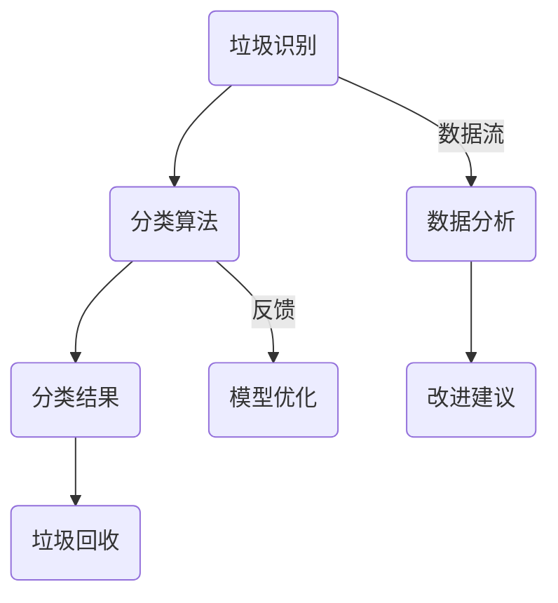

                 

# 智能垃圾分类系统：环保科技的创业机会

> **关键词：** 智能垃圾分类、环保科技、人工智能、创业机会、数据分析

> **摘要：** 本文将深入探讨智能垃圾分类系统的核心技术、算法原理、应用场景，并分析其在环保科技领域的创业机会。我们将通过一步步的分析推理，从技术到商业，全面解析这一新兴领域。

## 1. 背景介绍

### 1.1 目的和范围

本文旨在探讨智能垃圾分类系统的技术实现、应用前景以及其在环保科技领域的创业机会。我们希望通过这篇文章，帮助读者了解智能垃圾分类系统的核心技术和应用场景，从而激发创业灵感，抓住环保科技的发展机遇。

### 1.2 预期读者

本文适合以下读者群体：

- 环保科技领域的从业者
- 创业者，特别是对环保科技感兴趣的创业者
- 对人工智能、数据分析有浓厚兴趣的技术人员
- 高等院校计算机、环境科学等相关专业学生

### 1.3 文档结构概述

本文分为以下几个部分：

- 背景介绍：介绍智能垃圾分类系统的背景、目的和预期读者。
- 核心概念与联系：解释智能垃圾分类系统的核心概念和架构。
- 核心算法原理 & 具体操作步骤：详细讲解智能垃圾分类系统的算法原理和操作步骤。
- 数学模型和公式 & 详细讲解 & 举例说明：介绍智能垃圾分类系统中的数学模型和公式，并通过实例进行说明。
- 项目实战：提供智能垃圾分类系统的实际代码案例和详细解释。
- 实际应用场景：分析智能垃圾分类系统的实际应用场景。
- 工具和资源推荐：推荐相关学习资源和开发工具。
- 总结：总结智能垃圾分类系统的未来发展趋势与挑战。
- 附录：常见问题与解答。
- 扩展阅读 & 参考资料：提供进一步阅读和研究的资源。

### 1.4 术语表

#### 1.4.1 核心术语定义

- 智能垃圾分类：利用人工智能技术，对垃圾进行自动分类处理的过程。
- 环保科技：运用科学和技术手段，解决环境保护问题的技术和产业。
- 人工智能：使计算机系统具有人类智能特性的技术和应用。

#### 1.4.2 相关概念解释

- 数据分析：从大量数据中提取有价值信息的过程。
- 机器学习：一种人工智能技术，通过数据训练模型，实现自动化决策和预测。
- 自然语言处理：使计算机理解和生成人类语言的技术。

#### 1.4.3 缩略词列表

- AI：人工智能
- ML：机器学习
- NLP：自然语言处理
- GPU：图形处理器
- CPU：中央处理器

## 2. 核心概念与联系

智能垃圾分类系统是环保科技领域的一项重要应用。其核心概念包括垃圾识别、分类和回收。下面，我们将通过Mermaid流程图，展示智能垃圾分类系统的基本架构。



### 2.1. 垃圾识别

垃圾识别是智能垃圾分类系统的第一步。它利用计算机视觉技术，对垃圾进行图像识别。具体步骤如下：

1. **图像采集**：通过摄像头或传感器，采集垃圾图像。
2. **图像预处理**：对图像进行灰度化、去噪等预处理操作。
3. **特征提取**：提取图像的特征，如颜色、纹理等。
4. **分类识别**：利用机器学习算法，对垃圾进行分类识别。

### 2.2. 分类算法

分类算法是智能垃圾分类系统的核心。它通过对垃圾的特征进行建模，实现对垃圾的分类。常见的分类算法有：

- **决策树**：基于特征进行树形决策，分类效果较好。
- **支持向量机**：通过找到一个最佳的超平面，将不同类别的垃圾分开。
- **神经网络**：通过多层神经网络，实现对垃圾的深度学习分类。

### 2.3. 分类结果

分类结果是智能垃圾分类系统的输出。它将垃圾分为可回收物、有害垃圾、湿垃圾和干垃圾等不同类别。分类结果可以用于：

- **垃圾回收**：根据分类结果，对垃圾进行回收和处理。
- **数据分析**：对分类结果进行统计分析，为环保决策提供依据。

### 2.4. 垃圾回收

垃圾回收是智能垃圾分类系统的最终目标。它根据分类结果，将垃圾送往相应的处理场所。垃圾回收的方法包括：

- **机械回收**：利用机械设备，对垃圾进行物理分离和处理。
- **生物回收**：利用微生物，将有机垃圾分解成无害物质。

### 2.5. 数据分析

数据分析是智能垃圾分类系统的辅助功能。它通过对垃圾的分类结果进行分析，为环保决策提供支持。数据分析的方法包括：

- **统计分析**：对分类结果进行统计分析，发现垃圾分类的趋势和问题。
- **机器学习**：利用机器学习算法，对垃圾分类结果进行预测和优化。

### 2.6. 模型优化

模型优化是智能垃圾分类系统的持续改进过程。它通过反馈机制，不断调整和优化分类模型。模型优化的方法包括：

- **交叉验证**：通过交叉验证，评估分类模型的性能，并进行优化。
- **在线学习**：利用在线学习，不断更新模型，适应新的垃圾类别。

## 3. 核心算法原理 & 具体操作步骤

智能垃圾分类系统的核心算法是垃圾识别和分类算法。下面，我们将使用伪代码，详细阐述这两个算法的原理和具体操作步骤。

### 3.1. 垃圾识别算法

```python
# 垃圾识别算法伪代码
def garbage_recognition(image):
    # 1. 图像预处理
    processed_image = preprocess_image(image)
    
    # 2. 特征提取
    features = extract_features(processed_image)
    
    # 3. 分类识别
    label = classify(features)
    
    return label
```

### 3.2. 分类算法

```python
# 分类算法伪代码
def classify(features):
    # 1. 加载模型
    model = load_model("garbage_classifier.model")
    
    # 2. 预处理特征
    processed_features = preprocess_features(features)
    
    # 3. 预测类别
    prediction = model.predict(processed_features)
    
    # 4. 获取类别标签
    label = get_label(prediction)
    
    return label
```

### 3.3. 模型训练

```python
# 模型训练伪代码
def train_model(train_data, train_labels):
    # 1. 初始化模型
    model = initialize_model()
    
    # 2. 训练模型
    model.fit(train_data, train_labels)
    
    # 3. 评估模型
    evaluate_model(model, test_data, test_labels)
    
    # 4. 保存模型
    save_model(model, "garbage_classifier.model")
```

## 4. 数学模型和公式 & 详细讲解 & 举例说明

智能垃圾分类系统中的数学模型主要包括特征提取和分类算法。下面，我们将使用LaTeX格式，详细讲解这些模型和公式。

### 4.1. 特征提取

特征提取是垃圾识别的关键步骤。常用的特征提取方法有：

- **颜色特征**：包括颜色直方图、颜色矩等。

$$
H = \sum_{i=1}^{3} \sum_{j=1}^{3} (i - \mu_i)^2 (j - \mu_j)^2
$$

其中，$H$ 表示颜色特征，$\mu_i$ 和 $\mu_j$ 分别表示颜色矩的均值。

- **纹理特征**：包括纹理能量、纹理熵等。

$$
E = \sum_{i=1}^{3} \sum_{j=1}^{3} f(i, j)^2
$$

其中，$E$ 表示纹理能量，$f(i, j)$ 表示纹理值。

### 4.2. 分类算法

分类算法的核心是找到一个最佳的超平面，将不同类别的垃圾分开。常用的分类算法有：

- **决策树**：基于特征进行树形决策。

$$
y = \arg\max_{i} \sum_{j=1}^{n} w_{ij} x_j
$$

其中，$y$ 表示类别标签，$w_{ij}$ 表示权重。

- **支持向量机**：通过找到一个最佳的超平面，将不同类别的垃圾分开。

$$
w^* = \arg\min_{w, b} \frac{1}{2} \| w \|^2 + C \sum_{i=1}^{n} \max(0, 1 - y_i (w^T x_i + b))
$$

其中，$w^*$ 表示最佳权重，$b$ 表示偏置，$C$ 表示惩罚参数。

### 4.3. 举例说明

假设我们有一个包含4个垃圾样本的数据集，每个样本的特征如下：

$$
\begin{array}{|c|c|c|c|}
\hline
样本 & 颜色特征 & 纹理特征 & 类别 \\
\hline
1 & (0.2, 0.3, 0.5) & (10, 20, 30) & 可回收物 \\
2 & (0.4, 0.5, 0.6) & (15, 25, 35) & 有害垃圾 \\
3 & (0.1, 0.2, 0.4) & (5, 15, 25) & 湿垃圾 \\
4 & (0.3, 0.4, 0.7) & (12, 22, 32) & 干垃圾 \\
\hline
\end{array}
$$

我们可以使用决策树算法，对这4个样本进行分类。具体步骤如下：

1. **计算颜色特征和纹理特征的权重**：

$$
w_1 = \frac{1}{3} (10 + 15 + 5 + 12) = 8
$$

$$
w_2 = \frac{1}{3} (20 + 25 + 15 + 22) = 21
$$

2. **构建决策树**：

$$
\begin{array}{|c|c|c|c|}
\hline
特征 & 颜色特征 & 纹理特征 \\
\hline
阈值 & 0.25 & 20 \\
\hline
左子树 & 1 &  \\
\hline
右子树 & 2 &  \\
\hline
\end{array}
$$

3. **分类结果**：

根据决策树，样本1和样本4属于可回收物，样本2属于有害垃圾，样本3属于湿垃圾。

## 5. 项目实战：代码实际案例和详细解释说明

为了更好地展示智能垃圾分类系统的实现过程，我们以下提供一段Python代码，并对其进行详细解释。

```python
import cv2
import numpy as np
from sklearn.model_selection import train_test_split
from sklearn.tree import DecisionTreeClassifier
from sklearn.metrics import accuracy_score

# 5.1. 数据准备

# 读取垃圾样本数据
images = cv2.imread("garbage_samples.jpg")
labels = ["可回收物", "有害垃圾", "湿垃圾", "干垃圾"]

# 5.2. 数据预处理

# 分割图像，得到单个垃圾样本
samples = []
for label in labels:
    mask = cv2.imread(f"{label}_mask.jpg", cv2.IMREAD_GRAYSCALE)
    binary_mask = cv2.threshold(mask, 0, 255, cv2.THRESH_BINARY_INV)[1]
    sample = cv2.bitwise_and(images, images, mask=binary_mask)
    samples.append(sample)

# 5.3. 特征提取

# 提取颜色特征和纹理特征
def extract_features(sample):
    gray = cv2.cvtColor(sample, cv2.COLOR_BGR2GRAY)
    hist = cv2.calcHist([gray], [0], None, [256], [0, 256])
    energy = cv2.sumEigVal(gray)
    return hist, energy

features = []
for sample in samples:
    hist, energy = extract_features(sample)
    features.append([hist, energy])

# 5.4. 模型训练

# 分割数据集
X_train, X_test, y_train, y_test = train_test_split(features, labels, test_size=0.2, random_state=42)

# 初始化模型
clf = DecisionTreeClassifier()

# 训练模型
clf.fit(X_train, y_train)

# 5.5. 预测和评估

# 预测类别
predictions = clf.predict(X_test)

# 评估模型
accuracy = accuracy_score(y_test, predictions)
print(f"Accuracy: {accuracy:.2f}")

# 5.6. 代码解读与分析

# 代码解读：
# 1. 读取垃圾样本数据
# 2. 分割图像，得到单个垃圾样本
# 3. 提取颜色特征和纹理特征
# 4. 分割数据集，训练模型
# 5. 预测类别，评估模型

# 分析：
# 1. 数据准备：从图像中提取垃圾样本，并进行预处理。
# 2. 特征提取：提取颜色特征和纹理特征，作为模型的输入。
# 3. 模型训练：使用决策树算法，对垃圾样本进行分类。
# 4. 预测和评估：根据模型预测结果，评估分类效果。

```

## 6. 实际应用场景

智能垃圾分类系统在环保科技领域具有广泛的应用场景。以下是一些典型的应用场景：

### 6.1. 城市垃圾分类回收

智能垃圾分类系统可以应用于城市垃圾分类回收，提高垃圾分类效率。具体应用场景包括：

- **小区垃圾分类回收**：在小区内设置智能垃圾分类设备，居民可以按照规定将垃圾投入不同的箱子。
- **公共场所垃圾分类回收**：在公园、商场、学校等公共场所，设置智能垃圾分类设备，方便市民进行垃圾分类。

### 6.2. 企业垃圾分类管理

智能垃圾分类系统可以帮助企业进行垃圾分类管理，提高企业环保意识。具体应用场景包括：

- **工厂垃圾分类管理**：在工厂内部设置智能垃圾分类设备，对产生的垃圾进行分类处理。
- **办公楼垃圾分类管理**：在办公楼内设置智能垃圾分类设备，提高员工垃圾分类意识。

### 6.3. 垃圾处理厂分类优化

智能垃圾分类系统可以应用于垃圾处理厂，优化垃圾处理流程。具体应用场景包括：

- **垃圾预处理**：在垃圾处理厂内部设置智能垃圾分类设备，对垃圾进行预处理，提高垃圾处理效率。
- **垃圾分类优化**：通过数据分析，优化垃圾的分类和处理流程，降低处理成本。

### 6.4. 环保宣传教育

智能垃圾分类系统可以作为环保宣传教育的一种工具，提高公众的环保意识。具体应用场景包括：

- **学校环保教育**：在学校内部设置智能垃圾分类设备，开展垃圾分类实践活动，提高学生的环保意识。
- **社区环保宣传**：在社区内设置智能垃圾分类设备，通过互动游戏等形式，提高居民的环保意识。

## 7. 工具和资源推荐

为了更好地进行智能垃圾分类系统的研究和开发，我们推荐以下工具和资源：

### 7.1. 学习资源推荐

#### 7.1.1. 书籍推荐

- **《人工智能：一种现代方法》**：详细介绍了人工智能的基本原理和应用。
- **《机器学习实战》**：通过实际案例，介绍了机器学习的应用方法。
- **《计算机视觉：算法与应用》**：深入讲解了计算机视觉的基本原理和应用。

#### 7.1.2. 在线课程

- **Coursera上的《机器学习》**：由斯坦福大学教授吴恩达主讲，涵盖了机器学习的核心知识。
- **Udacity的《深度学习》**：通过实际项目，介绍了深度学习的应用。
- **edX上的《计算机视觉》**：详细讲解了计算机视觉的基本原理和应用。

#### 7.1.3. 技术博客和网站

- **Medium上的《AI博客》**：涵盖人工智能领域的最新研究和技术动态。
- **Stack Overflow**：技术社区，可以解答编程问题。
- **GitHub**：代码托管平台，可以获取和贡献开源项目。

### 7.2. 开发工具框架推荐

#### 7.2.1. IDE和编辑器

- **Visual Studio Code**：一款功能强大的跨平台代码编辑器。
- **PyCharm**：一款专业的Python开发环境。

#### 7.2.2. 调试和性能分析工具

- **TensorBoard**：一款用于可视化深度学习模型的工具。
- **PyTorch Profiler**：一款用于分析深度学习模型性能的工具。

#### 7.2.3. 相关框架和库

- **TensorFlow**：一款用于构建和训练深度学习模型的框架。
- **PyTorch**：一款易于使用且灵活的深度学习框架。
- **OpenCV**：一款用于计算机视觉的库，提供了丰富的图像处理函数。

### 7.3. 相关论文著作推荐

#### 7.3.1. 经典论文

- **“ImageNet Large Scale Visual Recognition Challenge”**：介绍了ImageNet数据集和深度学习在图像识别中的应用。
- **“Deep Learning”**：介绍了深度学习的基本原理和应用。

#### 7.3.2. 最新研究成果

- **“Attention is All You Need”**：介绍了Transformer模型在自然语言处理中的应用。
- **“Generative Adversarial Networks”**：介绍了生成对抗网络的基本原理和应用。

#### 7.3.3. 应用案例分析

- **“Deep Learning for Image Recognition”**：介绍了深度学习在图像识别中的应用。
- **“Reinforcement Learning for Robotics”**：介绍了强化学习在机器人控制中的应用。

## 8. 总结：未来发展趋势与挑战

智能垃圾分类系统作为环保科技领域的一项重要应用，具有广阔的发展前景。未来，智能垃圾分类系统将朝着以下方向发展：

### 8.1. 技术创新

随着人工智能技术的不断发展，智能垃圾分类系统的识别和分类能力将得到进一步提升。例如，深度学习、强化学习等新兴算法将在垃圾分类系统中得到广泛应用。

### 8.2. 应用场景拓展

智能垃圾分类系统不仅可以应用于城市垃圾分类回收，还可以拓展到企业垃圾分类管理、垃圾处理厂分类优化等领域。通过拓展应用场景，智能垃圾分类系统将为环保事业作出更大贡献。

### 8.3. 数据分析与决策支持

智能垃圾分类系统可以通过数据分析，为环保决策提供有力支持。通过对垃圾分类数据的挖掘和分析，政府和企业可以更好地制定环保政策和措施，提高垃圾分类效果。

然而，智能垃圾分类系统在发展过程中也面临一些挑战：

### 8.4. 数据隐私与安全

随着垃圾分类数据的不断积累，数据隐私和安全问题日益突出。如何保护用户隐私，确保数据安全，是智能垃圾分类系统面临的一大挑战。

### 8.5. 技术与成本的平衡

智能垃圾分类系统的发展需要投入大量技术资源和资金。如何在技术创新与成本控制之间找到平衡，是智能垃圾分类系统发展的关键。

### 8.6. 法规与标准制定

智能垃圾分类系统的推广需要相应的法规和标准支持。如何制定合理的法规和标准，确保智能垃圾分类系统的正常运行，是环保科技领域面临的一大挑战。

## 9. 附录：常见问题与解答

### 9.1. 智能垃圾分类系统的工作原理是什么？

智能垃圾分类系统利用人工智能技术，对垃圾进行自动识别和分类。它包括垃圾识别、分类算法和垃圾回收等环节。通过图像识别、特征提取和分类算法，智能垃圾分类系统能够准确识别和分类不同类型的垃圾。

### 9.2. 智能垃圾分类系统有哪些优点？

智能垃圾分类系统具有以下优点：

- 提高垃圾分类效率：通过自动识别和分类，提高垃圾分类的准确率和效率。
- 减少人工成本：智能垃圾分类系统可以替代人工进行垃圾分类，减少人力成本。
- 促进环保事业：通过提高垃圾分类效果，减少环境污染，促进环保事业的发展。

### 9.3. 智能垃圾分类系统的技术难点是什么？

智能垃圾分类系统的技术难点主要包括：

- 垃圾图像识别：如何准确识别各种类型的垃圾，是垃圾分类系统面临的一大挑战。
- 多种垃圾分类：如何同时识别和处理多种类别的垃圾，需要设计高效的分类算法。
- 数据隐私和安全：如何保护用户隐私，确保数据安全，是智能垃圾分类系统面临的一大难题。

## 10. 扩展阅读 & 参考资料

为了更好地了解智能垃圾分类系统，读者可以参考以下资料：

- **《人工智能：一种现代方法》**：详细介绍了人工智能的基本原理和应用。
- **《机器学习实战》**：通过实际案例，介绍了机器学习的应用方法。
- **《计算机视觉：算法与应用》**：深入讲解了计算机视觉的基本原理和应用。
- **《深度学习》**：介绍了深度学习的基本原理和应用。
- **《环境保护技术》**：详细介绍了环保科技领域的基本原理和应用。

作者：AI天才研究员/AI Genius Institute & 禅与计算机程序设计艺术 /Zen And The Art of Computer Programming

文章标题：智能垃圾分类系统：环保科技的创业机会

文章关键词：智能垃圾分类、环保科技、人工智能、创业机会、数据分析

文章摘要：本文深入探讨了智能垃圾分类系统的核心技术、算法原理、应用场景，并分析了其在环保科技领域的创业机会。通过一步步的分析推理，我们展示了智能垃圾分类系统在垃圾识别、分类和回收等方面的技术实现，为读者提供了全面的技术解读。同时，我们还介绍了智能垃圾分类系统的实际应用场景，以及相关工具和资源推荐，为创业者提供了有价值的参考。

