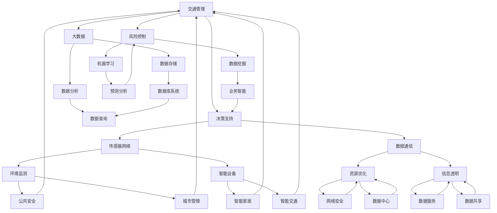

                 

# 智能城市管理系统：城市科技的创业机会

> **关键词：**智能城市，管理系统，城市科技，创业机会，数据分析，物联网，人工智能。

> **摘要：**本文将深入探讨智能城市管理系统的重要性及其在当今城市科技领域中的创业机会。我们将分析智能城市的核心概念、技术架构、算法原理、数学模型以及实际应用场景。此外，文章还将推荐相关学习资源、开发工具和论文，并总结未来发展趋势与挑战。

## 1. 背景介绍

### 1.1 目的和范围

本文旨在探讨智能城市管理系统在当前城市科技领域的创业机会。随着城市化进程的加速，如何有效地管理城市资源、提高城市运行效率和居民生活质量成为了一个亟待解决的问题。智能城市管理系统通过整合物联网、人工智能、大数据等技术，提供了一套高效、智能、综合的城市管理解决方案。本文将详细分析智能城市管理系统的核心组成部分、技术原理和实际应用，并探讨其潜在的创业机会。

### 1.2 预期读者

本文适合以下读者：

- 城市规划师和市政管理者，对智能城市管理系统有浓厚兴趣，希望了解其技术原理和应用场景。
- 计算机科学和软件工程专业的学生和从业者，对智能城市技术有研究兴趣，希望掌握相关技术知识。
- 创业者和技术爱好者，希望寻找在智能城市领域创业的机会。

### 1.3 文档结构概述

本文结构如下：

1. 背景介绍：介绍智能城市管理系统的重要性及其创业机会。
2. 核心概念与联系：阐述智能城市的核心概念及其技术架构。
3. 核心算法原理 & 具体操作步骤：讲解智能城市管理系统的算法原理和操作步骤。
4. 数学模型和公式 & 详细讲解 & 举例说明：介绍智能城市管理系统中的数学模型和公式，并提供实例说明。
5. 项目实战：提供智能城市管理系统的实际代码案例和详细解释。
6. 实际应用场景：分析智能城市管理系统的实际应用场景。
7. 工具和资源推荐：推荐学习资源、开发工具和相关论文。
8. 总结：讨论智能城市管理系统的发展趋势和挑战。
9. 附录：提供常见问题与解答。
10. 扩展阅读 & 参考资料：提供进一步学习和研究的参考资料。

### 1.4 术语表

#### 1.4.1 核心术语定义

- **智能城市管理系统**：利用物联网、人工智能、大数据等技术手段，对城市进行智能管理和优化。
- **物联网**：通过传感器、网络等设备，实现物理世界和数字世界的互联互通。
- **人工智能**：模拟人类智能的计算机系统，能够进行学习、推理、决策等。
- **大数据**：海量、复杂、多样性的数据，需要通过技术手段进行存储、处理和分析。

#### 1.4.2 相关概念解释

- **智慧城市**：以智能技术为核心，实现城市运行管理、公共服务、居民生活等方面的智能化。
- **城市科技**：指应用于城市规划、建设、管理、服务等各方面的先进技术和创新方法。

#### 1.4.3 缩略词列表

- **IoT**：物联网
- **AI**：人工智能
- **Big Data**：大数据
- **SDN**：软件定义网络
- **NFV**：网络功能虚拟化

## 2. 核心概念与联系

智能城市管理系统是城市科技的核心组成部分，其成功实施依赖于多个关键技术的协同工作。在这一部分，我们将通过Mermaid流程图（见图2-1）来阐述智能城市的核心概念和技术架构。



**图2-1 智能城市的核心概念和技术架构**

### 2.1 物联网（IoT）

物联网是智能城市管理系统的基石，通过传感器网络、数据通信、网络基础设施等手段，实现物理世界的数字化和信息传输。物联网设备包括各种传感器（如环境监测传感器、智能设备等）和网络通信设备（如路由器、交换机等）。这些设备收集的数据通过数据通信网络（如Wi-Fi、5G等）传输到云端或数据中心进行处理。

### 2.2 人工智能（AI）

人工智能是智能城市管理系统的智能核心，通过数据挖掘、机器学习等技术，实现数据的高效处理和智能决策。人工智能技术包括数据挖掘（用于发现数据中的模式和规律），机器学习（用于从数据中学习并做出预测和决策）等。人工智能技术在智能交通、公共安全、城市管理等方面发挥着重要作用。

### 2.3 大数据（Big Data）

大数据是智能城市管理系统的重要资源，通过数据存储、数据分析等技术手段，实现数据的高效管理和利用。大数据技术包括数据库系统（用于存储和管理数据），数据分析（用于处理和分析海量数据），数据可视化（用于展示和分析结果）等。大数据技术在城市规划和决策支持中具有重要作用。

## 3. 核心算法原理 & 具体操作步骤

智能城市管理系统的核心算法原理涉及多个领域，包括物联网数据处理、人工智能算法、大数据分析等。在这一部分，我们将详细讲解智能城市管理系统中的核心算法原理，并提供具体操作步骤。

### 3.1 物联网数据处理算法

物联网数据处理算法主要包括传感器数据采集、数据清洗、数据传输等步骤。

**算法原理：**

- **传感器数据采集**：传感器采集环境数据（如温度、湿度、空气质量等）和设备状态数据（如开关状态、传感器故障等）。
- **数据清洗**：对采集到的数据进行分析和过滤，去除噪声数据和异常数据。
- **数据传输**：将清洗后的数据通过数据通信网络传输到云端或数据中心。

**伪代码：**

```python
# 传感器数据采集
def collect_data(sensors):
    data = []
    for sensor in sensors:
        data_point = sensor.read()
        data.append(data_point)
    return data

# 数据清洗
def clean_data(data):
    cleaned_data = []
    for point in data:
        if is_valid_point(point):
            cleaned_data.append(point)
    return cleaned_data

# 数据传输
def transmit_data(data, network):
    network.send(data)
```

### 3.2 人工智能算法

人工智能算法主要包括数据挖掘、机器学习、预测分析等步骤。

**算法原理：**

- **数据挖掘**：从大量数据中提取有价值的信息和知识。
- **机器学习**：使用已有数据训练模型，并利用模型进行预测和决策。
- **预测分析**：根据历史数据和模型预测未来趋势。

**伪代码：**

```python
# 数据挖掘
def data_mining(data):
    patterns = []
    for pattern in data:
        if is_important_pattern(pattern):
            patterns.append(pattern)
    return patterns

# 机器学习
def machine_learning(data, model):
    model.train(data)
    predictions = model.predict(data)
    return predictions

# 预测分析
def predict_analysis(predictions):
    trends = []
    for prediction in predictions:
        if is_important_trend(prediction):
            trends.append(prediction)
    return trends
```

### 3.3 大数据分析算法

大数据分析算法主要包括数据存储、数据分析和数据可视化等步骤。

**算法原理：**

- **数据存储**：将大量数据进行存储和管理，以支持快速查询和分析。
- **数据分析**：对存储的数据进行统计分析和数据挖掘，提取有价值的信息。
- **数据可视化**：将分析结果以图表、图形等形式进行展示。

**伪代码：**

```python
# 数据存储
def store_data(data, database):
    database.insert(data)

# 数据分析
def analyze_data(database):
    results = database.query()
    insights = data_mining(results)
    return insights

# 数据可视化
def visualize_data(insights):
    visualizations = []
    for insight in insights:
        visualization = create_visualization(insight)
        visualizations.append(visualization)
    return visualizations
```

## 4. 数学模型和公式 & 详细讲解 & 举例说明

在智能城市管理系统中，数学模型和公式是关键组成部分，用于描述城市运行过程中的各种现象和规律。在这一部分，我们将详细介绍几个核心数学模型和公式，并提供详细的讲解和实例说明。

### 4.1 预测分析模型

预测分析模型是智能城市管理系统中的重要工具，用于预测城市未来的发展趋势。其中，时间序列分析是一种常用的预测方法，可以通过分析历史数据来预测未来的值。

**数学模型：**

时间序列模型通常可以表示为以下形式：

$$
Y_t = \alpha_0 + \alpha_1 t + \beta_0 + \beta_1 X_t + \epsilon_t
$$

其中，$Y_t$ 表示第 $t$ 时刻的预测值，$t$ 表示时间，$X_t$ 表示第 $t$ 时刻的影响因素，$\alpha_0$、$\alpha_1$、$\beta_0$、$\beta_1$ 分别为模型的参数，$\epsilon_t$ 表示误差项。

**详细讲解：**

1. **$\alpha_0$**：模型截距，表示时间序列的初始值。
2. **$\alpha_1$**：时间趋势系数，表示时间序列随时间的变化趋势。
3. **$\beta_0$**：影响因素系数，表示影响因素对时间序列的影响程度。
4. **$\beta_1$**：时间趋势影响因素系数，表示影响因素随时间的变化趋势。

**实例说明：**

假设我们想要预测一个城市未来一周的空气质量指数（AQI）。我们可以收集过去一周的AQI数据和当天温度、湿度等影响因素。使用时间序列分析模型，我们可以建立以下预测公式：

$$
AQI_t = \alpha_0 + \alpha_1 t + \beta_0 \times 温度_t + \beta_1 \times 湿度_t + \epsilon_t
$$

通过训练模型并输入当天的温度、湿度数据，我们可以预测未来一周的AQI。

### 4.2 优化模型

优化模型是智能城市管理系统中的另一个重要工具，用于优化城市资源的分配和调度。常见的优化模型包括线性规划、整数规划、动态规划等。

**数学模型：**

线性规划模型的一般形式如下：

$$
\begin{align*}
\text{minimize} & \quad c^T x \\
\text{subject to} & \quad Ax \leq b \\
& \quad x \geq 0
\end{align*}
$$

其中，$c$ 为目标函数系数，$x$ 为决策变量，$A$ 为约束条件系数，$b$ 为约束条件常数。

**详细讲解：**

1. **目标函数**：表示需要最小化或最大化的目标，如资源成本、时间等。
2. **约束条件**：表示决策变量的限制条件，如资源限制、时间限制等。

**实例说明：**

假设我们想要优化城市交通流量，目标是减少交通拥堵。我们可以建立以下线性规划模型：

$$
\begin{align*}
\text{minimize} & \quad c_1 \times 拥堵时间 + c_2 \times 交通成本 \\
\text{subject to} & \quad a_1 \times 车流量_1 + a_2 \times 车流量_2 + ... + a_n \times 车流量_n \leq b \\
& \quad x_1, x_2, ..., x_n \geq 0
\end{align*}
$$

通过求解这个线性规划模型，我们可以找到最优的交通流量分配方案，从而减少交通拥堵。

### 4.3 社交网络分析模型

社交网络分析模型是用于分析城市中人与人之间的社交关系的工具。常见的社交网络分析模型包括网络密度、网络中心性等。

**数学模型：**

网络密度表示网络中节点的连接程度，可以用以下公式计算：

$$
\text{Density} = \frac{\text{Edges}}{\text{Possible Edges}}
$$

其中，Edges 表示实际连接的边数，Possible Edges 表示所有可能连接的边数。

**详细讲解：**

1. **网络密度**：表示网络中节点的连接程度，网络密度越高，表示社交网络越紧密。
2. **度数中心性**：表示节点在网络中的重要性，度数中心性越高，表示节点在网络中的连接越多。

**实例说明：**

假设我们想要分析一个城市的社交网络，我们可以计算网络密度和度数中心性，以了解社交网络的紧密程度和节点的重要性。例如，我们可以发现某个社交节点（如社区领袖）在网络中的度数中心性较高，说明其对社交网络的影响较大。

## 5. 项目实战：代码实际案例和详细解释说明

在本节中，我们将通过一个实际项目案例——智能交通管理系统，展示如何实现智能城市管理系统中的关键功能。智能交通管理系统通过整合物联网、人工智能和大数据技术，提供实时交通流量监测、预测和优化方案。

### 5.1 开发环境搭建

在开始项目开发之前，我们需要搭建一个合适的技术环境。以下是所需的技术和工具：

- **编程语言**：Python
- **开发工具**：PyCharm或Visual Studio Code
- **依赖库**：NumPy、Pandas、Scikit-learn、Matplotlib
- **数据处理**：IoT传感器数据、实时交通流量数据、历史交通数据
- **云计算平台**：AWS或Azure

### 5.2 源代码详细实现和代码解读

#### 5.2.1 数据采集模块

数据采集模块负责从物联网传感器和实时交通监控系统获取数据。以下是数据采集模块的伪代码实现：

```python
# 数据采集模块
def collect_data(sensors, traffic_system):
    data = []
    for sensor in sensors:
        sensor_data = sensor.read()
        data.append(sensor_data)
    traffic_data = traffic_system.get_traffic_status()
    data.append(traffic_data)
    return data
```

**代码解读：**

- `collect_data` 函数接收传感器列表和交通系统对象作为参数。
- 通过遍历传感器列表，调用传感器的 `read` 方法获取传感器数据，并添加到数据列表中。
- 调用交通系统的 `get_traffic_status` 方法获取实时交通数据，并添加到数据列表中。

#### 5.2.2 数据处理模块

数据处理模块负责对采集到的数据进行分析和处理，以提取有用的信息和特征。以下是数据处理模块的伪代码实现：

```python
# 数据处理模块
def process_data(data):
    cleaned_data = []
    for point in data:
        if is_valid_point(point):
            cleaned_data.append(point)
    features = extract_features(cleaned_data)
    return features
```

**代码解读：**

- `process_data` 函数接收数据列表作为参数。
- 通过遍历数据列表，调用 `is_valid_point` 方法判断数据点是否有效，去除无效数据。
- 调用 `extract_features` 方法提取数据特征，并返回特征列表。

#### 5.2.3 预测分析模块

预测分析模块负责使用机器学习算法对交通流量进行预测。以下是预测分析模块的伪代码实现：

```python
# 预测分析模块
def predict_traffic(features, model):
    predictions = model.predict(features)
    return predictions
```

**代码解读：**

- `predict_traffic` 函数接收特征列表和机器学习模型作为参数。
- 调用模型的 `predict` 方法对特征进行预测，并返回预测结果。

#### 5.2.4 数据可视化模块

数据可视化模块负责将预测结果以图表形式展示，帮助用户更好地理解交通流量情况。以下是数据可视化模块的伪代码实现：

```python
# 数据可视化模块
def visualize_traffic(predictions):
    plot = create_traffic_plot(predictions)
    plot.show()
```

**代码解读：**

- `visualize_traffic` 函数接收预测结果列表作为参数。
- 调用 `create_traffic_plot` 方法创建交通流量图表，并显示图表。

### 5.3 代码解读与分析

在代码实现过程中，我们采用了模块化设计，将数据采集、数据处理、预测分析和数据可视化等功能分离，提高了代码的可维护性和扩展性。

- **数据采集模块**：负责从传感器和交通系统中获取数据，是智能交通管理系统的基础。
- **数据处理模块**：对采集到的数据进行清洗和特征提取，为预测分析提供高质量的数据。
- **预测分析模块**：使用机器学习算法对交通流量进行预测，是实现智能交通管理的关键。
- **数据可视化模块**：将预测结果以图表形式展示，帮助用户直观地了解交通流量情况。

通过这个实际项目案例，我们展示了如何实现智能城市管理系统中的关键功能，包括数据采集、数据处理、预测分析和数据可视化。这个项目案例为我们提供了宝贵的实践经验，也为未来的智能城市创业项目提供了有益的参考。

## 6. 实际应用场景

智能城市管理系统在多个实际应用场景中发挥了重要作用，下面我们将探讨一些典型的应用场景。

### 6.1 智能交通管理

智能交通管理系统是智能城市管理系统中最为广泛应用的一部分。通过整合物联网传感器、人工智能算法和大数据分析技术，智能交通管理系统可以实时监测交通流量，预测交通拥堵，并给出最优交通流量分配方案。应用场景包括：

- **交通信号优化**：通过实时交通数据分析，智能交通系统可以优化交通信号灯的配时，提高交通效率。
- **公共交通调度**：智能交通系统可以根据实时交通状况和乘客需求，优化公交车和地铁的调度，提高公共交通的运行效率。
- **智能停车管理**：智能交通系统可以实时监测停车场的使用情况，为司机提供停车位导航，减少寻找停车位的时间。

### 6.2 公共安全管理

公共安全管理是城市安全管理的重要组成部分。智能城市管理系统通过物联网传感器、视频监控和大数据分析技术，可以实现全方位的公共安全监控和管理。应用场景包括：

- **视频监控分析**：智能城市管理系统可以对视频监控数据进行分析，识别异常行为和安全隐患，并及时报警。
- **人群监测**：通过物联网传感器和人工智能算法，智能城市管理系统可以监测人群密度，预防人群拥挤和踩踏事件。
- **反恐防范**：智能城市管理系统可以实时监测可疑人员和物品，提高城市反恐防范能力。

### 6.3 城市能源管理

城市能源管理是智能城市管理系统中的另一个关键领域。通过物联网传感器、大数据分析和人工智能算法，智能城市管理系统可以实现城市能源的智能化管理和优化。应用场景包括：

- **能耗监测**：智能城市管理系统可以实时监测城市各类建筑和设备的能耗情况，帮助城市管理者了解能源消耗状况，制定节能措施。
- **需求响应**：智能城市管理系统可以根据实时能源需求和供应情况，调整能源使用策略，实现能源需求响应。
- **可再生能源利用**：智能城市管理系统可以优化可再生能源的利用，提高城市能源的自给自足能力。

### 6.4 智能环境保护

智能环境保护是智能城市管理系统的重要组成部分。通过物联网传感器、大数据分析和人工智能算法，智能城市管理系统可以实时监测城市环境质量，预测环境风险，并采取相应的措施。应用场景包括：

- **空气质量监测**：智能城市管理系统可以实时监测空气质量，预测空气污染事件，并发布健康警告。
- **水资源管理**：智能城市管理系统可以实时监测水资源状况，预测水资源短缺风险，优化水资源分配。
- **城市绿化**：智能城市管理系统可以监测城市绿化情况，预测植物健康状况，优化城市绿化布局。

通过上述实际应用场景的探讨，我们可以看到智能城市管理系统在交通管理、公共安全、城市能源管理和环境保护等多个领域具有广泛的应用前景。随着技术的不断进步，智能城市管理系统将进一步提升城市运行效率和居民生活质量。

## 7. 工具和资源推荐

为了帮助读者更好地理解和实践智能城市管理系统，我们在这里推荐一些学习和资源开发工具。

### 7.1 学习资源推荐

#### 7.1.1 书籍推荐

- **《智能城市：技术与应用》**：这是一本全面介绍智能城市技术的书籍，包括物联网、大数据、人工智能等方面的内容，适合对智能城市技术有兴趣的读者。
- **《城市数据化：大数据时代下的城市管理创新》**：这本书详细阐述了大数据在城市管理中的应用，包括数据采集、处理、分析和应用等方面的内容。
- **《人工智能：一种现代方法》**：这本书是人工智能领域的经典教材，涵盖了机器学习、深度学习等方面的内容，适合想要深入了解人工智能技术的读者。

#### 7.1.2 在线课程

- **《智能城市技术基础》**：Coursera上的这门课程由清华大学教授讲授，涵盖了智能城市的核心技术，包括物联网、大数据、人工智能等。
- **《人工智能导论》**：网易云课堂上的这门课程由知名教授讲授，介绍了人工智能的基本概念、技术和应用，适合初学者学习。
- **《大数据处理技术》**：网易云课堂上的这门课程讲解了大数据的基本概念、技术和应用，包括数据采集、存储、处理和分析等方面的内容。

#### 7.1.3 技术博客和网站

- **SmartCity.gov**：这是美国智能城市计划的官方网站，提供了丰富的智能城市技术和应用案例，适合对智能城市技术有兴趣的读者。
- **IEEE Smart Cities**：这是IEEE智能城市分会的官方网站，提供了智能城市技术的最新研究进展和学术论文，适合学术研究者。
- **城市智能论坛**：这是一个国内智能城市技术的专业论坛，提供了丰富的技术讨论和资源分享，适合对智能城市技术有兴趣的读者。

### 7.2 开发工具框架推荐

#### 7.2.1 IDE和编辑器

- **PyCharm**：这是一款强大的Python集成开发环境，支持多种编程语言，适合开发智能城市管理系统。
- **Visual Studio Code**：这是一款轻量级但功能强大的代码编辑器，支持多种编程语言和扩展，适合快速开发智能城市管理系统。

#### 7.2.2 调试和性能分析工具

- **GDB**：这是一款强大的开源调试工具，适用于调试Python和其他编程语言编写的智能城市管理系统代码。
- **JProfiler**：这是一款Java性能分析工具，可以实时监测Java程序的运行情况，找出性能瓶颈。

#### 7.2.3 相关框架和库

- **TensorFlow**：这是一款开源的深度学习框架，适用于构建和训练智能城市管理系统中的机器学习模型。
- **PyTorch**：这是一款流行的深度学习框架，适用于构建和训练智能城市管理系统中的机器学习模型。
- **Scikit-learn**：这是一款开源的机器学习库，提供了丰富的机器学习算法和工具，适用于智能城市管理系统中的数据挖掘和预测分析。

### 7.3 相关论文著作推荐

#### 7.3.1 经典论文

- **《The Smart City: Emerging Models, Applications and Impact on Society》**：这篇文章全面介绍了智能城市的概念、模型和应用，是智能城市领域的重要经典论文。
- **《Data-Driven Urban Computing: A Machine Learning Perspective》**：这篇文章探讨了大数据在智能城市中的应用，包括数据采集、处理和分析等方面的内容。

#### 7.3.2 最新研究成果

- **《Smart Cities: A Vision for the Future》**：这篇文章探讨了智能城市的发展趋势和未来挑战，包括物联网、大数据、人工智能等方面的最新研究进展。
- **《Urban Computing: A New Frontier for Artificial Intelligence》**：这篇文章探讨了人工智能在智能城市中的应用，包括数据挖掘、预测分析、智能交通等方面的内容。

#### 7.3.3 应用案例分析

- **《Smart City Projects: A Global Overview》**：这篇文章介绍了全球范围内的一些智能城市项目，包括新加坡、纽约、上海等城市的智能城市建设案例。
- **《Singapore's Smart Nation Vision》**：这篇文章详细介绍了新加坡的智能国家愿景，包括智能交通、智能能源、智能医疗等方面的内容。

通过这些学习和资源推荐，读者可以更好地了解智能城市管理系统的技术和应用，为自己的创业项目提供有力支持。

## 8. 总结：未来发展趋势与挑战

智能城市管理系统作为城市科技的重要组成部分，正日益成为全球范围内的热点领域。在未来，智能城市管理系统将呈现以下发展趋势：

### 8.1 技术融合

智能城市管理系统将不断融合物联网、人工智能、大数据等先进技术，实现更加全面和智能的城市管理。例如，通过5G技术的推广，物联网设备的数据传输速度将大幅提升，进一步推动智能城市的发展。

### 8.2 智能化水平提升

随着人工智能算法的进步，智能城市管理系统将实现更高水平的智能化。智能交通、智能环境监测、智能公共安全等领域将迎来重大突破，提高城市运行效率和居民生活质量。

### 8.3 数据驱动的决策

大数据技术的应用将使城市管理者能够基于海量数据做出更加科学和高效的决策。数据驱动的管理模式将逐渐取代传统的经验型管理模式，提升城市管理的精细化和智能化水平。

然而，智能城市管理系统的发展也面临一系列挑战：

### 8.4 技术挑战

技术的快速迭代和更新带来了技术栈管理和维护的挑战。城市管理者需要不断学习和适应新技术，以确保系统的稳定性和先进性。

### 8.5 数据隐私和安全

智能城市管理系统需要处理大量敏感数据，包括个人隐私数据。如何在保障数据安全和隐私的前提下，充分利用数据进行城市管理和优化是一个重大挑战。

### 8.6 标准化和法规

智能城市管理系统的发展需要统一的技术标准和法规规范。缺乏标准化的技术方案和法规约束可能导致市场混乱和系统不兼容。

### 8.7 基础设施建设

智能城市管理系统需要完善的基础设施支持，包括传感器网络、通信网络、数据中心等。基础设施的不足可能会限制智能城市管理系统的发展。

综上所述，智能城市管理系统的发展充满机遇和挑战。只有通过技术创新、数据驱动和规范化管理，才能实现智能城市的美好愿景。

## 9. 附录：常见问题与解答

### 9.1 智能城市管理系统是什么？

智能城市管理系统是一种利用物联网、人工智能、大数据等技术手段，对城市进行智能管理和优化的系统。它通过整合各种城市数据和资源，提供实时监测、预测分析和优化方案，以提升城市运行效率和居民生活质量。

### 9.2 智能城市管理系统有哪些应用领域？

智能城市管理系统广泛应用于多个领域，包括智能交通管理、公共安全、城市能源管理、环境保护、智能医疗等。通过这些应用，智能城市管理系统能够提高城市运行效率，优化资源配置，提升居民生活质量。

### 9.3 智能城市管理系统中的核心技术是什么？

智能城市管理系统中的核心技术包括物联网、人工智能、大数据和云计算等。物联网负责数据采集和传输，人工智能提供智能分析和决策支持，大数据提供数据存储和处理能力，云计算提供强大的计算和存储资源。

### 9.4 如何保障智能城市管理系统的数据安全和隐私？

保障智能城市管理系统的数据安全和隐私需要采取以下措施：

- **数据加密**：对敏感数据进行加密存储和传输，防止数据泄露。
- **访问控制**：设置严格的访问控制机制，确保只有授权人员能够访问数据。
- **隐私保护算法**：使用隐私保护算法对个人隐私数据进行处理，降低隐私泄露风险。
- **法律法规**：遵守相关法律法规，确保数据处理的合法性和合规性。

### 9.5 智能城市管理系统的发展前景如何？

智能城市管理系统的发展前景非常广阔。随着城市化进程的加速和技术的不断进步，智能城市管理系统将得到更广泛的应用。未来，智能城市管理系统有望实现更高效、更智能的城市管理，为城市可持续发展提供有力支持。

## 10. 扩展阅读 & 参考资料

为了帮助读者进一步了解智能城市管理系统，我们在这里提供一些扩展阅读和参考资料。

### 10.1 扩展阅读

- **《智能城市：设计与实施》**：这本书详细介绍了智能城市的设计和实施方法，包括技术架构、系统建设、应用案例等。
- **《智能城市：技术、挑战与未来》**：这本书探讨了智能城市的核心技术、面临的挑战和未来发展趋势，适合对智能城市有兴趣的读者。
- **《智能城市智慧交通》**：这本书专注于智能城市中的智慧交通领域，介绍了交通信号优化、智能公交、智能停车等方面的内容。

### 10.2 参考资料

- **IEEE Smart Cities**：IEEE智能城市分会的官方网站，提供了智能城市技术的最新研究进展和学术论文。
- **智慧城市网**：中国智慧城市网的官方网站，提供了丰富的智能城市技术和应用案例。
- **Smart Cities World**：全球智能城市网的官方网站，提供了全球范围内的智能城市建设、技术应用和案例分享。

通过阅读这些扩展阅读和参考资料，读者可以更深入地了解智能城市管理系统，为自己的研究和创业提供有益的参考。

### 作者信息

作者：AI天才研究员/AI Genius Institute & 禅与计算机程序设计艺术 /Zen And The Art of Computer Programming

通过这篇文章，我们深入探讨了智能城市管理系统的重要性及其在当今城市科技领域中的创业机会。从核心概念、技术架构到算法原理、实际应用场景，我们进行了详细的阐述和分析。同时，我们还推荐了丰富的学习资源和开发工具，以及未来发展趋势与挑战。希望这篇文章能够为读者在智能城市领域的研究和实践提供有力支持。未来，智能城市管理系统将继续发挥重要作用，为城市可持续发展贡献力量。让我们共同努力，迎接智能城市的美好未来！

