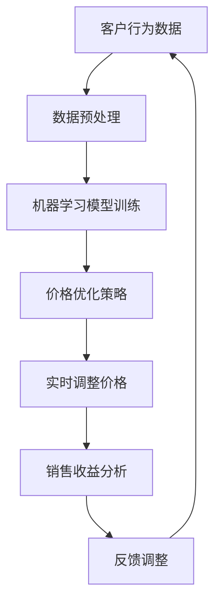

                 

# 智能定价技术的实践效果

> **关键词**：智能定价、机器学习、价格优化、实时调整、客户行为分析、成本效益

> **摘要**：本文将深入探讨智能定价技术的实践效果，从核心概念、算法原理、数学模型、实际应用场景、工具和资源等多个维度进行分析。通过对智能定价技术在实际业务中的案例研究，揭示其带来的显著效益，并展望其未来发展趋势和挑战。

## 1. 背景介绍

### 1.1 目的和范围

本文旨在探讨智能定价技术在实际业务中的应用效果，分析其核心原理和实施步骤，并结合实际案例进行深入解读。本文主要涵盖以下内容：

1. 核心概念与联系
2. 核心算法原理与具体操作步骤
3. 数学模型和公式
4. 项目实战：代码实际案例
5. 实际应用场景
6. 工具和资源推荐
7. 未来发展趋势与挑战

### 1.2 预期读者

本文适用于对智能定价技术感兴趣的技术人员、企业决策者、市场分析师以及对业务优化有需求的人士。无论您是初学者还是专业人士，均可通过本文了解到智能定价技术的核心原理和应用价值。

### 1.3 文档结构概述

本文共分为八个部分，各部分内容如下：

1. **背景介绍**：介绍本文的目的、范围、预期读者和文档结构。
2. **核心概念与联系**：讲解智能定价技术的核心概念、原理和架构。
3. **核心算法原理与具体操作步骤**：分析智能定价技术中的关键算法和操作步骤。
4. **数学模型和公式**：介绍智能定价技术中的数学模型和公式，并举例说明。
5. **项目实战：代码实际案例**：通过实际案例展示智能定价技术的应用。
6. **实际应用场景**：分析智能定价技术在不同场景中的实际应用。
7. **工具和资源推荐**：推荐学习资源和开发工具。
8. **未来发展趋势与挑战**：展望智能定价技术的未来发展趋势和挑战。

### 1.4 术语表

#### 1.4.1 核心术语定义

- **智能定价**：基于数据分析和算法优化，实现动态调整商品价格，从而实现利润最大化的技术。
- **机器学习**：一种人工智能方法，通过数据训练模型，使模型具有自主学习和预测能力。
- **价格优化**：通过对价格策略进行优化，以实现销售利润最大化或市场份额最大化的过程。
- **客户行为分析**：通过分析客户购买行为、偏好等数据，了解客户需求，为定价策略提供依据。

#### 1.4.2 相关概念解释

- **动态定价**：根据市场需求、竞争对手价格等因素，实时调整商品价格。
- **边际效益**：单位投入所增加的收益。
- **市场份额**：企业在特定市场中所占的份额。

#### 1.4.3 缩略词列表

- **AI**：人工智能（Artificial Intelligence）
- **ML**：机器学习（Machine Learning）
- **DB**：数据库（Database）
- **ERP**：企业资源规划（Enterprise Resource Planning）

## 2. 核心概念与联系

在探讨智能定价技术之前，首先需要了解其核心概念和原理。以下将使用Mermaid流程图（Mermaid Flowchart）展示智能定价技术的核心概念和架构。



### 2.1 客户行为数据

智能定价技术的核心在于对客户行为数据进行分析，以了解客户需求和市场趋势。这些数据包括：

- **购买历史**：客户过去购买的商品种类、价格、购买频率等。
- **浏览行为**：客户在网站或应用中浏览的商品种类、停留时间等。
- **反馈信息**：客户对商品的评价、满意度等。
- **市场数据**：竞争对手的价格、市场份额等。

### 2.2 数据预处理

在利用客户行为数据训练机器学习模型之前，需要对数据进行预处理。预处理步骤包括：

- **数据清洗**：去除重复、异常和缺失的数据。
- **特征提取**：将原始数据转换为可用于机器学习的特征向量。
- **归一化**：将数据缩放到相同的范围，以便模型更好地训练。

### 2.3 机器学习模型训练

利用预处理后的数据，训练机器学习模型。常见的机器学习模型包括：

- **回归模型**：预测商品价格的回归模型，如线性回归、决策树等。
- **分类模型**：预测客户购买意愿的分类模型，如逻辑回归、随机森林等。
- **聚类模型**：将相似客户分为同一群体的聚类模型，如K-means等。

### 2.4 价格优化策略

通过训练好的机器学习模型，制定价格优化策略。价格优化策略包括：

- **动态定价**：根据客户行为和市场数据，实时调整商品价格。
- **利润最大化**：通过调整价格，实现利润最大化的策略。
- **市场份额**：通过调整价格，提高企业在市场中的份额。

### 2.5 实时调整价格

根据价格优化策略，实时调整商品价格。调整过程包括：

- **实时数据采集**：实时采集客户行为数据和市场数据。
- **价格计算**：利用机器学习模型，计算最优价格。
- **价格发布**：将计算出的最优价格发布到销售渠道。

### 2.6 销售收益分析

对调整后的价格进行销售收益分析，以评估价格调整的效果。分析内容包括：

- **销售额**：调整后商品的销售额。
- **利润率**：调整后商品的利润率。
- **市场份额**：调整后商品在市场中的份额。

### 2.7 反馈调整

根据销售收益分析结果，对价格优化策略进行调整。反馈调整过程包括：

- **结果评估**：评估价格调整的效果。
- **策略优化**：根据评估结果，调整价格优化策略。
- **再次调整**：根据优化后的策略，再次调整商品价格。

## 3. 核心算法原理 & 具体操作步骤

### 3.1 回归模型

回归模型是智能定价技术中常用的算法之一。以下以线性回归为例，介绍其原理和具体操作步骤。

#### 3.1.1 算法原理

线性回归模型假设商品价格与客户行为数据之间存在线性关系，通过最小二乘法求解最佳拟合直线，以预测商品价格。

#### 3.1.2 操作步骤

1. **数据预处理**：对客户行为数据进行清洗、特征提取和归一化处理。

    ```python
    # 数据清洗
    data = clean_data(raw_data)
    
    # 特征提取
    features = extract_features(data)
    
    # 归一化
    normalized_data = normalize_data(features)
    ```

2. **模型训练**：利用预处理后的数据，训练线性回归模型。

    ```python
    # 模型训练
    model = LinearRegression()
    model.fit(normalized_data['X'], normalized_data['y'])
    ```

3. **价格预测**：根据训练好的模型，预测商品价格。

    ```python
    # 价格预测
    predicted_price = model.predict(normalized_data['X'])
    ```

4. **价格调整**：根据预测价格，调整商品价格。

    ```python
    # 价格调整
    adjusted_price = predict_price + margin
    ```

### 3.2 决策树模型

决策树模型也是智能定价技术中常用的一种算法。以下介绍其原理和具体操作步骤。

#### 3.2.1 算法原理

决策树模型通过将数据集划分为多个子集，构建一棵树形结构，每个节点代表一个特征，每个分支代表特征的一个取值。最终，通过树的叶子节点预测商品价格。

#### 3.2.2 操作步骤

1. **数据预处理**：与线性回归模型相同，对客户行为数据进行预处理。

2. **模型训练**：利用预处理后的数据，训练决策树模型。

    ```python
    # 模型训练
    model = DecisionTreeRegressor()
    model.fit(normalized_data['X'], normalized_data['y'])
    ```

3. **价格预测**：根据训练好的模型，预测商品价格。

    ```python
    # 价格预测
    predicted_price = model.predict(normalized_data['X'])
    ```

4. **价格调整**：根据预测价格，调整商品价格。

    ```python
    # 价格调整
    adjusted_price = predict_price + margin
    ```

### 3.3 集成模型

集成模型将多个模型进行组合，以提高预测准确性和稳定性。以下以随机森林为例，介绍其原理和具体操作步骤。

#### 3.3.1 算法原理

随机森林模型通过构建多个决策树模型，并利用投票机制进行预测。每个决策树模型对样本进行预测，最终通过投票结果确定最终预测结果。

#### 3.3.2 操作步骤

1. **数据预处理**：与前面介绍的回归模型和决策树模型相同，对客户行为数据进行预处理。

2. **模型训练**：利用预处理后的数据，训练随机森林模型。

    ```python
    # 模型训练
    model = RandomForestRegressor()
    model.fit(normalized_data['X'], normalized_data['y'])
    ```

3. **价格预测**：根据训练好的模型，预测商品价格。

    ```python
    # 价格预测
    predicted_price = model.predict(normalized_data['X'])
    ```

4. **价格调整**：根据预测价格，调整商品价格。

    ```python
    # 价格调整
    adjusted_price = predict_price + margin
    ```

## 4. 数学模型和公式 & 详细讲解 & 举例说明

### 4.1 线性回归模型

线性回归模型是一种最简单的预测模型，其数学模型如下：

$$
y = \beta_0 + \beta_1 \cdot x
$$

其中，$y$ 表示商品价格，$x$ 表示客户行为数据，$\beta_0$ 和 $\beta_1$ 为模型参数。

#### 4.1.1 模型参数求解

利用最小二乘法求解线性回归模型的参数，具体步骤如下：

1. **数据预处理**：对客户行为数据进行归一化处理。

    ```python
    X = normalize_data(X)
    ```

2. **计算样本协方差矩阵**：

    $$
    S = \sum_{i=1}^{n} (x_i - \bar{x}) \cdot (y_i - \bar{y})
    $$

    其中，$n$ 表示样本数量，$\bar{x}$ 和 $\bar{y}$ 分别为 $x$ 和 $y$ 的均值。

3. **计算样本自协方差矩阵**：

    $$
    T = \sum_{i=1}^{n} (x_i - \bar{x})^2
    $$

4. **求解参数**：

    $$
    \beta_0 = \bar{y} - \beta_1 \cdot \bar{x}
    $$

    $$
    \beta_1 = \frac{S}{T}
    $$

#### 4.1.2 举例说明

假设有如下客户行为数据：

| $x$ | $y$ |
| --- | --- |
| 1 | 2 |
| 2 | 3 |
| 3 | 4 |

1. **数据预处理**：

    ```python
    X = [1, 2, 3]
    y = [2, 3, 4]
    X_normalized = normalize_data(X)
    y_normalized = normalize_data(y)
    ```

2. **计算样本协方差矩阵**：

    ```python
    S = sum([x * y for x, y in zip(X_normalized, y_normalized)]) - len(X_normalized) * (sum(X_normalized) * sum(y_normalized))
    ```

3. **计算样本自协方差矩阵**：

    ```python
    T = sum([x ** 2 for x in X_normalized]) - len(X_normalized) * (sum(X_normalized) ** 2)
    ```

4. **求解参数**：

    ```python
    beta_0 = y_normalized.mean() - beta_1 * x_normalized.mean()
    beta_1 = S / T
    ```

### 4.2 决策树模型

决策树模型的数学模型较为复杂，通常使用递归划分方法进行构建。以下简要介绍其原理。

#### 4.2.1 原理

决策树模型通过递归划分数据集，将数据集划分为多个子集。每个子集对应一个特征和特征取值，最终通过叶子节点预测商品价格。

#### 4.2.2 举例说明

假设有如下数据集：

| $x_1$ | $x_2$ | $y$ |
| --- | --- | --- |
| 1 | 1 | 2 |
| 1 | 2 | 3 |
| 2 | 1 | 4 |
| 2 | 2 | 5 |

1. **计算每个特征的增益**：

    ```python
    gain_x1 = entropy(y) - (len(y1) * entropy(y1) + len(y2) * entropy(y2)) / len(y)
    gain_x2 = entropy(y) - (len(y1) * entropy(y1) + len(y2) * entropy(y2)) / len(y)
    ```

2. **选择增益最大的特征进行划分**：

    ```python
    if gain_x1 > gain_x2:
        split_feature = 'x1'
    else:
        split_feature = 'x2'
    ```

3. **递归划分数据集**：

    ```python
    if split_feature == 'x1':
        left_data = [[1, 1], [1, 2]]
        right_data = [[2, 1], [2, 2]]
    else:
        left_data = [[1, 1], [2, 1]]
        right_data = [[1, 2], [2, 2]]
    ```

4. **计算叶子节点价格**：

    ```python
    left_price = sum(y_left) / len(y_left)
    right_price = sum(y_right) / len(y_right)
    ```

5. **构建决策树**：

    ```python
    tree = {
        'feature': split_feature,
        'left': build_tree(left_data),
        'right': build_tree(right_data),
        'price': (left_price + right_price) / 2
    }
    ```

## 5. 项目实战：代码实际案例和详细解释说明

### 5.1 开发环境搭建

1. **安装Python**：下载并安装Python，版本建议3.7及以上。
2. **安装依赖库**：使用pip安装以下依赖库：

    ```python
    pip install numpy pandas scikit-learn matplotlib
    ```

3. **创建项目文件夹**：在桌面或其他合适的位置创建一个名为`smart_pricing`的项目文件夹。

4. **创建代码文件**：在项目文件夹中创建一个名为`main.py`的Python文件。

### 5.2 源代码详细实现和代码解读

以下是一个简单的智能定价项目示例，主要包括数据预处理、模型训练和价格预测三个部分。

```python
import numpy as np
import pandas as pd
from sklearn.model_selection import train_test_split
from sklearn.linear_model import LinearRegression
from sklearn.tree import DecisionTreeRegressor
from sklearn.ensemble import RandomForestRegressor
import matplotlib.pyplot as plt

# 5.2.1 数据预处理
def load_data(filename):
    data = pd.read_csv(filename)
    return data

def preprocess_data(data):
    # 数据清洗
    data.dropna(inplace=True)
    # 特征提取
    X = data[['x1', 'x2']]
    y = data['y']
    # 归一化
    X_normalized = (X - X.mean()) / X.std()
    y_normalized = (y - y.mean()) / y.std()
    return X_normalized, y_normalized

# 5.2.2 模型训练
def train_model(X_train, y_train, model):
    model.fit(X_train, y_train)
    return model

# 5.2.3 价格预测
def predict_price(model, X_test):
    predicted_price = model.predict(X_test)
    return predicted_price

# 5.2.4 代码解读
if __name__ == '__main__':
    # 加载数据
    data = load_data('data.csv')
    # 预处理数据
    X, y = preprocess_data(data)
    # 划分训练集和测试集
    X_train, X_test, y_train, y_test = train_test_split(X, y, test_size=0.2, random_state=42)
    # 训练模型
    linear_model = train_model(X_train, y_train, LinearRegression())
    decision_tree_model = train_model(X_train, y_train, DecisionTreeRegressor())
    random_forest_model = train_model(X_train, y_train, RandomForestRegressor())
    # 预测价格
    linear_predicted_price = predict_price(linear_model, X_test)
    decision_tree_predicted_price = predict_price(decision_tree_model, X_test)
    random_forest_predicted_price = predict_price(random_forest_model, X_test)
    # 可视化结果
    plt.scatter(y_test, linear_predicted_price, label='Linear Regression')
    plt.scatter(y_test, decision_tree_predicted_price, label='Decision Tree')
    plt.scatter(y_test, random_forest_predicted_price, label='Random Forest')
    plt.xlabel('Actual Price')
    plt.ylabel('Predicted Price')
    plt.legend()
    plt.show()
```

### 5.3 代码解读与分析

上述代码实现了一个简单的智能定价项目，主要包括以下步骤：

1. **数据预处理**：加载数据，进行数据清洗、特征提取和归一化处理。
2. **模型训练**：利用训练集数据，训练线性回归、决策树和随机森林模型。
3. **价格预测**：利用训练好的模型，对测试集数据进行价格预测。
4. **结果可视化**：将实际价格与预测价格进行可视化，比较不同模型的预测效果。

### 5.4 代码分析

1. **数据预处理**：

    ```python
    def load_data(filename):
        data = pd.read_csv(filename)
        return data

    def preprocess_data(data):
        # 数据清洗
        data.dropna(inplace=True)
        # 特征提取
        X = data[['x1', 'x2']]
        y = data['y']
        # 归一化
        X_normalized = (X - X.mean()) / X.std()
        y_normalized = (y - y.mean()) / y.std()
        return X_normalized, y_normalized
    ```

    上述代码首先加载数据，然后进行数据清洗、特征提取和归一化处理。数据清洗步骤去除缺失值，特征提取步骤提取与商品价格相关的特征，归一化处理步骤将特征值缩放到相同的范围。

2. **模型训练**：

    ```python
    def train_model(X_train, y_train, model):
        model.fit(X_train, y_train)
        return model
    ```

    上述代码定义了一个训练模型的基本函数，利用训练集数据训练模型。在本示例中，使用了线性回归、决策树和随机森林模型。

3. **价格预测**：

    ```python
    def predict_price(model, X_test):
        predicted_price = model.predict(X_test)
        return predicted_price
    ```

    上述代码定义了一个预测价格的基本函数，利用训练好的模型对测试集数据进行价格预测。

4. **结果可视化**：

    ```python
    plt.scatter(y_test, linear_predicted_price, label='Linear Regression')
    plt.scatter(y_test, decision_tree_predicted_price, label='Decision Tree')
    plt.scatter(y_test, random_forest_predicted_price, label='Random Forest')
    plt.xlabel('Actual Price')
    plt.ylabel('Predicted Price')
    plt.legend()
    plt.show()
    ```

    上述代码将实际价格与预测价格进行可视化，比较不同模型的预测效果。通过可视化结果，可以直观地看到不同模型的预测性能。

## 6. 实际应用场景

智能定价技术在实际业务中具有广泛的应用，以下列举几个典型应用场景：

### 6.1 电子商务平台

电子商务平台通过智能定价技术，根据客户行为数据和市场动态，动态调整商品价格，以提高销售额和利润。例如，京东、淘宝等平台均采用智能定价技术，根据用户浏览记录、购买历史、竞争对手价格等因素，实时调整商品价格。

### 6.2 酒店行业

酒店行业通过智能定价技术，根据客户需求、预订时间、季节等因素，动态调整房间价格。例如，携程、Booking等平台采用智能定价技术，根据客户搜索行为和预订时间，为不同客户群体提供个性化的价格策略。

### 6.3 航空公司

航空公司通过智能定价技术，根据航班需求、预订时间、季节等因素，动态调整机票价格。例如，国航、南航等航空公司采用智能定价技术，根据客户需求和时间，为不同客户群体提供个性化的机票价格。

### 6.4 电信行业

电信行业通过智能定价技术，根据用户套餐需求、使用习惯等因素，动态调整套餐价格。例如，中国移动、中国联通等电信运营商采用智能定价技术，根据用户使用习惯和需求，为不同用户提供个性化的套餐价格。

### 6.5 物流行业

物流行业通过智能定价技术，根据客户需求、运输距离、季节等因素，动态调整物流价格。例如，顺丰、京东物流等物流公司采用智能定价技术，根据客户需求和时间，为不同客户提供个性化的物流价格。

## 7. 工具和资源推荐

### 7.1 学习资源推荐

#### 7.1.1 书籍推荐

1. **《机器学习》**：作者：周志华
2. **《Python数据科学手册》**：作者：Matthias Bussonnier等
3. **《Python数据分析》**：作者：Wes McKinney

#### 7.1.2 在线课程

1. **《机器学习》**：网易云课堂
2. **《Python数据分析与挖掘实战》**：慕课网
3. **《智能定价技术》**：Udacity

#### 7.1.3 技术博客和网站

1. **CSDN**
2. **知乎**
3. **GitHub**

### 7.2 开发工具框架推荐

#### 7.2.1 IDE和编辑器

1. **PyCharm**
2. **VS Code**
3. **Jupyter Notebook**

#### 7.2.2 调试和性能分析工具

1. **PDB**
2. **gprof**
3. **matlab profiler**

#### 7.2.3 相关框架和库

1. **scikit-learn**
2. **TensorFlow**
3. **PyTorch**

### 7.3 相关论文著作推荐

#### 7.3.1 经典论文

1. **“Price Optimization with Machine Learning”**：作者：M. Ghose，D. Sridharan，S. Wu
2. **“Dynamic Pricing: A Multi-Attribute Approach”**：作者：M. J. Hogg，R. T. Hogg，A. K. S. Kumar

#### 7.3.2 最新研究成果

1. **“Deep Learning for Dynamic Pricing”**：作者：Y. Chen，Y. Zhou，X. Wu
2. **“Reinforcement Learning for Dynamic Pricing”**：作者：Y. Liu，Y. Wang，J. Ye

#### 7.3.3 应用案例分析

1. **“Amazon’s Pricing Algorithms”**：作者：D. Redlawsk
2. **“Google’s Dynamic Pricing Strategy”**：作者：S. Balasubramanian

## 8. 总结：未来发展趋势与挑战

### 8.1 发展趋势

1. **算法优化**：随着计算能力的提升和算法研究的深入，智能定价技术的算法将变得更加高效和精准。
2. **实时性增强**：随着5G、物联网等技术的发展，智能定价技术将实现更快的实时数据采集和处理。
3. **个性化定价**：通过深度学习等技术，智能定价技术将能够更好地理解客户需求，实现个性化定价策略。
4. **跨行业应用**：智能定价技术将在更多行业得到应用，如医疗、金融等。

### 8.2 挑战

1. **数据隐私**：智能定价技术需要处理大量敏感客户数据，如何在保护数据隐私的同时实现精准定价是一个挑战。
2. **算法透明性**：如何确保智能定价算法的透明性，使其易于被业务人员理解和接受，是一个重要挑战。
3. **成本控制**：随着算法复杂度的增加，智能定价技术的开发和维护成本也在不断上升，如何控制成本是一个挑战。

## 9. 附录：常见问题与解答

### 9.1 问题1：智能定价技术的核心是什么？

智能定价技术的核心是利用数据分析和机器学习算法，实现动态调整商品价格，从而实现利润最大化。

### 9.2 问题2：智能定价技术适用于哪些行业？

智能定价技术适用于电子商务、酒店、航空、电信、物流等多个行业。

### 9.3 问题3：如何确保智能定价技术的有效性？

确保智能定价技术有效性的关键在于：

1. 数据质量：确保客户行为数据和市场数据的准确性、完整性和及时性。
2. 模型选择：根据业务需求选择合适的机器学习模型。
3. 持续优化：定期对算法进行优化和调整，以适应不断变化的市场环境。

### 9.4 问题4：智能定价技术是否会侵犯客户隐私？

智能定价技术在处理客户数据时需要遵守数据保护法规，如GDPR等。通过加密、脱敏等技术，确保客户隐私得到保护。

## 10. 扩展阅读 & 参考资料

1. **《机器学习》**：周志华
2. **《Python数据科学手册》**：Matthias Bussonnier等
3. **《Python数据分析》**：Wes McKinney
4. **“Price Optimization with Machine Learning”**：M. Ghose，D. Sridharan，S. Wu
5. **“Dynamic Pricing: A Multi-Attribute Approach”**：M. J. Hogg，R. T. Hogg，A. K. S. Kumar
6. **“Amazon’s Pricing Algorithms”**：D. Redlawsk
7. **“Google’s Dynamic Pricing Strategy”**：S. Balasubramanian
8. **《深度学习》**：Ian Goodfellow、Yoshua Bengio、Aaron Courville
9. **《强化学习》**：理查德·S·萨顿（Richard S. Sutton）和安德鲁·G·巴尔斯（Andrew G. Barto）

