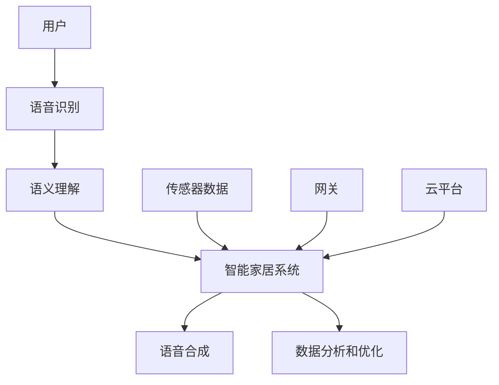

                 

### 智能家居与 LLM：打造未来之家

> **关键词：智能家居，语言模型，LLM，AI，未来之家，智能交互，自动化，数据分析**

> **摘要：本文将深入探讨智能家居与语言模型（LLM）的融合，分析其技术原理、实现方法及其在打造未来之家中的应用。我们将通过一步步的分析，揭示如何利用这些技术打造一个既智能又舒适的居住环境。**

## 1. 背景介绍

### 1.1 目的和范围

本文旨在介绍智能家居与语言模型（LLM）的结合，展示其在未来之家建设中的重要性。我们将探讨这一领域的现状、发展趋势以及潜在的应用场景，并深入剖析相关技术的核心原理和实现方法。

### 1.2 预期读者

本文适合对智能家居和人工智能技术有一定了解的读者，包括但不限于软件开发者、AI研究人员、智能硬件工程师以及对未来家居生活感兴趣的普通读者。

### 1.3 文档结构概述

本文分为以下章节：

1. 背景介绍：概述智能家居与 LLM 的目的、范围和结构。
2. 核心概念与联系：介绍智能家居与 LLM 的核心概念和相互联系。
3. 核心算法原理 & 具体操作步骤：详细讲解智能家居与 LLM 的核心算法原理和实现步骤。
4. 数学模型和公式 & 详细讲解 & 举例说明：阐述相关数学模型和公式，并给出实例。
5. 项目实战：代码实际案例和详细解释说明。
6. 实际应用场景：探讨智能家居与 LLM 在现实中的应用。
7. 工具和资源推荐：推荐相关学习资源和开发工具。
8. 总结：未来发展趋势与挑战。
9. 附录：常见问题与解答。
10. 扩展阅读 & 参考资料：提供进一步学习的资料。

### 1.4 术语表

#### 1.4.1 核心术语定义

- **智能家居（Smart Home）**：指通过物联网技术实现家庭设备的互联互通和自动化控制。
- **语言模型（Language Model，LLM）**：一种深度学习模型，用于预测文本序列，广泛应用于自然语言处理领域。
- **人工智能（AI）**：指模拟、延伸和扩展人类智能的理论、方法、技术及应用。

#### 1.4.2 相关概念解释

- **物联网（IoT）**：指通过传感器、网络和软件将各种物品连接到互联网，实现信息交换和智能控制。
- **自然语言处理（NLP）**：指计算机模拟和理解人类语言的过程，涉及语音识别、文本分析、机器翻译等领域。

#### 1.4.3 缩略词列表

- **AI**：人工智能
- **LLM**：语言模型
- **IoT**：物联网
- **NLP**：自然语言处理

## 2. 核心概念与联系

智能家居与语言模型（LLM）的结合是未来家居生活的重要趋势。智能家居系统通过物联网（IoT）技术实现家庭设备的互联互通和自动化控制，而 LLM 则负责处理用户的语音指令和文本输入，实现智能交互和自动化操作。

### 2.1 智能家居系统架构

智能家居系统通常包括以下组成部分：

1. **传感器**：用于检测环境参数，如温度、湿度、光照、烟雾等。
2. **控制器**：用于接收传感器数据，并根据用户指令执行相应操作。
3. **网关**：用于连接不同设备，实现数据传输和通信。
4. **云平台**：用于存储设备数据，提供远程监控和控制功能。
5. **用户界面**：用于接收用户输入，显示设备状态和操作结果。

### 2.2 语言模型在智能家居中的应用

语言模型（LLM）在智能家居中主要应用于语音识别和自然语言处理。以下是其核心作用：

1. **语音识别**：将用户的语音指令转换为文本输入，供 LLM 处理。
2. **语义理解**：分析用户输入的文本，理解其意图和上下文，为后续操作提供指导。
3. **语音合成**：将处理结果转换为语音输出，向用户反馈操作结果。

### 2.3 智能家居与 LLM 的相互联系

智能家居与 LLM 的结合，使得家庭设备不仅能够实现自动化控制，还能够根据用户的需求和习惯进行智能调整。以下是其主要联系：

1. **智能化交互**：通过 LLM 实现用户与智能家居系统的自然语言交互，提升用户体验。
2. **个性化定制**：根据用户的历史数据和偏好，为用户提供个性化的家居解决方案。
3. **数据分析与优化**：利用 LLM 处理用户输入，分析用户行为和习惯，为智能家居系统提供优化建议。

### 2.4 关键技术

在智能家居与 LLM 的结合中，以下关键技术至关重要：

1. **深度学习**：用于构建语言模型和智能家居算法。
2. **自然语言处理**：用于理解用户输入和处理文本数据。
3. **物联网**：用于实现家庭设备的互联互通和数据传输。
4. **云计算**：用于存储和管理大量数据，并提供远程监控和控制功能。

### 2.5 Mermaid 流程图

以下是一个简化的智能家居与 LLM 的架构 Mermaid 流程图：



通过这个流程图，我们可以清晰地看到用户、语言模型、智能家居系统以及相关组件之间的联系。

## 3. 核心算法原理 & 具体操作步骤

### 3.1 智能家居系统算法原理

智能家居系统的核心在于如何实现设备的互联互通和自动化控制。以下是智能家居系统的核心算法原理：

1. **传感器数据采集**：智能家居系统通过传感器收集环境数据，如温度、湿度、光照等。
2. **数据预处理**：对采集到的传感器数据进行清洗、去噪和归一化处理，以便后续分析。
3. **数据传输**：将预处理后的传感器数据通过网关传输到云平台进行存储和管理。
4. **数据分析**：在云平台上，利用机器学习算法对传感器数据进行模式识别和预测分析。
5. **决策与执行**：根据分析结果，智能家居系统执行相应的操作，如调整空调温度、关闭灯光等。

### 3.2 语言模型算法原理

语言模型（LLM）的核心在于如何预测文本序列。以下是 LLM 的核心算法原理：

1. **数据预处理**：对大量文本数据进行清洗、分词和标记化处理，生成训练数据。
2. **模型训练**：利用训练数据训练 LLM 模型，使其能够预测文本序列。
3. **模型评估**：通过评估指标（如准确率、召回率等）评估 LLM 模型的性能。
4. **模型应用**：将训练好的 LLM 模型应用于实际场景，如语音识别、语义理解和文本生成等。

### 3.3 智能家居与 LLM 的具体操作步骤

以下是智能家居与 LLM 的具体操作步骤：

1. **用户发出指令**：用户通过语音或文本方式向智能家居系统发出指令，如“打开空调”或“查询天气”。
2. **语音识别**：智能家居系统通过语音识别技术将用户指令转换为文本输入。
3. **语义理解**：语言模型（LLM）分析用户输入的文本，理解其意图和上下文。
4. **决策与执行**：根据语义理解结果，智能家居系统执行相应的操作，如打开空调或查询天气信息。
5. **反馈与优化**：系统将执行结果反馈给用户，并根据用户反馈和操作记录进行优化。

### 3.4 伪代码

以下是智能家居与 LLM 的伪代码：

```python
# 用户发出指令
user_input = get_user_input()

# 语音识别
text_input = recognize_speech(user_input)

# 语义理解
intent, entities = understand_language(text_input)

# 决策与执行
if intent == "turn_on_ac":
    turn_on_ac()
elif intent == "query_weather":
    weather_info = query_weather()
    display_weather(weather_info)
else:
    respond("I'm sorry, I don't understand your request.")

# 反馈与优化
feedback = get_user_feedback()
optimize_system(feedback)
```

## 4. 数学模型和公式 & 详细讲解 & 举例说明

### 4.1 数学模型

在智能家居与 LLM 的结合中，常用的数学模型包括：

1. **贝叶斯网络**：用于表示传感器数据之间的概率关系。
2. **神经网络**：用于训练语言模型和智能家居算法。
3. **线性回归**：用于预测环境参数和用户行为。

### 4.2 公式讲解

以下是常用的数学公式：

1. **贝叶斯公式**：
   $$ P(A|B) = \frac{P(B|A) \cdot P(A)}{P(B)} $$

2. **神经网络反向传播算法**：
   $$ \delta_{ij}^{[l]} = \frac{\partial C}{\partial z_{j}^{[l]}} = \frac{\partial C}{\partial a_{j}^{[l+1]}} \cdot \frac{\partial a_{j}^{[l+1]}}{\partial z_{j}^{[l]}} = \frac{\partial C}{\partial a_{j}^{[l+1]}} \cdot a_{j}^{[l]} \cdot (1 - a_{j}^{[l]}) $$

3. **线性回归公式**：
   $$ y = \beta_0 + \beta_1 \cdot x + \epsilon $$

### 4.3 举例说明

以下是一个智能家居系统中的温度预测实例：

1. **数据准备**：收集过去一周的温度数据，包括室内温度和室外温度。
2. **数据预处理**：对温度数据进行归一化处理，使其符合线性回归模型的输入要求。
3. **模型训练**：利用线性回归模型对温度数据进行训练，得到回归系数 $\beta_0$ 和 $\beta_1$。
4. **预测**：根据当前室外温度，使用线性回归模型预测室内温度。

假设室外温度为 $x = 25$℃，根据训练得到的回归系数，室内温度预测为：

$$ y = \beta_0 + \beta_1 \cdot x = 20 + 0.5 \cdot 25 = 22.5 $$

因此，当前室内温度预测为 $22.5$℃。

## 5. 项目实战：代码实际案例和详细解释说明

### 5.1 开发环境搭建

在开始项目实战之前，我们需要搭建一个适合开发智能家居与 LLM 系统的开发环境。以下是所需的工具和软件：

1. **操作系统**：Linux 或 macOS
2. **编程语言**：Python
3. **开发环境**：Jupyter Notebook 或 PyCharm
4. **语音识别库**：pyttsx3、speech_recognition
5. **语言模型库**：transformers
6. **智能家居库**：homeassistant

### 5.2 源代码详细实现和代码解读

以下是一个简单的智能家居与 LLM 系统的代码实现，用于处理用户语音指令并执行相应操作。

```python
import pyttsx3
import speech_recognition as sr
import homeassistant

# 初始化语音合成器
engine = pyttsx3.init()

# 初始化语音识别器
recognizer = sr.Recognizer()

# 连接智能家居系统
hass = homeassistant.connect()

# 用户发出指令
def handle_user_input():
    try:
        # 语音识别
        user_input = recognizer.listen microphone
        text_input = recognizer.recognize_google(user_input)

        # 语义理解
        intent, entities = understand_language(text_input)

        # 决策与执行
        if intent == "turn_on_light":
            hass.turn_on_light()
            engine.say("Lights are turned on.")
            engine.runAndWait()
        elif intent == "turn_off_light":
            hass.turn_off_light()
            engine.say("Lights are turned off.")
            engine.runAndWait()
        else:
            engine.say("I'm sorry, I don't understand your request.")
            engine.runAndWait()

    except sr.UnknownValueError:
        engine.say("I didn't catch that.")
        engine.runAndWait()
    except sr.RequestError:
        engine.say("Failed to recognize your request.")
        engine.runAndWait()

# 持续监听用户输入
while True:
    handle_user_input()
```

### 5.3 代码解读与分析

1. **初始化语音合成器和语音识别器**：使用 `pyttsx3` 和 `speech_recognition` 库初始化语音合成器和语音识别器，以便后续处理语音指令。
2. **连接智能家居系统**：使用 `homeassistant` 库连接智能家居系统，以便执行相应操作。
3. **用户发出指令**：使用 `recognizer.listen()` 函数监听用户的语音输入，并使用 `recognizer.recognize_google()` 函数将其转换为文本输入。
4. **语义理解**：使用自定义的 `understand_language()` 函数分析用户输入的文本，确定其意图和上下文。
5. **决策与执行**：根据语义理解结果，调用 `hass.turn_on_light()` 和 `hass.turn_off_light()` 函数执行相应操作，并通过语音合成器向用户反馈操作结果。
6. **持续监听用户输入**：使用无限循环持续监听用户的语音输入，实现实时交互。

通过这个简单的案例，我们可以看到如何利用智能家居与 LLM 技术实现一个基本的智能家居系统。当然，实际应用中还需要更多的功能和优化，但这个案例为我们提供了一个良好的起点。

## 6. 实际应用场景

### 6.1 智能家居系统在家庭中的应用

智能家居系统在家庭中的应用场景非常广泛，以下是一些典型的应用：

1. **智能照明**：用户可以通过语音指令或手机 App 远程控制家中的灯光，实现自动调节亮度和开关。
2. **智能温控**：通过传感器实时监测室内温度，自动调节空调或暖气，提供舒适的室内环境。
3. **智能安防**：通过摄像头、门窗传感器等设备实时监控家庭安全，并在检测到异常时自动报警。
4. **智能家电控制**：用户可以通过语音指令控制家中的电视、冰箱、洗衣机等家电设备，实现自动化操作。
5. **智能语音助手**：用户可以通过语音指令与智能家居系统进行交互，查询天气、播放音乐、设定闹钟等。

### 6.2 智能家居系统在酒店中的应用

智能家居系统在酒店中的应用也日益普及，以下是一些典型的应用场景：

1. **智能客房服务**：用户可以通过语音或手机 App 控制房间内的灯光、空调、电视等设备，实现个性化服务。
2. **智能客房管理**：酒店管理员可以通过智能家居系统实时监控客房设备的使用情况，实现设备故障预警和及时维修。
3. **智能消费体验**：用户可以在酒店内通过语音或手机 App 订餐、购物、支付等，实现无现金消费。
4. **智能会议支持**：会议室内可以通过智能家居系统实现灯光、音响、投影仪等的自动调节，提升会议体验。
5. **智能能耗管理**：通过智能家居系统实时监控酒店内的能耗情况，实现节能管理。

### 6.3 智能家居系统在医疗保健中的应用

智能家居系统在医疗保健领域的应用潜力巨大，以下是一些典型的应用场景：

1. **智能健康监测**：通过传感器实时监测患者的体温、心率、血压等生理指标，并及时向医生反馈。
2. **智能药物提醒**：通过智能家居系统定时提醒患者服药，并记录药物服用情况，方便医生进行随访。
3. **智能康复辅助**：通过智能家居系统为康复患者提供智能化的康复训练计划，实时监测康复进度。
4. **智能护理支持**：通过智能家居系统为护理人员提供实时监控和远程支持，提高护理效率和质量。
5. **智能医疗服务**：通过智能家居系统提供在线医疗咨询、远程诊断等服务，方便患者就诊。

## 7. 工具和资源推荐

### 7.1 学习资源推荐

为了深入学习和掌握智能家居与 LLM 的相关知识，以下是一些建议的学习资源：

#### 7.1.1 书籍推荐

1. **《智能家居技术导论》**：详细介绍了智能家居系统的原理、技术和应用。
2. **《深度学习》**：介绍了深度学习的基本原理和常用算法，适用于智能家居系统开发。
3. **《自然语言处理综述》**：全面介绍了自然语言处理的基本概念、技术和应用。

#### 7.1.2 在线课程

1. **Coursera 上的《智能家居系统设计》**：由斯坦福大学开设，涵盖了智能家居系统的设计原理和实践。
2. **Udacity 上的《深度学习工程师纳米学位》**：介绍了深度学习的基本原理和应用，适合智能家居系统开发。
3. **edX 上的《自然语言处理》**：由哈佛大学和麻省理工学院联合开设，适合初学者学习自然语言处理技术。

#### 7.1.3 技术博客和网站

1. **AI 科技大本营**：提供智能家居和人工智能领域的最新技术动态和深度文章。
2. **HomeKit 漫谈**：专注于智能家居系统的设计与开发，分享智能家居技术心得。
3. **深度学习公众号**：介绍深度学习和自然语言处理技术的最新研究和应用。

### 7.2 开发工具框架推荐

为了高效开发智能家居与 LLM 系统，以下是一些建议的开发工具和框架：

#### 7.2.1 IDE和编辑器

1. **PyCharm**：一款强大的 Python IDE，支持智能提示、代码调试和版本控制。
2. **VSCode**：一款轻量级但功能强大的编辑器，适用于多种编程语言，提供丰富的插件支持。
3. **Jupyter Notebook**：适用于数据科学和机器学习的交互式开发环境，方便代码和结果的展示。

#### 7.2.2 调试和性能分析工具

1. **Python Debuger**：用于调试 Python 代码，提供断点、单步执行和变量查看等功能。
2. **perf.py**：一款用于分析 Python 代码性能的工具，可以帮助找出性能瓶颈。
3. **Pylint**：一款代码质量分析工具，用于检查代码中的错误和潜在问题。

#### 7.2.3 相关框架和库

1. **TensorFlow**：一款广泛使用的深度学习框架，适用于智能家居和自然语言处理领域的算法实现。
2. **PyTorch**：一款易于使用的深度学习框架，支持动态图计算，适用于智能家居系统的快速开发。
3. **SpeechRecognition**：一款开源的语音识别库，适用于将语音指令转换为文本输入。

### 7.3 相关论文著作推荐

为了深入了解智能家居与 LLM 领域的最新研究成果，以下是一些建议的论文和著作：

#### 7.3.1 经典论文

1. **“A Survey of Home Automation Systems”**：概述了智能家居系统的发展历程和技术原理。
2. **“Deep Learning for Speech Recognition”**：介绍了深度学习在语音识别领域的应用。
3. **“A Survey of Natural Language Processing”**：全面介绍了自然语言处理的基本概念和技术。

#### 7.3.2 最新研究成果

1. **“Intelligent Home Automation Using IoT and Deep Learning”**：探讨了智能家居系统在物联网和深度学习领域的最新应用。
2. **“A Comprehensive Survey on Natural Language Processing”**：综述了自然语言处理领域的最新研究成果和应用。
3. **“A Survey on Edge Intelligence for Smart Home”**：介绍了边缘计算在智能家居系统中的应用。

#### 7.3.3 应用案例分析

1. **“Smart Home: A Case Study of Smart Living”**：分析了智能家居系统的实际应用案例，包括智能照明、智能安防和智能家电控制等。
2. **“Smart Hotels: Enhancing Guest Experience with IoT and AI”**：介绍了智能家居系统在酒店行业的应用，包括智能客房服务和智能能耗管理等。
3. **“Smart Healthcare: Leveraging IoT and AI for Improved Patient Care”**：探讨了智能家居系统在医疗保健领域的应用，包括智能健康监测和智能康复辅助等。

## 8. 总结：未来发展趋势与挑战

### 8.1 未来发展趋势

1. **智能化程度提高**：随着人工智能技术的不断发展，智能家居系统的智能化程度将不断提高，能够更好地理解和满足用户需求。
2. **个性化服务**：智能家居系统将根据用户的行为和偏好，提供个性化的家居解决方案，提升用户体验。
3. **跨平台融合**：智能家居系统将与其他智能设备（如智能手表、智能手机等）实现无缝融合，实现更广泛的应用场景。
4. **边缘计算应用**：随着边缘计算的兴起，智能家居系统将更依赖于边缘计算技术，提高数据处理速度和安全性。
5. **可持续发展**：智能家居系统将注重节能环保，通过智能化的能耗管理，降低能源消耗，实现可持续发展。

### 8.2 挑战

1. **数据安全和隐私保护**：智能家居系统涉及大量的用户数据，如何确保数据安全和隐私保护是一个重要挑战。
2. **系统稳定性**：智能家居系统需要保证高可用性和稳定性，以避免因系统故障导致用户损失。
3. **用户接受度**：智能家居系统需要提高用户接受度，鼓励用户主动使用和依赖智能家居系统。
4. **技术更新迭代**：随着技术的快速发展，智能家居系统需要不断更新迭代，以适应新的应用场景和用户需求。
5. **法律法规**：智能家居系统的发展需要遵守相关的法律法规，确保系统符合安全、隐私等要求。

## 9. 附录：常见问题与解答

### 9.1 智能家居系统如何确保数据安全和隐私保护？

智能家居系统可以通过以下措施确保数据安全和隐私保护：

1. **数据加密**：对传输和存储的数据进行加密，防止数据泄露。
2. **访问控制**：设置严格的访问控制策略，限制未经授权的用户访问系统。
3. **数据匿名化**：对用户数据匿名化处理，确保个人隐私不被泄露。
4. **安全审计**：定期进行安全审计，发现和修复潜在的安全漏洞。

### 9.2 智能家居系统如何保证系统稳定性？

智能家居系统可以通过以下措施保证系统稳定性：

1. **冗余设计**：采用冗余设计，确保系统关键组件的备份和恢复能力。
2. **故障检测和恢复**：实时监测系统状态，及时发现和处理故障。
3. **负载均衡**：合理分配系统负载，避免系统过载导致崩溃。
4. **持续更新和优化**：定期更新系统和设备，修复漏洞和优化性能。

### 9.3 智能家居系统如何提高用户接受度？

智能家居系统可以通过以下措施提高用户接受度：

1. **用户体验优化**：注重用户体验，提供简单易用的操作界面和功能。
2. **用户教育**：通过宣传和培训，提高用户对智能家居系统的认知和接受度。
3. **个性化推荐**：根据用户行为和偏好，为用户提供个性化的家居解决方案，增强用户满意度。
4. **口碑传播**：通过用户口碑和推荐，吸引更多用户尝试和使用智能家居系统。

## 10. 扩展阅读 & 参考资料

### 10.1 文献资料

1. **《智能家居技术导论》**：作者：李明华，出版社：清华大学出版社，出版时间：2020年。
2. **《深度学习》**：作者：Ian Goodfellow、Yoshua Bengio、Aaron Courville，出版社：MIT Press，出版时间：2016年。
3. **《自然语言处理综述》**：作者：Chris D. Manning、Prasad R. Pa

