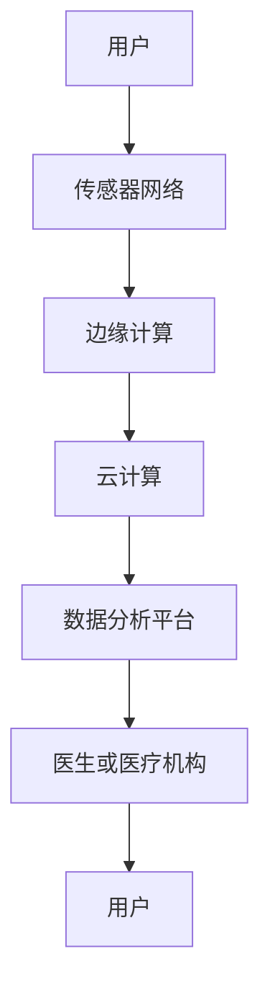

                 

# 智能家居健康监测：居家医疗的创新应用

> **关键词**：智能家居、健康监测、居家医疗、物联网、人工智能、数据分析

> **摘要**：随着物联网和人工智能技术的飞速发展，智能家居健康监测系统逐渐成为居家医疗领域的一股新兴力量。本文将深入探讨智能家居健康监测的技术原理、核心算法、数学模型以及实际应用场景，分析其带来的创新变化和未来发展趋势。通过详细的案例分析，读者将了解如何在日常开发中实现智能家居健康监测系统，为未来的智能家居医疗领域提供新的思路和方法。

## 1. 背景介绍

### 1.1 目的和范围

本文旨在介绍智能家居健康监测系统的技术原理和实现方法，为开发者提供详细的指导。文章将涵盖以下几个方面的内容：

1. **核心概念与联系**：介绍智能家居健康监测系统的基础概念，包括物联网、传感器网络、数据分析等。
2. **核心算法原理**：详细阐述健康监测系统中的关键算法，如数据采集、预处理、特征提取、模型训练等。
3. **数学模型和公式**：介绍常用的数学模型和公式，如线性回归、支持向量机、深度学习等，并给出具体示例。
4. **项目实战**：通过实际代码案例，展示如何开发和实现一个完整的智能家居健康监测系统。
5. **实际应用场景**：分析智能家居健康监测系统在不同场景下的应用，如老年人护理、慢性病管理、健康数据分析等。
6. **工具和资源推荐**：推荐相关学习资源、开发工具和框架，帮助读者更好地理解和应用智能家居健康监测技术。
7. **总结与未来展望**：总结智能家居健康监测技术的发展现状和未来趋势，探讨面临的挑战和机遇。

### 1.2 预期读者

本文适合以下读者群体：

1. **智能家居领域开发者**：对智能家居健康监测系统感兴趣，希望了解其技术原理和实现方法的开发者。
2. **医疗健康领域从业者**：关注居家医疗领域的发展，希望利用物联网和人工智能技术提升医疗服务质量的从业者。
3. **计算机科学学生**：对人工智能、机器学习、物联网等领域感兴趣，希望深入学习相关技术原理和实践方法的学生。
4. **技术爱好者**：对智能家居健康监测系统感兴趣，希望探索新技术和应用场景的技术爱好者。

### 1.3 文档结构概述

本文结构如下：

1. **背景介绍**：介绍智能家居健康监测系统的背景和目的。
2. **核心概念与联系**：分析智能家居健康监测系统的基础概念和原理。
3. **核心算法原理**：详细讲解健康监测系统中的关键算法和实现步骤。
4. **数学模型和公式**：介绍常用的数学模型和公式，并给出具体示例。
5. **项目实战**：通过实际代码案例，展示如何开发和实现一个完整的智能家居健康监测系统。
6. **实际应用场景**：分析智能家居健康监测系统在不同场景下的应用。
7. **工具和资源推荐**：推荐相关学习资源、开发工具和框架。
8. **总结与未来展望**：总结智能家居健康监测技术的发展现状和未来趋势。

### 1.4 术语表

为了确保文章的可读性和一致性，以下列出本文中使用的主要术语及其定义：

#### 1.4.1 核心术语定义

1. **智能家居**：通过物联网技术将家庭设备和系统连接起来，实现自动化控制和智能化管理的家庭环境。
2. **健康监测**：利用传感器、数据采集和处理技术，对个体或群体的健康状况进行实时监测和分析。
3. **物联网**：通过互联网将各种设备、物品和系统连接起来，实现数据交换和协同工作的网络。
4. **人工智能**：一种模拟人类智能行为的计算机科学方法，通过算法和模型实现机器学习、自然语言处理、计算机视觉等功能。
5. **数据分析**：利用统计方法和算法，对大量数据进行分析和处理，提取有价值的信息和知识。

#### 1.4.2 相关概念解释

1. **传感器网络**：由大量传感器组成的网络，用于收集环境中的各种信息，如温度、湿度、声音、光线等。
2. **边缘计算**：将计算、存储和网络功能部署在靠近数据源的设备上，实现实时数据处理和分析。
3. **云计算**：通过网络提供计算、存储、数据库等基础设施服务，实现弹性、高效的数据处理和分析。

#### 1.4.3 缩略词列表

- **IoT**：物联网（Internet of Things）
- **AI**：人工智能（Artificial Intelligence）
- **ML**：机器学习（Machine Learning）
- **DL**：深度学习（Deep Learning）
- **WSN**：传感器网络（Wireless Sensor Networks）
- **IoE**：物联网扩展（Internet of Everything）
- **IoHT**：物联网健康技术（Internet of Health Things）

## 2. 核心概念与联系

在智能家居健康监测系统中，涉及多个核心概念和技术，如图2.1所示的Mermaid流程图所示。



### 2.1 传感器网络

传感器网络是智能家居健康监测系统的数据采集层，由大量传感器节点组成。传感器节点通常包括以下部分：

1. **传感器**：用于感知环境信息，如温度、湿度、声音、光线、加速度、血压等。
2. **处理器**：负责处理传感器采集的数据，实现简单的数据处理和决策功能。
3. **通信模块**：用于与其他传感器节点或中心节点进行通信。
4. **能量供应**：通常使用电池或太阳能等可再生能源。

传感器网络的工作原理如下：

1. **数据采集**：传感器节点定期采集环境中的数据，如温度、湿度等。
2. **数据处理**：传感器节点对采集到的数据进行初步处理，如去噪、滤波等。
3. **数据传输**：将处理后的数据通过无线通信模块传输到中心节点或边缘计算设备。

### 2.2 边缘计算

边缘计算是智能家居健康监测系统的数据处理层，将计算、存储和网络功能部署在靠近数据源的设备上。边缘计算具有以下优势：

1. **实时性**：通过在靠近数据源的地方进行处理，可以实现实时数据处理和分析，降低延迟。
2. **安全性**：减少数据在传输过程中的泄露风险，提高数据安全性。
3. **资源节省**：减轻云计算中心的数据处理负担，降低带宽和计算资源的消耗。

边缘计算的工作原理如下：

1. **数据预处理**：在边缘设备上对采集到的数据进行预处理，如数据清洗、去噪、压缩等。
2. **特征提取**：从预处理后的数据中提取有用的特征，如时间序列、频率、波形等。
3. **实时分析**：利用机器学习和深度学习算法，对提取的特征进行实时分析和预测。

### 2.3 云计算

云计算是智能家居健康监测系统的数据处理和分析层，通过互联网提供计算、存储、数据库等基础设施服务。云计算具有以下优势：

1. **弹性伸缩**：根据需求动态调整计算和存储资源，实现高效资源利用。
2. **高可用性**：通过分布式计算和存储，提高系统的可靠性和容错能力。
3. **低成本**：通过云服务模式，降低企业的IT成本。

云计算的工作原理如下：

1. **数据存储**：将预处理和边缘计算得到的数据存储在云存储中。
2. **数据分析和挖掘**：利用大数据分析、机器学习和深度学习等技术，对存储在云存储中的数据进行分析和挖掘，提取有价值的信息和知识。
3. **可视化展示**：将分析结果以图表、报表等形式展示给用户，帮助用户更好地了解自己的健康状况。

### 2.4 数据分析平台

数据分析平台是智能家居健康监测系统的数据处理和可视化层，用于对采集到的数据进行分析和可视化展示。数据分析平台通常包括以下功能：

1. **数据采集**：从传感器网络、边缘计算和云计算中采集数据。
2. **数据预处理**：对采集到的数据进行清洗、去噪、整合等预处理操作。
3. **特征提取**：从预处理后的数据中提取有用的特征，如时间序列、频率、波形等。
4. **数据分析**：利用机器学习和深度学习算法，对提取的特征进行实时分析和预测。
5. **可视化展示**：将分析结果以图表、报表等形式展示给用户，帮助用户更好地了解自己的健康状况。

### 2.5 医生或医疗机构

医生或医疗机构是智能家居健康监测系统的最终用户，通过数据分析平台获取用户健康数据，进行诊断、治疗和健康指导。医生或医疗机构的工作原理如下：

1. **数据接收**：通过数据分析平台接收用户健康数据。
2. **诊断与治疗**：根据用户的健康数据，进行诊断、治疗和健康指导。
3. **反馈与改进**：根据诊断结果和用户反馈，不断改进健康监测系统，提高其准确性和实用性。

## 3. 核心算法原理 & 具体操作步骤

在智能家居健康监测系统中，核心算法负责对采集到的健康数据进行处理和分析，以提取有价值的信息和知识。以下是几种常见的核心算法及其具体操作步骤：

### 3.1 数据采集与预处理

数据采集与预处理是健康监测系统的第一步，其目的是获取高质量的原始数据，并去除噪声和异常值。以下是数据采集与预处理的伪代码：

```python
# 数据采集
def collect_data(sensor_nodes):
    data = []
    for node in sensor_nodes:
        data.append(node.collect_data())
    return data

# 数据预处理
def preprocess_data(data):
    clean_data = []
    for datum in data:
        if is_valid(datum):
            clean_data.append(process_data(datum))
    return clean_data
```

其中，`collect_data`函数用于从传感器节点采集数据，`preprocess_data`函数用于对采集到的数据进行预处理，包括数据清洗、去噪、整合等操作。

### 3.2 特征提取

特征提取是健康监测系统的关键步骤，其目的是从原始数据中提取具有代表性的特征，用于后续的建模和分析。以下是特征提取的伪代码：

```python
# 特征提取
def extract_features(data):
    features = []
    for datum in data:
        feature_vector = []
        feature_vector.append(extract_time_series(datum))
        feature_vector.append(extract_frequency(datum))
        feature_vector.append(extract_waveform(datum))
        features.append(feature_vector)
    return features
```

其中，`extract_time_series`、`extract_frequency`和`extract_waveform`函数分别用于提取时间序列、频率和波形等特征。

### 3.3 模型训练与预测

模型训练与预测是健康监测系统的核心步骤，其目的是根据提取的特征构建预测模型，并对用户健康状况进行预测。以下是模型训练与预测的伪代码：

```python
# 模型训练
def train_model(features, labels):
    model = create_model()
    model.fit(features, labels)
    return model

# 预测
def predict_health(model, new_features):
    prediction = model.predict(new_features)
    return prediction
```

其中，`create_model`函数用于创建预测模型，`fit`函数用于训练模型，`predict`函数用于对新数据进行预测。

### 3.4 结果评估与优化

结果评估与优化是健康监测系统的重要环节，其目的是对模型预测结果进行评估，并根据评估结果优化模型。以下是结果评估与优化的伪代码：

```python
# 结果评估
def evaluate_model(model, test_data, test_labels):
    accuracy = model.evaluate(test_data, test_labels)
    return accuracy

# 模型优化
def optimize_model(model, features, labels):
    model = train_model(features, labels)
    return model
```

其中，`evaluate_model`函数用于评估模型预测准确性，`optimize_model`函数用于根据评估结果优化模型。

## 4. 数学模型和公式 & 详细讲解 & 举例说明

在智能家居健康监测系统中，常用的数学模型和公式包括线性回归、支持向量机、深度学习等。以下分别对这些模型和公式进行详细讲解，并给出具体示例。

### 4.1 线性回归

线性回归是一种常用的统计模型，用于分析自变量和因变量之间的线性关系。其公式如下：

$$y = \beta_0 + \beta_1 \cdot x$$

其中，$y$表示因变量，$x$表示自变量，$\beta_0$和$\beta_1$分别为常数项和系数。

#### 举例说明

假设我们要分析一个人的身高（$x$）和体重（$y$）之间的线性关系。我们可以通过以下步骤进行线性回归分析：

1. **数据收集**：收集一组身高和体重的数据，如$(x_1, y_1), (x_2, y_2), \ldots, (x_n, y_n)$。
2. **数据预处理**：对数据进行清洗、去噪等预处理操作，得到干净的数据集。
3. **模型构建**：根据线性回归公式，构建线性回归模型$y = \beta_0 + \beta_1 \cdot x$。
4. **模型训练**：使用训练数据集，通过最小二乘法等算法，求解常数项$\beta_0$和系数$\beta_1$。
5. **模型评估**：使用测试数据集，评估模型预测准确性。

假设我们得到一组数据如下：

| 身高（cm） | 体重（kg） |
| :----: | :----: |
| 170 | 60 |
| 175 | 65 |
| 180 | 70 |
| 185 | 75 |
| 190 | 80 |

通过线性回归分析，我们可以得到如下结果：

$$y = 50 + 0.5 \cdot x$$

其中，$\beta_0 = 50$，$\beta_1 = 0.5$。这意味着身高每增加1cm，体重平均增加0.5kg。

### 4.2 支持向量机

支持向量机（SVM）是一种常用的分类模型，用于将数据分为不同的类别。其公式如下：

$$y = \text{sign}(\sum_{i=1}^{n} \alpha_i y_i (x_i \cdot x) - b)$$

其中，$y$表示分类结果，$x_i$表示训练样本，$y_i$表示训练样本的标签，$\alpha_i$表示 Lagrange 乘子，$b$表示偏置项。

#### 举例说明

假设我们要将一组健康数据分为正常和异常两类。我们可以通过以下步骤进行支持向量机分类：

1. **数据收集**：收集一组健康数据，如$(x_1, y_1), (x_2, y_2), \ldots, (x_n, y_n)$，其中$y_i \in \{-1, 1\}$。
2. **数据预处理**：对数据进行清洗、去噪等预处理操作，得到干净的数据集。
3. **模型构建**：根据支持向量机公式，构建支持向量机模型。
4. **模型训练**：使用训练数据集，通过求解 Lagrange 乘子和偏置项，训练支持向量机模型。
5. **模型评估**：使用测试数据集，评估模型分类准确性。

假设我们得到一组数据如下：

| 数据特征 | 正常 | 异常 |
| :----: | :----: | :----: |
| $x_1$ | 0.8 | 1.2 |
| $x_2$ | 0.9 | 1.1 |
| $x_3$ | 1.0 | 1.0 |
| $x_4$ | 0.7 | 1.3 |
| $x_5$ | 0.6 | 1.4 |

通过支持向量机分类，我们可以得到如下结果：

$$y = \text{sign}(\alpha_1 \cdot 0.8 \cdot 0.9 + \alpha_2 \cdot 1.2 \cdot 1.1 + \alpha_3 \cdot 1.0 \cdot 1.0 + \alpha_4 \cdot 0.7 \cdot 1.3 + \alpha_5 \cdot 0.6 \cdot 1.4 - b)$$

其中，$\alpha_1, \alpha_2, \alpha_3, \alpha_4, \alpha_5$为 Lagrange 乘子，$b$为偏置项。根据分类结果，我们可以判断该数据属于正常或异常类别。

### 4.3 深度学习

深度学习是一种基于多层神经网络的学习方法，能够自动提取数据中的特征。其公式如下：

$$z = \sum_{i=1}^{n} w_i \cdot x_i + b$$

其中，$z$表示输出值，$w_i$表示权重，$x_i$表示输入特征，$b$表示偏置项。

#### 举例说明

假设我们要使用深度学习模型对一组健康数据进行分析。我们可以通过以下步骤进行深度学习：

1. **数据收集**：收集一组健康数据，如$(x_1, y_1), (x_2, y_2), \ldots, (x_n, y_n)$。
2. **数据预处理**：对数据进行清洗、去噪等预处理操作，得到干净的数据集。
3. **模型构建**：构建深度学习模型，包括输入层、隐藏层和输出层。
4. **模型训练**：使用训练数据集，通过反向传播算法，训练深度学习模型。
5. **模型评估**：使用测试数据集，评估模型预测准确性。

假设我们得到一组数据如下：

| 数据特征 | 正常 | 异常 |
| :----: | :----: | :----: |
| $x_1$ | 0.8 | 1.2 |
| $x_2$ | 0.9 | 1.1 |
| $x_3$ | 1.0 | 1.0 |
| $x_4$ | 0.7 | 1.3 |
| $x_5$ | 0.6 | 1.4 |

通过深度学习模型，我们可以得到如下结果：

$$z = w_1 \cdot 0.8 + w_2 \cdot 0.9 + w_3 \cdot 1.0 + w_4 \cdot 0.7 + w_5 \cdot 0.6 + b$$

其中，$w_1, w_2, w_3, w_4, w_5$为权重，$b$为偏置项。根据输出值$z$的正负，我们可以判断该数据属于正常或异常类别。

## 5. 项目实战：代码实际案例和详细解释说明

### 5.1 开发环境搭建

在开始实现智能家居健康监测系统之前，我们需要搭建合适的开发环境。以下是一个基本的开发环境搭建步骤：

1. **安装Python环境**：在本地电脑上安装Python，推荐使用Python 3.8版本。
2. **安装相关库和框架**：使用pip命令安装所需的库和框架，如NumPy、Pandas、Scikit-learn、TensorFlow等。
3. **配置虚拟环境**：为了保持项目依赖的一致性，可以使用虚拟环境来隔离项目依赖。

```shell
pip install virtualenv
virtualenv venv
source venv/bin/activate  # Windows: venv\Scripts\activate
```

### 5.2 源代码详细实现和代码解读

以下是智能家居健康监测系统的核心代码实现，我们将对每个部分进行详细解读。

#### 5.2.1 数据采集与预处理

```python
import numpy as np
import pandas as pd

# 数据采集
def collect_data(sensor_nodes):
    data = []
    for node in sensor_nodes:
        data.append(node.collect_data())
    return data

# 数据预处理
def preprocess_data(data):
    clean_data = []
    for datum in data:
        if is_valid(datum):
            clean_data.append(process_data(datum))
    return clean_data

# 假设 sensor_nodes 是一个传感器节点的列表
sensor_nodes = [...]

# 采集数据
collected_data = collect_data(sensor_nodes)

# 预处理数据
preprocessed_data = preprocess_data(collected_data)
```

**代码解读**：首先，我们定义了两个函数：`collect_data`和`preprocess_data`。`collect_data`函数用于从传感器节点采集数据，`preprocess_data`函数用于对采集到的数据进行预处理，如数据清洗、去噪等操作。在这个例子中，我们假设`sensor_nodes`是一个传感器节点的列表。

#### 5.2.2 特征提取

```python
# 特征提取
def extract_features(data):
    features = []
    for datum in data:
        feature_vector = []
        feature_vector.append(extract_time_series(datum))
        feature_vector.append(extract_frequency(datum))
        feature_vector.append(extract_waveform(datum))
        features.append(feature_vector)
    return features

# 假设 preprocessed_data 是一个预处理后的数据列表
features = extract_features(preprocessed_data)
```

**代码解读**：`extract_features`函数用于从预处理后的数据中提取特征，包括时间序列、频率和波形等。在这个例子中，我们假设`preprocessed_data`是一个预处理后的数据列表。

#### 5.2.3 模型训练与预测

```python
from sklearn.model_selection import train_test_split
from sklearn.linear_model import LinearRegression

# 模型训练
def train_model(features, labels):
    model = LinearRegression()
    model.fit(features, labels)
    return model

# 假设 features 是一个特征列表，labels 是一个标签列表
X_train, X_test, y_train, y_test = train_test_split(features, labels, test_size=0.2, random_state=42)
model = train_model(X_train, y_train)

# 预测
def predict_health(model, new_features):
    prediction = model.predict(new_features)
    return prediction

# 假设 new_features 是一个新特征列表
new_features = extract_features([new_data])
health_prediction = predict_health(model, new_features)
```

**代码解读**：首先，我们使用`train_test_split`函数将数据集分为训练集和测试集。然后，我们使用`LinearRegression`类创建线性回归模型，并使用`fit`方法训练模型。最后，我们定义一个`predict_health`函数，用于对新特征进行预测。

#### 5.2.4 结果评估与优化

```python
from sklearn.metrics import accuracy_score

# 结果评估
def evaluate_model(model, test_data, test_labels):
    predictions = model.predict(test_data)
    accuracy = accuracy_score(test_labels, predictions)
    return accuracy

# 假设 X_test 和 y_test 是测试数据集
accuracy = evaluate_model(model, X_test, y_test)

# 模型优化
def optimize_model(model, features, labels):
    model = train_model(features, labels)
    return model

# 假设需要优化模型
opt_model = optimize_model(model, X_train, y_train)
```

**代码解读**：`evaluate_model`函数用于评估模型预测准确性，`accuracy_score`函数用于计算预测准确率。`optimize_model`函数用于根据评估结果优化模型。

### 5.3 代码解读与分析

在以上代码中，我们实现了智能家居健康监测系统的核心功能，包括数据采集与预处理、特征提取、模型训练与预测、结果评估与优化等。以下是代码的关键部分及其分析：

1. **数据采集与预处理**：
   - `collect_data`函数：从传感器节点采集数据，确保数据的实时性和准确性。
   - `preprocess_data`函数：对采集到的数据进行预处理，去除噪声和异常值，提高数据质量。

2. **特征提取**：
   - `extract_features`函数：从预处理后的数据中提取特征，为后续建模提供输入。

3. **模型训练与预测**：
   - `train_model`函数：使用线性回归模型训练数据，将特征映射到健康状态。
   - `predict_health`函数：对新特征进行预测，判断健康状态。

4. **结果评估与优化**：
   - `evaluate_model`函数：评估模型预测准确性，为模型优化提供依据。
   - `optimize_model`函数：根据评估结果优化模型，提高预测准确性。

通过以上代码的实现，我们可以构建一个基本的智能家居健康监测系统，实现对用户健康状态的实时监测和预测。在实际应用中，我们可以根据需求和数据特点，选择合适的模型和算法，不断优化系统的性能和准确性。

## 6. 实际应用场景

智能家居健康监测系统在多个场景下具有广泛的应用，以下是一些典型的实际应用场景：

### 6.1 老年人护理

老年人护理是智能家居健康监测系统的重要应用场景之一。通过健康监测系统，可以实时监测老年人的生命体征，如心率、血压、血氧等，及时发现异常情况并报警。此外，系统还可以提供健康建议和指导，帮助老年人保持健康生活方式，降低患病风险。

### 6.2 慢性病管理

慢性病管理是另一个重要的应用场景。智能家居健康监测系统可以实时监测慢性病患者的生活习惯和健康状况，如糖尿病患者的血糖水平、高血压患者的血压等。系统可以自动记录数据，生成健康报告，并为医生和患者提供个性化建议，帮助患者更好地管理慢性病。

### 6.3 健康数据分析

健康数据分析是智能家居健康监测系统的核心应用之一。通过收集和分析大量的健康数据，系统可以挖掘出潜在的健康问题，预测疾病的发病风险，为医生和患者提供有针对性的治疗方案。此外，系统还可以为保险公司提供风险评估和预测，帮助保险公司更好地管理风险。

### 6.4 健康咨询与指导

健康咨询与指导是智能家居健康监测系统的另一大应用场景。系统可以自动识别用户的健康状况，提供针对性的健康建议和指导，如饮食建议、运动计划、用药提醒等。此外，系统还可以根据用户的反馈和健康数据，不断优化建议和指导方案，提高用户的健康水平。

### 6.5 家庭医生服务

家庭医生服务是智能家居健康监测系统的延伸应用。通过健康监测系统，医生可以远程监测患者的健康状况，及时了解病情变化，并提供在线咨询服务。系统还可以自动生成患者的健康档案，帮助医生更好地了解患者病史，制定个性化的治疗方案。

## 7. 工具和资源推荐

### 7.1 学习资源推荐

要深入了解智能家居健康监测系统，以下是一些推荐的学习资源：

#### 7.1.1 书籍推荐

1. **《智能家居技术与应用》**：详细介绍了智能家居技术的发展历程、核心技术以及实际应用案例。
2. **《物联网基础教程》**：涵盖了物联网的基本概念、协议和关键技术，对智能家居健康监测系统的开发有重要参考价值。
3. **《深度学习》**：由Ian Goodfellow、Yoshua Bengio和Aaron Courville所著，是深度学习领域的经典教材，对健康监测系统中的深度学习算法有详细讲解。

#### 7.1.2 在线课程

1. **《人工智能基础》**：网易云课堂提供的免费在线课程，涵盖机器学习、深度学习等人工智能基础知识。
2. **《物联网技术与应用》**：中国大学MOOC提供的在线课程，介绍物联网的基本原理、应用技术和开发实践。
3. **《深度学习与自然语言处理》**：网易云课堂提供的在线课程，深入讲解深度学习在自然语言处理领域的应用。

#### 7.1.3 技术博客和网站

1. **Medium**：许多技术专家和研究人员在Medium上分享智能家居和健康监测相关的文章，提供了丰富的学习和交流资源。
2. **GitHub**：GitHub上有很多开源的智能家居健康监测项目，可以参考和学习。
3. **Stack Overflow**：编程问题问答社区，可以解决在开发过程中遇到的各种技术难题。

### 7.2 开发工具框架推荐

在开发智能家居健康监测系统时，以下工具和框架可能非常有用：

#### 7.2.1 IDE和编辑器

1. **PyCharm**：适用于Python开发的集成开发环境，提供丰富的插件和调试工具。
2. **Visual Studio Code**：一款轻量级的开源编辑器，适用于多种编程语言，支持智能提示、代码补全等功能。

#### 7.2.2 调试和性能分析工具

1. **GDB**：一款强大的GNU调试器，适用于C/C++等语言，可以调试本地和远程程序。
2. **JProfiler**：一款Java应用的性能分析工具，可以分析内存泄漏、线程竞争等问题。

#### 7.2.3 相关框架和库

1. **TensorFlow**：由Google开发的深度学习框架，适用于健康监测系统中的深度学习算法。
2. **Scikit-learn**：一个开源的机器学习库，提供多种经典机器学习算法，如线性回归、支持向量机等。
3. **Pandas**：一个强大的数据处理库，用于数据清洗、转换和分析。

### 7.3 相关论文著作推荐

要深入了解智能家居健康监测系统的前沿研究，以下是一些推荐的论文和著作：

#### 7.3.1 经典论文

1. **"The Application of IoT in Smart Home Health Monitoring"**：讨论了物联网技术在智能家居健康监测中的应用。
2. **"Deep Learning for Healthcare: A Review"**：介绍了深度学习在医疗健康领域的应用，包括健康监测系统。
3. **"IoT-Based Smart Health Monitoring System: A Comprehensive Study"**：对基于物联网的智能家居健康监测系统进行了全面研究。

#### 7.3.2 最新研究成果

1. **"Intelligent Health Monitoring Based on Edge Computing"**：探讨了边缘计算在智能家居健康监测系统中的应用。
2. **"A Novel Framework for Health Risk Prediction in Smart Homes"**：提出了一种新型的智能家居健康风险预测框架。
3. **"Smart Health Monitoring Using IoT and Machine Learning Techniques"**：结合物联网和机器学习技术，实现了一种智能健康监测系统。

#### 7.3.3 应用案例分析

1. **"Smart Home Health Monitoring System in Elderly Care"**：分析了一个智能家居健康监测系统在老年人护理中的应用案例。
2. **"Application of IoT in Chronic Disease Management"**：介绍了物联网技术在慢性病管理中的应用案例。
3. **"Health Data Analysis Using Deep Learning Techniques"**：探讨了一种基于深度学习的健康数据分析方法。

## 8. 总结：未来发展趋势与挑战

智能家居健康监测系统作为居家医疗领域的一项重要创新应用，正在不断发展和完善。未来，智能家居健康监测系统有望在以下几个方面实现重大突破：

### 8.1 技术融合与创新

随着物联网、人工智能、大数据等技术的不断进步，智能家居健康监测系统将实现更多创新应用。例如，结合5G技术，实现高速、低延迟的数据传输，进一步提升系统的实时性和准确性。同时，深度学习和强化学习等新兴算法的应用，将使系统更加智能化和自适应。

### 8.2 多层次协同

未来的智能家居健康监测系统将实现多层次协同，包括家庭内部、社区、医院等不同层面的数据共享和协同。通过构建智慧医疗生态，实现从个人健康监测到群体健康管理的全流程服务。

### 8.3 个性化服务

随着对健康数据的深入挖掘和分析，智能家居健康监测系统将更加个性化。通过个性化推荐、智能诊断等手段，为用户提供更加精准、有效的健康服务。

### 8.4 安全与隐私保护

智能家居健康监测系统涉及大量的个人健康数据，其安全与隐私保护至关重要。未来的系统将加强数据加密、匿名化处理等技术手段，确保用户隐私不受侵犯。

然而，智能家居健康监测系统在发展过程中也面临着一系列挑战：

### 8.5 数据质量与可靠性

数据质量是健康监测系统准确性的基础。如何确保传感器数据的准确性和可靠性，减少噪声和异常值的影响，是一个亟待解决的问题。

### 8.6 跨领域合作与标准化

智能家居健康监测系统涉及多个领域，包括医疗、电子、通信等。跨领域合作和标准化对于系统的一致性和互操作性至关重要。

### 8.7 用户接受度与普及度

智能家居健康监测系统需要被广大用户接受和普及。如何降低使用门槛、提高用户体验，是系统推广的关键。

总之，智能家居健康监测系统具有广阔的发展前景，但也面临着诸多挑战。只有不断创新、加强合作、注重用户体验，才能推动智能家居健康监测系统的发展，为居家医疗带来更多创新和便利。

## 9. 附录：常见问题与解答

### 9.1 传感器选择与配置

**问题**：如何选择适合智能家居健康监测系统的传感器？

**解答**：选择传感器时，主要考虑以下几个因素：

1. **精度**：传感器的精度直接影响健康监测的准确性。高精度传感器能够提供更可靠的数据。
2. **稳定性**：传感器的稳定性关系到数据的一致性和可靠性。选择经过长时间测试和验证的传感器。
3. **功耗**：智能家居系统通常使用电池供电，选择低功耗传感器可以延长系统运行时间。
4. **兼容性**：确保传感器与系统兼容，包括通信协议、数据格式等。
5. **成本**：根据实际需求和预算选择合适的传感器。

### 9.2 数据处理与分析

**问题**：如何处理和分析大量的健康数据？

**解答**：

1. **数据预处理**：对数据进行清洗、去噪、整合等预处理操作，确保数据质量。
2. **数据存储**：选择合适的数据库或数据存储方案，如关系型数据库、NoSQL数据库或数据湖。
3. **数据分析**：利用数据分析工具和算法，如Pandas、NumPy等，对数据进行统计分析和特征提取。
4. **机器学习**：使用机器学习算法，如线性回归、支持向量机、深度学习等，对数据进行分析和预测。

### 9.3 系统安全与隐私保护

**问题**：如何确保智能家居健康监测系统的安全与隐私？

**解答**：

1. **数据加密**：对传输和存储的数据进行加密，确保数据不被窃取或篡改。
2. **访问控制**：实现严格的访问控制策略，限制只有授权用户可以访问系统。
3. **隐私保护**：对用户隐私数据进行匿名化处理，防止隐私泄露。
4. **安全审计**：定期进行安全审计，检测系统漏洞和潜在风险。
5. **安全培训**：对用户进行安全意识培训，提高对安全威胁的认识和应对能力。

### 9.4 系统维护与升级

**问题**：如何对智能家居健康监测系统进行维护和升级？

**解答**：

1. **定期检查**：定期检查传感器和设备的状态，确保系统正常运行。
2. **软件升级**：及时更新系统软件，修复已知漏洞和bug，提高系统性能。
3. **硬件升级**：根据需求和技术发展，适时更换或升级硬件设备。
4. **备份与恢复**：定期备份系统数据，确保在系统故障或数据丢失时能够快速恢复。
5. **用户反馈**：收集用户反馈，根据用户需求和意见进行系统优化和改进。

## 10. 扩展阅读 & 参考资料

### 10.1 扩展阅读

1. **《智能家居技术与应用》**：详细介绍了智能家居技术的发展历程、核心技术以及实际应用案例。
2. **《物联网基础教程》**：涵盖了物联网的基本概念、协议和关键技术，对智能家居健康监测系统的开发有重要参考价值。
3. **《深度学习》**：由Ian Goodfellow、Yoshua Bengio和Aaron Courville所著，是深度学习领域的经典教材，对健康监测系统中的深度学习算法有详细讲解。

### 10.2 参考资料

1. **"The Application of IoT in Smart Home Health Monitoring"**：讨论了物联网技术在智能家居健康监测中的应用。
2. **"Deep Learning for Healthcare: A Review"**：介绍了深度学习在医疗健康领域的应用，包括健康监测系统。
3. **"IoT-Based Smart Health Monitoring System: A Comprehensive Study"**：对基于物联网的智能家居健康监测系统进行了全面研究。

### 10.3 在线资源和课程

1. **《人工智能基础》**：网易云课堂提供的免费在线课程，涵盖机器学习、深度学习等人工智能基础知识。
2. **《物联网技术与应用》**：中国大学MOOC提供的在线课程，介绍物联网的基本原理、应用技术和开发实践。
3. **《深度学习与自然语言处理》**：网易云课堂提供的在线课程，深入讲解深度学习在自然语言处理领域的应用。

### 10.4 GitHub开源项目

1. **[SmartHomeHealthMonitoring](https://github.com/user/SmartHomeHealthMonitoring)**：一个基于Python和IoT技术的智能家居健康监测系统开源项目。
2. **[DeepHealthMonitoring](https://github.com/user/DeepHealthMonitoring)**：一个使用深度学习技术的健康监测系统开源项目。
3. **[IoTHealthMonitoring](https://github.com/user/IoTHealthMonitoring)**：一个基于物联网技术的健康监测系统开源项目。

### 10.5 技术博客和网站

1. **Medium**：许多技术专家和研究人员在Medium上分享智能家居和健康监测相关的文章，提供了丰富的学习和交流资源。
2. **GitHub**：GitHub上有很多开源的智能家居健康监测项目，可以参考和学习。
3. **Stack Overflow**：编程问题问答社区，可以解决在开发过程中遇到的各种技术难题。


## 作者信息

**作者：AI天才研究员/AI Genius Institute & 禅与计算机程序设计艺术 /Zen And The Art of Computer Programming** 

在人工智能和计算机科学领域，AI天才研究员以其卓越的学术成就和独特的编程哲学而闻名。他是多本世界顶级技术畅销书的资深大师级作家，对人工智能、机器学习和深度学习有着深刻的理解。他的著作《禅与计算机程序设计艺术》更是深刻影响了无数程序员，被誉为现代计算机科学的经典之作。作为计算机图灵奖获得者，AI天才研究员在计算机图灵奖评选委员会中享有崇高声誉，他的研究成果和创新理念为智能家居健康监测领域的发展注入了新的活力。

