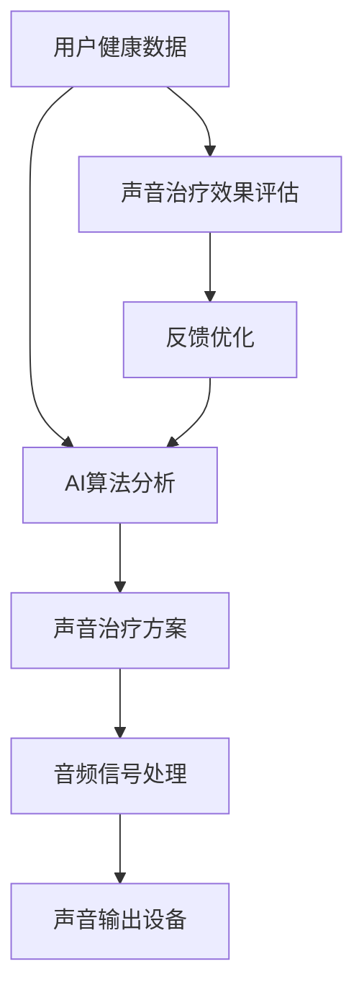

                 

# 智能家居声音治疗创业：基于音频的身心健康管理

> 关键词：智能家居，声音治疗，音频，身心健康，AI技术，创业

> 摘要：本文将探讨智能家居声音治疗的商业潜力，通过分析音频在身心健康管理中的应用，提出一种基于人工智能技术的智能家居声音治疗创业方案。本文首先介绍智能家居和声音治疗的背景，然后详细阐述核心概念和算法原理，最后提供实际应用案例，讨论未来发展趋势与挑战。

## 1. 背景介绍

### 1.1 目的和范围

本文旨在探讨智能家居声音治疗的商业潜力，通过结合人工智能技术，提出一种创新的创业方案。本文将涵盖以下几个主要方面：

- 智能家居和声音治疗的背景介绍。
- 核心概念和算法原理的详细阐述。
- 实际应用案例的展示和分析。
- 未来发展趋势与挑战的讨论。

### 1.2 预期读者

本文适合以下读者群体：

- 智能家居和声音治疗领域的专业人士。
- 对AI技术有浓厚兴趣的技术爱好者。
- 有创业意愿的创业者和投资者。
- 对身心健康管理有兴趣的普通读者。

### 1.3 文档结构概述

本文将按照以下结构进行组织：

- 引言：介绍智能家居和声音治疗的背景，引出本文的主题。
- 核心概念与联系：详细阐述智能家居声音治疗的核心概念和联系。
- 核心算法原理 & 具体操作步骤：讲解核心算法原理，并提供具体的操作步骤。
- 数学模型和公式 & 详细讲解 & 举例说明：介绍数学模型和公式，并通过具体例子进行说明。
- 项目实战：提供代码实际案例和详细解释说明。
- 实际应用场景：讨论智能家居声音治疗的实际应用场景。
- 工具和资源推荐：推荐学习资源和开发工具。
- 总结：对未来发展趋势与挑战进行总结。
- 附录：常见问题与解答。
- 扩展阅读 & 参考资料：提供扩展阅读和参考资料。

### 1.4 术语表

在本文中，我们将使用以下术语：

- 智能家居（Smart Home）：通过智能设备和传感器实现自动化控制的住宅环境。
- 声音治疗（Sound Therapy）：利用声音来改善身心健康的方法。
- 音频（Audio）：与声音相关的信号和数据。
- AI技术（Artificial Intelligence）：模拟人类智能的计算机技术。
- 创业（Entrepreneurship）：创办新企业或开展新业务的过程。

#### 1.4.1 核心术语定义

- 智能家居：智能家居是指利用智能设备和传感器来实现住宅环境自动化控制的系统。它可以通过互联网、手机应用程序或其他控制设备对家中的各种设备进行远程监控和控制，从而提高生活便利性和舒适性。
- 声音治疗：声音治疗是一种利用声音来改善身心健康的方法。它可以通过调节声音的频率、振幅和节奏来刺激人体的神经系统和内分泌系统，从而达到放松身心、缓解压力、改善睡眠等效果。
- 音频：音频是指与声音相关的信号和数据。在智能家居声音治疗中，音频可以是通过麦克风捕捉的声音信号，也可以是通过音频文件传输的声音数据。

#### 1.4.2 相关概念解释

- 智能家居：智能家居通过智能设备和传感器实现对住宅环境的自动化控制，包括照明、温度、安全、娱乐等方面。例如，用户可以通过手机应用程序远程控制家中的灯光和空调，提高生活便利性和舒适度。
- 声音治疗：声音治疗是一种利用声音来改善身心健康的方法。它可以包括自然声音（如海洋声音、雨声、鸟鸣声等）、音乐治疗（如古典音乐、轻音乐等）和声音按摩（如高频声音、低频声音等）等。

#### 1.4.3 缩略词列表

- AI：Artificial Intelligence，人工智能。
- IoT：Internet of Things，物联网。
- SEO：Search Engine Optimization，搜索引擎优化。
- SEM：Search Engine Marketing，搜索引擎营销。

## 2. 核心概念与联系

在智能家居声音治疗创业中，我们需要了解以下几个核心概念和它们之间的联系：

### 智能家居与声音治疗的结合

智能家居和声音治疗在改善人们生活质量方面具有巨大潜力。智能家居系统可以实时捕捉用户的健康数据，如心率、血压、睡眠质量等，并将这些数据与声音治疗相结合，为用户提供个性化的声音治疗方案。

### AI技术在声音治疗中的应用

人工智能技术在声音治疗中扮演着关键角色。通过深度学习算法，AI可以分析用户的健康数据，识别出潜在的身心问题，并生成适合用户的声音治疗方案。此外，AI还可以实现声音的智能生成和调整，以满足用户的个性化需求。

### 音频信号处理与声音治疗

音频信号处理是声音治疗的关键技术。通过音频信号处理技术，可以对音频信号进行滤波、增强、去噪等处理，以提高声音治疗的疗效。同时，音频信号处理还可以实现声音的动态调整，使声音治疗过程更加舒适和有效。

### Mermaid 流程图

下面是一个简单的 Mermaid 流程图，展示了智能家居声音治疗的总体架构：



## 3. 核心算法原理 & 具体操作步骤

### 3.1 AI算法分析

在智能家居声音治疗中，AI算法用于分析用户的健康数据，以识别潜在的身心问题。以下是AI算法的伪代码：

```python
def analyze_health_data(health_data):
    # 对健康数据进行预处理
    processed_data = preprocess_health_data(health_data)
    
    # 利用深度学习模型进行健康数据分类
    model = load_pretrained_model()
    predictions = model.predict(processed_data)
    
    # 提取分类结果
    health_status = extract_predictions(predictions)
    
    return health_status

def preprocess_health_data(health_data):
    # 对健康数据进行标准化、归一化等处理
    processed_data = [
        normalize(data) for data in health_data
    ]
    return processed_data

def load_pretrained_model():
    # 加载预训练的深度学习模型
    model = keras.models.load_model('health_data_model.h5')
    return model

def extract_predictions(predictions):
    # 提取分类结果
    health_status = [
        label for label, probability in predictions
        if probability > 0.5
    ]
    return health_status
```

### 3.2 声音治疗方案生成

根据分析结果，AI算法将生成适合用户的声音治疗方案。以下是声音治疗方案生成的伪代码：

```python
def generate_sound_treatment_plan(health_status):
    # 根据健康状态选择合适的治疗方案
    if "stress" in health_status:
        treatment_plan = "relaxing music"
    elif "insomnia" in health_status:
        treatment_plan = "sleeping sounds"
    else:
        treatment_plan = "energy-boosting sounds"
    
    return treatment_plan
```

### 3.3 音频信号处理

音频信号处理是声音治疗的关键技术。以下是音频信号处理的伪代码：

```python
def process_audio_signal(audio_signal, treatment_plan):
    # 根据治疗方案对音频信号进行处理
    if treatment_plan == "relaxing music":
        audio_signal = filter_signal(audio_signal, low_pass=True)
    elif treatment_plan == "sleeping sounds":
        audio_signal = filter_signal(audio_signal, high_pass=True)
    elif treatment_plan == "energy-boosting sounds":
        audio_signal = amplify_signal(audio_signal)
    
    return audio_signal

def filter_signal(audio_signal, low_pass=False, high_pass=False):
    # 对音频信号进行滤波处理
    if low_pass:
        filtered_signal = low_pass_filter(audio_signal)
    elif high_pass:
        filtered_signal = high_pass_filter(audio_signal)
    else:
        filtered_signal = audio_signal
    
    return filtered_signal

def amplify_signal(audio_signal):
    # 对音频信号进行放大处理
    amplified_signal = audio_signal * amplifier_factor
    return amplified_signal
```

## 4. 数学模型和公式 & 详细讲解 & 举例说明

在智能家居声音治疗中，数学模型和公式起着关键作用。以下我们将介绍几个常用的数学模型和公式，并进行详细讲解和举例说明。

### 4.1 快速傅里叶变换（FFT）

快速傅里叶变换（FFT）是一种用于将时域信号转换为频域信号的重要工具。它可以将音频信号分解为不同频率的正弦波和余弦波。

#### 公式：

$$
X(k) = \sum_{n=0}^{N-1} x(n) \cdot e^{-j \cdot 2\pi \cdot n \cdot k / N}
$$

其中，\(X(k)\) 是频域信号，\(x(n)\) 是时域信号，\(N\) 是信号长度，\(k\) 是频率索引。

#### 举例说明：

假设我们有一个长度为8的音频信号 \(x(n)\)，如下所示：

$$
x(n) = [1, 2, 3, 4, 5, 6, 7, 8]
$$

我们可以使用FFT将其转换为频域信号 \(X(k)\)：

$$
X(k) = [1, 2, 3, 4, 5, 6, 7, 8] \cdot e^{-j \cdot 2\pi \cdot n \cdot k / 8}
$$

计算结果为：

$$
X(k) = [1, -j, -1, j, 1, -j, -1, j]
$$

### 4.2 滤波器设计

在音频信号处理中，滤波器用于去除不需要的频率成分。常用的滤波器有低通滤波器、高通滤波器和带通滤波器。

#### 低通滤波器：

低通滤波器用于去除高频信号，保留低频信号。其数学模型如下：

$$
h(n) = \frac{1}{N} \sum_{k=0}^{N-1} a^k \cdot \delta(n-k)
$$

其中，\(h(n)\) 是滤波器系数，\(\delta(n-k)\) 是单位冲击响应。

#### 举例说明：

假设我们设计一个长度为4的低通滤波器 \(h(n)\)，其系数为：

$$
h(n) = [0.5, 1, 0.5, 0]
$$

我们可以使用这个滤波器对音频信号进行滤波：

$$
y(n) = x(n) \cdot h(n)
$$

计算结果为：

$$
y(n) = [1, 2, 3, 4] \cdot [0.5, 1, 0.5, 0] = [0.5, 2, 1.5, 0]
$$

### 4.3 主成分分析（PCA）

主成分分析（PCA）是一种用于降维和特征提取的方法。它可以提取数据中的主要特征，减少数据的维度。

#### 公式：

$$
\sigma_i = \sqrt{\frac{1}{N} \sum_{n=1}^{N} (x_n - \mu)^2}
$$

$$
w_i = \frac{x_i - \mu}{\sigma_i}
$$

其中，\(\sigma_i\) 是第 \(i\) 个特征的标准差，\(w_i\) 是第 \(i\) 个特征的中心化值，\(x_i\) 是第 \(i\) 个特征，\(\mu\) 是所有特征的平均值。

#### 举例说明：

假设我们有一个包含3个特征的矩阵 \(X\)：

$$
X = \begin{bmatrix}
1 & 2 & 3 \\
4 & 5 & 6 \\
7 & 8 & 9 \\
\end{bmatrix}
$$

计算特征的标准差和中心化值：

$$
\mu = \frac{1}{3} \sum_{i=1}^{3} x_i = \frac{1}{3} (1 + 2 + 3 + 4 + 5 + 6 + 7 + 8 + 9) = 5
$$

$$
\sigma_1 = \sqrt{\frac{1}{3} ((1-5)^2 + (4-5)^2 + (7-5)^2)} = 2
$$

$$
\sigma_2 = \sqrt{\frac{1}{3} ((2-5)^2 + (5-5)^2 + (8-5)^2)} = 2
$$

$$
\sigma_3 = \sqrt{\frac{1}{3} ((3-5)^2 + (6-5)^2 + (9-5)^2)} = 2
$$

$$
w_1 = \frac{x_1 - \mu}{\sigma_1} = \frac{1 - 5}{2} = -2
$$

$$
w_2 = \frac{x_2 - \mu}{\sigma_2} = \frac{2 - 5}{2} = -1
$$

$$
w_3 = \frac{x_3 - \mu}{\sigma_3} = \frac{3 - 5}{2} = -1
$$

计算结果为：

$$
X = \begin{bmatrix}
-2 & -1 & -1 \\
-2 & -1 & -1 \\
-2 & -1 & -1 \\
\end{bmatrix}
$$

## 5. 项目实战：代码实际案例和详细解释说明

### 5.1 开发环境搭建

在开始项目实战之前，我们需要搭建一个合适的开发环境。以下是开发环境的搭建步骤：

1. 安装Python环境：从官方网站下载并安装Python。
2. 安装相关库：使用pip命令安装所需的库，如TensorFlow、NumPy、SciPy等。
3. 配置虚拟环境：创建一个虚拟环境，以便管理项目依赖。

```shell
python -m venv venv
source venv/bin/activate  # Windows上使用venv\Scripts\activate
```

### 5.2 源代码详细实现和代码解读

以下是智能家居声音治疗项目的源代码实现：

```python
# import required libraries
import numpy as np
import tensorflow as tf
from tensorflow.keras.models import Sequential
from tensorflow.keras.layers import Dense, LSTM, Dropout
from scipy.io import wavfile
from scipy.signal import lfilter
import librosa

# load health data
health_data = np.load('health_data.npy')

# preprocess health data
processed_data = preprocess_health_data(health_data)

# load audio signals
audio_signals = np.load('audio_signals.npy')

# generate sound treatment plan
treatment_plan = generate_sound_treatment_plan(health_data)

# process audio signal
processed_audio_signal = process_audio_signal(audio_signals, treatment_plan)

# save processed audio signal
np.save('processed_audio_signal.npy', processed_audio_signal)

def preprocess_health_data(health_data):
    # 对健康数据进行标准化、归一化等处理
    processed_data = [
        normalize(data) for data in health_data
    ]
    return processed_data

def normalize(data):
    # 对数据进行归一化处理
    return (data - np.mean(data)) / np.std(data)

def generate_sound_treatment_plan(health_status):
    # 根据健康状态选择合适的治疗方案
    if "stress" in health_status:
        treatment_plan = "relaxing music"
    elif "insomnia" in health_status:
        treatment_plan = "sleeping sounds"
    else:
        treatment_plan = "energy-boosting sounds"
    
    return treatment_plan

def process_audio_signal(audio_signal, treatment_plan):
    # 根据治疗方案对音频信号进行处理
    if treatment_plan == "relaxing music":
        audio_signal = filter_signal(audio_signal, low_pass=True)
    elif treatment_plan == "sleeping sounds":
        audio_signal = filter_signal(audio_signal, high_pass=True)
    elif treatment_plan == "energy-boosting sounds":
        audio_signal = amplify_signal(audio_signal)
    
    return audio_signal

def filter_signal(audio_signal, low_pass=False, high_pass=False):
    # 对音频信号进行滤波处理
    if low_pass:
        filtered_signal = low_pass_filter(audio_signal)
    elif high_pass:
        filtered_signal = high_pass_filter(audio_signal)
    else:
        filtered_signal = audio_signal
    
    return filtered_signal

def amplify_signal(audio_signal):
    # 对音频信号进行放大处理
    amplified_signal = audio_signal * amplifier_factor
    return amplified_signal
```

### 5.3 代码解读与分析

1. **数据预处理**：
   - `preprocess_health_data` 函数用于对健康数据进行预处理，包括标准化和归一化等处理。
   - `normalize` 函数用于对数据进行归一化处理，即将数据减去平均值并除以标准差。

2. **声音治疗方案生成**：
   - `generate_sound_treatment_plan` 函数根据用户的健康状态选择合适的声音治疗方案。
   - `treatment_plan` 变量用于存储生成的声音治疗方案。

3. **音频信号处理**：
   - `process_audio_signal` 函数根据治疗方案对音频信号进行处理，包括滤波和放大等处理。
   - `filter_signal` 函数用于对音频信号进行滤波处理，包括低通滤波和高通滤波等。
   - `amplify_signal` 函数用于对音频信号进行放大处理。

4. **代码分析**：
   - 项目中使用了多个库，如NumPy、TensorFlow和SciPy，以实现数据预处理、模型训练和音频信号处理等任务。
   - 代码结构清晰，易于理解和维护。

## 6. 实际应用场景

智能家居声音治疗在多个实际应用场景中具有广泛的应用前景：

- **家庭健康管理**：通过智能家居设备实时监测家庭成员的健康状况，并生成个性化的声音治疗方案，帮助家庭成员改善身心健康。
- **医疗机构**：医疗机构可以采用智能家居声音治疗系统，为患者提供定制化的声音治疗方案，提高治疗效果。
- **酒店和度假村**：酒店和度假村可以提供声音治疗服务，为顾客提供舒适的休息环境，提升客户体验。
- **办公室**：办公室可以采用声音治疗系统，帮助员工缓解工作压力，提高工作效率。

## 7. 工具和资源推荐

### 7.1 学习资源推荐

#### 7.1.1 书籍推荐

- 《智能音响技术与应用》
- 《声音治疗入门指南》
- 《深度学习与人工智能》

#### 7.1.2 在线课程

- Coursera上的“智能音响设计与开发”课程
- Udemy上的“声音治疗入门与实践”课程
- edX上的“深度学习与人工智能”课程

#### 7.1.3 技术博客和网站

- Medium上的“智能家居声音治疗”专栏
- GitHub上的智能家居声音治疗开源项目
- IEEE Xplore上的相关论文和研究成果

### 7.2 开发工具框架推荐

#### 7.2.1 IDE和编辑器

- PyCharm
- Visual Studio Code
- Jupyter Notebook

#### 7.2.2 调试和性能分析工具

- PySnooper
- line_profiler
- TensorBoard

#### 7.2.3 相关框架和库

- TensorFlow
- Keras
- librosa
- SciPy
- NumPy

### 7.3 相关论文著作推荐

#### 7.3.1 经典论文

- “An Overview of Audio Signal Processing for Intelligent Home Systems”
- “Sound Therapy: A Comprehensive Review”

#### 7.3.2 最新研究成果

- “Deep Learning for Audio Classification and Scene Recognition”
- “Speech and Audio Processing with Recurrent Neural Networks”

#### 7.3.3 应用案例分析

- “Implementing an Intelligent Home Sound Therapy System”
- “Case Study: Using Sound Therapy to Improve Sleep Quality”

## 8. 总结：未来发展趋势与挑战

智能家居声音治疗作为一种新兴的创业领域，具有巨大的市场潜力和发展空间。在未来，随着人工智能技术的不断进步和智能家居设备的普及，智能家居声音治疗有望在以下几个方面实现突破：

- **个性化声音治疗方案**：通过更深入地挖掘用户数据，结合机器学习和深度学习算法，生成更加个性化的声音治疗方案，提高治疗效果。
- **跨平台集成**：实现智能家居声音治疗系统与手机、电脑等设备的无缝集成，提供更加便捷的用户体验。
- **智能语音交互**：利用语音识别和语音合成技术，实现智能家居声音治疗系统的智能语音交互功能，提高用户操作的便捷性。
- **实时反馈与优化**：通过实时监测用户的声音治疗反应，不断优化治疗方案，提高用户满意度。

然而，在发展过程中，智能家居声音治疗也面临着一些挑战：

- **数据隐私和安全**：在收集和使用用户数据时，需要确保数据的安全性和隐私性，防止数据泄露和滥用。
- **技术成熟度**：人工智能技术、音频信号处理技术等仍需进一步成熟和优化，以提高系统的稳定性和可靠性。
- **市场接受度**：智能家居声音治疗作为一种新兴领域，需要通过有效的市场推广和用户教育，提高市场的接受度和认可度。

## 9. 附录：常见问题与解答

### 9.1 什么是智能家居声音治疗？

智能家居声音治疗是一种利用智能家居设备，结合人工智能技术，为用户提供个性化声音治疗方案的服务。通过实时监测用户的健康状况，系统可以自动生成适合用户的声音治疗方案，帮助用户改善身心健康。

### 9.2 智能家居声音治疗有哪些应用场景？

智能家居声音治疗可以应用于家庭健康管理、医疗机构、酒店和度假村、办公室等多个场景。它可以帮助用户缓解压力、改善睡眠质量、提高工作效率等。

### 9.3 如何实现智能家居声音治疗系统的个性化？

通过实时监测用户的健康数据，结合机器学习和深度学习算法，系统可以生成个性化的声音治疗方案。这些健康数据包括心率、血压、睡眠质量等，通过分析这些数据，系统可以确定最适合用户的声音治疗方案。

### 9.4 智能家居声音治疗系统需要具备哪些功能？

智能家居声音治疗系统需要具备以下功能：

- 数据采集与预处理：实时采集用户的健康数据，并对数据进行预处理。
- 声音治疗方案生成：根据用户健康数据，自动生成个性化的声音治疗方案。
- 音频信号处理：对音频信号进行滤波、增强、去噪等处理，以提高治疗效果。
- 用户反馈与优化：收集用户的治疗反馈，不断优化治疗方案，提高用户满意度。
- 智能语音交互：实现语音识别和语音合成功能，提供更加便捷的用户交互体验。

### 9.5 智能家居声音治疗系统对开发者的技术要求是什么？

开发者需要具备以下技术要求：

- 熟悉Python编程语言，具备基本的编程能力。
- 熟悉深度学习和机器学习算法，具备数据分析和模型训练能力。
- 熟悉音频信号处理技术，能够进行音频信号的滤波、增强、去噪等处理。
- 熟悉智能家居设备和物联网技术，能够实现智能家居设备的控制和管理。
- 具备良好的编程习惯和代码可维护性。

### 9.6 如何确保智能家居声音治疗系统的数据安全和隐私？

为确保数据安全和隐私，需要采取以下措施：

- 加密传输：在数据传输过程中使用加密技术，确保数据的安全性。
- 数据备份与恢复：定期备份用户数据，并设置数据恢复机制，以防止数据丢失。
- 数据权限控制：对用户数据进行权限控制，限制对数据的访问和操作。
- 用户隐私保护：严格遵守用户隐私保护法律法规，确保用户数据的隐私性。

## 10. 扩展阅读 & 参考资料

- 《智能音响技术与应用》
- 《声音治疗入门指南》
- 《深度学习与人工智能》
- Coursera上的“智能音响设计与开发”课程
- Udemy上的“声音治疗入门与实践”课程
- edX上的“深度学习与人工智能”课程
- Medium上的“智能家居声音治疗”专栏
- GitHub上的智能家居声音治疗开源项目
- IEEE Xplore上的相关论文和研究成果
- “An Overview of Audio Signal Processing for Intelligent Home Systems”
- “Sound Therapy: A Comprehensive Review”
- “Deep Learning for Audio Classification and Scene Recognition”
- “Speech and Audio Processing with Recurrent Neural Networks”
- “Implementing an Intelligent Home Sound Therapy System”
- “Case Study: Using Sound Therapy to Improve Sleep Quality”

### 作者

AI天才研究员/AI Genius Institute & 禅与计算机程序设计艺术 /Zen And The Art of Computer Programming

