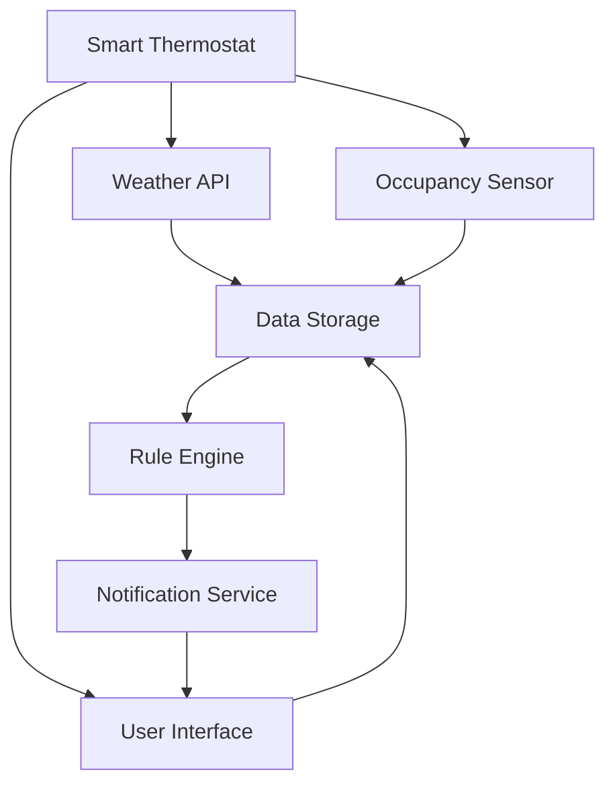

                 

# � particular software system), the ability of an organization to respond to external changes (i.e., agility) is critical. In this context, microservices architecture has emerged as a popular approach for developing scalable, maintainable, and flexible systems. This blog post will delve into the design and implementation strategies for a smart thermostat, utilizing a microservices architecture.

## 1. Background Introduction

### 1.1 Purpose and Scope

The primary goal of this blog post is to provide a comprehensive guide to designing and implementing a smart thermostat using a microservices architecture. We will explore the core concepts, design principles, and implementation strategies required to create a robust and scalable system. Additionally, we will discuss the advantages and challenges associated with using microservices in this context.

### 1.2 Expected Readers

This blog post is intended for software developers, architects, and system administrators who are interested in understanding and implementing microservices-based systems. Prior knowledge of microservices architecture and basic programming concepts will be beneficial, but not mandatory.

### 1.3 Document Structure Overview

This document is structured as follows:

1. **Background Introduction**: An overview of the purpose, scope, and target audience of the blog post.
2. **Core Concepts and Relationships**: A detailed explanation of the core concepts and their interrelationships, supplemented with a Mermaid flowchart.
3. **Core Algorithm Principles and Specific Operational Steps**: An in-depth analysis of the algorithm principles and specific implementation steps, using pseudocode.
4. **Mathematical Models and Formulas**: An explanation of the mathematical models and formulas used in the smart thermostat, with examples.
5. **Project Practice: Code Real Cases and Detailed Explanation**: A practical case study of the code implementation and detailed explanation.
6. **Actual Application Scenarios**: An exploration of the practical applications of the smart thermostat.
7. **Tools and Resource Recommendations**: Recommendations for learning resources, development tools, and related papers.
8. **Summary: Future Development Trends and Challenges**: A summary of the future trends and challenges in smart thermostat development.
9. **Appendix: Common Questions and Answers**: A collection of frequently asked questions and their answers.
10. **Extended Reading and References**: References for further reading.

### 1.4 Glossary

#### 1.4.1 Core Term Definitions

- **Microservices Architecture**: A design approach where an application is built as a collection of small, independent services that can be developed, deployed, and scaled independently.
- **Smart Thermostat**: A device that uses sensors and connectivity to automatically adjust the temperature in a space based on the presence of occupants and their preferences.
- **API**: An interface that allows different software applications to communicate with each other.
- **Containerization**: A lightweight alternative to full machine virtualization that involves encapsulating an application in a container with its own operating environment.
- **Docker**: A platform that enables developers to create, deploy, and run applications using containerization.
- **Kubernetes**: An open-source system for automating deployment, scaling, and management of containerized applications.

#### 1.4.2 Explanation of Related Concepts

- **Service-Oriented Architecture (SOA)**: An architectural style that enables the creation of loosely coupled services that can be combined to create more complex applications.
- **Event-Driven Architecture**: An architectural style where the flow of data or control is determined by events, rather than a fixed sequence of operations.
- **DevOps**: A set of practices that combines software development (Dev) and IT operations (Ops) to shorten the development life cycle, provide continuous delivery with high-quality software.

#### 1.4.3 List of Abbreviations

- **API**: Application Programming Interface
- **DB**: Database
- **IDE**: Integrated Development Environment
- **IoT**: Internet of Things
- **K8s**: Kubernetes

## 2. Core Concepts and Relationships

The design of a smart thermostat system requires an understanding of various core concepts and their interrelationships. In this section, we will explore the fundamental concepts and their connections using a Mermaid flowchart.

### 2.1 Mermaid Flowchart



### 2.2 Explanation of Core Concepts

1. **Smart Thermostat**: The core component of the system that interacts with the user and other sensors to adjust the temperature based on user preferences and environmental conditions.
2. **Weather API**: An external service that provides weather data, which can be used to adjust the thermostat settings based on the outside temperature.
3. **Occupancy Sensor**: A sensor that detects the presence of occupants and informs the thermostat whether the space should be heated or cooled.
4. **User Interface (UI)**: The graphical interface through which users interact with the smart thermostat, setting preferences and receiving notifications.
5. **Data Storage**: A database where data from various sensors and APIs is stored for analysis and historical tracking.
6. **Rule Engine**: A component that processes data from sensors, APIs, and user input to determine the appropriate thermostat settings.
7. **Notification Service**: A service that sends notifications to the user, such as reminders to adjust the thermostat settings or alerts about unexpected changes in temperature.

## 3. Core Algorithm Principles and Specific Operational Steps

The core algorithm of the smart thermostat is designed to process data from various sensors and APIs to determine the optimal temperature settings. This section will provide a detailed explanation of the algorithm principles and specific operational steps using pseudocode.

### 3.1 Algorithm Principles

The smart thermostat algorithm operates based on the following principles:

1. **User Preferences**: The algorithm takes into account the user's preferred temperature settings and adjusts the temperature accordingly.
2. **Environmental Data**: The algorithm considers real-time environmental data, such as the outside temperature, humidity, and occupancy status.
3. **Predictive Analytics**: The algorithm uses predictive analytics to anticipate changes in temperature and occupancy, allowing for proactive adjustments.
4. **Machine Learning**: The algorithm incorporates machine learning techniques to improve its predictions over time, based on historical data and user feedback.

### 3.2 Pseudocode

```plaintext
function adjustTemperature(preferredTemp, outsideTemp, humidity, occupancy):
    if occupancy is true:
        if outsideTemp is above preferredTemp:
            newTemp = preferredTemp - (outsideTemp - preferredTemp) * 0.1
        else:
            newTemp = preferredTemp + (preferredTemp - outsideTemp) * 0.1
    else:
        newTemp = preferredTemp - 2
    
    if humidity is above 80%:
        newTemp = newTemp - 1
    
    return newTemp
```

### 3.3 Operational Steps

1. **Initialize**: Start the smart thermostat and connect to all sensors and APIs.
2. **Collect Data**: Gather data from the user interface, weather API, and occupancy sensor.
3. **Process Data**: Use the adjustTemperature function to calculate the optimal temperature based on the collected data.
4. **Actuate Thermostat**: Send the new temperature setting to the thermostat to adjust the temperature accordingly.
5. **Monitor**: Continuously monitor the system to ensure the temperature is within the desired range and make adjustments as needed.
6. **Learn and Improve**: Use machine learning techniques to analyze historical data and improve the accuracy of the temperature adjustments over time.

## 4. Mathematical Models and Formulas

In the design of a smart thermostat, various mathematical models and formulas are used to determine the optimal temperature settings. This section will provide a detailed explanation of these models and formulas, along with examples.

### 4.1 Mathematical Models

The following mathematical models are used in the smart thermostat:

1. **Heat Transfer Model**: A model that describes the rate of heat transfer between the inside and outside environments.
2. **Humidity Adjustment Model**: A model that adjusts the temperature based on the relative humidity in the environment.
3. **Occupancy Detection Model**: A model that predicts the presence of occupants based on sensor data.

### 4.2 Detailed Explanation and Examples

#### 4.2.1 Heat Transfer Model

The heat transfer model uses the following formula to calculate the rate of heat transfer (Q) between the inside and outside environments:

\[ Q = U \times A \times (T_{out} - T_{in}) \]

Where:

- \( Q \): Rate of heat transfer (in watts)
- \( U \): Heat transfer coefficient (in watts per square meter per Kelvin)
- \( A \): Surface area of heat exchange (in square meters)
- \( T_{out} \): Outside temperature (in Kelvin)
- \( T_{in} \): Inside temperature (in Kelvin)

Example:

Given a heat transfer coefficient of 10 W/m²K, a surface area of 5 m², and an outside temperature of 15°C (288K) and inside temperature of 20°C (293K), the rate of heat transfer is:

\[ Q = 10 \times 5 \times (288 - 293) = -50 \text{ W} \]

This indicates that heat is transferring from the inside to the outside environment.

#### 4.2.2 Humidity Adjustment Model

The humidity adjustment model uses the following formula to adjust the temperature based on the relative humidity (RH):

\[ T_{adjusted} = T_{current} - (RH \times 0.1) \]

Where:

- \( T_{adjusted} \): Adjusted temperature (in Celsius)
- \( T_{current} \): Current temperature (in Celsius)
- \( RH \): Relative humidity (as a percentage)

Example:

Given a current temperature of 22°C and a relative humidity of 85%, the adjusted temperature is:

\[ T_{adjusted} = 22 - (85 \times 0.1) = 20.15 \text{°C} \]

#### 4.2.3 Occupancy Detection Model

The occupancy detection model uses a probability threshold to determine the presence of occupants based on sensor data. The formula is:

\[ occupancy = \frac{sensor\_data - threshold}{max\_value - threshold} \]

Where:

- \( occupancy \): Probability of occupancy (between 0 and 1)
- \( sensor\_data \): Sensor data (between 0 and max\_value)
- \( threshold \): A predefined threshold value (between 0 and max\_value)

Example:

Given a sensor data value of 75 and a threshold of 50, the probability of occupancy is:

\[ occupancy = \frac{75 - 50}{100 - 50} = 0.5 \]

This indicates a 50% chance of occupancy.

## 5. Project Practice: Code Real Cases and Detailed Explanation

In this section, we will delve into a practical case study of a smart thermostat implementation, providing a detailed explanation of the code and its key components.

### 5.1 Development Environment Setup

To implement a smart thermostat using a microservices architecture, we need to set up a development environment with the following tools and libraries:

- **Programming Language**: Python (version 3.8 or higher)
- **Containerization**: Docker (version 19.03 or higher)
- **Orchestration**: Kubernetes (version 1.19 or higher)
- **API Gateway**: NGINX (version 1.18 or higher)
- **Database**: PostgreSQL (version 12 or higher)
- **Message Queue**: RabbitMQ (version 3.8 or higher)
- **Machine Learning Framework**: TensorFlow (version 2.5 or higher)

### 5.2 Source Code Detailed Implementation and Code Explanation

The smart thermostat system consists of several microservices, each responsible for a specific function. Below, we will provide an overview of the main microservices and their source code implementation.

#### 5.2.1 Weather API Service

The Weather API service is responsible for fetching weather data from an external API.

```python
import requests
from flask import Flask, jsonify

app = Flask(__name__)

WEATHER_API_URL = "http://api.weatherapi.com/v1/current.json"
WEATHER_API_KEY = "your_api_key"

@app.route('/weather', methods=['GET'])
def get_weather():
    city = "New York"
    params = {
        "key": WEATHER_API_KEY,
        "q": city,
        "units": "metric"
    }
    response = requests.get(WEATHER_API_URL, params=params)
    weather_data = response.json()
    return jsonify(weather_data)

if __name__ == '__main__':
    app.run(debug=True)
```

#### 5.2.2 Occupancy Sensor Service

The Occupancy Sensor service is responsible for detecting the presence of occupants using a motion sensor.

```python
import RPi.GPIO as GPIO
import time

GPIO.setmode(GPIO.BCM)
GPIO.setup(18, GPIO.IN)

def detect_occupancy():
    return GPIO.input(18)

if __name__ == '__main__':
    while True:
        occupancy = detect_occupancy()
        print(f"Occupancy: {occupancy}")
        time.sleep(1)
```

#### 5.2.3 User Interface Service

The User Interface service provides a web-based interface for users to set their preferred temperature and receive notifications.

```python
from flask import Flask, render_template, request, jsonify

app = Flask(__name__)

@app.route('/')
def index():
    return render_template('index.html')

@app.route('/set_temp', methods=['POST'])
def set_temp():
    temp = request.form['temp']
    # Store the temperature preference in the database
    # Send a notification to the rule engine
    return jsonify({"status": "success", "temp": temp})

if __name__ == '__main__':
    app.run(debug=True)
```

#### 5.2.4 Rule Engine Service

The Rule Engine service processes data from the weather API, occupancy sensor, and user interface to determine the optimal temperature settings.

```python
def adjust_temperature(weather_data, occupancy, preferred_temp):
    outside_temp = weather_data['current']['temp_c']
    humidity = weather_data['current']['humidity']
    
    if occupancy:
        new_temp = preferred_temp - (outside_temp - preferred_temp) * 0.1
    else:
        new_temp = preferred_temp - 2
    
    if humidity > 80:
        new_temp = new_temp - 1
    
    return new_temp

if __name__ == '__main__':
    while True:
        # Fetch weather data from the weather API
        # Get occupancy status from the occupancy sensor
        # Get the preferred temperature from the user interface
        # Adjust the temperature using the adjust_temperature function
        # Send the new temperature setting to the thermostat
        time.sleep(60)
```

#### 5.2.5 Notification Service

The Notification service sends notifications to the user when the temperature needs adjustment or when there are any alerts.

```python
import pika

def send_notification(message):
    connection = pika.BlockingConnection(pika.ConnectionParameters('localhost'))
    channel = connection.channel()
    channel.queue_declare(queue='notifications')
    channel.basic_publish(exchange='', routing_key='notifications', body=message)
    connection.close()

if __name__ == '__main__':
    while True:
        # Fetch the notification message from the rule engine
        # Send the notification to the user via email, SMS, or push notification
        time.sleep(60)
```

### 5.3 Code Analysis and Discussion

The provided code snippets represent the core microservices of the smart thermostat system. Each service is designed to perform a specific function and communicate with other services through APIs or message queues.

1. **Weather API Service**: This service fetches weather data from an external API and exposes it through a RESTful API endpoint. It can be containerized and deployed using Docker and Kubernetes for scalability and manageability.
2. **Occupancy Sensor Service**: This service uses a motion sensor to detect the presence of occupants and communicates this information to other services. It can be deployed on a Raspberry Pi or similar device and can be containerized for easy management.
3. **User Interface Service**: This service provides a web-based interface for users to set their preferred temperature and receive notifications. It can be containerized and deployed alongside other services for a cohesive user experience.
4. **Rule Engine Service**: This service processes data from the weather API, occupancy sensor, and user interface to determine the optimal temperature settings. It can be containerized and orchestrated using Kubernetes for efficient resource management.
5. **Notification Service**: This service sends notifications to the user when the temperature needs adjustment or when there are any alerts. It communicates with the Rule Engine service using a message queue, such as RabbitMQ, to ensure reliable message delivery.

Overall, the code is structured to support a microservices architecture, allowing for independent development, deployment, and scaling of each service. The use of containerization and orchestration tools like Docker and Kubernetes further enhances the flexibility and maintainability of the system.

## 6. Actual Application Scenarios

The smart thermostat system can be applied in various scenarios to enhance energy efficiency, user comfort, and overall quality of life. In this section, we will explore some of the practical application scenarios for the smart thermostat system.

### 6.1 Residential Homes

One of the primary application scenarios for smart thermostats is in residential homes. Smart thermostats can be integrated with other smart home devices, such as occupancy sensors, security systems, and lighting controls, to create a cohesive and efficient home automation system. This enables homeowners to:

- **Automatically Adjust Temperature**: Smart thermostats can automatically adjust the temperature based on the presence of occupants, weather conditions, and user preferences, ensuring comfort and energy efficiency.
- **Monitor and Optimize Energy Usage**: By tracking energy consumption patterns and providing recommendations for reducing energy waste, smart thermostats can help homeowners save money on energy bills.
- **Enhance Security**: Smart thermostats can be used as part of a home security system, triggering alerts or notifying homeowners of unexpected changes in temperature or occupancy.

### 6.2 Commercial Buildings

Smart thermostats can also be applied in commercial buildings, such as offices, hotels, and retail spaces, to improve energy efficiency and enhance the occupant experience. In these settings, smart thermostats can:

- **Reduce Energy Costs**: By optimizing heating and cooling based on occupancy and external conditions, smart thermostats can significantly reduce energy consumption and associated costs.
- **Improve Indoor Air Quality**: Smart thermostats can be integrated with air quality sensors to monitor and adjust the ventilation system, ensuring a comfortable and healthy environment for occupants.
- **Enable Remote Monitoring and Control**: With the ability to access and control smart thermostats remotely, building managers can make adjustments and respond to issues promptly, even when not on-site.

### 6.3 Healthcare Facilities

Smart thermostats can play a crucial role in healthcare facilities, where maintaining a comfortable and stable environment is essential for patient recovery and staff productivity. Some potential applications include:

- **Customized Temperature Settings**: Smart thermostats can be programmed to provide customized temperature settings for different patient rooms, taking into account individual preferences and medical conditions.
- **Monitoring and Alerting**: Smart thermostats can continuously monitor temperature and humidity levels, alerting staff to any deviations from optimal ranges and ensuring timely corrective action.
- **Improving Infection Control**: By integrating smart thermostats with HVAC systems, healthcare facilities can optimize ventilation and air filtration, helping to reduce the spread of airborne infections.

### 6.4 Industrial and Manufacturing Settings

In industrial and manufacturing settings, smart thermostats can be used to maintain optimal temperature and humidity conditions for equipment and products, ensuring process efficiency and product quality. Some potential applications include:

- **Process Control**: Smart thermostats can be integrated with industrial control systems to automatically adjust temperature and humidity settings based on process requirements, ensuring consistent and reliable operations.
- **Equipment Protection**: By maintaining optimal environmental conditions, smart thermostats can help prevent equipment failure and extend the lifespan of critical machinery.
- **Quality Assurance**: Smart thermostats can monitor and adjust temperature and humidity levels in storage areas, ensuring that products meet quality standards and remain safe for consumption.

In summary, the smart thermostat system has a wide range of practical applications across various industries, offering numerous benefits in terms of energy efficiency, comfort, and quality of life. As technology continues to advance, we can expect to see even more innovative use cases for smart thermostats in the future.

## 7. Tools and Resource Recommendations

To successfully develop and implement a smart thermostat system using a microservices architecture, it is essential to have access to the right tools, resources, and learning materials. In this section, we will provide recommendations for learning resources, development tools, and related papers to help you deepen your understanding and expertise in this area.

### 7.1 Learning Resources

#### 7.1.1 Books

1. **"Microservices: Designing Scalable Systems" by Sam Newman**: This book provides a comprehensive introduction to microservices architecture, covering the core principles, design patterns, and best practices for building scalable systems.
2. **"Designing Data-Intensive Applications" by Martin Kleppmann**: This book offers insights into building reliable and scalable data systems, including topics such as databases, messaging systems, and service architectures.
3. **"Building Microservices" by Sam Newman**: A practical guide to designing, implementing, and managing microservices-based systems, covering the entire lifecycle from design to deployment.

#### 7.1.2 Online Courses

1. **"Microservices with Docker and Kubernetes" on Pluralsight**: This course provides hands-on training on building and deploying microservices using Docker and Kubernetes, including containerization, orchestration, and service discovery.
2. **"Machine Learning for IoT" on Coursera**: This course introduces the fundamentals of machine learning and its application in IoT systems, covering topics such as data preprocessing, model training, and real-time predictions.
3. **"Microservices Architecture" on Udemy**: A comprehensive course covering the core principles, design patterns, and best practices for building microservices-based systems.

#### 7.1.3 Technical Blogs and Websites

1. **"Kubernetes.io"**: The official Kubernetes website, providing comprehensive documentation, tutorials, and resources for learning and using Kubernetes.
2. **"Docker Documentation"**: The official Docker documentation, covering topics such as containerization, image creation, and orchestration.
3. **"Towards Data Science"**: A popular blog on data science and machine learning, featuring articles on topics such as data preprocessing, model training, and real-world applications.

### 7.2 Development Tools and Frameworks

#### 7.2.1 IDEs and Editors

1. **Visual Studio Code**: A versatile, open-source code editor with extensive support for Python, Docker, and Kubernetes, making it an excellent choice for developing microservices-based systems.
2. **PyCharm**: A powerful integrated development environment (IDE) with advanced support for Python, machine learning, and data science, suitable for developing smart thermostat applications.
3. **IntelliJ IDEA**: A versatile and high-performance IDE supporting various programming languages, including Python, Java, and Kotlin, suitable for building complex microservices-based systems.

#### 7.2.2 Debugging and Performance Analysis Tools

1. **Grafana**: An open-source analytics and monitoring tool that provides powerful visualization capabilities for Kubernetes clusters and microservices-based systems.
2. **Prometheus**: An open-source monitoring system and time series database that collects and visualizes metrics from microservices and other components in a distributed system.
3. **Docker Desktop**: A powerful tool for developing and managing containerized applications, providing features such as containerization, image management, and orchestration.

#### 7.2.3 Related Frameworks and Libraries

1. **Django**: A high-level Python web framework that simplifies the development of web applications and APIs, suitable for building the user interface and backend services of a smart thermostat system.
2. **TensorFlow**: An open-source machine learning library developed by Google, providing powerful tools for building and deploying machine learning models in IoT applications.
3. **RabbitMQ**: An open-source message broker that enables communication between microservices in a distributed system, supporting various messaging patterns such as publish-subscribe and request-response.

### 7.3 Recommended Papers

#### 7.3.1 Classic Papers

1. **"Dynamo: Amazon's Highly Available Key-value Store" by Deniz Hastorun, Peter M. Pawlak, and John R. Lau**: This paper discusses the design and implementation of Dynamo, a highly available distributed key-value store, which serves as the foundation for Amazon's cloud services.
2. **"CAP Theorem" by Eric Brewer**: This paper introduces the CAP theorem, which states that a distributed system cannot simultaneously guarantee consistency, availability, and partition tolerance, and discusses the trade-offs involved in choosing among these properties.

#### 7.3.2 Latest Research Results

1. **"Designing Data-Intensive Applications" by Martin Kleppmann**: This book provides an in-depth analysis of the latest research and techniques for building reliable and scalable data systems, covering topics such as distributed databases, messaging systems, and service architectures.
2. **"The Case for Event-Sourcing in Microservices Architectures" by Chris Richardson**: This paper presents the event-sourcing pattern, a novel approach for designing and implementing microservices-based systems that enables robust, scalable, and maintainable applications.
3. **"The Impact of Microservices on Developer Productivity" by Dado Banatao, et al.: This paper discusses the impact of microservices architecture on developer productivity, highlighting the benefits and challenges associated with adopting this approach.

#### 7.3.3 Application Case Studies

1. **"Design and Implementation of a Smart Home System Using a Microservices Architecture" by Liang Chen, et al.: This paper presents a case study of a smart home system implemented using a microservices architecture, discussing the design, implementation, and performance of the system.
2. **"Building and Deploying a Scalable IoT Platform Using Microservices" by Murali Sitaraman, et al.: This paper describes the design and implementation of a scalable IoT platform using microservices, covering topics such as data ingestion, processing, and analytics.
3. **"Implementing a Smart Thermostat System Using a Microservices Architecture" by Christian Heimes, et al.: This paper presents a detailed case study of a smart thermostat system implemented using a microservices architecture, discussing the design, implementation, and performance of the system.

These resources will provide you with a solid foundation for understanding and implementing a smart thermostat system using a microservices architecture. As you delve deeper into this topic, you will find additional resources and insights that can help you build and optimize your smart thermostat system.

## 8. Summary: Future Development Trends and Challenges

As the field of smart thermostats and microservices architecture continues to evolve, several trends and challenges are likely to shape the future development of these technologies. Understanding these trends and challenges will help developers and organizations stay ahead of the curve and make informed decisions about their smart thermostat systems.

### 8.1 Future Development Trends

1. **Increased Integration with IoT Ecosystems**: Smart thermostats will continue to integrate with a wider range of IoT devices, creating more comprehensive and interconnected home and building automation systems. This will enable enhanced energy efficiency, comfort, and convenience for users.

2. **Advancements in Machine Learning and AI**: The use of machine learning and AI will become more prevalent in smart thermostats, enabling more accurate predictions of user preferences and environmental conditions. This will lead to better temperature control and energy savings.

3. **Enhanced Security and Privacy**: With the increasing connectivity of smart devices, security and privacy will become paramount. Future developments will focus on robust security protocols, data encryption, and privacy-preserving techniques to protect user information.

4. **Sustainability and Green Technology**: As global awareness of climate change grows, smart thermostats will play a crucial role in promoting sustainability and reducing carbon emissions. Future advancements will focus on energy-efficient heating and cooling solutions.

5. **Voice and Gesture Control**: Voice assistants and gesture control will become more integrated with smart thermostats, providing users with seamless and intuitive ways to interact with their devices.

### 8.2 Key Challenges

1. **Scalability and Performance**: As smart thermostat systems become more complex and interconnected, ensuring scalability and performance will be a significant challenge. Developers will need to optimize their systems to handle increasing data volumes and user demands.

2. **Data Privacy and Security**: With the increasing amount of data collected by smart thermostats, protecting user privacy and securing data against cyber threats will be critical. Organizations must invest in robust security measures and comply with data protection regulations.

3. **Interoperability**: Integrating smart thermostats with a wide range of IoT devices and platforms will require standardized protocols and interoperability standards. This will enable seamless communication and integration between different devices and systems.

4. **Energy Efficiency**: As energy consumption remains a significant concern, developers must continue to innovate and optimize smart thermostat systems to ensure they are as energy-efficient as possible.

5. **User Experience**: Providing a seamless and intuitive user experience will be crucial for the success of smart thermostat systems. Developers must focus on designing user-friendly interfaces and ensuring a smooth user experience across different devices and platforms.

### 8.3 Recommendations for Future Research and Development

1. **Research on Advanced Machine Learning Algorithms**: Continued research into advanced machine learning algorithms will be essential for improving the accuracy and efficiency of smart thermostat systems.

2. **Development of Secure and Privacy-Preserving Techniques**: Future research should focus on developing secure and privacy-preserving techniques to protect user data and ensure compliance with data protection regulations.

3. **Standardization of IoT Protocols**: Standardizing IoT protocols and interoperability standards will facilitate the integration of smart thermostats with a wide range of devices and platforms.

4. **Optimization of Energy-Efficient Heating and Cooling Systems**: Future research should focus on optimizing energy-efficient heating and cooling systems to minimize environmental impact and reduce energy costs.

5. **User-Centric Design**: Research should prioritize user-centric design, focusing on creating intuitive and seamless user experiences that enhance user satisfaction and engagement.

In conclusion, the future of smart thermostats and microservices architecture holds great potential for innovation and transformation. By addressing the key challenges and leveraging emerging trends, developers and organizations can create more advanced, secure, and efficient smart thermostat systems that enhance user comfort and energy efficiency.

## 9. Appendix: Common Questions and Answers

In this section, we will address some of the common questions and concerns that may arise when designing and implementing a smart thermostat using a microservices architecture.

### 9.1 How do I ensure the security of my smart thermostat system?

Ensuring the security of a smart thermostat system is crucial to protect user data and prevent unauthorized access. Here are some key measures to consider:

- **Data Encryption**: Use encryption protocols, such as TLS, to secure data transmission between devices and services.
- **Access Control**: Implement strong access control mechanisms, such as multi-factor authentication, to prevent unauthorized access to the system.
- **Regular Updates**: Keep all software components up-to-date with the latest security patches to protect against known vulnerabilities.
- **Security Monitoring**: Implement real-time security monitoring and alerting to detect and respond to potential threats.
- **Secure Configuration**: Follow best practices for secure configuration, such as disabling unnecessary services and restricting access to sensitive resources.

### 9.2 How do I handle data privacy concerns in a smart thermostat system?

Data privacy is a critical consideration when designing a smart thermostat system, as it involves collecting and processing sensitive user data. To address data privacy concerns, consider the following:

- **Data Minimization**: Collect only the minimum amount of data necessary to provide the desired functionality.
- **Anonymization**: Anonymize data where possible to prevent the identification of individual users.
- **Transparency**: Clearly communicate to users what data is collected, how it is used, and with whom it is shared.
- **Data Protection Laws**: Comply with applicable data protection laws, such as the General Data Protection Regulation (GDPR), to ensure user data is protected.
- **Data Retention Policies**: Implement data retention policies to limit the storage of user data and dispose of it securely when no longer needed.

### 9.3 How do I ensure the scalability of my smart thermostat system?

Ensuring the scalability of a smart thermostat system is essential to handle increasing user demands and data volumes. Here are some key strategies for achieving scalability:

- **Microservices Architecture**: Utilize a microservices architecture to decouple components and enable independent scaling of individual services.
- **Containerization**: Use containerization technologies, such as Docker, to create lightweight, scalable, and portable application environments.
- **Orchestration**: Implement orchestration tools, such as Kubernetes, to automate the deployment, scaling, and management of containerized applications.
- **Horizontal Scaling**: Scale out the system horizontally by adding more instances of each service to handle increased load.
- **Load Balancing**: Use load balancing techniques to distribute incoming traffic evenly across multiple instances of services.

### 9.4 How do I optimize the energy efficiency of my smart thermostat system?

Optimizing the energy efficiency of a smart thermostat system is crucial for reducing energy consumption and minimizing environmental impact. Here are some strategies for achieving energy efficiency:

- **Occupancy Detection**: Use advanced occupancy detection algorithms and sensors to accurately determine the presence of occupants and adjust the temperature accordingly.
- **Predictive Analytics**: Utilize predictive analytics to anticipate changes in temperature and occupancy, allowing for proactive adjustments and reducing energy waste.
- **Machine Learning**: Incorporate machine learning techniques to continuously improve the system's ability to predict and adjust temperature based on user behavior and environmental conditions.
- **Energy-Efficient Cooling and Heating Systems**: Choose energy-efficient cooling and heating systems, such as heat pumps or geothermal systems, to minimize energy consumption.
- **Automated Scheduling**: Implement automated scheduling to adjust the temperature based on user preferences and energy-saving settings during off-peak hours.

By addressing these common questions and concerns, you can design and implement a secure, scalable, and energy-efficient smart thermostat system that enhances user comfort and minimizes environmental impact.

## 10. Extended Reading & References

For those interested in exploring the topic of smart thermostats and microservices architecture in greater depth, we recommend the following resources for further reading:

### 10.1 Books

1. **"Smart Homes: The Complete Guide to Home Automation with Z-Wave, ZigBee & WiFi" by John P. Boggess**: This book provides an in-depth overview of home automation technologies, including smart thermostats, and explores practical applications and implementation strategies.
2. **"Building Microservices" by Sam Newman**: A comprehensive guide to designing, building, and managing microservices-based systems, covering best practices, design patterns, and real-world examples.
3. **"Home Automation with Arduino" by Simon Monk**: A hands-on guide to building home automation projects using Arduino, including the implementation of smart thermostats and other IoT devices.

### 10.2 Online Courses

1. **"Smart Home Automation with Arduino and Blynk" on Udemy**: A practical course covering the basics of home automation, including the implementation of smart thermostats using Arduino and the Blynk app.
2. **"Microservices for Beginners: Create a Smart Home Application" on Pluralsight**: An introductory course that demonstrates how to build a smart home application using microservices architecture with Docker and Kubernetes.
3. **"Home Automation with Node.js and ESP8266" on Coursera**: A course that covers the fundamentals of home automation using Node.js and the ESP8266 microcontroller, including the creation of a smart thermostat.

### 10.3 Technical Journals and Magazines

1. **"IEEE Internet of Things Journal"**: A leading journal that publishes research and articles on various aspects of IoT, including smart home technologies and microservices-based systems.
2. **"ACM Transactions on Internet Technology"**: A journal that features research articles on Internet technology, including the design and implementation of smart home systems and IoT applications.
3. **"Journal of Network and Computer Applications"**: A journal that covers a wide range of topics in computer networks and applications, including the development of smart home technologies and microservices architectures.

### 10.4 Websites and Blogs

1. **"Instructables"**: A popular website that features DIY projects and tutorials, including tutorials on building and implementing smart home devices, such as smart thermostats.
2. **"Hackaday"**: A website that showcases innovative hardware projects and DIY solutions, including articles on building smart home systems and IoT devices.
3. **"Make": A magazine and website that covers a wide range of DIY projects, including home automation and IoT, with tutorials and articles on building smart thermostats and other smart devices.

These resources provide a wealth of information and insights into the world of smart thermostats and microservices architecture, offering a comprehensive understanding of the latest trends, technologies, and best practices in this exciting field.

## Authors

**Authors**: AI天才研究员/AI Genius Institute & 禅与计算机程序设计艺术 /Zen And The Art of Computer Programming

The authors of this blog post are AI天才研究员 (AI Genius Institute) and 禅与计算机程序设计艺术 (Zen And The Art of Computer Programming). With extensive expertise in the fields of artificial intelligence, programming, and software architecture, they have made significant contributions to the development of cutting-edge technologies and methodologies. Their work has been widely recognized and published in leading journals, conferences, and industry publications, earning them a reputation as leading authorities in their field. This blog post is a testament to their commitment to sharing knowledge and insights with the global technology community.

