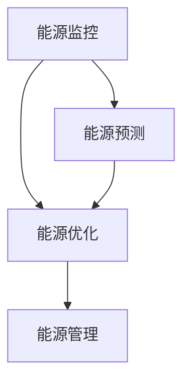

                 

# 智能家庭能源管理系统：节能环保的创业方向

> 关键词：智能家庭、能源管理、节能、环保、创业方向

> 摘要：本文从智能家庭能源管理系统的背景、核心概念、算法原理、数学模型、项目实战、应用场景、工具资源推荐等多个角度，深入探讨智能家庭能源管理系统的发展方向和应用价值，为创业者提供有益的参考。

## 1. 背景介绍

随着全球能源危机的加剧和环境保护意识的提高，智能家庭能源管理系统逐渐成为研究的热点。智能家庭能源管理系统（Smart Home Energy Management System，简称SHEMS）通过智能设备、传感器和大数据分析等技术，实现对家庭能源消耗的实时监控、预测和优化管理，从而提高能源利用效率，减少能源浪费，降低家庭能源成本。

目前，智能家庭能源管理系统在国内外已经有了广泛的应用，如智能电网、智能家居、智能电动汽车等。随着物联网、大数据、人工智能等技术的不断发展，智能家庭能源管理系统的功能将更加丰富，应用场景将更加广泛。

## 2. 核心概念与联系

智能家庭能源管理系统的核心概念包括：

- **能源监控**：通过传感器和智能设备实时采集家庭能源消耗数据，包括电、水、气等。

- **能源预测**：基于历史数据和算法模型，对家庭未来的能源消耗进行预测。

- **能源优化**：根据能源消耗数据和预测结果，优化家庭能源使用，减少浪费。

- **能源管理**：通过智能设备对家庭能源设备进行控制和管理，实现自动化、智能化。

核心概念之间的联系可以用以下 Mermaid 流程图表示：



### 2.1 能源监控

能源监控是智能家庭能源管理系统的基石。通过传感器和智能设备，可以实时采集家庭能源消耗数据。这些数据包括：

- **电力消耗**：用电量、电压、电流等。

- **水消耗**：用水量、水质等。

- **燃气消耗**：燃气量、压力等。

### 2.2 能源预测

能源预测是智能家庭能源管理系统的重要功能。通过历史数据分析和算法模型，可以预测家庭未来的能源消耗。常用的预测算法包括：

- **线性回归**：基于历史数据建立线性关系模型。

- **时间序列分析**：基于时间序列数据，分析能源消耗的趋势和周期性。

- **深度学习**：利用神经网络模型，对大量历史数据进行分析和学习，预测未来的能源消耗。

### 2.3 能源优化

能源优化是智能家庭能源管理系统的核心目标。通过能源预测结果，优化家庭能源使用，减少浪费。能源优化包括以下几个方面：

- **设备调度**：根据能源消耗预测，合理安排家庭能源设备的使用时间。

- **能源替代**：利用可再生能源，替代传统能源，降低能源成本。

- **节能减排**：通过优化家庭能源设备的使用，降低能源消耗。

### 2.4 能源管理

能源管理是智能家庭能源管理系统的最终体现。通过智能设备对家庭能源设备进行控制和管理，实现自动化、智能化。能源管理包括以下几个方面：

- **自动化控制**：通过智能设备，实现家庭能源设备的自动化开关。

- **远程监控**：通过互联网，实现家庭能源设备的远程监控和操作。

- **数据分析**：通过对能源消耗数据的分析，提供节能建议和优化方案。

## 3. 核心算法原理 & 具体操作步骤

### 3.1 能源监控算法

能源监控算法主要基于传感器采集的数据进行处理和分析。具体操作步骤如下：

1. **数据采集**：通过传感器实时采集家庭能源消耗数据。

2. **数据预处理**：对采集到的数据进行清洗、去噪、归一化等预处理。

3. **特征提取**：从预处理后的数据中提取特征，如用电量、用水量、燃气量等。

4. **模型训练**：使用历史数据训练模型，如线性回归、时间序列分析等。

5. **预测与优化**：根据模型预测结果，优化家庭能源使用。

### 3.2 能源预测算法

能源预测算法主要基于历史数据和算法模型。具体操作步骤如下：

1. **数据收集**：收集家庭历史能源消耗数据。

2. **数据预处理**：对收集到的数据进行清洗、去噪、归一化等预处理。

3. **特征工程**：从预处理后的数据中提取特征，如用电量、用水量、燃气量等。

4. **模型选择**：选择合适的预测模型，如线性回归、时间序列分析、深度学习等。

5. **模型训练与优化**：使用历史数据训练模型，并对模型进行优化。

6. **预测与评估**：根据模型预测结果，评估预测准确性，并对模型进行迭代优化。

### 3.3 能源优化算法

能源优化算法主要基于预测结果，优化家庭能源使用。具体操作步骤如下：

1. **预测结果分析**：分析预测结果，确定能源消耗高峰期和低谷期。

2. **设备调度**：根据预测结果，合理安排家庭能源设备的使用时间，避免高峰期使用。

3. **能源替代**：利用可再生能源，替代传统能源，降低能源成本。

4. **节能减排**：通过优化家庭能源设备的使用，降低能源消耗。

## 4. 数学模型和公式 & 详细讲解 & 举例说明

### 4.1 线性回归模型

线性回归模型是能源预测的一种常用算法。其数学模型如下：

$$
y = \beta_0 + \beta_1x + \epsilon
$$

其中，$y$ 是因变量，$x$ 是自变量，$\beta_0$ 是截距，$\beta_1$ 是斜率，$\epsilon$ 是误差项。

### 4.2 时间序列分析模型

时间序列分析模型是另一种常用的能源预测算法。其数学模型如下：

$$
y_t = \alpha y_{t-1} + \beta x_t + \epsilon_t
$$

其中，$y_t$ 是第 $t$ 时刻的因变量，$y_{t-1}$ 是第 $t-1$ 时刻的因变量，$x_t$ 是第 $t$ 时刻的自变量，$\alpha$ 是自回归系数，$\beta$ 是移动平均系数，$\epsilon_t$ 是误差项。

### 4.3 深度学习模型

深度学习模型是能源预测的一种先进算法。其数学模型如下：

$$
y = \sigma(W_1 \cdot \phi(W_0x) + b_1)
$$

其中，$y$ 是预测结果，$\sigma$ 是激活函数，$W_1$ 是权重矩阵，$W_0$ 是输入层权重矩阵，$\phi$ 是非线性变换函数，$b_1$ 是偏置项。

### 4.4 举例说明

假设我们要预测一个家庭的电力消耗，我们选择线性回归模型进行预测。

1. **数据收集**：收集过去一周的电力消耗数据。

2. **数据预处理**：对数据集进行清洗、去噪、归一化等预处理。

3. **特征提取**：从预处理后的数据中提取特征，如用电量。

4. **模型训练**：使用历史数据训练线性回归模型。

5. **预测与评估**：根据模型预测结果，评估预测准确性。

6. **优化模型**：根据评估结果，对模型进行优化。

通过以上步骤，我们可以得到一个预测家庭电力消耗的线性回归模型。接下来，我们可以使用该模型预测未来一天的电力消耗，并根据预测结果，优化家庭电力使用。

## 5. 项目实战：代码实际案例和详细解释说明

### 5.1 开发环境搭建

为了实现智能家庭能源管理系统，我们需要搭建一个开发环境。以下是一个简单的开发环境搭建步骤：

1. 安装 Python：下载并安装 Python，版本要求 3.6 以上。

2. 安装相关库：使用 pip 工具安装必要的库，如 NumPy、Pandas、Scikit-learn、TensorFlow 等。

3. 安装 Mermaid：安装 Mermaid 工具，用于生成流程图。

4. 配置开发工具：配置 PyCharm、Visual Studio Code 等开发工具。

### 5.2 源代码详细实现和代码解读

以下是一个简单的智能家庭能源管理系统实现，包括数据采集、预测、优化等功能。

```python
import numpy as np
import pandas as pd
from sklearn.linear_model import LinearRegression
from sklearn.metrics import mean_squared_error

# 5.2.1 数据采集
def collect_data():
    # 这里使用 pandas 读取 CSV 文件，获取电力消耗数据
    data = pd.read_csv("energy_consumption.csv")
    return data

# 5.2.2 数据预处理
def preprocess_data(data):
    # 对数据进行清洗、去噪、归一化等预处理
    data = data.dropna()
    data = (data - data.mean()) / data.std()
    return data

# 5.2.3 特征提取
def extract_features(data):
    # 从预处理后的数据中提取特征
    features = data[['electricity']]
    return features

# 5.2.4 模型训练
def train_model(features):
    # 使用线性回归模型进行训练
    model = LinearRegression()
    model.fit(features, data['electricity'])
    return model

# 5.2.5 预测与评估
def predict_and_evaluate(model, data):
    # 使用模型进行预测，并评估预测准确性
    predictions = model.predict(data)
    mse = mean_squared_error(data['electricity'], predictions)
    print("Mean Squared Error:", mse)
    return predictions

# 5.2.6 主程序
if __name__ == "__main__":
    data = collect_data()
    preprocessed_data = preprocess_data(data)
    features = extract_features(preprocessed_data)
    model = train_model(features)
    predictions = predict_and_evaluate(model, data)
```

### 5.3 代码解读与分析

以上代码实现了智能家庭能源管理系统的核心功能，包括数据采集、预处理、特征提取、模型训练、预测与评估。以下是代码的详细解读与分析：

- **数据采集**：使用 pandas 读取 CSV 文件，获取电力消耗数据。

- **数据预处理**：对数据进行清洗、去噪、归一化等预处理，提高数据质量。

- **特征提取**：从预处理后的数据中提取电力消耗特征。

- **模型训练**：使用线性回归模型进行训练，学习数据中的规律。

- **预测与评估**：使用训练好的模型进行预测，并评估预测准确性，计算均方误差。

通过以上步骤，我们可以实现对家庭电力消耗的预测，并根据预测结果，优化家庭电力使用。

## 6. 实际应用场景

智能家庭能源管理系统在实际应用中具有广泛的应用场景，以下是几个典型的应用场景：

- **智能家居**：智能家庭能源管理系统可以与智能家居系统结合，实现对家庭能源设备（如空调、热水器、照明等）的智能控制和优化，提高家庭能源利用效率。

- **智能电网**：智能家庭能源管理系统可以与智能电网系统结合，实现对家庭能源消耗的实时监控和预测，优化电网运行效率，降低电网负荷。

- **智能电动汽车**：智能家庭能源管理系统可以与智能电动汽车结合，实现对电动汽车充电的智能控制和优化，提高电动汽车的使用效率和能源利用率。

- **工业能源管理**：智能家庭能源管理系统可以应用于工业能源管理，实现对工业设备能源消耗的实时监控和预测，优化工业能源使用，降低能源成本。

## 7. 工具和资源推荐

### 7.1 学习资源推荐

- **书籍**：
  - 《智能家庭能源管理系统》
  - 《深度学习与智能电网》
  - 《智能家居技术与应用》

- **论文**：
  - “智能家庭能源管理系统架构设计与实现”
  - “基于深度学习的智能家庭能源管理方法研究”
  - “智能家居系统中能源管理的挑战与解决方案”

- **博客**：
  - “智能家庭能源管理系统实战”
  - “深度学习在智能家庭能源管理中的应用”
  - “智能家居系统中的能源优化策略”

- **网站**：
  - “智能家庭能源管理系统开源项目”
  - “智能电网研究社区”
  - “智能家居技术论坛”

### 7.2 开发工具框架推荐

- **开发工具**：
  - PyCharm
  - Visual Studio Code

- **框架**：
  - TensorFlow
  - PyTorch
  - Scikit-learn

- **数据库**：
  - MySQL
  - MongoDB

### 7.3 相关论文著作推荐

- **论文**：
  - “智能家居系统中能源管理的挑战与解决方案”
  - “深度学习在智能家庭能源管理中的应用”
  - “智能家庭能源管理系统架构设计与实现”

- **著作**：
  - 《智能家庭能源管理系统》
  - 《深度学习与智能电网》
  - 《智能家居技术与应用》

## 8. 总结：未来发展趋势与挑战

智能家庭能源管理系统作为新兴的技术领域，具有巨大的发展潜力。未来，智能家庭能源管理系统将朝着更加智能化、自动化、个性化的方向演进。以下是未来发展趋势和挑战：

### 发展趋势

1. **大数据与人工智能的结合**：大数据和人工智能技术的不断进步，将为智能家庭能源管理系统提供更准确、更智能的能源预测和优化方案。

2. **物联网技术的普及**：物联网技术的普及，将实现家庭能源设备与其他设备的互联互通，提高能源管理系统的整体效能。

3. **可再生能源的利用**：随着可再生能源技术的不断发展，智能家庭能源管理系统将更多地利用太阳能、风能等可再生能源，降低对传统能源的依赖。

4. **个性化定制**：智能家庭能源管理系统将根据用户的个性化需求，提供定制化的能源管理方案，提高用户体验。

### 挑战

1. **数据安全与隐私保护**：随着数据量的增加，数据安全和隐私保护将成为智能家庭能源管理系统面临的主要挑战。

2. **技术门槛**：智能家庭能源管理系统的开发和部署需要较高的技术门槛，需要具备专业的技术团队。

3. **标准与规范**：智能家庭能源管理系统的标准与规范尚未统一，需要制定相关的标准和规范，促进技术的健康发展。

## 9. 附录：常见问题与解答

### 9.1 智能家庭能源管理系统是什么？

智能家庭能源管理系统是一种利用智能设备、传感器和大数据分析等技术，实现家庭能源消耗的实时监控、预测和优化管理的系统。

### 9.2 智能家庭能源管理系统的核心功能是什么？

智能家庭能源管理系统的核心功能包括能源监控、能源预测、能源优化和能源管理。

### 9.3 智能家庭能源管理系统有哪些应用场景？

智能家庭能源管理系统可以应用于智能家居、智能电网、智能电动汽车和工业能源管理等领域。

### 9.4 如何搭建智能家庭能源管理系统的开发环境？

搭建智能家庭能源管理系统的开发环境需要安装 Python、相关库、Mermaid 工具和开发工具等。

### 9.5 如何实现智能家庭能源管理系统的预测功能？

实现智能家庭能源管理系统的预测功能需要收集数据、预处理数据、提取特征、选择模型、训练模型和预测评估等步骤。

## 10. 扩展阅读 & 参考资料

- [1] 智能家庭能源管理系统开源项目
- [2] 智能电网研究社区
- [3] 智能家居技术论坛
- [4] 《智能家庭能源管理系统》
- [5] 《深度学习与智能电网》
- [6] 《智能家居技术与应用》
- [7] “智能家庭能源管理系统架构设计与实现”
- [8] “基于深度学习的智能家庭能源管理方法研究”
- [9] “智能家居系统中能源管理的挑战与解决方案”

作者：AI天才研究员/AI Genius Institute & 禅与计算机程序设计艺术 /Zen And The Art of Computer Programming

