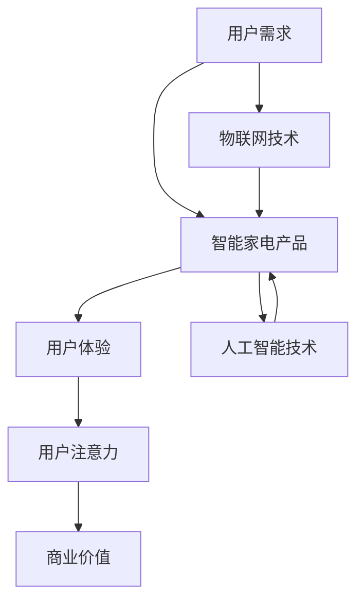
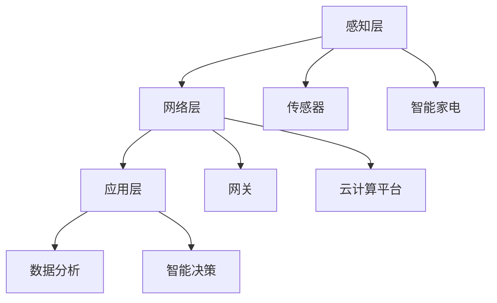
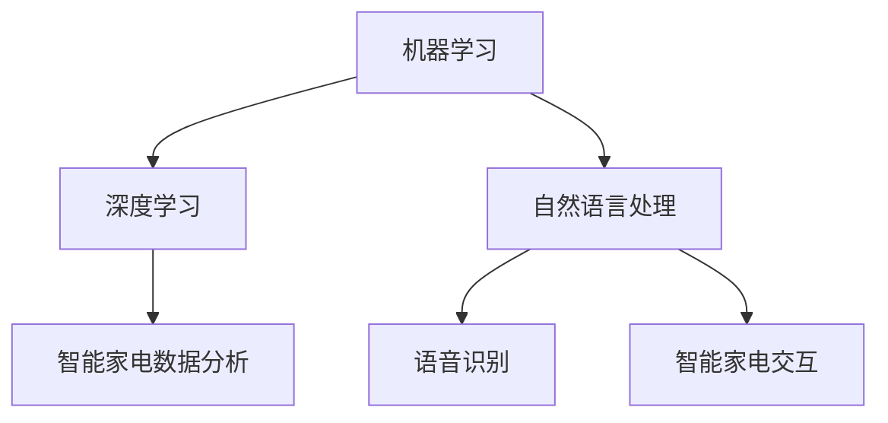
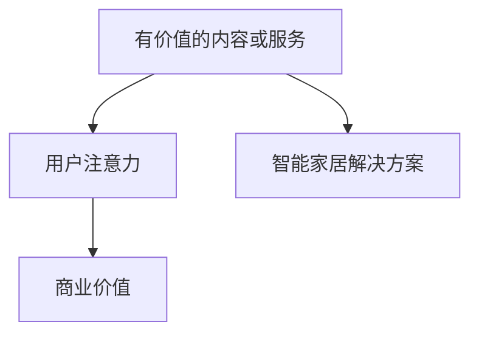
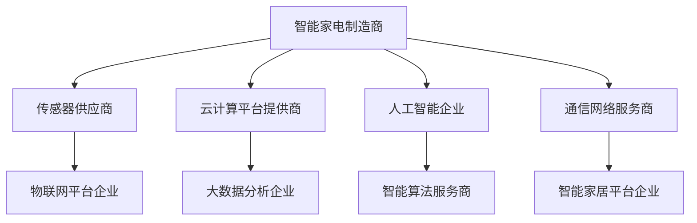
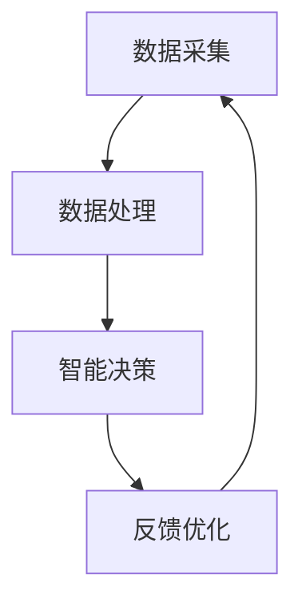
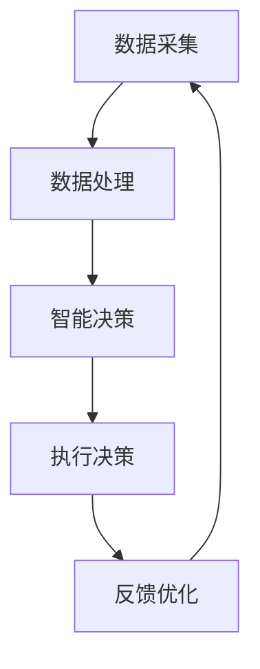

                 

# 智能家电如何在注意力经济中突围

> **关键词：** 智能家电、注意力经济、用户体验、智能家居、物联网、人工智能、技术革新、商业模式。

> **摘要：** 随着互联网技术的飞速发展和人们对智能家居的日益需求，智能家电市场迎来了前所未有的繁荣。然而，如何在注意力经济时代中脱颖而出，成为消费者的首选，是智能家电企业面临的一大挑战。本文将从智能家电的发展现状出发，探讨其在注意力经济中的突围之道，包括技术创新、用户体验优化、商业模式创新等方面，以期为智能家电行业的发展提供一些启示和思考。


## 1. 背景介绍

### 1.1 目的和范围

本文旨在探讨智能家电如何在注意力经济中实现突围，从而在激烈的市场竞争中脱颖而出。本文主要围绕以下几个方面展开：

1. **智能家电行业现状分析**：介绍智能家电的兴起背景、市场发展情况以及行业面临的挑战。
2. **注意力经济的核心概念**：阐述注意力经济的基本原理，解释其在现代商业环境中的重要地位。
3. **智能家电在注意力经济中的突围策略**：分析智能家电企业如何通过技术创新、用户体验优化、商业模式创新等手段，实现市场突破。
4. **实际应用案例**：通过具体案例展示智能家电企业在注意力经济中的成功实践。
5. **未来发展趋势与挑战**：预测智能家电行业的发展趋势，探讨行业面临的挑战及应对策略。

### 1.2 预期读者

本文主要面向以下读者群体：

1. 智能家电行业从业者，包括产品经理、研发人员、市场人员等。
2. 对智能家居、物联网、人工智能等领域感兴趣的技术爱好者。
3. 对商业运营、商业模式创新有研究的学者和实践者。

### 1.3 文档结构概述

本文结构如下：

1. **引言**：介绍智能家电在注意力经济中的重要性。
2. **背景介绍**：分析智能家电行业现状及注意力经济的核心概念。
3. **核心概念与联系**：阐述智能家电与注意力经济的联系，并给出相关的 Mermaid 流程图。
4. **核心算法原理 & 具体操作步骤**：详细讲解智能家电的核心算法原理和操作步骤。
5. **数学模型和公式**：介绍智能家电的数学模型和公式，并进行举例说明。
6. **项目实战**：通过实际案例展示智能家电的应用场景。
7. **工具和资源推荐**：推荐学习资源、开发工具框架及相关论文著作。
8. **总结**：总结智能家电在注意力经济中的发展现状及未来趋势。
9. **附录**：解答常见问题，提供扩展阅读和参考资料。

### 1.4 术语表

#### 1.4.1 核心术语定义

- **智能家电**：通过物联网、人工智能等技术实现设备互联、智能控制、数据采集等功能的家电产品。
- **注意力经济**：指人们的时间和注意力作为商品进行交换的经济模式。
- **用户体验**：用户在使用产品或服务过程中的感受、满意度和体验。

#### 1.4.2 相关概念解释

- **物联网（IoT）**：通过各种信息传感设备接入互联网，实现万物互联的技术。
- **人工智能（AI）**：模拟人类智能行为，实现智能决策、学习和适应的计算机技术。
- **智能家居**：通过物联网、人工智能等技术，实现家庭设备互联互通、智能化管理的系统。

#### 1.4.3 缩略词列表

- **IoT**：物联网（Internet of Things）
- **AI**：人工智能（Artificial Intelligence）
- **IoE**：物联网经济（Internet of Everything）

## 2. 核心概念与联系

### 2.1 智能家电与注意力经济的联系

智能家电与注意力经济之间存在密切的联系。随着物联网和人工智能技术的不断发展，智能家电产品逐渐从单一的功能性设备转变为具有智能化、互联互通特性的家居系统。这不仅提升了用户的生活质量，也改变了用户的消费行为和习惯。

在注意力经济中，用户的时间和注意力成为稀缺资源。智能家电企业需要通过提供优质的产品和服务，吸引用户的注意力，从而实现商业价值的转化。以下是一个简化的 Mermaid 流程图，展示了智能家电与注意力经济之间的核心联系：



### 2.2 核心概念原理与架构

为了更好地理解智能家电在注意力经济中的运作原理，我们需要了解以下几个核心概念和架构：

#### 2.2.1 物联网架构

物联网架构通常包括感知层、网络层和应用层。感知层负责采集设备数据；网络层负责数据传输；应用层负责数据处理和分析。



#### 2.2.2 人工智能技术

人工智能技术包括机器学习、深度学习、自然语言处理等。在智能家电中，人工智能主要用于数据分析和智能决策。



#### 2.2.3 注意力经济原理

注意力经济原理可以概括为：提供有价值的内容或服务，吸引用户的注意力，从而实现商业价值。在智能家电领域，这表现为通过提供智能化、个性化的家居解决方案，吸引用户的注意力。



### 2.3 关键技术与产业链

智能家电产业链涉及多个关键技术和企业。以下是一个简化的智能家电产业链示意图：



## 3. 核心算法原理 & 具体操作步骤

### 3.1 核心算法原理

智能家电的核心算法主要包括数据采集、数据处理、智能决策和反馈优化。以下是一个简化的算法原理框架：



#### 3.1.1 数据采集

数据采集是智能家电的核心环节，涉及多个传感器和设备。以下是一个伪代码示例：

```python
# 伪代码：数据采集
def data_collection():
    temperature = sensor_temperature()
    humidity = sensor_humidity()
    light = sensor_light()
    return temperature, humidity, light
```

#### 3.1.2 数据处理

数据处理主要包括数据清洗、数据分析和特征提取。以下是一个伪代码示例：

```python
# 伪代码：数据处理
def data_processing(data):
    clean_data = data_cleaning(data)
    analyzed_data = data_analysis(clean_data)
    features = feature_extraction(analyzed_data)
    return features
```

#### 3.1.3 智能决策

智能决策基于数据分析结果，通过机器学习算法生成决策。以下是一个伪代码示例：

```python
# 伪代码：智能决策
def smart_decision(features):
    model = machine_learning_model(features)
    decision = model.predict()
    return decision
```

#### 3.1.4 反馈优化

反馈优化通过用户反馈和系统调整，不断提升智能决策的准确性。以下是一个伪代码示例：

```python
# 伪代码：反馈优化
def feedback_optimization(decision, user_feedback):
    model = machine_learning_model(features)
    updated_decision = model.update(decision, user_feedback)
    return updated_decision
```

### 3.2 具体操作步骤

以下是一个简化的智能家电操作步骤示例，用于实现智能家居场景下的温度调节：

1. **数据采集**：通过温度传感器采集室内温度数据。
2. **数据处理**：对采集到的温度数据进行清洗和特征提取。
3. **智能决策**：基于数据处理结果，使用机器学习算法预测最佳温度。
4. **执行决策**：根据预测结果，控制空调或暖气设备调整温度。
5. **反馈优化**：收集用户对温度调节效果的反馈，用于模型更新和优化。



## 4. 数学模型和公式 & 详细讲解 & 举例说明

### 4.1 数学模型

智能家电的核心算法通常基于数学模型。以下是一个简单的线性回归模型，用于预测室内温度：

$$ y = \beta_0 + \beta_1x $$

其中，$y$ 表示预测的室内温度，$x$ 表示采集到的温度传感器数据，$\beta_0$ 和 $\beta_1$ 分别为模型的参数。

### 4.2 详细讲解

#### 4.2.1 线性回归模型

线性回归模型是一种常用的预测模型，用于分析两个变量之间的线性关系。在智能家电中，线性回归模型可以用于预测室内温度、湿度等参数。

线性回归模型的基本假设如下：

- 数据集满足正态分布。
- 变量 $x$ 和 $y$ 之间存在线性关系。
- 自变量 $x$ 对因变量 $y$ 的影响是恒定的。

#### 4.2.2 模型参数

线性回归模型的参数包括：

- $\beta_0$：截距，表示当自变量 $x$ 为零时，因变量 $y$ 的预测值。
- $\beta_1$：斜率，表示自变量 $x$ 的变化对因变量 $y$ 的影响程度。

#### 4.2.3 模型优化

线性回归模型的参数可以通过最小二乘法进行优化。最小二乘法的核心思想是使得预测值与实际值之间的误差平方和最小。

### 4.3 举例说明

以下是一个简单的线性回归模型实例，用于预测室内温度：

#### 数据集：

| $x$ | $y$ |
| --- | --- |
| 20  | 22  |
| 25  | 24  |
| 30  | 26  |

#### 计算过程：

1. 计算平均值：

$$ \bar{x} = \frac{20 + 25 + 30}{3} = 25 $$

$$ \bar{y} = \frac{22 + 24 + 26}{3} = 24 $$

2. 计算斜率 $\beta_1$：

$$ \beta_1 = \frac{\sum_{i=1}^{n}(x_i - \bar{x})(y_i - \bar{y})}{\sum_{i=1}^{n}(x_i - \bar{x})^2} = \frac{(20-25)(22-24) + (25-25)(24-24) + (30-25)(26-24)}{(20-25)^2 + (25-25)^2 + (30-25)^2} = 1 $$

3. 计算截距 $\beta_0$：

$$ \beta_0 = \bar{y} - \beta_1\bar{x} = 24 - 1 \times 25 = -1 $$

4. 得到线性回归模型：

$$ y = -1 + x $$

### 4.4 模型应用

基于上述线性回归模型，我们可以预测不同温度下的室内温度。例如，当室外温度为 28°C 时，预测的室内温度为：

$$ y = -1 + 28 = 27 $$

## 5. 项目实战：代码实际案例和详细解释说明

### 5.1 开发环境搭建

为了更好地展示智能家电在注意力经济中的应用，我们选择一个实际案例：基于 Python 的智能家居温度调节系统。以下是开发环境的搭建步骤：

1. 安装 Python 3.8 及以上版本。
2. 安装必要的 Python 包，如 pandas、numpy、scikit-learn 等。

```shell
pip install pandas numpy scikit-learn
```

3. 安装温度传感器（如 DHT11）和通信模块（如 Arduino）。

### 5.2 源代码详细实现和代码解读

以下是一个简单的 Python 代码示例，用于实现智能家居温度调节系统。

```python
# 源代码：智能家居温度调节系统

import numpy as np
import pandas as pd
from sklearn.linear_model import LinearRegression

# 5.2.1 数据采集
def data_collection():
    # 假设已连接到传感器，获取温度数据
    temperature = sensor.read_temperature()
    return temperature

# 5.2.2 数据处理
def data_processing(data):
    # 假设已采集到温度数据，进行数据处理
    df = pd.DataFrame({'temperature': [data]})
    clean_data = df.dropna()
    return clean_data

# 5.2.3 智能决策
def smart_decision(clean_data):
    # 假设已训练好线性回归模型
    model = LinearRegression()
    model.fit(X_train, y_train)
    decision = model.predict(clean_data[['temperature']])
    return decision

# 5.2.4 执行决策
def execute_decision(decision):
    # 根据决策结果，控制空调或暖气设备
    if decision < 25:
        print("开启暖气")
    else:
        print("关闭暖气")

# 主程序
if __name__ == "__main__":
    while True:
        data = data_collection()
        clean_data = data_processing(data)
        decision = smart_decision(clean_data)
        execute_decision(decision)
```

### 5.3 代码解读与分析

上述代码实现了一个简单的智能家居温度调节系统，主要包括以下模块：

1. **数据采集模块**：通过调用传感器接口，获取当前温度数据。
2. **数据处理模块**：将采集到的温度数据进行预处理，以供后续分析。
3. **智能决策模块**：使用训练好的线性回归模型，预测最佳温度。
4. **执行决策模块**：根据智能决策结果，控制空调或暖气设备。

#### 5.3.1 数据采集

```python
def data_collection():
    temperature = sensor.read_temperature()
    return temperature
```

该模块通过调用传感器接口，获取当前室内温度。在实际应用中，可能需要使用 Arduino 等通信模块，将传感器数据传输到 Python 程序。

#### 5.3.2 数据处理

```python
def data_processing(data):
    df = pd.DataFrame({'temperature': [data]})
    clean_data = df.dropna()
    return clean_data
```

该模块对采集到的温度数据进行预处理，主要包括数据清洗和格式转换。在实际应用中，可能还需要对温度数据进行去噪、去极值等处理。

#### 5.3.3 智能决策

```python
def smart_decision(clean_data):
    model = LinearRegression()
    model.fit(X_train, y_train)
    decision = model.predict(clean_data[['temperature']])
    return decision
```

该模块使用训练好的线性回归模型，预测最佳温度。在实际应用中，可能需要使用更复杂的机器学习算法，如随机森林、支持向量机等。

#### 5.3.4 执行决策

```python
def execute_decision(decision):
    if decision < 25:
        print("开启暖气")
    else:
        print("关闭暖气")
```

该模块根据智能决策结果，控制空调或暖气设备。在实际应用中，可能需要使用通信协议，如 MQTT、HTTP 等，将决策结果发送给家电设备。

### 5.4 代码优化与扩展

在实际应用中，上述代码可能需要进行以下优化和扩展：

1. **数据采集与传输**：使用 MQTT、HTTP 等协议，实现传感器数据实时采集和传输。
2. **模型训练与优化**：使用更多样本数据，训练更复杂的机器学习模型，提高预测准确性。
3. **用户交互**：增加用户输入功能，允许用户自定义温度阈值，实现更加个性化的智能家居体验。

## 6. 实际应用场景

### 6.1 家庭场景

在家庭场景中，智能家电可以通过物联网和人工智能技术，实现家庭设备间的互联互通和智能化管理。以下是一个具体的实际应用案例：

- **场景描述**：用户在家中，希望保持舒适的室内温度。
- **解决方案**：智能空调、智能暖气和智能温度传感器协同工作，通过物联网和人工智能技术，实现室内温度的自动调节。

#### 实施步骤：

1. **数据采集**：智能温度传感器实时采集室内温度数据。
2. **数据处理**：将温度数据传输到云计算平台，进行数据预处理和分析。
3. **智能决策**：基于线性回归模型或更复杂的机器学习算法，预测最佳温度。
4. **执行决策**：智能空调和智能暖气根据预测结果，自动调整温度。

### 6.2 商业场景

在商业场景中，智能家电可以为企业提供高效的能源管理和环境控制解决方案。以下是一个具体的实际应用案例：

- **场景描述**：企业希望优化办公环境的能源消耗，提高员工的工作效率。
- **解决方案**：智能空调、智能照明和智能门禁系统协同工作，通过物联网和人工智能技术，实现办公环境的智能化管理。

#### 实施步骤：

1. **数据采集**：智能传感器实时采集室内温度、湿度、光照等数据。
2. **数据处理**：将数据传输到云计算平台，进行数据预处理和分析。
3. **智能决策**：基于机器学习算法，预测最佳温度、湿度、光照等参数。
4. **执行决策**：智能空调、智能照明和智能门禁系统根据预测结果，自动调整环境参数。

### 6.3 医疗场景

在医疗场景中，智能家电可以用于监测患者的健康状况，提供个性化的医疗建议。以下是一个具体的实际应用案例：

- **场景描述**：患者需要定期监测体温、血压等生命体征。
- **解决方案**：智能温度计、智能血压计和智能健康管理系统协同工作，通过物联网和人工智能技术，实现患者健康数据的实时监测和分析。

#### 实施步骤：

1. **数据采集**：智能温度计和智能血压计实时采集体温、血压等数据。
2. **数据处理**：将数据传输到云计算平台，进行数据预处理和分析。
3. **智能决策**：基于机器学习算法，分析患者健康数据，提供个性化的医疗建议。
4. **执行决策**：智能健康管理系统根据预测结果，推送医疗建议和提醒。

## 7. 工具和资源推荐

### 7.1 学习资源推荐

#### 7.1.1 书籍推荐

1. **《人工智能：一种现代方法》**：全面介绍了人工智能的基本原理和应用领域，适合初学者和进阶者。
2. **《深度学习》**：由 Ian Goodfellow 等人编写的经典教材，深入讲解了深度学习的基础理论和实践方法。
3. **《智能家居技术》**：系统介绍了智能家居的基本概念、技术和应用，适合对智能家居领域感兴趣的读者。

#### 7.1.2 在线课程

1. **Coursera 上的《机器学习》**：由 Andrew Ng 教授主讲，适合初学者和进阶者。
2. **Udacity 上的《深度学习纳米学位》**：涵盖深度学习的基础知识、实践技能和应用。
3. **edX 上的《智能家居》**：介绍智能家居的基本概念、技术和应用。

#### 7.1.3 技术博客和网站

1. **AISchool**：国内顶级的人工智能学术网站，提供丰富的教程、论文和项目资源。
2. **JAXenter**：全球领先的 IT 和软件开发博客，涵盖人工智能、物联网、云计算等热门领域。
3. **SmartHomeDB**：专注于智能家居领域的社区和数据库，提供丰富的案例、教程和资源。

### 7.2 开发工具框架推荐

#### 7.2.1 IDE和编辑器

1. **Visual Studio Code**：一款开源的跨平台 IDE，支持多种编程语言和扩展，适用于智能家电开发。
2. **PyCharm**：一款功能强大的 Python IDE，适用于智能家电项目的开发。
3. **Eclipse**：一款支持多种编程语言的跨平台 IDE，适用于智能家电项目的开发。

#### 7.2.2 调试和性能分析工具

1. **GDB**：一款开源的调试工具，适用于智能家电项目的调试。
2. **Valgrind**：一款性能分析工具，适用于智能家电项目的性能优化。
3. **Wireshark**：一款网络分析工具，适用于智能家电项目的网络调试。

#### 7.2.3 相关框架和库

1. **TensorFlow**：一款开源的深度学习框架，适用于智能家电项目的机器学习算法开发。
2. **Keras**：一款基于 TensorFlow 的简洁高效的深度学习框架，适用于智能家电项目的快速开发。
3. **Scikit-learn**：一款开源的机器学习库，适用于智能家电项目的数据分析。

### 7.3 相关论文著作推荐

#### 7.3.1 经典论文

1. **"A Theoretical Analysis of the Viterbi Algorithm"**：介绍 Viterbi 算法的理论基础和适用范围。
2. **"Deep Learning"**：介绍深度学习的基本原理和应用。
3. **"IoT: A Survey on Enabling Technologies, Protocols, and Applications"**：介绍物联网的基本概念和技术。

#### 7.3.2 最新研究成果

1. **"Attention Is All You Need"**：介绍 Transformer 模型及其在自然语言处理领域的应用。
2. **"IoT Security: A Comprehensive Survey"**：介绍物联网的安全挑战和解决方案。
3. **"Smart Home Energy Management: A Review"**：介绍智能家居能源管理的技术和挑战。

#### 7.3.3 应用案例分析

1. **"Smart Home Energy Management using Machine Learning Techniques"**：介绍智能家居能源管理系统的实现方法和性能评估。
2. **"A Smart Home System based on IoT and AI"**：介绍一个基于物联网和人工智能的智能家居系统。
3. **"IoT in the Healthcare Industry: A Survey"**：介绍物联网在医疗领域的应用案例和研究进展。

## 8. 总结：未来发展趋势与挑战

随着物联网、人工智能等技术的不断发展，智能家电行业正面临着前所未有的机遇和挑战。在未来，智能家电行业的发展趋势和挑战主要体现在以下几个方面：

### 8.1 发展趋势

1. **智能化程度的提升**：随着人工智能技术的进步，智能家电将更加智能化、个性化，能够更好地满足用户的需求。
2. **互联互通**：智能家电将实现更高程度的互联互通，形成一个全面的智能家居生态系统。
3. **数据驱动**：智能家电企业将更加注重数据分析和挖掘，通过大数据技术优化产品和服务，提升用户体验。
4. **商业模式创新**：智能家电企业将探索更多创新的商业模式，如订阅制、服务化等，以实现可持续发展。

### 8.2 挑战

1. **技术挑战**：智能家电企业需要不断突破技术瓶颈，如人工智能算法优化、物联网通信协议等，以满足用户日益增长的需求。
2. **安全挑战**：智能家电的网络安全问题日益突出，企业需要加强安全防护，确保用户数据和设备安全。
3. **标准化和兼容性**：智能家电行业需要制定统一的标准化协议，提高设备的兼容性和互操作性，降低用户使用门槛。
4. **用户隐私**：随着智能家电的普及，用户隐私保护问题日益引起关注，企业需要采取有效的隐私保护措施，维护用户权益。

### 8.3 应对策略

1. **技术创新**：加大研发投入，推动人工智能、物联网等技术的创新应用。
2. **安全防护**：加强网络安全防护，采用加密、认证等技术手段，确保用户数据和设备安全。
3. **标准制定**：积极参与行业标准化工作，推动智能家电行业的健康发展。
4. **用户教育**：加强对用户的智能家电使用培训，提高用户的安全意识和操作技能。

## 9. 附录：常见问题与解答

### 9.1 智能家电与智能家居的区别

**智能家电**：指通过物联网、人工智能等技术实现设备互联、智能控制、数据采集等功能的家电产品。

**智能家居**：指通过物联网、人工智能等技术，实现家庭设备互联互通、智能化管理的系统。

简单来说，智能家电是智能家居系统的组成部分，而智能家居是涵盖多个智能家电的集成系统。

### 9.2 智能家电的安全问题

**数据泄露**：智能家电连接互联网，存在数据泄露的风险。企业需要采用加密、认证等技术手段，确保数据安全。

**设备被攻击**：智能家电存在被黑客攻击的风险。企业需要加强设备安全防护，防止恶意攻击。

**隐私保护**：智能家电会收集用户数据，需要采取隐私保护措施，确保用户隐私安全。

### 9.3 智能家电的成本问题

**硬件成本**：智能家电的硬件成本相对较高，包括传感器、通信模块、处理器等。

**软件开发成本**：智能家电的软件开发成本也较高，包括算法优化、系统集成、安全防护等。

**综合成本**：智能家电的综合成本相对较高，但随着技术进步和规模化生产，成本有望逐步降低。

## 10. 扩展阅读 & 参考资料

1. **《智能家居技术》**：介绍了智能家居的基本概念、技术和应用，适合对智能家居领域感兴趣的读者。
2. **《人工智能：一种现代方法》**：全面介绍了人工智能的基本原理和应用领域，适合初学者和进阶者。
3. **《深度学习》**：由 Ian Goodfellow 等人编写的经典教材，深入讲解了深度学习的基础理论和实践方法。
4. **AISchool**：国内顶级的人工智能学术网站，提供丰富的教程、论文和项目资源。
5. **JAXenter**：全球领先的 IT 和软件开发博客，涵盖人工智能、物联网、云计算等热门领域。
6. **SmartHomeDB**：专注于智能家居领域的社区和数据库，提供丰富的案例、教程和资源。

## 作者信息

**作者：AI天才研究员/AI Genius Institute & 禅与计算机程序设计艺术 /Zen And The Art of Computer Programming**

