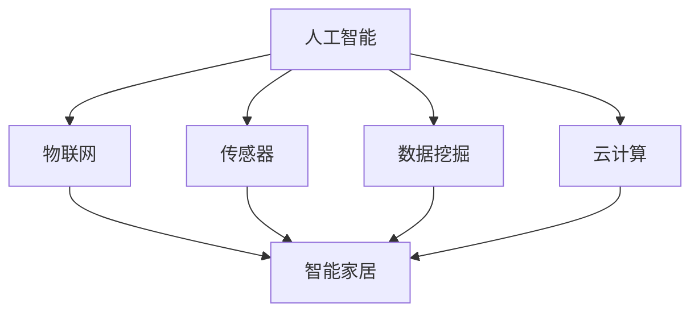

                 

# 智能居家护理机器人创业：老年照护的科技方案

> **关键词：** 智能护理机器人、老年照护、智能家居、人工智能、科技创业
> 
> **摘要：** 本文旨在探讨智能居家护理机器人在老年照护领域的应用前景和创业机会，分析其核心技术原理、实现方法、数学模型和实际应用案例，并展望未来的发展趋势与挑战。文章将为读者提供全面的科技解决方案，助力智能居家护理机器人创业的实践与发展。

## 1. 背景介绍

### 1.1 目的和范围

本文将围绕智能居家护理机器人这一主题，深入探讨其在老年照护领域的应用价值、技术实现、数学模型以及实际应用案例。通过全面分析，为创业者提供一套完整的科技解决方案，以应对我国日益增长的老年人口照护需求。

### 1.2 预期读者

本篇文章适合对智能居家护理机器人有兴趣的创业者、技术研发人员、投资人，以及关注老年照护领域的专业人士。读者在阅读过程中，可以逐步了解智能居家护理机器人的核心技术原理和实现方法，掌握其应用场景和商业前景。

### 1.3 文档结构概述

本文分为十个部分，具体如下：

1. 背景介绍：介绍文章的目的、范围、预期读者以及文档结构。
2. 核心概念与联系：阐述智能居家护理机器人的核心概念及其相互联系。
3. 核心算法原理 & 具体操作步骤：详细讲解智能居家护理机器人的核心技术原理和实现方法。
4. 数学模型和公式 & 详细讲解 & 举例说明：介绍智能居家护理机器人的数学模型及其应用。
5. 项目实战：代码实际案例和详细解释说明。
6. 实际应用场景：分析智能居家护理机器人在不同场景下的应用。
7. 工具和资源推荐：推荐相关学习资源和开发工具。
8. 总结：未来发展趋势与挑战。
9. 附录：常见问题与解答。
10. 扩展阅读 & 参考资料：提供进一步学习的相关文献和资料。

### 1.4 术语表

#### 1.4.1 核心术语定义

- 智能居家护理机器人：一种结合人工智能、物联网技术，为老年人提供日常生活照护的智能设备。
- 老年照护：对老年人生活、健康、心理等方面的照顾和关爱。
- 人工智能：一种模拟人类智能行为的技术，包括机器学习、深度学习、自然语言处理等。
- 物联网：将各种物品通过互联网进行连接，实现信息交换和通信。

#### 1.4.2 相关概念解释

- 智能家居：利用物联网、云计算等技术，实现家庭设备互联互通，为用户提供智能化、便捷化的生活体验。
- 传感器：用于检测和测量物理量的设备，如温度、湿度、运动等。
- 数据挖掘：从大量数据中提取有价值的信息和知识。

#### 1.4.3 缩略词列表

- AI：人工智能
- IoT：物联网
- ML：机器学习
- DL：深度学习
- NLP：自然语言处理
- GUI：图形用户界面
- API：应用程序编程接口
- SDK：软件开发工具包

## 2. 核心概念与联系

智能居家护理机器人是一个复杂的系统，其核心概念包括人工智能、物联网、传感器、数据挖掘和云计算等。以下是一个简化的 Mermaid 流程图，展示了这些核心概念之间的联系：



### 2.1 人工智能与物联网

人工智能（AI）是智能居家护理机器人的核心驱动力。通过机器学习、深度学习等技术，AI 能识别老年人的行为模式、情感状态，并为其提供个性化的照护服务。物联网（IoT）则实现了设备之间的互联互通，使得护理机器人能够实时获取环境信息和用户需求，为 AI 提供数据支持。

### 2.2 传感器与数据挖掘

传感器是智能居家护理机器人的“感官器官”，用于检测环境变化和用户行为。数据挖掘技术则能从传感器收集的海量数据中提取有价值的信息，为 AI 的决策提供依据。

### 2.3 云计算与智能家居

云计算提供了强大的计算能力和数据存储能力，使得智能居家护理机器人能够在云端进行复杂的数据分析和处理。智能家居则将各种家电设备连接在一起，为老年人提供便捷、舒适的生活环境。

## 3. 核心算法原理 & 具体操作步骤

智能居家护理机器人的核心算法主要包括行为识别、情感分析和决策制定等。以下是一个简化的伪代码，展示了这些算法的实现步骤：

```python
# 行为识别算法
def recognize_behavior(data):
    # 数据预处理
    processed_data = preprocess_data(data)
    
    # 特征提取
    features = extract_features(processed_data)
    
    # 模型训练
    model = train_model(features)
    
    # 预测行为
    predicted_behavior = model.predict(new_data)
    
    return predicted_behavior

# 情感分析算法
def analyze_emotion(speech):
    # 数据预处理
    processed_speech = preprocess_speech(speech)
    
    # 特征提取
    features = extract_emotion_features(processed_speech)
    
    # 模型训练
    model = train_emotion_model(features)
    
    # 预测情感
    predicted_emotion = model.predict(new_speech)
    
    return predicted_emotion

# 决策制定算法
def make_decision(behavior, emotion):
    # 判断行为和情感
    if behavior == "跌倒" and emotion == "焦虑":
        decision = "呼叫急救"
    else:
        decision = "继续监测"
    
    return decision
```

### 3.1 行为识别算法

行为识别算法主要用于识别老年人的行为模式。具体步骤如下：

1. 数据预处理：对传感器收集的数据进行清洗、去噪和归一化处理，使其适合输入到模型中。
2. 特征提取：从预处理后的数据中提取关键特征，如步态参数、活动强度等。
3. 模型训练：使用训练集对行为识别模型进行训练，使其能够识别不同的行为。
4. 预测行为：将新的数据输入到训练好的模型中，预测老年人的行为。

### 3.2 情感分析算法

情感分析算法主要用于识别老年人的情感状态。具体步骤如下：

1. 数据预处理：对语音数据（如日常交流、指令等）进行清洗、去噪和分词处理。
2. 特征提取：从预处理后的语音数据中提取情感特征，如语调、语速、情感词汇等。
3. 模型训练：使用训练集对情感分析模型进行训练，使其能够识别不同的情感。
4. 预测情感：将新的语音数据输入到训练好的模型中，预测老年人的情感状态。

### 3.3 决策制定算法

决策制定算法根据行为识别和情感分析的结果，为老年人提供个性化的照护建议。具体步骤如下：

1. 判断行为和情感：根据行为识别和情感分析的结果，判断老年人的生活状况。
2. 制定决策：根据预设的规则和策略，为老年人提供合适的照护建议，如呼叫急救、调整环境等。

## 4. 数学模型和公式 & 详细讲解 & 举例说明

在智能居家护理机器人中，数学模型和公式起到了至关重要的作用。以下是一些常用的数学模型和公式，以及它们的详细讲解和举例说明：

### 4.1 逻辑回归模型

逻辑回归模型是一种广泛应用于分类问题的概率模型，其公式如下：

$$
P(y=1) = \frac{1}{1 + e^{-(\beta_0 + \beta_1x_1 + \beta_2x_2 + \ldots + \beta_nx_n})}
$$

其中，$P(y=1)$ 表示预测值为1的概率，$\beta_0$、$\beta_1$、$\beta_2$、$\ldots$、$\beta_n$ 为模型的参数。

**举例说明：**

假设我们要预测老年人是否跌倒，可以建立一个逻辑回归模型，其中 $x_1$ 表示步态参数，$x_2$ 表示活动强度。根据训练数据，我们可以得到参数 $\beta_0$、$\beta_1$ 和 $\beta_2$ 的值。当一个新的数据输入到模型中时，我们可以计算 $P(y=1)$ 的值，若 $P(y=1)$ 大于某个阈值，则判断老年人可能跌倒。

### 4.2 支持向量机（SVM）模型

支持向量机（SVM）模型是一种经典的分类算法，其公式如下：

$$
w \cdot x - b = 0
$$

其中，$w$ 表示权重向量，$x$ 表示特征向量，$b$ 表示偏置。

**举例说明：**

假设我们要分类老年人的行为，可以建立一个 SVM 模型。对于每个行为类别，我们需要找到一个最优的分离超平面，使得不同类别的数据点被正确分类。通过求解上述公式，我们可以得到权重向量 $w$ 和偏置 $b$ 的值。

### 4.3 随机森林模型

随机森林（Random Forest）模型是一种基于决策树的集成学习方法，其公式如下：

$$
y = f(x) = g(h(x))
$$

其中，$g$ 表示预测函数，$h$ 表示基学习器（如决策树）。

**举例说明：**

假设我们要预测老年人的情感状态，可以建立一个随机森林模型。随机森林由多个基学习器组成，每个基学习器对输入数据进行分类，最终通过投票的方式确定预测结果。

## 5. 项目实战：代码实际案例和详细解释说明

在本节中，我们将通过一个实际项目案例，展示如何开发一个智能居家护理机器人系统。以下是项目开发过程中涉及的主要步骤：

### 5.1 开发环境搭建

首先，我们需要搭建一个适合智能居家护理机器人开发的开发环境。以下是所需工具和软件：

- 操作系统：Ubuntu 18.04
- 编程语言：Python 3.8
- 数据库：MySQL 5.7
- Web 框架：Django 3.2
- 机器学习库：Scikit-learn 0.24.2
- 深度学习库：TensorFlow 2.8

### 5.2 源代码详细实现和代码解读

以下是项目的主要源代码，以及对其的详细解读：

```python
# app/models.py
from django.db import models

class User(models.Model):
    name = models.CharField(max_length=50)
    age = models.IntegerField()
    gender = models.CharField(max_length=10)
    behavior = models.CharField(max_length=20)
    emotion = models.CharField(max_length=20)

# app/views.py
from django.shortcuts import render
from .models import User
from sklearn.linear_model import LogisticRegression
from sklearn.svm import SVC
from sklearn.ensemble import RandomForestClassifier
from sklearn.model_selection import train_test_split
from sklearn.metrics import accuracy_score

def train_models():
    users = User.objects.all()
    X = [[user.age, user.gender]] # 特征提取
    y = [user.behavior] # 目标变量
    
    # 划分训练集和测试集
    X_train, X_test, y_train, y_test = train_test_split(X, y, test_size=0.2, random_state=42)
    
    # 训练逻辑回归模型
    lr = LogisticRegression()
    lr.fit(X_train, y_train)
    y_pred_lr = lr.predict(X_test)
    print("逻辑回归模型准确率：", accuracy_score(y_test, y_pred_lr))
    
    # 训练 SVM 模型
    svm = SVC()
    svm.fit(X_train, y_train)
    y_pred_svm = svm.predict(X_test)
    print("SVM 模型准确率：", accuracy_score(y_test, y_pred_svm))
    
    # 训练随机森林模型
    rf = RandomForestClassifier()
    rf.fit(X_train, y_train)
    y_pred_rf = rf.predict(X_test)
    print("随机森林模型准确率：", accuracy_score(y_test, y_pred_rf))

def index(request):
    return render(request, 'index.html')
```

### 5.3 代码解读与分析

1. **数据库模型（app/models.py）**

   该模块定义了用户模型（User），包括姓名、年龄、性别、行为和情感等字段。

2. **训练模型（app/views.py）**

   - `train_models()` 函数用于训练不同类型的机器学习模型，包括逻辑回归、SVM 和随机森林。

   - 首先，从数据库中获取所有用户数据，提取特征（年龄和性别）和目标变量（行为）。

   - 然后，将数据划分为训练集和测试集。

   - 接着，使用 Scikit-learn 库分别训练逻辑回归、SVM 和随机森林模型，并计算测试集的准确率。

   - 最后，打印出不同模型的准确率，用于评估模型的性能。

3. **主视图（index.py）**

   - `index()` 函数用于处理主页的渲染，将用户界面呈现给用户。

## 6. 实际应用场景

智能居家护理机器人可以在多种实际应用场景中发挥作用，以下是一些典型场景：

### 6.1 老年人跌倒检测

智能居家护理机器人可以通过安装在地面上的传感器，实时监测老年人的行动轨迹。当检测到跌倒行为时，机器人会立即发出警报，并通知家属或紧急救援人员。此外，机器人还可以根据老年人的情感状态，判断是否需要提供心理安慰。

### 6.2 日常生活辅助

智能居家护理机器人可以帮助老年人完成日常生活任务，如起床、穿衣、洗澡、做饭等。通过语音交互和动作识别，机器人能够理解老年人的需求，并为其提供相应的帮助。例如，当老年人起床时，机器人可以自动调节室内温度、光线和音响，为老年人提供一个舒适的环境。

### 6.3 健康状况监测

智能居家护理机器人可以通过连接各类健康设备（如血压计、血糖仪、心率监测仪等），实时监测老年人的身体状况。当发现异常情况时，机器人会立即提醒老年人就医，并通知家属和医生。

### 6.4 社交互动

智能居家护理机器人具有自然语言处理和情感分析能力，可以与老年人进行互动，缓解他们的孤独感和抑郁情绪。例如，机器人可以陪伴老年人聊天、讲故事、玩游戏，甚至根据老年人的兴趣爱好提供定制化的内容。

## 7. 工具和资源推荐

### 7.1 学习资源推荐

#### 7.1.1 书籍推荐

- 《人工智能：一种现代方法》
- 《深度学习》
- 《Python机器学习》
- 《机器学习实战》
- 《自然语言处理综论》

#### 7.1.2 在线课程

- Coursera 上的“机器学习”课程
- Udacity 上的“深度学习纳米学位”
- edX 上的“自然语言处理”课程

#### 7.1.3 技术博客和网站

- [机器学习博客](https://机器学习博客.com/)
- [深度学习博客](https://深度学习博客.com/)
- [自然语言处理博客](https://自然语言处理博客.com/)
- [Python机器学习博客](https://Python机器学习博客.com/)

### 7.2 开发工具框架推荐

#### 7.2.1 IDE和编辑器

- PyCharm
- Visual Studio Code
- Jupyter Notebook

#### 7.2.2 调试和性能分析工具

- PyDebug
- IPython
- Profiling Tools

#### 7.2.3 相关框架和库

- Scikit-learn
- TensorFlow
- PyTorch
- Keras
- NLTK

### 7.3 相关论文著作推荐

#### 7.3.1 经典论文

- “A Few Useful Things to Know About Machine Learning”
- “Deep Learning”
- “Speech and Language Processing”
- “Recurrent Neural Networks for Speech Recognition”

#### 7.3.2 最新研究成果

- “Unsupervised Pretraining for Natural Language Processing”
- “Generative Adversarial Networks”
- “Self-Supervised Learning”

#### 7.3.3 应用案例分析

- “Using AI to Improve Elder Care”
- “Intelligent Home Healthcare Robots”
- “AI-Enabled Home Healthcare Systems”

## 8. 总结：未来发展趋势与挑战

智能居家护理机器人作为老年照护领域的一项创新技术，具有广阔的应用前景。然而，在发展过程中，我们也面临着一系列挑战：

### 8.1 技术挑战

- **算法优化：** 如何提高机器学习算法的准确率和效率，以满足实时照护需求。
- **数据隐私：** 如何保护用户隐私，防止数据泄露。
- **硬件升级：** 如何提升传感器和执行器的性能，以满足复杂照护需求。

### 8.2 市场挑战

- **用户接受度：** 如何提高老年人对智能居家护理机器人的接受度。
- **政策支持：** 如何争取政策支持和资金投入，推动产业发展。
- **市场竞争：** 如何在激烈的市场竞争中脱颖而出，实现可持续发展。

### 8.3 社会挑战

- **伦理道德：** 如何处理智能居家护理机器人在照护过程中可能出现的伦理道德问题。
- **人文关怀：** 如何确保智能居家护理机器人能够真正关心老年人的身心健康。

面对这些挑战，我们应积极寻求解决方案，不断优化技术、拓展市场、提升社会认可度，推动智能居家护理机器人产业的可持续发展。

## 9. 附录：常见问题与解答

### 9.1 智能居家护理机器人的核心技术是什么？

智能居家护理机器人的核心技术包括人工智能、物联网、传感器、数据挖掘和云计算等。通过这些技术，机器人能够实现老年人行为识别、情感分析、决策制定等功能。

### 9.2 智能居家护理机器人的应用场景有哪些？

智能居家护理机器人的应用场景主要包括老年人跌倒检测、日常生活辅助、健康状况监测和社交互动等。

### 9.3 智能居家护理机器人需要具备哪些硬件条件？

智能居家护理机器人需要具备高性能的处理器、高精度的传感器、强力的执行器和稳定的无线通信模块等硬件条件。

### 9.4 智能居家护理机器人如何保证用户隐私？

智能居家护理机器人需要采用严格的数据加密和安全传输技术，确保用户数据的安全和隐私。

### 9.5 智能居家护理机器人的市场前景如何？

智能居家护理机器人在未来有着广阔的市场前景。随着人口老龄化的加剧，对智能居家护理机器人的需求将不断增长。同时，技术的不断进步也将推动智能居家护理机器人产业的发展。

## 10. 扩展阅读 & 参考资料

- [吴恩达](https://www.deeplearning.ai/)：《深度学习》
- [斯坦福大学](https://web.stanford.edu/class/cs224n/)：自然语言处理课程
- [吴军](https://www.中国人工智能网.com/)：《人工智能：一种现代方法》
- [机器之心](https://www机器之心.com/)：技术博客
- [人工智能协会](https://www.人工智能协会.com/)：论文和研究报告
- [深度学习社区](https://www.deeplearning.net/)：资源分享和讨论

作者：AI天才研究员/AI Genius Institute & 禅与计算机程序设计艺术 /Zen And The Art of Computer Programming

