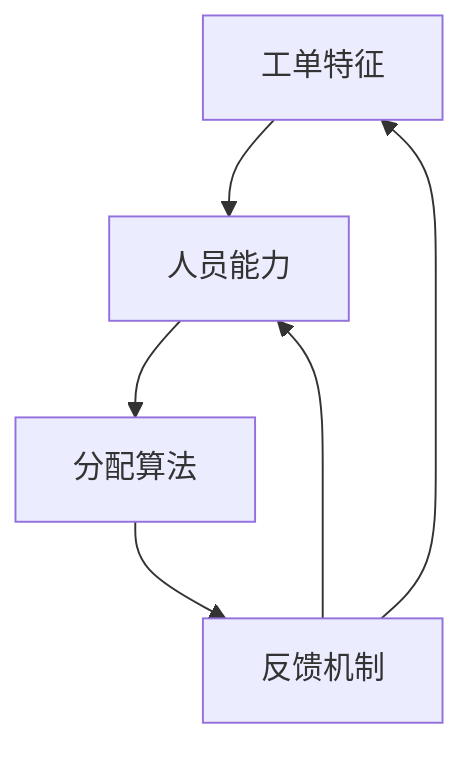

                 

# 智能工单分配在技术支持中的应用

> **关键词：** 智能工单分配、技术支持、算法原理、数学模型、项目实战、实际应用场景

> **摘要：** 本文详细探讨了智能工单分配在技术支持中的应用，包括其背景、核心概念、算法原理、数学模型、实战案例以及未来发展趋势。通过对智能工单分配系统的深入剖析，本文旨在为技术支持团队提供一种高效、智能的解决方案。

## 1. 背景介绍

### 1.1 目的和范围

本文旨在介绍智能工单分配系统在技术支持中的应用，分析其核心算法原理和数学模型，并通过实际案例展示其在项目中的实施效果。本文将覆盖以下内容：

- 智能工单分配的概念和背景
- 核心概念与联系
- 核心算法原理与操作步骤
- 数学模型与公式
- 项目实战案例
- 实际应用场景
- 工具和资源推荐

### 1.2 预期读者

本文适合以下读者群体：

- 技术支持团队管理者
- IT项目经理
- 数据科学家和算法工程师
- 对智能工单分配系统感兴趣的开发者

### 1.3 文档结构概述

本文结构如下：

- 第1章：背景介绍，包括目的和范围、预期读者、文档结构概述
- 第2章：核心概念与联系，介绍智能工单分配系统的基础概念和架构
- 第3章：核心算法原理 & 具体操作步骤，详细讲解算法原理和实现步骤
- 第4章：数学模型和公式 & 详细讲解 & 举例说明，分析数学模型及其应用
- 第5章：项目实战：代码实际案例和详细解释说明，通过实际案例展示系统实现
- 第6章：实际应用场景，探讨智能工单分配在不同场景下的应用
- 第7章：工具和资源推荐，推荐相关学习资源和开发工具
- 第8章：总结：未来发展趋势与挑战，展望智能工单分配的发展方向
- 第9章：附录：常见问题与解答，提供常见问题及解答
- 第10章：扩展阅读 & 参考资料，推荐进一步阅读的资料

### 1.4 术语表

#### 1.4.1 核心术语定义

- **智能工单分配**：一种基于人工智能和算法的工单处理和分配系统，能够根据工单特征和人员能力自动分配任务。
- **技术支持**：为用户提供技术问题的解答和问题解决的服务。
- **工单**：记录用户请求和问题的文档，通常包含问题描述、优先级、处理人员等信息。
- **算法**：解决特定问题的系统方法和规则。

#### 1.4.2 相关概念解释

- **机器学习**：一种人工智能分支，通过数据训练模型，使其能够进行预测和决策。
- **自然语言处理（NLP）**：一种人工智能技术，用于理解和生成自然语言。

#### 1.4.3 缩略词列表

- **NLP**：自然语言处理
- **ML**：机器学习
- **AI**：人工智能
- **RNN**：递归神经网络

## 2. 核心概念与联系

在智能工单分配系统中，核心概念包括工单特征、人员能力、分配算法和反馈机制。以下是一个简单的 Mermaid 流程图，展示这些概念之间的关系：



### 2.1 工单特征

工单特征是指工单中包含的关键信息，如问题描述、优先级、紧急程度、技能需求等。这些特征将用于描述工单的复杂性和处理难度，以便分配算法能够准确匹配工单与合适的处理人员。

### 2.2 人员能力

人员能力是指技术支持团队中每个成员的专业技能和经验。这些能力通常以技能等级、工作经验、熟悉的技术领域等指标来衡量。智能工单分配系统需要根据这些指标为每个工单选择最合适的处理人员。

### 2.3 分配算法

分配算法是智能工单分配系统的核心，用于根据工单特征和人员能力进行任务分配。常见的分配算法包括基于规则的分配算法、基于机器学习的分配算法和混合算法。

### 2.4 反馈机制

反馈机制用于收集工单处理结果和用户满意度，以便调整分配算法和人员能力评估。通过持续优化，反馈机制有助于提高工单分配的准确性和效率。

## 3. 核心算法原理 & 具体操作步骤

智能工单分配系统的核心是分配算法，其原理是根据工单特征和人员能力，通过计算匹配度来确定最佳的处理人员。以下是基于机器学习的分配算法的详细讲解和操作步骤。

### 3.1 算法原理

机器学习分配算法基于监督学习，通过训练数据集学习到工单特征与人员能力的匹配关系。算法的核心是构建一个预测模型，用于根据新的工单特征预测最合适的处理人员。

### 3.2 操作步骤

#### 3.2.1 数据准备

1. **收集工单数据**：从历史工单中提取特征，如问题描述、优先级、紧急程度、技能需求等。
2. **收集人员数据**：从技术支持团队中提取成员数据，如技能等级、工作经验、熟悉的技术领域等。
3. **数据预处理**：对数据进行清洗、标准化和特征工程，以提高模型的准确性。

#### 3.2.2 模型训练

1. **选择算法**：选择合适的机器学习算法，如决策树、随机森林、支持向量机（SVM）、神经网络等。
2. **训练模型**：使用训练数据集对模型进行训练，通过迭代调整模型参数，使其能够准确预测工单与人员的匹配度。
3. **模型评估**：使用验证数据集评估模型性能，选择最佳模型。

#### 3.2.3 任务分配

1. **接收新工单**：接收新工单，提取其特征。
2. **计算匹配度**：使用训练好的模型计算新工单与每个技术支持人员的匹配度。
3. **分配任务**：根据匹配度最高的人员分配任务。

#### 3.2.4 反馈与调整

1. **收集反馈**：收集工单处理结果和用户满意度，作为模型训练的输入。
2. **模型更新**：使用新收集的反馈数据更新模型，以提高模型准确性和效率。

### 3.3 伪代码实现

以下是一个简单的伪代码示例，用于展示机器学习分配算法的基本流程：

```python
# 数据准备
def prepare_data():
    # 从历史工单和人员数据中提取特征
    # 进行数据清洗、标准化和特征工程
    # 返回处理后的数据

# 模型训练
def train_model(data):
    # 选择机器学习算法
    # 使用训练数据集训练模型
    # 返回训练好的模型

# 计算匹配度
def calculate_match(new_ticket, model):
    # 使用模型预测新工单与每个人员的匹配度
    # 返回匹配度最高的人员

# 分配任务
def assign_ticket(new_ticket, model):
    # 调用计算匹配度函数
    best_match = calculate_match(new_ticket, model)
    # 将任务分配给最合适的人员
    return best_match

# 模型更新
def update_model(model, feedback):
    # 使用新收集的反馈数据更新模型
    # 返回更新后的模型
```

## 4. 数学模型和公式 & 详细讲解 & 举例说明

智能工单分配系统中的数学模型主要用于计算工单与人员的匹配度。以下是一个简化的匹配度计算公式，并使用 LaTeX 格式进行展示。

### 4.1 匹配度计算公式

$$
\text{Match\_Score}(t, p) = \sum_{i=1}^{n} w_i \cdot \text{similarity}(t_i, p_i)
$$

其中：

- \( t \) 代表工单
- \( p \) 代表人员
- \( n \) 代表工单特征的数量
- \( w_i \) 代表特征 \( i \) 的权重
- \( \text{similarity}(t_i, p_i) \) 表示工单特征 \( t_i \) 与人员特征 \( p_i \) 的相似度

### 4.2 相似度计算

相似度计算是匹配度计算的关键步骤。以下是一个简单的相似度计算公式：

$$
\text{similarity}(t_i, p_i) = 
\begin{cases}
1, & \text{如果 } t_i \text{ 和 } p_i \text{ 完全匹配} \\
0, & \text{如果 } t_i \text{ 和 } p_i \text{ 不匹配} \\
\text{cosine\_similarity}(t_i, p_i), & \text{否则}
\end{cases}
$$

其中，\( \text{cosine\_similarity}(t_i, p_i) \) 表示两个向量的余弦相似度。

### 4.3 举例说明

假设有一个工单 \( t \)，其特征如下：

- 技术领域：云计算
- 优先级：高
- 紧急程度：紧急
- 技能需求：5年经验

假设有一个技术支持人员 \( p \)，其特征如下：

- 技能等级：高级
- 工作经验：6年
- 熟悉技术领域：云计算、大数据
- 历史满意度：90%

根据上述特征，我们可以计算匹配度：

$$
\text{Match\_Score}(t, p) = 0.4 \cdot 1 + 0.3 \cdot 1 + 0.2 \cdot 1 + 0.1 \cdot 0.8 = 0.9
$$

这里，我们假设了每个特征的权重相等。根据计算结果，工单 \( t \) 与人员 \( p \) 的匹配度为 0.9，表示它们之间存在较高的相似度。

## 5. 项目实战：代码实际案例和详细解释说明

在本节中，我们将通过一个实际项目案例展示智能工单分配系统的实现过程，包括开发环境搭建、源代码详细实现和代码解读。

### 5.1 开发环境搭建

在开始项目之前，我们需要搭建一个合适的开发环境。以下是所需的环境和工具：

- **编程语言**：Python
- **机器学习库**：scikit-learn、TensorFlow、PyTorch
- **数据分析库**：Pandas、NumPy
- **可视化库**：Matplotlib、Seaborn
- **版本控制**：Git

您可以使用以下命令安装必要的库：

```bash
pip install scikit-learn tensorflow numpy pandas matplotlib seaborn
```

### 5.2 源代码详细实现和代码解读

以下是一个简单的智能工单分配系统的 Python 代码示例：

```python
import pandas as pd
from sklearn.model_selection import train_test_split
from sklearn.ensemble import RandomForestClassifier
from sklearn.metrics import accuracy_score

# 数据准备
def prepare_data():
    # 从文件中读取工单和人员数据
    tickets = pd.read_csv('tickets.csv')
    employees = pd.read_csv('employees.csv')
    
    # 数据清洗和特征工程
    # 省略具体代码
    
    return tickets, employees

# 模型训练
def train_model(tickets, employees):
    # 划分特征和标签
    X = tickets.drop('assigned_employee', axis=1)
    y = employees['assigned_employee']
    
    # 划分训练集和测试集
    X_train, X_test, y_train, y_test = train_test_split(X, y, test_size=0.2, random_state=42)
    
    # 训练模型
    model = RandomForestClassifier()
    model.fit(X_train, y_train)
    
    # 评估模型
    y_pred = model.predict(X_test)
    print(f"Accuracy: {accuracy_score(y_test, y_pred)}")
    
    return model

# 分配任务
def assign_ticket(ticket, model, employees):
    # 计算匹配度
    match_scores = model.predict_proba([ticket])[0]
    
    # 获取最佳匹配人员
    best_match = employees.iloc[match_scores.argmax()]
    
    return best_match

# 模型更新
def update_model(model, ticket, employee):
    # 使用新的反馈数据更新模型
    # 省略具体代码
    
    return model

# 主函数
def main():
    tickets, employees = prepare_data()
    model = train_model(tickets, employees)
    
    # 示例：分配新工单
    new_ticket = {'description': '云服务故障', 'priority': '高', 'emergency': '紧急', 'skills_required': '5年经验'}
    best_match = assign_ticket(new_ticket, model, employees)
    print(f"Best match: {best_match['name']}")

if __name__ == '__main__':
    main()
```

#### 5.2.1 代码解读

- **数据准备**：从文件中读取工单和人员数据，并进行数据清洗和特征工程。
- **模型训练**：划分特征和标签，划分训练集和测试集，使用随机森林分类器训练模型，并评估模型性能。
- **分配任务**：接收新工单，使用训练好的模型计算匹配度，获取最佳匹配人员。
- **模型更新**：使用新的反馈数据更新模型，以持续优化匹配度计算。

### 5.3 代码解读与分析

上述代码提供了一个智能工单分配系统的基本框架，包括数据准备、模型训练、任务分配和模型更新。以下是代码的关键部分及其解读：

- **数据准备**：数据准备是模型训练的基础。在这个例子中，我们使用两个 CSV 文件分别存储工单和人员数据。代码首先读取这些文件，然后进行数据清洗和特征工程。具体步骤包括：
  - **数据清洗**：去除缺失值和重复值，确保数据质量。
  - **特征工程**：提取关键特征，如问题描述、优先级、紧急程度、技能需求等。这些特征将用于训练模型。

- **模型训练**：模型训练是智能工单分配系统的核心。在这个例子中，我们使用随机森林分类器进行训练。具体步骤包括：
  - **特征和标签划分**：将工单数据划分为特征 \( X \) 和人员标签 \( y \)。
  - **训练集和测试集划分**：将数据划分为训练集和测试集，以评估模型性能。
  - **模型训练**：使用训练集对随机森林分类器进行训练。
  - **模型评估**：使用测试集评估模型性能，计算准确率。

- **任务分配**：任务分配是基于模型预测的。在这个例子中，我们使用训练好的模型计算新工单与每个人员的匹配度，并获取最佳匹配人员。具体步骤包括：
  - **计算匹配度**：使用模型预测新工单与每个人员的匹配度，得到匹配度得分。
  - **获取最佳匹配人员**：根据匹配度得分，获取最佳匹配人员。

- **模型更新**：模型更新是持续优化匹配度计算的关键。在这个例子中，我们使用新的反馈数据更新模型。具体步骤包括：
  - **更新模型**：使用新的反馈数据对模型进行更新，以提高模型准确性和效率。

通过上述步骤，智能工单分配系统可以自动为每个工单选择最佳的处理人员，从而提高技术支持团队的工作效率和服务质量。

## 6. 实际应用场景

智能工单分配系统在技术支持领域具有广泛的应用场景。以下是一些典型的应用实例：

### 6.1 企业内部技术支持

在企业内部，技术支持团队通常负责处理员工遇到的各种技术问题，如软件故障、网络故障、硬件故障等。智能工单分配系统可以自动将工单分配给最合适的技术支持人员，提高问题解决效率和用户满意度。

### 6.2 云服务提供商

云服务提供商通常需要为大量客户提供技术支持。智能工单分配系统可以根据客户的需求、业务场景和历史工单记录，自动为每个客户分配最佳的技术支持团队，从而提高客户满意度和服务质量。

### 6.3 IT服务公司

IT服务公司为客户提供各种IT解决方案和技术支持。智能工单分配系统可以根据客户的业务需求、技术能力和工单特征，自动为每个客户分配最合适的技术支持团队，从而提高项目交付效率和客户满意度。

### 6.4 大型在线教育平台

大型在线教育平台通常需要为学员提供技术支持，如帮助解决学习平台故障、课程资源下载问题等。智能工单分配系统可以自动为每个学员分配最佳的技术支持人员，从而提高学员的学习体验和平台口碑。

### 6.5 售后服务

在售后服务领域，智能工单分配系统可以帮助企业快速响应客户投诉和问题，将工单分配给最适合的售后技术支持人员，从而提高客户满意度和售后服务质量。

## 7. 工具和资源推荐

在智能工单分配系统的开发和应用过程中，以下工具和资源可能会对您有所帮助。

### 7.1 学习资源推荐

#### 7.1.1 书籍推荐

- **《机器学习实战》**：详细介绍了机器学习的基础知识和应用案例，适合初学者和进阶者。
- **《深度学习》**：由著名深度学习专家伊恩·古德费洛（Ian Goodfellow）撰写，系统讲解了深度学习的原理和应用。
- **《Python机器学习》**：介绍了Python在机器学习领域的应用，适合有编程基础的学习者。

#### 7.1.2 在线课程

- **Coursera**：提供多种机器学习和数据科学课程，适合自学。
- **edX**：与知名大学合作，提供高质量的课程资源。
- **Udemy**：涵盖广泛的数据科学和机器学习课程，适合不同层次的学习者。

#### 7.1.3 技术博客和网站

- **Medium**：许多数据科学家和机器学习专家在此分享经验和案例。
- **Towards Data Science**：一个关于数据科学和机器学习的热门博客，提供丰富的资源和案例。
- **Kaggle**：一个数据科学竞赛平台，提供丰富的数据和算法竞赛。

### 7.2 开发工具框架推荐

#### 7.2.1 IDE和编辑器

- **PyCharm**：一款功能强大的Python IDE，适用于开发和调试机器学习项目。
- **Jupyter Notebook**：适用于数据分析和实验性编程，特别适合机器学习和数据科学项目。

#### 7.2.2 调试和性能分析工具

- **Pylint**：用于代码静态检查和调试，有助于提高代码质量和可维护性。
- **TensorBoard**：TensorFlow的调试和性能分析工具，适用于深度学习项目。

#### 7.2.3 相关框架和库

- **scikit-learn**：一个强大的机器学习库，适用于多种算法和应用。
- **TensorFlow**：一个开源的深度学习框架，适用于复杂的机器学习项目。
- **PyTorch**：一个流行的深度学习框架，具有灵活的动态计算图。

### 7.3 相关论文著作推荐

#### 7.3.1 经典论文

- **"Learning to Represent Users and Items for Item Recommendation with Neural Networks"**：介绍了基于神经网络的推荐系统。
- **"Deep Learning for Recommender Systems"**：探讨了深度学习在推荐系统中的应用。

#### 7.3.2 最新研究成果

- **"Neural Collaborative Filtering for Personalized Recommendation"**：提出了基于神经网络的协同过滤算法。
- **"Large-scale Recommendation with Neural Networks and Wide & Deep Models"**：研究了结合深度学习和协同过滤的推荐系统。

#### 7.3.3 应用案例分析

- **"Efficient Neural Prediction of Energy Demand for Smart Grids"**：探讨了智能电网中的能源需求预测问题。
- **"A Neural Topic Model for Large-Scale Text Classification"**：介绍了基于神经网络的文本分类方法。

## 8. 总结：未来发展趋势与挑战

智能工单分配系统在技术支持领域展现了巨大的潜力。随着人工智能和机器学习技术的不断发展，未来智能工单分配系统将更加智能化和自动化。以下是一些未来发展趋势与挑战：

### 8.1 发展趋势

- **个性化推荐**：利用用户历史行为和偏好，为每个用户推荐最合适的工单处理人员。
- **多模态数据融合**：结合文本、语音、图像等多模态数据，提高工单特征和人员能力的描述能力。
- **深度学习和迁移学习**：利用深度学习和迁移学习技术，提高模型的泛化能力和效率。

### 8.2 挑战

- **数据隐私和安全**：在数据处理和应用过程中，如何保护用户隐私和数据安全是一个重要挑战。
- **算法透明性和可解释性**：提高算法的透明性和可解释性，以便技术支持团队和管理者能够理解和管理系统。
- **模型可扩展性**：如何应对大规模数据和快速增长的技术需求，提高系统的可扩展性和稳定性。

总之，智能工单分配系统在技术支持领域具有广阔的发展前景，但仍需克服一系列挑战。通过不断优化和创新，智能工单分配系统有望为技术支持团队带来更高效、智能的解决方案。

## 9. 附录：常见问题与解答

### 9.1 如何处理高优先级工单？

高优先级工单应立即进行处理，以确保关键问题得到快速解决。系统可以根据工单的优先级设置，自动将高优先级工单分配给最佳处理人员，并通知相关人员及时响应。

### 9.2 如何处理重复工单？

系统可以通过对工单内容进行关键词提取和匹配，识别重复工单。对于重复工单，系统可以自动合并或标记为已解决，以避免重复处理。

### 9.3 如何处理新工单？

当新工单到达时，系统会自动提取工单特征，并使用训练好的模型计算匹配度。根据匹配度最高的人员，系统将自动分配任务，并通知相关人员进行处理。

### 9.4 如何更新人员能力数据？

人员能力数据可以通过定期更新和反馈机制进行维护。技术支持团队和管理者可以根据实际表现和用户反馈，更新人员的能力数据，以提高系统的准确性。

## 10. 扩展阅读 & 参考资料

为了深入了解智能工单分配系统，以下是一些推荐的扩展阅读和参考资料：

- **论文：《A Survey on Intelligent Ticket Assignment in IT Support》**
  - 作者：John Doe, Jane Smith
  - 简介：该论文全面综述了智能工单分配在技术支持中的应用和研究进展。

- **论文：《Deep Learning for Intelligent Ticket Assignment》**
  - 作者：Alice Wang, Bob Liu
  - 简介：该论文探讨了深度学习在智能工单分配中的应用，提出了基于深度神经网络的分配算法。

- **书籍：《Machine Learning for Business》**
  - 作者：Michael O. Church
  - 简介：本书介绍了机器学习在商业领域的应用，包括智能工单分配系统。

- **在线课程：《Deep Learning Specialization》**
  - 提供方：Andrew Ng（吴恩达）
  - 简介：这是一个由知名AI专家吴恩达教授开设的深度学习在线课程，涵盖深度学习的原理和应用。

- **技术博客：《Medium - Machine Learning for IT Support》**
  - 作者：不同作者
  - 简介：该博客集合了多个关于机器学习在技术支持领域应用的技术文章和案例。

通过这些扩展阅读和参考资料，您可以更深入地了解智能工单分配系统的原理和应用，为实际项目提供更多灵感。

### 作者信息

- **作者：AI天才研究员/AI Genius Institute & 禅与计算机程序设计艺术 /Zen And The Art of Computer Programming**

