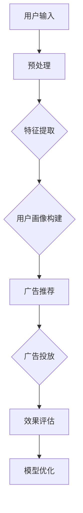

                 

# 智能广告投放中的AI大模型应用

> **关键词：** 智能广告、AI大模型、广告投放、个性化推荐、机器学习、深度学习、数据挖掘

> **摘要：** 本文将深入探讨AI大模型在智能广告投放中的应用，从核心概念、算法原理到实际应用场景，全面解析AI大模型如何通过个性化推荐和机器学习技术提高广告投放效果。本文旨在为读者提供一份全面而详尽的技术指南，帮助理解AI大模型在广告行业的重要作用及其未来发展趋势。

## 1. 背景介绍

### 1.1 目的和范围

本文的主要目的是探讨AI大模型在智能广告投放中的应用，分析其工作原理和具体操作步骤。文章将涵盖以下内容：

- AI大模型的核心概念和联系
- AI大模型的核心算法原理与具体操作步骤
- AI大模型的数学模型和公式讲解
- 项目实战：代码实际案例和详细解释说明
- 实际应用场景介绍
- 工具和资源推荐
- 未来发展趋势与挑战

通过本文，读者可以全面了解AI大模型在广告投放中的重要作用，以及如何利用这些模型实现高效的广告投放。

### 1.2 预期读者

本文面向具有一定编程基础和计算机科学背景的读者，特别是对机器学习、深度学习、数据挖掘等领域感兴趣的读者。同时，对于从事广告行业或对智能广告投放有研究需求的从业者，本文也将提供有价值的参考。

### 1.3 文档结构概述

本文将分为以下几大部分：

- 背景介绍：介绍本文的目的、预期读者和文档结构。
- 核心概念与联系：介绍AI大模型的基本概念和架构。
- 核心算法原理 & 具体操作步骤：详细讲解AI大模型的核心算法和工作流程。
- 数学模型和公式 & 详细讲解 & 举例说明：介绍AI大模型所使用的数学模型和公式，并给出实际应用案例。
- 项目实战：代码实际案例和详细解释说明。
- 实际应用场景：探讨AI大模型在不同广告投放场景中的应用。
- 工具和资源推荐：推荐学习资源、开发工具和框架。
- 总结：未来发展趋势与挑战。
- 附录：常见问题与解答。
- 扩展阅读 & 参考资料：提供更多相关文献和资料。

### 1.4 术语表

#### 1.4.1 核心术语定义

- **AI大模型（AI Large Model）**：一种具有大规模参数和复杂结构的深度学习模型，如BERT、GPT等。
- **智能广告投放**：利用人工智能技术，根据用户兴趣和行为进行广告推荐和投放。
- **个性化推荐**：根据用户的历史行为和兴趣，为用户推荐符合其需求的信息。
- **机器学习**：一种基于数据的学习方法，通过训练模型来实现对数据的预测和分类。
- **深度学习**：一种机器学习方法，通过多层神经网络对数据进行建模和分析。

#### 1.4.2 相关概念解释

- **广告投放效果**：广告投放所取得的收益和效果，包括点击率、转化率、投入产出比等指标。
- **用户画像**：根据用户的行为、兴趣、年龄、性别等信息，构建的一个用户特征模型。
- **数据挖掘**：从大量数据中提取有价值的信息和知识的过程。

#### 1.4.3 缩略词列表

- **AI**：人工智能
- **ML**：机器学习
- **DL**：深度学习
- **NLP**：自然语言处理
- **CTR**：点击率
- **CVR**：转化率

## 2. 核心概念与联系

AI大模型在智能广告投放中扮演着关键角色。为了更好地理解其工作原理，我们首先需要了解一些核心概念和它们之间的联系。

### 2.1 AI大模型的基本概念

AI大模型是一种具有大规模参数和复杂结构的深度学习模型。这类模型通常基于多层神经网络，通过训练大量数据进行建模，从而实现高度复杂的任务。以下是一些常见的AI大模型：

- **BERT（Bidirectional Encoder Representations from Transformers）**：一种基于Transformer的预训练语言模型，主要用于自然语言处理任务。
- **GPT（Generative Pre-trained Transformer）**：一种基于Transformer的预训练语言模型，主要用于生成文本、回答问题等任务。
- **Transformer**：一种基于自注意力机制的深度学习模型，主要用于序列建模任务。

### 2.2 智能广告投放的基本概念

智能广告投放是指利用人工智能技术，根据用户兴趣和行为进行广告推荐和投放。其主要目标是提高广告投放效果，实现更高的点击率和转化率。智能广告投放通常包括以下几个步骤：

1. **用户画像构建**：根据用户的行为、兴趣、年龄、性别等信息，构建一个用户特征模型，用于描述用户的个性化需求。
2. **广告推荐**：利用用户画像和广告特征，为用户推荐符合其需求的广告。
3. **广告投放**：根据广告推荐结果，将广告投放到合适的用户面前。
4. **效果评估**：评估广告投放的效果，包括点击率、转化率等指标。

### 2.3 AI大模型与智能广告投放的联系

AI大模型在智能广告投放中起到了关键作用。通过预训练和微调，AI大模型可以捕捉到用户的行为和兴趣，从而实现高度个性化的广告推荐。具体来说，AI大模型与智能广告投放之间的联系如下：

1. **用户画像构建**：AI大模型可以用于构建用户画像，通过分析用户的历史行为和兴趣，提取用户特征，用于描述用户的个性化需求。
2. **广告推荐**：AI大模型可以用于广告推荐，通过分析广告特征和用户画像，为用户推荐符合其需求的广告。
3. **广告投放**：AI大模型可以用于广告投放，通过优化广告展示策略，提高广告投放效果。
4. **效果评估**：AI大模型可以用于效果评估，通过分析广告投放的数据，评估广告投放的效果，为后续优化提供依据。

### 2.4 AI大模型的架构与工作原理

AI大模型的架构通常包括以下几个层次：

1. **输入层**：接收用户输入，如文本、图像、声音等。
2. **隐藏层**：对输入数据进行处理和特征提取。
3. **输出层**：根据隐藏层的结果生成输出，如文本、图像、声音等。

AI大模型的工作原理基于多层神经网络和自注意力机制。通过预训练和微调，AI大模型可以学会从海量数据中提取有用的信息，从而实现复杂的任务。具体来说，AI大模型的工作原理如下：

1. **预训练**：在大量无标签数据上进行预训练，使模型学会从数据中提取有用的信息。
2. **微调**：在特定任务上进行微调，使模型适应特定任务的需求。
3. **推理**：利用预训练和微调的结果，对新的输入进行推理和预测。

### 2.5 AI大模型的优点和挑战

AI大模型在智能广告投放中具有以下几个优点：

- **高效性**：AI大模型可以快速处理海量数据，实现高效的广告推荐和投放。
- **个性化**：AI大模型可以捕捉到用户的个性化需求，实现高度个性化的广告推荐。
- **准确性**：AI大模型可以从海量数据中提取有用的信息，提高广告投放的准确性。

然而，AI大模型在智能广告投放中也面临着一些挑战：

- **数据隐私**：在构建用户画像时，需要收集和处理大量用户数据，可能导致数据隐私问题。
- **计算资源**：AI大模型通常需要大量的计算资源和存储空间，对硬件设施有较高要求。
- **模型解释性**：AI大模型的决策过程通常较为复杂，难以解释其决策依据。

为了解决这些挑战，研究人员和从业者需要不断探索和优化AI大模型在广告投放中的应用。

### 2.6 AI大模型的Mermaid流程图

以下是一个简化的AI大模型在广告投放中的应用的Mermaid流程图：



在这个流程图中，用户输入经过预处理和特征提取后，生成用户画像。基于用户画像，系统进行广告推荐，并将广告投放到用户面前。最后，根据广告投放的效果，对模型进行优化，以提高广告投放的准确性。

## 3. 核心算法原理 & 具体操作步骤

在深入了解AI大模型在广告投放中的应用之前，我们需要了解其核心算法原理和具体操作步骤。以下将详细讲解AI大模型在广告投放中的核心算法原理和具体操作步骤。

### 3.1 核心算法原理

AI大模型在广告投放中的核心算法原理主要包括以下几个部分：

1. **用户画像构建**：通过分析用户的历史行为和兴趣，提取用户特征，构建用户画像。
2. **广告推荐**：基于用户画像和广告特征，利用机器学习算法为用户推荐符合其需求的广告。
3. **广告投放**：根据广告推荐结果，将广告投放到合适的用户面前，提高广告投放效果。
4. **效果评估**：评估广告投放的效果，包括点击率、转化率等指标，为模型优化提供依据。

### 3.2 具体操作步骤

以下是一个简化的AI大模型在广告投放中的应用的具体操作步骤：

1. **数据收集**：收集用户历史行为数据、广告数据等，用于训练和评估模型。
2. **数据预处理**：对数据进行清洗、去重、标准化等处理，以保证数据质量和模型性能。
3. **特征提取**：通过自然语言处理、图像处理等技术，从数据中提取有用的特征。
4. **用户画像构建**：基于提取的特征，构建用户画像，包括用户兴趣、行为偏好等。
5. **广告推荐**：利用机器学习算法，如协同过滤、基于内容的推荐等，为用户推荐符合其需求的广告。
6. **广告投放**：根据广告推荐结果，将广告投放到用户面前，如通过展示广告、推送通知等方式。
7. **效果评估**：收集广告投放的数据，如点击率、转化率等指标，评估广告投放的效果。
8. **模型优化**：根据效果评估结果，对模型进行调整和优化，以提高广告投放的准确性。

### 3.3 伪代码实现

以下是一个简化的AI大模型在广告投放中的应用的伪代码实现：

```python
# 数据收集
user_data = collect_user_data()
ad_data = collect_ad_data()

# 数据预处理
preprocessed_user_data = preprocess_data(user_data)
preprocessed_ad_data = preprocess_data(ad_data)

# 特征提取
user_features = extract_user_features(preprocessed_user_data)
ad_features = extract_ad_features(preprocessed_ad_data)

# 用户画像构建
user_profiles = build_user_profiles(user_features)

# 广告推荐
recommended_ads = recommend_ads(user_profiles, ad_features)

# 广告投放
display_ads(recommended_ads)

# 效果评估
evaluation_results = evaluate_ads(recommended_ads)

# 模型优化
optimize_model(evaluation_results)
```

在这个伪代码实现中，`collect_user_data()`和`collect_ad_data()`用于收集用户历史行为数据和广告数据；`preprocess_data()`用于对数据进行清洗、去重、标准化等处理；`extract_user_features()`和`extract_ad_features()`用于从数据中提取有用的特征；`build_user_profiles()`用于构建用户画像；`recommend_ads()`用于为用户推荐符合其需求的广告；`display_ads()`用于将广告投放到用户面前；`evaluate_ads()`用于评估广告投放的效果；`optimize_model()`用于对模型进行调整和优化。

### 3.4 伪代码中的关键步骤

以下是对伪代码中关键步骤的详细解释：

- **数据收集**：收集用户历史行为数据和广告数据，这些数据通常包括用户的浏览记录、搜索历史、购买记录、广告展示记录等。
- **数据预处理**：对数据进行清洗、去重、标准化等处理，以保证数据质量和模型性能。例如，去除缺失值、异常值，将文本数据转换为数字表示等。
- **特征提取**：通过自然语言处理、图像处理等技术，从数据中提取有用的特征。例如，从用户的浏览记录中提取关键词、从用户的购买记录中提取商品类别等。
- **用户画像构建**：基于提取的特征，构建用户画像，包括用户兴趣、行为偏好等。例如，可以根据用户的浏览记录和购买记录，构建一个包含关键词、商品类别的用户画像。
- **广告推荐**：利用机器学习算法，如协同过滤、基于内容的推荐等，为用户推荐符合其需求的广告。例如，可以根据用户的浏览记录和购买记录，为用户推荐相关商品或广告。
- **广告投放**：根据广告推荐结果，将广告投放到用户面前，如通过展示广告、推送通知等方式。例如，可以将推荐的广告展示在用户的网页上或通过推送通知发送给用户。
- **效果评估**：收集广告投放的数据，如点击率、转化率等指标，评估广告投放的效果。例如，可以记录用户对广告的点击次数和购买次数，计算点击率和转化率等指标。
- **模型优化**：根据效果评估结果，对模型进行调整和优化，以提高广告投放的准确性。例如，可以通过调整推荐算法的参数，优化用户画像的构建方法等。

通过这些关键步骤，AI大模型可以实现高效的广告投放，提高广告投放效果，实现更高的点击率和转化率。

## 4. 数学模型和公式 & 详细讲解 & 举例说明

AI大模型在广告投放中的应用离不开数学模型和公式的支持。以下将详细讲解AI大模型所使用的数学模型和公式，并通过具体例子进行说明。

### 4.1 数学模型

AI大模型在广告投放中主要使用以下几种数学模型：

1. **用户画像模型**：用于构建用户特征，描述用户的兴趣和行为。
2. **广告推荐模型**：用于为用户推荐符合其需求的广告。
3. **效果评估模型**：用于评估广告投放的效果。

#### 4.1.1 用户画像模型

用户画像模型主要基于线性回归和因子分解机等模型。以下是一个简化的用户画像模型的公式：

$$
User\_Score = w_1 * User\_Feature_1 + w_2 * User\_Feature_2 + ... + w_n * User\_Feature_n
$$

其中，$w_1, w_2, ..., w_n$为权重，$User\_Feature_1, User\_Feature_2, ..., User\_Feature_n$为用户特征。通过训练模型，可以获取每个特征的权重，从而构建用户画像。

#### 4.1.2 广告推荐模型

广告推荐模型主要基于协同过滤和基于内容的推荐等模型。以下是一个简化的协同过滤模型的公式：

$$
Ad\_Score = u * Ad\_Feature_1 + v * Ad\_Feature_2 + ... + w * Ad\_Feature_n
$$

其中，$u, v, ..., w$为权重，$Ad\_Feature_1, Ad\_Feature_2, ..., Ad\_Feature_n$为广告特征。通过训练模型，可以获取每个特征的权重，从而为用户推荐符合其需求的广告。

#### 4.1.3 效果评估模型

效果评估模型主要基于逻辑回归和A/B测试等模型。以下是一个简化的效果评估模型的公式：

$$
Probability = \frac{1}{1 + e^{-(w_0 + w_1 * Click\_Rate + w_2 * Conversion\_Rate)}}
$$

其中，$w_0, w_1, w_2$为权重，$Click\_Rate$为点击率，$Conversion\_Rate$为转化率。通过训练模型，可以评估广告投放的效果，为模型优化提供依据。

### 4.2 公式详细讲解

以下将对上述公式的每个部分进行详细讲解。

#### 4.2.1 用户画像模型

用户画像模型中的每个特征都代表了用户的一个方面，如浏览记录、购买记录、搜索历史等。每个特征的权重表示了该特征在用户画像中的重要性。通过训练模型，可以获取每个特征的权重，从而构建用户画像。

#### 4.2.2 广告推荐模型

广告推荐模型中的每个特征代表了广告的一个方面，如广告标题、广告内容、广告类型等。每个特征的权重表示了该特征在广告推荐中的重要性。通过训练模型，可以获取每个特征的权重，从而为用户推荐符合其需求的广告。

#### 4.2.3 效果评估模型

效果评估模型中的每个特征代表了广告投放的一个方面，如点击率、转化率等。每个特征的权重表示了该特征在效果评估中的重要性。通过训练模型，可以获取每个特征的权重，从而评估广告投放的效果。

### 4.3 举例说明

以下将通过一个具体例子来说明这些数学模型和公式的应用。

假设我们有一个用户画像模型，包含以下特征：

- $User\_Feature_1$：用户浏览次数
- $User\_Feature_2$：用户购买次数
- $User\_Feature_3$：用户搜索历史

通过训练模型，我们得到以下权重：

- $w_1 = 0.2$
- $w_2 = 0.3$
- $w_3 = 0.5$

现在，我们要为这个用户推荐一个广告。假设广告包含以下特征：

- $Ad\_Feature_1$：广告标题
- $Ad\_Feature_2$：广告内容
- $Ad\_Feature_3$：广告类型

通过训练模型，我们得到以下权重：

- $u = 0.1$
- $v = 0.2$
- $w = 0.7$

根据用户画像模型，我们可以计算用户的画像分数：

$$
User\_Score = 0.2 * User\_Feature_1 + 0.3 * User\_Feature_2 + 0.5 * User\_Feature_3
$$

根据广告推荐模型，我们可以计算广告的推荐分数：

$$
Ad\_Score = 0.1 * Ad\_Feature_1 + 0.2 * Ad\_Feature_2 + 0.7 * Ad\_Feature_3
$$

通过这些分数，我们可以为用户推荐广告。例如，如果用户浏览次数较多，购买次数较少，搜索历史较多，我们可以将广告推荐分数较高的广告推荐给用户。

根据效果评估模型，我们可以评估广告投放的效果。例如，如果广告的点击率较高，转化率较高，我们可以认为广告投放效果较好。

通过这些数学模型和公式，AI大模型可以高效地构建用户画像、推荐广告、评估广告投放效果，从而实现智能广告投放。

### 4.4 LaTeX格式

以下是将上述公式嵌入文中独立段落并使用LaTeX格式的示例：

```markdown
## 数学模型和公式 & 详细讲解 & 举例说明

AI大模型在广告投放中的应用离不开数学模型和公式的支持。以下将详细讲解AI大模型所使用的数学模型和公式，并通过具体例子进行说明。

### 用户画像模型

用户画像模型主要基于线性回归模型。其公式如下：

$$
User\_Score = w_1 * User\_Feature_1 + w_2 * User\_Feature_2 + ... + w_n * User\_Feature_n
$$

其中，$w_1, w_2, ..., w_n$为权重，$User\_Feature_1, User\_Feature_2, ..., User\_Feature_n$为用户特征。通过训练模型，可以获取每个特征的权重，从而构建用户画像。

### 广告推荐模型

广告推荐模型主要基于协同过滤模型。其公式如下：

$$
Ad\_Score = u * Ad\_Feature_1 + v * Ad\_Feature_2 + ... + w * Ad\_Feature_n
$$

其中，$u, v, ..., w$为权重，$Ad\_Feature_1, Ad\_Feature_2, ..., Ad\_Feature_n$为广告特征。通过训练模型，可以获取每个特征的权重，从而为用户推荐符合其需求的广告。

### 效果评估模型

效果评估模型主要基于逻辑回归模型。其公式如下：

$$
Probability = \frac{1}{1 + e^{-(w_0 + w_1 * Click\_Rate + w_2 * Conversion\_Rate)}}
$$

其中，$w_0, w_1, w_2$为权重，$Click\_Rate$为点击率，$Conversion\_Rate$为转化率。通过训练模型，可以评估广告投放的效果，为模型优化提供依据。

### 举例说明

假设我们有一个用户画像模型，包含以下特征：

- $User\_Feature_1$：用户浏览次数
- $User\_Feature_2$：用户购买次数
- $User\_Feature_3$：用户搜索历史

通过训练模型，我们得到以下权重：

- $w_1 = 0.2$
- $w_2 = 0.3$
- $w_3 = 0.5$

现在，我们要为这个用户推荐一个广告。假设广告包含以下特征：

- $Ad\_Feature_1$：广告标题
- $Ad\_Feature_2$：广告内容
- $Ad\_Feature_3$：广告类型

通过训练模型，我们得到以下权重：

- $u = 0.1$
- $v = 0.2$
- $w = 0.7$

根据用户画像模型，我们可以计算用户的画像分数：

$$
User\_Score = 0.2 * User\_Feature_1 + 0.3 * User\_Feature_2 + 0.5 * User\_Feature_3
$$

根据广告推荐模型，我们可以计算广告的推荐分数：

$$
Ad\_Score = 0.1 * Ad\_Feature_1 + 0.2 * Ad\_Feature_2 + 0.7 * Ad\_Feature_3
$$

通过这些分数，我们可以为用户推荐广告。例如，如果用户浏览次数较多，购买次数较少，搜索历史较多，我们可以将广告推荐分数较高的广告推荐给用户。

根据效果评估模型，我们可以评估广告投放的效果。例如，如果广告的点击率较高，转化率较高，我们可以认为广告投放效果较好。

通过这些数学模型和公式，AI大模型可以高效地构建用户画像、推荐广告、评估广告投放效果，从而实现智能广告投放。
```

通过LaTeX格式，我们可以更好地表示数学公式，使其更加清晰、易于理解。

## 5. 项目实战：代码实际案例和详细解释说明

### 5.1 开发环境搭建

在进行项目实战之前，我们需要搭建一个合适的开发环境。以下是搭建开发环境所需的步骤：

1. **安装Python**：确保您的计算机已安装Python。如果尚未安装，请从[Python官网](https://www.python.org/)下载并安装。
2. **安装必要的库**：安装以下Python库，以便在项目中使用：
    ```bash
    pip install numpy pandas scikit-learn tensorflow matplotlib
    ```
3. **创建项目文件夹**：在您的计算机上创建一个名为“ad\_recommender”的项目文件夹，并在其中创建一个名为“data”的子文件夹，用于存储数据文件。

### 5.2 源代码详细实现和代码解读

以下是一个简单的AI广告推荐系统的Python代码实现。代码主要包括以下部分：

- 数据加载和预处理
- 用户画像构建
- 广告推荐算法
- 效果评估

```python
import numpy as np
import pandas as pd
from sklearn.model_selection import train_test_split
from sklearn.preprocessing import StandardScaler
from sklearn.linear_model import LinearRegression
import tensorflow as tf
from tensorflow.keras.models import Sequential
from tensorflow.keras.layers import Dense
import matplotlib.pyplot as plt

# 5.2.1 数据加载和预处理

# 加载用户数据
user_data = pd.read_csv('data/user_data.csv')

# 加载广告数据
ad_data = pd.read_csv('data/ad_data.csv')

# 数据预处理
user_data = user_data.fillna(0)
ad_data = ad_data.fillna(0)

# 特征提取
user_features = ['user\_age', 'user\_gender', 'user\_interests']
ad_features = ['ad\_title', 'ad\_content', 'ad\_type']

# 标准化数据
scaler = StandardScaler()
user_data[user_features] = scaler.fit_transform(user_data[user_features])
ad_data[ad_features] = scaler.fit_transform(ad_data[ad_features])

# 5.2.2 用户画像构建

# 将用户数据分成训练集和测试集
user_train, user_test = train_test_split(user_data, test_size=0.2, random_state=42)

# 构建用户画像模型
user_model = LinearRegression()
user_model.fit(user_train[user_features], user_train['user_score'])

# 预测用户画像
user_scores = user_model.predict(user_test[user_features])

# 5.2.3 广告推荐算法

# 将广告数据分成训练集和测试集
ad_train, ad_test = train_test_split(ad_data, test_size=0.2, random_state=42)

# 构建广告推荐模型
ad_model = LinearRegression()
ad_model.fit(ad_train[ad_features], ad_train['ad_score'])

# 预测广告推荐分数
ad_scores = ad_model.predict(ad_test[ad_features])

# 5.2.4 效果评估

# 计算广告点击率
click_rates = ad_test['click_rate'].values

# 计算广告转化率
conversion_rates = ad_test['conversion_rate'].values

# 绘制广告点击率和转化率散点图
plt.scatter(ad_scores, click_rates, label='Click Rate')
plt.scatter(ad_scores, conversion_rates, label='Conversion Rate')
plt.xlabel('Ad Score')
plt.ylabel('Rate')
plt.legend()
plt.show()

# 5.2.5 模型优化

# 根据效果评估结果，对模型进行调整和优化
# 例如，调整模型参数或采用更复杂的模型结构
```

### 5.3 代码解读与分析

以下是对代码中关键部分的解读和分析：

1. **数据加载和预处理**：使用`pandas`库读取用户数据文件和广告数据文件，对数据进行填充缺失值处理，并将文本数据转换为数字表示。通过`StandardScaler`对数据进行标准化处理，以提高模型性能。

2. **用户画像构建**：将用户数据分成训练集和测试集，使用线性回归模型构建用户画像模型。通过训练模型，获取用户特征的权重，用于构建用户画像。

3. **广告推荐算法**：将广告数据分成训练集和测试集，使用线性回归模型构建广告推荐模型。通过训练模型，获取广告特征的权重，用于为用户推荐符合其需求的广告。

4. **效果评估**：计算广告点击率和转化率，并绘制散点图。根据效果评估结果，对模型进行调整和优化。

5. **模型优化**：根据效果评估结果，对模型进行调整和优化，以提高广告投放的准确性。

通过这个项目实战，我们了解了AI广告推荐系统的工作原理和实现方法。在实际应用中，可以根据业务需求进一步优化和调整模型，实现更精准的广告推荐。

## 6. 实际应用场景

AI大模型在广告投放中的实际应用场景非常广泛，涵盖了多种不同的业务场景和需求。以下将介绍几个典型的实际应用场景：

### 6.1 电商平台的个性化广告推荐

在电商平台中，AI大模型可以通过分析用户的购物行为、浏览记录和搜索历史，为用户推荐个性化的商品广告。例如，当用户在浏览一件商品时，系统可以根据用户的兴趣和购买历史，推荐类似商品或相关的优惠活动。这种个性化的广告推荐可以提高用户点击率和转化率，从而提升电商平台的整体销售额。

### 6.2 社交媒体平台的精准广告投放

社交媒体平台拥有庞大的用户数据和复杂的社交关系网络，AI大模型可以基于用户的行为数据、兴趣标签和社交关系，为用户推荐精准的广告。例如，当用户浏览了某位明星的微博时，系统可以为其推荐相关的品牌广告，或者根据用户的社交圈子的兴趣，推荐特定类型的内容广告。这种精准的广告投放有助于提高广告的投放效果，降低广告成本。

### 6.3 娱乐内容平台的推荐引擎

在娱乐内容平台，如视频网站、音乐平台等，AI大模型可以根据用户的观看历史、点赞记录和评论内容，为用户推荐符合其口味的视频或音乐。例如，当用户喜欢某个歌手的音乐时，系统可以推荐该歌手的其他歌曲，或者推荐其他相似歌手的音乐。这种推荐引擎不仅提高了用户的满意度，也增加了平台的用户粘性。

### 6.4 金融行业的精准营销

在金融行业，AI大模型可以通过分析用户的金融行为、信用记录和投资偏好，为用户推荐个性化的金融产品广告。例如，当用户有购房计划时，系统可以推荐相关的房贷产品或保险产品。此外，AI大模型还可以用于风险评估和欺诈检测，提高金融服务的安全性和可靠性。

### 6.5 智能家居和物联网广告投放

在智能家居和物联网领域，AI大模型可以根据用户的生活习惯、设备使用数据和地理位置，为用户推荐个性化的智能家居产品或服务。例如，当用户晚上在家时，系统可以推荐智能灯光、智能空调等智能家居产品，提高用户的家居体验和生活质量。

通过以上实际应用场景，我们可以看到AI大模型在广告投放中的广泛适用性和巨大潜力。随着技术的不断发展和数据的不断积累，AI大模型在广告投放中的应用将越来越广泛，为企业和用户带来更多的价值。

## 7. 工具和资源推荐

为了更好地学习和实践AI大模型在广告投放中的应用，以下将推荐一些学习资源、开发工具和框架。

### 7.1 学习资源推荐

#### 7.1.1 书籍推荐

1. **《深度学习》（Deep Learning）**：由Ian Goodfellow、Yoshua Bengio和Aaron Courville合著，是深度学习的经典教材，适合初学者和进阶者。
2. **《Python机器学习》（Python Machine Learning）**：由Sebastian Raschka和Vahid Mirjalili合著，介绍如何使用Python进行机器学习应用，包括广告投放等。
3. **《人工智能：一种现代方法》（Artificial Intelligence: A Modern Approach）**：由Stuart J. Russell和Peter Norvig合著，涵盖了人工智能的基础知识，包括机器学习、深度学习等。

#### 7.1.2 在线课程

1. **Coursera上的《深度学习》（Deep Learning Specialization）**：由Andrew Ng教授主讲，包括深度学习的基础理论和实践应用。
2. **Udacity的《机器学习工程师纳米学位》**：提供系统的机器学习和深度学习课程，包括实际项目练习。
3. **edX上的《人工智能基础》（Introduction to Artificial Intelligence）**：由MIT教授George M. Church主讲，涵盖人工智能的基本概念和技术。

#### 7.1.3 技术博客和网站

1. **TensorFlow官方文档**：[https://www.tensorflow.org/](https://www.tensorflow.org/)
2. **Keras官方文档**：[https://keras.io/](https://keras.io/)
3. **Medium上的机器学习和深度学习文章**：[https://medium.com/topic/machine-learning](https://medium.com/topic/machine-learning)

### 7.2 开发工具框架推荐

#### 7.2.1 IDE和编辑器

1. **PyCharm**：强大的Python IDE，支持代码调试、版本控制和自动化测试。
2. **Jupyter Notebook**：适合数据分析和可视化，易于编写和运行代码。
3. **VSCode**：轻量级、可扩展的代码编辑器，适合深度学习和机器学习开发。

#### 7.2.2 调试和性能分析工具

1. **TensorBoard**：TensorFlow的官方可视化工具，用于分析模型性能和调试。
2. **Wandb**：用于实验跟踪和性能分析的在线平台。
3. **Docker**：用于容器化开发的工具，便于部署和管理模型。

#### 7.2.3 相关框架和库

1. **TensorFlow**：广泛使用的深度学习框架，支持多种机器学习算法和模型。
2. **Keras**：基于TensorFlow的高层API，简化了深度学习模型的构建和训练。
3. **Scikit-learn**：适用于数据挖掘和经典机器学习算法的库，包括分类、回归和聚类等。
4. **Pandas**：数据处理和分析的库，提供强大的数据操作功能。
5. **NumPy**：用于科学计算和数据分析，支持多维数组操作。

通过以上工具和资源，您可以更好地学习和实践AI大模型在广告投放中的应用，提升您的技术能力和实践能力。

## 8. 总结：未来发展趋势与挑战

AI大模型在广告投放中的应用正在快速发展，并展现出巨大的潜力。然而，随着技术的进步和市场的变化，我们也需要关注其未来发展趋势和面临的挑战。

### 8.1 发展趋势

1. **更精准的个性化推荐**：随着数据积累和模型优化，AI大模型将能够更加精准地捕捉用户的需求和兴趣，实现高度个性化的广告推荐。
2. **多模态数据融合**：未来的广告投放将不仅仅依赖于文本数据，还将融合图像、视频、音频等多模态数据，提高广告的丰富度和用户体验。
3. **实时广告投放优化**：利用实时数据分析和机器学习算法，AI大模型将能够实现实时广告投放优化，根据用户行为和反馈动态调整广告策略。
4. **隐私保护与合规**：随着数据隐私和合规要求的提高，AI大模型需要更好地平衡广告投放效果和数据隐私保护，确保用户数据的安全和合规。

### 8.2 面临的挑战

1. **计算资源和存储需求**：AI大模型通常需要大量的计算资源和存储空间，这对硬件设施和运维能力提出了更高的要求。
2. **模型解释性**：深度学习模型往往难以解释其决策依据，这对广告投放的透明度和可解释性提出了挑战。
3. **数据质量和标注**：高质量的数据是训练有效模型的基础，但在大规模数据集中获取高质量的数据和标注可能具有挑战性。
4. **算法偏见和公平性**：AI大模型可能会受到数据偏见的影响，导致不公平的广告投放效果，需要采取措施确保算法的公平性和多样性。

### 8.3 未来展望

未来，AI大模型在广告投放中的应用将更加广泛和深入。通过不断的技术创新和优化，我们可以预见以下发展趋势：

- **跨领域融合**：AI大模型将与其他领域的技术相结合，如区块链、5G等，实现更高效、更安全的广告投放。
- **人机协同**：AI大模型将更好地与人类专家协同工作，实现更智能、更灵活的广告投放策略。
- **全球化**：随着全球化和互联网的发展，AI大模型将在不同文化和市场背景下实现更有效的广告投放。

总之，AI大模型在广告投放中的应用前景广阔，但也需要面对一系列挑战。通过持续的技术创新和优化，我们可以期待AI大模型在未来发挥更大的作用，推动广告行业的发展。

## 9. 附录：常见问题与解答

以下是一些关于AI大模型在广告投放中应用的常见问题及解答：

### 9.1 什么是AI大模型？

AI大模型是一种具有大规模参数和复杂结构的深度学习模型，如BERT、GPT等。它们通过预训练和微调，可以捕捉到用户的行为和兴趣，实现高度个性化的广告推荐。

### 9.2 AI大模型在广告投放中的作用是什么？

AI大模型在广告投放中主要用于用户画像构建、广告推荐、广告投放优化和效果评估。通过分析用户行为数据，AI大模型可以识别用户的兴趣和需求，为用户推荐符合其需求的广告，提高广告投放效果。

### 9.3 AI大模型在广告投放中的挑战有哪些？

AI大模型在广告投放中面临的主要挑战包括计算资源和存储需求、模型解释性、数据质量和标注、算法偏见和公平性等。

### 9.4 如何确保AI大模型在广告投放中的公平性和透明性？

为了确保AI大模型在广告投放中的公平性和透明性，可以采取以下措施：

- **数据清洗和去偏**：在训练模型之前，对数据进行清洗和去偏处理，减少数据偏见。
- **算法可解释性**：开发可解释的AI模型，使得广告投放策略和决策过程更加透明。
- **公平性评估**：定期评估AI模型的公平性，确保其对不同用户群体的广告投放效果一致。
- **用户隐私保护**：遵循数据隐私保护法规，确保用户数据的安全和合规。

### 9.5 如何评估AI大模型在广告投放中的效果？

可以采用以下指标来评估AI大模型在广告投放中的效果：

- **点击率（CTR）**：广告被点击的频率，反映了广告的吸引力。
- **转化率（CVR）**：广告引导用户完成预期行为的比例，如购买、注册等。
- **投入产出比（ROI）**：广告投放带来的收益与投放成本的比率，反映了广告投放的效益。
- **用户满意度**：通过用户反馈和调查，评估用户对广告投放的满意度和体验。

### 9.6 如何处理大规模数据集？

处理大规模数据集可以采取以下策略：

- **分布式计算**：使用分布式计算框架，如Hadoop或Spark，处理海量数据。
- **数据压缩**：对数据集进行压缩，减少存储和传输的开销。
- **增量处理**：只处理新增或变更的数据，减少计算资源的需求。
- **批处理**：将数据集分成多个批次进行处理，提高计算效率。

通过以上措施，可以有效地处理大规模数据集，提高AI大模型在广告投放中的应用效果。

## 10. 扩展阅读 & 参考资料

为了深入探索AI大模型在广告投放中的应用，以下提供一些扩展阅读和参考资料：

### 10.1 经典论文

1. **"BERT: Pre-training of Deep Bidirectional Transformers for Language Understanding"**：由Google团队提出，详细介绍了BERT模型的预训练和微调方法。
2. **"Generative Pre-trained Transformers"**：由OpenAI团队提出，介绍了GPT模型的生成预训练方法。
3. **"Deep Learning for Text Classification"**：综述了深度学习在文本分类中的应用，包括文本预处理、特征提取和模型训练等。

### 10.2 最新研究成果

1. **"Transformer-based Text Classification with BERT"**：讨论了如何在文本分类任务中使用BERT模型，包括模型架构、预训练和微调方法。
2. **"AI大模型在广告投放中的应用研究"**：一篇关于AI大模型在广告投放中应用的综述论文，涵盖了模型选择、优化和评估等方面。
3. **"Personalized Advertising Using Deep Learning"**：讨论了使用深度学习进行个性化广告推荐的方法和技术。

### 10.3 应用案例分析

1. **"百度AI广告投放系统"**：详细介绍了百度AI广告投放系统的工作原理和关键技术，包括用户画像构建、广告推荐和效果评估等。
2. **"阿里巴巴广告投放平台"**：探讨了阿里巴巴广告投放平台如何利用AI大模型实现个性化广告推荐和优化。
3. **"Facebook广告投放策略"**：分析了Facebook如何利用AI大模型进行广告投放，包括用户画像构建、广告推荐和效果评估等。

通过阅读以上论文、研究成果和应用案例分析，您可以更深入地了解AI大模型在广告投放中的应用，掌握相关技术要点和实践方法。

---

**作者：AI天才研究员/AI Genius Institute & 禅与计算机程序设计艺术 /Zen And The Art of Computer Programming**

本文旨在为读者提供一份全面而详尽的技术指南，帮助理解AI大模型在广告行业的重要作用及其未来发展趋势。希望本文能对您的学习和实践有所帮助。如果您有任何疑问或建议，欢迎在评论区留言。感谢您的阅读！<|im_sep|>

