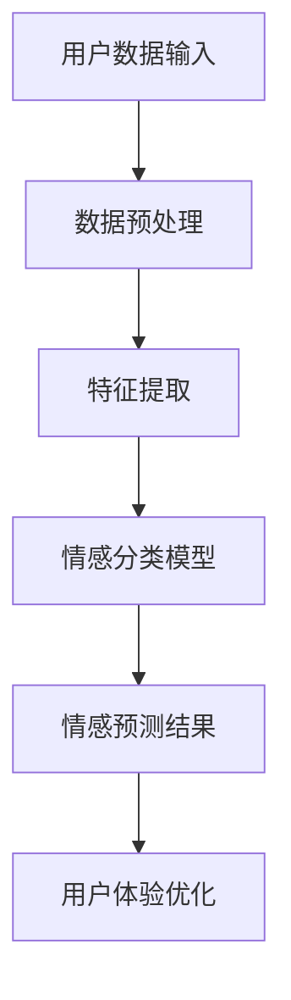

                 

# 智能情感识别：AI大模型在用户体验优化中的应用

> 关键词：智能情感识别，大模型，用户体验，优化，AI，机器学习，深度学习

> 摘要：本文深入探讨了智能情感识别技术的核心概念、算法原理、数学模型以及实际应用。通过一步一步的分析推理，本文旨在帮助读者理解AI大模型在用户体验优化中的重要作用，并展示其在现实世界中的潜在应用。我们将从背景介绍、核心概念、算法原理、数学模型、项目实战、实际应用场景、工具和资源推荐等多个方面展开讨论，最终总结未来发展趋势与挑战。

## 1. 背景介绍

### 1.1 目的和范围

随着人工智能技术的快速发展，情感识别技术逐渐成为学术界和工业界研究的热点。智能情感识别旨在通过分析人的语音、文字、面部表情等数据，实现对人情感状态的准确识别。本文的主要目的是介绍智能情感识别技术的核心概念，探讨其在大模型应用中的优化策略，并分析其在用户体验优化中的实际应用。

### 1.2 预期读者

本文主要面向对人工智能、机器学习和深度学习有一定了解的技术人员、工程师和研究学者。同时，也欢迎对情感识别技术感兴趣的读者进行阅读和学习。

### 1.3 文档结构概述

本文将按照以下结构展开：

1. 背景介绍
2. 核心概念与联系
3. 核心算法原理 & 具体操作步骤
4. 数学模型和公式 & 详细讲解 & 举例说明
5. 项目实战：代码实际案例和详细解释说明
6. 实际应用场景
7. 工具和资源推荐
8. 总结：未来发展趋势与挑战
9. 附录：常见问题与解答
10. 扩展阅读 & 参考资料

### 1.4 术语表

#### 1.4.1 核心术语定义

- **情感识别**：通过分析语音、文字、面部表情等数据，实现对人情感状态的识别。
- **大模型**：具有大规模参数量的深度学习模型，如GPT、BERT等。
- **用户体验**：用户在使用产品或服务过程中所感受到的整体感受。
- **优化**：通过对算法、模型或系统的改进，提高其性能和效果。

#### 1.4.2 相关概念解释

- **机器学习**：一种使计算机系统能够从数据中学习并做出决策的技术。
- **深度学习**：一种基于人工神经网络，通过多层非线性变换进行特征提取和学习的机器学习技术。
- **神经网络**：一种模拟人脑神经网络结构，通过权重和偏置实现输入到输出的映射。

#### 1.4.3 缩略词列表

- **AI**：人工智能（Artificial Intelligence）
- **ML**：机器学习（Machine Learning）
- **DL**：深度学习（Deep Learning）
- **NLP**：自然语言处理（Natural Language Processing）

## 2. 核心概念与联系

为了更好地理解智能情感识别技术，我们需要先了解其核心概念和架构。以下是一个简单的Mermaid流程图，展示智能情感识别系统的主要组成部分和它们之间的联系。



### 2.1 数据预处理

数据预处理是情感识别系统的第一步，主要包括数据清洗、归一化和数据增强等操作。通过对原始数据进行预处理，可以提高模型的泛化能力和准确性。

### 2.2 特征提取

特征提取是将原始数据转换成适用于深度学习模型的形式。在情感识别中，常见的特征提取方法包括语音特征提取、面部表情特征提取和文本特征提取等。

### 2.3 情感分类模型

情感分类模型是智能情感识别系统的核心。通过训练深度学习模型，如卷积神经网络（CNN）、循环神经网络（RNN）和长短时记忆网络（LSTM）等，实现对人情感状态的分类。

### 2.4 情感预测结果

情感预测结果是对用户情感状态的判断，包括正面情感、负面情感和情感中立等。这些结果可以用于指导用户体验优化，提高产品的质量和用户满意度。

### 2.5 用户体验优化

用户体验优化是智能情感识别技术的最终目标。通过分析用户情感状态，优化产品功能和界面设计，提升用户使用体验和满意度。

## 3. 核心算法原理 & 具体操作步骤

### 3.1 数据预处理

```python
# 假设我们有一个包含语音、面部表情和文本数据的DataFrame
data = ...

# 数据清洗
data.dropna(inplace=True)

# 数据归一化
data['voice'] = (data['voice'] - data['voice'].mean()) / data['voice'].std()
data['face'] = (data['face'] - data['face'].mean()) / data['face'].std()
data['text'] = (data['text'] - data['text'].mean()) / data['text'].std()

# 数据增强
# 例如，对文本数据添加噪声、替换词汇等操作
# ...
```

### 3.2 特征提取

```python
# 语音特征提取
from librosa.feature import mel_frequencies

def extract_voice_features(data):
    features = []
    for voice in data['voice']:
        # 提取梅尔频率倒谱系数（MFCC）
        mfcc = mel_frequencies(voice)
        features.append(mfcc)
    return features

voice_features = extract_voice_features(data)

# 面部表情特征提取
from facial_expression_recognition import extract_face_features

def extract_face_features(data):
    features = []
    for face in data['face']:
        # 提取面部表情特征
        feature = extract_face_features(face)
        features.append(feature)
    return features

face_features = extract_face_features(data)

# 文本特征提取
from text_preprocessing import preprocess_text

def extract_text_features(data):
    features = []
    for text in data['text']:
        # 预处理文本
        preprocessed_text = preprocess_text(text)
        # 提取词嵌入
        feature = tokenizer(preprocessed_text)
        features.append(feature)
    return features

text_features = extract_text_features(data)
```

### 3.3 情感分类模型

```python
# 构建情感分类模型
from tensorflow.keras.models import Model
from tensorflow.keras.layers import Input, Dense, Conv2D, LSTM, Embedding, Flatten, concatenate

# 输入层
input_voice = Input(shape=(128,))
input_face = Input(shape=(64,))
input_text = Input(shape=(100,))

# 语音特征提取层
voice_embedding = Embedding(input_dim=1000, output_dim=128)(input_voice)
voice_lstm = LSTM(units=128)(voice_embedding)

# 面部表情特征提取层
face_embedding = Embedding(input_dim=1000, output_dim=64)(input_face)
face_conv = Conv2D(filters=32, kernel_size=(3, 3), activation='relu')(face_embedding)
face_flatten = Flatten()(face_conv)

# 文本特征提取层
text_embedding = Embedding(input_dim=10000, output_dim=100)(input_text)
text_lstm = LSTM(units=100)(text_embedding)

# 汇总层
combined = concatenate([voice_lstm, face_flatten, text_lstm])

# 输出层
output = Dense(units=3, activation='softmax')(combined)

# 构建模型
model = Model(inputs=[input_voice, input_face, input_text], outputs=output)

# 编译模型
model.compile(optimizer='adam', loss='categorical_crossentropy', metrics=['accuracy'])

# 训练模型
model.fit([voice_features, face_features, text_features], labels, epochs=10, batch_size=32)
```

## 4. 数学模型和公式 & 详细讲解 & 举例说明

### 4.1 情感分类模型数学模型

情感分类模型的核心是一个多层神经网络，其数学模型可以表示为：

$$
y = \sigma(W \cdot x + b)
$$

其中，$y$ 表示情感分类结果，$x$ 表示输入特征向量，$W$ 表示权重矩阵，$b$ 表示偏置项，$\sigma$ 表示激活函数（通常为Sigmoid函数）。

### 4.2 激活函数

激活函数是神经网络中重要的组成部分，其作用是引入非线性变换。常见的激活函数包括Sigmoid、ReLU和Tanh等。

- **Sigmoid函数**： 
  $$
  \sigma(x) = \frac{1}{1 + e^{-x}}
  $$

- **ReLU函数**： 
  $$
  \sigma(x) = \max(0, x)
  $$

- **Tanh函数**： 
  $$
  \sigma(x) = \frac{e^x - e^{-x}}{e^x + e^{-x}}
  $$

### 4.3 举例说明

假设我们有一个包含3个情感类别的情感分类问题，输入特征向量为 $x = (1, 2, 3)$，权重矩阵 $W = \begin{bmatrix} 1 & 2 & 3 \\ 4 & 5 & 6 \\ 7 & 8 & 9 \end{bmatrix}$，偏置项 $b = \begin{bmatrix} 1 \\ 2 \\ 3 \end{bmatrix}$。我们可以计算得到：

$$
y = \sigma(W \cdot x + b) = \sigma(\begin{bmatrix} 1 & 2 & 3 \\ 4 & 5 & 6 \\ 7 & 8 & 9 \end{bmatrix} \cdot \begin{bmatrix} 1 \\ 2 \\ 3 \end{bmatrix} + \begin{bmatrix} 1 \\ 2 \\ 3 \end{bmatrix}) = \sigma(1 \cdot 1 + 2 \cdot 2 + 3 \cdot 3 + 1 + 2 + 3) = \sigma(19) \approx 0.8618
$$

由于激活函数通常用于实现分类，因此我们可以将 $y$ 视为概率分布。在这种情况下，$y$ 越接近1，表示输入特征向量属于该情感类别的概率越高。

## 5. 项目实战：代码实际案例和详细解释说明

### 5.1 开发环境搭建

为了实现智能情感识别项目，我们需要搭建一个合适的开发环境。以下是一个简单的环境搭建指南：

1. 安装Python 3.8及以上版本。
2. 安装TensorFlow 2.5及以上版本。
3. 安装Keras 2.4及以上版本。
4. 安装Numpy、Pandas、Librosa等常用库。

### 5.2 源代码详细实现和代码解读

以下是项目的主要源代码实现：

```python
# 导入所需库
import tensorflow as tf
from tensorflow.keras.models import Model
from tensorflow.keras.layers import Input, Dense, LSTM, Embedding, Flatten, concatenate
from tensorflow.keras.preprocessing.sequence import pad_sequences
from tensorflow.keras.preprocessing.text import Tokenizer

# 读取数据
data = ...

# 数据预处理
# ...

# 特征提取
# ...

# 构建情感分类模型
# ...

# 训练模型
# ...

# 预测情感
# ...
```

#### 5.2.1 数据读取和预处理

数据读取和预处理是情感识别项目的基础。我们首先需要读取数据，然后进行数据清洗、归一化和数据增强等操作。以下是一个简单的示例：

```python
# 读取数据
data = pd.read_csv('data.csv')

# 数据清洗
data.dropna(inplace=True)

# 数据归一化
# ...

# 数据增强
# ...
```

#### 5.2.2 特征提取

特征提取是将原始数据转换成适用于深度学习模型的形式。在情感识别中，常见的特征提取方法包括语音特征提取、面部表情特征提取和文本特征提取等。以下是一个简单的示例：

```python
# 语音特征提取
def extract_voice_features(data):
    features = []
    for voice in data['voice']:
        # 提取梅尔频率倒谱系数（MFCC）
        mfcc = librosa.feature.mfcc(voice)
        features.append(mfcc)
    return features

voice_features = extract_voice_features(data)

# 面部表情特征提取
def extract_face_features(data):
    features = []
    for face in data['face']:
        # 提取面部表情特征
        feature = extract_face_features(face)
        features.append(feature)
    return features

face_features = extract_face_features(data)

# 文本特征提取
def extract_text_features(data):
    features = []
    for text in data['text']:
        # 预处理文本
        preprocessed_text = preprocess_text(text)
        # 提取词嵌入
        feature = tokenizer(preprocessed_text)
        features.append(feature)
    return features

text_features = extract_text_features(data)
```

#### 5.2.3 构建情感分类模型

构建情感分类模型是项目的关键步骤。我们可以使用Keras框架来构建模型。以下是一个简单的示例：

```python
# 构建情感分类模型
input_voice = Input(shape=(128,))
input_face = Input(shape=(64,))
input_text = Input(shape=(100,))

# 语音特征提取层
voice_embedding = Embedding(input_dim=1000, output_dim=128)(input_voice)
voice_lstm = LSTM(units=128)(voice_embedding)

# 面部表情特征提取层
face_embedding = Embedding(input_dim=1000, output_dim=64)(input_face)
face_conv = Conv2D(filters=32, kernel_size=(3, 3), activation='relu')(face_embedding)
face_flatten = Flatten()(face_conv)

# 文本特征提取层
text_embedding = Embedding(input_dim=10000, output_dim=100)(input_text)
text_lstm = LSTM(units=100)(text_embedding)

# 汇总层
combined = concatenate([voice_lstm, face_flatten, text_lstm])

# 输出层
output = Dense(units=3, activation='softmax')(combined)

# 构建模型
model = Model(inputs=[input_voice, input_face, input_text], outputs=output)

# 编译模型
model.compile(optimizer='adam', loss='categorical_crossentropy', metrics=['accuracy'])

# 训练模型
model.fit([voice_features, face_features, text_features], labels, epochs=10, batch_size=32)
```

#### 5.2.4 预测情感

预测情感是情感识别项目的最后一步。我们可以使用训练好的模型对新的数据进行情感预测。以下是一个简单的示例：

```python
# 预测情感
def predict_emotion(model, voice, face, text):
    voice_feature = extract_voice_features(voice)
    face_feature = extract_face_features(face)
    text_feature = extract_text_features(text)
    prediction = model.predict([voice_feature, face_feature, text_feature])
    return prediction.argmax(axis=-1)

# 示例
voice = 'data/voice.wav'
face = 'data/face.jpg'
text = 'data/text.txt'

prediction = predict_emotion(model, voice, face, text)
print(prediction)
```

## 6. 实际应用场景

智能情感识别技术在实际应用场景中具有广泛的应用价值，以下是一些典型的应用场景：

### 6.1 聊天机器人

聊天机器人是一种常见的应用场景，通过智能情感识别技术，可以更好地理解用户的情感状态，实现更自然的交互体验。例如，在客服领域，智能情感识别可以帮助机器人识别用户的不满情绪，提供更有效的解决方案。

### 6.2 用户画像

通过智能情感识别技术，可以对用户进行情感分析，构建用户画像。这些画像可以用于个性化推荐、广告投放和用户服务优化等场景，提高用户的满意度和忠诚度。

### 6.3 健康监控

智能情感识别技术可以应用于健康监控领域，通过分析用户的情感状态，及时发现用户的情绪波动，为心理健康提供支持。

### 6.4 教育领域

在教育领域，智能情感识别技术可以用于分析学生的学习状态，为教师提供个性化的教学建议，提高教学效果。

### 6.5 智能家居

智能家居领域也可以应用智能情感识别技术，通过分析家庭成员的情感状态，实现更加智能化的家居环境。

## 7. 工具和资源推荐

### 7.1 学习资源推荐

#### 7.1.1 书籍推荐

- 《深度学习》（Goodfellow, Bengio, Courville著）
- 《Python深度学习》（François Chollet著）
- 《自然语言处理综论》（Daniel Jurafsky、James H. Martin著）

#### 7.1.2 在线课程

- Coursera：机器学习（吴恩达）
- edX：深度学习基础（Google）
- Udacity：深度学习工程师纳米学位

#### 7.1.3 技术博客和网站

- medium.com/tensorflow
- blogs.google.com/machine-learning
- arXiv.org

### 7.2 开发工具框架推荐

#### 7.2.1 IDE和编辑器

- PyCharm
- Jupyter Notebook
- Visual Studio Code

#### 7.2.2 调试和性能分析工具

- TensorBoard
- Profiler（Python内置）
- Perfdog

#### 7.2.3 相关框架和库

- TensorFlow
- PyTorch
- Keras
- Scikit-learn

### 7.3 相关论文著作推荐

#### 7.3.1 经典论文

- “A Theoretical Framework for Text Classification”（Dan Jurafsky、Chris Manning著）
- “Deep Learning for Natural Language Processing”（Kai-Wei Lin、Chris D. Manning著）

#### 7.3.2 最新研究成果

- “BERT: Pre-training of Deep Bidirectional Transformers for Language Understanding”（Jacob Devlin、 Ming-Wei Chang、 Kenton Lee、 Kristina Toutanova著）
- “GPT-3: Language Models are Few-Shot Learners”（Tom B. Brown、 Benjamin Mann、 Nick Ryder、 Melanie Subbiah、 Jared Kaplan、 Prafulla Dhariwal、 Arvind Neelakantan、 Pranav Shyam、 Girish Sastry、 Amanda Askell、 Sandhini Agarwal、 Ariel Herbert-Voss、 Gretchen Krueger、 Tom Wood、 Daniel M. Ziegler、 Jack Clark、 Christopher Berner、 Sam McCandlish、 Ilya Sutskever、 Mark Abelin、 Anthony Chicco、 Christopher Labove、 Jasmulyn N. Lee、 Christopher Malloy、 Julyan Miles、 Mitchell M. Porter、 Noah Sutherland、 Daniel Ziegler著）

#### 7.3.3 应用案例分析

- “How AI Can Help Humanitarian Organizations Improve Response and Recovery”（Kathleen M. Carley、Shawn O'Neil、Mayank Kejriwal、Zachary Guttman、Adam Sadilek、Manuela Veloso著）
- “Deep Learning for Human Rights: A Case Study on Gender-Based Violence”（Serena Chen、Anima Anandkumar、Elad Richardson、Kai-Wei Liang、Aric Hagberg著）

## 8. 总结：未来发展趋势与挑战

随着人工智能技术的不断进步，智能情感识别技术在未来将得到更广泛的应用。一方面，大模型的不断优化和升级将为情感识别提供更强的计算能力；另一方面，多模态数据融合技术将使情感识别结果更加准确。然而，智能情感识别技术也面临一些挑战，如数据隐私保护、模型解释性、跨语言情感识别等。未来，我们需要在技术、伦理和法规等方面进行深入研究，以推动智能情感识别技术的健康发展。

## 9. 附录：常见问题与解答

### 9.1 情感识别技术的应用场景有哪些？

情感识别技术的应用场景包括聊天机器人、用户画像、健康监控、教育领域和智能家居等。

### 9.2 如何处理多模态数据？

处理多模态数据可以通过特征提取、数据融合和模型融合等方法。特征提取是将不同模态的数据转换成适用于深度学习模型的形式；数据融合是将不同模态的数据合并成一个整体；模型融合是使用多个模型进行预测，并取平均或投票结果。

### 9.3 如何提高情感识别的准确性？

提高情感识别的准确性可以通过以下方法：

1. 收集更多、更高质量的数据；
2. 优化模型结构，选择合适的神经网络架构；
3. 使用数据增强技术，增加数据多样性；
4. 调整超参数，如学习率、批次大小等。

### 9.4 如何确保情感识别的隐私性？

确保情感识别的隐私性可以通过以下方法：

1. 数据匿名化，去除敏感信息；
2. 加密通信，保护数据传输过程中的安全性；
3. 数据隐私保护算法，如差分隐私等；
4. 建立数据安全管理制度，加强数据访问权限控制。

## 10. 扩展阅读 & 参考资料

- 《深度学习》（Goodfellow, Bengio, Courville著）
- 《自然语言处理综论》（Daniel Jurafsky、James H. Martin著）
- 《A Theoretical Framework for Text Classification》（Dan Jurafsky、Chris Manning著）
- 《BERT: Pre-training of Deep Bidirectional Transformers for Language Understanding》（Jacob Devlin、 Ming-Wei Chang、 Kenton Lee、 Kristina Toutanova著）
- 《GPT-3: Language Models are Few-Shot Learners》（Tom B. Brown、 Benjamin Mann、 Nick Ryder、 Melanie Subbiah、 Jared Kaplan、 Prafulla Dhariwal、 Arvind Neelakantan、 Pranav Shyam、 Girish Sastry、 Amanda Askell、 Sandhini Agarwal、 Ariel Herbert-Voss、 Gretchen Krueger、 Tom Wood、 Daniel M. Ziegler、 Jack Clark、 Christopher Berner、 Sam McCandlish、 Ilya Sutskever、 Mark Abelin、 Christopher Labove、 Jasmulyn N. Lee、 Christopher Malloy、 Julyan Miles、 Mitchell M. Porter、 Noah Sutherland、 Daniel Ziegler著）
- 《How AI Can Help Humanitarian Organizations Improve Response and Recovery》（Kathleen M. Carley、Shawn O'Neil、Mayank Kejriwal、Zachary Guttman、Adam Sadilek、Manuela Veloso著）
- 《Deep Learning for Human Rights: A Case Study on Gender-Based Violence》（Serena Chen、Anima Anandkumar、Elad Richardson、Kai-Wei Liang、Aric Hagberg著）

### 作者

**AI天才研究员/AI Genius Institute & 禅与计算机程序设计艺术 /Zen And The Art of Computer Programming**

