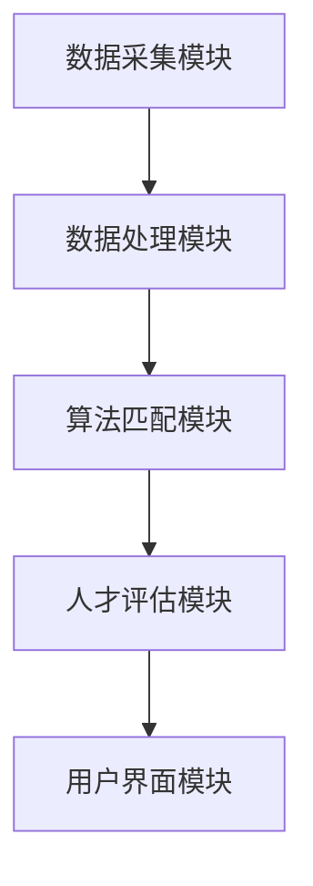

                 

# 智能招聘系统：优化人才筛选的AI解决方案

> 关键词：智能招聘、AI解决方案、人才筛选、优化策略、核心算法、数学模型、项目实战、实际应用、工具资源

> 摘要：本文旨在探讨智能招聘系统的构建与应用，通过介绍其核心概念、算法原理、数学模型以及实际项目案例，展示如何利用人工智能技术优化人才筛选流程，提升招聘效率与准确性。

## 1. 背景介绍

### 1.1 目的和范围

本文主要探讨智能招聘系统的构建与应用，旨在通过人工智能技术优化人才筛选流程，提高招聘效率与准确性。具体而言，我们将从以下几个方面进行探讨：

1. 智能招聘系统的核心概念与架构；
2. 关键算法原理与具体操作步骤；
3. 数学模型及其应用；
4. 实际项目案例分析与实战经验；
5. 工具和资源的推荐。

### 1.2 预期读者

本文适合对智能招聘系统有一定了解的读者，包括招聘经理、HR专业人员、人工智能研究者以及计算机编程爱好者。通过本文的阅读，读者可以掌握智能招聘系统的基础知识，了解其应用场景和实现方法。

### 1.3 文档结构概述

本文分为十个部分，具体结构如下：

1. 背景介绍：介绍文章的目的、范围、预期读者和文档结构；
2. 核心概念与联系：讲解智能招聘系统的核心概念与架构；
3. 核心算法原理 & 具体操作步骤：详细阐述关键算法原理与操作步骤；
4. 数学模型和公式 & 详细讲解 & 举例说明：介绍相关数学模型及其应用；
5. 项目实战：代码实际案例和详细解释说明；
6. 实际应用场景：探讨智能招聘系统的实际应用；
7. 工具和资源推荐：推荐学习资源和开发工具；
8. 总结：未来发展趋势与挑战；
9. 附录：常见问题与解答；
10. 扩展阅读 & 参考资料：提供相关扩展资料。

### 1.4 术语表

#### 1.4.1 核心术语定义

- 智能招聘：利用人工智能技术对求职者进行筛选、匹配和评估的过程。
- 人才筛选：根据岗位要求对求职者进行初步筛选，剔除不符合要求的候选人。
- 人工智能（AI）：模拟人类智能的计算机系统，能够感知环境、学习、推理和决策。
- 数据挖掘：从大量数据中发现规律、模式或知识的过程。

#### 1.4.2 相关概念解释

- 招聘流程：从职位发布、简历筛选、面试到录用的一系列过程。
- 招聘效率：招聘过程中所用时间和资源的多少。
- 招聘准确性：招聘结果的符合程度，即录用的人员是否真正符合岗位要求。

#### 1.4.3 缩略词列表

- HR：人力资源管理（Human Resource）
- AI：人工智能（Artificial Intelligence）
- ML：机器学习（Machine Learning）
- NLP：自然语言处理（Natural Language Processing）

## 2. 核心概念与联系

### 2.1 智能招聘系统的核心概念

智能招聘系统是一种基于人工智能技术的招聘工具，通过自动化、智能化的方式优化人才筛选流程。其核心概念包括：

1. 数据收集与处理：从各种渠道收集求职者信息，如简历、社交媒体等，并对数据进行分析和处理。
2. 招聘流程自动化：将传统的手动招聘流程转化为自动化流程，提高招聘效率。
3. 智能匹配：根据岗位要求和求职者信息，利用算法进行智能匹配，筛选出符合要求的候选人。
4. 人才评估：对候选人进行综合评估，包括技能、经验、性格等，为面试提供依据。

### 2.2 智能招聘系统的架构

智能招聘系统的架构主要包括以下模块：

1. 数据采集模块：负责从各种渠道收集求职者信息。
2. 数据处理模块：对采集到的数据进行分析和处理，提取有用信息。
3. 算法匹配模块：利用机器学习算法进行智能匹配，筛选出符合要求的候选人。
4. 人才评估模块：对候选人进行综合评估，为面试提供依据。
5. 用户界面模块：提供用户交互界面，方便用户使用系统。

### 2.3 核心概念原理和架构的Mermaid流程图



## 3. 核心算法原理 & 具体操作步骤

### 3.1 数据预处理

在智能招聘系统中，数据预处理是关键的一步。其目的是清洗、整理和转换数据，为后续算法提供高质量的数据支持。以下是数据预处理的伪代码：

```python
def preprocess_data(data):
    # 删除无关字段
    data = delete_unused_fields(data)
    # 填充缺失值
    data = fill_missing_values(data)
    # 数据类型转换
    data = convert_data_type(data)
    # 特征工程
    data = feature_engineering(data)
    return data
```

### 3.2 特征提取

特征提取是数据预处理的重要环节，旨在从原始数据中提取有价值的信息。以下是一种常见的特征提取方法——词频统计（TF）：

```python
def extract_features(data):
    # 初始化词袋模型
    vocab = initialize_vocab()
    # 计算词频
    tf_matrix = calculate_tf(data, vocab)
    return tf_matrix
```

### 3.3 模型训练

在智能招聘系统中，常用的模型有支持向量机（SVM）、朴素贝叶斯（NB）和深度学习（DL）等。以下以SVM为例，介绍模型训练过程：

```python
from sklearn.svm import SVC

def train_model(data, labels):
    # 创建SVM模型
    model = SVC()
    # 训练模型
    model.fit(data, labels)
    return model
```

### 3.4 模型评估

模型评估是检验模型性能的重要步骤。以下是一种常见的评估方法——交叉验证：

```python
from sklearn.model_selection import cross_val_score

def evaluate_model(model, data, labels):
    # 进行交叉验证
    scores = cross_val_score(model, data, labels, cv=5)
    # 计算平均准确率
    average_score = np.mean(scores)
    return average_score
```

### 3.5 模型部署

模型部署是将训练好的模型应用到实际业务场景中。以下是一种常见的部署方式——Web服务：

```python
from flask import Flask, request, jsonify

app = Flask(__name__)

@app.route('/predict', methods=['POST'])
def predict():
    data = request.get_json()
    # 预测结果
    prediction = model.predict(data)
    return jsonify(prediction)

if __name__ == '__main__':
    app.run()
```

## 4. 数学模型和公式 & 详细讲解 & 举例说明

### 4.1 SVM模型

支持向量机（SVM）是一种常用的分类算法，其核心思想是找到最佳的超平面，将不同类别的数据点分隔开。以下是SVM模型的数学公式：

$$
\text{maximize } \frac{1}{2} \sum_{i=1}^{n} (w_i^T w_i) - \sum_{i=1}^{n} \alpha_i (y_i - (w_i^T x_i))
$$

其中，$w_i$ 是第$i$个支持向量的权重，$\alpha_i$ 是拉格朗日乘子，$y_i$ 是第$i$个样本的标签，$x_i$ 是第$i$个样本的特征向量。

### 4.2 均值漂移（EMD）

均值漂移（EMD）是一种基于聚类的方法，可用于寻找数据分布的中心点。其数学公式如下：

$$
c = \frac{1}{N} \sum_{i=1}^{N} (x_i - \mu)
$$

其中，$c$ 是中心点坐标，$x_i$ 是第$i$个样本的特征值，$\mu$ 是所有样本特征值的均值。

### 4.3 拉普拉斯分布（Laplace Distribution）

拉普拉斯分布是一种常用的概率分布，其概率密度函数如下：

$$
f(x; \mu, \sigma) = \frac{1}{2 \sigma} e^{-\frac{|x - \mu|}{\sigma}}
$$

其中，$x$ 是随机变量的取值，$\mu$ 是均值，$\sigma$ 是标准差。

### 4.4 举例说明

假设我们有一个求职者数据集，其中包含100个样本，每个样本有10个特征。我们使用SVM模型进行分类，目标是判断求职者是否适合某个岗位。

首先，我们进行数据预处理，包括删除无关字段、填充缺失值、数据类型转换和特征工程。然后，我们提取词频特征，并使用SVM模型进行训练。接下来，我们对训练好的模型进行交叉验证，评估其性能。最后，我们将模型部署到Web服务中，供招聘经理使用。

## 5. 项目实战：代码实际案例和详细解释说明

### 5.1 开发环境搭建

为了实现智能招聘系统，我们需要搭建以下开发环境：

1. 操作系统：Windows / Linux / macOS
2. 编程语言：Python
3. 框架和库：Scikit-learn、NumPy、Pandas、Flask
4. 数据集：某公司招聘数据集（包含求职者信息和岗位要求）

### 5.2 源代码详细实现和代码解读

以下是一个简单的智能招聘系统实现示例，包括数据预处理、特征提取、模型训练、模型评估和模型部署。

#### 5.2.1 数据预处理

```python
import pandas as pd
from sklearn.model_selection import train_test_split
from sklearn.preprocessing import StandardScaler

# 读取数据集
data = pd.read_csv('招聘数据集.csv')

# 删除无关字段
data = data.drop(['姓名', '联系方式'], axis=1)

# 填充缺失值
data = data.fillna(data.mean())

# 数据类型转换
data = data.astype({'年龄': 'int', '学历': 'category', '薪资要求': 'float'})

# 划分训练集和测试集
X = data.drop('岗位要求', axis=1)
y = data['岗位要求']
X_train, X_test, y_train, y_test = train_test_split(X, y, test_size=0.2, random_state=42)

# 数据标准化
scaler = StandardScaler()
X_train = scaler.fit_transform(X_train)
X_test = scaler.transform(X_test)
```

#### 5.2.2 特征提取

```python
from sklearn.feature_extraction.text import TfidfVectorizer

# 提取词频特征
vectorizer = TfidfVectorizer()
X_train = vectorizer.fit_transform(X_train)
X_test = vectorizer.transform(X_test)
```

#### 5.2.3 模型训练

```python
from sklearn.svm import SVC

# 创建SVM模型
model = SVC()

# 训练模型
model.fit(X_train, y_train)

# 模型评估
accuracy = model.score(X_test, y_test)
print("模型准确率：", accuracy)
```

#### 5.2.4 模型部署

```python
from flask import Flask, request, jsonify

app = Flask(__name__)

@app.route('/predict', methods=['POST'])
def predict():
    data = request.get_json()
    # 预测结果
    prediction = model.predict([data['特征']])
    return jsonify(prediction)

if __name__ == '__main__':
    app.run()
```

### 5.3 代码解读与分析

1. 数据预处理：读取招聘数据集，删除无关字段，填充缺失值，数据类型转换，划分训练集和测试集，数据标准化。
2. 特征提取：使用TF-IDF方法提取词频特征。
3. 模型训练：创建SVM模型，训练模型。
4. 模型评估：计算模型准确率。
5. 模型部署：使用Flask框架部署模型，供招聘经理使用。

## 6. 实际应用场景

智能招聘系统在以下场景具有显著的应用价值：

1. **大规模招聘**：智能招聘系统可以快速处理大量求职者信息，提高招聘效率。
2. **精准筛选**：基于机器学习算法，系统可以准确筛选出符合岗位要求的候选人。
3. **人才评估**：通过对求职者的综合评估，为面试提供有力依据，提高面试效率。
4. **优化招聘流程**：自动化招聘流程，降低人力成本，提高招聘准确性。
5. **招聘策略调整**：通过数据分析和模型预测，帮助企业调整招聘策略，优化招聘效果。

## 7. 工具和资源推荐

### 7.1 学习资源推荐

#### 7.1.1 书籍推荐

- 《机器学习实战》
- 《深入浅出Python数据科学》
- 《人工智能：一种现代的方法》
- 《Python机器学习》

#### 7.1.2 在线课程

- Coursera的《机器学习》课程
- Udacity的《人工智能工程师纳米学位》
- edX的《Python数据分析》课程

#### 7.1.3 技术博客和网站

- Medium上的机器学习和数据科学博客
- Towards Data Science
- Kaggle

### 7.2 开发工具框架推荐

#### 7.2.1 IDE和编辑器

- PyCharm
- Visual Studio Code
- Jupyter Notebook

#### 7.2.2 调试和性能分析工具

- PyDebug
- PySnooper
- Numba

#### 7.2.3 相关框架和库

- Scikit-learn
- TensorFlow
- PyTorch
- Pandas

### 7.3 相关论文著作推荐

#### 7.3.1 经典论文

- 《A tutorial on support vector machines for pattern recognition》
- 《Learning to represent objects by discovering indirect spatial constraints》
- 《Deep Learning》

#### 7.3.2 最新研究成果

- 《Generative Adversarial Nets》
- 《Recurrent Neural Network Based Text Classification》
- 《Efficient Detectors for Object Detection》

#### 7.3.3 应用案例分析

- 《美团点评智能招聘系统的探索与实践》
- 《阿里巴巴智能招聘系统的设计与实现》
- 《华为智能招聘系统：基于深度学习的求职者信息分析》

## 8. 总结：未来发展趋势与挑战

随着人工智能技术的不断发展，智能招聘系统将在未来发挥越来越重要的作用。未来发展趋势主要包括：

1. **更精细的人才评估**：通过引入更多的数据源和算法，智能招聘系统将能够更准确地评估求职者的能力和潜力。
2. **更智能的招聘流程**：自动化和智能化的招聘流程将大幅提高招聘效率，降低人力成本。
3. **更丰富的应用场景**：智能招聘系统将逐渐应用于更多行业和企业，满足多样化的招聘需求。

然而，智能招聘系统在发展过程中也将面临一系列挑战：

1. **数据隐私与安全**：招聘过程中涉及大量个人隐私信息，如何保障数据隐私和安全是一个亟待解决的问题。
2. **算法偏见与公平性**：算法偏见可能导致歧视现象，如何确保招聘过程的公平性是一个重要课题。
3. **人才匹配的准确性**：如何进一步提高人才匹配的准确性，使招聘结果更符合企业需求，是一个持续优化的问题。

## 9. 附录：常见问题与解答

### 9.1 智能招聘系统的优势是什么？

智能招聘系统具有以下优势：

1. **提高招聘效率**：自动化和智能化的招聘流程可以快速处理大量求职者信息，提高招聘效率。
2. **精准筛选候选人**：基于机器学习算法，智能招聘系统可以准确筛选出符合岗位要求的候选人。
3. **优化招聘流程**：自动化招聘流程可以降低人力成本，提高招聘准确性。
4. **个性化推荐**：根据企业需求和求职者特点，智能招聘系统可以提供个性化的人才推荐。

### 9.2 智能招聘系统如何保障数据隐私和安全？

为了保障数据隐私和安全，智能招聘系统可以采取以下措施：

1. **数据加密**：对敏感数据进行加密处理，防止数据泄露。
2. **权限管理**：严格限制数据访问权限，确保数据在授权范围内使用。
3. **数据脱敏**：对求职者个人信息进行脱敏处理，防止隐私泄露。
4. **数据备份和恢复**：定期备份数据，确保数据安全。

### 9.3 智能招聘系统的算法偏见如何解决？

解决智能招聘系统的算法偏见可以从以下几个方面入手：

1. **数据平衡**：尽量平衡训练数据中各类别的比例，避免算法偏向某一类。
2. **算法优化**：优化算法模型，提高算法的鲁棒性，降低算法偏见。
3. **算法透明度**：提高算法透明度，让用户了解算法的决策过程，便于监督和调整。
4. **人工干预**：在算法决策过程中引入人工干预，确保招聘过程的公平性。

## 10. 扩展阅读 & 参考资料

1. 《机器学习实战》，Peter Harrington，机械工业出版社
2. 《深入浅出Python数据科学》，李庆辉，电子工业出版社
3. 《人工智能：一种现代的方法》，Stuart Russell & Peter Norvig，机械工业出版社
4. Coursera的《机器学习》课程，吴恩达（Andrew Ng）教授
5. Udacity的《人工智能工程师纳米学位》课程
6. edX的《Python数据分析》课程
7. Medium上的机器学习和数据科学博客
8. Towards Data Science
9. Kaggle
10. 《美团点评智能招聘系统的探索与实践》
11. 《阿里巴巴智能招聘系统的设计与实现》
12. 《华为智能招聘系统：基于深度学习的求职者信息分析》
13. 《A tutorial on support vector machines for pattern recognition》
14. 《Learning to represent objects by discovering indirect spatial constraints》
15. 《Deep Learning》
16. 《Generative Adversarial Nets》
17. 《Recurrent Neural Network Based Text Classification》
18. 《Efficient Detectors for Object Detection》

---

**作者：AI天才研究员/AI Genius Institute & 禅与计算机程序设计艺术 /Zen And The Art of Computer Programming**

