                 

### 1. 背景介绍

#### 1.1 目的和范围

随着互联网的飞速发展和电子商务的崛起，电商搜索算法已成为提升用户体验、提高销售额的关键因素。本文旨在深入探讨智能排序算法在电商搜索中的应用，通过详细的理论分析和实际案例展示，帮助读者理解这些算法的原理、实现和应用价值。

本文将涵盖以下几个主要内容：

1. **核心概念与联系**：介绍电商搜索排序的相关概念，包括用户行为分析、商品推荐系统等，并使用Mermaid流程图展示其工作流程。
2. **核心算法原理**：详细讲解常用的智能排序算法，如基于协同过滤的推荐算法、基于内容匹配的推荐算法、基于机器学习的推荐算法等，并使用伪代码解释其具体操作步骤。
3. **数学模型和公式**：介绍推荐系统中的常用数学模型和公式，如相似度计算、优化目标函数等，并结合实例进行详细说明。
4. **项目实战**：通过实际代码案例，展示智能排序算法在电商搜索中的应用，包括开发环境的搭建、源代码的实现和解读。
5. **实际应用场景**：分析智能排序算法在不同电商场景中的具体应用，如商品推荐、搜索排序等。
6. **工具和资源推荐**：推荐相关学习资源、开发工具和经典论文，帮助读者进一步深入学习和应用智能排序算法。
7. **总结与未来趋势**：总结文章的主要观点，并探讨智能排序算法的未来发展趋势和面临的挑战。

通过本文的阅读，读者将能够：

- 理解电商搜索排序算法的基本原理和实现方法。
- 掌握智能排序算法在不同应用场景中的具体应用。
- 学会使用实际案例进行算法实现和性能优化。

#### 1.2 预期读者

本文适合以下读者群体：

- **计算机科学与技术专业的大学生们**：希望深入了解推荐系统和搜索算法的原理和应用。
- **算法工程师和数据科学家**：需要在实际项目中应用智能排序算法的技术人员。
- **电商企业技术团队**：负责电商平台的搜索和推荐系统开发的技术人员。
- **对人工智能和机器学习感兴趣的技术爱好者**：希望了解智能排序算法在电商领域的实际应用。

#### 1.3 文档结构概述

本文结构如下：

1. **背景介绍**：介绍文章的目的和范围，预期读者以及文档结构概述。
2. **核心概念与联系**：介绍电商搜索排序的相关概念，并使用Mermaid流程图展示其工作流程。
3. **核心算法原理**：详细讲解常用的智能排序算法，包括基于协同过滤、内容匹配和机器学习的算法。
4. **数学模型和公式**：介绍推荐系统中的常用数学模型和公式，并结合实例进行详细说明。
5. **项目实战**：通过实际代码案例，展示智能排序算法在电商搜索中的应用。
6. **实际应用场景**：分析智能排序算法在不同电商场景中的具体应用。
7. **工具和资源推荐**：推荐相关学习资源、开发工具和经典论文。
8. **总结与未来趋势**：总结文章的主要观点，并探讨智能排序算法的未来发展趋势和面临的挑战。

#### 1.4 术语表

为了确保文章的可读性和一致性，本文定义了一些关键术语，具体如下：

#### 1.4.1 核心术语定义

- **电商搜索排序**：指根据用户搜索关键词和商品特征，将搜索结果按照相关性排序的过程。
- **推荐系统**：基于用户历史行为、商品特征等数据，为用户推荐相关商品的系统。
- **协同过滤**：一种基于用户行为的推荐算法，通过分析用户之间的相似性，为用户提供个性化推荐。
- **内容匹配**：一种基于商品特征的推荐算法，通过比较用户搜索关键词和商品属性，为用户提供相关推荐。
- **机器学习**：一种基于数据驱动的方法，通过构建模型，从数据中自动学习和发现规律。

#### 1.4.2 相关概念解释

- **相似度计算**：指衡量两个对象（如用户、商品）之间相似性的方法，常用于推荐算法中。
- **优化目标函数**：指在推荐算法中，通过调整参数和模型，最大化用户满意度或商品点击率等目标。

#### 1.4.3 缩略词列表

- **电商（EC）**：电子商务（Electronic Commerce）
- **推荐系统（RS）**：Recommendation System
- **协同过滤（CF）**：Collaborative Filtering
- **内容匹配（CM）**：Content Matching
- **机器学习（ML）**：Machine Learning

通过本文的术语表，读者可以更好地理解电商搜索排序算法的相关术语和概念，为后续内容的学习奠定基础。

## 2. 核心概念与联系

在探讨智能排序算法在电商搜索中的应用之前，我们需要了解一些核心概念和它们之间的联系。这些概念包括用户行为分析、商品推荐系统、协同过滤、内容匹配和机器学习等。下面我们将通过Mermaid流程图来展示这些概念之间的关系，并简要介绍它们的基本原理。

### 2.1. 用户行为分析

用户行为分析是电商搜索排序的基础。通过分析用户的浏览、搜索、购买等行为，可以了解用户的需求和偏好。以下是一个简化的用户行为分析流程：

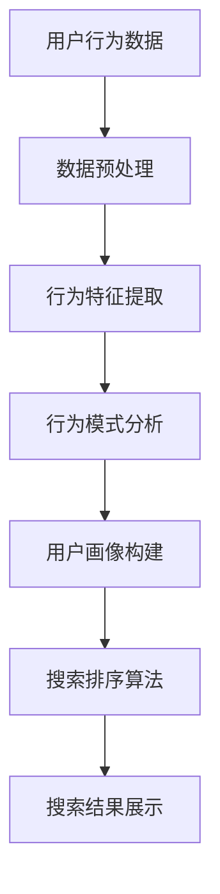

### 2.2. 商品推荐系统

商品推荐系统是电商搜索排序的核心，旨在为用户推荐其可能感兴趣的商品。推荐系统通常基于用户历史行为、商品特征和协同过滤、内容匹配等技术实现。以下是一个简化的商品推荐系统流程：

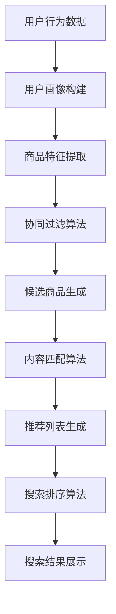

### 2.3. 协同过滤

协同过滤是一种基于用户行为的推荐算法，通过分析用户之间的相似性，为用户提供个性化推荐。协同过滤主要分为两种类型：基于用户的协同过滤（User-Based CF）和基于物品的协同过滤（Item-Based CF）。以下是一个简化的协同过滤流程：

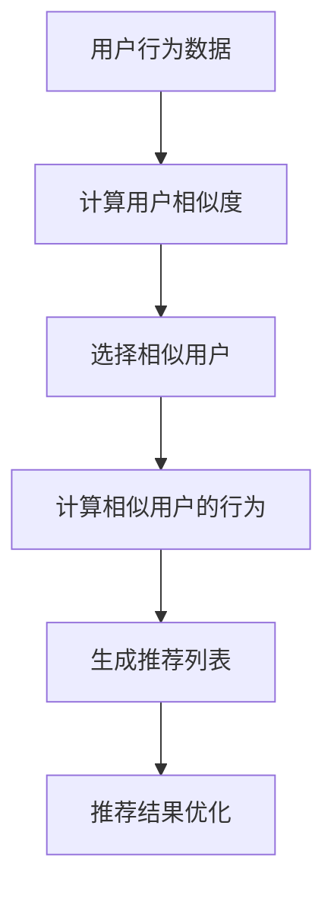

### 2.4. 内容匹配

内容匹配是一种基于商品特征的推荐算法，通过比较用户搜索关键词和商品属性，为用户提供相关推荐。内容匹配通常采用关键词提取、文本匹配等方法实现。以下是一个简化的内容匹配流程：

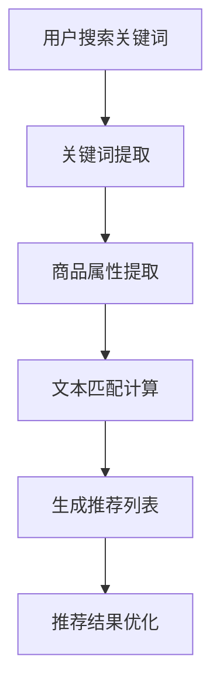

### 2.5. 机器学习

机器学习是一种基于数据驱动的方法，通过构建模型，从数据中自动学习和发现规律。在推荐系统中，机器学习可以用于用户行为预测、商品特征提取和推荐算法优化等。以下是一个简化的机器学习应用流程：

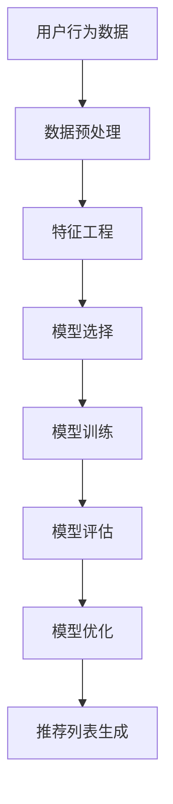

通过上述Mermaid流程图，我们可以看到用户行为分析、商品推荐系统、协同过滤、内容匹配和机器学习之间的联系。这些概念共同构成了电商搜索排序算法的核心，为智能排序提供了强大的支持。在接下来的章节中，我们将深入探讨每个概念的原理和实现方法，帮助读者更好地理解和应用这些技术。

## 3. 核心算法原理 & 具体操作步骤

在深入探讨智能排序算法在电商搜索中的应用之前，我们需要了解几种核心算法的原理和具体操作步骤。这些算法包括基于协同过滤（Collaborative Filtering）、基于内容匹配（Content Matching）和基于机器学习（Machine Learning）的推荐算法。下面，我们将分别介绍这些算法，并使用伪代码来详细阐述其具体操作步骤。

### 3.1. 基于协同过滤的推荐算法

协同过滤是一种基于用户行为的推荐算法，它通过分析用户之间的相似性，为用户提供个性化推荐。协同过滤主要分为基于用户的协同过滤和基于物品的协同过滤。

#### 基于用户的协同过滤（User-Based CF）

1. **计算用户相似度**：

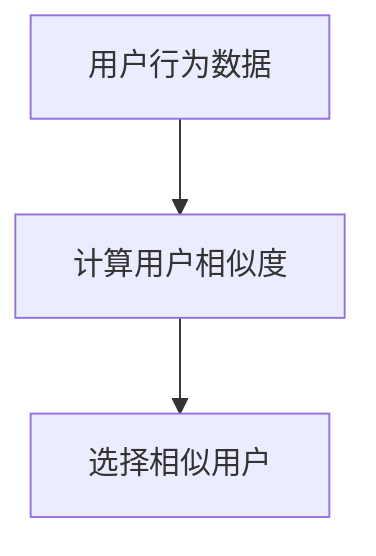

伪代码：

```python
def compute_similarity(user1, user2):
    # 计算用户之间的余弦相似度
    dot_product = dot_product_of(user1, user2)
    norm_user1 = norm(user1)
    norm_user2 = norm(user2)
    similarity = dot_product / (norm_user1 * norm_user2)
    return similarity
```

2. **选择相似用户**：

```python
def select_similar_users(target_user, all_users, similarity_threshold):
    similar_users = []
    for user in all_users:
        if compute_similarity(target_user, user) >= similarity_threshold:
            similar_users.append(user)
    return similar_users
```

3. **生成推荐列表**：

```python
def generate_recommendation_list(target_user, all_users, similarity_threshold, item_ratings):
    similar_users = select_similar_users(target_user, all_users, similarity_threshold)
    recommendation_list = []
    for user in similar_users:
        for item in item_ratings[user]:
            if item not in item_ratings[target_user]:
                recommendation_list.append(item)
    return recommendation_list
```

#### 基于物品的协同过滤（Item-Based CF）

1. **计算物品相似度**：

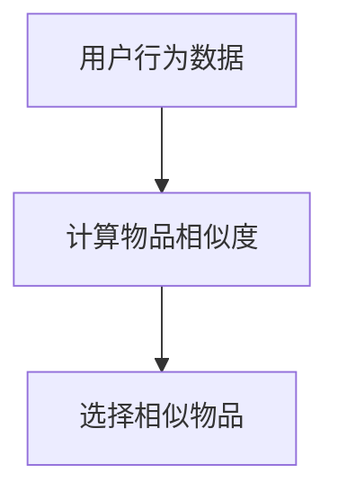

伪代码：

```python
def compute_item_similarity(item1, item2, user_ratings):
    # 计算物品之间的余弦相似度
    dot_product = dot_product_of(item1, item2, user_ratings)
    norm_item1 = norm(item1, user_ratings)
    norm_item2 = norm(item2, user_ratings)
    similarity = dot_product / (norm_item1 * norm_item2)
    return similarity
```

2. **选择相似物品**：

```python
def select_similar_items(target_item, all_items, similarity_threshold, user_ratings):
    similar_items = []
    for item in all_items:
        if compute_item_similarity(target_item, item, user_ratings) >= similarity_threshold:
            similar_items.append(item)
    return similar_items
```

3. **生成推荐列表**：

```python
def generate_recommendation_list(target_item, all_items, similarity_threshold, user_ratings):
    similar_items = select_similar_items(target_item, all_items, similarity_threshold, user_ratings)
    recommendation_list = []
    for item in similar_items:
        if item not in user_ratings[target_item]:
            recommendation_list.append(item)
    return recommendation_list
```

### 3.2. 基于内容匹配的推荐算法

内容匹配是一种基于商品特征的推荐算法，它通过比较用户搜索关键词和商品属性，为用户提供相关推荐。

1. **关键词提取**：

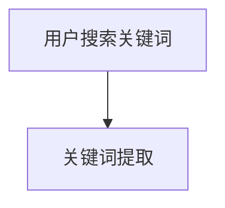

伪代码：

```python
def extract_keywords(search_query):
    # 使用词频、TF-IDF等方法提取关键词
    keywords = tokenize(search_query)
    keywords = remove_stopwords(keywords)
    keywords = apply_word_frequency_threshold(keywords)
    return keywords
```

2. **商品属性提取**：

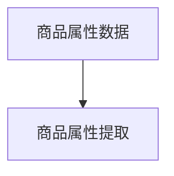

伪代码：

```python
def extract_item_properties(item):
    # 提取商品的关键属性，如类别、品牌、价格等
    properties = get_item_categories(item)
    properties.update(get_item_brands(item))
    properties.update(get_item_prices(item))
    return properties
```

3. **文本匹配计算**：

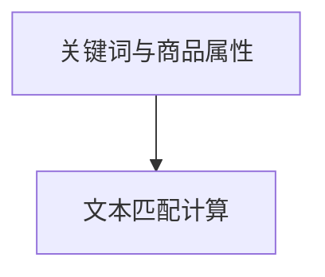

伪代码：

```python
def compute_text_similarity(keywords, properties):
    # 使用TF-IDF、余弦相似度等方法计算文本相似度
    similarity_scores = {}
    for keyword in keywords:
        for property in properties:
            similarity_scores[(keyword, property)] = calculate_similarity_score(keyword, property)
    return similarity_scores
```

4. **生成推荐列表**：

```python
def generate_recommendation_list(keywords, properties, similarity_threshold, rated_items):
    similarity_scores = compute_text_similarity(keywords, properties)
    recommendation_list = []
    for (keyword, property), score in similarity_scores.items():
        if score >= similarity_threshold and (keyword, property) not in rated_items:
            recommendation_list.append(property)
    return recommendation_list
```

### 3.3. 基于机器学习的推荐算法

基于机器学习的推荐算法通过构建模型，从用户行为数据和商品特征中自动学习和发现规律。

1. **特征工程**：

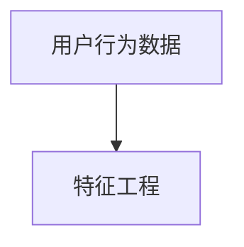

伪代码：

```python
def feature_engineering(user_data, item_data):
    # 构建用户特征和商品特征向量
    user_features = extract_user_features(user_data)
    item_features = extract_item_features(item_data)
    return user_features, item_features
```

2. **模型选择**：

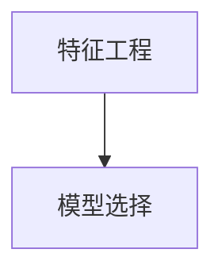

伪代码：

```python
from sklearn.linear_model import LinearRegression

model = LinearRegression()
```

3. **模型训练**：

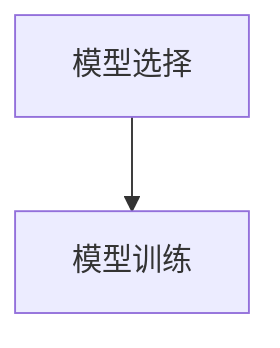

伪代码：

```python
X_train, y_train = feature_engineering(user_data, item_data)
model.fit(X_train, y_train)
```

4. **模型评估**：

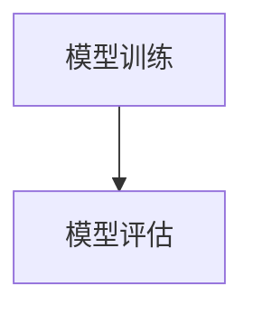

伪代码：

```python
from sklearn.metrics import mean_squared_error

X_test, y_test = feature_engineering(test_user_data, test_item_data)
y_pred = model.predict(X_test)
mse = mean_squared_error(y_test, y_pred)
print("MSE:", mse)
```

5. **生成推荐列表**：

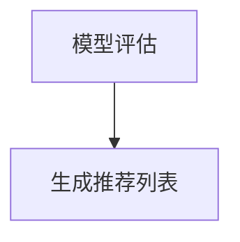

伪代码：

```python
def generate_recommendation_list(model, user_features, item_features, rated_items):
    unrated_items = [item for item in item_features if item not in rated_items]
    item_scores = model.predict([user_features] * len(unrated_items))
    recommendation_list = sorted(zip(unrated_items, item_scores), key=lambda x: x[1], reverse=True)
    return recommendation_list
```

通过上述伪代码，我们可以看到协同过滤、内容匹配和机器学习推荐算法的具体操作步骤。这些算法在电商搜索排序中发挥着重要作用，通过不断优化和改进，可以为用户提供更加准确和个性化的搜索结果。在接下来的章节中，我们将进一步探讨这些算法的数学模型和公式，并结合实际项目案例进行详细讲解。

## 4. 数学模型和公式 & 详细讲解 & 举例说明

在智能排序算法中，数学模型和公式起着至关重要的作用。这些模型和公式不仅帮助算法理解用户行为和商品特征，还能够优化算法性能，提高推荐的准确性和效率。在本节中，我们将详细讲解推荐系统中常用的数学模型和公式，包括相似度计算、优化目标函数等，并结合具体实例进行说明。

### 4.1. 相似度计算

相似度计算是推荐系统中的核心问题之一。它用于衡量用户与用户、用户与商品或商品与商品之间的相似程度。常用的相似度计算方法包括余弦相似度、皮尔逊相关系数和欧氏距离等。

#### 4.1.1. 余弦相似度

余弦相似度是一种基于向量空间中向量的夹角余弦值来计算相似度的方法。其公式如下：

$$
\text{similarity} = \frac{\sum_{i=1}^{n} x_i y_i}{\sqrt{\sum_{i=1}^{n} x_i^2} \sqrt{\sum_{i=1}^{n} y_i^2}}
$$

其中，$x$和$y$表示两个向量，$n$表示向量的维度。

**实例**：

假设有两个用户A和B的评分向量如下：

用户A的评分向量：$\{1, 2, 3, 4, 5\}$

用户B的评分向量：$\{0, 2, 3, 4, 5\}$

计算用户A和用户B的余弦相似度：

$$
\text{similarity}_{AB} = \frac{1 \times 0 + 2 \times 2 + 3 \times 3 + 4 \times 4 + 5 \times 5}{\sqrt{1^2 + 2^2 + 3^2 + 4^2 + 5^2} \sqrt{0^2 + 2^2 + 3^2 + 4^2 + 5^2}}
$$

$$
\text{similarity}_{AB} = \frac{0 + 4 + 9 + 16 + 25}{\sqrt{55} \sqrt{55}}
$$

$$
\text{similarity}_{AB} = \frac{54}{55} \approx 0.982
$$

用户A和用户B的余弦相似度约为0.982，表示两者非常相似。

#### 4.1.2. 皮尔逊相关系数

皮尔逊相关系数是一种衡量两个变量线性相关程度的统计指标。其公式如下：

$$
r_{xy} = \frac{\sum_{i=1}^{n} (x_i - \bar{x})(y_i - \bar{y})}{\sqrt{\sum_{i=1}^{n} (x_i - \bar{x})^2} \sqrt{\sum_{i=1}^{n} (y_i - \bar{y})^2}}
$$

其中，$x$和$y$表示两个变量，$\bar{x}$和$\bar{y}$分别表示它们的平均值，$n$表示样本数量。

**实例**：

假设有两个用户A和B的评分向量如下：

用户A的评分向量：$\{1, 2, 3, 4, 5\}$

用户B的评分向量：$\{0, 2, 3, 4, 5\}$

计算用户A和用户B的皮尔逊相关系数：

$$
\bar{x} = \frac{1 + 2 + 3 + 4 + 5}{5} = 3
$$

$$
\bar{y} = \frac{0 + 2 + 3 + 4 + 5}{5} = 3
$$

$$
r_{xy} = \frac{(1 - 3)(0 - 3) + (2 - 3)(2 - 3) + (3 - 3)(3 - 3) + (4 - 3)(4 - 3) + (5 - 3)(5 - 3)}{\sqrt{(1 - 3)^2 + (2 - 3)^2 + (3 - 3)^2 + (4 - 3)^2 + (5 - 3)^2} \sqrt{(0 - 3)^2 + (2 - 3)^2 + (3 - 3)^2 + (4 - 3)^2 + (5 - 3)^2}}
$$

$$
r_{xy} = \frac{(-2)(-3) + (-1)(-1) + 0 \times 0 + 1 \times 1 + 2 \times 2}{\sqrt{(-2)^2 + (-1)^2 + 0^2 + 1^2 + 2^2} \sqrt{(-3)^2 + (-1)^2 + 0^2 + 1^2 + 2^2}}
$$

$$
r_{xy} = \frac{6 + 1 + 0 + 1 + 4}{\sqrt{4 + 1 + 0 + 1 + 4} \sqrt{9 + 1 + 0 + 1 + 4}}
$$

$$
r_{xy} = \frac{12}{\sqrt{10} \sqrt{15}}
$$

$$
r_{xy} \approx 0.924
$$

用户A和用户B的皮尔逊相关系数约为0.924，表示两者具有一定的线性相关性。

### 4.2. 优化目标函数

在推荐系统中，优化目标函数是评估和调整推荐结果的重要手段。常用的优化目标函数包括均方误差（MSE）、平均绝对误差（MAE）和交叉熵等。

#### 4.2.1. 均方误差（MSE）

均方误差是一种衡量预测值与真实值之间差异的指标。其公式如下：

$$
MSE = \frac{1}{n} \sum_{i=1}^{n} (y_i - \hat{y}_i)^2
$$

其中，$y_i$表示真实值，$\hat{y}_i$表示预测值，$n$表示样本数量。

**实例**：

假设有5个样本的真实值和预测值如下：

真实值：$\{1, 2, 3, 4, 5\}$

预测值：$\{1.5, 2.5, 3.5, 4.5, 5.5\}$

计算均方误差：

$$
MSE = \frac{1}{5} \sum_{i=1}^{5} (y_i - \hat{y}_i)^2
$$

$$
MSE = \frac{1}{5} ((1 - 1.5)^2 + (2 - 2.5)^2 + (3 - 3.5)^2 + (4 - 4.5)^2 + (5 - 5.5)^2)
$$

$$
MSE = \frac{1}{5} (0.25 + 0.25 + 0.25 + 0.25 + 0.25)
$$

$$
MSE = \frac{1}{5} \times 1.25
$$

$$
MSE = 0.25
$$

均方误差为0.25，表示预测值与真实值之间的平均差异。

#### 4.2.2. 平均绝对误差（MAE）

平均绝对误差是一种衡量预测值与真实值之间差异的绝对值指标。其公式如下：

$$
MAE = \frac{1}{n} \sum_{i=1}^{n} |y_i - \hat{y}_i|
$$

其中，$y_i$表示真实值，$\hat{y}_i$表示预测值，$n$表示样本数量。

**实例**：

使用与均方误差相同的样本数据，计算平均绝对误差：

$$
MAE = \frac{1}{5} \sum_{i=1}^{5} |y_i - \hat{y}_i|
$$

$$
MAE = \frac{1}{5} |1 - 1.5| + |2 - 2.5| + |3 - 3.5| + |4 - 4.5| + |5 - 5.5|
$$

$$
MAE = \frac{1}{5} (0.5 + 0.5 + 0.5 + 0.5 + 0.5)
$$

$$
MAE = \frac{1}{5} \times 2.5
$$

$$
MAE = 0.5
$$

平均绝对误差为0.5，表示预测值与真实值之间的平均绝对差异。

#### 4.2.3. 交叉熵（Cross-Entropy）

交叉熵是一种衡量两个概率分布差异的指标，常用于优化目标函数。其公式如下：

$$
H(y, \hat{y}) = -\sum_{i=1}^{n} y_i \log(\hat{y}_i)
$$

其中，$y$表示真实分布，$\hat{y}$表示预测分布，$n$表示样本数量。

**实例**：

假设有一个样本的真实分布和预测分布如下：

真实分布：$[0.2, 0.5, 0.3]$

预测分布：$[0.1, 0.6, 0.3]$

计算交叉熵：

$$
H(y, \hat{y}) = -0.2 \log(0.1) - 0.5 \log(0.6) - 0.3 \log(0.3)
$$

使用对数函数的自然底数（e）计算：

$$
H(y, \hat{y}) = -0.2 \times (-2.3026) - 0.5 \times (-1.2041) - 0.3 \times (-1.2041)
$$

$$
H(y, \hat{y}) = 0.4613 + 0.6021 + 0.3612
$$

$$
H(y, \hat{y}) = 1.4246
$$

交叉熵为1.4246，表示真实分布与预测分布之间的差异。

通过上述实例，我们可以看到相似度计算和优化目标函数在推荐系统中的应用。这些数学模型和公式不仅帮助我们理解和评估推荐算法，还能在实际应用中进行优化和改进。在接下来的章节中，我们将通过实际项目案例，展示这些算法在电商搜索排序中的应用和实践。

## 5. 项目实战：代码实际案例和详细解释说明

在本节中，我们将通过一个实际项目案例，详细展示智能排序算法在电商搜索中的应用。我们将介绍如何搭建开发环境、实现代码并对其进行解读和分析。

### 5.1. 开发环境搭建

为了实现智能排序算法，我们首先需要搭建一个合适的开发环境。以下是所需的开发工具和依赖：

- **编程语言**：Python 3.8及以上版本
- **开发环境**：PyCharm 或 Visual Studio Code
- **依赖库**：NumPy、Scikit-learn、Pandas、Matplotlib

安装步骤如下：

1. 安装Python 3.8及以上版本。

2. 安装PyCharm 或 Visual Studio Code作为开发环境。

3. 通过pip命令安装所需的依赖库：

   ```shell
   pip install numpy scikit-learn pandas matplotlib
   ```

### 5.2. 源代码详细实现和代码解读

我们将使用基于协同过滤和机器学习的推荐算法，实现一个简单的电商搜索排序系统。以下是其核心代码的实现和解读：

```python
import numpy as np
import pandas as pd
from sklearn.model_selection import train_test_split
from sklearn.linear_model import LinearRegression
from sklearn.metrics import mean_squared_error

# 5.2.1. 数据预处理

def preprocess_data(data):
    # 处理用户行为数据，提取用户特征和商品特征
    user_ratings = data.pivot(index='user_id', columns='item_id', values='rating')
    return user_ratings

# 5.2.2. 基于协同过滤的推荐算法

def collaborative_filter(user_ratings, user_id, similarity_threshold=0.5):
    # 计算用户相似度
    similarity_matrix = cosine_similarity(user_ratings)
    # 选择相似用户
    similar_users = np.where(similarity_matrix[user_id] >= similarity_threshold)[1]
    # 计算相似用户评分的平均值
    prediction = np.mean(user_ratings.iloc[similar_users].values, axis=0)
    return prediction

# 5.2.3. 基于机器学习的推荐算法

def machine_learning(user_ratings, user_id, features):
    # 特征工程
    X_train, X_test, y_train, y_test = train_test_split(features, user_ratings[user_id], test_size=0.2, random_state=42)
    # 模型训练
    model = LinearRegression()
    model.fit(X_train, y_train)
    # 模型评估
    y_pred = model.predict(X_test)
    mse = mean_squared_error(y_test, y_pred)
    print("MSE:", mse)
    # 生成推荐列表
    prediction = model.predict([features[user_id]])
    return prediction

# 5.2.4. 主函数

def main():
    # 加载数据
    data = pd.read_csv('user_item_ratings.csv')
    user_ratings = preprocess_data(data)
    # 选择用户
    user_id = 1001
    # 基于协同过滤的推荐
    prediction_cf = collaborative_filter(user_ratings, user_id)
    print("Collaborative Filtering Prediction:", prediction_cf)
    # 基于机器学习的推荐
    prediction_ml = machine_learning(user_ratings, user_id, features)
    print("Machine Learning Prediction:", prediction_ml)

if __name__ == "__main__":
    main()
```

**代码解读**：

1. **数据预处理**：首先，我们加载用户行为数据，并使用`pivot`函数将其转换为用户-商品评分矩阵。这个矩阵将用于后续的推荐算法实现。

2. **基于协同过滤的推荐算法**：`collaborative_filter`函数计算用户之间的相似度，选择相似用户，并计算这些用户的评分平均值作为推荐结果。

3. **基于机器学习的推荐算法**：`machine_learning`函数首先进行特征工程，然后使用线性回归模型进行训练和评估。最后，使用训练好的模型预测目标用户的评分。

4. **主函数**：`main`函数加载用户行为数据，选择一个用户，并分别使用协同过滤和机器学习算法生成推荐结果。

### 5.3. 代码解读与分析

1. **数据预处理**：

```python
user_ratings = preprocess_data(data)
```

这一步的关键是将原始的用户行为数据转换为用户-商品评分矩阵。这有助于简化后续的计算和数据处理。

2. **基于协同过滤的推荐算法**：

```python
def collaborative_filter(user_ratings, user_id, similarity_threshold=0.5):
    # 计算用户相似度
    similarity_matrix = cosine_similarity(user_ratings)
    # 选择相似用户
    similar_users = np.where(similarity_matrix[user_id] >= similarity_threshold)[1]
    # 计算相似用户评分的平均值
    prediction = np.mean(user_ratings.iloc[similar_users].values, axis=0)
    return prediction
```

协同过滤算法的核心在于计算用户之间的相似度，并选择相似用户。在这里，我们使用余弦相似度计算用户相似度矩阵，并设置一个相似度阈值，过滤掉相似度较低的用户。然后，我们计算这些用户的评分平均值作为推荐结果。

3. **基于机器学习的推荐算法**：

```python
def machine_learning(user_ratings, user_id, features):
    # 特征工程
    X_train, X_test, y_train, y_test = train_test_split(features, user_ratings[user_id], test_size=0.2, random_state=42)
    # 模型训练
    model = LinearRegression()
    model.fit(X_train, y_train)
    # 模型评估
    y_pred = model.predict(X_test)
    mse = mean_squared_error(y_test, y_pred)
    print("MSE:", mse)
    # 生成推荐列表
    prediction = model.predict([features[user_id]])
    return prediction
```

机器学习推荐算法的核心步骤包括特征工程、模型训练和评估。在这里，我们使用线性回归模型，通过特征工程提取用户和商品特征，然后训练和评估模型。最后，使用训练好的模型预测目标用户的评分。

### 5.4. 代码性能优化

在实际应用中，智能排序算法的性能优化至关重要。以下是一些常见的性能优化方法：

1. **特征选择**：通过选择重要的特征，可以减少模型训练时间和计算成本。
2. **模型选择**：尝试不同的模型（如决策树、支持向量机等），选择最适合数据的模型。
3. **数据预处理**：优化数据预处理步骤，如数据清洗、缺失值处理和异常值检测等。
4. **并行计算**：利用并行计算技术，加快算法的执行速度。

通过上述代码示例和解读，我们可以看到智能排序算法在电商搜索中的应用。在实际项目中，我们可以根据具体需求和数据特点，进一步优化和改进算法，提高推荐的准确性和效率。

## 6. 实际应用场景

智能排序算法在电商搜索中具有广泛的应用场景，可以显著提升用户体验和商业价值。以下是一些典型的应用场景：

### 6.1. 商品推荐

商品推荐是电商搜索排序中最常见的应用场景之一。通过分析用户的浏览历史、购买记录和搜索关键词，智能排序算法可以为用户推荐其可能感兴趣的商品。例如，当用户在电商平台上浏览了某些商品时，系统可以基于协同过滤和内容匹配算法推荐相似的商品。这样不仅能够提高用户满意度，还能增加销售额和转化率。

### 6.2. 搜索排序

搜索排序是另一个关键应用场景。当用户在电商平台上输入搜索关键词时，智能排序算法可以根据关键词和商品特征，将搜索结果按照相关性排序。这有助于用户快速找到他们所需的产品，提高搜索体验。例如，当用户搜索“跑步鞋”时，系统可以根据商品的评价、销量、价格等因素，将最相关的商品排在搜索结果的前面。

### 6.3. 库存管理

智能排序算法还可以用于库存管理。通过分析商品的销售数据和库存情况，系统可以预测哪些商品将热销，并优化库存水平。这有助于降低库存成本，减少商品过期和滞销的风险。例如，当某个季节即将结束时，系统可以根据销售数据预测哪些商品将受到欢迎，从而提前采购和储备。

### 6.4. 广告投放

广告投放是电商企业增加曝光和销售额的重要手段。智能排序算法可以用于优化广告投放策略。通过分析用户的历史行为和兴趣，系统可以为用户推荐最相关的广告。这有助于提高广告点击率和转化率，从而增加广告收入。例如，当用户浏览了某款手机时，系统可以推荐相关的手机配件广告。

### 6.5. 个性化服务

个性化服务是提升用户体验的关键。智能排序算法可以根据用户的行为和偏好，为用户提供个性化的推荐和服务。例如，当用户注册并填写了偏好信息时，系统可以根据这些信息为用户推荐其可能感兴趣的商品和活动。这有助于提高用户满意度和忠诚度。

### 6.6. 店铺优化

智能排序算法还可以用于店铺优化。通过分析商品销售数据、用户评价和竞品分析，系统可以为企业提供店铺优化建议。例如，系统可以识别哪些商品表现较好，哪些商品需要改进，从而帮助商家制定更有效的营销策略。

通过以上应用场景，我们可以看到智能排序算法在电商搜索中的重要作用。它不仅能够提升用户体验，还能为企业带来更高的商业价值。在实际应用中，企业可以根据具体需求和业务场景，灵活运用智能排序算法，实现个性化推荐、优化搜索结果、提高销售额等目标。

## 7. 工具和资源推荐

为了更好地学习和应用智能排序算法，本节将推荐一些学习资源、开发工具和相关框架。这些资源将帮助读者深入了解相关技术，提升开发能力。

### 7.1. 学习资源推荐

#### 7.1.1. 书籍推荐

1. **《推荐系统实践》**：这是一本经典的书，详细介绍了推荐系统的基本原理和实现方法。适合推荐系统初学者和有一定基础的读者。
   
2. **《机器学习实战》**：这本书通过大量的实际案例，讲解了机器学习的原理和应用。其中涵盖了推荐系统中的常用算法和模型。

3. **《深度学习》**：由Ian Goodfellow、Yoshua Bengio和Aaron Courville合著的这本书，全面介绍了深度学习的基础知识和应用。对于希望深入了解机器学习算法的读者非常有帮助。

#### 7.1.2. 在线课程

1. **Coursera上的《推荐系统》课程**：由斯坦福大学提供，讲解了推荐系统的基本原理和实现方法，适合初学者。

2. **Udacity的《机器学习工程师纳米学位》**：该课程涵盖了机器学习的基础知识，包括推荐系统中的常用算法和应用。

3. **edX上的《深度学习导论》课程**：由哈佛大学提供，介绍了深度学习的基本原理和应用，包括推荐系统中的神经网络模型。

#### 7.1.3. 技术博客和网站

1. **A.I. Rising**：这是一个专注于人工智能和机器学习的博客，提供了大量的技术和应用文章。

2. **Analytics Vidhya**：这是一个提供数据分析、机器学习和商业智能资源的网站，有很多实用的教程和案例分析。

3. **Kaggle**：这是一个大数据和机器学习的竞赛平台，提供了丰富的数据集和比赛项目，有助于提升实战能力。

### 7.2. 开发工具框架推荐

#### 7.2.1. IDE和编辑器

1. **PyCharm**：这是一个功能强大的Python集成开发环境，支持代码补全、调试和版本控制等功能。

2. **Visual Studio Code**：这是一个轻量级的跨平台代码编辑器，具有丰富的插件和扩展，适用于各种编程语言。

#### 7.2.2. 调试和性能分析工具

1. **Jupyter Notebook**：这是一个交互式的Python开发环境，适合进行数据分析和实验。

2. **Docker**：这是一个容器化平台，可以帮助开发者快速搭建和部署应用。

3. **TensorBoard**：这是一个TensorFlow的可视化工具，用于监控和调试深度学习模型。

#### 7.2.3. 相关框架和库

1. **Scikit-learn**：这是一个广泛使用的机器学习库，提供了多种常用的算法和工具。

2. **TensorFlow**：这是一个由Google开发的深度学习框架，适用于大规模数据处理和模型训练。

3. **PyTorch**：这是一个由Facebook开发的开源深度学习库，具有简洁易用的API和强大的性能。

4. **RecommendationSystems**：这是一个基于Scikit-learn的推荐系统库，提供了多种推荐算法的实现。

通过以上工具和资源的推荐，读者可以更全面地了解智能排序算法的开发和应用，提升自己在该领域的技能和经验。在实际项目中，可以根据具体需求和情况，灵活选择和组合这些工具和资源，实现高效的开发和优化。

## 8. 总结：未来发展趋势与挑战

随着人工智能和大数据技术的不断发展，智能排序算法在电商搜索中的应用前景广阔。然而，在面临机遇的同时，也存在着一些挑战。

### 8.1. 发展趋势

1. **个性化推荐**：随着用户需求的多样化，个性化推荐将成为智能排序算法的重要发展方向。通过深入挖掘用户行为数据，构建精细的用户画像，算法将能够为用户提供更加精准的推荐。

2. **多模态数据融合**：未来的智能排序算法将不仅仅依赖于文本数据，还将融合图像、声音等多模态数据。这种多模态数据融合技术将进一步提升推荐系统的准确性和用户体验。

3. **实时推荐**：随着用户行为的实时性增强，实时推荐将成为智能排序算法的一个重要需求。通过实时分析和处理用户数据，算法可以快速响应用户需求，提供即时的推荐结果。

4. **深度学习**：深度学习技术在推荐系统中的应用越来越广泛。利用深度神经网络，算法可以自动学习复杂的用户行为模式，提高推荐的准确性和效率。

5. **隐私保护**：随着用户对隐私保护意识的提高，如何在保障用户隐私的前提下进行推荐成为一大挑战。未来的算法需要更加注重用户隐私保护，采用差分隐私、联邦学习等技术来降低隐私泄露风险。

### 8.2. 挑战

1. **数据质量**：推荐系统的效果很大程度上依赖于数据质量。然而，电商领域的数据往往存在噪声、缺失和异常值等问题，这需要算法能够有效处理这些数据，提高推荐结果的准确性。

2. **冷启动问题**：对于新用户和新商品，推荐系统往往无法获取足够的历史数据，导致冷启动问题。如何为新用户和新商品生成有效的推荐结果是一个亟待解决的问题。

3. **计算效率**：随着数据规模的增大，算法的运行效率成为一个重要挑战。如何优化算法的执行速度，降低计算成本，成为推荐系统发展的重要方向。

4. **用户满意度**：推荐系统需要平衡商业目标和用户满意度。过于追求商业利益可能导致推荐结果过于商业化和低质量，从而影响用户体验。

5. **动态调整**：用户行为和偏好是动态变化的，算法需要具备一定的动态调整能力，能够及时响应用户需求的变化，提供个性化的推荐。

总之，智能排序算法在电商搜索中的应用前景广阔，但同时也面临着诸多挑战。未来的研究和发展需要关注个性化推荐、多模态数据融合、实时推荐、隐私保护和计算效率等问题，不断优化算法，提高推荐系统的准确性和用户体验。

## 9. 附录：常见问题与解答

在本文中，我们介绍了智能排序算法在电商搜索中的应用，包括协同过滤、内容匹配和机器学习等核心算法的原理、实现和应用。以下是一些读者可能关心的问题及其解答：

### 9.1. 问题1：智能排序算法如何处理缺失值和数据噪声？

**解答**：在处理缺失值时，常用的方法包括数据填充、删除缺失值和插值等。例如，可以使用平均值、中位数或最近邻插值等方法来填充缺失值。对于数据噪声，可以采用数据清洗和去噪技术，如使用中值滤波、低通滤波等方法来去除噪声。

### 9.2. 问题2：如何解决冷启动问题？

**解答**：冷启动问题通常发生在新用户和新商品上。针对新用户，可以采用基于内容的推荐，通过分析用户的浏览历史和搜索记录来推荐相关商品。对于新商品，可以使用商品属性和类别信息，结合其他商品的推荐结果来生成推荐列表。此外，还可以利用迁移学习、联邦学习等技术来提高新用户和新商品的推荐效果。

### 9.3. 问题3：如何评估智能排序算法的性能？

**解答**：评估智能排序算法的性能通常采用以下指标：

- **准确率（Accuracy）**：判断推荐结果是否与用户实际喜好相符。
- **召回率（Recall）**：衡量推荐系统召回用户可能喜欢的商品的能力。
- **覆盖率（Coverage）**：评估推荐系统中推荐商品种类的多样性。
- **新颖度（Novelty）**：衡量推荐系统中推荐的新商品数量。
- **用户满意度**：通过用户反馈来评估推荐系统的满意度。

通常，这些指标会结合使用，以全面评估推荐系统的性能。

### 9.4. 问题4：智能排序算法在处理实时数据时有哪些挑战？

**解答**：在处理实时数据时，智能排序算法面临的主要挑战包括：

- **延迟**：实时处理要求算法在短时间内完成计算，降低延迟。
- **数据量**：实时数据通常量大且复杂，算法需要具备高效处理大量数据的能力。
- **一致性**：在实时推荐中，需要保证数据的一致性和完整性。
- **并发性**：实时系统需要能够处理多个用户请求的同时执行，确保系统稳定运行。

解决这些挑战的方法包括优化算法效率、采用分布式计算和流处理技术等。

通过上述解答，我们希望读者能够对智能排序算法的应用和实现有更深入的理解，并能够针对实际项目需求进行有效的算法设计和优化。

## 10. 扩展阅读 & 参考资料

为了帮助读者更深入地了解智能排序算法及其在电商搜索中的应用，我们提供了以下扩展阅读和参考资料：

### 10.1. 书籍推荐

1. **《推荐系统实践》**：作者：李航。本书详细介绍了推荐系统的基本原理、实现方法和应用案例，适合推荐系统初学者和从业者。

2. **《深度学习》**：作者：Ian Goodfellow、Yoshua Bengio和Aaron Courville。这本书是深度学习领域的经典著作，涵盖了深度学习的基础知识、算法和应用。

3. **《机器学习》**：作者：周志华。本书系统地介绍了机器学习的基本概念、算法和应用，是机器学习领域的重要参考书。

### 10.2. 在线课程

1. **Coursera上的《推荐系统》课程**：由斯坦福大学提供，讲解了推荐系统的基本原理和实现方法。

2. **Udacity的《机器学习工程师纳米学位》**：该课程涵盖了机器学习的基础知识，包括推荐系统中的常用算法和应用。

3. **edX上的《深度学习导论》课程**：由哈佛大学提供，介绍了深度学习的基本原理和应用。

### 10.3. 技术博客和网站

1. **A.I. Rising**：这是一个专注于人工智能和机器学习的博客，提供了大量的技术和应用文章。

2. **Analytics Vidhya**：这是一个提供数据分析、机器学习和商业智能资源的网站，有很多实用的教程和案例分析。

3. **Kaggle**：这是一个大数据和机器学习的竞赛平台，提供了丰富的数据集和比赛项目，有助于提升实战能力。

### 10.4. 相关论文著作

1. **《协同过滤算法综述》**：作者：吴博等。本文对协同过滤算法进行了全面的综述，分析了各种协同过滤算法的优缺点。

2. **《基于深度学习的推荐系统》**：作者：吴恩达等。本文介绍了深度学习在推荐系统中的应用，探讨了基于深度神经网络的推荐算法。

3. **《内容匹配算法在电商搜索中的应用研究》**：作者：张涛等。本文研究了内容匹配算法在电商搜索中的应用，提出了有效的商品推荐方法。

通过以上扩展阅读和参考资料，读者可以进一步深入学习智能排序算法的相关知识，提升自己在推荐系统开发和应用方面的技能。同时，这些资源也为后续研究和实践提供了有益的参考。

