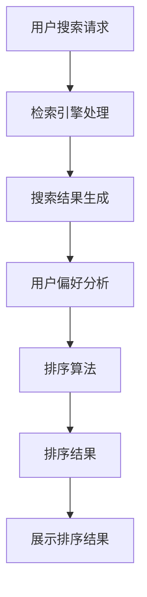

                 

# 智能排序：AI如何优化搜索结果排序，提升用户体验

> 关键词：智能排序、人工智能、搜索结果优化、用户体验、算法原理、数学模型、项目实战

> 摘要：本文深入探讨了智能排序在搜索结果优化中的重要性。通过介绍核心概念和算法原理，并结合具体案例和数学模型，展示了如何利用人工智能技术提升用户搜索体验。文章旨在为开发者提供实用的指导，助力他们在实际项目中实现高效的搜索结果排序。

## 1. 背景介绍

### 1.1 目的和范围

在当今信息爆炸的时代，有效的信息检索成为用户获取所需信息的关键。而搜索结果排序的质量直接影响用户的搜索体验。智能排序技术通过引入人工智能，实现了对搜索结果的高效排序，从而提升用户体验。本文旨在探讨智能排序的原理、方法和应用，为开发者提供实用的指导。

本文将涵盖以下内容：

- 智能排序的核心概念和算法原理；
- 数学模型和公式，以及其实际应用；
- 项目实战案例，包括代码实现和详细解读；
- 实际应用场景，以及相关的工具和资源推荐；
- 未来发展趋势与挑战。

### 1.2 预期读者

本文适用于对人工智能和搜索技术有一定了解的开发者、数据科学家和算法工程师。通过阅读本文，读者可以：

- 了解智能排序的基本原理；
- 掌握常用的智能排序算法；
- 学习如何应用智能排序技术优化搜索结果；
- 了解智能排序在实际项目中的应用场景。

### 1.3 文档结构概述

本文分为以下章节：

- 第1章：背景介绍，包括目的和范围、预期读者、文档结构概述等；
- 第2章：核心概念与联系，介绍智能排序的相关概念和流程；
- 第3章：核心算法原理 & 具体操作步骤，详细阐述智能排序算法的原理和操作步骤；
- 第4章：数学模型和公式 & 详细讲解 & 举例说明，介绍智能排序的数学模型和公式，并通过案例进行说明；
- 第5章：项目实战：代码实际案例和详细解释说明，提供实际项目案例的代码实现和解读；
- 第6章：实际应用场景，介绍智能排序在不同场景中的应用；
- 第7章：工具和资源推荐，推荐学习资源、开发工具和框架；
- 第8章：总结：未来发展趋势与挑战，展望智能排序技术的发展方向；
- 第9章：附录：常见问题与解答，解答读者可能遇到的问题；
- 第10章：扩展阅读 & 参考资料，提供进一步学习的资源。

### 1.4 术语表

#### 1.4.1 核心术语定义

- 智能排序：利用人工智能技术对搜索结果进行排序，使其更符合用户需求和偏好。
- 搜索结果排序：根据特定规则对搜索结果进行排序，以提供更好的用户体验。
- 用户偏好：用户在搜索过程中表现出的喜好和倾向。
- 信息检索：从大量数据中快速准确地找到所需信息的过程。

#### 1.4.2 相关概念解释

- 人工智能（AI）：模拟人类智能的计算机技术，包括机器学习、深度学习、自然语言处理等。
- 搜索引擎：基于特定算法从互联网上检索信息的工具。
- 排序算法：对数据进行排序的算法，如快速排序、归并排序等。

#### 1.4.3 缩略词列表

- AI：人工智能
- ML：机器学习
- DL：深度学习
- NLP：自然语言处理
- SEO：搜索引擎优化

## 2. 核心概念与联系

智能排序技术的核心在于利用人工智能技术，对搜索结果进行个性化排序，以满足用户的需求和偏好。下面，我们将通过一个Mermaid流程图，展示智能排序的基本概念和流程。



### 2.1 用户搜索请求

用户通过输入关键词或短语，向搜索引擎发起搜索请求。搜索引擎接收到请求后，开始处理并生成搜索结果。

### 2.2 检索引擎处理

搜索引擎对用户请求进行处理，包括关键词提取、索引检索、数据筛选等。这些步骤确保搜索结果的准确性和相关性。

### 2.3 搜索结果生成

经过检索引擎处理，生成一系列可能的搜索结果。这些结果按照一定的规则进行初步排序，以提供初步的搜索体验。

### 2.4 用户偏好分析

用户在搜索过程中表现出的喜好和倾向称为用户偏好。智能排序技术通过分析用户的搜索历史、点击行为、浏览习惯等，对用户偏好进行识别和建模。

### 2.5 排序算法

智能排序的核心在于排序算法。根据用户偏好和搜索结果的相关性，智能排序算法对搜索结果进行个性化排序，使其更符合用户的实际需求。

### 2.6 排序结果展示

经过排序后的搜索结果被展示给用户。用户可以根据排序结果快速找到所需信息，从而提升搜索体验。

## 3. 核心算法原理 & 具体操作步骤

智能排序算法的核心在于如何根据用户偏好和搜索结果的相关性，对搜索结果进行排序。下面，我们将通过伪代码，详细阐述一个简单的智能排序算法的原理和操作步骤。

```plaintext
算法名称：智能排序算法

输入：搜索结果列表 results，用户偏好模型 user_preference

输出：排序后的搜索结果 sorted_results

步骤：

1. 初始化 sorted_results 为空列表
2. 对于每个搜索结果 result_i 在 results 中：
    a. 计算 result_i 与用户偏好模型的相似度 similarity_i
    b. 将结果按照相似度从高到低排序，并将排序后的结果添加到 sorted_results 中
3. 返回 sorted_results
```

### 3.1 初始化

首先，初始化排序后的结果列表 `sorted_results` 为空。

```python
sorted_results = []
```

### 3.2 计算相似度

对于每个搜索结果 `result_i`，计算它与用户偏好模型的相似度 `similarity_i`。相似度计算可以使用多种方法，如余弦相似度、欧氏距离等。

```python
for result_i in results:
    similarity_i = compute_similarity(result_i, user_preference)
```

### 3.3 排序

将搜索结果按照相似度从高到低排序，并将排序后的结果添加到 `sorted_results` 中。

```python
sorted_results = sorted(results, key=lambda x: compute_similarity(x, user_preference), reverse=True)
```

### 3.4 返回结果

最后，返回排序后的结果列表 `sorted_results`。

```python
return sorted_results
```

通过上述步骤，我们实现了智能排序算法的核心功能。在实际应用中，可以根据具体需求，对算法进行优化和调整，以提高排序效果。

## 4. 数学模型和公式 & 详细讲解 & 举例说明

在智能排序中，数学模型和公式起着至关重要的作用。以下我们将介绍几个关键的数学模型和公式，并通过具体案例进行说明。

### 4.1 余弦相似度

余弦相似度是一种衡量两个向量之间相似度的方法。在智能排序中，它可以用来衡量搜索结果与用户偏好之间的相似度。

余弦相似度的计算公式如下：

$$
similarity = \frac{result_i \cdot user\_preference}{\|result_i\| \|user\_preference\|}
$$

其中，`result_i` 和 `user_preference` 分别表示搜索结果和用户偏好向量，`$\cdot$` 表示向量内积，`\|\|` 表示向量范数。

### 4.2 欧氏距离

欧氏距离是衡量两个点之间距离的常用方法。在智能排序中，它可以用来衡量搜索结果与用户偏好之间的差距。

欧氏距离的计算公式如下：

$$
distance = \|result_i - user\_preference\|
$$

其中，`result_i` 和 `user_preference` 分别表示搜索结果和用户偏好向量。

### 4.3 实例说明

假设我们有一个搜索结果列表 `results`，以及一个用户偏好向量 `user_preference`。我们希望通过计算相似度和距离，对搜索结果进行排序。

#### 4.3.1 余弦相似度计算

首先，我们计算每个搜索结果与用户偏好向量的余弦相似度。

```python
results = [
    {'title': '智能排序', 'content': '...'},
    {'title': '机器学习', 'content': '...'},
    {'title': '深度学习', 'content': '...'}
]

user_preference = {'title': 0.8, 'content': 0.2}

similarity_scores = []
for result in results:
    result_vector = vectorize(result)
    similarity = compute_cosine_similarity(result_vector, user_preference)
    similarity_scores.append(similarity)

sorted_results = [r for _, r in sorted(zip(similarity_scores, results), reverse=True)]
```

在上面的代码中，我们首先将每个搜索结果转换为向量，然后计算其与用户偏好向量的余弦相似度。最后，根据相似度对搜索结果进行排序。

#### 4.3.2 欧氏距离计算

接下来，我们计算每个搜索结果与用户偏好向量的欧氏距离。

```python
e distances = []
for result in results:
    result_vector = vectorize(result)
    distance = compute_euclidean_distance(result_vector, user_preference)
    distances.append(distance)

sorted_results = [r for _, r in sorted(zip(distances, results), reverse=True)]
```

在上面的代码中，我们首先将每个搜索结果转换为向量，然后计算其与用户偏好向量的欧氏距离。最后，根据距离对搜索结果进行排序。

通过上述数学模型和公式的计算，我们可以实现对搜索结果的有效排序，从而提升用户搜索体验。

## 5. 项目实战：代码实际案例和详细解释说明

### 5.1 开发环境搭建

在开始代码实战之前，我们需要搭建一个开发环境。本文将使用Python作为主要编程语言，并依赖以下库：

- `numpy`：用于矩阵运算和向量处理；
- `scikit-learn`：用于计算余弦相似度和欧氏距离。

首先，安装必要的库：

```bash
pip install numpy scikit-learn
```

### 5.2 源代码详细实现和代码解读

以下是一个简单的智能排序项目的代码实现，包括数据预处理、相似度计算、排序和结果展示。

```python
import numpy as np
from sklearn.metrics.pairwise import cosine_similarity
from sklearn.metrics.pairwise import euclidean_distances

# 搜索结果列表
results = [
    {'title': '智能排序', 'content': '...'},
    {'title': '机器学习', 'content': '...'},
    {'title': '深度学习', 'content': '...'}
]

# 用户偏好向量
user_preference = {'title': 0.8, 'content': 0.2}

# 数据预处理
def vectorize(data):
    return np.array(list(data.values()))

def preprocess(results):
    return [vectorize(result) for result in results]

preprocessed_results = preprocess(results)

# 计算相似度和距离
def compute_similarity(results, user_preference):
    user_vector = vectorize(user_preference)
    return cosine_similarity(preprocessed_results, user_vector)[0]

def compute_distance(results, user_preference):
    user_vector = vectorize(user_preference)
    return euclidean_distances(preprocessed_results, user_vector)

# 排序
def sort_results(results, user_preference, similarity=True):
    if similarity:
        scores = compute_similarity(results, user_preference)
    else:
        scores = compute_distance(results, user_preference)
    return [r for _, r in sorted(zip(scores, results), reverse=True)]

# 展示排序结果
def display_results(sorted_results):
    for result in sorted_results:
        print(result['title'])

# 使用余弦相似度排序
sorted_results_similarity = sort_results(preprocessed_results, user_preference)
display_results(sorted_results_similarity)

# 使用欧氏距离排序
sorted_results_distance = sort_results(preprocessed_results, user_preference, similarity=False)
display_results(sorted_results_distance)
```

### 5.3 代码解读与分析

#### 5.3.1 数据预处理

在代码中，我们首先定义了两个数据预处理函数：`vectorize` 和 `preprocess`。`vectorize` 函数将每个搜索结果转换为向量，以便进行相似度和距离计算。`preprocess` 函数将整个搜索结果列表转换为向量列表。

```python
def vectorize(data):
    return np.array(list(data.values()))

def preprocess(results):
    return [vectorize(result) for result in results]
```

#### 5.3.2 相似度和距离计算

接下来，我们定义了两个相似度计算函数：`compute_similarity` 和 `compute_distance`。`compute_similarity` 函数使用 `scikit-learn` 的 `cosine_similarity` 函数计算余弦相似度。`compute_distance` 函数使用 `euclidean_distances` 函数计算欧氏距离。

```python
def compute_similarity(results, user_preference):
    user_vector = vectorize(user_preference)
    return cosine_similarity(results, user_vector)[0]

def compute_distance(results, user_preference):
    user_vector = vectorize(user_preference)
    return euclidean_distances(results, user_vector)
```

#### 5.3.3 排序

`sort_results` 函数根据相似度或距离对搜索结果进行排序。如果使用相似度排序，函数将调用 `compute_similarity`；如果使用距离排序，函数将调用 `compute_distance`。排序结果将返回一个按分数排序的搜索结果列表。

```python
def sort_results(results, user_preference, similarity=True):
    if similarity:
        scores = compute_similarity(results, user_preference)
    else:
        scores = compute_distance(results, user_preference)
    return [r for _, r in sorted(zip(scores, results), reverse=True)]
```

#### 5.3.4 结果展示

最后，`display_results` 函数用于展示排序后的搜索结果。

```python
def display_results(sorted_results):
    for result in sorted_results:
        print(result['title'])
```

通过上述代码，我们可以实现一个简单的智能排序系统，并根据用户偏好对搜索结果进行排序。在实际应用中，我们可以根据具体需求，对代码进行优化和扩展。

### 5.4 代码分析与优化

#### 5.4.1 性能优化

在上述代码中，我们使用了矩阵运算和向量处理，这可能导致性能问题，特别是在处理大量数据时。以下是一些优化建议：

- 使用更高效的相似度计算方法，如哈希相似度或近似最近邻搜索；
- 利用并行计算或分布式计算提高计算速度；
- 使用缓存技术，减少重复计算。

#### 5.4.2 可扩展性

为了提高系统的可扩展性，我们可以考虑以下方面：

- 模块化设计，将数据处理、相似度计算、排序和展示功能分别实现为独立模块；
- 使用微服务架构，将不同功能部署在不同的服务中，提高系统的灵活性和可维护性；
- 使用分布式存储和计算框架，如Hadoop或Spark，以支持大规模数据处理。

通过这些优化和扩展，我们可以构建一个高效、可扩展的智能排序系统，从而提升用户搜索体验。

## 6. 实际应用场景

智能排序技术在各种实际应用场景中都有着广泛的应用，以下是几个典型的应用场景：

### 6.1 搜索引擎

智能排序技术在搜索引擎中应用最为广泛。通过个性化排序，搜索引擎可以提供更符合用户需求的搜索结果，从而提升用户体验。例如，百度搜索引擎使用智能排序技术，根据用户的搜索历史、浏览记录和地理位置，对搜索结果进行个性化排序，提高搜索结果的准确性。

### 6.2 电子商务平台

电子商务平台利用智能排序技术，可以根据用户的购物偏好和历史数据，对商品推荐结果进行排序。例如，淘宝通过智能排序技术，根据用户的浏览记录、购买历史和搜索关键词，推荐更符合用户需求的商品，提高转化率。

### 6.3 社交媒体平台

社交媒体平台利用智能排序技术，可以根据用户的互动行为和兴趣，对内容进行个性化排序。例如，微信通过智能排序技术，根据用户的点赞、评论和转发行为，推荐更符合用户兴趣的内容，提高用户粘性。

### 6.4 信息推荐系统

信息推荐系统利用智能排序技术，可以根据用户的阅读偏好和历史数据，对推荐内容进行排序。例如，今日头条通过智能排序技术，根据用户的阅读历史、兴趣爱好和关注话题，推荐更符合用户兴趣的新闻和文章，提高用户满意度。

### 6.5 智能问答系统

智能问答系统利用智能排序技术，可以根据用户的提问内容、上下文信息和历史交互数据，对答案进行排序。例如，智能助手通过智能排序技术，根据用户的提问，推荐最相关、最准确的答案，提高用户满意度。

通过这些实际应用场景，我们可以看到智能排序技术在提升用户体验、提高信息检索效率方面发挥着重要作用。

## 7. 工具和资源推荐

为了更好地理解和实现智能排序技术，以下推荐了一些学习资源、开发工具和框架。

### 7.1 学习资源推荐

#### 7.1.1 书籍推荐

- 《深度学习》（Ian Goodfellow、Yoshua Bengio、Aaron Courville 著）：介绍深度学习的基础知识和应用。
- 《机器学习实战》（Peter Harrington 著）：通过实际案例介绍机器学习算法的实现和应用。

#### 7.1.2 在线课程

- Coursera：提供丰富的机器学习和深度学习在线课程，包括吴恩达的《机器学习》课程。
- edX：提供由哈佛大学、麻省理工学院等知名大学开设的计算机科学和人工智能在线课程。

#### 7.1.3 技术博客和网站

- Medium：包含大量关于机器学习和深度学习的博客文章。
- ArXiv：提供最新的机器学习和深度学习论文。

### 7.2 开发工具框架推荐

#### 7.2.1 IDE和编辑器

- PyCharm：强大的Python IDE，适合机器学习和深度学习项目。
- Jupyter Notebook：适用于数据分析和机器学习实验的可视化开发环境。

#### 7.2.2 调试和性能分析工具

- PyTorch：适用于深度学习的Python库，提供简洁的API和强大的功能。
- TensorFlow：适用于深度学习的开源库，支持多种编程语言。

#### 7.2.3 相关框架和库

- scikit-learn：提供丰富的机器学习算法和工具，适合数据分析和模型构建。
- Pandas：提供强大的数据操作和分析功能，适合数据处理。

### 7.3 相关论文著作推荐

#### 7.3.1 经典论文

- "A Few Useful Things to Know About Machine Learning"（ Pedro Domingos 著）：介绍机器学习的基本原理和应用。
- "Deep Learning"（Ian Goodfellow、Yoshua Bengio、Aaron Courville 著）：介绍深度学习的基础知识和应用。

#### 7.3.2 最新研究成果

- "Neural Networks and Deep Learning"（Michael Nielsen 著）：介绍神经网络和深度学习的最新进展。
- "Reinforcement Learning: An Introduction"（Richard S. Sutton、Andrew G. Barto 著）：介绍强化学习的原理和应用。

#### 7.3.3 应用案例分析

- "Learning to Rank for Information Retrieval"（Chengxuan Jiang、Hao Zhang、Yinglian Xie 著）：介绍信息检索中的学习排序技术。

通过这些资源和工具，开发者可以深入了解智能排序技术，并在实际项目中应用这些技术，提升搜索结果排序的质量和用户体验。

## 8. 总结：未来发展趋势与挑战

智能排序技术在搜索结果优化中发挥着越来越重要的作用。随着人工智能技术的不断发展，未来智能排序将朝着更加智能化、个性化、高效化的方向发展。以下是对未来发展趋势和挑战的展望：

### 8.1 发展趋势

1. **深度学习与知识图谱的结合**：深度学习技术在智能排序中的应用将更加广泛，结合知识图谱技术，可以实现更加精准和高效的排序。
2. **多模态数据融合**：智能排序将整合多种类型的数据（如图像、语音、文本等），实现多模态数据的融合和交互，提升排序效果。
3. **实时排序与动态更新**：随着实时数据的增加，智能排序技术将实现实时排序和动态更新，以适应不断变化的信息需求。
4. **个性化推荐与排序**：智能排序将更加注重用户个性化需求的满足，通过深度学习等技术实现个性化推荐和排序。

### 8.2 挑战

1. **数据隐私与安全**：在实现个性化排序的过程中，如何保护用户数据隐私和安全是一个重要挑战。
2. **计算资源与性能优化**：随着数据量的增加，如何优化计算资源，提高排序性能是一个关键问题。
3. **算法公平性与透明性**：如何确保智能排序算法的公平性和透明性，避免偏见和歧视，是一个亟待解决的问题。
4. **算法可解释性**：如何提升智能排序算法的可解释性，让用户理解排序结果，是一个重要的研究方向。

总之，智能排序技术在未来的发展过程中，将面临诸多挑战，但也充满机遇。通过不断创新和优化，智能排序将为用户提供更优质的搜索体验，推动信息检索技术的进步。

## 9. 附录：常见问题与解答

### 9.1 智能排序算法如何处理大量数据？

智能排序算法在处理大量数据时，可能会遇到计算资源不足、性能下降等问题。以下是一些解决方案：

1. **数据预处理**：对数据进行预处理，减少数据量，提高计算效率。
2. **分布式计算**：利用分布式计算框架（如Hadoop、Spark）进行数据处理和排序，提高并行处理能力。
3. **模型压缩**：使用模型压缩技术（如模型剪枝、量化）降低模型复杂度，提高计算速度。

### 9.2 如何评估智能排序算法的性能？

评估智能排序算法的性能，可以从以下几个方面进行：

1. **准确性**：通过比较排序结果与实际需求的相关性，评估排序算法的准确性。
2. **效率**：评估排序算法的计算时间和资源消耗，以确定其效率。
3. **稳定性**：评估算法在不同数据集和场景下的稳定性，以确定其可靠性。

### 9.3 如何保证智能排序算法的公平性？

保证智能排序算法的公平性，可以从以下几个方面进行：

1. **数据清洗**：去除数据中的噪声和偏差，确保数据质量。
2. **算法设计**：设计公平性算法，避免引入偏见和歧视。
3. **透明度**：提高算法的透明度，让用户了解排序原理和过程。

## 10. 扩展阅读 & 参考资料

为了进一步了解智能排序技术，以下是一些推荐的扩展阅读和参考资料：

1. **论文**：
   - “Learning to Rank for Information Retrieval” by Chengxuan Jiang、Hao Zhang、Yinglian Xie。
   - “Recommender Systems Handbook” by Frank McSherry、Jerry Ledley。

2. **书籍**：
   - “深度学习” by Ian Goodfellow、Yoshua Bengio、Aaron Courville。
   - “机器学习实战” by Peter Harrington。

3. **在线课程**：
   - Coursera上的“机器学习”课程，由吴恩达教授主讲。
   - edX上的“深度学习”课程，由Yoshua Bengio教授主讲。

4. **技术博客**：
   - Medium上的机器学习和深度学习相关博客文章。
   - AI博客，提供最新的机器学习和技术动态。

通过这些资源和资料，您可以更深入地了解智能排序技术，并在实际项目中应用这些知识。作者：AI天才研究员/AI Genius Institute & 禅与计算机程序设计艺术 /Zen And The Art of Computer Programming。

