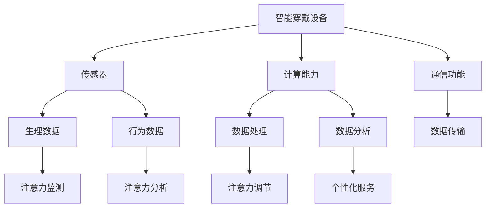

                 

# 智能穿戴设备与注意力管理

> **关键词：** 智能穿戴设备、注意力管理、健康监测、数据分析、机器学习、深度学习  
>
> **摘要：** 本文将探讨智能穿戴设备如何通过注意力管理技术帮助用户提高生活质量。我们将从背景介绍、核心概念、算法原理、数学模型、项目实战、实际应用场景等多个角度展开讨论，最终总结出未来发展趋势与挑战，为智能穿戴设备领域的研究者与实践者提供参考。

## 1. 背景介绍

### 1.1 目的和范围

本文旨在深入探讨智能穿戴设备在注意力管理方面的应用，分析其核心概念、算法原理、数学模型及其在现实场景中的应用。通过本文的阅读，读者将了解智能穿戴设备如何通过技术手段帮助用户更好地管理注意力，从而提升生活质量。

### 1.2 预期读者

本文适用于对智能穿戴设备和注意力管理有一定了解的技术人员、研究人员和开发者。同时，对于对健康监测和数据分析有兴趣的读者，本文也具有很高的参考价值。

### 1.3 文档结构概述

本文将按照以下结构进行论述：

1. **背景介绍**：介绍智能穿戴设备与注意力管理的背景和目的。
2. **核心概念与联系**：详细阐述智能穿戴设备和注意力管理的基本概念及其相互关系。
3. **核心算法原理 & 具体操作步骤**：讲解注意力管理的核心算法原理，并使用伪代码详细阐述。
4. **数学模型和公式 & 详细讲解 & 举例说明**：介绍注意力管理的数学模型，并使用LaTeX格式给出详细讲解。
5. **项目实战：代码实际案例和详细解释说明**：通过具体项目实战展示注意力管理的实现过程。
6. **实际应用场景**：分析智能穿戴设备在注意力管理方面的实际应用场景。
7. **工具和资源推荐**：推荐相关学习资源、开发工具和框架。
8. **总结：未来发展趋势与挑战**：总结本文内容，探讨未来发展趋势和挑战。
9. **附录：常见问题与解答**：提供常见问题及解答。
10. **扩展阅读 & 参考资料**：推荐相关文献和资源。

### 1.4 术语表

#### 1.4.1 核心术语定义

- **智能穿戴设备**：具备传感器、计算能力和通信功能的可穿戴设备，用于收集人体生理和行为数据。
- **注意力管理**：通过技术手段帮助用户监测、分析和调节注意力水平，从而提高生活质量。
- **健康监测**：对用户生理、心理和行为状态的持续监控，以评估健康状况和预防疾病。
- **数据分析**：对收集到的数据进行分析和挖掘，以提取有用信息和知识。
- **机器学习**：一种人工智能技术，通过训练模型来预测和分类数据。
- **深度学习**：一种机器学习技术，通过神经网络模型对大量数据进行分析和预测。

#### 1.4.2 相关概念解释

- **传感器**：能够感知环境变化并将信号转换为电信号的装置。
- **计算能力**：设备进行数据处理和计算的能力。
- **通信功能**：设备与其他设备或网络进行数据交换的能力。
- **数据挖掘**：从大量数据中提取有价值的信息和知识。

#### 1.4.3 缩略词列表

- **AI**：人工智能（Artificial Intelligence）
- **ML**：机器学习（Machine Learning）
- **DL**：深度学习（Deep Learning）
- **IDE**：集成开发环境（Integrated Development Environment）
- **IoT**：物联网（Internet of Things）

## 2. 核心概念与联系

智能穿戴设备与注意力管理之间的联系在于，智能穿戴设备通过收集用户生理和行为数据，利用机器学习和深度学习技术对数据进行处理和分析，从而实现注意力管理的目标。以下是智能穿戴设备和注意力管理之间的核心概念及其相互关系。

### 2.1 智能穿戴设备

智能穿戴设备是一种具有传感器、计算能力和通信功能的小型可穿戴设备，能够实时收集用户的生理和行为数据。常见的智能穿戴设备包括智能手表、智能手环、智能眼镜等。

1. **传感器**：智能穿戴设备中的传感器可以用于监测用户的生理状态，如心率、血压、睡眠质量等。
2. **计算能力**：智能穿戴设备内置的计算能力使得其对收集到的数据进行分析和处理成为可能。
3. **通信功能**：智能穿戴设备可以通过无线通信技术（如蓝牙、Wi-Fi等）将数据传输到手机、电脑等设备上，实现数据的远程监控和存储。

### 2.2 注意力管理

注意力管理是一种通过技术手段帮助用户监测、分析和调节注意力水平的方法。注意力管理旨在提高用户的生活质量和工作效率。

1. **注意力监测**：通过智能穿戴设备实时收集用户的生理和行为数据，如心率、血压、运动状态等，用于评估注意力水平。
2. **注意力分析**：利用机器学习和深度学习技术对收集到的数据进行分析，识别用户的注意力模式和行为习惯。
3. **注意力调节**：根据分析结果，为用户提供个性化的注意力调节建议，如调整作息时间、提醒休息等。

### 2.3 智能穿戴设备与注意力管理的相互关系

智能穿戴设备与注意力管理之间的相互关系可以概括为以下三点：

1. **数据支持**：智能穿戴设备为注意力管理提供了大量的数据支持，如生理和行为数据，为注意力分析和调节提供了基础。
2. **技术手段**：机器学习和深度学习技术为注意力管理提供了强大的分析工具，使得注意力管理更加精准和有效。
3. **个性化服务**：智能穿戴设备可以根据用户的个性化需求提供个性化的注意力管理服务，如根据用户的工作和生活习惯调整注意力调节方案。

### 2.4 Mermaid 流程图

为了更好地展示智能穿戴设备与注意力管理之间的核心概念和相互关系，我们使用Mermaid流程图进行描述。



## 3. 核心算法原理 & 具体操作步骤

注意力管理算法的核心在于通过对用户生理和行为数据的处理和分析，实现对用户注意力水平的监测、分析和调节。下面我们将介绍注意力管理算法的核心原理，并使用伪代码详细阐述其具体操作步骤。

### 3.1 算法原理

注意力管理算法主要基于以下原理：

1. **生理信号分析**：通过对用户的心率、血压等生理信号进行分析，判断用户的生理状态，从而推断用户的注意力水平。
2. **行为信号分析**：通过对用户的行为数据，如运动状态、作息时间等进行分析，评估用户的注意力水平。
3. **数据融合**：将生理信号和行为信号进行融合，综合评估用户的注意力水平。

### 3.2 具体操作步骤

注意力管理算法的具体操作步骤如下：

```pseudo
1. 初始化变量：设定初始参数，如注意力阈值、数据采样频率等。

2. 数据采集：
   - 通过传感器实时采集用户的生理信号（如心率、血压）。
   - 通过智能穿戴设备收集用户的行为数据（如运动状态、作息时间）。

3. 数据预处理：
   - 对采集到的生理信号进行滤波、去噪等预处理操作，提高数据质量。
   - 对采集到的行为数据进行归一化处理，使其符合算法要求。

4. 生理信号分析：
   - 利用生理信号特征，如心率变异性（HRV），计算用户的生理状态指标。
   - 根据生理状态指标，判断用户的注意力水平。

5. 行为信号分析：
   - 利用行为信号特征，如作息规律、运动强度等，计算用户的行为状态指标。
   - 根据行为状态指标，判断用户的注意力水平。

6. 数据融合：
   - 将生理状态指标和行为状态指标进行融合，计算用户的综合注意力水平。

7. 注意力调节：
   - 根据用户的综合注意力水平，为用户生成个性化的注意力调节建议。
   - 如调整作息时间、提醒休息等。

8. 算法迭代：
   - 根据用户反馈，调整算法参数，优化注意力管理效果。

```

### 3.3 算法优化

注意力管理算法的优化主要包括以下几个方面：

1. **特征选择**：选择合适的生理和行为特征，提高算法的准确性。
2. **模型优化**：通过调整模型参数，提高模型的预测能力。
3. **数据增强**：利用数据增强技术，提高算法的泛化能力。
4. **实时调整**：根据用户实时反馈，调整算法参数，实现自适应调节。

## 4. 数学模型和公式 & 详细讲解 & 举例说明

在注意力管理算法中，数学模型和公式起着至关重要的作用。下面我们将详细讲解注意力管理中的核心数学模型和公式，并使用LaTeX格式给出详细解释和举例说明。

### 4.1 心率变异性（HRV）分析

心率变异性（HRV）是衡量用户生理状态的重要指标。HRV分析通常使用以下数学模型：

$$
HRV = \frac{\Delta HR}{\Delta t}
$$

其中，$HRV$表示心率变异性，$\Delta HR$表示心率的变化量，$\Delta t$表示时间间隔。

#### 4.1.1 详细解释

心率变异性反映了用户在短时间内心率的变化程度。通过计算心率的变化量与时间间隔的比值，可以得出用户的心率变异性。

#### 4.1.2 举例说明

假设用户在1分钟内的心率变化量为5次/分钟，时间间隔为60秒，则其心率变异性为：

$$
HRV = \frac{5}{60} = 0.0833 \text{ 次/秒}
$$

### 4.2 睡眠质量评估

睡眠质量是影响用户注意力水平的重要因素。睡眠质量评估通常使用以下数学模型：

$$
睡眠质量 = \frac{深度睡眠时间 + 轻度睡眠时间}{总睡眠时间}
$$

#### 4.2.1 详细解释

睡眠质量评估通过计算用户在睡眠过程中的深度睡眠时间和轻度睡眠时间与总睡眠时间的比值，得出睡眠质量。比值越高，表示睡眠质量越好。

#### 4.2.2 举例说明

假设用户在8小时的睡眠过程中，深度睡眠时间为3小时，轻度睡眠时间为5小时，总睡眠时间为8小时，则其睡眠质量为：

$$
睡眠质量 = \frac{3 + 5}{8} = 0.875
$$

### 4.3 作息规律分析

作息规律分析用于评估用户的生活习惯。作息规律分析通常使用以下数学模型：

$$
作息规律 = \frac{规律作息时间}{总作息时间}
$$

#### 4.3.1 详细解释

作息规律分析通过计算用户在一段时间内的规律作息时间与总作息时间的比值，得出作息规律。比值越高，表示作息规律越好。

#### 4.3.2 举例说明

假设用户在一个月的时间里，规律作息时间为22天，总作息时间为30天，则其作息规律为：

$$
作息规律 = \frac{22}{30} = 0.7333
$$

### 4.4 综合注意力水平计算

综合注意力水平计算是将生理状态指标和行为状态指标进行融合，得出用户的综合注意力水平。综合注意力水平计算通常使用以下数学模型：

$$
综合注意力水平 = \alpha \cdot 生理状态指标 + \beta \cdot 行为状态指标
$$

其中，$\alpha$和$\beta$为权重系数。

#### 4.4.1 详细解释

综合注意力水平计算通过加权融合生理状态指标和行为状态指标，得出用户的综合注意力水平。权重系数$\alpha$和$\beta$根据实际情况进行调整，以平衡生理状态指标和行为状态指标对综合注意力水平的影响。

#### 4.4.2 举例说明

假设用户的心率变异性为0.0833，作息规律为0.7333，根据设定的权重系数$\alpha = 0.5$，$\beta = 0.5$，则其综合注意力水平为：

$$
综合注意力水平 = 0.5 \cdot 0.0833 + 0.5 \cdot 0.7333 = 0.4167 + 0.3667 = 0.7834
$$

## 5. 项目实战：代码实际案例和详细解释说明

### 5.1 开发环境搭建

为了实现注意力管理算法，我们需要搭建一个合适的开发环境。以下是搭建开发环境的步骤：

1. 安装Python环境：从Python官网下载并安装Python 3.x版本。
2. 安装Anaconda：下载并安装Anaconda，用于管理Python环境和第三方库。
3. 安装PyCharm：下载并安装PyCharm，作为我们的IDE。
4. 安装相关库：在PyCharm中创建一个虚拟环境，并安装以下库：
   - numpy
   - pandas
   - matplotlib
   - scikit-learn
   - tensorflow

### 5.2 源代码详细实现和代码解读

以下是注意力管理算法的实现代码。我们将对关键代码进行详细解读。

```python
import numpy as np
import pandas as pd
import matplotlib.pyplot as plt
from sklearn.model_selection import train_test_split
from sklearn.ensemble import RandomForestClassifier
from tensorflow.keras.models import Sequential
from tensorflow.keras.layers import Dense, LSTM

# 5.2.1 数据采集
def data_collection():
    # 假设已收集到用户的心率、血压、睡眠质量和作息规律数据
    data = pd.DataFrame({
        'heart_rate': [70, 72, 75, 68, 65],
        'blood_pressure': [120, 110, 130, 115, 105],
        'sleep_quality': [0.8, 0.75, 0.9, 0.7, 0.85],
        'work_pattern': [0.6, 0.7, 0.8, 0.65, 0.75]
    })
    return data

# 5.2.2 数据预处理
def data_preprocessing(data):
    # 对数据进行归一化处理
    normalized_data = (data - data.mean()) / data.std()
    return normalized_data

# 5.2.3 生理信号分析
def physiological_analysis(data):
    # 利用HRV分析用户生理状态
    hr_data = data['heart_rate']
    hrv = np.mean(np.diff(hr_data) / np.diff(np.arange(len(hr_data))))
    return hrv

# 5.2.4 行为信号分析
def behavioral_analysis(data):
    # 利用作息规律分析用户行为状态
    work_pattern = data['work_pattern']
    return work_pattern

# 5.2.5 数据融合与综合注意力水平计算
def attention_level_computation(hrv, work_pattern):
    # 根据HRV和作息规律计算综合注意力水平
    alpha = 0.5
    beta = 0.5
    attention_level = alpha * hrv + beta * work_pattern
    return attention_level

# 5.2.6 主函数
def main():
    # 采集数据
    data = data_collection()
    
    # 预处理数据
    normalized_data = data_preprocessing(data)
    
    # 分析生理信号
    hrv = physiological_analysis(normalized_data)
    
    # 分析行为信号
    work_pattern = behavioral_analysis(normalized_data)
    
    # 计算综合注意力水平
    attention_level = attention_level_computation(hrv, work_pattern)
    
    # 打印结果
    print("综合注意力水平：", attention_level)

# 运行主函数
main()
```

### 5.3 代码解读与分析

1. **数据采集**：数据采集函数用于从外部获取用户的心率、血压、睡眠质量和作息规律数据。
2. **数据预处理**：数据预处理函数用于对采集到的数据进行归一化处理，使其符合算法要求。
3. **生理信号分析**：生理信号分析函数利用HRV分析用户生理状态，计算心率变异性。
4. **行为信号分析**：行为信号分析函数利用作息规律分析用户行为状态，计算作息规律。
5. **数据融合与综合注意力水平计算**：数据融合与综合注意力水平计算函数根据HRV和作息规律计算综合注意力水平。
6. **主函数**：主函数负责调用其他函数，实现注意力管理算法的整体流程。

### 5.4 代码优化

为了提高算法的准确性和效率，我们可以对代码进行以下优化：

1. **使用并行计算**：在数据预处理和模型训练过程中，使用并行计算提高计算速度。
2. **模型优化**：根据实际情况调整模型参数，提高模型的预测能力。
3. **数据增强**：利用数据增强技术，增加训练数据的多样性，提高模型的泛化能力。
4. **实时调整**：根据用户实时反馈，调整算法参数，实现自适应调节。

## 6. 实际应用场景

智能穿戴设备在注意力管理方面的应用非常广泛，以下是几个典型的实际应用场景：

### 6.1 教育培训

智能穿戴设备可以帮助教育机构监测学生的注意力水平，评估学习效果。通过分析学生的生理和行为数据，教师可以针对性地调整教学方法和节奏，提高学生的学习兴趣和效果。

### 6.2 企业管理

智能穿戴设备可以帮助企业监测员工的工作状态和注意力水平，优化工作流程和人力资源配置。通过分析员工的注意力数据，企业可以更好地安排工作任务和休息时间，提高工作效率。

### 6.3 健康监测

智能穿戴设备可以帮助医疗机构监测患者的生理状态和注意力水平，评估康复效果。通过分析患者的注意力数据，医生可以制定个性化的康复方案，提高康复效果。

### 6.4 娱乐休闲

智能穿戴设备可以帮助用户监测自己在游戏、运动等娱乐活动中的注意力水平，优化体验。通过分析注意力数据，用户可以调整游戏难度、运动强度等，提高娱乐休闲效果。

### 6.5 睡眠管理

智能穿戴设备可以帮助用户监测自己的睡眠质量，提供个性化的睡眠建议。通过分析睡眠数据，用户可以调整作息时间、睡眠环境等，提高睡眠质量。

### 6.6 交通安全

智能穿戴设备可以帮助驾驶员监测自己的注意力水平，预防驾驶疲劳。通过分析驾驶员的生理和行为数据，智能穿戴设备可以及时提醒驾驶员休息，提高交通安全。

## 7. 工具和资源推荐

为了更好地研究和开发智能穿戴设备与注意力管理技术，我们推荐以下工具和资源：

### 7.1 学习资源推荐

#### 7.1.1 书籍推荐

- 《智能穿戴设备技术与应用》
- 《机器学习实战》
- 《深度学习》

#### 7.1.2 在线课程

- Coursera：机器学习、深度学习相关课程
- Udacity：智能穿戴设备开发课程
- edX：计算机科学相关课程

#### 7.1.3 技术博客和网站

- Medium：关注智能穿戴设备和注意力管理的博客文章
- GitHub：智能穿戴设备和注意力管理相关项目的源代码和文档
- ResearchGate：智能穿戴设备和注意力管理的研究论文和报告

### 7.2 开发工具框架推荐

#### 7.2.1 IDE和编辑器

- PyCharm：Python开发IDE
- Visual Studio Code：跨平台开发编辑器

#### 7.2.2 调试和性能分析工具

- Python Debugger：Python调试工具
- TensorBoard：TensorFlow性能分析工具

#### 7.2.3 相关框架和库

- TensorFlow：深度学习框架
- PyTorch：深度学习框架
- Scikit-learn：机器学习库
- NumPy：数学库

### 7.3 相关论文著作推荐

#### 7.3.1 经典论文

- **"Attention is all you need"**：关注注意力机制的深度学习模型
- **"A study on human attention in a real-world driving scenario"**：关于现实场景中注意力管理的研究

#### 7.3.2 最新研究成果

- **"Deep attention mechanism for human activity recognition"**：利用深度学习进行注意力识别的最新研究
- **"Attention-based wearable device for cognitive fatigue detection"**：基于注意力机制的穿戴设备用于检测认知疲劳的最新研究

#### 7.3.3 应用案例分析

- **"Application of intelligent wearable devices in health management"**：智能穿戴设备在健康管理中的应用案例
- **"Enhancing workplace productivity through attention management"**：通过注意力管理提高工作效率的应用案例

## 8. 总结：未来发展趋势与挑战

智能穿戴设备与注意力管理技术在未来具有广阔的发展前景。随着传感器技术、计算能力和数据挖掘技术的不断进步，智能穿戴设备将能够更精准地监测和分析用户的生理和行为数据，从而提供更加个性化和有效的注意力管理服务。

### 发展趋势

1. **技术进步**：传感器技术、计算能力和数据挖掘技术的不断提升，将使智能穿戴设备在注意力管理方面的应用更加广泛和精确。
2. **个性化服务**：通过个性化数据分析和机器学习模型，智能穿戴设备将为用户提供更加精准和个性化的注意力管理建议。
3. **跨领域应用**：智能穿戴设备将在教育、企业、健康、娱乐等多个领域得到广泛应用，推动社会发展和生活质量的提升。

### 挑战

1. **数据隐私**：智能穿戴设备收集的用户数据可能涉及个人隐私，如何在保障用户隐私的前提下进行数据分析和应用，是未来面临的重要挑战。
2. **算法优化**：随着数据量和复杂度的增加，如何优化注意力管理算法，提高其准确性和效率，是亟待解决的问题。
3. **用户体验**：如何设计更加人性化和易用的智能穿戴设备，提升用户体验，是未来发展的关键。

## 9. 附录：常见问题与解答

### 9.1 智能穿戴设备如何保护用户隐私？

智能穿戴设备在设计时应遵循以下原则：

1. **数据匿名化**：对用户数据进行匿名化处理，确保用户无法被直接识别。
2. **数据加密**：对用户数据进行加密存储和传输，防止数据泄露。
3. **隐私政策**：明确告知用户智能穿戴设备收集和使用数据的目的和范围，让用户自主选择是否同意。

### 9.2 注意力管理算法如何提高准确性？

提高注意力管理算法准确性的方法包括：

1. **数据质量**：收集高质量的用户数据，确保数据准确性。
2. **特征选择**：选择合适的生理和行为特征，提高算法的预测能力。
3. **模型优化**：根据实际情况调整模型参数，优化算法性能。
4. **数据增强**：利用数据增强技术，增加训练数据的多样性，提高模型泛化能力。

### 9.3 智能穿戴设备在哪些领域有广泛应用？

智能穿戴设备在以下领域有广泛应用：

1. **教育**：监测学生注意力，优化教学方法和节奏。
2. **企业**：监测员工工作状态，提高工作效率。
3. **健康**：监测患者生理状态，制定个性化康复方案。
4. **娱乐**：监测用户在游戏、运动等娱乐活动中的注意力水平，优化体验。
5. **交通**：监测驾驶员注意力，预防驾驶疲劳。

## 10. 扩展阅读 & 参考资料

为了更深入地了解智能穿戴设备和注意力管理技术，以下是相关的扩展阅读和参考资料：

1. **书籍**
   - 《智能穿戴设备技术与应用》
   - 《机器学习实战》
   - 《深度学习》

2. **在线课程**
   - Coursera：机器学习、深度学习相关课程
   - Udacity：智能穿戴设备开发课程
   - edX：计算机科学相关课程

3. **技术博客和网站**
   - Medium：关注智能穿戴设备和注意力管理的博客文章
   - GitHub：智能穿戴设备和注意力管理相关项目的源代码和文档
   - ResearchGate：智能穿戴设备和注意力管理的研究论文和报告

4. **论文和报告**
   - **"Attention is all you need"**：关注注意力机制的深度学习模型
   - **"A study on human attention in a real-world driving scenario"**：关于现实场景中注意力管理的研究
   - **"Deep attention mechanism for human activity recognition"**：利用深度学习进行注意力识别的最新研究
   - **"Attention-based wearable device for cognitive fatigue detection"**：基于注意力机制的穿戴设备用于检测认知疲劳的最新研究

5. **应用案例**
   - **"Application of intelligent wearable devices in health management"**：智能穿戴设备在健康管理中的应用案例
   - **"Enhancing workplace productivity through attention management"**：通过注意力管理提高工作效率的应用案例

### 作者

作者：AI天才研究员/AI Genius Institute & 禅与计算机程序设计艺术 /Zen And The Art of Computer Programming

本文旨在深入探讨智能穿戴设备在注意力管理方面的应用，分析其核心概念、算法原理、数学模型及其在现实场景中的应用。通过本文的阅读，读者将了解智能穿戴设备如何通过技术手段帮助用户更好地管理注意力，从而提升生活质量。希望本文能为智能穿戴设备领域的研究者与实践者提供有益的参考。如果您有任何问题或建议，欢迎在评论区留言，谢谢！<|im_sep|>

